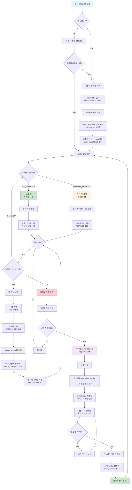

```mermaid
flowchart TD
    A[앱 다운로드 및 설치] --> B{첫 실행인가?}
    
    B -->|Yes| C[사용자 등록 창 표시]
    B -->|No| D[기존 사용자 정보 로드]
    
    C --> E[사용자 정보 입력<br/>이메일, 이름, 전화번호]
    E --> F[하드웨어 지문 생성]
    F --> G[구글 시트에 등록 정보 저장<br/>registrations 테이블]
    G --> H[체험판 크레딧 2000 할당<br/>credit_sync 테이블 생성]
    
    D --> I{등록된 사용자인가?}
    I -->|No| C
    I -->|Yes| J[크레딧 잔고 확인]
    
    H --> J
    J --> K{크레딧 타입 확인}
    
    K -->|trial_credits = -1| L[무료 앱<br/>무제한 사용]
    K -->|purchased_credits = -1| M[영구 라이선스<br/>무제한 사용]
    K -->|정상 크레딧| N{충분한 크레딧 있음?}
    
    N -->|Yes| O[앱 기능 실행]
    N -->|No| P[크레딧 부족 알림]
    
    O --> Q[작업 수행<br/>파일 처리 등]
    Q --> R[크레딧 차감<br/>체험판 → 구매 순서]
    R --> S[usage_history에 기록]
    S --> T[credit_sync 업데이트<br/>credit_changed = true]
    T --> U[동기화 스케줄러가<br/>구글 시트 동기화]
    U --> V{작업 계속?}
    V -->|Yes| N
    V -->|No| W[앱 종료]
    
    P --> X[크레딧 구매 안내]
    X --> Y{구매 의사 있음?}
    Y -->|No| W
    Y -->|Yes| Z[네이버 스마트스토어로<br/>이동하여 구매]
    
    Z --> AA[구매 완료]
    AA --> BB[관리자가 purchase_history에<br/>구매 정보 수동 입력]
    BB --> CC[활성화 코드 생성 및<br/>구매자 이메일 발송]
    CC --> DD[사용자가 앱에서<br/>활성화 코드 입력]
    DD --> EE{유효한 코드인가?}
    
    EE -->|No| FF[오류 메시지 표시]
    FF --> DD
    EE -->|Yes| GG[하드웨어 지문과 연결]
    GG --> HH[구매 크레딧 활성화<br/>credit_sync 업데이트]
    HH --> II[활성화 완료 알림]
    II --> J
    
    L --> QQ[무료 기능 실행]
    QQ --> RR[사용 내역만 기록<br/>크레딧 차감 없음]
    RR --> V
    
    M --> SS[영구 라이선스 기능 실행]
    SS --> TT[사용 내역만 기록<br/>크레딧 차감 없음]
    TT --> V
    
    style A fill:#e1f5fe
    style L fill:#c8e6c9
    style M fill:#fff3e0
    style P fill:#ffcdd2
    style Z fill:#f3e5f5
    style II fill:#c8e6c9
```