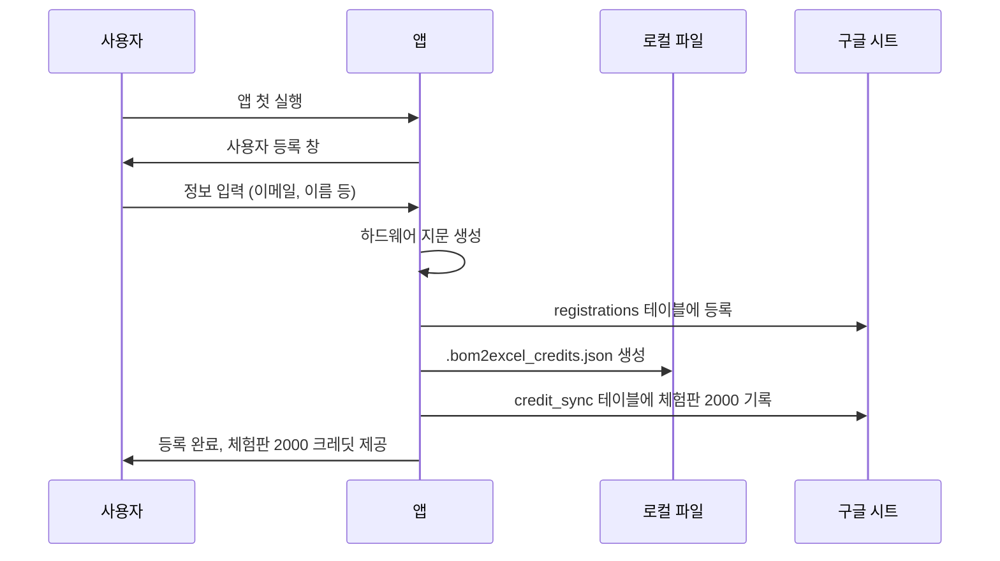
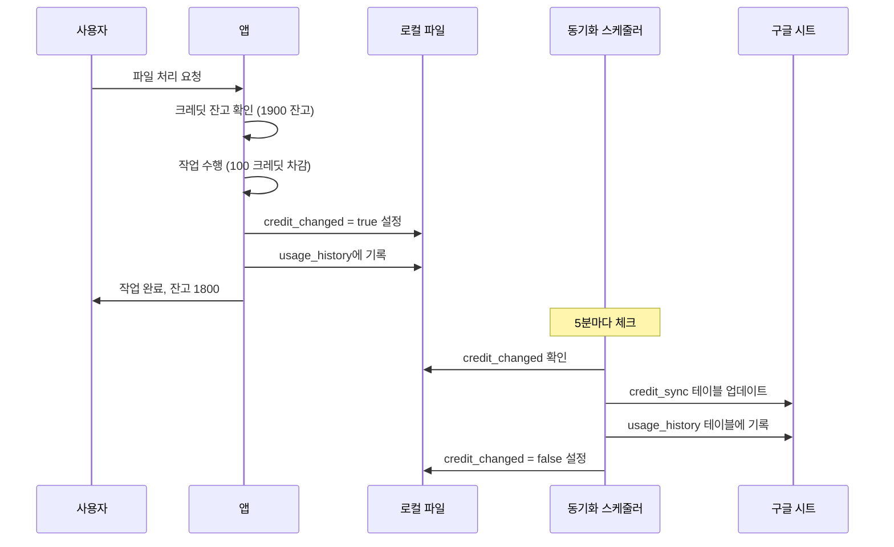
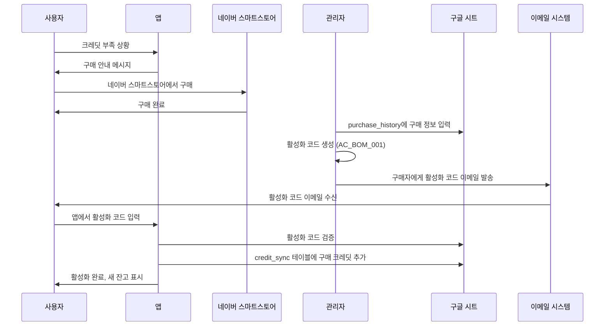

## 시나리오 1: 신규 사용자 체험판 사용

```mermaid
sequenceDiagram
    participant U as 사용자
    participant A as 앱
    participant L as 로컬 파일
    participant G as 구글 시트
    
    U->>A: 앱 첫 실행
    A->>U: 사용자 등록 창
    U->>A: 정보 입력 (이메일, 이름 등)
    A->>A: 하드웨어 지문 생성
    A->>G: registrations 테이블에 등록
    A->>L: .bom2excel_credits.json 생성
    A->>G: credit_sync 테이블에 체험판 2000 기록
    A->>U: 등록 완료, 체험판 2000 크레딧 제공
```

## 시나리오 2: 크레딧 사용 및 동기화

```mermaid
sequenceDiagram
    participant U as 사용자
    participant A as 앱
    participant L as 로컬 파일
    participant S as 동기화 스케줄러
    participant G as 구글 시트
    
    U->>A: 파일 처리 요청
    A->>A: 크레딧 잔고 확인 (1900 잔고)
    A->>A: 작업 수행 (100 크레딧 차감)
    A->>L: credit_changed = true 설정
    A->>L: usage_history에 기록
    A->>U: 작업 완료, 잔고 1800
    
    Note over S: 5분마다 체크
    S->>L: credit_changed 확인
    S->>G: credit_sync 테이블 업데이트
    S->>G: usage_history 테이블에 기록
    S->>L: credit_changed = false 설정
```

## 시나리오 3: 크레딧 구매 및 활성화

```mermaid
sequenceDiagram
    participant U as 사용자
    participant A as 앱
    participant N as 네이버 스마트스토어
    participant Admin as 관리자
    participant G as 구글 시트
    participant E as 이메일 시스템
    
    U->>A: 크레딧 부족 상황
    A->>U: 구매 안내 메시지
    U->>N: 네이버 스마트스토어에서 구매
    N->>U: 구매 완료
    
    Admin->>G: purchase_history에 구매 정보 입력
    Admin->>Admin: 활성화 코드 생성 (AC_BOM_001)
    Admin->>E: 구매자에게 활성화 코드 이메일 발송
    
    E->>U: 활성화 코드 이메일 수신
    U->>A: 앱에서 활성화 코드 입력
    A->>G: 활성화 코드 검증
    A->>G: credit_sync 테이블에 구매 크레딧 추가
    A->>U: 활성화 완료, 새 잔고 표시
```