<style>
.warning-icon {
  display: inline-block;
  width: 1.2em;
  height: 1.2em;
  background: #ff9800;
  color: white;
  text-align: center;
  line-height: 1.2em;
  border-radius: 3px;
  font-weight: bold;
  font-size: 0.9em;
  margin-right: 0.2em;
}

.info-icon {
  display: inline-block;
  width: 1.2em;
  height: 1.2em;
  background: #2196F3;
  color: white;
  text-align: center;
  line-height: 1.2em;
  border-radius: 50%;
  font-weight: bold;
  font-size: 0.9em;
  margin-right: 0.2em;
}

.check-icon {
  display: inline-block;
  width: 1.2em;
  height: 1.2em;
  background: #4CAF50;
  color: white;
  text-align: center;
  line-height: 1.2em;
  border-radius: 3px;
  font-weight: bold;
  font-size: 0.9em;
  margin-right: 0.2em;
}

.cross-icon {
  display: inline-flex;
  align-items: center;
  justify-content: center;
  width: 1.2em;
  height: 1.2em;
  background: #f44336;
  color: white;
  border-radius: 3px;
  font-weight: bold;
  font-size: 1em;
  margin-right: 0.2em;
  vertical-align: middle;
}

.center-box {
  padding: 20px 40px;
  background: #f0f0f0;
  border-radius: 8px;
}
</style>

# BOM Exporter 사용자 매뉴얼

> **버전**: v0.9.1  
> **최종 업데이트**: 2026-01-05  
> **제작**: WorksFree

---

## 목차

1. [프로그램 소개](#1-프로그램-소개)
2. [설치 및 실행](#2-설치-및-실행)
3. [사용자 등록](#3-사용자-등록)
4. [기본 사용법](#4-기본-사용법)
5. [크레딧 관리](#5-크레딧-관리)
6. [고급 기능](#6-고급-기능)
7. [문제 해결](#7-문제-해결)

---

## 1. 프로그램 소개

### 1.1 BOM Exporter란?

BOM Exporter는 SOLIDWORKS 어셈블리 파일(.sldasm)의 BOM(Bill of Materials) 정보를 Excel 파일로 저장하는 작업을 자동으로 수행해주는 프로그램입니다.

### 1.2 주요 기능

- <span class="check-icon">✓</span>지정한 폴더 내 SOLIDWORKS 어셈블리 목록 읽어오기
- <span class="check-icon">✓</span>BOM 정보 Excel 변환 (.xlsx)
- <span class="check-icon">✓</span>배치 처리 지원 (여러 파일 묶음 처리)
- <span class="check-icon">✓</span>진행 상황 실시간 모니터링
- <span class="check-icon">✓</span>크레딧 기반 사용량 관리
- <span class="check-icon">✓</span>작업 중단 시 이어서 수행 가능(실험중인 기능)

### 1.3 시스템 요구사항

- **운영체제**: Windows 10/11 (64bit)
- **필수 프로그램**: SOLIDWORKS (2016 이상 권장)
- **메모리**: 4GB RAM 이상
- **디스크 공간**: 500MB 이상

---

<div style="page-break-after: always;"></div>

---

## 2. 설치 및 실행

### 2.1 프로그램 다운로드

1. WorksFree 공식 웹사이트 또는 제공받은 링크에서 압축 파일 또는 설치 파일을 다운로드합니다.
   
2. 다운로드를 받으면 `bom_exporter_vX.X.X.X_portable.zip` 형식의 파일이 저장됩니다.

<div style="position: relative; display: inline-block; margin: 10px auto; overflow: hidden; border: 2px solid #666; border-radius: 10px;">
  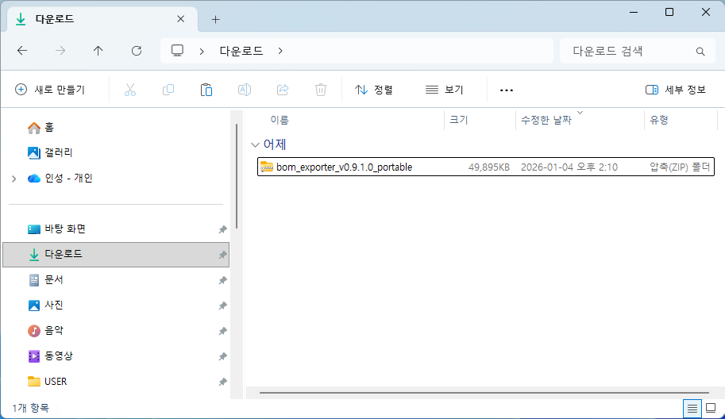
</div>

### 2.2 압축 해제

1. 다운로드한 ZIP 파일을 원하는 위치에서 압축 해제합니다.
   - **권장 경로**: `C:\WorksFree\bom_exporter` 또는 `D:\WorksFree\bom_exporter`
   - <span class="warning-icon">!</span>**주의**: 경로에 다음 문자들을 사용하지 마세요
     - Windows 파일시스템 금지 문자: `*` `:` `?` `"` `<` `>` `|` `/` `\`
     - 특수기호: `★` `◈` `☞` `〉` `⅓` `⅔` `①` 등
     - <span class="cross-icon">×</span>잘못된 예: `C:\Work★Free\bom`, `D:\Apps◈BOM`, `C:\My①Folder\app`
     - <span class="check-icon">✓</span>올바른 예: `C:\WorksFree\bom_exporter`, `D:\Apps\bom_exporter`, `C:\사용자\BOM 추출`

<!-- <div style="position: relative; display: inline-block; margin: 10px auto; overflow: hidden; border: 2px solid #666; border-radius: 10px;">
  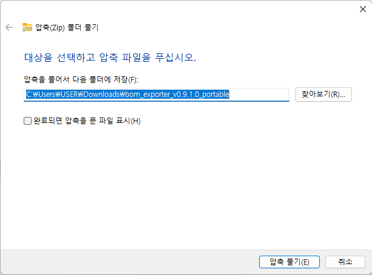
</div> -->

2. 압축 해제 후 폴더 구조:
   ```
   bom_exporter_vX.X.X_portable/
   ├── bom_exporter.exe              # 실행 파일
   ├── create_desktop_shortcut.bat   # 바로가기 생성 스크립트
   ├── _internal/                     # 필수 라이브러리
   └── ...
   ```
<div style="position: relative; display: inline-block; margin: 10px auto; overflow: hidden; border: 2px solid #666; border-radius: 10px;">
  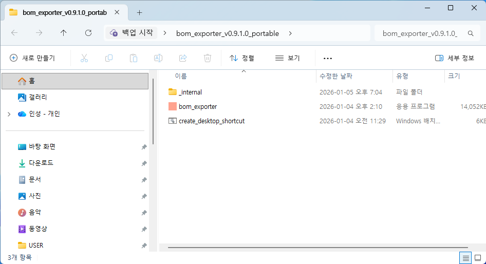
</div>

### 2.3 바탕화면 바로가기 생성

1. 압축 해제한 폴더에서 `create_desktop_shortcut.bat` 파일을 **더블클릭**합니다.

<div style="position: relative; display: inline-block; margin: 10px auto; overflow: hidden; border: 2px solid #666; border-radius: 10px;">
  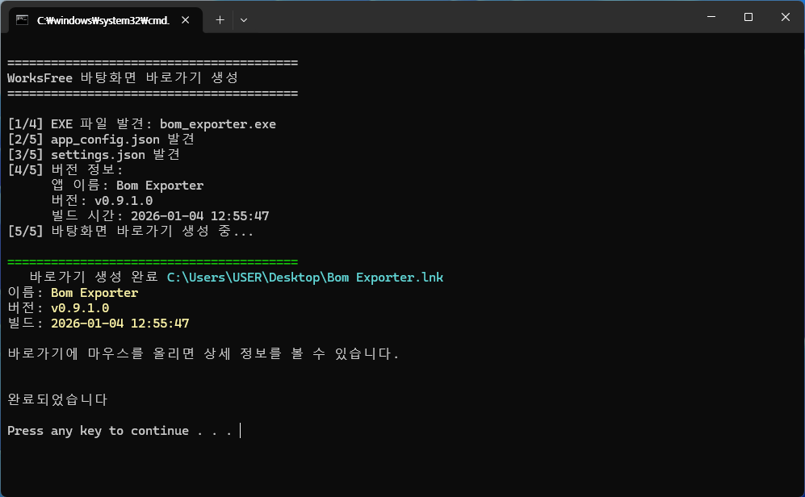
</div>

---

<div style="page-break-after: always;"></div>

---

2. 바탕화면에 "Bom Exporter" 아이콘이 생성됩니다.

<div style="position: relative; display: inline-block; margin: 10px auto; overflow: hidden; border: 2px solid #666; border-radius: 10px;">
  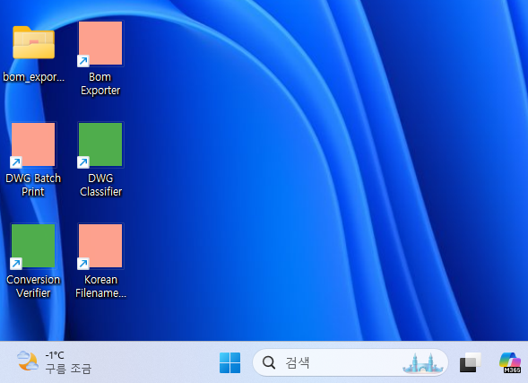
  <div style="
    position:absolute;
    left:12%; top:2%;
    width:12%; height:23%;
    background: rgba(255,255,0,0);
    border: 3px solid #ff0000ff;
    border-radius: 4px;">
  </div>
</div>

3. 바로가기 아이콘에 마우스를 올리면 **버전 정보**가 표시됩니다.

<div style="position: relative; display: inline-block; margin: 10px auto; overflow: hidden; border: 2px solid #666; border-radius: 10px;">
  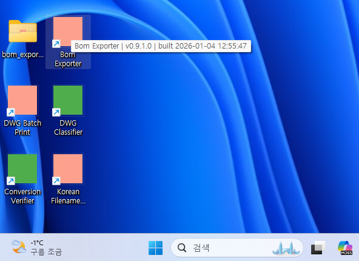
  <div style="
    position:absolute;
    left:18%; top:12.5%;
    width:53%; height:7%;
    background: rgba(255,255,0,0);
    border: 3px solid #ff0000ff;
    border-radius: 4px;">
  </div>
</div>

---

<div style="page-break-after: always;"></div>

---

### 2.4 프로그램 실행

1. 바탕화면의 "Bom Exporter" 아이콘을 더블클릭합니다.

2. 프로그램이 시작되면 다음과 같은 메인 화면이 나타납니다.
   
   <span class="warning-icon">!</span>**주의**: 사용자 등록 전에는 크레딧 없음으로 나옵니다. 사용자 등록 후에 체험판 크레딧도 사용이 가능합니다.

<div style="position: relative; display: inline-block; margin: 10px auto; overflow: hidden; border: 2px solid #666; border-radius: 10px;">
  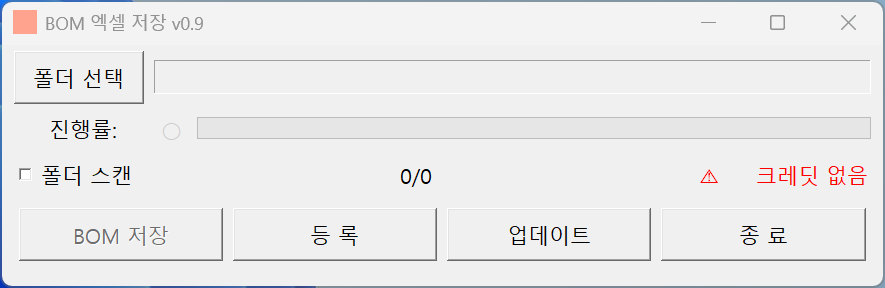
    <div style="
    position:absolute;
    left:77.5%; top:52%;
    width:21%; height:15%;
    background: rgba(255,255,0,0);
    border: 3px solid #007bff;">
  </div>
</div>

## 3. 사용자 등록

### 3.1 체험판 등록

프로그램을 처음 실행하면 사용자 등록이 필요합니다.

1. 메인 화면 하단의 **"등 록"** 버튼을 클릭합니다.

<div style="position: relative; display: inline-block; margin: 10px auto; overflow: hidden; border: 2px solid #666; border-radius: 10px;">
  
  <div style="
    position:absolute;
    left:25%; top:70%;
    width:24.5%; height:21%;
    background: rgba(255,255,0,0);
    border: 3px solid #007bff;">
  </div>
</div>

---

<div style="page-break-after: always;"></div>

---

2. 등록 버튼을 클릭하면 다음과 같이 등록 창이 나타납니다.

<div style="position: relative; display: inline-block; margin: 10px auto; overflow: hidden; border: 2px solid #666; border-radius: 10px;">
  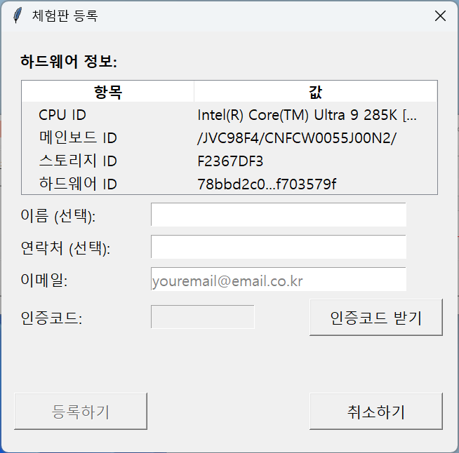
</div>

3. 등록을 위해 필요한 정보를 입력합니다. 실제 사용중인 이메일을 입력합니다.(인증코드 수신 및 확인용)
   - **이름**: 사용자 이름 (선택 항목)
   - **연락처**: 전화번호 (선택 항목)
   - **이메일**: 유효한 이메일 주소 (필수 항목)

<div style="position: relative; display: inline-block; margin: 10px auto; overflow: hidden; border: 2px solid #666; border-radius: 10px;">
  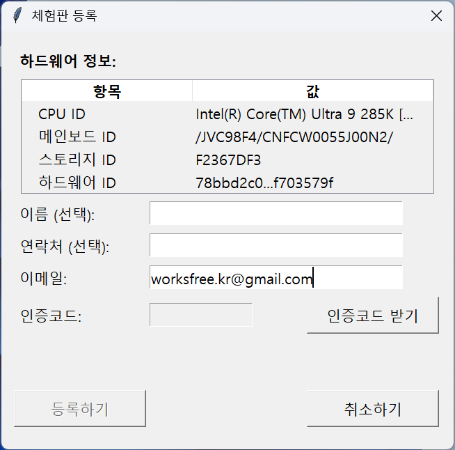
  <div style="
    position:absolute;
    left:31.5%; top:57.5%;
    width:58%; height:7.5%;
    background: rgba(255,255,0,0);
    border: 3px solid #007bff;">
  </div>
  <div style="
    position: absolute;
    left: 33%; top: 60%;
    width: 18%; height: 4.5%;
    background: #ffffff;
    display: flex;
    align-items: center;
    justify-content: center;
    font-size: 12px;
    font-weight: bold;
    color: #666;">
    * * * * * * *
  </div>
</div>

---

<div style="page-break-after: always;"></div>

---

4. 이메일을 입력한 후 **"인증코드 받기"** 버튼을 클릭합니다.

<div style="position: relative; display: inline-block; margin: 10px auto; overflow: hidden; border: 2px solid #666; border-radius: 10px;">
  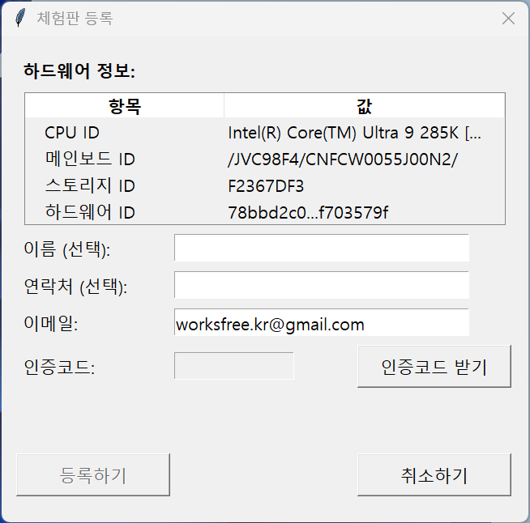
  <div style="
    position:absolute;
    left:67%; top:65%;
    width:30%; height:9%;
    background: rgba(255,255,0,0);
    border: 3px solid #007bff;">
  </div>
  <div style="
    position: absolute;
    left: 33%; top: 60%;
    width: 18%; height: 4.5%;
    background: #ffffff;
    display: flex;
    align-items: center;
    justify-content: center;
    font-size: 12px;
    font-weight: bold;
    color: #666;">
    * * * * * * *
  </div>
</div>

5. 방금 입력한 본인 이메일의 수신함으로 가서 **6자리 인증코드**를 확인합니다.
   
6. 인증코드를 입력합니다. <span class="warning-icon">!</span>**주의**: 인증코드는 1회용이며 5분 경과 후 인증이 불가능합니다.
<div style="position: relative; display: inline-block; margin: 10px auto; overflow: hidden; border: 2px solid #666; border-radius: 10px;">
  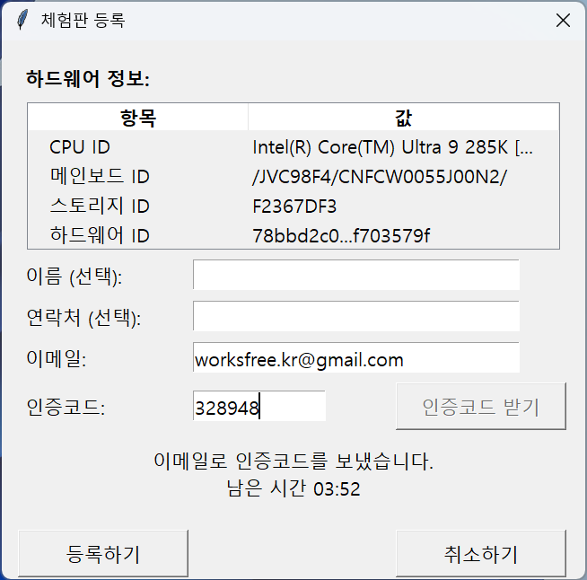
  <div style="
    position:absolute;
    left:31.5%; top:66%;
    width:24.5%; height:7%;
    background: rgba(255,255,0,0);
    border: 3px solid #007bff;">
  </div>
  <div style="
    position: absolute;
    left: 33%; top: 60%;
    width: 18%; height: 4.5%;
    background: #ffffff;
    display: flex;
    align-items: center;
    justify-content: center;
    font-size: 12px;
    font-weight: bold;
    color: #666;">
    * * * * * * *
  </div>  
</div>

---

<div style="page-break-after: always;"></div>

---

7. 인증코드를 입력한 후 **"등록하기"** 버튼을 클릭합니다.
<div style="position: relative; display: inline-block; margin: 10px auto; overflow: hidden; border: 2px solid #666; border-radius: 10px;">
  
  <div style="
    position:absolute;
    left:1.7%; top:91%;
    width:30%; height:8%;
    background: rgba(255,255,0,0);
    border: 3px solid #007bff;">
  </div>
  <div style="
    position: absolute;
    left: 33%; top: 60%;
    width: 18%; height: 4.5%;
    background: #ffffff;
    display: flex;
    align-items: center;
    justify-content: center;
    font-size: 12px;
    font-weight: bold;
    color: #666;">
    * * * * * * *
  </div>  
</div>

8. 등록이 완료되면 등록창은 잠시 후 사라지고 메인 앱에서 **"등 록"** 버튼은 **"설 정"** 버튼으로 변경됩니다.

<div style="position: relative; display: inline-block; margin: 10px auto; overflow: hidden; border: 2px solid #666; border-radius: 10px;">
  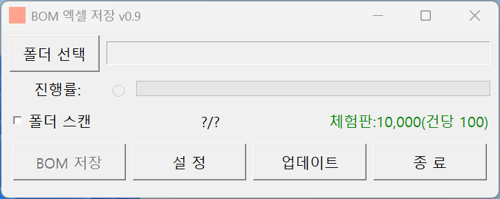
  <div style="
    position:absolute;
    left:25.5%; top:70.5%;
    width:23.5%; height:20.5%;
    background: rgba(255,255,0,0);
    border: 3px solid #007bff;">
  </div>
</div>

### 3.2 체험판 크레딧

- 체험판 등록 시 **무료 크레딧**이 제공됩니다.
- 크레딧은 1개 작업당 100크레딧씩 차감됩니다.
- 메인 화면 우측 하단에서 **잔여 크레딧**을 확인할 수 있습니다.
<div style="position: relative; display: inline-block; margin: 10px auto; overflow: hidden; border: 2px solid #666; border-radius: 10px;">
  
  <div style="
    position:absolute;
    left:64%; top:53%;
    width:35%; height:15%;
    background: rgba(255,255,0,0);
    border: 3px solid #007bff;">
  </div>
</div>

---

## 4. 기본 사용법

### 4.1 작업 폴더 선택

1. **"폴더 선택"** 버튼을 클릭합니다.

<!--  -->
<div style="position: relative; display: inline-block; margin: 10px auto; overflow: hidden; border: 2px solid #666; border-radius: 10px;">
  
  <div style="
    position:absolute;
    left:0.5%; top:14%;
    width:19%; height:21%;
    background: rgba(255,255,0,0);
    border: 3px solid #007bff;">
  </div>
</div>

2. BOM을 추출할 SOLIDWORKS 어셈블리 파일(.sldasm)이 있는 작업 대상 폴더를 선택합니다.

<div style="position: relative; display: inline-block; margin: 10px auto; overflow: hidden; border: 2px solid #666; border-radius: 10px;">
  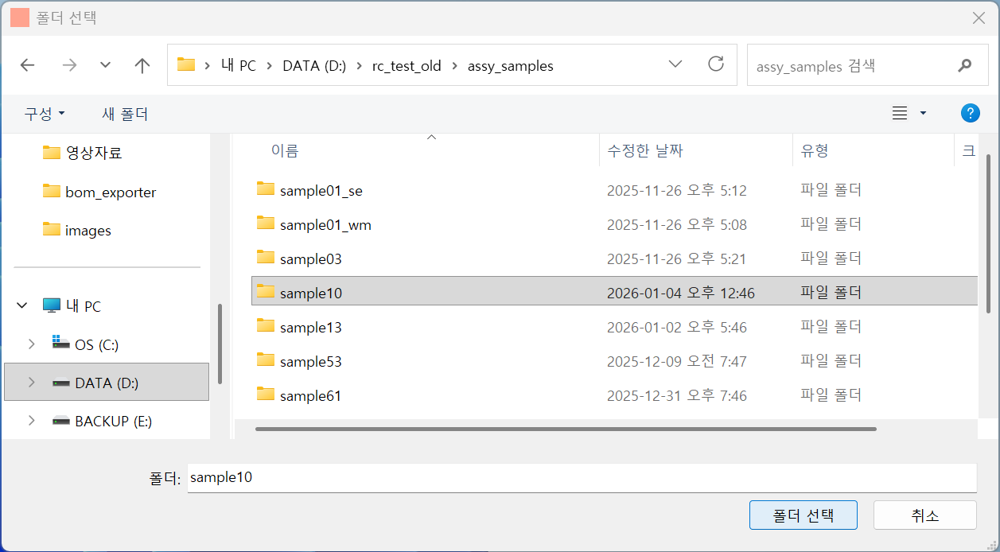
</div>

---

<div style="page-break-after: always;"></div>

---

3. 선택한 폴더 경로가 표시됩니다.

<div style="position: relative; display: inline-block; margin: 10px auto; overflow: hidden; border: 2px solid #666; border-radius: 10px;">
  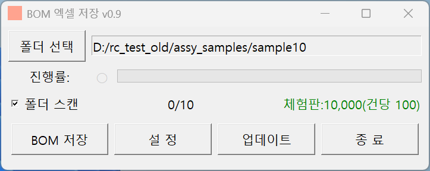
  <div style="
    position: absolute;
    left: 21.3%; top: 20%;
    width: 65%; height: 11%;
    background: #f0f0f0;
    display: flex;
    align-items: left;
    justify-content: left;
    font-size: 14px;
    color: #000000;">
    D:/test/assy_samples/sample10
  </div>
  <div style="
    position:absolute;
    left:20%; top:16%;
    width:78.5%; height:18%;
    background: rgba(255,255,0,0);
    border: 3px solid #007bff;">
  </div>
</div>

### 4.2 BOM 추출 시작

1. 폴더 선택 후 **"BOM 저장"** 버튼이 활성화됩니다.

<div style="position: relative; display: inline-block; margin: 10px auto; overflow: hidden; border: 2px solid #666; border-radius: 10px;">
  
  <div style="
    position: absolute;
    left: 21.3%; top: 20%;
    width: 65%; height: 11%;
    background: #f0f0f0;
    display: flex;
    align-items: left;
    justify-content: left;
    font-size: 14px;
    color: #000000;">
    D:/test/assy_samples/sample10
  </div>
  <div style="
    position:absolute;
    left:1%; top:70%;
    width:24%; height:21%;
    background: rgba(255,255,0,0);
    border: 3px solid #007bff;">
  </div>
</div>

2. **"BOM 저장"** 버튼을 클릭하면 모든 버튼이 비활성화되면서 SOLIDWORKS를 시작합니다.

<div style="position: relative; display: inline-block; margin: 10px auto; overflow: hidden; border: 2px solid #666; border-radius: 10px;">
  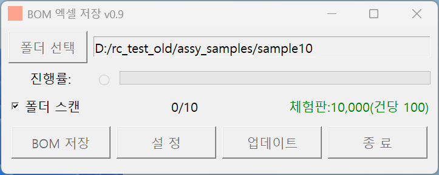
  <div style="
    position: absolute;
    left: 21.3%; top: 20%;
    width: 65%; height: 11%;
    background: #f0f0f0;
    display: flex;
    align-items: left;
    justify-content: left;
    font-size: 14px;
    color: #000000;">
    D:/test/assy_samples/sample10
  </div>
  <div style="
    position:absolute;
    left:1%; top:70%;
    width:97%; height:21%;
    background: rgba(255,255,0,0);
    border: 3px solid #007bff;">
  </div>
</div>

---

<div style="page-break-after: always;"></div>

---

### 4.3 진행 상황 확인

1. BOM 엑셀 저장 프로그램은 이제부터 자동으로 다음 작업을 수행합니다:
   - SOLIDWORKS 실행
   - 어셈블리 파일 오픈과 BOM 아이콘 우클릭하여 Excel로 BOM 저장을 반복 실행
   - 재시작 카운트에 도달하면 SOLIDWORKS를 종료했다가 다시 실행

<div style="position: relative; display: inline-block; margin: 10px auto; overflow: hidden; border: 2px solid #666; border-radius: 10px;">
  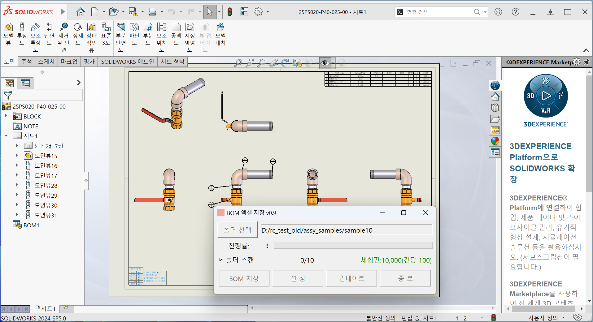
  <div style="
    position: absolute;
    left: 44%; top: 70.1%;
    width: 20%; height: 13;
    background: #f0f0f0;
    display: flex;
    align-items: left;
    justify-content: left;
    font-size: 8px;
    color: #000000;">
    D:/test/assy_samples/sample10
  </div>
  <div style="
    position:absolute;
    left:22%; top:22%;
    width:51%; height:42.2%;
    background: rgba(200, 200, 200, 0.99);
    filter: blur(1px);
    backdrop-filter: blur(10px);">
  </div>
  <div style="
    position:absolute;
    left:22%; top:58%;
    width:13.8%; height:31%;
    background: rgba(200, 200, 200, 0.99);
    filter: blur(1px);
    backdrop-filter: blur(10px);">
  </div>
</div>

2. 진행률 바와 상태 메시지로 현재 작업 상황을 확인할 수 있습니다.

<div style="position: relative; display: inline-block; margin: 10px auto; overflow: hidden; border: 2px solid #666; border-radius: 10px;">
  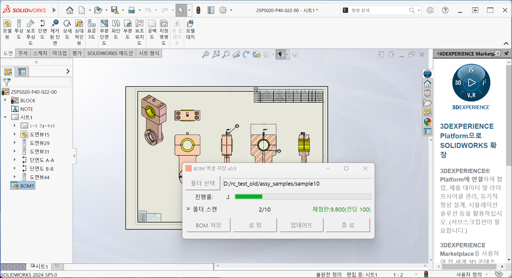
  <div style="
    position: absolute;
    left: 43.7%; top: 64.5%;
    width: 25%; height: 3%;
    background: #f0f0f0;
    display: flex;
    align-items: left;
    justify-content: left;
    font-size: 10px;
    color: #000000;">
    D:/test/assy_samples/sample10
  </div>
  <div style="
    position:absolute;
    left:42.5%; top:69%;
    width:30%; height:3%;
    background: rgba(255,255,0,0);
    border: 3px solid #007bff;">
  </div>
  <div style="
    position:absolute;
    left:27%; top:33%;
    width:36%; height:26%;
    background: rgba(200, 200, 200, 0.99);
    filter: blur(1px);
    backdrop-filter: blur(10px);">
  </div>
  <div style="
    position:absolute;
    left:27%; top:58%;
    width:8.5%; height:22%;
    background: rgba(200, 200, 200, 0.99);
    filter: blur(1px);
    backdrop-filter: blur(10px);">
  </div>
</div>

---

<div style="page-break-after: always;"></div>

---

3. 처리된 파일 개수와 남은 크레딧이 실시간으로 업데이트됩니다.

<div style="position: relative; display: inline-block; margin: 10px auto; overflow: hidden; border: 2px solid #666; border-radius: 10px;">
  
  <div style="
    position: absolute;
    left: 43.7%; top: 64.5%;
    width: 25%; height: 3%;
    background: #f0f0f0;
    display: flex;
    align-items: left;
    justify-content: left;
    font-size: 10px;
    color: #000000;">
    D:/test/assy_samples/sample10
  </div>
  <div style="
    position:absolute;
    left:48%; top:73%;
    width:24%; height:4%;
    background: rgba(255,255,0,0);
    border: 3px solid #007bff;">
  </div>
  <div style="
    position:absolute;
    left:27%; top:33%;
    width:36%; height:26%;
    background: rgba(200, 200, 200, 0.99);
    filter: blur(1px);
    backdrop-filter: blur(10px);">
  </div>
  <div style="
    position:absolute;
    left:27%; top:58%;
    width:8.5%; height:22%;
    background: rgba(200, 200, 200, 0.99);
    filter: blur(1px);
    backdrop-filter: blur(10px);">
  </div>
</div>

---

<div style="page-break-after: always;"></div>

---

### 4.4 작업 완료

1. 모든 파일 처리가 완료되면 완료 메시지가 나타납니다.


<div style="position: relative; display: inline-block; margin: 10px auto; overflow: hidden; border: 2px solid #666; border-radius: 10px;">
  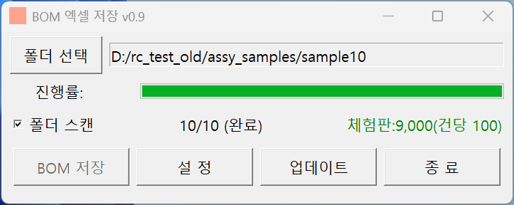
  <div style="
    position: absolute;
    left: 21.3%; top: 20%;
    width: 55%; height: 11%;
    background: #f0f0f0;
    display: flex;
    align-items: left;
    justify-content: left;
    font-size: 13px;
    color: #000000;">
    D:/test/assy_samples/sample10
  </div>
  <div style="
    position:absolute;
    left:33%; top:55%;
    width:19%; height:11%;
    background: rgba(255,255,0,0);
    border: 3px solid #007bff;">
  </div>
</div>

2. 생성된 Excel 파일은 다음 위치에 저장됩니다:
   - **저장 경로**: `[선택한 폴더]/bom/*.xlsx`

3. **"폴더 열기"** 버튼을 클릭하여 BOM 폴더의 결과 파일을 확인할 수 있습니다.

<div style="position: relative; display: inline-block; margin: 10px auto; overflow: hidden; border: 2px solid #666; border-radius: 10px;">
  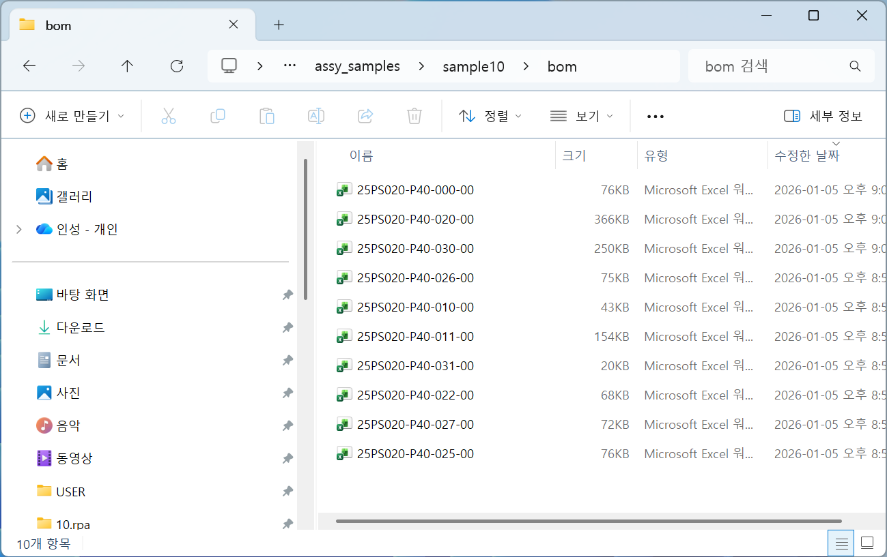
</div>

---

<div style="page-break-after: always;"></div>

---

### 4.5 생성된 BOM 파일 확인

생성된 Excel 파일에는 다음 정보가 포함됩니다:

<span class="warning-icon">!</span>**주의**: BOM 엑셀 양식은 사전 정의된 템플릿 등 사용자 환경에 따라 다를 수 있습니다.

- 문서 미리보기
- NO
- PART NAME
- DESCRIPTION
- MATERIAL
- 후처리
- 열처리
- Q'TY
- 총수량
- MAKER

<div style="position: relative; display: inline-block; margin: 10px auto; overflow: hidden; border: 2px solid #666; border-radius: 10px;">
  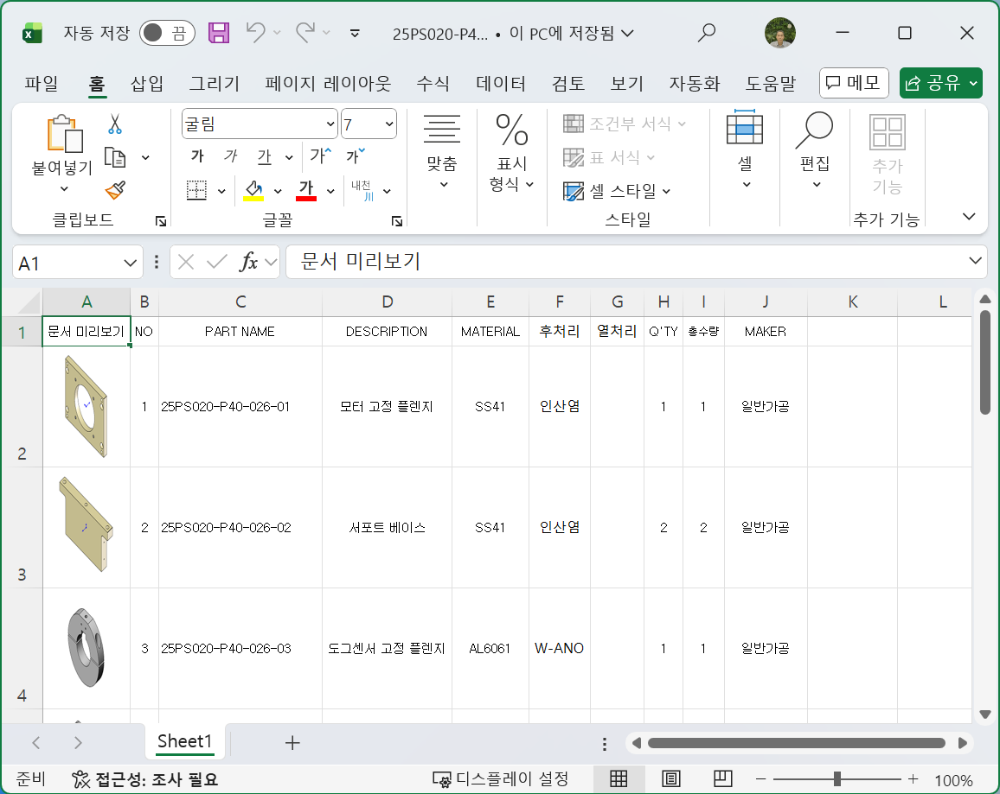
  <!-- 개인정보 마스킹: 원형 회색 반투명 마스크 -->
  <div style="
    position:absolute;
    left:76.5%; top:1%;
    width:4%; height:5%;
    background: rgba(100,100,100,1);
    border-radius: 50%;">
  </div>
    <div style="
    position:absolute;
    left:5%; top:44%;
    width:7%; height:46%;
    background: rgba(200, 200, 200, 0.99);
    filter: blur(1px);
    backdrop-filter: blur(10px);">
  </div>
</div>

---

<div style="page-break-after: always;"></div>

## 5. 크레딧 관리

### 5.1 크레딧 확인

- 메인 화면 우측 하단에서 현재 크레딧을 확인할 수 있습니다.
- 표시 형식:
  - 체험판 크레딧만 있는 경우: `체험판: 9,000`

<div style="position: relative; display: inline-block; margin: 10px auto; overflow: hidden; border: 2px solid #666; border-radius: 10px;">
  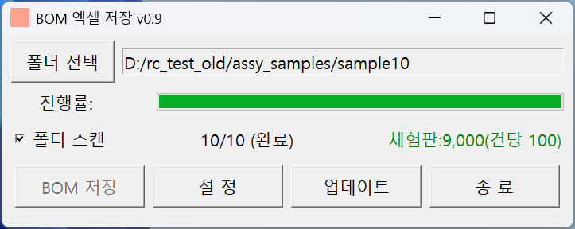
    <div style="
    position: absolute;
    left: 21.3%; top: 20%;
    width: 65%; height: 11%;
    background: #f0f0f0;
    display: flex;
    align-items: left;
    justify-content: left;
    font-size: 14px;
    color: #000000;">
    D:/test/assy_samples/sample10
  </div>
  <div style="
    position:absolute;
    left:66%; top:54.5%;
    width:32.5%; height:10%;
    background: rgba(255,255,0,0);
    border: 3px solid #007bff;">
  </div>
</div>

  - 충전 크레딧만 있는 경우: `충전: 9,000`

<div style="position: relative; display: inline-block; margin: 10px auto; overflow: hidden; border: 2px solid #666; border-radius: 10px;">
  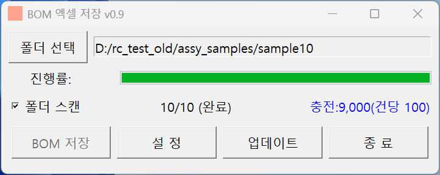
    <div style="
    position: absolute;
    left: 21.3%; top: 20%;
    width: 65%; height: 11%;
    background: #f0f0f0;
    display: flex;
    align-items: left;
    justify-content: left;
    font-size: 14px;
    color: #000000;">
    D:/test/assy_samples/sample10
  </div>
  <div style="
    position:absolute;
    left:66%; top:54.5%;
    width:32.5%; height:10%;
    background: rgba(255,255,0,0);
    border: 3px solid #007bff;">
  </div>
</div>

  - 둘 다 있는 경우: `체험판: 900/충전: 20,000`

<div style="position: relative; display: inline-block; margin: 10px auto; overflow: hidden; border: 2px solid #666; border-radius: 10px;">
  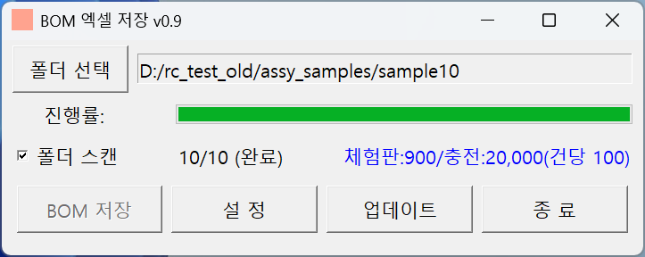
  <div style="
    position: absolute;
    left: 21.3%; top: 20%;
    width: 65%; height: 11%;
    background: #f0f0f0;
    display: flex;
    align-items: left;
    justify-content: left;
    font-size: 14px;
    color: #000000;">
    D:/test/assy_samples/sample10
  </div>
  <div style="
    position:absolute;
    left:52%; top:55%;
    width:47%; height:10%;
    background: rgba(255,255,0,0);
    border: 3px solid #007bff;">
  </div>
</div>

---

<div style="page-break-after: always;"></div>

---

### 5.2 크레딧 부족 시

1. 크레딧이 부족한 경우 경고 메시지가 나타납니다. **"아니요(N)"** 버튼을 클릭하면 작업이 취소됩니다.

<div style="position: relative; display: inline-block; margin: 10px auto; overflow: hidden; border: 2px solid #666; border-radius: 10px;">
  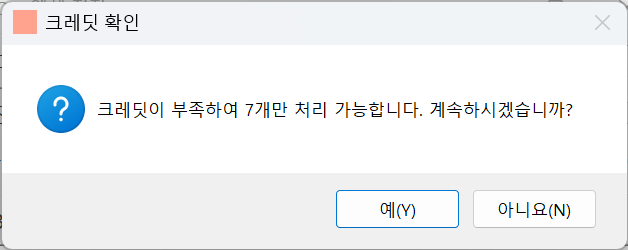
</div>

2. **"예(Y)"** 버튼을 클릭하면 보유한 크레딧이 전부 소진될 때 까지 작업이 진행되고 소진되면 작업이 중단되고 크레딧을 구매한 후 다시 시도하라는 안내 팝업창이 로딩됩니다.

<div style="position: relative; display: inline-block; margin: 10px auto; overflow: hidden; border: 2px solid #666; border-radius: 10px;">
  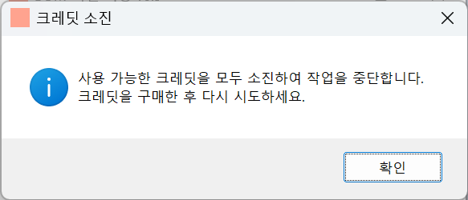
  <!-- <div style="
    position:absolute;
    left:52%; top:55%;
    width:47%; height:10%;
    background: rgba(255,255,0,0);
    border: 3px solid #007bff;">
  </div> -->
</div>

3. 크레딧 소진 팝업에서 **"확인"** 버튼을 클릭하면 현재 진행률과 카운트가 처리된 작업량에서 멈추고 **"크레딧 없음"** 상태가 표시됩니다.

<div style="position: relative; display: inline-block; margin: 10px auto; overflow: hidden; border: 2px solid #666; border-radius: 10px;">
  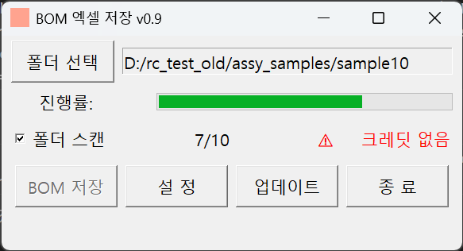
  <div style="
    position: absolute;
    left: 26.5%; top: 19%;
    width: 65%; height: 10%;
    background: #f0f0f0;
    display: flex;
    align-items: left;
    justify-content: left;
    font-size: 16px;
    color: #000000;">
    D:/test/assy_samples/sample10
  </div>
  <div style="
    position:absolute;
    left:32.5%; top:33%;
    width:66%; height:30%;
    background: rgba(255,255,0,0);
    border: 3px solid #007bff;">
  </div>
</div>

---

<div style="page-break-after: always;"></div>

---

### 5.3 크레딧 구매

크레딧은 다음 채널에서 구매할 수 있습니다:

#### 네이버 스마트스토어 <div style="color: red;">(준비중)</div>
- URL: [https://smartstore.naver.com/worksfree](https://smartstore.naver.com/worksfree)
- 결제 방법: 네이버페이, 신용카드, 계좌이체

#### WorksFree 공식 웹사이트 <div style="color: red;">(준비중)</div>
- URL: [https://worksfree.com](https://worksfree.com)
- 결제 방법: 신용카드, 계좌이체


### 5.4 크레딧 업데이트

크레딧을 구매한 후:

1. 메인 화면의 **"업데이트"** 버튼을 클릭합니다.

<div style="position: relative; display: inline-block; margin: 10px auto; overflow: hidden; border: 2px solid #666; border-radius: 10px;">
  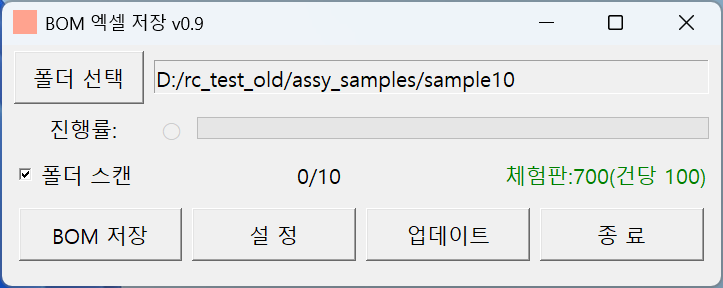
  <div style="
    position: absolute;
    left: 21.3%; top: 20%;
    width: 55%; height: 11%;
    background: #f0f0f0;
    display: flex;
    align-items: left;
    justify-content: left;
    font-size: 14px;
    color: #000000;">
    D:/test/assy_samples/sample10
  </div>
  <div style="
    position:absolute;
    left:49.5%; top:69%;
    width:24%; height:22%;
    background: rgba(255,255,0,0);
    border: 3px solid #007bff;">
  </div>
</div>

---

<div style="page-break-after: always;"></div>

---

2. 프로그램이 서버에서 최신 크레딧 정보를 가져옵니다.

<div style="position: relative; display: inline-block; margin: 10px auto; overflow: hidden; border: 2px solid #666; border-radius: 10px;">
  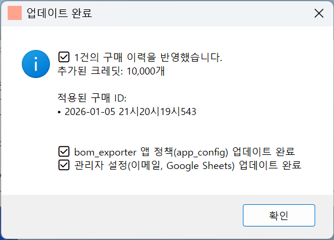
  <div style="
    position:absolute;
    left:3%; top:17%;
    width:67%; height:16%;
    background: rgba(255,255,0,0);
    border: 3px solid #007bff;">
  </div>
</div>

3. 업데이트가 완료되면 확인 메시지가 나타나고, 잔여 크레딧이 업데이트됩니다.

<div style="position: relative; display: inline-block; margin: 10px auto; overflow: hidden; border: 2px solid #666; border-radius: 10px;">
  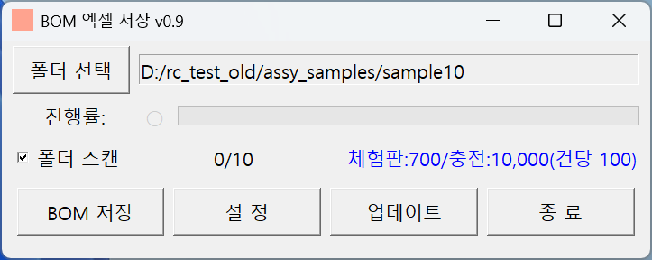
  <div style="
    position: absolute;
    left: 21.3%; top: 20%;
    width: 55%; height: 11%;
    background: #f0f0f0;
    display: flex;
    align-items: left;
    justify-content: left;
    font-size: 14px;
    color: #000000;">
    D:/test/assy_samples/sample10
  </div>
  <div style="
    position:absolute;
    left:68%; top:52%;
    width:17%; height:15%;
    background: rgba(255,255,0,0);
    border: 3px solid #007bff;">
  </div>
</div>

---

<div style="page-break-after: always;"></div>

---

## 6. 고급 기능
<span style="font-size: 24px; color: red; font-weight: bold;">(이하 작성 중)</span>

<div style="text-align: left;">
<span style="font-size: 20px; color: red; font-weight: bold;">실험 중인 기능으로 아직 제대로 동작하지 않을 수 있습니다.</span>
</div>

### 6.1 설정 화면

등록 완료 후 **"설 정"** 버튼을 클릭하면 설정 화면이 나타납니다.

<div style="position: relative; display: inline-block; margin: 10px auto; overflow: hidden; border: 2px solid #666; border-radius: 10px;">
  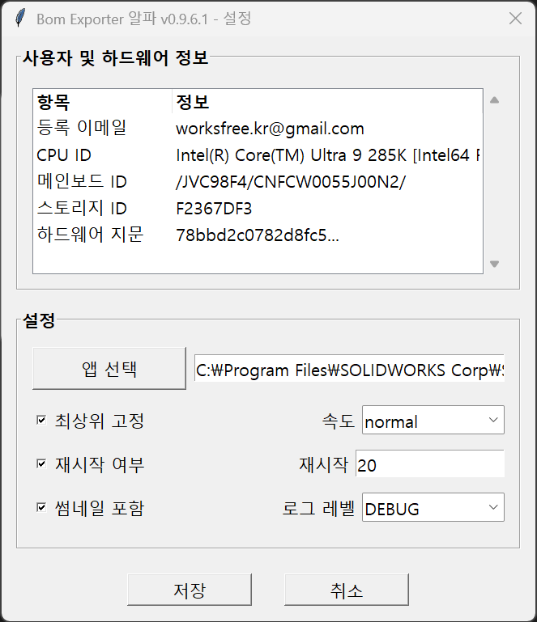
</div>

설정 화면에서 다음 옵션을 변경할 수 있습니다:

- 앱 선택: 솔리드웍스 실행 경로(2023, 2024 등 여러버전의 솔리드웍스 사용시 변경 필요)
- 최상위 고정: 앱 화면이 위로 올라와 있어 항상 보이게 설정
- 재시작 여부: 재시작 여부를 선택, 어셈블리를 대량으로 처리할 경우 적정한 주기의 솔리드웍스 재시작이 권장됨
- 썸네일 포함: BOM을 엑셀로 저장할 때 축소판 이미지를 포함 여부
- 속도: 앱이 안정적으로 수행되기 위해 normal을 권장됨
- 재시작: 재시작 주기를 정의, 20인 겨우 어셈블리를 20건 처리할 때마다 솔리드웍스를 재실행
- 로그 레벨: 관리자가 보기 위한 로그 레벨을 정의

---

<div style="page-break-after: always;"></div>

---

### 6.2 작업 재개 기능

프로그램이 중단되거나 크레딧 부족으로 일부만 처리된 경우:

&nbsp;&nbsp;&nbsp;<span class="warning-icon">!</span>**주의**: **실험 중** 기능으로 크레딧이 부족한 경우 크레딧 구매 후 사용하시기 바랍니다.

1. 이전에 작업했던 폴더를 다시 선택하면 **작업 재개** 메시지가 나타납니다.

<div style="position: relative; display: inline-block; margin: 10px auto; overflow: hidden; border: 2px solid #666; border-radius: 10px;">
  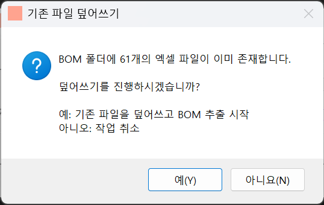
</div>

2. **"예(Y)"**를 선택하면 기존 파일이 삭제되면서 다시 작업을 진행합니다.

3. **"아니오(N)"**를 선택하면 작업을 진행하지 않습니다.

<!-- 
### 6.3 로그 확인

프로그램 실행 중 발생한 상세 로그는 다음 위치에서 확인할 수 있습니다:

- **위치**: `C:\Users\[사용자명]\.wf_rpa\bom_exporter\logs\`
- **파일명**: `YYYYMMDD.txt` (예: `20260105.txt`)

로그 파일에는 다음 정보가 기록됩니다:
- 파일 처리 내역
- 오류 메시지
- 크레딧 사용 내역
-->
---

<div style="page-break-after: always;"></div>

---

## 7. 문제 해결

### 7.1 자주 묻는 질문 (FAQ)

#### Q1. SOLIDWORKS가 자동으로 실행되지 않아요.

**A1**: 다음 사항을 확인해주세요:
1. SOLIDWORKS가 정상적으로 설치되어 있는지 확인
2. 설정 화면에서 SOLIDWORKS 실행 파일 경로 확인
<br><span class="warning-icon">!</span>SOLIDWORKS 2023, 2024 등, 여러 버전이 설치된 경우 경로가 기본값과 다를 수 있음

#### Q2. 프로그램이 느리게 실행돼요.

**A2**: 다음 방법을 시도해보세요:
1. 설정에서 **"빠름"** 모드로 변경
2. 처리할 파일이 있는 폴더를 SSD 드라이브로 이동
3. SOLIDWORKS 및 기타 프로그램 종료
4. 컴퓨터 재시작<br>
<span class="info-icon">i</span>**참고**: 이미지 기반으로 실행시 빠른 속도로 처리 되며 FHD/QHD/UHD 등 해상도에 따른 구현을 준비 중임

#### Q3. 크레딧을 구매했는데 업데이트가 안 돼요.

**A3**: 다음 순서로 진행해주세요:
1. 인터넷 연결 확인
2. **"업데이트"** 버튼 클릭
3. 1~2분 정도 대기
4. 그래도 안 되면 프로그램 재시작 후 다시 시도
5. 계속 문제가 있으면 고객센터로 문의

#### Q4. 일부 파일만 처리되고 멈춰요.

**A4**: 다음 사항을 확인해주세요:
1. 크레딧이 충분한지 확인
2. 문제가 된 파일이 손상되지 않았는지 SOLIDWORKS에서 직접 열어보기
3. 어셈블리 파일이 로딩되는데 10분 이상 소요되는지 확인
4. 어셈블리 파일 로딩 후 BOM 아이콘이 보이는지 확인

<div style="page-break-after: always;"></div>

#### Q5. 인터넷이 없는 환경에서 사용해야 해요.

**A5**: 다음 사항을 확인해주세요:
1. 영구 라이선스 버전의 웍스프리앱은 라이선스 체크를 안함
2. 크레딧 충전 방식의 앱은 인터넷 없는 환경에서 사용 불가
3. 인터넷 없는 환경에서의 사용은 영구 라이선스만 가능<br>
<span class="info-icon">i</span>**참고**: 영구 라이선스 구매는 [별도 문의](#73-고객-지원)

### 7.2 오류 메시지 해결

#### "하드웨어 정보 불일치"

- **원인**: 최초 등록한 컴퓨터와 다른 컴퓨터에서 실행
- **해결**:
  1. 다른 이메일로 현재 컴퓨터에서 새로 등록
  2. 신규 등록은 체험판 크레딧이 제공됨
  3. 체험판 크레딧 소진 후 신규 크레딧 구매

#### "크레딧 매니저가 초기화되지 않았습니다"

- **원인**: 서버 연결 문제 또는 프로그램 오류
- **해결**: 
  1. 프로그램 재시작
  2. 인터넷 연결 확인
  3. 방화벽 설정 확인

#### "SOLIDWORKS 실행 실패"

- **원인**: SOLIDWORKS 설치 경로 오류 또는 라이선스 문제
- **해결**:
  1. SOLIDWORKS 수동 실행 테스트
  2. 설정에서 SOLIDWORKS 경로 확인/수정
  3. SOLIDWORKS 라이선스 확인

### 7.3 고객 지원

추가 지원이 필요한 경우 다음 채널로 문의해주세요:

- **이메일**: insung.lee@worksfree.kr
- **웹사이트**: https://worksfree.com/support
<!-- - **전화**: 010-4935-7573 -->
- **운영 시간**: 평일 09:00 - 18:00 (주말/공휴일 제외)

문의 시 다음 정보를 함께 제공해주시면 보다 신속한 지원이 가능합니다:
- 프로그램 버전 (바탕화면 바로가기 툴팁에서 확인)
- 오류 메시지 스크린샷
<!-- - 로그 파일 (`C:\Users\[사용자명]\.wf_rpa\bom_exporter\logs\`) -->

<!-- ## 부록

---

### A. 키보드 단축키

| 단축키 | 기능 |
|--------|------|
| `Alt+G` | 창 위치/크기 저장 (개발자용) |
| `Esc` | 진행 중인 작업 중단 (확인 필요) |

### B. 파일 구조

```
[작업 폴더]/
├── [원본 어셈블리 파일들].sldasm
├── bom/                          # 추출된 BOM 파일
│   ├── 어셈블리1_BOM.xlsx
│   └── 어셈블리2_BOM.xlsx
└── wf_pending_list.txt          # 미처리 파일 목록 (자동 생성)
```

### C. 버전 이력

- **v0.9.1** (2026-01-04)
  - 바탕화면 바로가기 생성 개선
  - 크레딧 표시 UI 개선
  - 안정성 향상

- **v0.9.0** (2025-12-XX)
  - 초기 릴리스

-->

---

<div style="page-break-after: always;"></div>

---


```
라이선스 및 저작권

© 2025 WorksFree. All rights reserved.

본 소프트웨어 및 문서의 무단 복제, 배포, 수정을 금지합니다.

```

---
