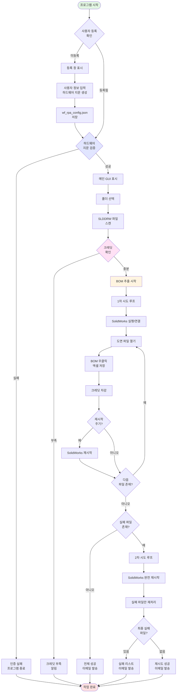
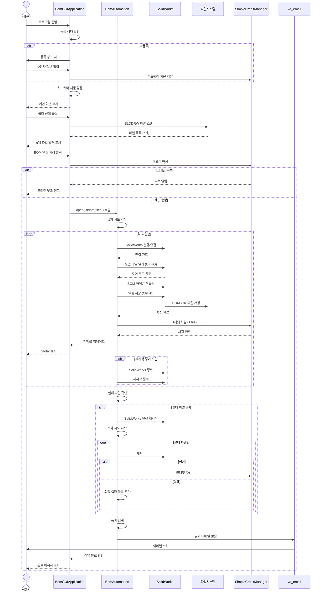
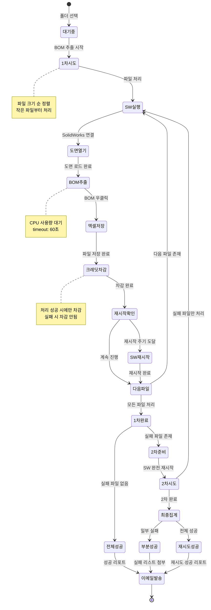

# BOM2Excel 자동화 v1.0

SolidWorks 어셈블리 도면 BOM 자동 추출 및 엑셀 변환 RPA 시스템

## 프로젝트 개요

SolidWorks 도면 파일(.SLDDRW)의 BOM(Bill of Materials)을 자동으로 추출하여 엑셀 파일로 저장하는 RPA 자동화 솔루션입니다. pywinauto 기반 GUI 자동화를 통해 대량의 도면 파일을 무인으로 처리할 수 있습니다.

### 주요 기능

- **대량 도면 자동 처리**: 폴더 내 모든 어셈블리 도면 일괄 처리
- **재시도 로직**: 1차 실패 시 자동 2차 재시도
- **크레딧 기반 사용량 관리**: 체험판/구매 크레딧 시스템
- **하드웨어 지문 인증**: 등록된 컴퓨터에서만 실행 가능
- **자동 이메일 알림**: 처리 결과 및 실패 파일 자동 리포트
- **진행률 실시간 표시**: GUI 프로그레스바 및 상태 업데이트
- **안정성 강화**: SolidWorks 주기적 재시작, CPU 사용량 모니터링
- **Non-UI 모드**: 콘솔 명령어로 배치 작업 실행 가능

## 시스템 아키텍처



## 워크플로우 다이어그램

### 1. 전체 처리 시퀀스



### 2. 크레딧 관리 흐름

```mermaid
flowchart LR
    subgraph Startup["앱 시작"]
        S1[SimpleCreditManager<br/>초기화]
        S2[로컬 크레딧<br/>로드]
        S3[복구 동기화<br/>백그라운드]
    end

    subgraph Processing["파일 처리"]
        P1{크레딧<br/>확인}
        P2[파일 처리]
        P3[크레딧 차감<br/>로컬]
        P4[사용 로그<br/>기록]
    end

    subgraph Sync["동기화"]
        Y1[구매 내역<br/>확인]
        Y2[신규 구매<br/>적용]
        Y3[로컬→시트<br/>동기화]
        Y4[시트→로컬<br/>동기화]
    end

    subgraph Shutdown["앱 종료"]
        E1{변경사항<br/>존재?}
        E2[최종 동기화]
        E3[실행 상태<br/>해제]
    end

    S1 --> S2
    S2 --> S3
    S3 --> P1

    P1 -->|충분| P2
    P1 -->|부족| Stop[작업 중단]
    P2 --> P3
    P3 --> P4

    P4 --> UserRefresh{사용자<br/>갱신 클릭?}
    UserRefresh -->|예| Y1
    UserRefresh -->|아니오| Continue[계속 작업]

    Y1 --> Y2
    Y2 --> Y3
    Y3 --> Y4
    Y4 --> Continue

    Continue --> E1
    E1 -->|예| E2
    E1 -->|아니오| E3
    E2 --> E3

    style Startup fill:#e1f5e1
    style Processing fill:#fff4e1
    style Sync fill:#e1e5ff
    style Shutdown fill:#ffe1e1
```



### 3. 파일 처리 상태 다이어그램



## 설치 및 실행

### 필수 요구사항

```
Python 3.8+
Windows OS (SolidWorks 호환)
SolidWorks 2018 이상
```

### Python 패키지

```bash
pip install pywinauto pyautogui pyperclip pandas openpyxl tqdm ntplib keyboard psutil
```

### 의존 모듈 (10.common 폴더)

- `wf_log`: 통합 로깅 시스템
- `wf_creditmanager_simple`: 크레딧 관리
- `wf_hwinfo`: 하드웨어 지문 생성
- `wf_register`: 사용자 등록 UI
- `wf_email`: 이메일 발송
- `wf_license`: 라이선스 검증

### 실행 방법

**GUI 모드** (일반 사용자):
```bash
python ui_main.py
```

**Non-UI 모드** (콘솔/배치 작업):
```bash
python automation.py --folders "D:\drawings\folder1" "D:\drawings\folder2" --repeat 3
```

## 사용 방법

### 첫 실행 - 사용자 등록

1. 프로그램 실행 시 등록 창 자동 표시
2. 사용자 정보 입력:
   - 이메일 (필수)
   - 이름 (필수)
   - 전화번호 (필수)
   - 개인정보 동의 체크
3. 하드웨어 지문 자동 생성
4. `~/.wf_rpa/wf_rpa_config.json` 파일 생성
5. 체험판 크레딧 2,000개 지급

### 기본 작업 흐름

1. **폴더 선택**
   - '폴더 선택' 버튼 클릭
   - 어셈블리 도면(.SLDDRW) 파일이 있는 폴더 선택
   - 파일명 규칙: `*-00*.SLDDRW` (15번째 문자 이후 `-00` 포함)

2. **크레딧 확인**
   - 우측 하단 크레딧 표시 확인
   - 파일당 100 크레딧 소모
   - 부족 시 "크레딧 갱신" 버튼으로 구매 내역 반영

3. **BOM 추출 실행**
   - 'BOM 엑셀 저장' 버튼 클릭
   - 진행률 실시간 표시
   - 처리 중 중단 불가 (SolidWorks 자동화 특성)

4. **결과 확인**
   - 생성 폴더: `선택폴더/BOM_YYYYMMDD_HHMMSS/`
   - 이메일 자동 발송 (성공/실패 리포트)
   - 로그 파일: `~/.wf_rpa/bom2excel/.logs/YYYYMMDD.txt`

### 크레딧 갱신

**수동 갱신**:
1. "크레딧 갱신" 버튼 클릭
2. Google Sheets에서 신규 구매 내역 확인
3. 로컬 크레딧에 자동 반영

**자동 동기화**:
- 앱 시작 시: 백그라운드 복구 동기화
- 작업 후: 사용 로그 기록
- 앱 종료 시: 최종 동기화

### 설정 창

등록 후 '설 정' 버튼 활성화:
- **일반 설정**: SolidWorks 경로, 대기 시간, 재시작 주기
- **하드웨어 정보**: CPU ID, 메인보드 ID, 하드웨어 지문
- **앱 설정**: 창 최상위 표시 옵션

## 핵심 클래스 및 메소드

### BomAutomation 클래스

**주요 메소드**:

| 메소드 | 설명 |
|--------|------|
| `__init__(folder_path, console_mode)` | 자동화 엔진 초기화, 로거 및 라이선스 설정 |
| `process_folder(folder_path, scan_only)` | 폴더 스캔 및 파일 목록 생성 |
| `open_sldprt_files()` | 1차/2차 시도 전체 로직 실행 |
| `_process_files_batch(files, attempt)` | 파일 배치 처리 (재시도 로직 포함) |
| `save_bom2excel(idx, file, app)` | 개별 파일 BOM 추출 및 저장 |
| `_handle_final_results()` | 최종 결과 집계 및 이메일 발송 |
| `set_progress_callback(callback)` | GUI 진행률 업데이트 콜백 설정 |
| `set_credit_manager(manager)` | 크레딧 매니저 연결 |

### BomGUIApplication 클래스

**주요 기능**:

| 메소드 | 설명 |
|--------|------|
| `__init__(master)` | GUI 초기화, WorksFreeManager 설정 |
| `check_user_registration()` | 등록 상태 확인 |
| `select_folder_license_check()` | 폴더 선택 전 하드웨어 검증 |
| `start_bom_extraction()` | BOM 추출 작업 시작 |
| `update_progress_ui(current, total, status)` | 프로그레스바 업데이트 |
| `on_refresh_credit()` | 크레딧 수동 갱신 |
| `open_registration_window()` | 등록 창 표시 (모달) |
| `verify_hardware_fingerprint()` | 하드웨어 지문 검증 |

### SimpleCreditManager 클래스

WorksFree 크레딧 시스템 통합:

| 메소드 | 설명 |
|--------|------|
| `get_credit_status()` | 현재 크레딧 상태 조회 |
| `deduct_credits_by_policy(count, desc)` | 정책별 크레딧 차감 |
| `pull_and_apply_purchases()` | 신규 구매 내역 적용 |
| `startup_recovery_sync()` | 앱 시작 시 복구 동기화 |
| `check_and_sync_credits()` | 로컬↔시트 양방향 동기화 |
| `flush_usage_log()` | 사용 로그 시트 기록 |

## 설정 파일

### 사용자 설정 파일

**위치**: `~/.wf_rpa/bom2excel/.bom2excel_settings.json`

**구조**:
```json
{
  "solidworks": {
    "program_path": "C:/Program Files/SOLIDWORKS Corp/SOLIDWORKS/SLDWORKS.exe",
    "application_title": "SOLIDWORKS 20*",
    "restart_count": 17
  },
  "timing": {
    "wait_time": 60,
    "my_pace": 0.5
  },
    "stability": {
        "crash_abort_threshold": 3,        // N초 내 크래시 허용 횟수 (기본 3회)
        "crash_window_seconds": 120        // 반복 크래시 판정 시간 창(초) (기본 120초)
    },
  "app_config": {
    "topmost": true
  }
}
```

### 전역 설정 파일

**위치**: `~/.wf_rpa/wf_rpa_config.json`

**구조**:
```json
{
  "user_info": {
    "status": "active",
    "is_registered": true,
    "user_email": "user@company.com",
    "user_name": "홍길동",
    "user_phone": "01012345678",
    "email_from": "sender@gmail.com",
    "email_to": "receiver@company.com",
    "login_key": "app_password",
    "hardware_fingerprint": "abc123...",
    "cpu_id": "XXXXX",
    "mainboard_id": "YYYYY",
    "trial_credits": 2000,
    "used_credits": 0
  },
  "execution_status": {
    "is_running": false,
    "current_app": null,
    "pid": null,
    "start_time": null
  }
}
```

## 로그 시스템

### 로그 파일 위치

- **앱 로그**: `~/.wf_rpa/bom2excel/.logs/YYYYMMDD.txt`
- **크레딧 로그**: Google Sheets `credit_usage_log` 시트

### 로그 레벨

| 레벨 | 용도 | 예시 |
|------|------|------|
| DEBUG | 상세 디버그 정보 | 컨트롤 찾기, 클릭 좌표 |
| INFO | 일반 정보 | 파일 처리 시작/완료 |
| WARNING | 경고 | 누락 파일, 설정 미존재 |
| ERROR | 오류 | 파일 처리 실패, 라이선스 오류 |

### 주요 로그 항목

```
[시스템 초기화]
- BomAutomation class initialized with folder_path=...
- 하드웨어 지문: abc123...
- 최종 이메일 설정: user@company.com

[파일 처리]
- 1차 시도 - 엑셀 변환작업 루프의 시작 시간
- 어셈블리 파일 열기 컨트롤 찾기 성공
- BOM 아이콘 클릭 성공
- Excel 파일 저장 완료: file.xlsx
- 크레딧 차감 완료 - 파일: xxx.SLDDRW, 남은 크레딧: 1900

[재시도]
- 1차 시도에서 5개 파일이 실패했습니다. 2차 시도를 시작합니다.
- 솔리드웍스를 완전히 종료하고 재시작 준비 중...

[결과]
- 1차 시도 완료 - Failed files: 5
- 2차 시도 완료 - Failed files: 1
- 최종 저장 못한 파일 개수: 1
```

## 처리 결과 통계

### 성공 시 이메일

**제목**: `[B2E] [Success First Try] user@company.com - 1차 시도 전체 완료`

**내용**:
```
사용자: user@company.com
총 처리 대상 파일: 50개

=== 처리 결과 ===
• 1차 시도 성공: 50개 (100%)
• 재시도 필요 없음

=== 시간 정보 ===
총 소요 시간: 0시간 42분 30초

모든 파일이 1차 시도에서 성공적으로 처리되었습니다.
```

### 재시도 성공 시

**제목**: `[B2E] [Success with Retry] user@company.com - 재시도를 통한 전체 완료`

**내용**:
```
=== 처리 결과 ===
• 1차 시도 성공: 45개
• 1차 시도 실패: 5개
• 2차 시도 성공: 5개
• 최종 성공: 50개 (100%)

=== 1차 시도에서 실패했던 파일 목록 ===
ABC-001-00.SLDDRW
ABC-002-00.SLDDRW
...
```

### 최종 실패 시

**제목**: `[B2E] [Final Failed] user@company.com - 2개 파일 최종 실패 (2차 시도 완료)`

**첨부**: `missed_file_list_YYYYMMDD_HHMMSS.txt`

## 제약 사항 및 주의 사항

### 파일 요구사항

1. **파일명 규칙**:
   - 어셈블리 도면 파일: `*-00*.SLDDRW`
   - 15번째 문자 이후에 `-00` 포함
   - 임시 파일(`~`로 시작)은 제외

2. **SolidWorks 설정**:
   - BOM 기능 활성화 필요
   - Excel 2007 형식 지원
   - 축소판 미리보기 설정

### 처리 방식

- **재시작 주기**: 기본 17개 파일마다 SolidWorks 재시작 (안정성)
- **대기 시간**: CPU 사용량 40% 이하로 낮아질 때까지 대기
- **타임아웃**: 각 컨트롤 찾기 60초
- **크레딧 차감**: 파일 처리 **성공 후**에만 차감 (실패 시 차감 안됨)

### 하드웨어 지문

- CPU ID + 메인보드 ID 기반 SHA256 해시
- 등록된 컴퓨터에서만 실행 가능
- 하드웨어 변경 시 재등록 필요

### 다중 실행 방지

- `execution_status` 플래그로 중복 실행 차단
- PID 기반 프로세스 확인
- 한 번에 하나의 WorksFree 앱만 실행 가능

## 문제 해결

### 자주 발생하는 오류

**Q: "라이선스가 유효하지 않습니다"**
- A: 하드웨어 지문 불일치. 등록한 컴퓨터에서 실행하거나 재등록 필요.

**Q: "크레딧 부족으로 처리를 중단합니다"**
- A: "크레딧 갱신" 버튼으로 구매 내역 확인 또는 추가 구매.

**Q: "SolidWorks 연결 실패"**
- A: SolidWorks 수동 실행 후 재시도, 프로그램 경로 설정 확인.

**Q: "BOM 아이콘을 찾을 수 없습니다"**
- A: 도면에 BOM이 없거나 SolidWorks 버전 불일치. 수동 확인 필요.

**Q: "Excel 파일 저장 시간 초과"**
- A: 디스크 공간 확인, 폴더 쓰기 권한 확인, SolidWorks 재시작.

**Q: "Failed files: 0인데 파일이 누락되었습니다"**
- A: 2025-10-15 버그 수정됨. 최신 버전 사용 필요.

### 로그 확인

1. 로그 파일 위치: `~/.wf_rpa/bom2excel/.logs/`
2. 최신 로그: `YYYYMMDD.txt`
3. 오류 검색: `grep "ERROR" YYYYMMDD.txt`
4. 실패 파일: `grep "실패 파일 목록에 추가" YYYYMMDD.txt`

## Non-UI 모드

### 명령행 인터페이스

```bash
python automation.py --folders "폴더1" "폴더2" ... --repeat 횟수
```

### 옵션

| 옵션 | 설명 | 필수 | 기본값 |
|------|------|------|--------|
| `--folders` | 처리할 폴더 목록 (공백 구분) | ✓ | - |
| `--repeat` | 전체 작업 반복 횟수 | ✗ | 1 |

### 예시

**단일 폴더, 1회 처리**:
```bash
python automation.py --folders "D:\drawings\project1"
```

**다중 폴더, 3회 반복**:
```bash
python automation.py --folders "D:\proj1" "D:\proj2" "D:\proj3" --repeat 3
```

### 배포 설정

```python
# automation.py
class BomAutomation:
    # 라이선스 체크 활성화/비활성화
    ENABLE_LICENSE_CHECK_IN_CONSOLE = False  # 개발: False, 배포: True
```

## 이메일 알림

### 발송 조건

- **1차 성공**: 모든 파일 1차 시도에서 성공
- **재시도 성공**: 2차 시도에서 전체 성공
- **최종 실패**: 2차 시도 후에도 실패 파일 존재
- **크레딧 중단**: 크레딧 부족으로 작업 중단

### 이메일 설정

**발신 이메일**: `wf_rpa_config.json`의 `email_from`
**수신 이메일**: `wf_rpa_config.json`의 `email_to`
**앱 비밀번호**: `login_key` (Gmail 2단계 인증 필요)

### 첨부 파일

- **실패 시**: 실패 파일 목록 txt, 로그 파일
- **성공 시**: 없음

## 크레딧 정책

### 체험판

- **지급 크레딧**: 2,000개
- **파일당 비용**: 100 크레딧
- **처리 가능**: 약 20개 파일

### 구매 크레딧

- Google Sheets `credit_purchase` 시트에 구매 기록
- "크레딧 갱신" 버튼으로 반영
- 만료일 관리 (기본: 구매일 +30일)

### 크레딧 차감 시점

**Before (버그)**:
```python
# 파일 처리 전 차감 → 실패 시 복구 필요 (복잡)
```

**After (수정)**:
```python
# 파일 처리 성공 후에만 차감 → 실패 시 차감 안됨 (단순)
```

## 개발 정보

- **버전**: v1.0
- **언어**: Python 3.8+
- **GUI**: Tkinter
- **자동화**: pywinauto (UIA 백엔드)
- **플랫폼**: Windows OS
- **개발사**: WorksFree

## 변경 이력

### v1.0 (2025-10-15)
- **버그 수정**: 실패 파일 재시도 로직 버그 수정 (continue 문 제거)
- **버그 수정**: 이메일 설정 로딩 경로 수정 (`email_settings` → `user_info`)
- 크레딧 차감 시점 변경 (처리 후 → 성공 후)
- 하드웨어 지문 기반 인증 강화
- SimpleCreditManager 통합

### v0.9
- 1차/2차 재시도 로직 구현
- 이메일 자동 발송 기능
- GUI 진행률 실시간 업데이트

### v0.8
- SolidWorks 자동 재시작 기능
- CPU 사용량 모니터링
- 크레딧 시스템 도입

### v0.5
- 기본 BOM 추출 기능
- 폴더 일괄 처리

## 라이선스

WorksFree 상용 라이선스

---

## 배포 빌드 가이드

### 빌드 파일 구조 (표준화)

bom2excel 폴더에는 다음 3개 파일만 유지합니다:

```
30.apps/bom2excel/
├── bom2excel.spec              # PyInstaller 빌드 설정 (유일)
├── bom2excel_installer.nsi     # NSIS 인스톨러 스크립트 (유일)
└── build_bom2excel.ps1         # 빌드 실행 스크립트 (유일)
```

### 빌드 실행 방법

```powershell
# bom2excel 폴더에서 실행
cd D:\drive_files\10.worksfree\10.rpa\30.apps\bom2excel
.\build_bom2excel.ps1
```

### 빌드 산출물

빌드 성공 시 `D:\release\candidates\bom2excel_{타임스탬프}\` 폴더에 3가지 형태로 생성됩니다:

```
D:\release\candidates\bom2excel_20251113_153045\
├── bom2excel_1.0.0_installer.exe       # 1. NSIS 인스톨러
├── bom2excel_1.0.0_portable.zip        # 2. 포터블 압축 파일
├── bom2excel_1.0.0_portable\           # 3. 포터블 폴더 (onedir)
│   ├── bom2excel.exe
│   ├── run_bom2excel.bat               # 포터블 실행 배치
│   └── ... (필요한 모든 파일)
└── metadata\                            # 빌드 정보
    ├── build_info.json                  # 빌드 메타데이터
    └── checksums.txt                    # SHA256 체크섬
```

### 빌드 프로세스

1. **정리**: `dist/`, `build/` 폴더 삭제
2. **PyInstaller**: `bom2excel.spec` 실행 → `dist/bom2excel/` 생성
3. **NSIS 인스톨러**: `bom2excel_installer.nsi` 컴파일 → `.exe` 생성
4. **포터블 버전**: `dist/bom2excel/` 복사 → `run_bom2excel.bat` 추가
5. **압축**: 포터블 폴더를 `.zip`으로 압축
6. **메타데이터**: 빌드 정보 및 체크섬 생성
7. **정리**: 임시 파일 삭제

### 빌드 요구사항

- Python 3.13 (경로: `C:/Python313/python.exe`)
- PyInstaller (`pip install pyinstaller`)
- NSIS 3.11 (경로: `C:\Program Files (x86)\NSIS\makensis.exe`)
- 출력 폴더: `D:\release\candidates\` (자동 생성)

### 인스톨러 기능

- **설치일/업데이트일 분리**: 초기 설치일 보존, 매 업데이트 시 갱신
- **레지스트리 등록**: 
  - `HKLM\Software\WorksFree\bom2excel`
  - `HKLM\...\Uninstall\bom2excel` (프로그램 추가/제거)
- **사용자 홈 설정**: `%USERPROFILE%\.wf_rpa\bom2excel\`
- **다중 앱 지원**: 다른 WorksFree 앱과 공존 가능
- **언인스톨**: 사용자 데이터 보존 옵션 제공

## 부록: 디렉토리 구조

```
~/.wf_rpa/
├── wf_rpa_config.json          # 전역 사용자 설정
└── bom2excel/
    ├── .bom2excel_settings.json # 앱별 설정
    ├── .logs/                   # 로그 파일
    │   └── YYYYMMDD.txt
    └── .res/                    # 리소스 (미사용)

30.apps/bom2excel/
├── ui_main.py                   # GUI 메인
├── automation.py                # 자동화 엔진
├── ui_setting.py                # 설정 창
├── app_setting_data.py          # 설정 데이터 클래스
├── bom2excel.spec               # 빌드 설정
├── bom2excel_installer.nsi      # 인스톨러 스크립트
├── build_bom2excel.ps1          # 빌드 실행 스크립트
└── README.md                    # 이 파일
```

## 부록: 주요 알고리즘

### 파일 크기 기반 정렬

```python
# 작은 파일부터 처리 (빠른 초기 성공률)
file_info = [(f, os.path.getsize(os.path.join(folder, f)))
             for f in files]
file_info.sort(key=lambda x: x[1])  # 크기 오름차순
files_sorted = [f[0] for f in file_info]
```

### CPU 사용량 대기

```python
# pywinauto Application 메소드
app.wait_cpu_usage_lower(threshold=40, timeout=60)
```

### 하드웨어 지문 생성

```python
import hashlib
from wf_hwinfo import HardwareInfo

hw = HardwareInfo()
fingerprint_str = f"{hw.cpu_id}{hw.mainboard_id}"
fingerprint = hashlib.sha256(fingerprint_str.encode()).hexdigest()
```

### 재시도 로직 (수정 후)

```python
# 1차 시도
failed_files_1st = _process_files_batch(all_files, attempt=1)

# 2차 시도 (1차 실패 파일만)
if failed_files_1st and not credit_shortage:
    restart_solidworks()
    failed_files_2nd = _process_files_batch(failed_files_1st, attempt=2)
    final_failed = failed_files_2nd
else:
    final_failed = failed_files_1st
```

---

## 📋 빌드 검증 보고서

### 빌드 전 종합 검증

**날짜**: 2026-01-06 (Updated)
**버전**: Alpha v0.9.1.2 (Build #212)
**테스터**: GitHub Copilot (Automated)

### 검증 결과: ✅ 모든 테스트 통과 (6/6)

#### Test 1: 체험판 크레딧 10000개 부여 (설정 파일 기반) ✅

**개선 사항**: 하드코딩에서 설정 파일 기반으로 전환
- config/bom_exporter/app_config.json에서 정책 설정
- wf_credit_manager.py가 설정 파일에서 크레딧 로드
- 코드 재빌드 없이 정책 변경 가능

#### Test 2: 하드웨어 정보 수집 (CPU/Board/Storage) ✅

- ✅ CPU 정보 수집
- ✅ Mainboard 정보 수집
- ✅ Storage 정보 수집
- ✅ MAC 주소 미사용 확인

#### Test 3~6: 메시지박스, UI, 모듈 임포트, 설정 구조 ✅

모든 테스트 항목 통과 확인

### 빌드 준비 상태: ✅ READY

---

## 🔧 체험판 크레딧 설정 가이드

### 설정 구조

체험판 크레딧은 **설정 파일 기반**으로 관리되며, 코드 수정 없이 배포 후에도 정책 변경이 가능합니다.

#### 크레딧 로드 우선순위

```
1. config/{app_name}/app_config.json (번들 정책)
2. ~/.wf_rpa/{app_name}/app_config.json (로컬 오버라이드)
3. WorksFreeManager.policy['trial_credits']
4. 기본값: 10000 (fallback)
```

### 장점

- ✅ 코드 재빌드 없이 정책 변경 가능
- ✅ 앱별로 다른 크레딧 정책 적용 가능
- ✅ 유지보수성 향상
