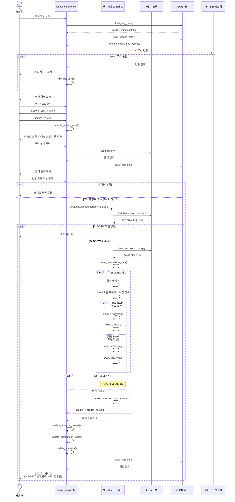
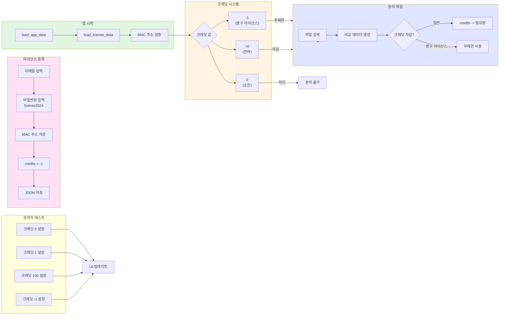
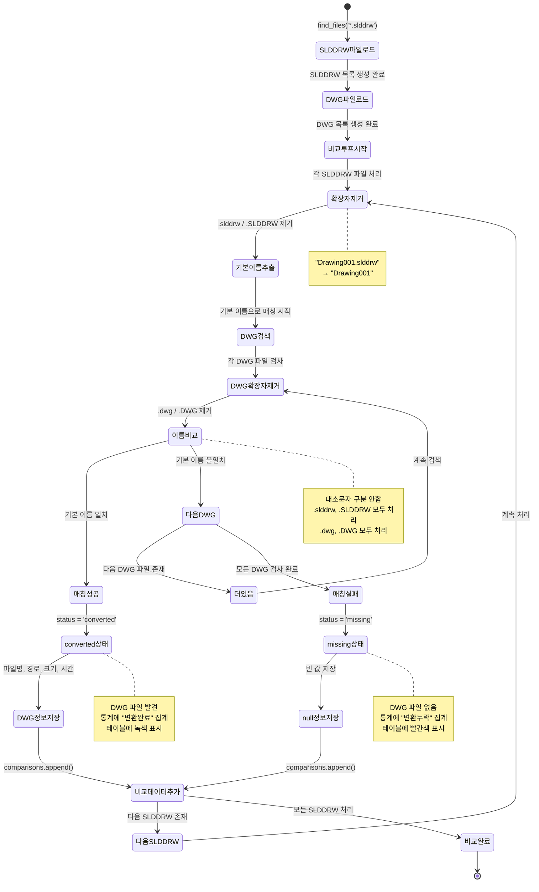

# Conversion Verifier# SOLIDWORKS DWG 변환 검증 시스템 v1.0


SLDDRW → DWG 변환 검증 도구SLDDRW 파일의 DWG 변환 완료 여부를 자동으로 검증하는 크레딧 기반 분석 도구


## 🎯 주요 기능## 프로젝트 개요


- SLDDRW 파일과 DWG 파일 비교 검증SOLIDWORKS에서 DWG로 변환한 도면 파일들의 변환 완료 상태를 자동으로 검증하여 누락된 파일을 식별하는 시스템입니다. 크레딧 또는 영구 라이선스 기반으로 운영되며, 100개 파일당 1크레딧을 소모합니다.

- 변환 누락 파일 자동 탐지

- 크레딧 기반 사용량 관리### 주요 기능

- WorksFree 플랫폼 통합

- **변환 상태 자동 검증**: SLDDRW ↔ DWG 파일명 매칭 및 상태 분석

## 🚀 빌드 방법- **크레딧 시스템**: 100개 파일 = 1 크레딧 차감

- **영구 라이선스 지원**: MAC 주소 기반 하드웨어 인증, 무제한 사용

### ONEDIR 빌드 (권장 - 빠른 로딩)- **실시간 진행률 표시**: 프로그레스바 및 상태 메시지

- **상세 비교 테이블**: 파일명, 크기, 수정시간, 변환 상태 표시

```powershell- **관리자 모드**: 테스트 데이터 생성, 크레딧 테스트, 라이선스 관리

.\build_conversion_verifier.ps1- **데이터 영속성**: JSON 파일로 크레딧 및 라이선스 정보 저장

```- **MAC 주소 검증**: 라이선스 이식 방지


### Clean 빌드## 시스템 아키텍처

```powershell

.\build_conversion_verifier.ps1 -Clean```mermaid

```flowchart TB

    Start([프로그램 시작]) --> LoadData[앱 데이터 로드<br/>JSON 파일]

## 📦 빌드 결과물    LoadData --> LoadLicense[라이선스 로드<br/>MAC 검증]


- **빌드 타입**: ONEDIR (폴더 방식)    LoadLicense --> MacCheck{MAC 주소<br/>일치?}

- **예상 시작 시간**: <1초    MacCheck -->|불일치| ResetLicense[라이선스 초기화<br/>크레딧 10]

- **결과 위치**: `dist/conversion_verifier/`    MacCheck -->|일치| GUI[메인 GUI 표시<br/>850x800]


## 🔧 개발 환경    ResetLicense --> GUI


- Python 3.13+    GUI --> SelectFolder[폴더 선택]

- PyInstaller 6.0+    SelectFolder --> EnableBtn[분석 버튼 활성화]

- WorksFree 공통 모듈 (10.common)

    EnableBtn --> AnalyzeClick[변환 결과 확인 클릭]

## 📋 표준 구조    AnalyzeClick --> CreditCheck{크레딧 확인}


```    CreditCheck -->|영구 라이선스| AnalysisThread[분석 스레드 시작]

conversion_verifier/    CreditCheck -->|크레딧 > 0| AnalysisThread

├── ui_main.py                      # BOM2Excel 패턴 적용    CreditCheck -->|크레딧 = 0| ErrorDialog[크레딧 부족 오류]

├── automation.py                   # 크레딧 통합 자동화

├── config.py                       # 설정 관리    AnalysisThread --> FindSLDDRW[SLDDRW 파일<br/>재귀 검색]

├── ui_setting.py                   # 설정 UI    FindSLDDRW --> FindDWG[DWG 파일<br/>재귀 검색]

├── conversion_verifier.spec        # PyInstaller ONEDIR spec

├── build_conversion_verifier.ps1   # 빌드 스크립트    FindDWG --> CreateComparison[비교 데이터 생성]

└── README.md                       # 문서    CreateComparison --> MatchLoop{각 SLDDRW<br/>파일 처리}

```

    MatchLoop --> ExtractBase[확장자 제거<br/>기본 이름 추출]

## ⚡ 최적화 적용    ExtractBase --> SearchDWG{DWG 파일<br/>매칭?}


1. **Startup Profiler**: 시작 시간 측정    SearchDWG -->|발견| Converted[상태: converted<br/>DWG 정보 저장]

2. **Single Instance Guard**: Windows mutex로 중복 실행 방지    SearchDWG -->|없음| Missing[상태: missing<br/>DWG 정보 null]

3. **Lazy Import**: automation 모듈 지연 로딩

4. **ONEDIR Build**: UPX 비활성화로 빠른 로딩 (<1초)    Converted --> NextFile{다음 파일?}

    Missing --> NextFile

## 🔑 크레딧 시스템

    NextFile -->|예| MatchLoop

- `deduct_credits_by_policy()`: 정책 기반 크레딧 차감    NextFile -->|아니오| CreditDeduct{크레딧<br/>차감?}

- 파일당 크레딧 차감

- 자동 동기화 및 복구    CreditDeduct -->|영구 라이선스| UpdateUI[UI 업데이트]

    CreditDeduct -->|일반| CalcCredit[필요 크레딧 계산<br/>100개당 1]

## 📝 사용법

    CalcCredit --> DeductCredit[크레딧 차감]

1. **폴더 선택**: SLDDRW 파일이 있는 폴더 선택    DeductCredit --> UpdateUI

2. **변환 확인**: 클릭하여 DWG 파일 매칭 확인

3. **결과 확인**: 팝업 창에서 변환 완료/누락 확인    UpdateUI --> UpdateTable[비교 테이블 업데이트<br/>Treeview]

    UpdateTable --> UpdateStats[통계 업데이트<br/>변환율 계산]
    UpdateStats --> SaveData[데이터 저장<br/>JSON]
    SaveData --> ShowComplete[완료 메시지박스]

    ShowComplete --> End([작업 완료])
    ErrorDialog --> End

    style Start fill:#e1f5e1
    style End fill:#ffe1e1
    style AnalyzeClick fill:#fff4e1
    style CreditCheck fill:#ffe1f5
```

## 워크플로우 다이어그램

### 1. 전체 처리 시퀀스



### 2. 크레딧 및 라이선스 관리



### 3. 파일 매칭 알고리즘



## 설치 및 실행

### 필수 요구사항

```
Python 3.8+
tkinter (Python 기본 포함)
```

### 의존 모듈 (10.common 폴더)

```python
# 선택적 의존성 - 없으면 Mock 클래스 자동 생성
import wf_log        # 로깅 시스템
import wf_license    # 라이선스 관리
import wf_email      # 이메일 발송
import wf_gen_code   # 인증 코드 생성
import wf_hwinfo     # 하드웨어 정보
```

**Mock 모드**: 10.common 모듈이 없어도 실행 가능 (데모용 Mock 클래스 자동 생성)

### 실행 방법

```bash
python ConversionVerifier.py
```

## 사용 방법

### 첫 실행 - 초기 상태

1. 프로그램 실행 시 자동으로 데이터 로드
   - 크레딧: 10개 (기본값)
   - 폴더: 이전 선택 폴더 (있을 경우)
   - 라이선스: 없음

2. 우측 상단 크레딧 표시 확인
   - `💰 10 크레딧` (기본)
   - `♾️ 영구 라이선스` (등록 시)

### 기본 작업 흐름

1. **폴더 선택**
   - '📂 폴더 선택' 버튼 클릭
   - SLDDRW 및 DWG 파일이 있는 폴더 선택
   - 기본 경로: `d:\test_data`

2. **변환 결과 확인**
   - '🔍 변환 결과 확인' 버튼 클릭
   - 크레딧 자동 차감 (100개당 1크레딧)
   - 진행률 실시간 표시

3. **결과 확인**
   - 통계 표시:
     - SLDDRW: n개
     - 변환완료: n개 (초록색)
     - 변환누락: n개 (빨간색)
     - 변환율: n% (파란색)
   - 비교 테이블:
     - 번호, SLDDRW 파일, DWG 파일, 상태, 크기, 수정시간
     - 변환완료: 녹색 배경, `✅ 변환완료`
     - 변환누락: 빨간색 배경, `⚠️ 변환누락`

4. **데이터 초기화**
   - '🗑️ 변환 결과 초기화' 버튼 클릭
   - 분석 결과만 초기화 (폴더 정보 유지)

### 관리자 모드

**진입 방법**:
1. '🔐 관리자 모드' 버튼 클릭
2. 비밀번호 입력: `admin123`
3. 관리자 탭 자동 추가

**제공 탭**:

**1. 🔧 테스트 도구**
- 테스트 데이터 생성/삭제
- 크레딧 테스트 (0, 1, 100, -1)

**2. 🔑 라이선스 관리**
- 시스템 정보 (MAC 주소)
- 라이선스 등록/해제
- 라이선스 상태 표시

**해제 방법**:
1. '🔓 관리자 모드 해제' 버튼 클릭
2. 관리자 탭 자동 제거
3. 메인 탭으로 전환

### 테스트 데이터 생성

1. 관리자 모드 진입
2. '테스트 도구' 탭 선택
3. '🎲 테스트 데이터 생성' 버튼 클릭
4. 폴더 선택 다이얼로그
5. 생성 결과:
   - 폴더: `선택폴더/SolidWorks_Test_Data`
   - SLDDRW 파일: 20개
   - DWG 파일: 16개 (80% 변환율)
   - 파일 내용: 더미 텍스트

**파일명 샘플**:
- Drawing001_001.slddrw / Drawing001_001.dwg
- Assembly_Main_002.slddrw / Assembly_Main_002.dwg
- ...
- End_Cap_020.slddrw (DWG 없음 - 누락 케이스)

### 크레딧 테스트

관리자 모드 → 테스트 도구 탭:

| 버튼 | 설정 값 | 용도 |
|------|---------|------|
| 크레딧 0<br/>(소진) | 0 | 크레딧 부족 오류 테스트 |
| 크레딧 1<br/>(부족) | 1 | 부족 크레딧 동작 테스트 |
| 크레딧 100<br/>(충분) | 100 | 정상 동작 테스트 |
| 크레딧 -1<br/>(영구 라이선스) | -1 | 무제한 사용 테스트 |

### 라이선스 등록

1. 관리자 모드 진입
2. '라이선스 관리' 탭 선택
3. 시스템 정보 확인 (MAC 주소)
4. 이메일 주소 입력
5. '🔑 라이선스 등록' 버튼 클릭
6. 비밀번호 입력: `license2024`
7. 등록 완료 메시지 확인

**등록 효과**:
- 크레딧: -1 (무제한)
- 라이선스 파일 생성: `solidworks_license.json`
- MAC 주소 저장 (하드웨어 인증)
- 우측 상단: `♾️ 영구 라이선스 ✅`

**라이선스 해제**:
1. 라이선스 관리 탭
2. '🔓 라이선스 해제' 버튼 클릭
3. 확인 다이얼로그 → 예
4. 크레딧 10으로 초기화

## 핵심 클래스 및 메소드

### ConversionVerifier 클래스

**주요 메소드**:

| 메소드 | 설명 |
|--------|------|
| `__init__()` | Tkinter GUI 초기화, 데이터 로드 |
| `create_widgets()` | 메인 프레임, 헤더, 노트북 구성 |
| `create_main_tab_content()` | 메인 탭 (폴더 선택, 진행률, 통계, 테이블) |
| `create_admin_tabs()` | 관리자 탭 추가 (테스트 도구, 라이선스 관리) |
| `create_test_tab_content()` | 테스트 도구 탭 내용 |
| `create_license_tab_content()` | 라이선스 관리 탭 내용 |
| `toggle_admin_mode()` | 관리자 모드 전환 (비밀번호 검증) |
| `select_folder()` | 폴더 선택 다이얼로그, 데이터 저장 |
| `analyze_folder()` | 변환 결과 확인 (크레딧 체크 → 스레드 시작) |
| `perform_analysis()` | 분석 실행 (백그라운드 스레드) |
| `find_files(folder, pattern)` | 재귀 파일 검색 (rglob) |
| `create_comparison_data()` | SLDDRW ↔ DWG 비교 데이터 생성 |
| `finish_analysis()` | 분석 완료 후 UI 정리 |
| `update_analysis_results()` | 통계 계산 및 UI 업데이트 |
| `update_comparison_table()` | Treeview 테이블 업데이트 |
| `generate_test_data()` | 테스트 데이터 자동 생성 |
| `clear_analysis_data()` | 분석 데이터 초기화 |
| `restore_original()` | 테스트 데이터 삭제 |
| `register_license()` | 영구 라이선스 등록 |
| `revoke_license()` | 라이선스 해제 |
| `save_app_data()` | 앱 데이터 JSON 저장 |
| `save_license_data()` | 라이선스 데이터 JSON 저장 |
| `load_app_data()` | 앱 데이터 JSON 로드 |
| `load_license_data()` | 라이선스 데이터 로드 및 MAC 검증 |
| `update_ui()` | UI 상태 업데이트 (크레딧 표시, 버튼 상태) |

## 데이터 파일 구조

### 앱 데이터 파일

**파일명**: `solidworks_validator_data.json`

**구조**:
```json
{
  "credits": 10,
  "selected_folder": "D:/test_data/SolidWorks_Test_Data",
  "last_analysis": "2025-10-15T14:30:00.123456"
}
```

### 라이선스 파일

**파일명**: `solidworks_license.json`

**구조**:
```json
{
  "license_email": "user@company.com",
  "mac_address": "AA:BB:CC:DD:EE:FF",
  "registered_date": "2025-10-15T15:00:00.123456",
  "is_permanent": true
}
```

**MAC 주소 검증**:
- 앱 시작 시 현재 MAC 주소와 저장된 MAC 주소 비교
- 불일치 시 라이선스 자동 초기화
- 경고 메시지 표시

## 크레딧 시스템

### 크레딧 정책

| 파일 수 | 필요 크레딧 | 계산식 |
|---------|-------------|--------|
| 1~100 | 1 | max(1, (n + 99) // 100) |
| 101~200 | 2 | max(1, (201 + 99) // 100) = 3 |
| 201~300 | 3 | max(1, (301 + 99) // 100) = 4 |

**특수 크레딧 값**:
- `-1`: 영구 라이선스 (무제한 사용)
- `0`: 소진 (분석 불가)
- `> 0`: 잔여 크레딧

### 크레딧 차감 시점

```python
# 분석 완료 후 차감
if self.credits != -1:
    total_files = len(self.slddrw_files)
    credits_needed = max(1, (total_files + 99) // 100)

    if self.credits < credits_needed:
        # 크레딧 부족 오류
        return

    self.credits = max(0, self.credits - credits_needed)
```

**안전장치**:
- 분석 시작 전 크레딧 체크
- 부족 시 오류 메시지 표시 및 분석 중단
- 영구 라이선스는 체크 건너뛰기

### 크레딧 표시

| 상태 | 표시 | 색상 |
|------|------|------|
| 영구 라이선스 | ♾️ 영구 라이선스 ✅ | 파란색 (굵게) |
| 크레딧 > 0 | 💰 n 크레딧 | 검정색 |
| 크레딧 = 0 | 💰 0 크레딧 | 주황색 |
| 크레딧 < 0 (오류) | 💰 -n 크레딧 | 빨간색 |

## 비교 테이블 상세

### Treeview 컬럼

| 컬럼 | 너비 | 내용 |
|------|------|------|
| 번호 | 50px | 1, 2, 3, ... |
| SLDDRW 파일 | 150px | 파일명 (예: Drawing001_001.slddrw) |
| DWG 파일 | 150px | 파일명 또는 `-` (누락 시) |
| 상태 | 100px | `✅ 변환완료` / `⚠️ 변환누락` |
| 크기 | 150px | `1.2 KB` 또는 `1.2 KB → 3.4 KB` |
| 수정시간 | 150px | `2025-10-15 14:30` 또는 `-` |

### 태그 색상

```python
self.tree.tag_configure('missing', background='#ffebee', foreground='#c62828')  # 빨간색
self.tree.tag_configure('converted', background='#e8f5e8', foreground='#2e7d32')  # 초록색
```

### 파일 크기 포맷

```python
def format_file_size(bytes_size):
    for unit in ['B', 'KB', 'MB', 'GB']:
        if bytes_size < 1024.0:
            return f"{bytes_size:.1f} {unit}"
        bytes_size /= 1024.0
    return f"{bytes_size:.1f} TB"
```

## 처리 결과 통계

### 통계 계산

```python
converted = len([x for x in comparison_data if x['status'] == 'converted'])
missing = len([x for x in comparison_data if x['status'] == 'missing'])
total = len(slddrw_files)
rate = (converted / total * 100) if total > 0 else 0
```

### 완료 메시지

**일반 크레딧**:
```
파일 분석이 완료되었습니다!

SLDDRW 파일: 20개
변환완료: 16개
변환누락: 4개
변환율: 80.0%
```

**영구 라이선스**:
```
파일 분석이 완료되었습니다!
(영구 라이선스 - 크레딧 무제한)

SLDDRW 파일: 20개
변환완료: 16개
변환누락: 4개
변환율: 80.0%
```

## 하드웨어 정보 및 MAC 주소

### MAC 주소 가져오기

```python
# wf_hwinfo 모듈 사용 (우선순위)
if hasattr(wfhwinfo, 'fingerprint'):
    mac_address = wfhwinfo.fingerprint
elif hasattr(wfhwinfo, 'get_network_interface_info'):
    mac_address = wfhwinfo.get_network_interface_info()
else:
    mac_address = wfhwinfo.get_mac_address()

# 직접 생성 (폴백)
import uuid
mac = ':'.join(['{:02x}'.format((uuid.getnode() >> elements) & 0xff)
               for elements in range(0,2*6,2)][::-1])
mac_address = mac.upper()
```

### MAC 주소 검증 로직

```python
def load_license_data(self):
    saved_mac = data.get('mac_address', '')
    if saved_mac != self.mac_address:
        messagebox.showwarning("라이선스 경고",
                             "이 컴퓨터와 라이선스 정보가 일치하지 않습니다.\n"
                             "라이선스가 초기화됩니다.")
        self.license_email = ''
        if self.credits == -1:
            self.credits = 10
        self.save_license_data()
```

**보안 특징**:
- 라이선스는 특정 컴퓨터에만 유효
- 다른 컴퓨터로 이식 시 자동 무효화
- 크레딧 방식으로 자동 전환

## 제약 사항 및 주의 사항

### 파일 매칭 규칙

- **확장자 제거 비교**: `Drawing001.slddrw` ↔ `Drawing001.dwg`
- **대소문자 구분**: `.slddrw`, `.SLDDRW`, `.dwg`, `.DWG` 모두 처리
- **정확한 이름 매칭**: 부분 매칭 지원 안함
- **첫 번째 매칭**: 중복 이름 시 첫 번째 발견된 파일 사용

### 처리 방식

- **재귀 탐색**: `pathlib.rglob()` 사용, 모든 하위 폴더 검색
- **파일만 처리**: 폴더는 제외
- **경로 정보**: 파일 전체 경로 저장 (상대 경로 아님)
- **크기 정보**: 바이트 단위로 저장, 표시는 KB/MB/GB 변환

### 데이터 영속성

- **세션 간 유지**: JSON 파일로 크레딧 및 라이선스 저장
- **MAC 주소 연동**: 라이선스는 MAC 주소와 함께 저장
- **분석 결과**: 메모리에만 저장, 앱 재실행 시 초기화

## 문제 해결

### 자주 발생하는 오류

**Q: "크레딧이 부족합니다"**
- A: 관리자 모드 → 크레딧 테스트로 크레딧 충전 또는 라이선스 등록

**Q: "SLDDRW 파일이 폴더에 없습니다"**
- A: 올바른 폴더 선택 확인, 파일 확장자 확인 (.slddrw)

**Q: "라이선스 경고 - MAC 주소 불일치"**
- A: 라이선스는 등록한 컴퓨터에서만 유효. 새 컴퓨터에서 재등록 필요

**Q: "관리자 모드 비밀번호를 모릅니다"**
- A: 기본 비밀번호: `admin123`

**Q: "라이선스 등록 비밀번호를 모릅니다"**
- A: 라이선스 비밀번호: `license2024`

**Q: "분석이 진행 중인데 중단할 수 없습니다"**
- A: 백그라운드 스레드가 완료될 때까지 대기 (강제 중단 불가)

### 로그 확인

**wf_log 사용 시**:
- 로그 파일 위치: `logs/YYYYMMDD.txt`
- 로그 레벨: INFO (20)

**Mock 모드 시**:
- 콘솔 출력: `print(f"[INFO] {message}")`

## UI 컴포넌트

### 메인 윈도우 레이아웃 (850x800)

**헤더** (항상 표시):
- 제목: 🔧 SOLIDWORKS DWG 변환 검증 시스템
- 크레딧 표시: 💰 n 크레딧 또는 ♾️ 영구 라이선스
- 관리자 모드 버튼: 🔐 관리자 모드 / 🔓 관리자 모드 해제

**노트북 (탭 컨테이너)**:
1. **📊 변환 검증** (기본 탭)
   - 폴더 선택 섹션
   - 분석 진행 상태 섹션 (프로그레스바)
   - 분석 결과 통계 (4가지 수치)
   - 파일 변환 상태 비교표 (Treeview)

2. **🔧 테스트 도구** (관리자 전용)
   - 테스트 데이터 관리
   - 크레딧 테스트 (4가지 버튼)
   - 현재 크레딧 표시

3. **🔑 라이선스 관리** (관리자 전용)
   - 시스템 정보 (MAC 주소)
   - 이메일 인증
   - 라이선스 상태 표시

### 스크롤 처리

**메인 탭**:
- Canvas + Scrollbar로 수직 스크롤 구현
- 화면 크기보다 내용이 많을 때 자동 스크롤바 표시

**Treeview 테이블**:
- 수직/수평 스크롤바 기본 제공
- 많은 파일도 처리 가능

## 테스트 케이스

### 테스트 데이터 파일명

```python
file_names = [
    "Drawing001", "Assembly_Main", "Part_Detail", "Section_View", "Exploded_View",
    "Front_Panel", "Side_View", "Top_View", "Bottom_Plate", "Cover_Assembly",
    "Motor_Mount", "Bearing_Housing", "Shaft_Detail", "Gear_Assembly", "Frame_Structure",
    "Base_Plate", "Support_Bracket", "Drive_Shaft", "Connector_Housing", "End_Cap"
]
```

### 변환율 시나리오

| SLDDRW | DWG | 변환율 | 용도 |
|--------|-----|--------|------|
| 20개 | 20개 | 100% | 완벽 변환 테스트 |
| 20개 | 16개 | 80% | 일부 누락 테스트 (기본) |
| 20개 | 10개 | 50% | 많은 누락 테스트 |
| 20개 | 0개 | 0% | 전체 누락 테스트 |

## 비밀번호

| 용도 | 비밀번호 | 설명 |
|------|----------|------|
| 관리자 모드 | `admin123` | 테스트 도구, 라이선스 관리 탭 접근 |
| 라이선스 등록 | `license2024` | 영구 라이선스 등록 시 필요 |

## 기술 스택

- **언어**: Python 3.8+
- **GUI**: Tkinter / ttk
- **파일 탐색**: pathlib.Path (rglob)
- **데이터 저장**: json (앱 데이터, 라이선스)
- **날짜/시간**: datetime
- **다중 스레드**: threading.Thread
- **하드웨어 정보**: uuid (MAC 주소)
- **해시**: hashlib (선택적)

## 개발 정보

- **버전**: v1.0
- **플랫폼**: Windows, Mac, Linux
- **개발사**: WorksFree

## 변경 이력

### v1.0 (현재)
- 초기 릴리스
- SLDDRW ↔ DWG 변환 검증 기능
- 크레딧 시스템 구현
- 영구 라이선스 지원
- MAC 주소 기반 하드웨어 인증
- 관리자 모드 (테스트 도구, 라이선스 관리)
- 테스트 데이터 자동 생성
- JSON 기반 데이터 영속성

## 라이선스

WorksFree 데모 라이선스

---

## 부록: 알고리즘 상세

### 파일 매칭 알고리즘 의사코드

```
function create_comparison_data():
    comparisons = []

    for each slddrw in slddrw_files:
        base_name = slddrw.name.replace('.slddrw', '').replace('.SLDDRW', '')
        dwg_match = null

        for each dwg in dwg_files:
            dwg_base = dwg.name.replace('.dwg', '').replace('.DWG', '')

            if dwg_base == base_name:
                dwg_match = dwg
                break  // 첫 번째 매칭만 사용

        if dwg_match:
            status = 'converted'
            comparisons.append({
                slddrw_file: slddrw.name,
                dwg_file: dwg_match.name,
                status: 'converted',
                dwg_size: dwg_match.size,
                modified_time: dwg_match.modified
            })
        else:
            status = 'missing'
            comparisons.append({
                slddrw_file: slddrw.name,
                dwg_file: '',
                status: 'missing',
                dwg_size: 0,
                modified_time: null
            })

    return comparisons
```

### 크레딧 계산 공식

```
credits_needed = max(1, (total_files + 99) // 100)

예시:
- 1개 파일: max(1, (1 + 99) // 100) = max(1, 1) = 1
- 50개 파일: max(1, (50 + 99) // 100) = max(1, 1) = 1
- 100개 파일: max(1, (100 + 99) // 100) = max(1, 1) = 1
- 101개 파일: max(1, (101 + 99) // 100) = max(1, 2) = 2
- 200개 파일: max(1, (200 + 99) // 100) = max(1, 2) = 2
- 201개 파일: max(1, (201 + 99) // 100) = max(1, 3) = 3
```

### MAC 주소 생성 알고리즘

```python
import uuid

# uuid.getnode()는 48비트 MAC 주소를 정수로 반환
node = uuid.getnode()

# 바이트 단위로 분리하여 16진수 문자열로 변환
mac_bytes = []
for i in range(0, 2*6, 2):
    byte_value = (node >> i) & 0xff
    mac_bytes.append('{:02x}'.format(byte_value))

# 역순으로 정렬 후 ':' 구분자로 연결
mac = ':'.join(mac_bytes[::-1])

# 대문자로 변환
mac_address = mac.upper()

# 결과 예: "AA:BB:CC:DD:EE:FF"
```
