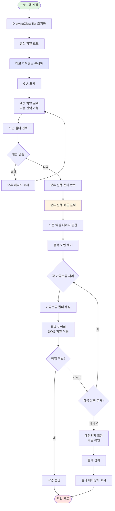
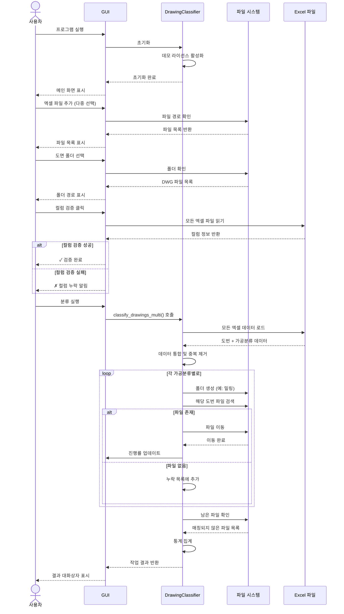
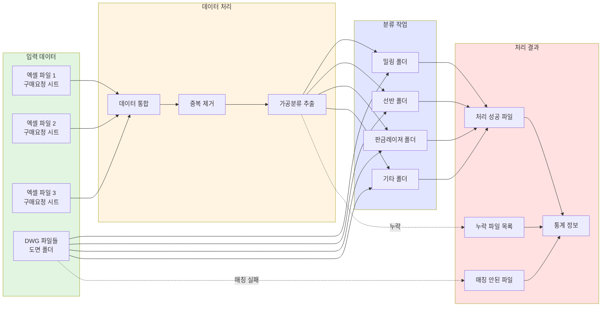

# 도면 분류 자동화 프로그램 v3.1

엑셀 발주관리서 기반 CAD 도면(DWG) 자동 분류 시스템 - 데모 버전

## 프로젝트 개요

CAD 도면 파일들을 엑셀 발주관리서의 가공분류 정보를 기반으로 자동으로 폴더별로 분류하는 RPA 자동화 프로그램입니다. 여러 개의 엑셀 파일을 동시에 처리할 수 있으며, 데모 버전은 등록 과정 없이 모든 기능을 무제한으로 사용할 수 있습니다.

### 주요 기능

- **다중 엑셀 파일 처리**: 여러 발주관리서를 통합하여 한 번에 처리
- **가공분류별 자동 폴더 생성**: 밀링, 선반, 판금레이져 등 분류별 폴더 자동 생성
- **중복 도면 자동 제거**: 여러 엑셀에 중복된 도번 자동 필터링
- **누락 파일 추적**: 엑셀에는 있지만 파일이 없는 도면 목록화
- **매칭되지 않은 파일 감지**: 엑셀에 없는 도면 파일 식별
- **테스트 데이터 자동 생성**: 샘플 데이터로 기능 테스트 가능
- **도면 복원 기능**: 분류 작업 취소 및 원상 복구
- **데모 모드**: 크레딧 무제한, 등록 불필요

## 시스템 아키텍처



## 워크플로우 다이어그램

### 1. 전체 처리 흐름



### 2. 데이터 처리 흐름



### 3. 파일 이동 상태 다이어그램

```mermaid
stateDiagram-v2
    [*] --> 도면폴더: DWG 파일 대기

    도면폴더 --> 엑셀조회: 도번 확인

    엑셀조회 --> 가공분류확인: 도번 매칭 성공
    엑셀조회 --> 매칭안됨: 도번 매칭 실패

    가공분류확인 --> 밀링: 밀링 분류
    가공분류확인 --> 선반: 선반 분류
    가공분류확인 --> 판금레이져: 판금레이져 분류
    가공분류확인 --> 기타: 기타 분류

    밀링 --> 이동완료: 파일 이동
    선반 --> 이동완료: 파일 이동
    판금레이져 --> 이동완료: 파일 이동
    기타 --> 이동완료: 파일 이동

    매칭안됨 --> 원위치유지: 처리 종료
    이동완료 --> [*]
    원위치유지 --> [*]

    note right of 엑셀조회
        엑셀 파일에서
        도번/규격 컬럼 검색
    end note

    note right of 가공분류확인
        제조사/가공분류
        컬럼 값 확인
    end note
```



## 설치 및 실행

### 필수 요구사항

```
Python 3.8+
pandas
openpyxl
tkinter (Python 기본 포함)
```

### 의존 모듈 (10.common 폴더)

- `wf_log`: 로깅 시스템
- `wf_license_ReadMe`: 라이선스 관리
- `wf_email`: 이메일 발송
- `wf_hw_info`: 하드웨어 정보
- `wf_setting`: 설정 관리

### 실행 방법

```bash
python DemoDrawingClassifier.py
```

## 사용 방법

### 기본 작업 흐름

1. **도면 폴더 선택**
   - '찾기' 버튼으로 DWG 파일이 있는 폴더 선택

2. **엑셀 파일 추가**
   - '추가' 버튼으로 여러 엑셀 파일 선택 가능
   - '구매요청' 시트가 포함된 발주관리서 파일

3. **컬럼 설정**
   - 도번 컬럼: `도번/규격` (기본값)
   - 가공분류 컬럼: `제조사/가공분류` (기본값)
   - '컬럼 검증' 버튼으로 유효성 확인

4. **분류 실행**
   - '분류 실행' 버튼 클릭
   - 진행 상황 실시간 표시
   - 완료 시 결과 대화상자 표시

### 관리자 모드

**비밀번호**: `demo123`

**제공 기능**:
- 실행 로그 표시/숨기기
- 테스트 데이터 자동 생성
- 도면 복원 (분류 취소)
- 설정 파일 초기화

### 테스트 데이터 생성

관리자 모드에서 '테스트 데이터 생성' 버튼 클릭 시:
- 엑셀 파일 3개 자동 생성
- DWG 파일 약 100개 생성
- 위치: `D:\test_data\dwg_classifier-100`

자동으로 생성되는 내용:
- 다양한 가공분류 (밀링, 선반, 판금레이져 등)
- 중복 도번 (테스트용)
- 의도적 누락 파일 (약 5%)
- 매칭되지 않는 파일 (10개)

## 핵심 클래스 및 메소드

### DrawingClassifier 클래스

**주요 메소드**:

| 메소드 | 설명 |
|--------|------|
| `__init__()` | 시스템 초기화, 로거 설정, 데모 라이선스 활성화 |
| `classify_drawings_multi()` | 다중 엑셀 파일 기반 도면 분류 실행 |
| `get_material_process_list()` | 엑셀에서 가공분류 목록 추출 (중복 제거) |
| `create_test_data()` | 테스트용 샘플 데이터 자동 생성 |
| `restore_drawings()` | 분류된 도면을 원래 위치로 복원 |
| `load_settings()` | JSON 설정 파일 로드 |
| `save_settings()` | JSON 설정 파일 저장 |

### DemoWFLicense 클래스

데모용 라이선스 클래스 - `wf_license.WFLicense` 상속

**특징**:
- 구글 시트 연동 없음
- 크레딧 무제한 (`-1` 반환)
- 등록 과정 불필요
- 모든 검증 항상 성공

### DrawingClassifierGUI 클래스

Tkinter 기반 GUI 인터페이스

**주요 기능**:
- 다중 엑셀 파일 선택 UI
- 진행률 표시 (프로그레스바)
- 실시간 로그 표시 (관리자 모드)
- 컬럼 검증 UI
- 결과 통계 대화상자

## 설정 파일

**위치**: `logs/.config.json`

**구조**:
```json
{
  "drawing_column": "도번/규격",
  "category_column": "제조사/가공분류",
  "show_log": false,
  "auto_scroll": true,
  "last_excel_paths": [],
  "last_drawings_path": "",
  "admin_mode": false
}
```

## 로그 시스템

**로그 파일 위치**: `logs/YYYYMMDD.log`

**로그 레벨**:
- `DEBUG` (10): 상세 디버그 정보
- `INFO` (20): 일반 정보
- `WARNING` (30): 경고
- `ERROR` (40): 오류

**주요 로그 항목**:
- 시스템 초기화
- 파일 이동 작업
- 누락 파일 감지
- 분류 완료 통계

## 처리 결과 통계

분류 완료 시 제공되는 정보:

| 항목 | 설명 |
|------|------|
| 처리된 엑셀 파일 | 통합 처리된 엑셀 파일 개수 |
| 전체 도면 파일 | 도면 폴더 내 DWG 파일 총 개수 |
| 엑셀 도면 수 | 엑셀에 기록된 도번 개수 (중복 제거 후) |
| 처리된 파일 | 성공적으로 이동된 파일 개수 |
| 누락된 파일 | 엑셀에는 있지만 파일이 없는 개수 |
| 매칭되지 않은 파일 | 파일은 있지만 엑셀에 없는 개수 |
| 실행 시간 | 전체 작업 소요 시간 (초) |
| 분류 결과 | 각 가공분류별 이동된 파일 개수 |

## 제약 사항 및 주의 사항

### 데이터 요구사항

1. **엑셀 파일**:
   - 시트명이 `구매요청`이어야 함
   - 도번 컬럼 필수 (기본: `도번/규격`)
   - 가공분류 컬럼 필수 (기본: `제조사/가공분류`)

2. **DWG 파일**:
   - 파일명이 도번과 정확히 일치해야 함
   - 예: 도번 `ABC123` → 파일명 `ABC123.dwg`
   - 대소문자 구분 없음

### 처리 방식

- **중복 도번**: 첫 번째 발견된 가공분류로 분류
- **빈 가공분류**: 해당 도번 건너뜀
- **파일 덮어쓰기**: 동일 파일이 목적지에 있으면 덮어씀
- **처리 속도**: 파일당 약 0.05초 대기 (안정성)

## 문제 해결

### 자주 발생하는 오류

**Q: "구매요청 시트가 없습니다"**
- A: 엑셀 파일에 `구매요청` 시트명 확인

**Q: "컬럼을 찾을 수 없습니다"**
- A: 컬럼명이 정확한지 확인, '컬럼 검증' 버튼으로 확인

**Q: "파일 이동 권한 오류"**
- A: 관리자 권한으로 실행, 파일 사용 중인지 확인

**Q: "매칭되지 않은 파일이 많습니다"**
- A: DWG 파일명과 엑셀 도번이 일치하는지 확인

### 로그 확인

관리자 모드 → '로그 파일 열기' → `logs` 폴더에서 상세 로그 확인

## 데모 버전 vs 정식 버전

| 기능 | 데모 버전 | 정식 버전 |
|------|----------|----------|
| 등록 과정 | 불필요 | 필수 (이메일, 전화번호) |
| 크레딧 | 무제한 | 사용량 기반 차감 |
| 구글 시트 연동 | 없음 | 있음 (사용자 관리) |
| 기능 제한 | 없음 | 크레딧 소진 시 중지 |
| 라이선스 종류 | 영구 (데모) | 체험판/정식 라이선스 |

## 라이선스

WorksFree 데모 라이선스

## 개발 정보

- **버전**: v3.1
- **언어**: Python 3.8+
- **GUI**: Tkinter
- **데이터 처리**: pandas, openpyxl
- **개발사**: WorksFree

## 변경 이력

### v3.1 (현재)
- 데모 버전 출시
- 다중 엑셀 파일 처리 지원
- 컬럼 검증 기능 추가
- 테스트 데이터 자동 생성 기능
- 도면 복원 기능 추가

### v3.0
- GUI 개선
- 관리자 모드 추가
- 로그 시스템 강화

### v2.0
- 크레딧 시스템 도입
- 라이선스 관리 추가

### v1.0
- 기본 도면 분류 기능
