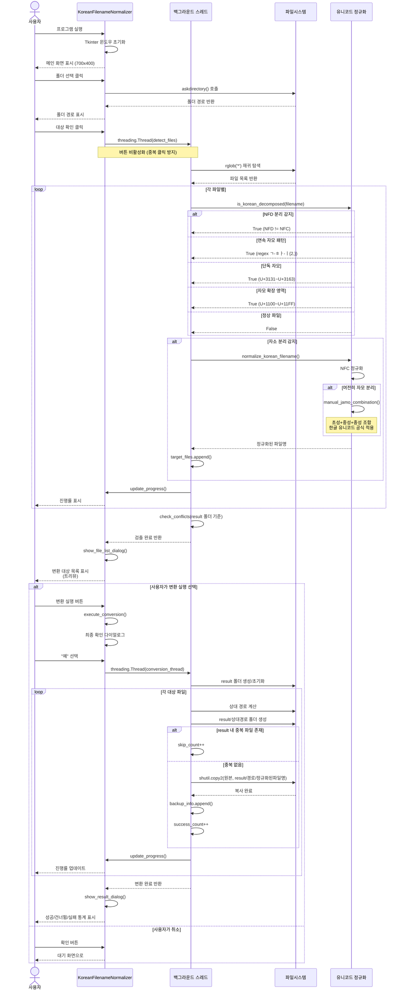
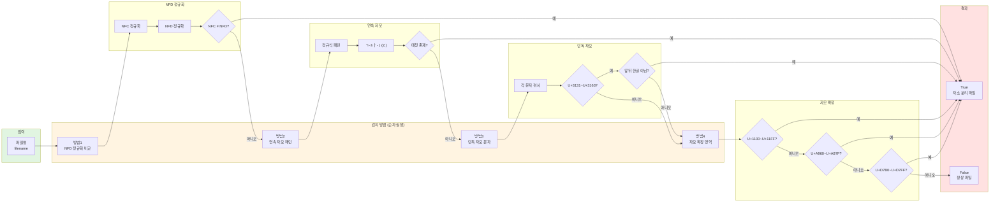
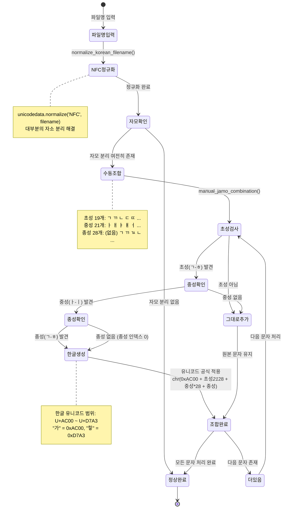

# 한글 파일명 자소 분리 수정 프로그램 v3.1

자소 분리된 한글 파일명을 자동으로 감지하고 정상 파일명으로 변환하는 GUI 프로그램

## 프로젝트 개요

Windows 시스템에서 발생하는 한글 파일명의 자소 분리 현상(예: "한글" → "ㅎㅏㄴㄱㅡㄹ")을 범용적으로 감지하고, 유니코드 정규화 및 자모 조합 알고리즘을 통해 정상 파일명으로 복원하는 자동화 도구입니다.

### 주요 기능

- **범용 자소 분리 감지**: NFD 정규화, 연속 자모 패턴, 단독 자모, 자모 확장 영역 등 4가지 방법으로 감지
- **자동 파일명 정규화**: NFC 정규화 및 수동 자모 조합 알고리즘 적용
- **충돌 방지**: 변환 후 파일명 중복 감지 및 건너뛰기
- **result 폴더 분리**: 원본 파일 보존, 변환 결과만 별도 저장
- **진행률 실시간 표시**: 프로그레스바 및 상태 메시지
- **관리자 모드**: 테스트 데이터 생성, 원상복구, 상세 로그 표시
- **다중 스레드 처리**: UI 블로킹 없이 백그라운드 작업
- **윈도우 리사이징**: 관리자 모드 전환 시 자동 크기 조정

## 시스템 아키텍처

```mermaid
flowchart TB
    Start([프로그램 시작]) --> Init[KoreanFilenameNormalizer<br/>초기화]
    Init --> GUI[GUI 표시<br/>700x400]

    GUI --> SelectFolder[폴더 선택]
    SelectFolder --> CheckTarget[대상 확인 클릭]

    CheckTarget --> ScanThread[백그라운드<br/>스레드 시작]
    ScanThread --> RecursiveSearch[폴더 재귀 탐색<br/>rglob'*']

    RecursiveSearch --> DetectLoop{각 파일<br/>검사}
    DetectLoop --> Method1{NFD<br/>정규화 비교}
    Method1 -->|다름| AddTarget[대상 목록 추가]
    Method1 -->|같음| Method2{연속 자모<br/>패턴 검사}

    Method2 -->|발견| AddTarget
    Method2 -->|없음| Method3{단독 자모<br/>검사}

    Method3 -->|발견| AddTarget
    Method3 -->|없음| Method4{자모 확장<br/>영역 검사}

    Method4 -->|발견| AddTarget
    Method4 -->|없음| NextFile[다음 파일]

    AddTarget --> Normalize[NFC 정규화<br/>+자모 조합]
    Normalize --> NextFile
    NextFile --> MoreFiles{다음 파일<br/>존재?}

    MoreFiles -->|예| DetectLoop
    MoreFiles -->|아니오| ConflictCheck[충돌 확인<br/>result 폴더 기준]

    ConflictCheck --> ShowDialog[파일 목록<br/>다이얼로그]
    ShowDialog --> UserDecision{사용자<br/>선택}

    UserDecision -->|취소| End([작업 완료])
    UserDecision -->|변환 실행| ConfirmDialog[최종 확인<br/>다이얼로그]

    ConfirmDialog -->|아니요| End
    ConfirmDialog -->|예| ConversionThread[변환 스레드<br/>시작]

    ConversionThread --> CreateResult[result 폴더<br/>생성/초기화]
    CreateResult --> CopyLoop{각 파일<br/>처리}

    CopyLoop --> CheckConflict{result 내<br/>충돌 확인}
    CheckConflict -->|충돌| Skip[건너뛰기]
    CheckConflict -->|정상| CopyFile[파일 복사<br/>shutil.copy2]

    CopyFile --> Backup[백업 정보 저장]
    Backup --> MoreConvert{다음 파일<br/>존재?}
    Skip --> MoreConvert

    MoreConvert -->|예| CopyLoop
    MoreConvert -->|아니오| ShowResult[결과 다이얼로그]

    ShowResult --> End

    style Start fill:#e1f5e1
    style End fill:#ffe1e1
    style CheckTarget fill:#fff4e1
    style ConversionThread fill:#e1e5ff
```



## 워크플로우 다이어그램

### 1. 전체 처리 시퀀스



### 2. 자소 분리 감지 알고리즘



### 3. 자모 조합 상태 다이어그램



## 설치 및 실행

### 필수 요구사항

```
Python 3.8+
tkinter (Python 기본 포함)
```

### Python 패키지

```bash
# 외부 패키지 불필요 (Python 표준 라이브러리만 사용)
# unicodedata, pathlib, threading, tkinter 등은 모두 기본 포함
```

### 실행 방법

```bash
python filename_normalizer.py
```

## 사용 방법

### 기본 작업 흐름

1. **폴더 선택**
   - '찾기' 버튼 클릭
   - 자소 분리된 한글 파일이 있는 폴더 선택
   - 기본 경로: `../시연_data/한글자소분리_데모` (존재 시)

2. **대상 확인**
   - '대상 확인' 버튼 클릭
   - 백그라운드에서 파일 검출 시작
   - 진행률 실시간 표시

3. **파일 목록 확인**
   - 자동으로 파일 목록 다이얼로그 표시
   - 트리뷰에서 원본 파일명 → 변환 파일명 확인
   - 충돌 파일은 "충돌" 상태로 표시 (변환 제외)

4. **변환 실행**
   - 다이얼로그에서 '변환 실행' 버튼 클릭
   - 최종 확인 다이얼로그에서 '예' 선택
   - result 폴더에 변환 결과 저장
   - 원본 파일은 그대로 보존

5. **결과 확인**
   - 성공/건너뜀/실패 통계 표시
   - 2컬럼 레이아웃으로 상세 결과 확인
   - `선택폴더/result/` 경로에 변환된 파일 생성

### 관리자 모드

**진입 방법**:
1. 메인 화면에서 "관리자 모드" 체크박스 클릭
2. 윈도우 크기 자동 확장 (700x400 → 700x800)
3. 관리자 버튼 및 실행 로그 표시

**제공 기능**:

| 버튼 | 설명 |
|------|------|
| 테스트 생성 | 4가지 유형의 테스트 데이터 자동 생성 |
| 원상복구 | result 폴더의 변환 파일 삭제 |
| 실행 로그 | 실시간 로그 메시지 표시 (타임스탬프 포함) |

**테스트 데이터 생성 위치**:
- `./시연_data/한글자소분리_데모/`
- 하위 폴더:
  - NFD분리케이스 (5개 파일)
  - 자모영역케이스 (3개 파일)
  - 실제자소분리케이스 (4개 파일)
  - 혼합케이스 (4개 파일)

### 원상복구 (Restore)

1. 관리자 모드 활성화
2. '원상복구' 버튼 클릭
3. 확인 다이얼로그에서 '예' 선택
4. result 폴더 내 파일 삭제
5. 빈 하위 폴더 자동 정리
6. result 폴더가 비면 폴더 자체 삭제

**주의**: 원본 파일은 삭제되지 않음 (result 폴더만 정리)

## 핵심 클래스 및 메소드

### KoreanFilenameNormalizer 클래스

**주요 메소드**:

| 메소드 | 설명 |
|--------|------|
| `__init__()` | Tkinter GUI 초기화, 변수 설정 |
| `setup_ui()` | 메인 프레임, 버튼, 프로그레스바 구성 |
| `toggle_admin_mode()` | 관리자 모드 전환, 윈도우 리사이징 |
| `check_target_files()` | 대상 확인 버튼 핸들러, 스레드 시작 |
| `detect_files()` | 파일 검출 실행 (백그라운드) |
| `is_korean_decomposed(filename)` | 자소 분리 감지 (4가지 방법) |
| `normalize_korean_filename(filename)` | NFC 정규화 + 수동 조합 |
| `manual_jamo_combination(text)` | 초성+중성+종성 수동 조합 알고리즘 |
| `find_decomposed_files(folder)` | 폴더 재귀 탐색 및 대상 파일 추출 |
| `check_conflicts(target_files)` | result 폴더 기준 충돌 확인 |
| `show_file_list_dialog()` | 파일 목록 모달 다이얼로그 표시 |
| `execute_conversion()` | 변환 실행 (최종 확인 → 스레드 시작) |
| `show_result_dialog(results)` | 변환 결과 다이얼로그 (2컬럼 레이아웃) |
| `create_test_files()` | 테스트 데이터 자동 생성 |
| `restore_files()` | 원상복구 (result 폴더 삭제) |
| `update_progress(value, text)` | 프로그레스바 업데이트 |
| `log_message(message)` | 관리자 모드 로그 출력 |

## 유니코드 및 한글 처리

### 한글 유니코드 범위

| 영역 | 범위 | 설명 |
|------|------|------|
| 완성형 한글 | U+AC00 ~ U+D7A3 | "가" ~ "힣" (11,172자) |
| 호환 자모 | U+3131 ~ U+3163 | ㄱ ~ ㅣ (단독 자모) |
| 한글 자모 | U+1100 ~ U+11FF | 초성, 중성, 종성 자모 |
| 자모 확장-A | U+A960 ~ U+A97F | 옛한글 자모 |
| 자모 확장-B | U+D7B0 ~ U+D7FF | 옛한글 자모 |

### 한글 조합 공식

```python
# 한글 유니코드 조합 공식
초성_인덱스 = CHOSEONG.index(초성)  # 0~18
중성_인덱스 = JUNGSEONG.index(중성)  # 0~20
종성_인덱스 = JONGSEONG.index(종성)  # 0~27 (0 = 종성 없음)

한글_코드 = 0xAC00 + (초성_인덱스 * 21 * 28) + (중성_인덱스 * 28) + 종성_인덱스
결과 = chr(한글_코드)
```

**예시**:
- "한" = chr(0xAC00 + (18 * 21 * 28) + (0 * 28) + 4)
  - 초성: ㅎ (인덱스 18)
  - 중성: ㅏ (인덱스 0)
  - 종성: ㄴ (인덱스 4)

### 정규화 방식

| 방식 | 설명 | 사용 시점 |
|------|------|----------|
| NFC | 정규 분해 후 정규 결합 | 가장 먼저 시도 (대부분 해결) |
| NFD | 정규 분해 | 비교 목적 (분리 감지) |
| 수동 조합 | 초성+중성+종성 직접 계산 | NFC로 해결 안될 때 |

## 처리 결과 통계

### 파일 목록 다이얼로그

**컬럼 구조**:
- 상태: "변환" / "충돌"
- 원본 파일명: 자소 분리된 파일명
- 변환 파일명: 정규화된 파일명
- 경로: 기준 폴더로부터의 상대 경로

**버튼**:
- 변환 실행: 변환 가능한 파일이 있을 때만 표시
- 확인: 다이얼로그 닫기

### 변환 결과 다이얼로그

**요약 통계** (3열 레이아웃):
- 성공: n개 (초록색)
- 건너뜀: n개 (주황색)
- 실패: n개 (빨간색)

**상세 결과** (트리뷰, 2컬럼):
- 원본 파일명: 자소 분리 파일명
- 변환 결과:
  - `✓ 정규화된파일명.확장자 (result/경로)` (초록색)
  - `⊘ 건너뜀 (충돌)` (주황색)
  - `✗ 실패 (오류 메시지)` (빨간색)

## 제약 사항 및 주의 사항

### 처리 방식

- **원본 보존**: 원본 파일은 절대 수정/삭제하지 않음
- **result 폴더**: 모든 변환 결과는 `선택폴더/result/` 아래 저장
- **상대 경로 유지**: 하위 폴더 구조 그대로 유지
- **덮어쓰기 방지**: result 폴더 내 동일 파일명 존재 시 건너뛰기
- **중복 처리**: 여러 파일이 같은 정규화 파일명으로 변환되면 충돌 처리

### 파일 처리

- **재귀 탐색**: `pathlib.rglob('*')`로 모든 하위 폴더 탐색
- **파일만 처리**: 폴더는 검사 대상에서 제외
- **임시 파일**: 별도 필터링 없음 (모든 파일 검사)

### 백업 정보

- **세션 단위**: 앱 재실행 시 백업 정보 초기화
- **복구 범위**: 마지막 변환 작업만 복구 가능
- **복구 방식**: result 폴더 파일 삭제 (원본 파일 이동 아님)

## 문제 해결

### 자주 발생하는 오류

**Q: "폴더가 존재하지 않습니다"**
- A: 폴더 경로가 유효한지 확인, 네트워크 드라이브 연결 상태 확인

**Q: "대상 파일이 없습니다"**
- A: 실제로 자소 분리된 파일이 없거나 감지 알고리즘이 인식 못함. 관리자 모드에서 유니코드 정보 확인

**Q: "변환 가능한 파일이 없습니다 (충돌만 있음)"**
- A: result 폴더에 이미 동일 파일명 존재. result 폴더 삭제 후 재시도

**Q: "변환 버튼이 비활성화됨"**
- A: 대상 확인을 먼저 실행하거나, 변환 가능한 파일이 없음

**Q: "원상복구 시 '백업 정보가 없습니다'"**
- A: 변환 작업을 먼저 실행해야 함. 앱 재실행 시 백업 정보 초기화됨

### 로그 확인

1. 관리자 모드 체크박스 활성화
2. 실행 로그 섹션에서 실시간 로그 확인
3. 타임스탬프 형식: `[HH:MM:SS] 메시지`
4. 주요 로그:
   - `NFD 분리 감지: 파일명`
   - `연속 자모 패턴 감지: 파일명`
   - `단독 자모 감지: 'ㄱ' in 파일명`
   - `자모 조합: 분리파일명 → 정규화파일명`

### 디버깅 팁

**유니코드 정보 확인**:
- 관리자 모드에서 대상 확인 실행
- 로그에 `유니코드 정보: 'ㅎ'(HANGUL LETTER HIEUH) ...` 출력
- 각 문자의 유니코드 코드포인트 및 이름 확인

**NFD/NFC 테스트**:
```python
import unicodedata
filename = "파일명.txt"
print(f"NFC: {repr(unicodedata.normalize('NFC', filename))}")
print(f"NFD: {repr(unicodedata.normalize('NFD', filename))}")
print(f"같음? {unicodedata.normalize('NFC', filename) == unicodedata.normalize('NFD', filename)}")
```

## 테스트 케이스

### 자동 생성 테스트 데이터

**1. NFD 분리 케이스** (5개 파일):
- 정상 파일명을 NFD로 분해하여 생성
- `unicodedata.normalize('NFD', filename)` 적용
- 예: "한글문서.txt" → NFD 분리 형태

**2. 자모 영역 케이스** (3개 파일):
- 호환 자모(U+3131~U+3163) 사용
- 예: "ㅎㅏㄴㄱㅡㄹㅁㅜㄴㅅㅓ.txt"

**3. 실제 자소분리 케이스** (4개 파일):
- 한글 자모 영역(U+1100~U+11FF) 사용
- 실제 시스템에서 발생하는 패턴 시뮬레이션
- 예: "\u1112\u1161\u11ab\u1100\u1173\u11af_1.txt"

**4. 혼합 케이스** (4개 파일):
- 정상 파일 + NFD 분리 + 부분 자모 + 영어 혼합
- 다양한 시나리오 테스트

### 예상 결과

| 케이스 | 감지 방법 | 정규화 결과 |
|--------|----------|-------------|
| NFD 분리 | NFD != NFC | NFC 정규화로 복원 |
| 자모 영역 | 연속 자모 패턴 | 수동 조합 |
| 실제 자소분리 | 자모 확장 영역 | 수동 조합 |
| 정상 파일 | 감지 안됨 | 대상 제외 |

## UI 컴포넌트

### 메인 윈도우 레이아웃

**기본 모드 (700x400)**:
1. 파일 및 폴더 선택 (LabelFrame)
2. 파일 정보 (LabelFrame)
3. 실행 버튼 (대상 확인, 변환 실행, 닫기)
4. 진행 상황 (LabelFrame + Progressbar)

**관리자 모드 (700x800)**:
- 상단 동일
- 추가: 관리자 버튼 프레임 (테스트 생성, 원상복구)
- 추가: 실행 로그 (ScrolledText, 10줄)

### 다이얼로그

**파일 목록 다이얼로그 (500x400)**:
- 모달 윈도우
- Treeview 4컬럼
- 수직/수평 스크롤바
- 하단 통계 및 버튼

**최종 확인 다이얼로그 (450x250)**:
- 모달 윈도우
- 경고 아이콘 (⚠️)
- 변환 대상 개수 표시
- 예/아니요 버튼

**결과 다이얼로그 (900x800)**:
- 모달 윈도우
- 요약 통계 (3열 레이아웃)
- Treeview 2컬럼 (원본 파일명, 변환 결과)
- 태그로 색상 구분

## 기술 스택

- **언어**: Python 3.8+
- **GUI**: Tkinter / ttk
- **파일 처리**: pathlib.Path
- **유니코드**: unicodedata (NFC/NFD 정규화)
- **정규식**: re (자모 패턴 매칭)
- **다중 스레드**: threading.Thread
- **파일 작업**: shutil (copy2, rmtree)

## 개발 정보

- **버전**: v3.1
- **플랫폼**: Windows OS (Mac/Linux 호환)
- **개발사**: WorksFree

## 변경 이력

### v3.1 (현재)
- UI 버그 수정 및 가시성 개선
- 버튼 상태 명확화 (Active/Disabled 스타일)
- 파일 목록 다이얼로그에서 바로 변환 실행 가능
- 관리자 모드 윈도우 리사이징 개선

### v3.0
- result 폴더 분리 방식으로 변경 (원본 파일 보존)
- 충돌 검사 로직 개선 (result 폴더 기준)
- 원상복구 기능 추가 (result 폴더 삭제)
- 2컬럼 결과 다이얼로그 레이아웃

### v2.0
- 관리자 모드 추가
- 테스트 데이터 자동 생성
- 실행 로그 표시
- 유니코드 정보 디버깅

### v1.0
- 기본 자소 분리 감지 및 정규화
- GUI 구현
- 진행률 표시

## 라이선스

WorksFree 오픈소스

---

## 부록: 알고리즘 상세

### 자모 조합 알고리즘 의사코드

```
function manual_jamo_combination(text):
    result = []
    i = 0

    while i < len(text):
        char = text[i]

        if char not in (CHOSEONG, JUNGSEONG, JONGSEONG):
            result.append(char)
            i += 1
            continue

        if char in CHOSEONG:
            cho_idx = CHOSEONG.index(char)

            if i+1 < len(text) and text[i+1] in JUNGSEONG:
                jung_idx = JUNGSEONG.index(text[i+1])
                jong_idx = 0

                if i+2 < len(text) and text[i+2] in JONGSEONG[1:]:
                    if i+3 >= len(text) or text[i+3] not in JUNGSEONG:
                        jong_idx = JONGSEONG.index(text[i+2])
                        i += 3
                    else:
                        i += 2
                else:
                    i += 2

                syllable = chr(0xAC00 + cho_idx*21*28 + jung_idx*28 + jong_idx)
                result.append(syllable)
            else:
                result.append(char)
                i += 1
        else:
            result.append(char)
            i += 1

    return ''.join(result)
```

### 감지 우선순위

1. **NFD 정규화 비교** (가장 빠르고 효과적)
2. **연속 자모 패턴** (정규식, 빠름)
3. **단독 자모 문자** (문자별 검사, 중간 속도)
4. **자모 확장 영역** (문자별 검사, 느림)

**최적화**: 한 가지 방법이라도 True 반환하면 즉시 종료
