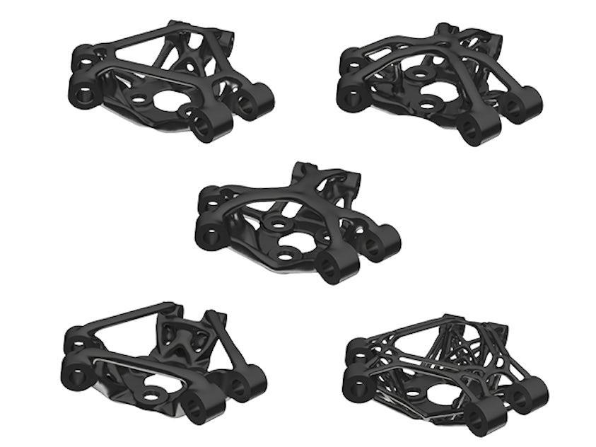

<!-- <pre>
공통 사항으로 각 질문에 대한 답변은 1번부터 가장 낮은 수준이며 6번으로 갈 수록 높은 수준입니다.
</pre> -->

# DX추진 사전 자가진단 설문지 - 화승코퍼레이션
<!-- DX(디지털 전환)이란 디지털 기술을 활용하여 기업의 비즈니스 모델, 프로세스, 문화, 고객 경험을 근본적으로 변화시키는 전략적 변혁입니다. 아날로그를 디지털로 바꾸는 것은 Digitization(디지털 전환)이라고 하며 DX(디지털 전환)는 그보다 더 포괄적인 의미로 디지털 기술로 업무 방식과 비즈니스 자체를 혁신하는 것을 의미 합니다. -->
DX(디지털 전환)이란 디지털 기술을 활용하여 기업의 비즈니스 모델, 프로세스, 문화, 고객 경험을 근본적으로 변화시키는 전략적 변혁입니다. DX(디지털 전환)는 달리 말하면 디지털 기술로 업무 방식과 비즈니스 자체를 혁신하는 것을 의미 합니다.
<!-- 
### 예시1) C사의 엑셀 업무 자동화 플랫폼을 통한 문서(데이터) 작업 업무의 변혁

### 예시2) C사의 엑셀 업무 자동화 플랫폼을 통한 문서(데이터) 작업 업무의 변혁
 -->

<!-- | DX(디지털 전환) 사례 |
|----------------------|
| **예시1)** C사의 엑셀 업무 자동화 플랫폼을 통한 **문서(데이터) 업무의 변혁** |
| 

 |
| **예시2)** Z사의 제너러티브 설계를 통한 **설계 업무의 변혁** |
| 

 | -->

<table border="1" style="border-collapse: collapse; width: 100%;">
  <tr>
    <th style="border: 1px solid black; padding: 10px; text-align: center;">DX(디지털 전환) 사례</th>
  </tr>
  <tr>
    <td style="border: 1px solid black; padding: 10px;"><strong>예시1)</strong> C사의 엑셀 업무 자동화 플랫폼을 통한 <strong>문서(데이터) 업무의 변혁</strong></td>
  </tr>
  <tr>
    <td style="border: 1px solid black; padding: 10px; text-align: center;">
      
    </td>
  </tr>
  <tr>
    <td style="border: 1px solid black; padding: 10px;"><strong>예시2)</strong> Z사의 제너러티브 설계를 통한 <strong>설계 업무의 변혁</strong></td>
  </tr>
  <tr>
    <td style="border: 1px solid black; padding: 10px; text-align: center;">
      
    </td>
  </tr>
</table>

---
## I. 디지털 전환 현황

### 1. **디지털 전환 목적과 계획**은 어느 정도 명확하게 수립되어 있습니까?

*※ 전사 차원에서 말단 부서까지 일관성 있는 목적과 계획을 의미합니다*

① 계획 없이 개별 추진 - 전체 계획 없이 필요에 따라 개별 프로젝트로만 진행

② 기본 방향만 설정 - 큰 틀에서의 방향은 있으나 구체적인 계획은 부족  

③ 구체적 계획 수립 - 목표, 방법, 일정 등이 체계적이고 구체적으로 계획됨

④ 사업전략과 통합 - 회사 전체 사업전략과 연계하여 통합적으로 계획됨

⑤ 지속적 관리 운영 - 계획을 체계적으로 관리하고 정기적으로 수정·보완

⑥ 선도적 계획 수립 - 환경 변화를 예측하고 업계를 선도하는 계획 보유

---

### 2. 귀사는 **디지털 전환으로 인한 변화**를 어떻게 관리하고 있습니까?

*※ 변화관리: 조직과 구성원이 디지털 전환에 성공적으로 적응할 수 있도록 지원하는 활동*

① 변화관리 없음 - 디지털 전환 관련 변화관리를 전혀 하지 않음

② 형식적 관리 - 변화관리를 형식적으로만 수행

③ 프로세스 개발 중 - 우리 회사에 맞는 변화관리 방법을 계획·개발 중

④ 체계적 관리 수행 - 우리 회사에 맞는 변화관리를 체계적으로 수행

⑤ 전사 확대 운영 - 변화관리를 회사 전체로 확대하여 운영 중

⑥ 혁신적 개선 - 변화관리 방법을 지속적으로 혁신·개선하며 수행

---

### 3. **디지털 전환에 대한 경영진의 리더십**은 어느 수준입니까?

*※ 디지털 전환의 중요성을 이해하고 전략 실행 의지를 보이는 정도*

① 추진 의지 없음 - 디지털 전환에 대한 관심이나 의지가 없음

② 제한적 이해 - 디지털 전환의 필요성을 부분적으로만 이해

③ 정확한 이해 - 디지털 전환 활동을 정확히 이해하고 있음

④ 소극적 추진 - 디지털 전환을 수동적·형식적으로 추진하려 함

⑤ 적극적 추진 의지 - 디지털 전환을 적극 추진하고자 하는 의지가 강함

⑥ 맞춤형 전략 실행 - 우리 회사에 최적화된 디지털 전환을 적극 추진

---

---
### 4. 귀사의 **디지털 전환 전담조직 구성 현황**은 어떻습니까?

① 조직 없음 - 디지털 전환 전담조직이 전혀 구성되어 있지 않음

② 구성 계획 중 - 전담조직 구성을 계획하는 단계

③ 조직 구성 완료 - 전담조직은 있으나 본격적인 업무는 미수행

④ 조직 운영 중 - 전담조직이 구성되어 관련 업무를 수행 중

⑤ 전사 확대 중 - 전담조직을 회사 전체로 확대하는 중

⑥ 지속적 개편 - 환경에 맞게 전담조직을 지속적으로 재편 중

---

### 5. 귀사의 **디지털 전환(스마트공장 포함) 전략 수립 현황**은 다음 중 어느 단계입니까?

① 전략 없이 개별 추진 - 전체 전략 없이 필요에 따라 개별 프로젝트로만 진행

② 기본 방향만 설정 - 큰 틀에서의 전략 방향은 있으나 구체성 부족

③ 체계적 전략 수립 - 목표, 방법, 일정 등이 구체적으로 전략화됨

④ 사업전략과 연계 - 회사 전체 사업전략과 통합하여 전략 수립

⑤ 지속적 관리 - 전략을 체계적으로 관리하고 정기적으로 갱신

⑥ 선도적 전략 - 산업 환경 변화를 앞서 예측한 혁신적 전략 보유

---

## II. 데이터 성숙도 평가

### 1. 귀사의 **데이터 관리 현황**은 어느 단계입니까?

① 관리 활동 없음 - 데이터 관리 활동을 전혀 수행하지 않음

② 형식적 관리 - 형식적인 데이터 관리 활동만 수행

③ 관리 계획 수립 - 우리 회사에 맞는 데이터 관리 기준과 절차를 계획 중

④ 체계적 관리 구축 - 데이터 관리 기준, 조직, 절차가 체계적으로 구축됨

⑤ 관리 범위 확대 - 데이터 관리 활동의 규모와 범위를 지속적으로 확대

⑥ 최적화된 관리 - 환경 변화에 맞춰 데이터 관리 방식을 지속적으로 최적화

---

### 2. 귀사의 **데이터 품질 관리 현황**은 어느 단계입니까?

① 품질 관리 없음 - 데이터 품질 기준이 없어 업무 활용이 어려움

② 형식적 기준 존재 - 데이터 품질에 대한 형식적인 관리 기준만 보유

③ 기준 수립 계획 - 우리 회사에 맞는 데이터 품질 기준과 절차를 계획 중

④ 체계적 품질 관리 - 데이터 품질 관리 기준, 조직, 절차가 체계적으로 운영됨

⑤ 관리 범위 확대 - 품질 관리가 잘 되고 있으며 적용 데이터 범위를 확대 중

⑥ 최고 수준 품질 - 환경에 맞춰 품질 관리를 지속 개선하여 매우 높은 품질 유지

---

### 3. 귀사의 **데이터 보안 활동 현황**은 어느 단계입니까?

*※ 외부 위협이나 무단 접근으로부터 데이터를 안전하게 보호하는 활동이나 내부 규정이 존재*

① 보안 활동 없음 - 데이터 보안 활동을 전혀 수행하지 않음

② 형식적 보안 - 형식적인 데이터 보안 활동만 수행

③ 보안 계획 수립 - 우리 회사에 맞는 데이터 보안 기준과 절차를 계획 중

④ 체계적 보안 구축 - 데이터 보안 기준, 조직, 절차가 체계적으로 구축됨

⑤ 보안 범위 확대 - 데이터 보안 활동의 규모와 범위를 지속적으로 확대

⑥ 최적화된 보안 - 환경 변화에 맞춰 데이터 보안 방식을 지속적으로 최적화

---

### 4. 귀사의 **데이터 활용 현황**은 어느 단계입니까?

① 활용 없음 - 데이터 활용 활동을 전혀 수행하지 않음

② 데이터 수집 - 데이터를 체계적으로 수집하는 단계

③ 데이터 가공 활용 - 수집한 데이터를 가공하여 업무에 활용

④ 데이터 분석 - 가공된 데이터를 분석하여 유용한 정보와 지식을 생성

⑤ 정보 공유 - 생성된 정보를 조직 내부적으로 공유

⑥ 의사결정 활용 - 생성된 지식을 의사결정의 근거로 적극 활용

---

## III. 기술 성숙도 평가

### 1. 귀사의 **자동화 기술 도입 현황**은 어느 단계입니까?

*※ 로봇, 3D 프린팅 등 사람의 개입을 줄이고 공정을 자동으로 제어하는 기술*

① 도입 없음 - 자동화 기술을 전혀 도입하지 않음

② 기본 자동화 - 기본적인 자동화 기술만 도입되어 있음

③ 고도 자동화 - 고도화된 자동화 기술이 도입되어 있음

④ 상당 수준 자동화 - 상당 수준의 자동화 기술이 도입되어 있음

⑤ 유연한 자동화 - 상황에 따라 자동화 기술을 개선하고 유연하게 활용

⑥ 통합 자동화 - 여러 자동화 기술들이 상호작용하며 통합 운영

---

### 2. 귀사의 **지능화 기술 도입 현황**은 어느 단계입니까?

*※ AI, 빅데이터 등을 활용한 모니터링, 예지보전 등의 지능형 기술*

① 도입 없음 - 지능화 기술을 전혀 도입하지 않음

② 기본 전산화 - 지능화 기술을 활용한 기본적인 전산화 시스템 보유

③ 변화 감지 - 모니터링을 통해 변화를 감지하고 결과를 제공

④ 문제 진단 - 업무 수행에 필요한 진단 결과를 제공

⑤ 미래 예측 - 데이터를 바탕으로 예측 결과를 제공

⑥ 지능형 적응 - 데이터나 환경 변화에 자동으로 적응하는 결과 제공

---

### 3. 귀사의 **연결성 기술 도입 현황**은 어느 단계입니까?

*※ IoT, 클라우드, 엣지컴퓨팅 등 장비와 시스템 간 연결 기술*

① 도입 없음 - 연결성 기술이 전혀 도입되어 있지 않음

② 기본 연결 - 연결성 기술이 기본적으로 도입되어 있음

③ 정보 교환 - 연결된 시스템 간 상호 정보 교환이 가능

④ 보안 연결 - 정보보안이 보장되는 안전한 연결 서비스 제공

⑤ 실시간 연결 - 실시간(real-time) 연결 서비스 보장

⑥ 최적화 연결 - 시스템 변경 시 신속한 환경설정으로 최적 서비스 제공

---

### 4. 귀사의 **플랫폼 기술 활용 현황**은 어느 단계입니까?

*※ 빅데이터 플랫폼, 소셜 플랫폼 등 수요자와 공급자를 연결하는 디지털 매개 기술*

① 활용 없음 - 플랫폼 기술을 전혀 활용하지 않음

② 기본 활용 - 기본적인 플랫폼 기술을 활용

③ 고도 활용 - 고도화된 플랫폼 기술을 활용

④ 상당 수준 활용 - 상당 수준의 플랫폼 기술을 활용

⑤ 유연한 활용 - 상황에 따라 플랫폼 기술을 개선하고 유연하게 적용

⑥ 통합 활용 - 여러 플랫폼 기술이 상호작용하며 통합 활용

---

## IV. 인력 및 문화 성숙도 평가

### 1. 귀사의 **디지털 전환 추진을 위한 동기부여 및 성과관리 체계**는 어느 단계입니까?

*※ 디지털 전환을 위한 적극적 추진, 다양한 시도 독려, 평가와 보상 등의 관리체계*

① 동기부여 없음 - 디지털 전환 추진을 위한 동기부여를 전혀 하지 않음

② 형식적 동기부여 - 형식적으로만 동기부여를 수행

③ 체계 수립 계획 - 우리 회사에 맞는 동기부여 및 성과관리 체계를 계획 중

④ 체계적 동기부여 - 적절한 동기부여 및 성과관리 체계를 수립하여 적용

⑤ 전사 확대 - 동기부여 및 성과관리 체계를 회사 전체로 확대

⑥ 최적화 운영 - 환경에 맞게 동기부여 및 성과관리 체계를 지속적으로 최적화

---

### 2. 귀사의 **디지털 전환에 대한 조직 문화**는 어느 단계입니까?

*※ 디지털 전환을 개방적으로 받아들이고 데이터 기반 의사결정을 하는 문화*

① 수용 문화 없음 - 디지털 전환 수용 문화가 전혀 형성되어 있지 않음

② 필요성 인식 - 구성원들이 디지털 전환 수용 문화의 필요성을 이해

③ 개인적 적용 - 개인 차원에서 업무에 디지털 전환을 적용하려고 시도

④ 부분적 도입 - 사내 일부 프로세스에서 디지털 전환 수용 문화가 도입

⑤ 전사적 도입 - 모든 프로세스에서 디지털 전환 수용 문화가 도입

⑥ 지속적 개선 - 더 성숙한 디지털 전환 수용 문화를 위해 지속적으로 개선

---

### 3. 귀사의 **디지털 역량을 가진 인재 보유 현황**은 어느 단계입니까?

*※ IT 기술 엔지니어링 및 개인 디지털 역량을 보유한 인재*

① 인재 없음 - 디지털 역량을 가진 인재를 전혀 보유하지 않음

② 확보 계획 - 현재는 없으나 향후 디지털 인재 확보 계획이 있음

③ IT 부서 보유 - IT 부서에만 디지털 역량 인재를 보유

④ 관련 부서 보유 - IT 부서뿐만 아니라 관련 부서에도 디지털 인재 보유

⑤ 전 부서 보유 - 모든 부서에서 디지털 역량 인재를 보유

⑥ 지속적 역량 강화 - 더 높은 디지털 역량 인재 확보를 위해 지속적으로 노력

---

### 4. 귀사의 **디지털 전환 교육 및 훈련 현황**은 어느 단계입니까?

*※ 인재 양성 커리큘럼, 프로그램 운영, 학습 역량 향상, 교육비 지원 등의 활동*

① 교육 없음 - 디지털 전환 교육 및 훈련 활동을 전혀 수행하지 않음

② 형식적 교육 - 디지털 전환 교육 및 훈련을 형식적으로만 수행

③ 교육 계획 수립 - 디지털 전환 교육 및 훈련을 계획하고 개발한 상태

④ 부분적 교육 - 일부 부서에서 체계적인 디지털 전환 교육 및 훈련을 수행

⑤ 전사 교육 확대 - 디지털 전환 교육 및 훈련을 회사 전체로 확대

⑥ 최적화 교육 - 환경에 맞게 디지털 전환 교육 및 훈련을 지속적으로 최적화

---

## V. 프로세스 성숙도 평가

### 1. 귀사의 **디지털 전환을 통한 프로세스 표준화 현황**은 어느 단계입니까?

*※ 프로세스 표준화: 업무 수행 절차와 방법을 디지털 시스템을 통해 통일하는 것*

*예시 ) 신제품 개발 시 R&D→설계검토→시제품제작→품질테스트→양산검토 과정을 모든 제품군에서 동일한 디지털 시스템과 절차로 처리*

① 표준화 없음 - 디지털 전환을 통한 프로세스 표준화가 전혀 도입되지 않음

② 표준화 계획 - 디지털 전환을 통한 프로세스 표준화 계획을 수립

③ 표준화 정의 - 디지털 전환을 통한 프로세스 표준화가 정의됨

④ 부분적 도입 - 일부 프로세스에서 디지털 전환을 통한 표준화 도입

⑤ 전면적 도입 - 모든 프로세스에서 디지털 전환을 통한 표준화 도입

⑥ 지속적 개선 - 프로세스 표준화의 활용성 극대화를 위한 지속적 개선

<!-- --- -->

### 2. 귀사의 **디지털 전환을 통한 프로세스 통합 현황**은 어느 단계입니까?

*※ 프로세스 통합: 부서별로 분리되어 있던 업무 프로세스를 디지털 시스템으로 연결하여 하나의 흐름으로 만드는 것*

*예시 ) 고객주문→생산계획→자재주문→생산진행→품질검사→출하 과정에 각 부서 시스템이 연동됨*

① 통합 없음 - 디지털 전환을 통한 프로세스 통합이 전혀 진행되지 않음

② 통합 계획 - 디지털 전환을 통한 프로세스 통합 계획을 수립

③ 통합 준비 - 통합 계획은 수립되었으나 시스템 통합이 실제 구현되거나 도입되지 않음

④ 부분적 통합 - 일부 프로세스에서 디지털 전환을 통한 통합 도입

⑤ 전면적 통합 - 모든 프로세스에서 디지털 전환을 통한 통합 도입

⑥ 지속적 개선 - 프로세스 통합의 활용성 극대화를 위한 지속적 개선

---

### 3. 귀사의 **디지털 전환을 통한 업무 자동화 현황**은 어느 단계입니까?

*※ 규칙적이고 반복적인 업무를 소프트웨어를 통해 자동화하는 것*

① 자동화 없음 - 디지털 전환을 통한 업무 자동화가 전혀 진행되지 않음

② 극히 일부 자동화 - 자동화 도입 초기 단계로 극히 일부 업무만 자동화

③ 부분적 자동화 - 공수가 많이 소요되는 일부 업무에 자동화 활용

④ 상당부분 자동화 - 자동화를 적극 활용하여 고빈도 작업 대부분에 자동화 활용

⑤ 유연한 자동화 - 상황에 따라 업무 자동화를 개선하고 유연하게 적용

⑥ 통합 자동화 - 복잡하고 통합적인 업무에도 자동화를 활용하여 전사적 운영

---

## VI. 협력 성숙도 평가

### 1. 귀사의 **디지털 전환을 통한 고객과의 의사소통 현황**은 어느 단계입니까?

① 의사소통 없음 - 디지털 전환을 통한 고객과의 의사소통 활동을 전혀 수행하지 않음

② 단순 의사소통 - 디지털 전환을 통해 기본적인 고객 의사소통을 수행

③ 문제 해결 협력 - 고객과 협력하여 서로의 문제를 해결

④ 계획 수립 협력 - 고객과 협력하여 자사 비즈니스 계획을 수립

⑤ 공동 업무 수행 - 고객과의 공동작업을 통해 비즈니스 업무를 수행

⑥ 통합 의사결정 - 고객 경험과 내부 정보를 통합하여 협력적 의사결정 수행

---

### 2. 귀사의 **디지털 전환을 통한 공급자와의 협력 현황**은 어느 단계입니까?

*※ 원부자재 제공 협력사 등과의 디지털 기술 기반 협력적 공급망 운영*

① 비공식적 협력 - 공급자와 비공식적인 협력 활동만 수행

② 공식적 의사소통 - 공급자와 공식적인 의사소통을 통한 협력 수행

③ 상호 문제 해결 - 공급자와 상호 협조를 통해 서로의 문제를 해결

④ 계획 수립 협력 - 공급자와 협력하여 자사 비즈니스 계획을 수립

⑤ 공동 업무 협력 - 공급자와의 공동작업을 통한 협력으로 비즈니스 업무 수행

⑥ 통합 조직 협력 - 공급자와 통합 조직 형태의 협력을 수행

---

## VII. 성과 성숙도 평가

### 1. 귀사의 **디지털 전환을 통한 업무 효율성 개선 효과**는 어느 정도입니까?

*※ 업무시간 단축 및 업무 이해도 향상 등의 효율성 증가*

*증가율 퍼센트(%)는 반드시 정확하지 않아도 괜찮습니다.*

① 0% - 효과 없음 *(디지털 전환을 추진하지 않은 경우 이 항목 선택)*

② 0~5% - 미미한 효과

③ 5~10% - 소폭 개선

④ 10~20% - 중간 개선

⑤ 20~30% - 큰 개선

⑥ 30% 이상 - 매우 큰 개선

---

### 2. 귀사의 **디지털 전환을 통한 고객 만족도 개선 효과**는 어느 정도입니까?

*증가율 퍼센트(%)는 반드시 정확하지 않아도 괜찮습니다.*

① 0% - 효과 없음 *(디지털 전환을 추진하지 않은 경우 이 항목 선택)*

② 0~5% - 미미한 효과

③ 5~10% - 소폭 개선

④ 10~20% - 중간 개선

⑤ 20~30% - 큰 개선

⑥ 30% 이상 - 매우 큰 개선

---

### 3. 귀사의 **디지털 전환을 통한 비즈니스 모델 혁신 수준**은 어느 단계입니까?

*※ 제품, 서비스, 공정, 마케팅 혁신을 포함한 비즈니스 모델 변화*

① 변화 없음 - 디지털 전환 이전과 동일한 비즈니스 모델을 사용

② 점진적 개선 - 기존 비즈니스 모델을 점진적으로 개선

③ 사내 최초 혁신 - 우리 회사 최초의 신규 비즈니스 모델을 개발

④ 국내 최초 혁신 - 국내 최초의 신규 비즈니스 모델을 개발

⑤ 세계 최초 혁신 - 세계 최초의 신규 비즈니스 모델을 개발

⑥ 패러다임 변화 - 개발한 비즈니스 모델이 국제적으로 확산되어 업계 패러다임 변화 주도

---

### 4. 귀사의 **디지털 전환을 통한 매출 증대 효과**는 어느 정도입니까?

*증가율 퍼센트(%)는 반드시 정확하지 않아도 괜찮습니다.*

① 0% - 효과 없음 *(디지털 전환을 추진하지 않은 경우 이 항목 선택)*

② 0~5% - 미미한 효과

③ 5~10% - 소폭 증가

④ 10~20% - 중간 증가

⑤ 20~30% - 큰 증가

⑥ 30% 이상 - 매우 큰 증가

---

### 5. 귀사의 **디지털 전환을 통한 운영 비용 절감 효과**는 어느 정도입니까?

*※ 자동화된 디지털 도구 구현 및 활용을 통한 비용 절감*

*절감율 퍼센트(%)는 반드시 정확하지 않아도 괜찮습니다.*

① 0% - 효과 없음 *(디지털 전환을 추진하지 않은 경우 이 항목 선택)*

② 0~5% - 미미한 효과

③ 5~10% - 소폭 절감

④ 10~20% - 중간 절감

⑤ 20~30% - 큰 절감

⑥ 30% 이상 - 매우 큰 절감

---

### 6. 귀사의 **디지털 전환을 통한 기업 정보 공개 수준**은 어느 단계입니까?

*※ **디지털 전환을 통한 기업 정보 공개**란 디지털 플랫폼(웹사이트, 앱, 대시보드, API 등)을 활용해 기업의 업무 프로세스, 성과 지표, 운영 현황 등을 체계적으로 공개하는 것*

* *예시 1) S사는 협력회사용 포털에서 발주 현황, 품질기준을 공개*
* *예시 2) P사는 굴뚝 원격감시 시스템을 통해 환경 배출 데이터를 환경부 관제센터에 공개*

① 정보 비공개 - 기업 정보를 내부/외부에 공개하지 않음

② 사내 부분 공개 - 기업 정보를 사내 구성원에게 일부 공개

③ 사내 전체 공개 - 기업 정보를 사내 구성원에게 모든 정보 공개

④ 이해관계자 부분 공개 - 공급자, 투자자 등 이해관계자에게 일부 정보 공개

⑤ 이해관계자 전체 공개 - 이해관계자에게 모든 정보 공개

⑥ 공공 데이터 공개 - 기업 정보를 공공 데이터로 공개