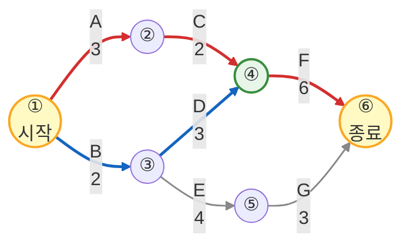

## 40회 경영과학 문제 4 예시답안

### 【문제 4 - (1)】 프로젝트 네트워크 다이어그램 (5점)

화살표 위: 활동명, 아래: 소요시간 (AOA 표기법)

> **범례**: 빨간 선 = 주경로(Critical Path), 파란 선 = 비주경로

### 【문제 4 - (2)】 경로 소요시간 및 주경로 (5점)

1. **Path 1**: A-C-F $= 3 + 2 + 6 = 11$
2. **Path 2**: B-D-F $= 2 + 3 + 6 = 11$
3. **Path 3**: B-E-G $= 2 + 4 + 3 = 9$

* **주경로(Critical Path)**: 가장 긴 시간이 소요되는 **A-C-F** 및 **B-D-F**
* **전체 완료 시간**: **11 시간**

<!-- pagebreak -->

[목차 바로가기](#40회-경영과학-목차)
----

----