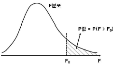
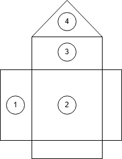
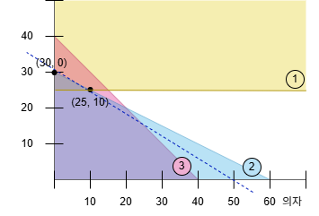
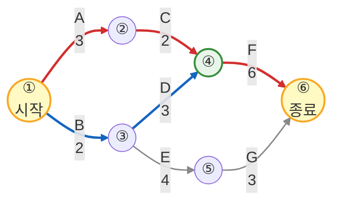



# 저자 소개
<ul>
    <li>경영지도사 생산관리분야</li>
    <li>자동화 장비 제조업 프로세스 개선 내부 컨설팅 경력</li>
    <li>제조업 설계 및 MCT 단순 반복 업무 자동화(RPA) 프로그램 개발
        <a href="https://www.worksfree.com">
        <figure style="float: right"><figcaption style="text-align: center;">RPA Site</figcaption></figure>
        </a>
        <ul>
            <li>어셈블리 BOM 엑셀 저장 자동화 프로그램</li>
            <li>8만 여개 구매품 속성 2주만에 정리하기</li>
            <li>이드로잉스 뷰어 대량 출력 자동화 프로그램</li>
            <li>구글 드라이브 기반 인터넷 정보 자동 업데이트</li>
            <li>자동화(RPA) 프로그램은 우측 QR 또는 아래 URL 참고 <a href="https://www.worksfree.com">https://www.worksfree.com</a></li>
        </ul>
    </li>
    <li>소프트웨어 분야 개발 및 PM 경력</li>
    <li>프로젝트 관리 전문가(PMP from PMI)</li>
    <li>IITP 평가위원, NIPA 평가위원</li>
</ul>

# 교재 소개
- 본 교재는 필자가 경영지도사 2차 수험 생활을 하며 기출문제를 풀고 아래 명시된 수험 교재 학습 및 인터넷 정보를 참조하여 정리한 내용입니다.
  * 생산관리 : 생산운영관리 [법문사]
  * 품질경영 : 품질경영론 [KSAM]
  * 경영과학 : 4차 산업혁명 시대의 EXCEL 경영과학 [박영사]
- 목차는 3 페이지에 제공되며 본문 내의 파랑색으로 보이는 모든 문구는 문서 내부 링크로서 클릭하면 문제, 예시답안, 목차로 이동합니다.
- 예시답안은 설명을 위해 단계별로 내용이 작성되어 불필요하게 긴 예시답안이 있는데 실제 답안 작성시에는 꼭 필요한 경우만 풀이 과정을 단계별로 작성해도 됩니다.
- 예시답안의 내용에 대한 개정 의견이나 시험 관련된 문의 사항은 아래 이메일로 보내주시기 바라며 수험생들의 고득점을 기원합니다.
- 자격시험 합격 후 동차 예시답안 출판에 관심 있는 분은 이메일로 연락 바랍니다.
- <a href="mailto:insung.lee@worksfree.kr">이메일 : insung.lee@worksfree.kr</a>

# 
 목차 

# [36회](#36회-생산관리)
## 36회 생산관리
- [[문제1] 수요예측 - 단순지수평활법과 계절지수](#36회-생산관리-문제-1)
- [[문제2] 프로세스 관리 - 자원이용률과 산출물](#36회-생산관리-문제-2)
- [[문제3] 아웃소싱의 장점](#36회-생산관리-문제-3)
- [[문제4] 경제적 주문량(EOQ) 모형](#36회-생산관리-문제-4)
- [[문제5] 생산능력 확장](#36회-생산관리-문제-5)
- [[문제6] 생산공급전략과 상쇄관계](#36회-생산관리-문제-6)
## 36회 품질경영
- [[문제1] 관리도](#36회-품질경영-문제-1)
- [[문제2] 실험계획법](#36회-품질경영-문제-2)
- [[문제3] 측정시스템(MSA, measurement system analysis)](#36회-품질경영-문제-3)
- [[문제4] 품질코스트(Q-cost)의 종류](#36회-품질경영-문제-4)
- [[문제5] 신뢰성 관리 - 신뢰도함수, 고장률함수](#36회-품질경영-문제-5)
- [[문제6] 통계적 품질관리](#36회-품질경영-문제-6)
## 36회 경영과학
- [[문제1] 마코프 체인](#36회-경영과학-문제-1)
- [[문제2] 수송문제](#36회-경영과학-문제-2)
- [[문제3] 대기행렬이론](#36회-경영과학-문제-3)
- [[문제4] 네트워크/CPM](#36회-경영과학-문제-4)
- [[문제5] 손익분기점 분석(Break-Even Analysis)](#36회-경영과학-문제-5)
- [[문제6] 선형계획법의 전제조건](#36회-경영과학-문제-6)

# [37회](#37회-생산관리)
## 37회 생산관리
- [[문제1] 입지선정 - 중심모형법, 요인평정법](#37회-생산관리-문제-1)
- [[문제2] 작업일정계획(우선순위규칙)](#37회-생산관리-문제-2)
- [[문제3] 공급사슬 전략](#37회-생산관리-문제-3)
- [[문제4] 생산전략(MTS/MTO)](#37회-생산관리-문제-4)
- [[문제5] 자재소요계획(MRP)](#37회-생산관리-문제-5)
- [[문제6] 재고관리](#37회-생산관리-문제-6)

## 37회 품질경영
- [[문제1] 제조물책임법](#37회-품질경영-문제-1)
- [[문제2] 표준 및 표준화](#37회-품질경영-문제-2)
- [[문제3] 관리도의 우연원인과 이상원인](#37회-품질경영-문제-3)
- [[문제4] KS Q ISO 9000 : 2015](#37회-품질경영-문제-4)
- [[문제5] 신뢰성](#37회-품질경영-문제-5)
- [[문제6] 다구찌 품질손실함수](#37회-품질경영-문제-6)

## 37회 경영과학
- [[문제1] 선형계획법](#37회-경영과학-문제-1)
- [[문제2] 의사결정나무(Decision Tree)](#37회-경영과학-문제-2)
- [[문제3] 확정적 모형과 확률적 모형](#37회-경영과학-문제-3)
- [[문제4] 혼합정수계획법](#37회-경영과학-문제-4)
- [[문제5] PERT/CPM](#37회-경영과학-문제-5)
- [[문제6] 몬테칼로 시뮬레이션](#37회-경영과학-문제-6)

# [38회](#38회-생산관리)
## 38회 생산관리
- [[문제1] 재고관리와 경제적 주문량](#38회-생산관리-문제-1)
- [[문제2] 부가가치생산성과 총요소생산성, 종합생산성](#38회-생산관리-문제-2)
- [[문제3] 제품별 배치와 공정별 배치의 비교](#38회-생산관리-문제-3)
- [[문제4] 골드랏의 OPT(최적생산 이론)와 TOC(제약조건 이론)](#38회-생산관리-문제-4)
- [[문제5] 도요타의 JIT(적시생산시스템) 생산방식에서 낭비형태와 5S 활동](#38회-생산관리-문제-5)
- [[문제6] 설비관리의 6대 로스와 고장률곡선](#38회-생산관리-문제-6)
## 38회 품질경영
- [[문제1] 품질분임조, 신 QC도구 7가지, 6시그마(RTY, FPY, DPU)](#38회-품질경영-문제-1)
- [[문제2] 실험계획법 - 이원배치법 및 불편추정량, 결정계수](#38회-품질경영-문제-2)
- [[문제3] 샘플링 방법](#38회-품질경영-문제-3)
- [[문제4] 신뢰성 - 고장날 확률, 평균수명(MTTF)](#38회-품질경영-문제-4)
- [[문제5] 품질기능전개(QFD)](#38회-품질경영-문제-5)
- [[문제6] 말콤볼드리지 경영품질 모델 7가지 범주](#38회-품질경영-문제-6)

## 38회 경영과학
- [[문제1] 수송모델 북서코너법 및 선형계획모형](#38회-경영과학-문제-1)
- [[문제2] 선형계획모형과 목표계획모형, 도해법](#38회-경영과학-문제-2)
- [[문제3] 할당문제 - 헝가리법](#38회-경영과학-문제-3)
- [[문제4] 네트워크모델의 최소걸침나무와 최단거리](#38회-경영과학-문제-4)
- [[문제5] 게임이론의 게임값](#38회-경영과학-문제-5)
- [[문제6] 의사결정론의 불확실성하의 의사결정](#38회-경영과학-문제-6)

# [39회](#39회-생산관리)
## 39회 생산관리
- [[문제1] 구매 총비용](#39회-생산관리-문제-1)
- [[문제2] PERT/CPM](#39회-생산관리-문제-2)
- [[문제3] 서비스 설계](#39회-생산관리-문제-3)
- [[문제4] 생산 프로세스](#39회-생산관리-문제-4)
- [[문제5] JIT와 MRP 생산방식의 비교](#39회-생산관리-문제-5)
- [[문제6] 공급사슬의 채찍효과](#39회-생산관리-문제-6)
## 39회 품질경영
- [[문제1] 서비스품질](#39회-품질경영-문제-1)
- [[문제2] 공정능력 지수와 실제 공정능력 지수](#39회-품질경영-문제-2)
- [[문제3] 품질경영 - 가빈, KS Q ISO 9000](#39회-품질경영-문제-3)
- [[문제4] 신뢰성](#39회-품질경영-문제-4)
- [[문제5] 품질비용(quality cost)](#39회-품질경영-문제-5)
- [[문제6] 샘플링 검사 - 생산자위험, 소비자위험](#39회-품질경영-문제-6)
## 39회 경영과학
- [[문제1] 선형계획법](#39회-경영과학-문제-1)
- [[문제2] AHP 의사결정](#39회-경영과학-문제-2)
- [[문제3] 정수계획법](#39회-경영과학-문제-3)
- [[문제4] 대기행렬](#39회-경영과학-문제-4)
- [[문제5] 균형수송모델](#39회-경영과학-문제-5)
- [[문제6] 의사결정기준](#39회-경영과학-문제-6)

# [40회](#40회-생산관리)
## 40회 생산관리
- [[문제1] 생산성 - 물적생산성과 가치생산성](#40회-생산관리-문제-1)
- [[문제2] 경제적 생산량(EPQ)](#40회-생산관리-문제-2)
- [[문제3] 공급사슬 유형](#40회-생산관리-문제-3)
- [[문제4] 전략적 입지선정 - 중심기법](#40회-생산관리-문제-4)
- [[문제5] 생산 의사결정 - 자체 생산과 외주 생산의 경제성 평가](#40회-생산관리-문제-5)
- [[문제6] 제약이론(TOC)](#40회-생산관리-문제-6)
## 40회 품질경영
- [[문제1] 품질비용 - 예방, 평가, 실패비용](#40회-품질경영-문제-1)
- [[문제2] 품질경영 - 파이겐바움, 쥬란, 가빈](#40회-품질경영-문제-2)
- [[문제3] 프로세스 혁신 - 계통도법, 매트릭스도, DMAIC](#40회-품질경영-문제-3)
- [[문제4] 실험계획법 - 이원배치](#40회-품질경영-문제-4)
- [[문제5] 통계적 품질관리](#40회-품질경영-문제-5)
- [[문제6] 신뢰성 관리](#40회-품질경영-문제-6)
## 40회 경영과학
- [[문제1] 불확실성하의 의사결정론](#40회-경영과학-문제-1)
- [[문제2] 선형계획법 - 재료배합문제](#40회-경영과학-문제-2)
- [[문제3] AHP - 쌍대비교 및 가중치 산정](#40회-경영과학-문제-3)
- [[문제4] 일정관리 - PERT/CPM](#40회-경영과학-문제-4)
- [[문제5] 수송문제 - 보겔추정법](#40회-경영과학-문제-5)
- [[문제6] 할당문제 - 헝가리법](#40회-경영과학-문제-6)

## 36회 생산관리 문제

### 36회 생산관리 문제 1
#### 【문제 1】A 회사에서 최근 6년 동안 어떤 제품의 실제수요(단위: 개)를 조사한 결과는 다음과 같다. 물음에 답하시오. (30점)

<table>
    <tr><th>년(t)</th><th>1년</th><th>2년</th><th>3년</th><th>4년</th><th>5년</th><th>6년</th></tr>
    <tr><td>실제수요(At)</td><td>1,028</td><td>1,002</td><td>1,063</td><td>1,037</td><td>1,041</td><td>1,040</td></tr>
</table>

(1) 단순지수평활법을 이용하여 1~4년의 수요를 아래와 같이 예측하였다. 나머지 5~7년의 수요를 예측해 보시오. (단, α=0.7로 하고 계산결과는 소수점 이하는 반올림하여 정수로 구한다.) (10점)

<table>
    <tr><th>년(t)</th><th>1년</th><th>2년</th><th>3년</th><th>4년</th><th>5년</th><th>6년</th><th>7년</th></tr>
    <tr><td>실제수요(At)</td><td>1,028</td><td>1,002</td><td>1,063</td><td>1,037</td><td>1,041</td><td>1,040</td><td></td></tr>
    <tr><td>예측수요(Ft)</td><td>1,018</td><td>1,025</td><td>1,009</td><td>1,047</td><td>( )</td><td>( )</td><td>( )</td></tr>
</table>

(2) 6년의 실제수요를 분기별로 조사한 결과는 다음과 같다. 승법계절 변동을 가정할 때 분기별 계절지수를 구하시오. (단, 계산결과는 소수점 넷째자리에서 반올림하여 소수점 셋째자리까지 구한다.) (10점)

<table>
    <tr><th>분기</th><th>1분기</th><th>2분기</th><th>3분기</th><th>4분기</th><th>합계</th></tr>
    <tr><td>6년의 실제수요(A6)</td><td>182</td><td>340</td><td>280</td><td>238</td><td>1,040</td></tr>
</table>

(3) 문제 (1)에서 구한 7년의 예측수요와 문제 (2)에서 구한 계절지수를 활용하여, 7년의 분기별 예측수요를 구하시오. (단, 계산결과는 소수점 이하는 반올림하여 정수로 구한다.) (10점)

<a href="#36회-생산관리-문제-1-예시답안-30점">예시답안 바로가기</a><a href="#36회-생산관리">목차 바로가기</a>

### 36회 생산관리 문제 2
#### 【문제 2】A 레스토랑은 종업원이 고객 주문을 받아 음식 주문서를 주방에 전달하면 주방 셰프가 이를 바탕으로 조리한 후 음식을 고객에게 제공하는 <주문 충족 프로세스>를 사용하고 있다. A 레스토랑 지배인은 현 프로세스 디자인에 대한 경영지도를 통해 수익을 증대하고 비용을 감축하고자 한다. 수집한 자료를 보고 다음 물음에 답하시오. (30점)

<table>
    <tr><th>작업활동</th><th>업무</th><th>주문 도착률</th><th>평균소요 시간(분)</th><th>자원의 수</th></tr>
    <tr><td>1</td><td>셰프가 주문이 올바른지를 확인함</td><td>20/시간</td><td>1</td><td>1 셰프</td></tr>
    <tr><td>2</td><td>식자재 선택 및 주 요리작업</td><td>20/시간</td><td>6</td><td>1 셰프</td></tr>
    <tr><td>3</td><td>다양한 사이드 요리 (곁찬 요리) 작업</td><td>20/시간</td><td>12</td><td>1 셰프</td></tr>
    <tr><td>4</td><td>오븐 작업</td><td>20/시간</td><td>10</td><td>2 오븐</td></tr>
    <tr><td>5</td><td>셰프가 주문을 완성하기 위한 세팅작업</td><td>20/시간</td><td>3</td><td>1 셰프</td></tr>
</table>

(1) 각각의 작업활동별 자원이용률(resource utilization)을 구하시오. (단, 소수점 셋째자리에서 반올림하여 소수점 둘째자리까지 구한다.) (10점)

(2) 작업활동 3의 이용률을 100% 이하로 낮추기 위해 필요한 최소한의 셰프의 수를 구하시오. (5점)

(3) 만일 작업활동 3에서 3명의 셰프가 작업을 하고 작업활동 4에서 4대의 오븐을 가동하도록 한다면, 현 프로세스 산출물(throughput rate)과 비교하여 산출물이 얼마나 증가하는지를 구하시오. (10점)

(4) 만일 <주문 충족 프로세스>의 평균 산출물(throughput)이 12주문/시간이고 주문을 처리하는 평균 프로세스 처리시간(flow time)이 10분이라면 이 프로세스 상의 평균 재공품재고(work in process)는 얼마가 되는지 구하시오. (5점)

<a href="#36회-생산관리-문제-2-예시답안-30점">예시답안 바로가기</a><a href="#36회-생산관리">목차 바로가기</a>

### 36회 생산관리 문제 3
#### 【문제 3】아웃소싱은 회사의 내부활동과 의사결정 책임의 일부를 외부 공급자에게 이전하는 행위이다. 아웃소싱의 장점에 관하여 다음 물음에 답하시오. (10점)

(1) 재무원가 측면에서의 아웃소싱의 장점을 2가지만 기술하시오. (3점)

(2) 개선 측면에서의 아웃소싱의 장점을 2가지만 기술하시오. (3점)

(3) 조직 측면에서의 아웃소싱의 장점을 2가지만 기술하시오. (4점)

<a href="#36회-생산관리-문제-3-예시답안-10점">예시답안 바로가기</a><a href="#36회-생산관리">목차 바로가기</a>

### 36회 생산관리 문제 4
#### 【문제 4】경제적 주문량(Economic Order Quantity, EOQ) 모형에 관하여 다음 질문에 답하시오. (10점)

(1)  A 업체에서 생산하는 제품에 대한 연간 수요량(D)은 3,000개이다. 1회 주문비용(S)이 1,000,000원, 단위당 연간재고유지비용(H)이 6,000원이라면 경제적 주문량(EOQ)은 얼마인지 계산하시오. 그리고 이 때의 주문간격(단위: 개월)을 구하시오. (단, 1년은 12개월로 한다.) (7점)

(2) EOQ 모형에서 파라미터가 변화할 때 EOQ에 미치는 영향을 파악하는 것, 즉 민감도 분석이 중요하다. 모형 파라미터들이 각각 아래와 같이 변화할 때 EOQ는 어떻게 변화하는지 답하시오. (단, 해당 파라미터가 변화할 때 다른 파라미터들은 고정되어 있는 것으로 가정한다.) (3점)

<table>
    <tr><th>파라미터</th><th>파라미터의 변화</th><th>EOQ의 변화</th></tr>
    <tr><td>연간 수요량(D)</td><td>감소</td><td>( )</td></tr>
    <tr><td>1회 주문비용(S)</td><td>감소</td><td>( )</td></tr>
    <tr><td>단위당 연간재고유지비용(H)</td><td>증가</td><td>( )</td></tr>
</table>

<a href="#36회-생산관리-문제-4-예시답안-10점">예시답안 바로가기</a><a href="#36회-생산관리">목차 바로가기</a>

### 36회 생산관리 문제 5
#### 【문제 5】기업들은 미래의 수요변화에 대응하여 생산능력을 변경하는 의사결정을 하게 된다. 특히, 장기적인 수요예측에 바탕을 둔 장기적인 생산능력 계획은 막대한 자본의 투자가 요구된다. 생산능력의 확장 시 유의하여야 할 사항을 세 가지만 기술하시오. (10점)

<a href="#36회-생산관리-문제-5-예시답안-10점">예시답안 바로가기</a><a href="#36회-생산관리">목차 바로가기</a>

### 36회 생산관리 문제 6
#### 【문제 6】생산공급전략은 기업의 장기적인 경쟁전략이 잘 수행되도록 기업의 자원을 이용하기 위한 광범위한 정책과 계획을 수립하는 것이라고 할 수 있다. 다음 물음에 답하시오. (10점)

(1) 생산공급전략의 핵심 개념으로 집중화와 상쇄관계(trade-off)를 들 수 있는데 이에 대한 기본 논리를 설명하시오. (4점)

(2) 상쇄관계에 있는 경쟁차원을 세 가지만 설명하시오. (6점)

<a href="#36회-생산관리-문제-6-예시답안-10점">예시답안 바로가기</a><a href="#36회-생산관리">목차 바로가기</a>

## 36회 생산관리 예시답안

### 36회 생산관리 문제 1 예시답안 (30점)

#### 【문제 1 - (1)】 단순지수평활법 (5~7년 예측) (10점)

**공식:** $F_{t+1} = \alpha A_t + (1-\alpha) F_t$ (α=0.7)

**계산:**
- $F_5 = 0.7 \times 1,037 + 0.3 \times 1,047 = 1,040$ (개)
- $F_6 = 0.7 \times 1,041 + 0.3 \times 1,040 = 1,040.7 → 1,041$ (개)
- $F_7 = 0.7 \times 1,040 + 0.3 \times 1,041 = 1,040.3 → 1,040$ (개)

**답안:** 5년=1,040개, 6년=1,041개, 7년=1,040개

#### 【문제 1 - (2)】 계절지수 계산 (승법 모형) (10점)

**평균 분기 수요:** $\cfrac{1,040}{4} = 260$ (개)

**계절지수:**
$SI = \cfrac{\text{각 분기 실제수요}}{\text{평균 분기 수요}}$
<table>
    <tr><th>분기</th><th>1분기</th><th>2분기</th><th>3분기</th><th>4분기</th></tr>
    <tr><td>실제수요</td><td>182</td><td>340</td><td>280</td><td>238</td></tr>
    <tr><td>계절지수</td><td>0.700</td><td>1.308</td><td>1.077</td><td>0.915</td></tr>
</table>

**답안:** 1분기 0.700, 2분기 1.308, 3분기 1.077, 4분기 0.915

#### 【문제 1 - (3)】 7년 분기별 예측수요 (10점)

**계산:** 분기별 예측 = (연간 예측수요 ÷ 4) × 계절지수

**분기별 기본 예측:** $\cfrac{1,040}{4} = 260$ (개)

| 분기 | 계절지수 | 계산 | 예측수요 |
|------|---------|------|---------|
| 1분기 | 0.700 | 260 × 0.700 | 182 |
| 2분기 | 1.308 | 260 × 1.308 | 340 |
| 3분기 | 1.077 | 260 × 1.077 | 280 |
| 4분기 | 0.915 | 260 × 0.915 | 238 |

**검증:** 182 + 340 + 280 + 238 = 1,040개 (연간 예측과 일치 ✓)

**답안:** 1분기 182개, 2분기 340개, 3분기 280개, 4분기 238개

<a href="#36회-생산관리-문제-1">문제 바로가기</a><a href="#36회-생산관리">목차 바로가기</a>

### 36회 생산관리 문제 2 예시답안 (30점)

#### 【문제 2 - (1)】 자원이용률 계산 (10점)

**공식:** $U = \cfrac{\text{처리시간} \times \text{도착률}}{\text{자원수} \times 60\text{(분/시)}}$
<table>
    <tr><th>작업</th><th>도착률</th><th>소요시간(분)</th><th>자원수</th><th>이용률</th></tr>
    <tr><td>1</td><td>20/시간</td><td>1</td><td>1</td><td>33.33%</td></tr>
    <tr><td>2</td><td>20/시간</td><td>6</td><td>1</td><td>200.00%</td></tr>
    <tr><td>3</td><td>20/시간</td><td>12</td><td>1</td><td>400.00%</td></tr>
    <tr><td>4</td><td>20/시간</td><td>10</td><td>2</td><td>166.67%</td></tr>
    <tr><td>5</td><td>20/시간</td><td>3</td><td>1</td><td>100.00%</td></tr>
</table>

**답안:**
- 작업1: 33.33%, 작업2: 200.00%, 작업3: 400.00%
- 작업4: 166.67%, 작업5: 100.00%

#### 【문제 2 - (2)】 작업활동 3의 필요 셰프 수 (5점)

**현재:** 1명 셰프, 이용률 400%

**필요:** $\cfrac{20 \times 12}{n \times 60} \leq 1.00$ → $n \geq 4$

**답안:** 4명

#### 【문제 2 - (3)】 개선 후 산출물 증가 (10점)

**현재 병목:** 작업 3 (이용률 400%) → 산출물 5주문/시간

**개선 시나리오:**
- 작업 3: 3명 셰프 → 처리능력 15주문/시간
- 작업 4: 4대 오븐 → 처리능력 24주문/시간

**새로운 병목:** 작업 2 (이용률 200%) → 산출물 10주문/시간

**산출물 증가:** 10 - 5 = **5주문/시간 증가**

#### 【문제 2 - (4)】 평균 재공품 재고(WIP) (5점)

**리틀의 법칙:** $L = \lambda \times W$

**계산:**
- 평균 산출물: 12주문/시간
- 평균 처리 시간: 10분 = 1/6시간
- $L = 12 \times \cfrac{10}{60} = 2$ (주문)

**답안:** 2주문

<a href="#36회-생산관리-문제-2">문제 바로가기</a><a href="#36회-생산관리">목차 바로가기</a>

### 36회 생산관리 문제 3 예시답안 (10점)

#### 【문제 3 - (1)】 재무원가측면 (2가지) (3점)

① **고정비용의 가변비용화**
- 내부 운영의 고정비(인력, 시설, 장비)를 아웃소싱 가변비로 전환
- 손익분기점 감소, 손실 최소화

② **규모의 경제 활용**
- 전문 아웃소싱 기업의 다수 고객 기반으로 비용 분산
- 특화와 기술 축적으로 원가 절감

#### 【문제 3 - (2)】 개선측면 (2가지) (3점)

① **최신 기술 및 Best Practice 접근**
- 전문 기업의 최고 수준 프로세스와 표준 적용
- 최신 기술 도입으로 경쟁력 강화

② **지속적 혁신 및 품질 개선**
- 아웃소싱 기업의 경쟁 압박으로 지속적 개선
- 클라이언트가 자동 수혜

#### 【문제 3 - (3)】 조직측면 (2가지 이상) (4점)

① **핵심역량 집중**
- 비핵심 활동 외부 위임, 핵심 사업에 자원 집중
- 전략적 경쟁우위 확보

② **조직의 유연성 증대**
- 계약 기반으로 신속한 확대/축소 가능
- 시장 변화에 빠른 대응

③ **조직 규모 효율화**
- 지원 기능 축소로 슬림화
- 의사결정 신속화

<a href="#36회-생산관리-문제-3">문제 바로가기</a><a href="#36회-생산관리">목차 바로가기</a>

### 36회 생산관리 문제 4 예시답안 (10점)

#### 【문제 4 - (1)】 EOQ 계산 및 주문간격 (7점)

**공식:** $EOQ = \sqrt{\cfrac{2DS}{H}}$

**계산:**
$EOQ = \sqrt{\cfrac{2 \times 3,000 \times 1,000,000}{6,000}} = \sqrt{1,000,000} = 1,000 \text{ (개)}$

**주문간격:**
$\text{주문간격} = \cfrac{12}{\cfrac{D}{EOQ}} = \cfrac{12 \times EOQ}{D} = \cfrac{12 \times 1,000}{3,000} = 4 \text{ (개월)}$

**답안:** EOQ = 1,000개, 주문간격 = 4개월

#### 【문제 4 - (2)】 민감도 분석 (3점)

<table>
    <tr><th>파라미터</th><th>변화</th><th>EOQ 변화</th></tr>
    <tr><td>연간수요량(D)</td><td>감소</td><td><b>감소</b> ↓</td></tr>
    <tr><td>주문비용(S)</td><td>감소</td><td><b>감소</b> ↓</td></tr>
    <tr><td>유지비용(H)</td><td>증가</td><td><b>감소</b> ↓</td></tr>
</table>

**답안:** 모두 감소

<a href="#36회-생산관리-문제-4">문제 바로가기</a><a href="#36회-생산관리">목차 바로가기</a>

### 36회 생산관리 문제 5 예시답안 (10점)

#### 【문제 5】 생산능력 확장시 유의사항 (3가지) (10점)

① **수요의 예측 정확성 및 지속성 검토**
- 수요 예측의 신뢰도 검증
- 중장기(3~5년) 수요 안정성 확인
- 경쟁사 동향, 시장 포화도 분석

② **자금 조달 방법 및 투자 수익성 검토**
- 총 소요자금 계산 (설비, 운영비, 인력)
- 자체자금 vs 차입금 vs 증자 검토
- ROI, BEP, 투자회수기간 분석

③ **조직의 준비 상태 및 리스크 관리**
- 경영진 리더십 및 변화 관리 능력
- 기술 인력 확보 및 교육 계획
- 기술 도입 위험 요소 분석, 대안 계획 수립

<a href="#36회-생산관리-문제-5">문제 바로가기</a><a href="#36회-생산관리">목차 바로가기</a>

### 36회 생산관리 문제 6 예시답안 (10점)

#### 【문제 6 - (1)】 집중화와 상쇄관계의 기본 논리 (4점)

기업은 제한된 자원을 가지고 모든 경쟁차원에서 동시에 우수성을 달성할 수 없다. 따라서 경쟁우위를 확보하기 위해서는 **집중화(Focus)** 전략이 필요하다. 이는 자원을 특정 경쟁차원에 선택적으로 투입하여 그 영역에서 탁월한 성과를 창출하려는 접근이다.

그러나 한 경쟁차원에 자원을 집중화하면 다른 경쟁차원의 성과가 상대적으로 상쇄(Trade-off)되는 결과가 나타날 수 있다. 즉, 어떤 영역을 강화하려는 시도가 다른 영역의 약화를 초래하는 상호 배타적 관계, 즉 **상쇄관계**가 존재한다.

#### 【문제 6 - (2)】 상쇄관계 있는 경쟁차원 3가지 (6점)

① **비용(Cost) vs 품질(Quality)**
비용 경쟁력을 강화하기 위해 원가 절감과 생산 표준화를 추진하면 생산 효율은 높아질 수 있으나 품질 저하의 위험이 따른다. 반대로 품질을 중시하여 우수한 소재를 사용하고 엄격한 품질검사를 시행하면 제품 신뢰도는 향상되지만 원가는 상승할 수밖에 없다. 따라서 기업은 비용 절감과 품질 확보 사이에서 적절한 균형점을 찾아야 한다.

② **비용(Cost) vs 유연성(Flexibility)**
비용을 최소화하기 위해 규모의 경제를 활용하고 생산 공정을 자동화하면 단가를 낮출 수 있다. 그러나 이러한 방식은 제품 다양성을 제한하고 생산 유연성을 떨어뜨린다. 반대로 고객 요구에 맞춰 유연성을 높이기 위해 다목적 설비나 숙련된 인력을 운용하면 운영비용이 상승하게 된다. 결국 비용 절감과 유연성 확보는 서로 충돌하는 목표이다.

③ **품질(Quality) vs 납기(Delivery)**
높은 품질을 달성하기 위해 엄격한 품질검사와 충분한 개발 기간을 확보하면 생산 과정이 길어져 납기 지연이 발생할 수 있다. 반대로 납기를 단축하려면 생산 기간을 줄이고 검수 과정을 최소화해야 하는데, 이 경우 품질 관리의 철저함이 감소할 위험이 있다. 따라서 기업은 품질 유지와 신속한 납품 간의 상쇄관계를 고려해 적정 수준의 납기 목표를 설정해야 한다.

<a href="#36회-생산관리-문제-6">문제 바로가기</a><a href="#36회-생산관리">목차 바로가기</a>

## 36회 품질경영 문제

### 36회 품질경영 문제 1
#### 【문제 1】관리도에 관하여 다음 물음에 답하시오. (30점)

(1) 계수형 관리도인 c관리도와 u관리도의 공통점과 차이점에 관하여 설명하시오. (10점)

(2) 다음 데이터를 이용하여, x̄ 관리도의 관리상한선(UCL, upper control limit)과 관리하한선(LCL, lower control limit)을 구하시오. (단, 소수점 셋째자리에서 반올림하여 소수점 둘째자리까지 구한다.) (10점)

<table>
    <tr><th rowspan="2">샘플군 번호</th><th colspan="5">측정 데이터</th></tr>
    <tr><th>x₁</th><th>x₂</th><th>x₃</th><th>x₄</th><th>x₅</th></tr>
    <tr><td>1</td><td>7</td><td>14</td><td>3</td><td>4</td><td>7</td></tr>
    <tr><td>2</td><td>10</td><td>19</td><td>9</td><td>13</td><td>14</td></tr>
    <tr><td>3</td><td>7</td><td>17</td><td>2</td><td>5</td><td>14</td></tr>
    <tr><td>4</td><td>15</td><td>18</td><td>16</td><td>9</td><td>17</td></tr>
    <tr><td>5</td><td>5</td><td>9</td><td>4</td><td>5</td><td>7</td></tr>
</table>

단, x̄ - R 관리도의 계수표는 다음과 같다.

<table>
    <tr><th>n</th><th>A₂</th><th>D₄</th><th>D₃</th></tr>
    <tr><td>5</td><td>0.58</td><td>2.12</td><td>-</td></tr>
    <tr><td>6</td><td>0.48</td><td>2.00</td><td>-</td></tr>
</table>

(3) 다음 데이터를 이용하여, R 관리도의 관리상한선(UCL)과 관리하한선(LCL)을 구하시오. (단, 소수점 셋째자리에서 반올림하여 소수점 둘째자리까지 구한다.) (10점)

<a href="#36회-품질경영-문제-1-예시답안-30점">예시답안 바로가기</a><a href="#36회-품질경영">목차 바로가기</a>

### 36회 품질경영 문제 2
#### 【문제 2】A산업은 전사적인 품질경영활동을 추진하고 있으며, 현재 운영 중인 제품 혼합 공정에서 생산량 증대를 위하여 실험을 계획하고 분산분석을 실시하여 공정의 최적작업 조건을 선정하고자 한다. 다음 물음에 답하시오. (30점)

(1) 실험의 목적을 달성하기 위하여 실험과 관련된 인자는 모두 선택하여 주는 것이 원칙이며, 인자는 모수인자(Fixed factor)와 변량인자(Random factor)로 분류할 수 있다. 두 인자에 관하여 설명하시오. (4점)

(2) 실험을 계획하는 단계에서 실험자는 기본원리를 염두에 두고 실험계획을 작성하면 실험의 정도가 좋고 분석이 용이한 실험계획을 구상할 수 있다. 실험계획의 5가지 기본원리를 제시하고 설명하시오. (10점)

(3) A산업에서 온도와 습도를 인자로 반복이 없는 이원배치법을 실시하다가 실험이 잘못되어 하나의 결측치 y가 생겼다. 아래 표를 활용하여 결측치 y를 추정하고, 추정된 결측치 y를 대입하여 수정항(CT, correction term)을 계산하시오. (단, 소수점 셋째자리에서 반올림하여 소수점 둘째자리까지 구한다.) (8점)

<!-- Original content commented out:
<table>
    <tr><th class="backslash" width="100">
온도

습도
</th><th>A₁</th><th>A₂</th><th>A₃</th><th>A₄</th></tr>
    <tr><td>B₁</td><td>21</td><td>28</td><td>27</td><td>29</td></tr>
    <tr><td>B₂</td><td>26</td><td>25</td><td>y</td><td>31</td></tr>
    <tr><td>B₃</td><td>27</td><td>30</td><td>29</td><td>35</td></tr>
</table>

(4) 모수모형 실험에서 얻어진 N개의 데이터들은 평균치 μᵢⱼ, 분산 σₑ²인 정규모집단으로부터의 확률표본으로 볼 수 있어, 이를 데이터 식 xᵢⱼ = μ + aᵢ + bⱼ + eᵢⱼ (i = 1,2,⋯,l), (j = 1,2,⋯,m)로 표현할 수 있다. 여기서, 오차항(eᵢⱼ)은 정규분포 N(0, σₑ²)로부터 확률추출된 것이라고 가정한다. 이 가정에 대한 4가지 특징을 제시하고 설명하시오. (8점)
-->

<table>
    <tr><th class="backslash" width="100">
온도

습도
</th><th>$A_1$</th><th>$A_2$</th><th>$A_3$</th><th>$A_4$</th></tr>
    <tr><td>$B_1$</td><td>21</td><td>28</td><td>27</td><td>29</td></tr>
    <tr><td>$B_2$</td><td>26</td><td>25</td><td>$y$</td><td>31</td></tr>
    <tr><td>$B_3$</td><td>27</td><td>30</td><td>29</td><td>35</td></tr>
</table>

(4) 모수모형 실험에서 얻어진 N개의 데이터들은 평균치 $\mu_{ij}$, 분산 $\sigma_e^2$인 정규모집단으로부터의 확률표본으로 볼 수 있어, 이를 데이터 식 $x_{ij} = \mu + a_i + b_j + e_{ij}$ ($i = 1,2,\cdots,l$), ($j = 1,2,\cdots,m$)로 표현할 수 있다. 여기서, 오차항($e_{ij}$)은 정규분포 $N(0, \sigma_e^2)$로부터 확률추출된 것이라고 가정한다. 이 가정에 대한 4가지 특징을 제시하고 설명하시오. (8점)

<a href="#36회-품질경영-문제-2-예시답안-30점">예시답안 바로가기</a><a href="#36회-품질경영">목차 바로가기</a>

### 36회 품질경영 문제 3
#### 【문제 3】측정시스템(MSA, measurement system analysis)에 관하여 다음 물음에 답하시오. (10점)

(1) 측정시스템의 정확도(accuracy)와 정밀도(precision)에 관하여 설명하시오. (6점)

(2) 게이지(Gage) R&R의 반복성(repeatability)과 재현성(reproducibility)에 관하여 설명하시오. (4점)

<a href="#36회-품질경영-문제-3-예시답안-10점">예시답안 바로가기</a><a href="#36회-품질경영">목차 바로가기</a>

### 36회 품질경영 문제 4
#### 【문제 4】품질코스트(Q-cost)의 종류에 관하여 다음 물음에 답하시오. (10점)

(1) 사내실패코스트(internal failure cost)와 사외실패코스트(external failure cost)에 관하여 설명하시오. (4점)

(2) 평가코스트(appraisal cost)에 관하여 설명하시오. (3점)

(3) 예방코스트(prevention cost)에 관하여 설명하시오. (3점)

<a href="#36회-품질경영-문제-4-예시답안-10점">예시답안 바로가기</a><a href="#36회-품질경영">목차 바로가기</a>

### 36회 품질경영 문제 5
#### 【문제 5】신뢰성 관리에 관하여 다음 물음에 답하시오. (10점)

(1) 신뢰도함수$(R(t))$와 고장률함수$(h(t))$에 관하여 설명하시오. (6점)

(2) 고장밀도함수$(f(t))$가 $f(t) = λe^{-λt}$일 때, 신뢰도함수$(R(t))$와 고장률함수$(h(t))$를 구하시오. (4점)

<a href="#36회-품질경영-문제-5-예시답안-10점">예시답안 바로가기</a><a href="#36회-품질경영">목차 바로가기</a>

### 36회 품질경영 문제 6
#### 【문제 6】B공장에서 생산되는 제품의 15%가 부적합품이라고 한다. 이 공장의 제품 10개를 임의로 추출하여 검사했을 때 다음 물음에 답하시오. (단, 소수점 셋째자리에서 반올림하여 소수점 둘째자리까지 구한다.) (10점)

(1) 제품 10개 중에서 3개의 부적합품이 포함되었을 확률을 구하시오. (4점)

(2) 부적합품 수에 대한 기댓값을 구하시오. (3점)

(3) 부적합품 수에 대한 분산을 구하시오. (3점)

<a href="#36회-품질경영-문제-6-예시답안-10점">예시답안 바로가기</a><a href="#36회-품질경영">목차 바로가기</a>

## 36회 품질경영 예시답안

### 36회 품질경영 문제 1 예시답안 (30점)

#### 【문제 1 - (1)】 c관리도와 u관리도의 공통점과 차이점 (10점)

**공통점:**
- 모두 계수형 관리도 (부적합수(결점수) 데이터)
- 정규분포 근사로 관리한계선 설정
- 공정 통계적 관리에 사용

**차이점:**

<table>
    <tr><th>항목</th><th>c관리도</th><th>u관리도</th></tr>
    <tr><td>적용 대상</td><td>고정 크기 표본</td><td>가변 크기 표본</td></tr>
    <tr><td>측정</td><td>부적합수(개)</td><td>단위당 부적합수</td></tr>
    <tr><td>공식</td><td>$c = \bar{c}$</td><td>$u = \bar{u}$</td></tr>
    <tr><td>사용 시기</td><td>표본 크기 일정</td><td>표본 크기 변동</td></tr>
</table>

#### 【문제 1 - (2)】 ${\bar{X}}$ 관리도 (표본크기 5) (10점)
<table>
    <tr><th>샘플</th><th>데이터</th><th>${\bar{X}}$</th><th>$R$</th></tr>
    <tr><td>1</td><td>7, 14, 3, 4, 7</td><td>7</td><td>11</td></tr>
    <tr><td>2</td><td>10, 19, 9, 13, 14</td><td>13</td><td>10</td></tr>
    <tr><td>3</td><td>7, 17, 2, 5, 14</td><td>9</td><td>15</td></tr>
    <tr><td>4</td><td>15, 18, 16, 9, 17</td><td>15</td><td>9</td></tr>
    <tr><td>5</td><td>5, 9, 4, 5, 7</td><td>6</td><td>5</td></tr>
</table>

**평균:**

- $\bar{\bar{X}} = 10$

- $\bar{R} = 10$

**계수표(n=5):**

- $A_2=0.58$

- $D_4=2.12$, $D_3=0 (무시)$

**X̄ 관리도:**

- $UCL_{\bar{X}} = \bar{\bar{X}} + A_2\bar{R} = 10 + 0.58 \times 10 = 15.80$

- $LCL_{\bar{X}} = \bar{\bar{X}} - A_2\bar{R} = 10 - 5.80 = 4.20$

**답안:**

- ${\bar{X}} 관리도:  UCL=15.80,  LCL=4.20$

#### 【문제 1 - (3)】 R 관리도 (10점)

**R 관리도:**

- $UCL_R = D_4\bar{R} = 2.12 \times 10 = 21.20$

- $LCL_R = D_3\bar{R} = 0$

**답안:**

- $R 관리도:  UCL=21.20, LCL=0$

<a href="#36회-품질경영-문제-1">문제 바로가기</a><a href="#36회-품질경영">목차 바로가기</a>

### 36회 품질경영 문제 2 예시답안 (30점)

#### 【문제 2 - (1)】 모수인자와 변량인자 (4점)

**모수인자(Fixed Factor):**
실험자가 특정 의도를 가지고 수준을 미리 정의하여 그 수준 내에서만 실험을 설계하고 관측하는 인자입니다. 실험을 반복해도 동일한 수준으로 재현이 가능합니다. 예를 들면 온도 수준을 20도, 30도, 40도 에서의 반응을 비교하는 경우 온도를 모수인자라고 할 수 있습니다.

**변량인자(Random Factor):**
모집단 내에서 일부 수준을 무작위(Random)로 추출하여 실험에 반영하는 인자입니다. 특정 수준 하나하나보다 전체 집단의 변동을 보게 됩니다. 예를 들면 100명의 작업자 중에 3명을 무작위로 뽑아 관찰하는 경우 작업자를 변량인자라고 할 수 있습니다. 작업자, 설비, 원자재 Lot등이 변량인자이며 작업자 A, B, C, 설비 1호기, 2호기, 3호기, Lot1, Lot2, Lot3 등은 각 변량인자의 특정 수준입니다.

#### 【문제 2 - (2)】 실험계획의 5가지 기본원리 (10점)

① **재현(Replication)**
동일한 조건에서 실험을 반복 수행함으로써 오차를 추정하고, 결과의 신뢰성을 확보할 수 있다. 재현을 통해 실험결과의 통계적 안정성을 검증할 수 있다.

② **무작위화(Randomization)**
실험 처리의 할당을 무작위로 수행하여 계통적인 편향을 제거한다. 이를 통해 외부 요인의 영향을 최소화하고, 실험결과의 객관성을 높일 수 있다.

③ **블록화(Blocking)**
실험결과에 영향을 줄 수 있는 알려진 변동 요인을 구분하여 동일한 블록 내에서 비교함으로써 오차 분산을 줄이는 방법이다. 즉, 비슷한 조건끼리 비교해 주요 인자의 효과를 명확히 파악할 수 있다.

④ **직교성(Orthogonality)**
인자 간의 관계가 독립적으로 유지되도록 설계함으로써 각 인자의 효과를 분리하여 평가할 수 있게 한다. 직교성은 실험결과 해석을 명확히 하고 분석 효율을 높이는 데 중요하다.

⑤ **효율성(Efficiency)**
최소한의 실험으로 최대의 정보를 얻는 것을 의미한다. 효율적인 설계를 통해 실험비용을 절감하고 분석 시간을 단축할 수 있다.

#### 【문제 2 - (3)】 결측치 추정 (8점)

<table>
    <tr><th class="backslash" width="100">
온도

습도
</th><th>A₁</th><th>A₂</th><th>A₃</th><th>A₄</th><th>행합(R')</th></tr>
    <tr><td>B₁</td><td>21</td><td>28</td><td>27</td><td>29</td><td>105</td></tr>
    <tr><td>B₂</td><td>26</td><td>25</td><td><b>y</b></td><td>31</td><td>82 (y 제외)</td></tr>
    <tr><td>B₃</td><td>27</td><td>30</td><td>29</td><td>35</td><td>121</td></tr>
    <tr><th>열합(C')</th><th>74</th><th>83</th><th>56 (y 제외)</th><th>95</th><th>T' = 308</th></tr>
</table>

**결측치 추정 공식:** (반복 없는 이원배치법)

$\hat{y} = \cfrac{r \cdot R_i' + c \cdot C_j' - T'}{(r-1)(c-1)}$

여기서 r=3(행수), c=4(열수), $R_i'$는 결측행의 y 제외 행합, $C_j'$는 결측열의 y 제외 열합, $T'$는 y 제외 전체합

**① 각 합계 산출 (y 제외):**

- $R_2' = 26 + 25 + 31 = 82$
- $C_3' = 27 + 29 = 56$
- $T' = 105 + 82 + 121 = 308$

**② 결측치 추정:**

$\hat{y} = \cfrac{3 \times 82 + 4 \times 56 - 308}{(3-1)(4-1)} = \cfrac{246 + 224 - 308}{6} = \cfrac{162}{6} = \mathbf{27}$

**③ 수정항(CT) 계산:**

추정치 $\hat{y} = 27$을 대입하면 전체합계 $T = 308 + 27 = 335$, 총 표본수 $N = r \times c = 3 \times 4 = 12$

$CT = \cfrac{T^2}{N} = \cfrac{335^2}{12} = \cfrac{112{,}225}{12} = \mathbf{9{,}352.08}$

#### 【문제 2 - (4)】 오차항의 4가지 특징 (8점)

- **0 평균**

오차항의 평균(기댓값)은 0이다. 이는 오차항이 체계적인 방향성(양수나 음수)을 가지지 않고 0을 중심으로 대칭적임을 의미하며, 관측값이 이론적인 평균치를 중심으로 무작위로 변동한다고 가정하는 것입니다. 

- **등분산성**

모든 오차항은 데이터 내에서 인자 수준에 관계없이 일정하고 동일한 분산을 가진다. 즉, 데이터가 수집된 어떤 상황에서도 오차의 퍼짐 정도가 일정하다는 가정입니다. 

- **오차의 정규성**

오차항은 정규분포(Normal Distribution)를 따른다. 이는 오차들이 대칭적인 종 모양 분포를 가지며, 극단적인 오차가 발생할 확률이 매우 낮음을 가정한다. 통계적 추론(F-검정 등)을 위해 필수적인 가정이 됩니다. 

- **독립성**

서로 다른 오차항들은 상호 독립적이다. 즉, 한 데이터에서 발생한 오차항은 다른 데이터의 오차항에 영향을 미치지 않으며, 데이터 간의 상호 관련성이 없음을 의미합니다. 

<a href="#36회-품질경영-문제-2">문제 바로가기</a><a href="#36회-품질경영">목차 바로가기</a>

### 36회 품질경영 문제 3 예시답안 (10점)

#### 【문제 3 - (1)】 정확도와 정밀도 (6점)

**정확도(Accuracy):**
측정값이 실제 값(참값)에 얼마나 가까운지를 나타내는 것으로, 측정 시스템의 편향(bias) 정도를 의미한다. 즉, 평균적으로 실제값과 일치하는 정도를 평가한다. 정확도가 높아도 정밀도가 낮으면 측정값이 불규칙하게 퍼진다.

**정밀도(Precision):**
같은 조건에서 반복 측정했을 때의 일관성을 나타내며, 측정값들의 분산(산포도)이 얼마나 작은지를 의미한다. 정밀도가 높아도 정확도가 낮으면 측정값이 실제값에서 체계적으로 벗어나게 된다.

#### 【문제 3 - (2)】 게이지 R&R의 반복성과 재현성 (4점)

**반복성(Repeatability):**
같은 측정자가 동일한 부품을 동일한 조건에서 여러 번 측정했을 때의 일관성을 의미한다. 측정 시스템 자체의 변동을 평가한다. 반복성에 문제가 있을 때는 기기의 유지보수를 받거나 교정을 받아야 한다.

**재현성(Reproducibility):**
서로 다른 측정자들이 동일한 부품을 측정했을 때의 일관성을 의미한다. 측정자 간 차이를 평가한다. 재현성에 문제가 있을 때는 업무를 표준화하거나 측정자 교육을 실시해야 한다.

<a href="#36회-품질경영-문제-3">문제 바로가기</a><a href="#36회-품질경영">목차 바로가기</a>

### 36회 품질경영 문제 4 예시답안 (10점)

#### 【문제 4 - (1)】 실패코스트 (4점)

**사내실패코스트(Internal Failure Cost):**
출하 전 발견된 불량으로 발생하는 비용으로, 재작업, 폐기, 재검사 등의 비용이 포함된다.

**사외실패코스트(External Failure Cost):**
출하 후 고객에게 발견된 불량으로 발생하는 비용으로, 보증비용, 교환비용, 평판 손실 비용 등이 포함된다.

#### 【문제 4 - (2)】 평가코스트(Appraisal Cost) (3점)

제품의 적합성을 확인하기 위한 검사, 테스트, 품질 감사 등의 비용이다. 불량품을 사후에 걸러내기 위해 발생하는 비용이다.

#### 【문제 4 - (3)】 예방코스트(Prevention Cost) (3점)

불량 발생을 사전에 방지하기 위한 설계 검토, 공정 계획, 교육 훈련 등의 비용이다. 품질을 근본적으로 향상시키기 위한 선행 투자 비용이다.

<a href="#36회-품질경영-문제-4">문제 바로가기</a><a href="#36회-품질경영">목차 바로가기</a>

### 36회 품질경영 문제 5 예시답안 (10점)

#### 【문제 5 - (1)】 신뢰도함수와 고장률함수 (6점)

**신뢰도함수 R(t):**
시간 t까지 고장이 나지 않을 확률을 의미한다. 즉, t시간 동안 정상 작동할 확률이다.

**고장률함수 λ(t):**
시간 t에 단위시간 동안 고장날 조건부 확률 밀도로, 특정 시점에서의 고장 발생 가능성을 나타낸다. 일반적으로 욕조 곡선(Bathtub Curve: 초기 → 우발 → 마모 단계) 형태를 따른다.

<!-- <svg viewBox="0 0 650 210" xmlns="http://www.w3.org/2000/svg" style="width:100%;max-width:540px;display:block;margin:0.5em auto;font-family:sans-serif;">
  <defs>
    <marker id="mR" markerWidth="8" markerHeight="6" refX="7" refY="3" orient="auto">
      <polygon points="0 0,8 3,0 6" fill="#333"/>
    </marker>
    <marker id="mL" markerWidth="8" markerHeight="6" refX="1" refY="3" orient="auto">
      <polygon points="8 0,0 3,8 6" fill="#333"/>
    </marker>
  </defs>
  <line x1="100" y1="163" x2="548" y2="163" stroke="#333" stroke-width="1.5" marker-end="url(#mR)"/>
  <line x1="100" y1="163" x2="100" y2="16" stroke="#333" stroke-width="1.5" marker-end="url(#mR)"/>
  <text x="553" y="167" font-size="16" fill="#333" dominant-baseline="middle">사용시간</text>
  <text x="94" y="13" font-size="16" fill="#333" text-anchor="end">고장률</text>
  <line x1="100" y1="135" x2="530" y2="135" stroke="#555" stroke-width="1" stroke-dasharray="6,4"/>
  <text x="93" y="131" font-size="16" fill="#333" text-anchor="end">규정</text>
  <text x="93" y="150" font-size="16" fill="#333" text-anchor="end">고장률</text>
  <line x1="200" y1="21" x2="200" y2="163" stroke="#aaa" stroke-width="1" stroke-dasharray="4,3"/>
  <line x1="445" y1="21" x2="445" y2="163" stroke="#aaa" stroke-width="1" stroke-dasharray="4,3"/>
  <line x1="143" y1="129" x2="477" y2="129" stroke="#444" stroke-width="1.2" marker-start="url(#mL)" marker-end="url(#mR)"/>
  <text x="310" y="122" text-anchor="middle" font-size="16" fill="#333">설비 내용 수명</text>
  <path d="M 102,24 C 102,81 112,152 200,152 C 238,152 375,152 445,152 C 488,152 512,79 518,27"
        stroke="#1565c0" stroke-width="2.5" fill="none"/>
  <line x1="102" y1="176" x2="198" y2="176" stroke="#444" stroke-width="1" marker-end="url(#mR)"/>
  <line x1="202" y1="176" x2="443" y2="176" stroke="#444" stroke-width="1" marker-start="url(#mL)" marker-end="url(#mR)"/>
  <line x1="447" y1="176" x2="516" y2="176" stroke="#444" stroke-width="1" marker-start="url(#mL)" marker-end="url(#mR)"/>
  <text x="151" y="195" text-anchor="middle" font-size="16" fill="#333">초기고장</text>
  <text x="322" y="195" text-anchor="middle" font-size="16" fill="#333">우발고장</text>
  <text x="482" y="195" text-anchor="middle" font-size="16" fill="#333">마모고장</text>
</svg> -->

#### 【문제 5 - (2)】 신뢰도함수와 고장률함수 계산 (4점)

**주어진:** $f(t) = \lambda e^{-\lambda t}$ (지수분포)

**신뢰도함수:**
$R(t) = 1 - F(t) = \int_t^{\infty} f(x)dx = e^{-\lambda t}$

**고장률함수:**
$h(t) = \cfrac{f(t)}{R(t)} = \cfrac{\lambda e^{-\lambda t}}{e^{-\lambda t}} = \lambda \text{ (상수)}$

**답안:** $R(t) = e^{-\lambda t}, h(t) = \lambda (상수)$

<a href="#36회-품질경영-문제-5">문제 바로가기</a><a href="#36회-품질경영">목차 바로가기</a>

### 36회 품질경영 문제 6 예시답안 (10점)

#### 【문제 6 - (1)】 3개 부적합품 확률 (4점)

**주어진:** $n=10, p=0.15, x=3$

**이항분포 공식:**
$P(X=k) = {\Large \binom{n}{k}}p^k(1-p)^{n-k}$

**계산:**
$P(X=3) = {\Large \binom{10}{3}}(0.15)^3(0.85)^7$ $= \cfrac{10!}{3!(10-3)!} (0.15)^3(0.85)^7$

$= \cfrac{10 \times 9 \times 8 \times 7!}{3!\times7!} \times (0.15)^3 \times (0.85)^7$

$= \cfrac{10 \times 9 \times 8}{3 \times 2 \times 1} \times (0.15)^3  \times (0.85)^7$

$= 120 \times 0.003375 \times 0.3206 = 0.13$

**답안:** $0.13 (\text{또는 }13 \text{\%} )$

<!-- > 팩토리얼 계산 참고: 
>$\Large \binom{10}{3} = \frac{10!}{3!(10-3)!} = \frac{10 \times 9 \times 8 \times 7!}{3!\times7!} = \frac{10 \cdot 9 \cdot 8}{3 \cdot 2 \cdot 1} = \normalsize 120$ -->

#### 【문제 6 - (2)】 기댓값 (3점)

$E(X) = np = 10 \times 0.15 = 1.5 \text{ (개)}$

**답안:** $1.5개$

#### 【문제 6 - (3)】 분산 (3점)

$Var(X) = np(1-p) = 10 \times 0.15 \times 0.85 = 1.275 \approx 1.28$

**답안:** $1.28$

<a href="#36회-품질경영-문제-6">문제 바로가기</a><a href="#36회-품질경영">목차 바로가기</a>

## 36회 경영과학 문제

### 36회 경영과학 문제 1
#### 【문제 1】여름 날씨가 매우 변덕스럽게 변하고 있다. 날씨의 변화는 오로지 한 시간 전의 기상 상황에 의해서만 결정된다고 가정한다. 비가 오고 한 시간 후에 비가 올 확률, 흐릴 확률, 맑을 확률은 각각 0.4, 0.4, 0.2이다. 흐릴 경우 한 시간 후에 비가 올 확률, 흐릴 확률, 맑을 확률은 각각 0.3, 0.4, 0.3이며 맑은 날씨였다가 한 시간 후에 비가 올 확률, 흐릴 확률, 맑을 확률은 각각 0.1, 0.3, 0.6이다. 다음 질문에 답하시오. (30점)

(1) 날씨에 대한 전이행렬을 쓰시오. (10점)

(2) 2시간 후에 외출을 해야 한다. 현재 날씨가 맑을 경우 외출할 때 비가 올 확률은 얼마인가? (10점)

(3) 몇 주가 지난 후 아침에 일어났을 때 비가 올 확률은 얼마인가? (단, 계산결과는 분수로 쓰거나 소수점 다섯째자리에서 반올림하여 소수점 넷째자리로 쓰시오.) (10점)

<a href="#36회-경영과학-문제-1-예시답안-30점">예시답안 바로가기</a><a href="#36회-경영과학">목차 바로가기</a>

### 36회 경영과학 문제 2
#### 【문제 2】KK기업은 국내 주요 도시의 소비자에게 필요물품을 원활하게 공급하기 위한 물류창고를 운영하고 있다. 물류창고 세 곳(A, B, C)과 수요지역 세 곳(가, 나, 다) 간의 상품 1개 당 물류수송비용이 아래 표와 같다고 할 때, 물음에 답하시오. (30점)

**물류창고와 수요지역 간 상품 1개 당 물류수송비용**

<table>
    <tr><th class="backslash" width="150">
수요지역

물류창고
</th><th>가 지역</th><th>나 지역</th><th>다 지역</th></tr>
    <tr><td>A 창고</td><td>500원/개</td><td>1,200원/개</td><td>1,200원/개</td></tr>
    <tr><td>B 창고</td><td>1,000원/개</td><td>250원/개</td><td>800원/개</td></tr>
    <tr><td>C 창고</td><td>1,200원/개</td><td>1,000원/개</td><td>250원/개</td></tr>
</table>

**각 물류창고의 공급량**

- A 물류창고: 1,200개
- B 물류창고: 750개
- C 물류창고: 540개

**각 수요지역의 수요량**

- 가 수요지역: 1,500개
- 나 수요지역: 690개
- 다 수요지역: 300개

(1) 북서코너법을 활용하여, 각 수요지역의 수요량을 만족시키면서 각 물류창고에서 각 수요지역까지의 수송비용을 최소화하기 위한 초기해의 총비용을 구하시오. (표를 작성한 후 총비용을 계산하시오) (15점)

(2) 최소비용법을 활용하여, 각 수요지역의 수요량을 만족시키면서 각 물류창고에서 각 수요지역까지의 수송비용을 최소화하기 위한 초기해의 총비용을 구하시오. (표를 작성한 후 총비용을 계산하시오) (15점)

<a href="#36회-경영과학-문제-2-예시답안-30점">예시답안 바로가기</a><a href="#36회-경영과학">목차 바로가기</a>

### 36회 경영과학 문제 3
#### 【문제 3】한국면허시험장에서 면허증을 발급받으려고 한다. 면허증을 발급하는 담당자는 1명이며 면허증을 발급받기 위해 시간당 평균 8명이 방문하고 있다. 기다리는 시간을 제외하고 면허증을 발급받기 위해 걸리는 시간은 6분이다. 다음 물음에 답하시오. (단, 소수점 둘째자리에서 반올림하여 소수점 첫째자리까지 구하시오.) (10점)

(1) 면허증을 발급받기 위해 면허시험장에 도착했을 때 기다리지 않고 바로 발급을 신청할 수 있는 확률을 구하시오. (4점)

(2) 면허증을 발급받으러 왔을 때 번호표를 뽑고 기다리고 있는 평균 대기 인원을 구하시오. (3점)

(3) 면허증을 발급받으러 와서 번호표를 뽑은 후 기다리는 평균 대기 시간을 구하시오. (3점)

<a href="#36회-경영과학-문제-3-예시답안-10점">예시답안 바로가기</a><a href="#36회-경영과학">목차 바로가기</a>

### 36회 경영과학 문제 4
#### 【문제 4】한국 자동차는 주문받은 스포츠카를 생산한다. 다음과 같이 작업 시간이 소요될 것으로 예상될 때 물음에 답하시오. (10점)

<table>
    <tr><th>활동</th><th>직전선행활동</th><th>소요시간(일)</th></tr>
    <tr><td>A</td><td>-</td><td>15</td></tr>
    <tr><td>B</td><td>A</td><td>10</td></tr>
    <tr><td>C</td><td>B</td><td>30</td></tr>
    <tr><td>D</td><td>A</td><td>13</td></tr>
    <tr><td>E</td><td>D</td><td>20</td></tr>
    <tr><td>F</td><td>C</td><td>13</td></tr>
    <tr><td>G</td><td>E</td><td>22</td></tr>
    <tr><td>H</td><td>F, G</td><td>18</td></tr>
    <tr><td>I</td><td>H</td><td>20</td></tr>
</table>

(1) 주문한 자동차를 받기 위해 예상되는 최소 소요시간(일)은 얼마인가? (5점)

(2) 일부 활동의 소요 시간이 예상보다 길어지고 있을 때 자동차 완성 시간을 늦추지 않는 범위에서 길어질 수 있는 활동별 여유 시간은 얼마인가? 길어질 수 있는 활동과 여유 시간을 모두 쓰시오. (5점)

<a href="#36회-경영과학-문제-4-예시답안-10점">예시답안 바로가기</a><a href="#36회-경영과학">목차 바로가기</a>

### 36회 경영과학 문제 5
#### 【문제 5】다음은 경영과학 모형 중 하나인 손익분기점 분석에 대한 설명이다. 서울의 한 의류브랜드 매장에서 넥타이를 판매하는데, 고정비용이 1,000만원 발생하고, 변동비용은 넥타이 1개 당 5,000원, 넥타이 1개 당 판매가격은 2만 5,000원이라고 한다. 다음 물음에 답하시오. (10점)

(1) 이 때 손익분기점이 되는 넥타이 판매수량은 몇 개인가? (5점)

(2) 만약 본문 내용에서 고정비용이 500만원 증가하고, 변동비용이 넥타이 1개 당 25% 증가하고, 마케팅 활동을 강화하여 넥타이를 600개 판매한다고 가정했을 때, 의류브랜드 매장이 적어도 손해를 보지 않는 최소 판매가격은 얼마인가? (5점)

<a href="#36회-경영과학-문제-5-예시답안-10점">예시답안 바로가기</a><a href="#36회-경영과학">목차 바로가기</a>

### 36회 경영과학 문제 6
#### 【문제 6】경영과학에서 사용되는 여러 가지 수리모형 중에서 가장 널리 사용되는 것은 선형계획(Linear Programming) 모형이라고 할 수 있다. 선형계획 모형은 여러 가지 가정들을 전제조건으로 해서 만들어진 모형인데, 이 가정들 중 어느 것 하나라도 만족하지 못하는 경우에는 모형 자체가 타당성을 잃게 된다. 따라서 선형계획모형을 적용할 때는 사전에 반드시 이 가정들을 전부 검토하여야 하며, 이들 중 한 개라도 충족되지 못하는 경우에는 다른 모형을 사용하여야 한다. 선형계획모형 사용의 전제조건이 되는 가정 중 4가지만 설명하시오. (10점)

<a href="#36회-경영과학-문제-6-예시답안-10점">예시답안 바로가기</a><a href="#36회-경영과학">목차 바로가기</a>

## 36회 경영과학 예시답안

### 36회 경영과학 문제 1 예시답안 (30점)

#### 【문제 1 - (1)】 전이행렬 (10점)

<table>
    <tr><th>현재날씨</th><th>비 (다음 시간)</th><th>흐림</th><th>맑음</th></tr>
    <tr><td>비</td><td>0.4</td><td>0.4</td><td>0.2</td></tr>
    <tr><td>흐림</td><td>0.3</td><td>0.4</td><td>0.3</td></tr>
    <tr><td>맑음</td><td>0.1</td><td>0.3</td><td>0.6</td></tr>
</table>

**답안:**
<!-- $P = \begin{pmatrix} 0.4 & 0.4 & 0.2 \\ 0.3 & 0.4 & 0.3 \\ 0.1 & 0.3 & 0.6 \end{pmatrix}$

$P = \left(\begin{array}{ccc} 0.4 & 0.4 & 0.2 \\ 0.3 & 0.4 & 0.3 \\ 0.1 & 0.3 & 0.6 \end{array}\right)$

  &#40;
  <table style="border:none;border-collapse:collapse;margin:0;">
    <tr><td style="border:none;padding:2px 12px;text-align:right;">0.4</td><td style="border:none;padding:2px 12px;text-align:right;">0.4</td><td style="border:none;padding:2px 12px;text-align:right;">0.2</td></tr>
    <tr><td style="border:none;padding:2px 12px;text-align:right;">0.3</td><td style="border:none;padding:2px 12px;text-align:right;">0.4</td><td style="border:none;padding:2px 12px;text-align:right;">0.3</td></tr>
    <tr><td style="border:none;padding:2px 12px;text-align:right;">0.1</td><td style="border:none;padding:2px 12px;text-align:right;">0.3</td><td style="border:none;padding:2px 12px;text-align:right;">0.6</td></tr>
  </table>
  &#41;

 -->

#### 【문제 1 - (2)】 2시간 후 비 올 확률 (초기: 맑음) (10점)

$\text{2시간 후 상태: }\pi^{(2)} = \pi^{(0)} \times P^2$

$\text{초기: }\pi^{(0)} = (0, 0, 1)\text{ (맑음)}$

$P^2\text{ 계산: }P^2 = P \times P$

주요 원소만:
- (3,1) 원소 (맑음→비): $0.1 \times 0.4 + 0.3 \times 0.3 + 0.6 \times 0.1 = 0.04 + 0.09 + 0.06 = 0.19$

**답안:** 0.19 (또는 19%)

#### 【문제 1 - (3)】 정상상태 확률 (시간 충분 후 비 올 확률) (10점)

<!-- **정상상태 방정식:** $\pi P = \pi$ (단, $\pi_1 + \pi_2 + \pi_3 = 1$) -->
**정상상태 방정식:** $\pi P = \pi (단, \pi_1 + \pi_2 + \pi_3 = 1)$

<!-- $(\pi_1,\ \pi_2,\ \pi_3) \left(\begin{array}{ccc} 0.4 & 0.4 & 0.2 \\ 0.3 & 0.4 & 0.3 \\ 0.1 & 0.3 & 0.6 \end{array}\right) = (\pi_1,\ \pi_2,\ \pi_3)$ -->

**① 각 성분 전개:** 우변을 좌변으로 옮기고 계산 편의를 위해 10을 곱해서 정리

$0.4\pi_1 + 0.3\pi_2 + 0.1\pi_3 = \pi_1 \quad \Rightarrow \quad -6\pi_1 + 3\pi_2 + \pi_3 = 0 \cdots (1)$

$0.4\pi_1 + 0.4\pi_2 + 0.3\pi_3 = \pi_2 \quad \Rightarrow \quad 4\pi_1 - 6\pi_2 + 3\pi_3 = 0 \cdots (2)$

$0.2\pi_1 + 0.3\pi_2 + 0.6\pi_3 = \pi_3 \quad \Rightarrow \quad 2\pi_1 + 3\pi_2 - 4\pi_3 = 0 \cdots (3)$

**② 연립방정식 풀이:**

식 (1)에서 $\pi_3$을 정리: $\pi_3 = 6\pi_1 - 3\pi_2 \cdots (1')$

(1')을 식 (3)에 대입:

$2\pi_1 + 3\pi_2 - 4(6\pi_1 - 3\pi_2) = 0$

$\Rightarrow\ -22\pi_1 + 15\pi_2 = 0$

$\Rightarrow\ \pi_2 = \cfrac{22}{15}\pi_1 \cdots (5)$

(5)를 (1')에 대입:

$\pi_3 = 6\pi_1 - 3 \cdot \cfrac{22}{15}\pi_1 = \cfrac{30 - 22}{5}\pi_1 = \cfrac{8}{5}\pi_1 \cdots (6)$

**③ 정규화 조건 적용:**

$\pi_1 + \cfrac{22}{15}\pi_1 + \cfrac{8}{5}\pi_1 = 1$

$\Rightarrow\ \pi_1 \cdot \cfrac{15 + 22 + 24}{15} = 1$

$\Rightarrow\ \pi_1 \cdot \cfrac{61}{15} = 1$

$\therefore\ \pi_1 = \cfrac{15}{61},\quad \pi_2 = \cfrac{22}{61},\quad \pi_3 = \cfrac{24}{61}$

**검증:** $\cfrac{15 + 22 + 24}{61} = \cfrac{61}{61} = 1$

**답안:** $\pi_1(\text{비}) = \dfrac{15}{61} \approx \mathbf{0.2459}$

<a href="#36회-경영과학-문제-1">문제 바로가기</a><a href="#36회-경영과학">목차 바로가기</a>

### 36회 경영과학 문제 2 예시답안 (30점)

#### 【문제 2 - (1)】 북서코너법(NWC) (15점)

<table>
    <tr><th class="backslash" width="150">
수요지역

물류창고
</th><th>가지역</th><th>나지역</th><th>다지역</th><th>공급량</th></tr>
    <tr><td>A 창고</td><td>① 1,200</td><td>-</td><td>-</td><td>1,200</td></tr>
    <tr><td>B 창고</td><td>② 300</td><td>③ 450</td><td>-</td><td>750</td></tr>
    <tr><td>C 창고</td><td>-</td><td>④ 240</td><td>⑤ 300</td><td>540</td></tr>
    <tr><td>수요량</td><td>1,500</td><td>690</td><td>300</td><td>2,490</td></tr>
</table>

**할당 순서:**

① A→가: min(1,500, 1,200) = 1,200

② B→가: min(300, 750) = 300

③ B→나: min(690, 450) = 450

④ C→나: min(240, 540) = 240

⑤ C→다: min(300, 300) = 300

**총 비용:**
$TC = 1,200(500) + 300(1,000) + 450(250) + 240(1,000) + 300(250)$
$= 600,000 + 300,000 + 112,500 + 240,000 + 75,000 = 1,327,500 \text{원}$

**답안:** $1,327,500$원

#### 【문제 2 - (2)】 최소비용법(MCM) (15점)

**할당 순서 (단위비용 오름차순):**

① B→나(250원): min(750, 690) = **690** → B 잔여: 60, 나 충족

② C→다(250원): min(540, 300) = **300** → C 잔여: 240, 다 충족

③ A→가(500원): min(1,200, 1,500) = **1,200** → A 충족, 가 잔여: 300

④ B→가(1,000원): min(60, 300) = **60** → B 충족, 가 잔여: 240

⑤ C→가(1,200원): min(240, 240) = **240** → 모두 충족

<table>
    <tr><th class="backslash" width="150">
수요지역

물류창고
</th><th>가지역</th><th>나지역</th><th>다지역</th><th>공급량</th></tr>
    <tr><td>A 창고</td><td>③ 1,200</td><td>-</td><td>-</td><td>1,200</td></tr>
    <tr><td>B 창고</td><td>④ 60</td><td>① 690</td><td>-</td><td>750</td></tr>
    <tr><td>C 창고</td><td>⑤ 240</td><td>-</td><td>② 300</td><td>540</td></tr>
    <tr><td>수요량</td><td>1,500</td><td>690</td><td>300</td><td>2,490</td></tr>
</table>

**총 비용:**
$$TC = 1{,}200 \times 500 + 690 \times 250 + 300 \times 250 + 60 \times 1{,}000 + 240 \times 1{,}200$$
$$= 600{,}000 + 172{,}500 + 75{,}000 + 60{,}000 + 288{,}000 = 1{,}195{,}500 \text{원}$$

**답안:** $1,195,500$원

<a href="#36회-경영과학-문제-2">문제 바로가기</a><a href="#36회-경영과학">목차 바로가기</a>

### 36회 경영과학 문제 3 예시답안 (10점)

#### 【문제 3 - (1)】 대기 없이 바로 서비스 확률 (4점)

**주어진:** λ = 8명/시간, μ = 10명/시간 (6분⁻¹ = 10명/시간)

**이용률:** $\rho = \cfrac{\lambda}{\mu} = \cfrac{8}{10} = 0.8$

**대기 없을 확률:** $P_0 = 1 - \rho = 1 - 0.8 = 0.2$

**답안:** 0.2 (또는 20%)

#### 【문제 3 - (2)】 평균 대기 인원(Lq) (3점)

$L_q = \cfrac{\rho^2}{1-\rho} = \cfrac{0.8^2}{0.2} = \cfrac{0.64}{0.2} = 3.2 \text{ (명)}$

**답안:** 3.2명

#### 【문제 3 - (3)】 평균 대기 시간(Wq) (3점)

$W_q = \cfrac{\rho}{\mu(1-\rho)} = \cfrac{0.8}{10 \times 0.2} = \cfrac{0.8}{2} = 0.4 \text{ (시간)} = 24 \text{ (분)}$

**답안:** 24분 (또는 0.4시간)

<a href="#36회-경영과학-문제-3">문제 바로가기</a><a href="#36회-경영과학">목차 바로가기</a>

### 36회 경영과학 문제 4 예시답안 (10점)

#### 【문제 4 - (1)】 최소 소요 시간 (5점)

**네트워크 다이어그램:**

**경로 식별 및 소요 시간 계산:**
- A → B → C → F → H → I: 15+10+30+13+18+20 = 106일
- A → D → E → G → H → I: 15+13+20+22+18+20 = 108일

**임계경로(Critical Path):** A → D → E → G → H → I

**최소 소요 시간:** **108일**

#### 【문제 4 - (2)】 여유시간(Slack) 계산 (5점)

**각 활동의 여유시간 = LS - ES (또는 LF - EF)**

<table>
    <tr><th>활동</th><th>ES</th><th>EF</th><th>LS</th><th>LF</th><th>여유</th><th>임계</th></tr>
    <tr><td>A</td><td>0</td><td>15</td><td>0</td><td>15</td><td>0</td><td>●</td></tr>
    <tr bgcolor="gray"><td>B</td><td>15</td><td>25</td><td>17</td><td>27</td><td>2</td><td>-</td></tr>
    <tr bgcolor="gray"><td>C</td><td>25</td><td>55</td><td>27</td><td>57</td><td>2</td><td>-</td></tr>
    <tr><td>D</td><td>15</td><td>28</td><td>15</td><td>28</td><td>0</td><td>●</td></tr>
    <tr><td>E</td><td>28</td><td>48</td><td>28</td><td>48</td><td>0</td><td>●</td></tr>
    <tr bgcolor="gray"><td>F</td><td>55</td><td>68</td><td>57</td><td>70</td><td>2</td><td>-</td></tr>
    <tr><td>G</td><td>48</td><td>70</td><td>48</td><td>70</td><td>0</td><td>●</td></tr>
    <tr><td>H</td><td>70</td><td>88</td><td>70</td><td>88</td><td>0</td><td>●</td></tr>
    <tr><td>I</td><td>88</td><td>108</td><td>88</td><td>108</td><td>0</td><td>●</td></tr>
</table>

**답안:**
- 길어질 수 있는 활동과 여유시간: B - 2일, C - 2일, F - 2일

<a href="#36회-경영과학-문제-4">문제 바로가기</a><a href="#36회-경영과학">목차 바로가기</a>

### 36회 경영과학 문제 5 예시답안 (10점)

#### 【문제 5 - (1)】 손익분기점 판매 수량 (5점)

**주어진:**
- 고정비용(FC) = 1,000만원
- 변동비(VC) = 5,000원/개
- 판매가격(P) = 25,000원/개

**공식:** $BEP_Q = \cfrac{FC}{P - VC}$

**계산:**
$BEP_Q = \cfrac{10,000,000}{25,000 - 5,000} = \cfrac{10,000,000}{20,000} = 500 \text{ (개)}$

**답안:** 500개

#### 【문제 5 - (2)】 새로운 조건에서 최소 판매가격 (5점)

**변경 조건:**
- FC' = 1,000 + 500 = 1,500만원
- VC' = 5,000 × 1.25 = 6,250원/개
- 판매량 = 600개
- 손해 없음(이익 ≥ 0)

**이익 = 총수익 - 총비용 ≥ 0**
$600P - (15,000,000 + 600 \times 6,250) \geq 0$
$600P - 15,000,000 - 3,750,000 \geq 0$
$600P \geq 18,750,000$
$P \geq 31,250 \text{ (원)}$

**답안:** 31,250원

<a href="#36회-경영과학-문제-5">문제 바로가기</a><a href="#36회-경영과학">목차 바로가기</a>

### 36회 경영과학 문제 6 예시답안 (10점)

#### 【문제 6】 선형계획법의 가정 (4가지) (10점)

① **선형성(Linearity)**
- 목적함수와 제약조건이 모두 선형
- 수량과 효과의 관계가 비례

② **확정성(Certainty)**
- 모든 계수(원가, 수익, 자원량)가 확정적
- 불확실성 없음

③ **가분성(Divisibility)**
- 결과값이 분수로 표현 가능
- 정수제약 없음

④ **비음성(Non-negativity)**
- 모든 의사결정변수 ≥ 0
- 음수 수량 불가능

<a href="#36회-경영과학-문제-6">문제 바로가기</a><a href="#36회-경영과학">목차 바로가기</a>

## 37회 생산관리 문제

### 37회 생산관리 문제 1
#### 【문제 1】 AB전자(주)와 우주전자(주)는 입지선정을 위해 고민 중이다. 다음 물음에 답하시오. (단, 계산은 소수점 둘째자리에서 반올림하여 소수점 첫째자리까지 구한다.) (30점)

(1) AB전자(주)는 최근 자사 생산제품의 판매호조로 인해 공급이 부족한 상태이다. 이러한 공급부족 현상을 해결하기 위해 신규 자재창고를 건설하고자 계획 중이다. 현재 AB전자(주)는 경기도 지역에 네 군데의 공장(1공장, 2공장, 3공장, 4공장)을 운영 중이며, 각 공장의 위치(입지좌표)와 1일 운송량은 다음 표와 같다.
<table style="font-size:11pt; line-height:1.3;">
  <tr><th height=10 class="backslash"> 
공장

위치(입지좌표)
</th><th>1공장</th><th>2공장</th><th>3공장</th><th>4공장</th></tr>
  <!-- <tr><th height=10>위치(입지좌표)\공장</th><th>1공장</th><th>2공장</th><th>3공장</th><th>4공장</th></tr> -->
  <tr><td>X 좌표</td><td>3</td><td>6</td><td>8</td><td>10</td></tr>
  <tr><td>Y 좌표</td><td>5</td><td>4</td><td>10</td><td>4</td></tr>
  <tr><td>1일 운송량 (천개)</td><td>60</td><td>70</td><td>90</td><td>80</td></tr>
</table>
중심모형(center of gravity method)에 의해 신규 자재창고의 입지 좌표를 계산하시오. (20점) 
(2) 우주전자(주)는 제품생산을 위해 신규 공장 건설 부지를 찾고 있다. 해당 부서의 조사에 의하면 경기도 지역에서 세 군데의 후보입지(A, B, C)를 고려 중이다. 다만, 회사는 각 후보입지의 평가에 중요한 요인으로 작용하는 3가지 입지선정기준 목록을 작성하였으며, 각 입지선정기준의 상대적 중요도를 반영한 가중치를 다음 표와 같이 부여하였다.
<table style="font-size:11pt; line-height:1.3;">
  <tr> <th width=350>입지선정기준</th><th width=150>가중치</th> </tr>
  <!-- <tr> <th>입지선정기준</th><th>가중치</th> </tr> -->
  <tr> <td>인력확보의 용이성</td><td>0.3</td> </tr>
  <tr> <td>시장 근접성</td><td>0.5</td> </tr>
  <tr> <td>원자재 확보의 용이성</td><td>0.2</td> </tr>
</table>

입지선정기준에 따른 각 후보입지의 평점은 다음과 같다.
<table style="font-size:11pt; line-height:1.3;">
  <tr> <th class="backslash"> 
후보입지

입지선정기준
</th><th>A</th><th>B</th><th>C</th> </tr>
  <!-- <tr> <th>입지선정기준\후보입지
</th><th>A</th><th>B</th><th>C</th> </tr> -->
  <tr> <td>인력확보 용이성</td><td>85</td><td>70</td><td>65</td> </tr>
  <tr> <td>시장접근성</td><td>65</td><td>75</td><td>70</td> </tr>
  <tr> <td>원자재 확보 용이성</td><td>60</td><td>76</td><td>80</td> </tr>
</table>
요인평점법(factor rating method)에 의해 최적 입지를 결정하시오. (10점)

<a href="#37회-생산관리-문제-1-예시답안-30점">예시답안 바로가기</a><a href="#37회-생산관리">목차 바로가기</a>

### 37회 생산관리 문제 2
#### 【문제 2】한국산업에서는 1대의 기계로 다음 작업을 수행해야 한다. 아래의 표와같이 작업이 주어졌을 경우 다음 물음에 답하시오. (단, 평균납기지연시간은 소수점 둘째자리에서 반올림하여 소수점 첫째자리까지 구한다.) (30점)

(단위: 시간)

<table width=600>
<tr><th width=100>작업</th><th width=35>A</th><th width=35>B</th><th width=35>C</th><th width=35>D</th><th width=35>E</th><th width=35>F</th><th width=35>G</th></tr>
<tr><td>작업소요시간</td><td>4</td><td>3</td><td>5</td><td>2</td><td>1</td><td>6</td><td>7</td></tr>
<tr><td>납기</td><td>10</td><td>8</td><td>7</td><td>12</td><td>4</td><td>14</td><td>11</td></tr>
</table>

(1) 최소납기일(EDD: Earliest Due Date) 규칙을 적용할 경우의 작업 순서를 구하고, 평균납기지연시간을 계산하시오. (10점) 

(2) 현재 시점에서의 긴급률(CR: Critical Ratio)을 계산하여 긴급률 규칙에 따라 작업 순서를 구하고, 이에 따라 작업을 진행할 경우 평균납기지연시간을 계산하시오. (10점) 

(3) 현재 시점에서의 작업당 여유시간(Slack)을 계산하여 최소여유시간 규칙에 따라 작업 순서를 구하고, 이에 따라 작업을 진행할 경우 평균납기지연시간을 계산하시오. (10점)
 

<a href="#37회-생산관리-문제-2-예시답안-30점">예시답안 바로가기</a><a href="#37회-생산관리">목차 바로가기</a>

### 37회 생산관리 문제 3
#### 【문제 3】 공급사슬 전략에서 사용하는 제조업체와 유통업체의 협력 전략에 대하여 다음 물음에 답하시오. (10점)

(1) VMI(Vendor-Managed Inventory)의 개념을 설명하시오. (3점) 

(2) CMI(Co-Managed Inventory)의 개념을 설명하시오. (3점) 

(3) CPFR(Collaborative Planning, Forecasting and Replenishment)의 개념을 설명하시오. (4점) 

<a href="#37회-생산관리-문제-3-예시답안-10점">예시답안 바로가기</a><a href="#37회-생산관리">목차 바로가기</a>

### 37회 생산관리 문제 4
#### 【문제 4】 다음 표는 예측(계획)생산(make-to-stock)과 주문생산(make-to-order)을 비교항목에 따라 작성한 것이다. 각 번호(① ∼ ⑩)에 적합한 내용을 ‘비고’ 항목에서 선택하여 쓰시오. (10점)

<table>
<tr><th width=40>비교항목</th><th width=100>예측(계획)생산 (Make-to-Stock)</th><th width=100>주문생산 (Make-to-Order)</th><th width=140>비고</th></tr>
<!-- <tr><td>제품 특성</td><td>①</td><td>②</td><td><small>생산자가 제품규격을 결정, 구매자가 제품규격을 결정</small></td></tr> -->
<tr><td>제품 특성</td><td>①</td><td>②</td><td>생산자가 제품규격을 결정, 구매자가 제품규격을 결정</td></tr>
<tr><td>제품 다양성</td><td>③</td><td>④</td><td>높음, 낮음</td></tr>
<tr><td>제품 흐름</td><td>⑤</td><td>⑥</td><td>순차적, 불규칙적</td></tr>
<tr><td>생산설비</td><td>⑦</td><td>⑧</td><td>범용설비, 전용설비</td></tr>
<tr><td>작업자의 기술수준</td><td>⑨</td><td>⑩</td><td>높음, 낮음</td></tr>
</table>

<a href="#37회-생산관리-문제-4-예시답안-10점">예시답안 바로가기</a><a href="#37회-생산관리">목차 바로가기</a>

### 37회 생산관리 문제 5
#### 【문제 5】 자재소요계획(MRP: Material Requirements Planning)에서 독립수요와 종속수요의 의미를 설명하고, 자재소요계획의 수립에 필요한 3가지 입력정보를 쓰시오. (10점)
 

<a href="#37회-생산관리-문제-5-예시답안-10점">예시답안 바로가기</a><a href="#37회-생산관리">목차 바로가기</a>

### 37회 생산관리 문제 6
#### 【문제 6】 재고의 목적(기능)에 따른 재고의 유형(종류)에는 불확실성에 대처하여 품절을 방지하기 위한 안전재고 등이 있다. 3가지 재고 유형을 나열하고 설명하시오. (단, 안전재고는 제외한다.) (10점)
 

<a href="#37회-생산관리-문제-6-예시답안-10점">예시답안 바로가기</a><a href="#37회-생산관리">목차 바로가기</a>

## 37회 생산관리 예시답안

### 37회 생산관리 문제 1 예시답안 (30점)

#### 【문제 1 - (1)】 중심모형(Center of Gravity Method)에 의한 신규 자재창고 입지 좌표 계산 (20점)

<table>
  <tr><th class="backslash" width=300> 
공장

위치(입지좌표)
</th><th width=55>1공장</th><th width=55>2공장</th><th width=55>3공장</th><th width=55>4공장</th></tr>
  <tr><td>X 좌표</td><td>3</td><td>6</td><td>8</td><td>10</td></tr>
  <tr><td>Y 좌표</td><td>5</td><td>4</td><td>10</td><td>4</td></tr>
  <tr><td>1일 운송량 (천개)</td><td>60</td><td>70</td><td>90</td><td>80</td></tr>
</table>

<!--
\Large\frac 보다는 \cfrac 이 분수 크기를 조절하는 더 간단한 방법
-->

* 입력 데이터
  * $1$공장: $(X_1, Y_1) = (3, 5)$, 운송량 $60$천개
  * $2$공장: $(X_2, Y_2) = (6, 4)$, 운송량 $70$천개
  * $3$공장: $(X_3, Y_3) = (8, 10)$, 운송량 $90$천개
  * $4$공장: $(X_4, Y_4) = (10, 4)$, 운송량 $80$천개

* $X$ 좌표 계산 : $\cfrac{(3 \times 60) + (6 \times 70) + (8 \times 90) + (10 \times 80)}{60 + 70 + 90 + 80} =$
$\cfrac{180 + 420 + 720 + 800}{300} = \cfrac{2,120}{300} = 7.067 = 7.1$

  <!-- 
  수식 얼라인은 PDF에서 지원되지 않아서 사용하지 말것. 2024.12.18
  $$\begin{aligned}x^2+4x+5y&=1\\x&=2y+7\end{aligned}​$$ -->

* $Y$ 좌표 계산 : $\cfrac{(5 \times 60) + (4 \times 70) + (10 \times 90) + (4 \times 80)}{300} =$
$\cfrac{300 + 280 + 900 + 320}{300} = \cfrac{1,800}{300} = 6.0$

* **신규 자재창고 입지 좌표: (7.1, 6.0)**

<!-- 

학습 자료

<table><tr><td width="20%">중심모형</td><td class="custome-td">

* $X$ 좌표 $= \cfrac{\sum(X_i\times운송량)}{\sum운송량}$
* $Y$ 좌표 $= \cfrac{\sum(Y_i\times운송량)}{\sum운송량}$
* $1공장: (X_1, Y_1) = (3, 5)$
* $2공장: (X_2, Y_2) = (6, 4)$
* $3공장: (X_3, Y_3) = (8, 10)$
* $4공장: (X_4, Y_4) = (10, 4)$
* 운송량 합계: $60+70+90+80 = 300$
</td></tr>
<tr><td>요인평정법</td><td class="custome-td">

* ${\sum(평점\times가중치)}$
</td></tr>
</table>

 -->

#### 【문제 1 - (2)】 요인평점법(Factor Rating Method)에 의한 최적입지 결정 (10점)

<table>
  <tr> <th width=350>입지선정기준</th><th width=150>가중치</th> </tr>
  <!-- <tr> <th>입지선정기준</th><th>가중치</th> </tr> -->
  <tr> <td>인력확보의 용이성</td><td>0.3</td> </tr>
  <tr> <td>시장 근접성</td><td>0.5</td> </tr>
  <tr> <td>원자재 확보의 용이성</td><td>0.2</td> </tr>
</table>

 

<table>
  <tr> <th class="backslash" width=270> 
후보입지

입지선정기준
</th><th width=150>입지별 가중치</th><th width=60>A</th><th width=60>B</th><th width=60>C</th> </tr>
  <tr> <td>인력확보 용이성</td><td>0.3</td><td>85</td><td>70</td><td>65</td> </tr>
  <tr> <td>시장접근성</td><td>0.5</td><td>65</td><td>75</td><td>70</td> </tr>
  <tr> <td>원자재 확보 용이성</td><td>0.2</td><td>60</td><td>76</td><td>80</td> </tr>
</table>

* 입지선정기준 및 가중치
* $A: (85\times0.3) + (65\times0.5) + (60\times0.2) = 25.5 + 32.5 + 12.0 = 70.0$
* $B: (70\times0.3) + (75\times0.5) + (76\times0.2) = 21.0 + 37.5 + 15.2 = 73.7$
* $C: (65\times0.3) + (70\times0.5) + (80\times0.2) = 19.5 + 35.0 + 16.0 = 70.5$

* **최적입지: B 후보지 (73.7점)**

<a href="#37회-생산관리-문제-1">문제 바로가기</a><a href="#37회-생산관리">목차 바로가기</a>

### 37회 생산관리 문제 2 예시답안 (30점)

#### 【문제 2 - (1)】 최소납기일(EDD) 규칙 (10점)
* 납기일이 가장 빠른 작업부터 작업을 수행합니다.
<table>
<tr><th>순서</th><th>작업</th><th>작업소요시간</th><th>완료시간</th><th>납기</th><th>지연시간</th></tr>
<tr><td>1</td><td>E</td><td>1</td><td>1</td><td>4</td><td>0</td></tr>
<tr><td>2</td><td>C</td><td>5</td><td>6</td><td>7</td><td>0</td></tr>
<tr><td>3</td><td>B</td><td>3</td><td>9</td><td>8</td><td>1</td></tr>
<tr><td>4</td><td>A</td><td>4</td><td>13</td><td>10</td><td>3</td></tr>
<tr><td>5</td><td>G</td><td>7</td><td>20</td><td>11</td><td>9</td></tr>
<tr><td>6</td><td>D</td><td>2</td><td>22</td><td>12</td><td>10</td></tr>
<tr><td>7</td><td>F</td><td>6</td><td>28</td><td>14</td><td>14</td></tr>
</table>

* 최소납기일(EDD) 기준 작업순서: E → C → B → A → G → D → F

* 평균납기지연시간 $= \cfrac{총 지연시간}{작업 개수} = \cfrac{0+0+1+3+9+10+14}{7} = \cfrac{37}{7}= 5.28 = 5.3$

#### 【문제 2 - (2)】 긴급률(CR) 규칙 (10점)
* $CR$ 계산 공식: 긴급률$(CR) = \cfrac{잔여 시간(납기 - 현재까지 작업 완료시간)}{작업 소요시간}$

<table>
<tr><th>작업</th><th>현재까지 완료시간</th><th>잔여시간 (납기 - 현재 완료시간)</th><th>작업소요시간</th><th>CR</th></tr>
<tr><td>A</td><td>0</td><td>10</td><td>4</td><td>2.5</td></tr>
<tr><td>B</td><td>0</td><td>8</td><td>3</td><td>2.7</td></tr>
<tr><td>C</td><td>0</td><td>7</td><td>5</td><td>1.4</td></tr>
<tr><td>D</td><td>0</td><td>12</td><td>2</td><td>6.0</td></tr>
<tr><td>E</td><td>0</td><td>4</td><td>1</td><td>4.0</td></tr>
<tr><td>F</td><td>0</td><td>14</td><td>6</td><td>2.3</td></tr>
<tr><td>G</td><td>0</td><td>11</td><td>7</td><td>1.6</td></tr>
</table>

* 긴급률이 작은 순서대로 재배치 후 지연시간

<table>
<tr><th>순서</th><th>긴급률(CR)<th>작업</th><th>작업소요시간</th><th>완료시간</th><th>납기</th><th>지연시간</th></tr>
<tr><td>1</td><td>1.4</td><td>C</td><td>5</td><td>5</td><td>7</td><td>0</td></tr>
<tr><td>2</td><td>1.6</td><td>G</td><td>7</td><td>12</td><td>11</td><td>1</td></tr>
<tr><td>3</td><td>2.3</td><td>F</td><td>6</td><td>18</td><td>14</td><td>4</td></tr>
<tr><td>4</td><td>2.5</td><td>A</td><td>4</td><td>22</td><td>10</td><td>12</td></tr>
<tr><td>5</td><td>2.5</td><td>B</td><td>3</td><td>25</td><td>8</td><td>17</td></tr>
<tr><td>6</td><td>4.0</td><td>E</td><td>1</td><td>26</td><td>4</td><td>22</td></tr>
<tr><td>7</td><td>4.0</td><td>D</td><td>2</td><td>28</td><td>12</td><td>16</td></tr>
</table>

* 긴급률(CR) 기준 작업순서: C → G → F → A → B → E → D

* 평균납기지연시간 $= \cfrac{0+1+4+12+17+22+16}{7} = \cfrac{72}{7} = 10.28 = 10.3$

#### 【문제 2 - (3)】 최소여유시간(Slack) 규칙 (10점)

Slack이 작은 순서대로 작업을 수행합니다. Slack 계산 공식은 다음과 같습니다:

Slack$=잔여시간(납기 - 현재까지 작업 완료시간)−작업 소요시간$

<table>
<tr><th>작업</th><th>작업소요시간</th><th>납기</th><th>Slack</th></tr>
<tr><td>A</td><td>4</td><td>10</td><td>6</td></tr>
<tr><td>B</td><td>3</td><td>8</td><td>5</td></tr>
<tr><td>C</td><td>5</td><td>7</td><td>2</td></tr>
<tr><td>D</td><td>2</td><td>12</td><td>10</td></tr>
<tr><td>E</td><td>1</td><td>4</td><td>3</td></tr>
<tr><td>F</td><td>6</td><td>14</td><td>8</td></tr>
<tr><td>G</td><td>7</td><td>11</td><td>4</td></tr>
</table>

* Slack이 작은 순서대로 정렬
<table>
<tr><th>순서</th><th>Slack</th><th>작업</th><th>작업소요시간</th><th>완료시간</th><th>납기</th><th>지연시간</th></tr>
<tr><td>1</td><td>2</td><td>C</td><td>5</td><td>5</td><td>7</td><td>0</td></tr>
<tr><td>2</td><td>3</td><td>E</td><td>1</td><td>6</td><td>4</td><td>2</td></tr>
<tr><td>3</td><td>4</td><td>G</td><td>7</td><td>13</td><td>11</td><td>2</td></tr>
<tr><td>4</td><td>5</td><td>B</td><td>3</td><td>16</td><td>8</td><td>8</td></tr>
<tr><td>5</td><td>6</td><td>A</td><td>4</td><td>20</td><td>10</td><td>10</td></tr>
<tr><td>6</td><td>8</td><td>F</td><td>6</td><td>26</td><td>14</td><td>12</td></tr>
<tr><td>7</td><td>10</td><td>D</td><td>2</td><td>28</td><td>12</td><td>16</td></tr>
</table>

* 최소여유시간 기준 작업 순서: C → E → G → B → A → F → D
* 평균납기지연시간 $= \cfrac{총 지연시간}{작업 개수} = \cfrac{0+2+2+8+10+12+16}{7} = \cfrac{50}{7} = 7.14 = 7.1$

<a href="#37회-생산관리-문제-2">문제 바로가기</a><a href="#37회-생산관리">목차 바로가기</a>

### 37회 생산관리 문제 3 예시답안 (10점)

#### 【문제 3 - (1)】 VMI 개념 (3점)
제조업체가 유통업체의 재고 수준을 직접 모니터링하고 관리하는 공급사슬 전략입니다.

#### 【문제 3 - (2)】 CMI 개념 (3점)
제조업체와 유통업체가 공동으로 재고를 계획하고 관리하는 공급사슬 전략입니다.

#### 【문제 3 - (3)】 CPFR 개념 (4점)
제조업체와 유통업체가 함께 수요 예측, 계획 수립, 재고 보충 과정을 공동으로 수행하는 공급사슬 전략입니다.

<a href="#37회-생산관리-문제-3">문제 바로가기</a><a href="#37회-생산관리">목차 바로가기</a>

### 37회 생산관리 문제 4 예시답안 (10점)

#### 【문제 4】 예측생산과 주문생산 비교 (10점)

<table>
<tr><th>비교항목</th><th>예측(계획)생산 (Make-to-Stock)</th><th>주문생산 (Make-to-Order)</th></tr>
<tr><td>제품 특성</td><td class="custome-td">① 생산자가 제품규격을 결정</td><td class="custome-td">② 구매자가 제품규격을 결정</td></tr>
<tr><td>제품 다양성</td><td class="custome-td">③ 낮음</td><td class="custome-td">④ 높음</td></tr>
<tr><td>제품 흐름</td><td class="custome-td">⑤ 순차적</td><td class="custome-td">⑥ 불규칙적</td></tr>
<tr><td>생산설비</td><td class="custome-td">⑦ 전용설비</td><td class="custome-td">⑧ 범용설비</td></tr>
<tr><td>작업자의 기술수준</td><td class="custome-td">⑨ 낮음</td><td class="custome-td">⑩ 높음</td></tr>
</table>

<a href="#37회-생산관리-문제-4">문제 바로가기</a><a href="#37회-생산관리">목차 바로가기</a>

### 37회 생산관리 문제 5 예시답안 (10점)

#### 【문제 5】 자재소요계획 (10점)

* 독립수요: 최종 완성품으로 다른 자재소요계획에 종속되지 않는 수요
* 종속수요: 최종 완성품의 부품 또는 부품의 하위 부품으로 독립수요 항목의 자재소요계획에 따라 결정되는 수요
* 자재소요계획의 수립에 필요한 3가지 입력 정보
  1. 주생산계획
  2. 자재명세서
  3. 재고기록파일

<a href="#37회-생산관리-문제-5">문제 바로가기</a><a href="#37회-생산관리">목차 바로가기</a>

### 37회 생산관리 문제 6 예시답안 (10점)

#### 【문제 6】 재고의 3가지 유형 (10점)

1. 주기 재고 : 경제적 구매량(생산량)을 확보하려고 당장 필요한 것보다 많은 양을 보유하는 재고
2. 예비 재고 : 특정 계절이나 명절 특수에 수요가 집중되는 제품을 미리 생산하여 보유하는 재고
3. 수송 중 재고 : 대금을 지불하였으나 아직 창고에 도착하지 않은 수송 중에 있는 재고

<a href="#37회-생산관리-문제-6">문제 바로가기</a><a href="#37회-생산관리">목차 바로가기</a>

## 37회 품질경영 문제

### 37회 품질경영 문제 1
#### 【문제 1】 우리나라 제조물책임법과 관련하여 다음 물음에 답하시오. (30점)

(1) 제조물책임법의 제정 목적에 대하여 설명하시오. (10점) 
(2) 결함의 종류 중에서 ‘표시상의 결함’에 대하여 설명하시오. (10점) 
(3) 손해배상책임을 지는 자의 면책사유 4가지를 기술하시오. (10점) 

<a href="#37회-품질경영-문제-1-예시답안-30점">예시답안 바로가기</a><a href="#37회-품질경영">목차 바로가기</a>

### 37회 품질경영 문제 2
#### 【문제 2】 표준화와 관련하여 다음 물음에 답하시오. (30점)
(1) 표준과 표준화의 개념을 각각 설명하고, 표준의 특성 7가지를 쓰시오. (10점) 
(2) 표준의 역할(기능)을 5가지만 쓰시오. (10점) 
(3) 표준화의 목적과 원리를 각각 5가지만 쓰시오. (10점) 

<a href="#37회-품질경영-문제-2-예시답안-30점">예시답안 바로가기</a><a href="#37회-품질경영">목차 바로가기</a>

### 37회 품질경영 문제 3
#### 【문제 3】 관리도(control chart)란 품질변동에 영향을 미치는 원인을 우연원인(chance cause)과 이상원인(assignable cause)으로 구분함으로써 생산공정이 관리상태(under control)에 있는지의 여부를 확인할 수 있도록 작성하는 그래프를 말한다. 다음 물음에 답하시오. (10점)  (10점)

(1) 우연원인(chance cause)에 대하여 설명하시오. (5점) 

(2) 이상원인(assignable cause)에 대하여 설명하시오. (5점) 

<a href="#37회-품질경영-문제-3-예시답안-10점">예시답안 바로가기</a><a href="#37회-품질경영">목차 바로가기</a>

### 37회 품질경영 문제 4
#### 【문제 4】 KS Q ISO 9000 : 2015와 관련하여 다음 물음에 답하시오. (10점)

(1) 위 한국산업표준에서 제시된 품질경영 7대 원칙을 쓰시오. (7점)

(2) 다음 용어에 대한 정의를 기술하시오. (3점)

1. 효율성(efficiency)
2. 효과성(effectiveness)
3. 시정조치(corrective action)

<a href="#37회-품질경영-문제-4-예시답안-10점">예시답안 바로가기</a><a href="#37회-품질경영">목차 바로가기</a>

### 37회 품질경영 문제 5
#### 【문제 5】 신뢰성의 설계기법에는 고장예방 설계기법과 신뢰성 특유의 설계기법이있다. 신뢰성 특유의 설계기법 5가지를 제시하고 각각 설명하시오. (10점)

<a href="#37회-품질경영-문제-5-예시답안-10점">예시답안 바로가기</a><a href="#37회-품질경영">목차 바로가기</a>

### 37회 품질경영 문제 6
#### 【문제 6】 다구찌의 품질손실함수에 관련하여 다음 물음에 답하시오. (10점)

(1) 품질손실함수(QLF: Quality Loss Function)의 개념을 설명하시오. (4점)

(2) 품질손실함수의 유형 3가지를 제시하고 각각 설명하시오. (6점)

<a href="#37회-품질경영-문제-6-예시답안-10점">예시답안 바로가기</a><a href="#37회-품질경영">목차 바로가기</a>

## 37회 품질경영 예시답안

### 37회 품질경영 문제 1 예시답안 (30점)

#### 【문제 1 - (1)】 제조물책임법의 제정 목적 (10점)

* 제품의 결함으로 인해 소비자 또는 제 3자의 신체나 재산에 손해가 발생한 경우, 그 제조물의 제조, 판매 등에 관여한 자가 부담하여야 하는 손해배상 책임을 규정함으로써 소비자 보호 강화, 제조업자의 안전 의식 고취, 제조물의 안전성 확보, 피해 구제의 공정성 확보 등이 목적입니다.

#### 【문제 1 - (2)】 결함의 종류 중 ‘표시상의 결함’ (10점)
* 제조업자가 합리적인 설명ㆍ지시ㆍ경고 또는 그 밖의 표시를 하였더라면 해당 제조물에 의하여 발생할 수 있는 피해나 위험을 줄이거나 피할 수 있었음에도 이를 하지 아니한 경우를 말합니다.
* 사용설명서에 설명이 부족하거나 안전주의 사항을 표시하지 않았거나 설명에 오류가 있는 등의 경우가 해당됩니다.

  
#### 【문제 1 - (3)】 손해배상책임을 지는 자의 면책사유 4가지 (10점)
* 제조업자가 해당 제조물을 공급하지 아니하였다는 사실
* 제조업자가 해당 제조물을 공급한 당시의 과학ㆍ기술 수준으로는 결함의 존재를 발견할 수 없었다는 사실
* 제조물의 결함이 제조업자가 해당 제조물을 공급한 당시의 법령에서 정하는 기준을 준수함으로써 발생하였다는 사실
* 원재료나 부품의 경우에는 그 원재료나 부품을 사용한 제조물 제조업자의 설계 또는 제작에 관한 지시로 인하여 결함이 발생하였다는 사실

<a href="#37회-품질경영-문제-1">문제 바로가기</a><a href="#37회-품질경영">목차 바로가기</a>

### 37회 품질경영 문제 2 예시답안 (30점)

<!-- 

학습 자료

<table><tr> <th>구분</th><th>설명</th> </tr>
<tr> <td><strong>표준의 특성</strong></td><td>표준 자체가 지녀야 하는 속성(공정성, 명확성, 일관성 등).</td> </tr>
<tr> <td><strong>표준의 역할</strong></td> <td>표준이 사회와 산업에 제공하는 기능(상호운용성, 품질보장 등).</td> </tr>
<tr> <td><strong>표준화의 목적</strong></td><td>표준화를 통해 이루고자 하는 목표(효율성 증대, 시장 경쟁력 강화 등).</td> </tr>
<tr> <td><strong>표준화의 원리</strong></td><td>표준화 과정에서 따라야 할 철학과 방법론(단순화, 합의성, 객관성 등).</td> </tr>
</table>

 -->

#### 【문제 2 - (1)】 표준과 표준화의 개념, 표준의 특성 7가지 (10점)

* 표준(Standard)의 개념: 효율성, 편의성, 안정성을 높이기 위한 구조, 치수 등에 대한 공동체의 약속

* 표준화(Standardization)의 개념: 원재료, 제품, 설비 등에서 부터 경영의 방침, 절차에 이르기까지 각 용도와 목적에 맞게 바람직한 표준을 정하고, 이 표준에 따라 조직적인 통일을 도모하는 것

* 표준의 특성 7가지

1. 합의성, 2. 공개성, 3. 일관성/통일성, 4. 호환성, 5. 경제성, 6. 보편성/적용성, 7. 동태성

<!-- 

학습 자료

<table><tr><td class="custome-td">
1. 합의성(Consensus): 다양한 이해관계자들의 참여와 합의를 통해 제정되며, 모든 관련자의 의견을 반영합니다.
2. 공개성(Openness): 표준의 제정 과정과 내용이 투명하게 공개되어 누구나 접근 가능합니다.
3. 일관성/통일성(Coherence/Uniformity): 관련 표준들과 모순되지 않고 일관된 체계를 유지하며, 공통된 기준을 제공합니다.
4. 호환성(Compatibility): 서로 다른 시스템이나 제품 간의 상호 연결 및 운용이 가능하도록 합니다.
5. 경제성(Economic Efficiency): 중복 투자 방지와 비용 절감, 생산성 향상에 기여합니다.
6. 보편성/적용성(Universality): 특정 지역이나 집단에 국한되지 않고 광범위한 영역에서 적용 가능합니다.
7. 동태성(Dynamism): 기술 발전과 환경 변화에 따라 지속적으로 개정되고 발전합니다.
</td></tr></table>

 -->

#### 【문제 2 - (2)】  표준의 역할(기능) 5가지 (10점)
1. 부품의 호환성 증가
2. 종업원의 교육, 훈련 용이
3. 생산 능률의 증진과 생산 원가 절감
4. 품질의 향상
5. 인력과 자재의 절약

<!-- 

학습 자료

<table><tr><td class="custome-td">
1. 부품의 호환성 증가: 표준화는 서로 다른 부품이나 시스템 간에 연결되고 함께 작동할 수 있도록 공통의 규격과 인터페이스를 설정하는 역할을 합니다. 이 기능 덕분에 다양한 제조사의 부품을 조합하여 사용하거나 교체하는 것이 가능해집니다.
2. 종업원의 교육, 훈련 용이: 표준화된 작업 지침, 매뉴얼, 절차 등을 제공함으로써 새로운 종업원이 업무를 배우고 숙달하는 과정을 체계적이고 효율적으로 만드는 기능을 수행합니다. 표준화된 내용을 바탕으로 교육하면 일관된 방식으로 지식을 전달할 수 있어 교육 및 훈련에 소요되는 시간과 비용을 줄일 수 있습니다.
3. 생산 능률의 증진과 생산 원가 절감: 표준화는 효율적인 생산 공정, 표준 부품 사용, 최적의 작업 방법 등을 정의하는 기능을 수행합니다. 이러한 기능은 생산 과정을 간소화하고 불필요한 요소를 제거하여 생산 능률을 높이며, 대량 생산을 용이하게 하고 불량률을 감소시켜 생산 원가를 절감하는 역할을 합니다.
4. 품질의 향상과 균일성의 유지: 표준화는 제품, 서비스, 또는 공정에 대한 명확한 사양과 기준을 설정하는 역할을 합니다. 이러한 역할 덕분에 제품 간 편차가 줄어들고 일관된 품질을 유지할 수 있게 되며, 이는 자연스럽게 전체적인 품질 향상으로 이어집니다.
5. 인력과 자재의 절약: 표준화된 절차와 자재 목록을 사용함으로써 작업의 복잡성을 줄이고 필요한 자원을 정확하게 파악하게 하는 기능을 합니다. 이는 작업 오류를 줄이고 자재 낭비를 막으며, 필요한 인력 규모를 효율적으로 관리하게 하여 결과적으로 인력과 자재를 절약하는 역할을 합니다.
6. 작업 능률의 향상: 표준화는 각 작업 단계와 방법을 명확하게 정의하여 작업자가 무엇을 어떻게 해야 하는지 혼란 없이 알 수 있도록 하는 역할을 합니다. 이는 작업 흐름을 원활하게 하고 불필요한 움직임이나 판단 과정을 줄여 개별 작업자의 능률은 물론 전체적인 작업 효율성을 향상시키는 기능을 합니다. 
</td></tr></table>

 -->

#### 【문제 2 - (3)】 표준화의 목적 5가지와 원리 5가지 (10점)
* 표준화의 목적
1. 상호 이해 증진
2. 안전성 확보 및 생명의 보호
3. 소비자 편익 증진
4. 원가 절감 및 경제성 향상
5. 무역 장벽의 제거

<!-- 

학습 자료

<table>
<tr><td class="custome-td">
1. 상호 이해 증진: 표준화는 용어, 기호, 단위, 절차 등에 대한 공통의 약속을 만듦으로써 사람들 간의 의사소통 오류를 줄이고 오해 없이 정보를 주고받을 수 있도록 돕습니다. 이는 기술, 산업, 행정 등 모든 분야에서 효율적인 협력과 소통을 가능하게 합니다.
2. 안전성 확보 및 생명의 보호: 제품이나 서비스가 갖추어야 할 최소한의 안전 기준을 정함으로써 사용자의 위험을 줄이고 생명과 건강을 보호합니다. 예를 들어, 전기 제품의 안전 규격이나 식품의 위생 기준 등이 이에 해당됩니다.
3. 소비자 편익 증진: 표준화된 제품은 품질이 균일하고 호환성이 높아 소비자가 안심하고 제품을 선택하고 사용할 수 있게 합니다. 또한, 제품 정보나 사용 방법 등이 표준화되어 있으면 소비자가 더욱 쉽게 이해하고 활용할 수 있어 편의성이 높아집니다.
4. 원가 절감 및 경제성 향상: 생산 과정이나 부품 등을 표준화하면 대량 생산이 용이해지고 재고 관리가 효율적이게 됩니다. 또한, 규격화된 부품을 사용하면 유지 보수 비용을 줄일 수 있는 등 기업의 생산 원가를 절감하고 전반적인 경제적 효율성을 높이는 효과가 있습니다.
5. 무역 장벽의 제거: 국가마다 다른 기술 규격이나 표준은 국제 무역의 장벽이 될 수 있습니다. 국제 표준을 따르거나 국가 표준 간 상호 인정을 통해 이러한 장벽을 없애면 국가 간의 상품과 서비스 이동이 자유로워져 무역이 활성화되고 세계 경제 발전에 기여하게 됩니다. 
</td></tr></table>

 -->

* 표준화의 원리 5가지
1. 단순화의 원리
2. 관련자 합의의 원리
3. 다수이익의 원리
4. 고정의 원리
5. 개정의 원리 (진보의 원리)

<!-- 

학습 자료

<table><tr><td class="custome-td">
1. 단순화: 복잡성을 줄이고 단순하게 유지함 
1. 단순화의 원리 - 불필요한 다양성을 줄여 종료, 형태, 치수 등을 단순화합니다.
2. 관련자 합의의 원리 - 생산자, 소비자, 전문가 등 관련 이해관계자들의 폭넓은 합의를 바탕으로 표준을 제정합니다.
3. 다수이익의 원리 - 특정 집단의 이익을 대표하는 표준이 아닌 다수가 이익을 얻을 수 있는 표준을 제정합니다.
4. 고정의 원리 - 표준화의 효과를 얻기 위해서는 일정기간 표준을 고정시킬 필요가 있습니다.
5. 개정의 원리 (진보의 원리) - 기술은 계속해서 발전하므로 변화하는 환경과 시장 요구에 유연하게 대응할 수 있어야 합니다. 단, 위 고정의 원리를 고려하여 표준화의 대상과 시기, 재검토, 개정에 신중하여야 합니다.
6. 객관성의 원리 - 제품의 성능이나 기타 특성을 규정할 때, 주어진 물품이 시방에 적합한가를 결정하기 위한 시험방법에 관한 사항이 규격안에 있어야 한다. - 표준은 객관적으로 계측(계량)한 값으로 표기하며, 시험방법이나 기구 등을 객관적으로 명기한다.
7. 보편성의 원리 - 국가 규격의 법적 강제의 필요성에 대해서는 그 규격의 성질, 그 사회의 산업화수준, 시행되고 있는 법률과 정세 등을 고려하여 신중히 결정되어야 한다. 통상 안전이나 환경오염방지, 계량표준, 교통규칙 등은 강제적용대상이 되고 있다.
 
</td></tr></table>

 -->

<a href="#37회-품질경영-문제-2">문제 바로가기</a><a href="#37회-품질경영">목차 바로가기</a>

### 37회 품질경영 문제 3 예시답안 (10점)

#### 【문제 3 - (1)】 우연원인(Chance cause) (5점)

* 우연원인은 공정에서 자연적으로 발생하는 예측 불가능한 변동입니다. 공정의 정상적인 변동 범위 내에서 나타나며, 개별적인 원인을 특정하기 어렵습니다. 예를 들어, 식별하기 어려운 정도의 원/부자재나 생산설비의 특성 차이, 작업자의 숙련도 차이, 작업표준의 허용 범위 내에 있는 작업조건 및 작업환경의 변화 등이 해당됩니다. 우연원인으로 인한 변동은 통계적 관리 한계 내에서 나타나며, 공정 자체에는 문제가 없는 정상적인 현상입니다.

#### 【문제 3 - (2)】 이상원인(Assignable cause) (5점)

* 이상원인은 공정에 영향을 미치는 특별한 원인입니다. 공정의 변동 범위를 벗어나 예측 불가능한 결과를 초래하며, 구체적인 원인 규명이 가능합니다. 예를 들어, 기계 고장, 작업자의 부주의, 불량 원자재 사용 등이 있습니다. 이상원인으로 인한 변동은 통계적 관리 한계를 벗어나며, 공정 개선이 필요한 비정상적인 현상입니다. 관리도는 이상원인을 식별하고 제거하는 데 사용됩니다.

<a href="#37회-품질경영-문제-3">문제 바로가기</a><a href="#37회-품질경영">목차 바로가기</a>

### 37회 품질경영 문제 4 예시답안 (10점)

#### 【문제 4 - (1)】 KS Q ISO 9000: 2015 품질경영 7대 원칙 (7점)
1. 고객중심, 2. 리더십, 3. 구성원 참여, 4. 프로세스 접근
5. 개선, 6. 증거기반 의사결정, 7. 관계관리

<!-- 

학습 자료

<table><tr><td class="custome-td">
1. 고객중심: 고객 요구사항을 이해하고 충족시키기 위해 노력해야 합니다. 
2. 리더십: 조직의 목표와 방향을 제시하고, 직원들이 품질 목표 달성에 참여하도록 유도해야 합니다. 
3. 구성원 참여: 모든 직원이 품질 개선에 참여하고 기여하도록 해야 합니다. 
4. 프로세스 접근: 활동을 상호 연관된 프로세스로 관리하여 결과를 효율적으로 달성해야 합니다. 
5. 개선: 지속적인 개선을 통해 품질 시스템의 효과성을 높여야 합니다. 
6. 증거기반 의사결정: 객관적인 데이터와 정보에 기반하여 의사결정을 해야 합니다. 
7. 관계관리: 공급업체, 파트너 등 이해관계자와의 관계를 관리하여 상호 이익을 추구해야 합니다. 
</td></tr></table>

 -->

#### 【문제 4 - (2)】 용어 정의 (3점)
* 효율성(efficiency): 투입된 자원(인력, 시간, 비용 등)에 대한 산출 결과의 비율입니다. 주어진 자원으로 얼마나 많은 결과를 얻을 수 있는가를 나타냅니다. 즉, 최소한의 자원으로 최대의 결과를 얻는 능력을 말합니다
* 효과성(effectiveness): 계획된 활동을 수행하고 계획된 결과를 달성하는 정도를 의미합니다. 즉, 원하는 결과를 얼마나 성공적으로 달성했는지를 나타내는 정도입니다.
* 시정조치(corrective action): 부적합 사항의 원인을 제거하기 위해 취하는 즉각적인 시정 활동을 말합니다. 문제의 근본 원인을 해결하여 재발을 방지하는 것을 목표로 합니다.

<a href="#37회-품질경영-문제-4">문제 바로가기</a><a href="#37회-품질경영">목차 바로가기</a>

### 37회 품질경영 문제 5 예시답안 (10점)

#### 【문제 5】 신뢰성 특유의 설계 기법 5가지 (10점)
1. 여유(용장성) 설계 (Redundancy Design): 주요 구성 요소를 중복시켜 하나의 부품이 고장 나더라도 다른 부품이 대신 작동할 수 있도록 합니다.
2. 신뢰도 배분 (Reliability Allocation): 시스템의 신뢰도를 달성하기 위해 각 구성 요소에 신뢰도를 표현하고, 이를 통해 전체 시스템의 신뢰성을 평가하고 개선합니다.
3. 무오류 설계 (Fool Proof): 사용자가 잘못된 방법으로 시스템을 사용하지 못하도록 설계하여 사용 오류로 인한 문제 발생 가능성을 줄이고, 직관적인 사용성을 제공합니다.
4. 고장안전 설계 (Fail Safe): 시스템의 일부가 고장나더라도 전체 시스템이 위험 상태로 가지 않도록 설계합니다.
5. 결함 허용 설계 (Fault Tolerant Design): 시스템 내 일부 구성 요소가 고장 나더라도 전체 시스템이 정상적으로 작동할 수 있도록 설계합니다. 고장 감지 및 자동 복구 기능을 포함합니다.

<!-- 

학습 자료

<table><tr><td class="custome-td">

* 고장예방 설계기법과 신뢰성 특유의 설계기법은 모두 시스템의 신뢰성을 높이기 위한 방법이지만, 그 접근 방식과 초점이 다릅니다.

* 고장예방 설계기법 (Failure Prevention Design): 시스템이 고장나지 않도록 미리 예방하는 데 중점을 둡니다. 이는 고장이 발생할 가능성을 줄이기 위해 설계 단계에서부터 다양한 예방 조치를 포함하는 방법입니다. 아래와 같은 항목들이 해당됩니다.
  * 품질 관리 (Quality Control): 제조 과정에서 엄격한 품질 관리를 통해 결함이 있는 부품이 사용되지 않도록 합니다. 이를 위해 정밀 검사, 테스트, 인증 등을 수행합니다.
  * 정기 점검 (Regular Inspections): 시스템의 상태를 주기적으로 점검하여 잠재적인 문제를 미리 발견하고 해결합니다. 이는 고장이 발생하기 전에 예방 조치를 취할 수 있게 합니다.
  * 환경 제어 (Environmental Control): 시스템이 작동하는 환경을 최적화하여 외부 요인으로 인한 고장을 예방합니다. 예를 들어, 온도, 습도, 진동 등을 제어합니다.
  * 부품 신뢰성 평가 (Component Reliability Assessment): 사용되는 부품의 신뢰성을 평가하고, 신뢰성이 높은 부품만을 사용하여 고장을 예방합니다. 이는 부품의 수명과 성능을 고려한 선택을 포함합니다.
  * 설계 표준 준수 (Adherence to Design Standards): 국제적 또는 산업 표준을 준수하여 설계함으로써 고장을 예방합니다. 이는 검증된 설계 방법과 절차를 따르는 것을 의미합니다.
* 신뢰성 특유의 설계기법: 신뢰성 특유의 설계기법은 고장이 발생하더라도 시스템이 계속해서 정상적으로 작동할 수 있도록 하는 데 중점을 둡니다. 이는 고장 허용, 복구, 안전성 등을 고려한 설계 방법입니다. 상세 내용은 예시답안 참고 바랍니다.
</td></tr></table> 

 -->

<a href="#37회-품질경영-문제-5">문제 바로가기</a><a href="#37회-품질경영">목차 바로가기</a>

### 37회 품질경영 문제 6 예시답안 (10점)

#### 【문제 6 - (1)】 품질손실함수(QLF: Quality Loss Function)의 개념 (4점)
다구찌는 품질로 인하여 발생하는 비용을 사회적 손실로 정의하였습니다. 과거의 골대 모형으로 규격 한계 밖과 내부 간에만 품질차이가 있다는 1차원적 개념에서 탈피하여 규격 내에서도 차이가 있다는 개념입니다. 즉, 다구찌는 목표치에서 벗어나는 편차는 항상 손실을 발생시킨다고 주장하며, 품질은 제품의 기능성뿐 아니라 목표치와의 일치성까지 포함한다고 강조합니다. 즉, 단순히 규격 내 제품을 생산하는 것보다, 목표치에 더욱 근접한 제품을 생산하는 것이 품질 향상에 중요하다는 개념입니다.

#### 【문제 6 - (2)】 품질손실함수의 유형 3가지 (6점)
1. 망소 함수: 품질 특성의 목표치가 0에 가까울수록 좋은 경우입니다. 주로 제품의 불량률, 오염물질 배출량, 배기가스 배출량 등과 관련된 특성에서 사용됩니다.
2. 망목 함수: 품질 특성의 목표치가 정해진 특정 값에서 벗어날수록 손실이 커지는 경우입니다. 제품의 치수, 무게, 전압 등과 관련된 특성에 사용됩니다.
3. 망대 함수: 품질 특성의 목표치가 클수록 좋은 경우입니다. 제품의 강도, 내구성, 인장도 등과 관련된 특성에서 사용됩니다.

<a href="#37회-품질경영-문제-6">문제 바로가기</a><a href="#37회-품질경영">목차 바로가기</a>

## 37회 경영과학 문제

### 37회 경영과학 문제 1
#### 【문제 1】우리기업은 2가지의 서로 다른 제품(A, B)을 제조하여 판매하는 기업이다. 이들 제품의 제조에는 3가지 공정(가, 나, 다)이 필요하다. 다음 한달 동안 각 공정의 총가용 시간은 가공정이 60시간, 나공정이 60시간, 다공정이 42시간이다. 제품 A의 개당 제조시간은 가공정이 2시간, 나공정이 5시간, 다공정이 3시간이다. 제품 B의 개당 제조시간은 가공정이 6시간, 나공정이 3시간, 다공정이 3시간이다. 제조된 제품은 모두 판매가 되며, 제품 판매로 얻는 개당 판매 이익은 제품 A가 3만원, 제품 B가 5만원이다. 다음 물음에 답하시오. (30점)

(1) 우리기업은 다음 한달 동안의 총판매이익을 최대화하기 위하여 선형계획모형을 이용하고자 한다. 최적 제조량을 구하기 위한 선형계획모형을 제시하시오.
(단, 제품의 제조량은 의사결정변수 $X_i(i=A, B)$로 표시할 것) (10점)

(2) 위 선형계획모형을 풀면 가공정에 대한 제약조건식의 쌍대값(잠재가격) 0.5만원을 얻을 수 있다. 이 값의 의미를 설명하시오. (10점)

(3) 선형계획모형에 도해법(그래프법) 적용 시 실행가능영역(feasible region)의 의미를 설명하시오. (10점)

<a href="#37회-경영과학-문제-1-예시답안-30점">예시답안 바로가기</a><a href="#37회-경영과학">목차 바로가기</a>

### 37회 경영과학 문제 2
#### 【문제 2】자동차 부품을 생산하는 A공업은 전기자동차 부품시장 진출을 고민하고있다. 전기자동차 부품 개발을 위해서는 R&D 투자자금 30억원이 소요되고 R&D 투자 성공 확률은 70%, 실패 확률은 30%이다. R&D 투자에 성공할 경우, 전기자동차 수요의 변화에 대응하기 위한 추가적인 설비투자여부를 결정하여야 한다. 50억원 추가 비용으로 설비 투자를 진행할 경우 향후 전기자동차 수요가 높으면 200억원 이익을, 수요가 낮으면 60억원 이익을 예상한다. 설비 투자를 보류하는 경우는 전기자동차 수요와 무관하게 80억원 이익을 예상한다. R&D 투자에 실패할 경우는 핵심기술을 보유한 벤처기업을 인수하여 추진한다. 벤처기업 인수시, 추가 비용이 30억원 발생하고 설비 투자는 보류하며 향후 전기자동차 수요와 무관하게 80억원 이익을 예상한다. 한편, R&D 투자를 포기하고 현재의 자동차 부품만 생산하는 경우 향후 전기자동차 수요가 높으면 20억원 이익을, 수요가 낮으면 40억원 이익을 예상한다. 향후 전기자동차 수요가 높을 확률은 40%, 낮을 확률은 60%이다. 다음 물음에 답하시오. (30점)
 
(1) 의사결정마디(decision node)와 확률마디(probability node)를 이용한 의사결정나무(decision tree)를 그림으로 나타내시오. (단, 의사결정마디는 □, 확률마디는 ○기호를 사용하며 확률마디의 분지에는 해당 확률을 표시하고 마디 끝에는 성과를 함께 표시하시오.) (15점)
  
(2) 모든 확률마디에서 이익 기댓값을 계산하고 모든 의사결정마디의 선택 결과를 제시하시오. (15점)   

<a href="#37회-경영과학-문제-2-예시답안-30점">예시답안 바로가기</a><a href="#37회-경영과학">목차 바로가기</a>

### 37회 경영과학 문제 3
#### 【문제 3】의사결정 환경을 확실한 상황으로 가정하는 경우의 경영과학적 의사결정모형을 확정적 모형이라고 한다. 다음 중 확정적 모형 5가지를 선택하여 쓰시오. (10점)
<table><tr><td class="custome-td">
① 선형계획모형 &emsp;&emsp;&emsp;&emsp;&emsp;② 정수계획모형 &emsp;&emsp;&emsp;&emsp;&emsp;③ 수송계획모형 
④ 베이지안분석모형 &emsp;&emsp;&emsp;⑤ 목표계획모형 &emsp;&emsp;&emsp;&emsp;&emsp;⑥ 네트워크모형 
⑦ 시뮬레이션모형 &emsp;&emsp;&emsp;&emsp;⑧ 대기행렬모형
</td></tr></table>

<a href="#37회-경영과학-문제-3-예시답안-10점">예시답안 바로가기</a><a href="#37회-경영과학">목차 바로가기</a>

### 37회 경영과학 문제 4
#### 【문제 4】B회사는 3가지의 서로 다른 제품(1, 2, 3)을 생산 및 판매하며, 개당 변동비, 고정비, 최대 생산량은 다음 표와 같다. (10점)

<table>
<tr><th></th><th>개당 변동비(만원)</th><th>고정비(만원)</th><th>최대 생산량(개)</th></tr>
<tr><td>제품 1</td><td>5</td><td>100</td><td>1,000</td></tr>
<tr><td>제품 2</td><td>7</td><td>80</td><td>900</td></tr>
<tr><td>제품 3</td><td>8</td><td>90</td><td>950</td></tr>
</table>
각 제품(1, 2, 3)은 생산이 되는 경우에만 해당 고정비가 발생한다. 또한 3가지 제품의 총생산량은 1,500개 이상이 되어야 한다. B회사는 총비용을 최소화하는 생산량을 구하고자 한다. 최적생산량을 구하기 위한 혼합정수계획모형을 제시하시오. (단, 제품의 생산량은 의사결정변수 $x_i(i = 1, 2, 3)$로 표시할 것) (10점)
 

<a href="#37회-경영과학-문제-4-예시답안-10점">예시답안 바로가기</a><a href="#37회-경영과학">목차 바로가기</a>

### 37회 경영과학 문제 5
#### 【문제 5】다음은 PERT에서 프로젝트의 활동, 선행활동, 소요시간을 나타낸 표이다. 다음 물음에 답하시오. (10점)

<table>
    <tr><th>활동</th><th>선행활동</th><th>가장 낙관적 (optimistic)</th><th>가장 현실적 (most likely)</th><th>가장 비관적 (pessimistic)</th><th>평균 (기댓값)</th><th>분산</th></tr>
    <tr> <td>A</td><td>-</td><td>3</td><td>3</td><td>9</td><td></td><td></td> </tr>
    <tr> <td>B</td><td>-</td><td>2</td><td>4</td><td>6</td><td></td><td></td> </tr>
    <tr> <td>C</td><td>A</td><td>3</td><td>3</td><td>9</td><td></td><td></td> </tr>
    <tr> <td>D</td><td>A</td><td>2</td><td>5</td><td>8</td><td></td><td></td> </tr>
    <tr> <td>E</td><td>C, D</td><td>2</td><td>2</td><td>2</td><td></td><td></td> </tr>
    <tr> <td>F</td><td>B</td><td>3</td><td>6.5</td><td>7</td><td></td><td></td> </tr>
    <tr> <td>G</td><td>E, F</td><td>2</td><td>3</td><td>4</td><td></td><td></td> </tr>
</table>

(1) 활동 A의 소요시간 평균(기댓값)과 분산을 구하시오. (5점)

(2) 표의 소요시간 평균(기댓값)을 이용하여 프로젝트의 주공정과 최단 예상 완료시간을 구하시오. (5점)

<a href="#37회-경영과학-문제-5-예시답안-10점">예시답안 바로가기</a><a href="#37회-경영과학">목차 바로가기</a>

### 37회 경영과학 문제 6
#### 【문제 6】 다음은 A국가의 최근 5년간 월별 금리 변동을 조사한 자료이다. 다음 물음에 답하시오. (10점)

<table>
    <tr> <th>금리 변동</th><th>(ㄱ) 0.5% 인하</th><th>(ㄴ) 0.25% 인하</th><th>(ㄷ) 0%(동결)</th><th>(ㄹ) 0.25% 인상</th><th>(ㅁ) 0.5% 인상</th> </tr>
    <tr> <td>결정 비율</td><td>10%</td><td>15%</td><td>35%</td><td>25%</td><td>15%</td> </tr>
</table>

몬테칼로(Monte Carlo) 시뮬레이션 실험을 통해 다음 달 금리 변동을 예상하기 위해 (ㄱ) ∼ (ㅁ) 순서대로 누적도수분포표를 작성하고 다음표와 같이 10개의 난수를 발생하였다.

<table>
    <tr> <th>번호</th><th>1</th><th>2</th><th>3</th><th>4</th><th>5</th><th>6</th><th>7</th><th>8</th><th>9</th><th>10</th> </tr>
    <tr> <td>난수</td><td width="5">0.3265</td><td>0.5773</td><td>0.1254</td><td>0.8546</td><td>0.6678</td><td>0.6654</td><td>0.3375</td><td>0.4587</td><td>0.2273</td><td>0.6034</td> </tr>
    <tr> <td>금리 변동</td><td>&#9312</td><td>0% (동결)</td><td>0.25% 인하</td><td>&#9313</td><td>&#9314</td><td>0.25% 인상</td><td>0% (동결)</td><td>&#9315</td><td>0.25% 인하</td><td>&#9316</td> </tr>
</table>

1. 난수에 해당하는 금리 변동(① ∼ ⑤)을 쓰시오. (5점)

2. 시뮬레이션 결과를 통해 A국가의 다음 달 금리 변동의 기댓값을 구하시오. (5점)

<a href="#37회-경영과학-문제-6-예시답안-10점">예시답안 바로가기</a><a href="#37회-경영과학">목차 바로가기</a>

## 37회 경영과학 예시답안

### 37회 경영과학 문제 1 예시답안 (30점)

#### 【문제 1 - (1)】 선형계획 모형 제시 (10점)

* 의사결정변수: 각 제품의 제조량
  * $X_i(i=A, B)$ 제품 $A$와 $B$의 제조량 (개)

* 목적함수: 총 판매이익 최대화
  * $Max. Z = 3X_A + 5X_B$

* 제약조건:
  * $2X_A + 6X_B ≤ 60$&emsp;&emsp;가공정 시간 제약
  * $5X_A + 3X_B ≤ 60$&emsp;&emsp;나공정 시간 제약
  * $3X_A + 3X_B ≤ 42$&emsp;&emsp;다공정 시간 제약
  * $X_A, X_B ≥ 0$ &emsp;&emsp;&emsp;&emsp;&nbsp; 비음 제약

#### 【문제 1 - (2)】 가공정 제약조건식의 쌍대값 (잠재가격) 의미 (10점)

가공정 제약조건식의 쌍대값(잠재가격)이 0.5만원이라는 것은, 가공정의 가용 시간이 1시간 증가할 때 전체 판매이익이 0.5만원 증가한다는 의미입니다. 이는 가공정의 자원이 현재 생산량에 제약을 가하는 병목 자원임을 의미하며, 추가적으로 가공정 자원을 확보하면 총 판매이익을 증가시킬 수 있다는 정보를 제공합니다.

#### 【문제 1 - (3)】 선형계획 모형의 실행가능영역(Feasible region) 의미 (10점)

선형계획 모형에서 실행가능영역은 모든 제약조건을 만족하는 의사결정변수 ($X_A, X_B$)의 조합을 나타내는 영역입니다. 도해법(그래프법)에서는 제약조건식을 만족하는 영역을 그래프 상에 표시하여 얻을 수 있습니다. 실행가능영역 내부의 모든 점은 제약조건을 위반하지 않으므로, 그 안에서 최적해를 탐색해야 합니다. 실행가능영역의 모서리점들 중 하나가 최적해가 됩니다.

<a href="#37회-경영과학-문제-1">문제 바로가기</a><a href="#37회-경영과학">목차 바로가기</a>

### 37회 경영과학 문제 2 예시답안 (30점)

#### 【문제 2 - (1)】 의사결정나무 (Decision Tree) 그림 (15점)

  

* [A]: R&D 투자여부 (의사결정마디) : 투자집행 | 투자포기

* [B]: R&D 투자집행 (확률마디) : 성공(0.7) | 실패(0.3)

* [C]: R&D 투자포기 (확률마디) : 수요높음(0.4) | 수요낮음(0.6)

* [D]: 성공시 설비투자 여부 (의사결정마디) : 설비투자 | 투자보류

* [E]: 실패시 벤처인수 여부 (의사결정마디) : 벤처인수

* [F]: 설비투자 (확률마디) : 수요높음(0.4) | 수요낮음(0.6)

#### 【문제 2 - (2)】 이익 기댓값 및 선택 결과 (15점)

  

* 설비투자 F 마디는 확률마디이므로 기댓값은 확률곱의 합계에서 설비투자를 제외한 값:

    $(0.4\times200)+(0.6\times60) - 50 = 116 - 50 = 66$억

* 투자집행 D 기댓값: 

  
<!-- $Max. D = \begin{cases} 설비투자: & 66\\ 투자보류: & 80\end{cases} = 80$억 => 설비 투자보류 선택 -->

* 투자집행 B의 기댓값: $(0.7\times80)+(0.3\times50)-30 = 56+15-30 = 41$억
* 투자포기 C의 기댓값: $(0.4\times20)+(0.6\times40) = 8+24 = 32$억
* 투자여부 A의 기댓값: 
  
  
<!-- $Max.A = \begin{cases} \text{투자집행:} & 41\\ \text{투자포기:} & 32 \end{cases} = 41$억 => R&D 투자집행 선택 -->
<!-- 최댓값 표현방법이 pdf 프리뷰에서는 제대로 보이지만 pdf 변환하면 1행으로 표시되어 이미지로 변환하여 사용함 -->

* **의사결정마디의 선택 결과: R&D 투자집행 후, R&D 성공시 설비투자는 보류하고, R&D 실패시 벤처인수를 진행한다.**

<a href="#37회-경영과학-문제-2">문제 바로가기</a><a href="#37회-경영과학">목차 바로가기</a>

### 37회 경영과학 문제 3 예시답안 (10점)

#### 【문제 3】 확정적 모형 5가지 (10점)

<!-- <table><tr><td class="custome-td">
<b>&#9312; 선형계획모형</b> &emsp;&emsp;&emsp;&emsp;&emsp;<b>② 정수계획모형</b> &emsp;&emsp;&emsp;&emsp;&emsp;<b>③ 수송계획모형</b> 
④ 베이지안분석모형 &emsp;&emsp;&emsp; <b>⑤ 목표계획모형</b> &emsp;&emsp;&emsp;&emsp;&emsp;<b>⑥ 네트워크모형</b> 
⑦ 시뮬레이션모형 &emsp;&emsp;&emsp;&emsp;⑧ 대기행렬모형
</td></tr></table> -->

<!-- Roses are $\textcolor {green} {하하}$, violets are $\textcolor {blue}{hoho}$. -->

1. &#9312; 선형계획모형
2. &#9313; 정수계획모형
3. &#9314; 수송계획모형
4. &#9316; 목표계획모형
5. &#9317; 네트워크모형

<a href="#37회-경영과학-문제-3">문제 바로가기</a><a href="#37회-경영과학">목차 바로가기</a>

### 37회 경영과학 문제 4 예시답안 (10점)

#### 【문제 4】 혼합정수계획 모형 제시 (10점)

* 의사결정변수:
  * $X_i$: 제품 $i$의 생산량 (개) ($i = 1, 2, 3$)
  * $Y_i$: 제품 $i$의 생산 여부 (0 또는 1) ($i = 1, 2, 3$)

* 목적함수: 총 비용 최소화
  * $Min. Z = 5X_1 + 7X_2 + 8X_3 + 100Y_1 + 80Y_2 + 90Y_3$

* 제약조건:
  * $X_1≤ 1000Y_1$&emsp;&emsp;&emsp;&emsp;&emsp;&emsp;&emsp;제품 1의 생산량 제약 조건
  * $X_2≤ 900Y_2$ &emsp;&emsp;&emsp;&emsp;&emsp;&emsp;&emsp; 제품 2의 생산량 제약 조건
  * $X_3≤ 950Y_3$ &emsp;&emsp;&emsp;&emsp;&emsp;&emsp;&emsp; 제품 3의 생산량 제약 조건
  * $X_1 + X_2 + X_3 ≥ 1500$ &emsp;&emsp;총 생산량 제약 조건
  * $X_1, X_2, X_3 ≥ 0$&emsp;&emsp;&emsp;&emsp;&emsp;&emsp;비음 조건
  * $Y_1, Y_2, Y_3 = 0$ 또는 $1$ &emsp;&emsp;&emsp;&nbsp; 이진 조건
<!-- * $Y_1, Y_2, Y_3 =\begin{cases} 0\\1\end{cases}$ &emsp;&emsp;&emsp;&emsp;&emsp; 이진 조건 -->

<a href="#37회-경영과학-문제-4">문제 바로가기</a><a href="#37회-경영과학">목차 바로가기</a>

### 37회 경영과학 문제 5 예시답안 (10점)

#### 【문제 5 - (1)】 활동 A의 소요시간 평균(기댓값)과 분산 (5점)

* 평균(기댓값) 공식: $\cfrac{(a + 4m + b)}{6} = \cfrac{(3 + 4\times3 + 9)}{6} = 4$
  * 가장 낙관적 시간: $3$
  * 가장 현실적 시간: $3$
  * 가장 비관적 시간: $9$

* 분산 공식: $\bigg(\cfrac{(b-a)}{6}\bigg)^2 = \bigg(\cfrac{(9-3)}{6}\bigg)^2 = 1$

<!-- 

학습 자료

<table><tr><th>관련 공식</th><tr>
<tr> <td class="custome-td">

* a: 가장 낙관적 시간
* m: 가장 현실적 시간
* b: 가장 비관적 시간
* 평균(기댓값) 공식: $\cfrac{(a + 4m + b)}{6}$
* 분산 공식: $\bigg(\cfrac{(b-a)}{6}\bigg)^2$
</td></tr>
</table>

 -->

#### 【문제 5 - (2)】 프로젝트 주공정 및 최단 예상 완료 시간 (5점)
* 각 활동의 평균 소요 시간 계산
  * $A: \cfrac{(3 + 4\times3 + 9)}{6} = 4$
  * $B: \cfrac{(2 + 4\times4 + 6)}{6} = 4$
  * $C: \cfrac{(3 + 4\times3 + 9)}{6} = 4$
  * $D: \cfrac{(2 + 4\times5 + 8)}{6} = 5$
  * $E: \cfrac{(2 + 4\times2 + 2)}{6} = 2$
  * $F: \cfrac{(3 + 4\times6.5 + 7)}{6} = 6$
  * $G: \cfrac{(2 + 4\times3 + 4)}{6} = 3$

<table>
    <tr><th>활동</th><th>선행활동</th><th>가장 낙관적 (optimistic)</th><th>가장 현실적 (most likely)</th><th>가장 비관적 (pessimistic)</th><th>평균 (기댓값)</th><th>분산</th></tr>
    <tr> <td>A</td><td>-</td><td>3</td><td>3</td><td>9</td><td>4</td><td>1</td> </tr>
    <tr> <td>B</td><td>-</td><td>2</td><td>4</td><td>6</td><td>4</td><td></td> </tr>
    <tr> <td>C</td><td>A</td><td>3</td><td>3</td><td>9</td><td>4</td><td></td> </tr>
    <tr> <td>D</td><td>A</td><td>2</td><td>5</td><td>8</td><td>5</td><td></td> </tr>
    <tr> <td>E</td><td>C, D</td><td>2</td><td>2</td><td>2</td><td>2</td><td></td> </tr>
    <tr> <td>F</td><td>B</td><td>3</td><td>6.5</td><td>7</td><td>6</td><td></td> </tr>
    <tr> <td>G</td><td>E, F</td><td>2</td><td>3</td><td>4</td><td>3</td><td></td> </tr>
</table>

* PERT 차트 예시

    <해설>
    C와 D의 선행활동은 A이며 후행활동은 E로 연결 구조가 겹치므로, AOA(활동-화살표) 방식으로 네트워크를 그릴 때에는 선후관계를 명확히 표현하기 위해 더미 활동(Dummy Activity)을 사용할 수 있습니다. 더미 활동은 시간과 자원을 전혀 소모하지 않는 가상 활동이며, 실제 활동 C 또는 D 자체를 더미 활동으로 보는 것은 적절하지 않습니다. 따라서 실제 활동은 그대로 표시하고, 필요한 경우에만 선후관계 표현용 더미 활동을 추가하는 것이 올바른 설명입니다. 또한 답안 작성시 모든 경우의 PERT 차트를 그릴 필요는 없을 것 같습니다.

* 가능한 모든 경로와 각 경로의 소요 시간 계산
  
  * $A-C-E-G: 4 + 4 + 2 + 3 = 13$ 
  
  * $A-D-E-G: 4 + 5 + 2 + 3 = 14$ 
  
  * $B-F-G: 4 + 6 + 3 = 13$ 

* 주공정 및 최단 예상 완료 시간
  * 가장 긴 경로인 **주공정은 A-D-E-G**이며, **최단 예상 완료 시간은 14일**입니다.

<a href="#37회-경영과학-문제-5">문제 바로가기</a><a href="#37회-경영과학">목차 바로가기</a>

### 37회 경영과학 문제 6 예시답안 (10점)

#### 【문제 6 - (1)】 난수에 해당하는 금리 변동 (5점)
난수는 누적도수분포표를 이용해 금리 변동에 매핑합니다. 각 난수를 누적 비율 구간에 따라 금리 변동으로 변환합니다:

* 누적도수분포:
<table>
    <tr> <th>금리 변동</th><th>(ㄱ) 0.5% 인하</th><th>(ㄴ) 0.25% 인하</th><th>(ㄷ) 0%(동결)</th><th>(ㄹ) 0.25% 인상</th><th>(ㅁ) 0.5% 인상</th> </tr>
    <tr> <td>결정 비율</td><td>10%</td><td>15%</td><td>35%</td><td>25%</td><td>15%</td> </tr>
    <tr> <td>누적 도수</td><td>10%</td><td>25%</td><td>60%</td><td>85%</td><td>100%</td> </tr>
</table>

* 누적도수 분포차트

<!-- * 난수에 따른 금리변동 (&#9312; ~ &#9316;):
  * &#9312; 0.3265: 0% (동결)
  * &#9313; 0.8546: 0.5% 인상
  * &#9314; 0.6678: 0.25% 인상
  * &#9315; 0.4587: 0% (동결)
  * &#9316; 0.6034: 0.25% 인상 -->

<table>
    <tr> <th>번호</th><th>1</th><th>2</th><th>3</th><th>4</th><th>5</th><th>6</th><th>7</th><th>8</th><th>9</th><th>10</th> </tr>
    <tr> <td>난수</td><td>0.3265</td><td>0.5773</td><td>0.1254</td><td>0.8546</td><td>0.6678</td><td>0.6654</td><td>0.3375</td><td>0.4587</td><td>0.2273</td><td>0.6034</td> </tr>
    <tr> <td>금리 변동</td><td><b>&#9312 0% (동결)</b></td><td>0% (동결)</td><td>0.25% 인하</td><td><b>&#9313 0.5% 인상</b></td><td><b>&#9314 0.25% 인상</b></td><td>0.25% 인상</td><td>0% (동결)</td><td><b>&#9315 0% (동결)</b></td><td>0.25% 인하</td><td><b>&#9316 0.25% 인상</b></td> </tr>
</table>

#### 【문제 6 - (2)】 다음 달 금리 변동의 기댓값 (5점)

* 다음 달 금리 변동의 기댓값은 (ㄱ)부터 (ㅁ)까지가 발생한 빈도수를 가중치값으로 하여 가중치곱의 합계입니다.
  * 기댓값 계산식: $E(X) = \sum (P_i \cdot X_i)$
  * $P_i$: 금리 변동 확률
  * $X_i$: 금리 변동 값

* 금리 변동 값의 가중치:
  * (ㄱ) 0.5% 인하 = $0.0$  
  * (ㄴ) 0.25% 인하 = $0.2$  
  * (ㄷ) 0% (동결) = $0.4$
  * (ㄹ) 0.25% 인상 = $0.3$  
  * (ㅁ) 0.5% 인상 = $0.1$  

- 확률과 가중치를 곱한 값:  
  - (ㄱ): $0.0 \times (-0.5) = 0.000$
  - (ㄴ): $0.2 \times (-0.25) = -0.050$
  - (ㄷ): $0.4 \times 0 = 0.000$
  - (ㄹ): $0.3 \times 0.25 = 0.075$
  - (ㅁ): $0.1 \times 0.5 = 0.050$

- 기댓값:  
  * $E(X) = 0.000 -0.050 + 0.000 + 0.075 + 0.050 = 0.075$
  * **0.075% 인상**

<a href="#37회-경영과학-문제-6">문제 바로가기</a><a href="#37회-경영과학">목차 바로가기</a>

## 38회 생산관리 문제

### 38회 생산관리 문제 1
#### 【문제 1】재고관리와 관련하여 다음 물음에 답하시오. (30점)
(1) 재고의 기능을 3가지만 설명하시오. (10점)

(2) 경제적 주문량(EOQ) 모형의 가정에 대하여 3가지만 설명하시오. (10점)

(3) A 제조업체에서 내년에 판매할 예정인 제품의 단위당 구매단가는 500원이다. 판매량은 일주일에 5개이며, 1회 주문비용은 300원이다. 연간 단위당 재고유지비용은 단위당 구매단가의 30 %이며, 1년에 52주 영업한다. 이 때 연간 총비용(연간 재고유지비용과 연간 주문비용의 합)을 최소화하는 경제적 주문량(EOQ)은 얼마인지 계산하시오. (단, EOQ 공식과 계산과정을 쓰고, 계산결과는 소수점 첫째자리에서 반올림하여 정수로 구한다.)(10점)

<a href="#38회-생산관리-문제-1-예시답안-30점">예시답안 바로가기</a><a href="#38회-생산관리">목차 바로가기</a>

### 38회 생산관리 문제 2
#### 【문제 2】근거리용 배달을 목적으로 하는 소형 차량을 생산하는 제조업체인 A사의 금년도 상반기 생산에 투입된 자원과 생산실적 현황이다. 다음 물음에 답하시오. (30점)

<table border="1" cellpadding="5">
  <tr> <th>투입된 생산자원</th> <th>생산실적</th> </tr>
  <tr> <td class="custome-td"> ○ 자원 800백만원  ○ 노동 400백만원 (종업원수 200명)  ○ 자본 500백만원  ○ 에너지 150백만원  ○ 기타 50백만원 </td>
       <td class="custome-td"> ○ 차량생산 3,000대  ○ 출하가격 1백만원  ○ 생산액 = 3,000대 × 백만원 </td>
  </tr>
</table>

(1) 부가가치생산성의 의미를 설명하고, 계산과정과 값을 쓰시오. (10점)

(2) 총 요소생산성의 의미를 설명하고, 계산과정과 값을 쓰시오. (단, 소수점 셋째자리에서 반올림하여 소수점 둘째자리까지 구한다.) (10점)

(3) 종합생산성의 의미를 설명하고, 계산과정과 값을 쓰시오. (단, 소수점 셋째자리에서 반올림하여 소수점 둘째자리까지 구한다.) (10점)

<a href="#38회-생산관리-문제-2-예시답안-30점">예시답안 바로가기</a><a href="#38회-생산관리">목차 바로가기</a>

### 38회 생산관리 문제 3
#### 【문제 3】다음 표는 제품별 배치와 공정별 배치를 비교한 것이다. ①～⑩에 타당한 내용을 ‘비고’ 항목에서 선택하여 쓰시오. (10점)

<table>
    <tr><th>비교 항목</th><th>제품별 배치</th><th>공정별 배치</th><th>비고</th></tr>
    <tr><td>자원 이용</td><td>①</td><td>②</td><td>범용 장비, 전용 장비</td></tr>
    <tr><td>품종/생산량</td><td>③</td><td>④</td><td>다품종 소량생산, 소품종 대량생산</td></tr>
    <tr><td>단위당 생산 원가</td><td>⑤</td><td>⑥</td><td>높음, 낮음</td></tr>
    <tr><td>장비 가동률</td><td>⑦</td><td>⑧</td><td>높음, 낮음</td></tr>
    <tr><td>유연성</td><td>⑨</td><td>⑩</td><td>높음, 낮음</td></tr>
</table>

<a href="#38회-생산관리-문제-3-예시답안-10점">예시답안 바로가기</a><a href="#38회-생산관리">목차 바로가기</a>

### 38회 생산관리 문제 4
#### 【문제 4 】 이스라엘의 물리학자 골드랏(Goldratt)이 생산현장의 일정계획용으로 개발한 OPT(Optimized Production Technology)는 애로공정을 규명하여 생산의 흐름을 동시화하는 데 주안점을 둔 일정계획시스템이다. 다음 물음에 답하시오. (10점)

(1) OPT의 원칙을 중심으로 OPT의 전개과정을 3단계로 설명하시오. (5점)

(2) OPT와 TOC(제약조건 이론)의 장점을 3가지만 설명하시오. (5점)

<a href="#38회-생산관리-문제-4-예시답안-10점">예시답안 바로가기</a><a href="#38회-생산관리">목차 바로가기</a>

### 38회 생산관리 문제 5
#### 【문제 5】 도요타 생산방식의 JIT(Just-in-time) 시스템은 낭비와 지연을 제거하여 부가가치를 극대화하는 시스템이다. 다음 물음에 답하시오. (10점)

(1) 낭비 형태를 5가지만 제시하고 설명하시오. (5점)

(2) JIT 시스템의 작업환경 개선활동인 5S를 제시하고 설명하시오. (5점)

<a href="#38회-생산관리-문제-5-예시답안-10점">예시답안 바로가기</a><a href="#38회-생산관리">목차 바로가기</a>

### 38회 생산관리 문제 6
#### 【문제 6】 설비를 관리하는 데에는 항상 6대 로스가 발생한다. 설비관리는 결국 6대 로스를 미연에 방지하여 고장이 없고 생산성이 높은 설비를 유지ㆍ관리하는 일이다. 설비관리와 TPM(종합적인 생산보전)에 관한 다음 물음에 답하시오. (10점)

(1) 설비의 6대 로스를 5가지만 제시하고 설명하시오. (5점)

(2) 고장률곡선을 그리고, 각 단계별 고장원인을 설명하시오. (5점)

<a href="#38회-생산관리-문제-6-예시답안-10점">예시답안 바로가기</a><a href="#38회-생산관리">목차 바로가기</a>

## 38회 생산관리 예시답안

### 38회 생산관리 문제 1 예시답안 (30점)

#### 【문제 1 - (1)】 재고의 기능 3가지 (10점)

* 불확실한 수요변화에 대처하는 안전재고 : 완충재고라고도 하는데 품절 및 미납주문을 예방하기 위해 유지하는 재고이다.
* 미래에 대비하는 예비재고 : 계절적 변동을 예상해서 제품이나 자재를 비축하는 재고를 말한다.
* 경제적 구매를 위한 주기재고 : 당장 필요한 것보다는 많지만 주문비용과 주문단가를 낮추기 위한 경제적 주문량으로 발생하는 재고를 말한다.

#### 【문제 1 - (2)】 경제적 주문량(EOQ) 모형의 가정 3가지 (10점)

* 일정한 주문비용: 주문비용은 발주량의 크기와 관계없이 매주문마다 일정함
* 재고유지비의 비례성: 재고유지비는 발주량의 크기에 정비례함
* 일정한 구입단가: 구입단가는 발주량의 크기와 무관하게 일정함

#### 【문제 1 - (3)】 경제적 주문량(EOQ) 계산 (10점)

주어진 정보:
- 단위당 구매단가$(P) = 500$원
- 판매량 $= 주당 5$개
- 연간 판매량$(D) = 5개/주 × 52주 = 260$개
- 1회 주문비용$(S) = 300$원
- 연간 단위당 재고유지비용$(H) =$ 단위당 구매단가의 $30$%$ = 500원 × 0.3 = 150$원

경제적 주문량($EOQ$) 공식: $EOQ = \sqrt{\bigg(\cfrac{2DS}{H}\bigg)}$

계산: $EOQ = \sqrt{\bigg(\cfrac{2 × 260 × 300}{150}\bigg)} = \sqrt{\bigg(\cfrac{156,000}{150}\bigg)} = \sqrt{1,040} = 32.25...$

소수점 첫째자리에서 반올림하면, **EOQ = 32개**

<a href="#38회-생산관리-문제-1">문제 바로가기</a><a href="#38회-생산관리">목차 바로가기</a>

### 38회 생산관리 문제 2 예시답안 (30점)

#### 【문제 2 - (1)】 부가가치생산성의 의미와 계산 (10점)

* 의미: 기업이 창출한 부가가치를 투입요소로(종업원수)로 나눈 값으로 부가가치는 총생산액에서 중간투입물(원재료, 에너지 등)을 뺀 값임

* 계산: $\cfrac{부가가치}{노동투입량} = \cfrac{매출액-(자재+에너지+기타)}{종업원수}$ 
  $= \cfrac{3,000-(800+150+50)}{200}=\cfrac{2,000}{200}=10$ 백만원

#### 【문제 2 - (2)】 총요소생산성의 의미와 계산 (10점)

* 의미: 부가가치를 투입요소 총계로 나눈 값

* 계산: $=\cfrac{순산출}{노동+자본} = \cfrac{부가가치}{노동+자본} = \cfrac{2,000}{400+500} = \cfrac{20}{9}=2.222...\approx2.22$

#### 【문제 2 - (3)】 종합생산성의 의미와 계산 (10점)

* 의미: 총생산액을 모든 투입요소(노동, 자본, 원재료, 에너지, 기타)의 합으로 나눈 값

* 계산: $=\cfrac{총산출}{총투입} = \cfrac{매출액}{노동+자본+자재+에너지+서비스}$ 
  $= \cfrac{3,000}{1,900}=1.578...\approx= 1.58$

<a href="#38회-생산관리-문제-2">문제 바로가기</a><a href="#38회-생산관리">목차 바로가기</a>

### 38회 생산관리 문제 3 예시답안 (10점)

#### 【문제 3】 제품별 배치와 공정별 배치의 비교 (10점)

<table>
    <tr><th>비교 항목</th><th>제품별 배치</th><th>공정별 배치</th></tr>
    <tr><td>자원 이용</td><td class="custome-td"> ① 전용 장비</td><td class="custome-td"> ② 범용 장비</td></tr>
    <tr><td>품종/생산량</td><td class="custome-td"> ③ 소품종 대량생산</td><td class="custome-td"> ④ 다품종 소량생산</td></tr>
    <tr><td>단위당 생산 원가</td><td class="custome-td"> ⑤ 낮음</td><td class="custome-td"> ⑥ 높음</td></tr>
    <tr><td>장비 가동률</td><td class="custome-td"> ⑦ 높음</td><td class="custome-td"> ⑧ 낮음</td></tr>
    <tr><td>유연성</td><td class="custome-td"> ⑨ 낮음</td><td class="custome-td"> ⑩ 높음</td></tr>
</table>

<a href="#38회-생산관리-문제-3">문제 바로가기</a><a href="#38회-생산관리">목차 바로가기</a>

### 38회 생산관리 문제 4 예시답안 (10점)

#### 【문제 4 - (1)】 OPT(최적 생산 이론)의 전개과정 3단계 (5점)

1. 애로공정(Bottleneck) 식별한다. 애로공정은 전체 흐름의 리듬을 결정하기 때문에 가장 먼저 식별해야 한다.

2. 애로공정에서 애로자원이 충분히 활용되도록 계획을 수립한다.

3. 비애로공정의 자원은 애로공정을 중심으로 생산흐름을 동기화한다.

#### 【문제 4 - (2)】 장점 3가지 (5점)

1. 시스템 전체 최적화 가능 : TOC와 OPT는 전체 시스템의 흐름 개선을 목표로 하므로, 개별 공정 개선보다 시스템 전반의 성과를 극대화할 수 있다.

2. 리드타임 단축 : 병목 공정을 중심으로 생산 흐름을 조정함으로써, 전체 리드타임이 짧아지고 납기 준수율이 향상된다.

3. 재고 감소 및 자원 활용 극대화 : 병목 공정을 기준으로 자원배분을 효율화함으로써 불필요한 재고가 줄고, 제한 자원의 활용률이 극대화된다.

<a href="#38회-생산관리-문제-4">문제 바로가기</a><a href="#38회-생산관리">목차 바로가기</a>

### 38회 생산관리 문제 5 예시답안 (10점)

#### 【문제 5 - (1)】 낭비 형태 5가지 설명 (5점)

1. 과잉생산의 낭비(Over Production): 필요 이상으로 많이 생산하거나 필요 시점보다 빨리 생산하는 낭비
  예) 추가적인 재고비용, 저장공간, 관리비용 발생

2. 대기의 낭비(Waiting): 작업자가 기계가 작동하기를 기다리거나, 자재가 도착하기를 기다리는 시간적 낭비
  예) 생산성 저하와 리드타임 증가의 원인

3. 운반의 낭비(Transportation): 필요 이상의 물자 이동이나 비효율적인 레이아웃으로 인한 불필요한 운반 활동
  예) 시간 소모, 손상 위험, 추가 비용 발생

4. 재고의 낭비(Inventory): 필요 이상의 원자재, 재공품, 완제품을 보유하는 낭비
  예) 보관비용 증가 및 문제 은폐 효과 발생

5. 불량의 낭비(Defects): 품질 문제로 인한 재작업, 폐기, 검사의 낭비
  예) 재료, 노동력, 시간, 고객 신뢰도 손실 발생

#### 【문제 5 - (2)】 5S를 제시하고 설명 (5점)

1. 정리(Seiri): 필요한 것과 불필요한 것을 구분하여 불필요한 것은 제거하는 것, 폐기, 반납 하는 것

2. 정돈(Seiton): 필요한 물건을 쉽게 찾고 사용할 수 있도록 적절한 위치에 배치, "Everything in its place, and a place for everything"의 원칙 적용

3. 청소(Seiso): 작업장을 깨끗하게 유지하고 정기적으로 청소, 설비의 이상 징후를 조기에 발견할 수 있는 환경 조성

4. 청결(Seiketsu): 앞의 3S(정리, 정돈, 청소)의 상태를 유지하여 언제나 눈으로 보기만 해도 정상인지 아닌지 알 수 있도록 하는 것

5. 습관화(Shitsuke): 위 모든 것을 표준화하고 지속적으로 실천하여 조직 문화로 정착하고 습관으로 만드는 것

<a href="#38회-생산관리-문제-5">문제 바로가기</a><a href="#38회-생산관리">목차 바로가기</a>

### 38회 생산관리 문제 6 예시답안 (10점)

#### 【문제 6 - (1)】 설비의 6대 로스 5가지 제시하고 설명 (5점)

1. 고장 로스(Breakdown Loss): 설비의 갑작스러운 고장으로 인한 생산 중단, 수리 시간 동안의 생산 손실과 품질 문제 발생 가능

2. 준비 및 조정 로스(Setup and Adjustment Loss): 생산 품목 변경 시 발생하는 설비 조정 및 준비 시간으로 인한 손실, 생산성 저하 및 유연성 감소 초래

3. 공전 및 일시 정지 로스(Minor Stoppage Loss): 일시적인 트러블로 인한 단시간 정지 또는 공회전, 누적 시 상당한 생산성 저하 초래

4. 속도 저하 로스(Speed Loss): 설비 정격 속도보다 낮은 속도로 운영됨으로써 발생하는 손실, 설비 성능 저하나 운영 문제로 인한 비효율성

5. 불량 및 재작업 로스(Quality Defects and Rework Loss): 설비 불량으로 인한 제품 결함 및 재작업 비용, 재료, 시간, 노동력의 추가 소모

#### 【문제 6 - (2)】 고장률 곡선을 그리고 단계별 고장원인 설명 (5점)

  

1. 초기고장기 원인: 조립 불량, 설계 미비, 초기 세팅 문제

2. 우발고장기 원인: 우연한 사고, 일시적 마모, 외부 충격, 예상 이상의 과부하

3. 마모고장기 원인: 부품 마모, 설비 열화, 수명 경과

<a href="#38회-생산관리-문제-6">문제 바로가기</a><a href="#38회-생산관리">목차 바로가기</a>

## 38회 품질경영 문제

### 38회 품질경영 문제 1
#### 【문제 1】다음 물음에 답하시오. (30점)
(1) 품질분임조는 문제해결을 위해 고마츠 제작소의 QC스토리를 약간 수정하여 현재 10단계로 실행하고 있다. 품질분임조의 문제해결 10단계를 순서대로 쓰시오. (10점)

(2) 품질분임조 활동에 널리 사용되는 기법으로 기본 QC 7도구가 있다면 PDCA 사이클의 P(계획)단계에서 많이 활용되는 신 QC 7가지 도구가 있다. 아이디어 발상을 돕거나 확인 사항의 누락 방지 등을 위해 사용되는 신 QC 7가지 도구를 제시하고 각각 설명하시오. (14점)

(3) 6시그마에서 사용되는 다음의 용어(①～③)를 각각 설명하시오. (6점)

  ① RTY ② FPY ③ DPU

<a href="#38회-품질경영-문제-1-예시답안-30점">예시답안 바로가기</a><a href="#38회-품질경영">목차 바로가기</a>

### 38회 품질경영 문제 2
#### 【문제 2】모수인자 A와 B를 고려한 이원배치법에 관한 문제이다. 인자 A는 3수준, 인자 B는 5수준이며 각 처리조합에서 반복 2회의 실험을 수행하였다. 실험 결과로 얻어진 품질특성치 $x_i$$_j$$_k$ 에 관한 데이터구조식 모형은 다음과 같다.  $x_i$$_j$$_k$ $ = \mu + a_i + b_j + (ab)_i$$_j +$ $e_i$$_j$$_k$ (단 $i = 1, 2, 3, 4, 5,$&nbsp;$j = 1, 2, 3,$&nbsp;$k = 1, 2$)   첨자 $i, j, k$는 각각 인자 A의 수준, 인자 B의 수준, 반복차수이다. 또한 $\mu$는 전체 평균, $a_i$는 인자 A의 주효과, $b_j$는 B의 주효과, $(ab)_i$$_j$는 A와 B의 교호작용을 각각 나타낸다. 오차 $e_i$$_j$$_k$는 서로 독립이고 $N(0, \sigma^2_E)$를 따른다고 가정 한다. 아래는 실험 결과에 관한 분산분석표이다.

<table>
    <tr><th>요인</th><th>제곱합</th><th>자유도</th><th>제곱평균</th><th>$F_0$</th><th>P값</th></tr>
    <tr><td>인자 A</td><td>420.000</td><td>2</td><td>210.000</td><td>76.829</td><td>0.000</td></tr>
    <tr><td>인자 B</td><td>①</td><td>4</td><td>④</td><td>59.390</td><td>0.000</td></tr>
    <tr><td>교호작용 A x B</td><td>79.667</td><td>②</td><td>⑤</td><td>⑥</td><td>0.015</td></tr>
    <tr><td>오차</td><td>41.000</td><td>15</td><td>2.733</td><td>-</td><td>-</td></tr>
    <tr><th>Total</th><th>1190.000</th><th>③</th><th>-</th><th>-</th><th>-</th></tr>
</table>

#### 표에서 P값의 의미는 아래의 그림을 참고하고 다음 물음에 답하시오. (단, 소수점 넷째자리에서 반올림하여 소수점 셋째자리까지 구한다.) (30점)

(1) 표의 ①～⑥에 들어갈 값을 차례대로 구하시오. (12점)

(2) 교호작용의 유의성에 관한 가설검정을 위해 귀무가설, 대립가설, 검정통계량, 판정결과 및 근거를 각각 기술하시오. (단, 유의수준은 5%로 한다.) (9점)

(3) 오차분산 $\sigma^2_E$의 불편추정량을 구하시오. (3점)

(4) 상기 모형의 적합도를 나타내는 결정계수($R^2$)와 수정결정계수($adjusted$&nbsp;$R^2$)의 계산과정과 값을 각각 구하시오. (6점)

<a href="#38회-품질경영-문제-2-예시답안-30점">예시답안 바로가기</a><a href="#38회-품질경영">목차 바로가기</a>

### 38회 품질경영 문제 3
#### 【문제 3】다음 설명에 해당하는 샘플링 방법(①～⑤)을 쓰시오. (10점)

<table>
    <tr><th width="20%">샘플링 방법</th><th>설명</th></tr>
    <tr><td>①</td><td class="custome-td">모집단을 몇 개의 층으로 나누어 각 층에서 시료를 랜덤하게 추출하는 방법</td></tr>
    <tr><td>②</td><td class="custome-td">모집단을 몇 개의 층으로 나눈 후 표본의 크기를 고려하여 몇 개의 층을 랜덤 샘플링하여 취한 층의 전체를 표본으로 하는 방법</td></tr>
    <tr><td>③</td><td class="custome-td">모집단이 $N_i$개씩 제품이 들어있는 $M$상자로 나누어져 있을 때, 랜덤하게 $m$상자를 취한 후 각 상자로부터 $n_i$개의 제품을 랜덤하게 추출하는 방법</td></tr>
    <tr><td>④</td><td class="custome-td">$N$개의 물품이 일련의 배열로 되어 있을 때, 처음의 $k$개의 샘플링 단위 중 1개를 랜덤하게 취한 후 그로부터 매 $k$번째를 선택하여 $n$개의 표본을 취하는 방법</td></tr>
    <tr><td>⑤</td><td class="custome-td">계통 샘플링에서 주기성에 의한 치우침이 발생할 위험을 방지하기 위해 주기와 상이한 간격으로 표본을 취하는 방법</td></tr>
</table>
  

<a href="#38회-품질경영-문제-3-예시답안-10점">예시답안 바로가기</a><a href="#38회-품질경영">목차 바로가기</a>

### 38회 품질경영 문제 4
#### 【문제 4】트랜지스터의 고장률은 연간 0.5회로 일정한 값을 갖는다. 다음 물음에 답하시오. (단, 계산과정을 쓰고, 소수점 넷째자리에서 반올림하여 소수점 셋째자리까지 구한다.) (10점)

(1) 트랜지스터가 2년 이내에 고장날 확률을 구하시오. (3점)

(2) 트랜지스터의 평균수명(MTTF)을 구하시오. (3점)

(3) 지난 3년 동안 정상작동해온 트랜지스터가 앞으로 2년 더 정상작동할 확률을 구하시오. (4점)

<a href="#38회-품질경영-문제-4-예시답안-10점">예시답안 바로가기</a><a href="#38회-품질경영">목차 바로가기</a>

### 38회 품질경영 문제 5
#### 【문제 5】다음 그림은 품질기능전개를 위한 House of Quality의 기본 구조를 보여주고 있다. ①～④에 들어갈 내용을 각각 기술하시오. (10점)

<a href="#38회-품질경영-문제-5-예시답안-10점">예시답안 바로가기</a><a href="#38회-품질경영">목차 바로가기</a>

### 38회 품질경영 문제 6
#### 【문제 6】말콤볼드리지 경영품질 모델의 7가지 범주를 기술하시오. (10점)

<a href="#38회-품질경영-문제-6-예시답안-10점">예시답안 바로가기</a><a href="#38회-품질경영">목차 바로가기</a>

## 38회 품질경영 예시답안

### 38회 품질경영 문제 1 예시답안 (30점)

#### 【문제 1 - (1)】 품질분임조 문제해결 10단계 (10점)

1. 주제 선정, 2. 현상 파악, 3. 원인 분석, 4. 목표 설정, 5. 대책 수립
6. 대책 실시, 7. 효과 파악, 8. 표준화, 9. 사후 관리, 10. 반성 및 향후 계획

#### 【문제 1 - (2)】 신 QC 7가지 도구 제시 및 설명 (14점)

1. 친화도 (Affinity Diagram): 언어 데이터를 사실, 의견, 발상에 기초하여 그룹화하고 정리하는 기법입니다. 브레인스토밍 등으로 수집된 다양한 아이디어나 의견들을 유사한 성격끼리 묶어 문제의 본질이나 구조를 파악하는 데 도움이 됩니다.

2. 연관도 (Relations Diagram): 원인과 결과, 목적과 수단 등 복잡하게 얽힌 요인 간의 관계를 화살표를 사용하여 명확하게 나타내는 기법입니다. 문제의 근본 원인을 찾거나 인과관계를 파악하는 데 유용합니다.

3. 계통도 (Tree Diagram): 목표 달성을 위한 수단이나 방법을 계층적으로 전개하여 구체적인 실행 계획을 세우는 기법입니다. 'What-How' 또는 'Why-Why' 분석 등에 활용됩니다.

4. 매트릭스도 (Matrix Diagram): 행과 열에 요인을 배치하고 그 교점에 관련 정도를 표시하여 다수의 요인 간의 관계를 일목요연하게 파악하는 기법입니다. L형, T형, Y형, X형 등 다양한 형태가 있습니다.

5. 매트릭스 데이터 해석법 (Matrix Data Analysis): 매트릭스도에 표시된 요인 간의 관련 데이터를 통계적 기법(주성분 분석 등)을 이용하여 분석하고 해석하는 방법입니다. 복잡한 데이터 속에서 핵심 정보를 추출하는 데 사용됩니다.

6. 네트워크도(Network Diagram): 프로젝트나 작업의 각 단계를 화살표와 노드로 연결하여 작업 순서, 소요 시간, 병목 현상 등을 파악하고 일정을 관리하는 기법입니다. PERT/CPM이 주요 사용 사례이며 애로우 다이어그램(Arrow Diagram)이라고 불립니다.

7. PDPC법 (Process Decision Program Chart): 목표 달성 과정에서 발생할 수 있는 예기치 못한 문제나 장애 요인을 사전에 예측하고, 그에 대한 대응책을 미리 계획하여 최적의 경로를 찾아가는 기법입니다. 불확실한 상황에서의 의사결정에 도움을 줍니다.

<!-- ### 【문제 1 - 3 】 6 시그마 용어 설명 (6점)
1. RTY (Rolled Throughput Yield, 누적수율): 여러 공정으로 이루어진 전체 프로세스에서 첫 공정부터 마지막 공정까지 불량 없이 통과할 확률 또는 비율을 의미합니다. 각 공정의 수율(FPY)을 모두 곱하여 계산합니다.(RTY = FPY_1×FPY_2×...×FPY_n) 아래 공정 A의 FPY가 0.9, 공정 B의 FPY가 0.8라면 전체 공정 A-B의 RTY는 0.9 x 0.8 = 0.72가 됩니다.  **$RTY=0.9\times0.8 = 0.72$**

2. FPY (First Pass Yield, 공정수율): 특정 공정에 투입된 총 단위 수 중에서 재작업이나 수정 없이 한 번에 양품으로 판정된 단위 수의 비율을 의미합니다. 개별 공정의 효율성을 측정하는 지표입니다. 100개의 단위가 A 공정으로 유입되고 90개가 양품으로 배출된 경우 공정 A의 FPY는 90/100 = 0.9000이고 공정 B에 90개 단위가 유입되고 80개의 양품이 나온다면 공정 B의 FPY는 80/90 = 0.8889입니다.  **$FPY=\cfrac{80}{90}=0.8889\approx0.889$**

3. DPU (Defects Per Unit, 단위당 결함 수): 생산된 제품 한 단위당 포함된 평균 결함 수를 의미합니다. (DPU = 총 결함 수 / 총 생산 단위 수) 제품의 품질 수준을 나타내는 지표 중 하나입니다. -->

#### 【문제 1 - (3)】 6 시그마 용어 설명 (6점)
1. RTY (Rolled Throughput Yield, 누적수율): 여러 공정으로 이루어진 전체 프로세스에서 첫 공정부터 마지막 공정까지 불량 없이 통과할 확률 또는 비율을 의미합니다. 각 공정의 수율(FPY)을 모두 곱하여 계산합니다.

2. FPY (First Pass Yield, 공정수율): 특정 공정에 투입된 총 단위 수 중에서 재작업이나 수정 없이 한 번에 양품으로 판정된 단위 수의 비율을 의미합니다. 개별 공정의 효율성을 측정하는 지표입니다.

3. DPU (Defects Per Unit, 단위당 결함 수): 생산된 제품 한 단위당 포함된 평균 결함 수를 의미합니다. (DPU = 총 결함 수 / 총 생산 단위 수) 제품의 품질 수준을 나타내는 지표 중 하나입니다.

<a href="#38회-품질경영-문제-1">문제 바로가기</a><a href="#38회-품질경영">목차 바로가기</a>

### 38회 품질경영 문제 2 예시답안 (30점)

<!-- 

학습 자료

<table><tr> <th>구분</th><th>설명</th> </tr>
<tr> <td><strong>표준의 특성</strong></td><td>표준 자체가 지녀야 하는 속성(공정성, 명확성, 일관성 등).</td> </tr>
<tr> <td><strong>표준의 역할</strong></td> <td>표준이 사회와 산업에 제공하는 기능(상호운용성, 품질보장 등).</td> </tr>
<tr> <td><strong>표준화의 목적</strong></td><td>표준화를 통해 이루고자 하는 목표(효율성 증대, 시장 경쟁력 강화 등).</td> </tr>
<tr> <td><strong>표준화의 원리</strong></td><td>표준화 과정에서 따라야 할 철학과 방법론(단순화, 합의성, 객관성 등).</td> </tr>
</table>

 -->

#### 【문제 2 - (1)】 분산분석표 빈칸 (12점)
* 주어진 조건
  * 인자 $A$: 3수준
  * 인자 $B$: 5수준
  * 반복수: 2회

* 자유도 계산
  * 인자 $A$ 자유도 $= 3−1=2$
  * 인자 $B$ 자유도 $= 5−1=4$
  * 교호작용($A×B$) 자유도 $= (3−1)(5−1)=8$
  * 오차 자유도 $= 3×5×(2−1)=15$
  * 총 자유도 $= 30−1=29$

* 제곱합 및 제곱평균 계산
  * 오차의 제곱평균: $2.733$ (주어짐)
  * 교호작용의 제곱평균:
    * 교호작용 제곱평균 $=\cfrac{79.667}{8}=9.958$
    * 인자 $B$의 제곱합 $=1190−(420+79.667+41)=649.333$
    * 인자 $B$의 제곱평균 $=\cfrac{649.333}{4}=162.333$

* $교호작용의 F값: F_0=\cfrac{9.958}{2.733}=3.6436...\approx3.644$

**답안 ①	649.333 &emsp; ②	8 &emsp; ③	29 &emsp; ④	162.333 &emsp; ⑤	9.958 &emsp; ⑥	3.644**

#### 【문제 2 - (2)】 교호작용 $A$$\times$$B$ 유의성 검증 (9점)
* 귀무가설 ($H_0$) : 인자 A와 인자 B 사이에 교호작용이 없다.
* 대립가설 ($H_1$) : 인자 A와 인자 B 사이에 교호작용이 있다.
* 검정통계량 : $F_0 = 3.644$
* 판정결과 : 교호작용이 통계적으로 유의하므로 귀무가설을 기각한다.
* 판정근거 : $P=0.015<0.05$, 즉 $P$값($0.015$)이 유의수준($0.05$)보다 작으므로 귀무가설을 기각합니다.

#### 【문제 2 - (3)】 오차분산 $\sigma^2_E$의 불편추정량 (3점)
* 오차분산 $\sigma^2_E$의 불편추정량: 오차의 제곱평균 $2.733$

#### 【문제 2 - (4)】 결정계수와 수정결정계수 (6점)
* $결정계수(R^2) 계산$

    $𝑅^2=1−\cfrac{오차 제곱합}{총 제곱합}=1−\cfrac{41}{1190}=1−0.0345=0.9655\approx0.965$

* $수정결정계수(Adjusted$ $R^2) 계산$

    $Adjusted$ $𝑅^2=1−(1−𝑅^2)×\cfrac{𝑛−1}{n-p−1}$

    $𝑛=30$(관측 수) &emsp;&emsp;&emsp;&emsp;&emsp; $𝑝=2+4+8=14$ (모형의 자유도: $A$, $B$, $AB$)

    $Adjusted$ $𝑅^2=1−(1−0.965)×\cfrac{29}{29-14}=1−0.035×\cfrac{29}{15}$
    &emsp;&emsp;&emsp;&emsp;&emsp;&emsp;&nbsp;&nbsp;&nbsp;$=1−0.035×1.9333=1−0.0677=0.9323\approx0.932$

<a href="#38회-품질경영-문제-2">문제 바로가기</a><a href="#38회-품질경영">목차 바로가기</a>

### 38회 품질경영 문제 3 예시답안 (10점)

#### 【문제 3】 샘플링 방법 (10점)

1. 층화 샘플링 (Stratified Sampling)
2. 집락 샘플링 (Cluster Sampling)
3. 2단 샘플링 (Two-stage Sampling)
4. 계통 샘플링 (Systematic Sampling)
5. 준계통 샘플링 (Quasi-systematic Sampling) 또는 변형 계통 샘플링

<a href="#38회-품질경영-문제-3">문제 바로가기</a><a href="#38회-품질경영">목차 바로가기</a>

### 38회 품질경영 문제 4 예시답안 (10점)

#### 【문제 4 - (1)】 신뢰성 2년 이내 고장날 확률 (3점)

조건: 
* $t=2$(년)
* $λ=0.5$(연간)

고장 시간 T가 지수분포 $Exp(λ)$를 따를 때, 시간 $t$까지 고장날 확률(누적분포함수, CDF)은 다음과 같다.

$P(T≤t)=1−e^{−λt}$

따라서,
$P(T≤2)=1−e^{−0.5×2}=1−e^{−1}≈1−0.3679=0.6321≈0.632$

참고: 지수 함수 값 : $e^{−1}\approx0.3679$

**답: 0.632**

#### 【문제 4 - (2)】 신뢰성 평균 수명(MTTF) (3점)

지수분포의 평균수명은 고장률의 역수 $\cfrac{1}{λ}$ 입니다.

$MTTF=\cfrac{1}{λ}=\cfrac{1}{0.5}=2 (년)$

**답: 2년**

#### 【문제 4 - (3)】 신뢰성 3년 정상 작동 후, 향후 2년 더 정상 작동할 확률 (4점)

지수분포는 무기억성(memoryless property)을 가집니다. 즉, 과거의 작동 시간이 미래의 잔여 수명에 영향을 주지 않습니다. 따라서, 3년 동안 정상 작동했다는 조건 하에 앞으로 2년 더 정상 작동할 확률은, 처음부터 2년 동안 정상 작동할 확률과 같습니다. 시간 t까지 고장나지 않을 확률은:

$P(T>t)=e^{-\lambda t}$

$P(T>2)=e^{−0.5×2}=e^{−1}=0.3679\approx0.368$

**답: 0.368**

<!-- 

학습 자료

<table><tr><td class="custome-td">
1. 고객중심: 고객 요구사항을 이해하고 충족시키기 위해 노력해야 합니다. 
2. 리더십: 조직의 목표와 방향을 제시하고, 직원들이 품질 목표 달성에 참여하도록 유도해야 합니다. 
3. 구성원 참여: 모든 직원이 품질 개선에 참여하고 기여하도록 해야 합니다. 
4. 프로세스 접근: 활동을 상호 연관된 프로세스로 관리하여 결과를 효율적으로 달성해야 합니다. 
5. 개선: 지속적인 개선을 통해 품질 시스템의 효과성을 높여야 합니다. 
6. 증거기반 의사결정: 객관적인 데이터와 정보에 기반하여 의사결정을 해야 합니다. 
7. 관계관리: 공급업체, 파트너 등 이해관계자와의 관계를 관리하여 상호 이익을 추구해야 합니다. 
</td></tr></table>

 -->

<a href="#38회-품질경영-문제-4">문제 바로가기</a><a href="#38회-품질경영">목차 바로가기</a>

### 38회 품질경영 문제 5 예시답안 (10점)

#### 【문제 5】 품질의 집(House of Quality) 구조 (10점)

1. 고객 요구사항 (Customer Requirements, WHATs): 고객이 제품이나 서비스에 대해 원하는 특성이나 기능입니다. (예: '사용하기 편리함', '튼튼함')

2. 관계 매트릭스 (Relationship Matrix): 고객 요구사항과 기술적 특성 간의 관계 강도(강함, 중간, 약함 등)를 표시하는 부분입니다. 집의 본체(Body)에 해당합니다.

3. 기술적 특성 (Engineering Characteristics, HOWs): 고객 요구사항을 만족시키기 위해 기업이 관리하고 측정해야 하는 제품/서비스의 설계 또는 기술 사양입니다. (예: '버튼 크기', '낙하 충격 강도')

4. 상관관계 매트릭스 (Correlation Matrix): 기술적 특성들 간의 상호 관계(긍정적, 부정적, 무관계)를 나타내는 부분입니다. 지붕(Roof) 형태입니다.

<!-- 

학습 자료

<table><tr><td class="custome-td">

* 고장예방 설계기법과 신뢰성 특유의 설계기법은 모두 시스템의 신뢰성을 높이기 위한 방법이지만, 그 접근 방식과 초점이 다릅니다.

* 고장예방 설계기법 (Failure Prevention Design): 시스템이 고장나지 않도록 미리 예방하는 데 중점을 둡니다. 이는 고장이 발생할 가능성을 줄이기 위해 설계 단계에서부터 다양한 예방 조치를 포함하는 방법입니다. 아래와 같은 항목들이 해당됩니다.
  * 품질 관리 (Quality Control): 제조 과정에서 엄격한 품질 관리를 통해 결함이 있는 부품이 사용되지 않도록 합니다. 이를 위해 정밀 검사, 테스트, 인증 등을 수행합니다.
  * 정기 점검 (Regular Inspections): 시스템의 상태를 주기적으로 점검하여 잠재적인 문제를 미리 발견하고 해결합니다. 이는 고장이 발생하기 전에 예방 조치를 취할 수 있게 합니다.
  * 환경 제어 (Environmental Control): 시스템이 작동하는 환경을 최적화하여 외부 요인으로 인한 고장을 예방합니다. 예를 들어, 온도, 습도, 진동 등을 제어합니다.
  * 부품 신뢰성 평가 (Component Reliability Assessment): 사용되는 부품의 신뢰성을 평가하고, 신뢰성이 높은 부품만을 사용하여 고장을 예방합니다. 이는 부품의 수명과 성능을 고려한 선택을 포함합니다.
  * 설계 표준 준수 (Adherence to Design Standards): 국제적 또는 산업 표준을 준수하여 설계함으로써 고장을 예방합니다. 이는 검증된 설계 방법과 절차를 따르는 것을 의미합니다.
* 신뢰성 특유의 설계기법: 신뢰성 특유의 설계기법은 고장이 발생하더라도 시스템이 계속해서 정상적으로 작동할 수 있도록 하는 데 중점을 둡니다. 이는 고장 허용, 복구, 안전성 등을 고려한 설계 방법입니다. 상세 내용은 예시답안 참고 바랍니다.
</td></tr></table> 

 -->

<a href="#38회-품질경영-문제-5">문제 바로가기</a><a href="#38회-품질경영">목차 바로가기</a>

### 38회 품질경영 문제 6 예시답안 (10점)

#### 【문제 6】 말콤 볼드리지 경영품질 모델 7가지 범주 (10점)

1. 리더십 (Leadership): 최고 경영진의 리더십, 조직 거버넌스, 사회적 책임 등

2. 전략 (Strategy): 전략 개발 및 실행 프로세스

3. 고객 (Customers): 고객 기대 파악, 고객 관계 구축, 고객 만족 측정 등

4. 측정, 분석 및 지식관리 (Measurement, Analysis, and Knowledge Management): 조직 성과 측정 및 분석, 정보 및 지식 관리

5. 인력 (Workforce): 인력 환경, 인력 참여 및 개발

6. 운영 (Operations): 작업 시스템 설계, 관리 및 개선, 운영 효과성

7. 결과 (Results): 제품 및 프로세스 성과, 고객 중심 성과, 인력 중심 성과, 리더십 및 거버넌스 성과, 재무 및 시장 성과 등 전반적인 조직 성과

<!-- --- -->

<a href="#38회-품질경영-문제-6">문제 바로가기</a><a href="#38회-품질경영">목차 바로가기</a>

## 38회 경영과학 문제

### 38회 경영과학 문제 1
#### 【문제 1】 AA사는 광주, 부산, 강릉 지역에 생산공장을 운영 중이며, 여기서 생산된 제품은 서울, 인천, 대전 대리점으로 수송된 후 판매되고 있다. 세 곳의 생산공장에서 세 곳의 대리점으로 제품을 수송할 경우에 소요되는 개당 수송비용은 다음 표와 같다. (30점)

<table>
    <tr><th class="backslash" width="270">
대리점

생산공장
</th><th>서울</th><th>인천</th><th>대전</th><th>공급량</th></tr>
    <tr><td>광주</td><td>4천원</td><td>3천원</td><td>2천원</td><td>300개</td></tr>
    <tr><td>부산</td><td>7천원</td><td>6천원</td><td>4천원</td><td>500개</td></tr>
    <tr><td>강릉</td><td>3천원</td><td>5천원</td><td>8천원</td><td>400개</td></tr>
    <tr><td>수요량</td><td>450개</td><td>250개</td><td>500개</td><td>1200개</td></tr>
</table>

#### 단, 현재 교통사정으로 인해 광주 생산공장에서 대전 대리점으로의 수송은 불가능하다. 이와 같은 상황에서 AA사는 세 곳의 생산공장에서 세 곳의 대리점으로 제품을 수송할 경우에 발생하는 총 수송비용을 최소로 하는 수송계획을 수립하고자 한다. 다음 물음에 답하시오. (30점)

(1) 북서코너법(north-west corner method)을 적용한 초기해(initial solution)를 구하고 총비용을 계산하시오. (15점)

(2) 선형계획모형으로 나타낼 경우에 사용되는 의사결정변수를 정하시오. (3점)

(3) 소문항 (2)에서 정해진 의사결정변수를 사용하여 선형계획모형을 작성하시오. (12점)

<a href="#38회-경영과학-문제-1-예시답안-30점">예시답안 바로가기</a><a href="#38회-경영과학">목차 바로가기</a>

### 38회 경영과학 문제 2
#### 【문제 2】 BB사는 절단공정과 조립공정을 통해 책상과 의자를 생산하여 판매한다. 두 제품의 판매이익은 책상이 개당 3만원, 의자가 개당 2만원이다. 최근 책상의 수요가 증가하는 추세이므로 책상은 하루 25개 이상 생산하고자 한다. 책상은 2시간 절단작업과 1시간 조립작업을 통해 생산되고, 의자는 1시간 절단작업과 1시간 조립작업을 통해 생산된다. 최근 노동력이 부족하여 하루 작업시간이 절단은 60시간, 조립은 40시간으로 제한되어 있다. 다음 물음에 답하시오. (30점)

(1) BB사가 하루 판매이익을 최대화하기 위한 선형계획모형을 작성하시오. (10점)

(2) BB사가 아래의 3가지 목표를 달성하기 위한 목표계획모형을 작성하시오. (10점)

<table>
    <!-- <tr><td class="custome-td">목표 1. 책상의 수요가 증가하는 추세이므로 책상을 하루 25개 이상 생산하고자 한다.</td></tr>
    <tr><td class="custome-td">목표 2. 절단작업시간의 미사용을 피하고자 한다.</td></tr>
    <tr><td class="custome-td">목표 3. 조립작업은 초과조업을 피하고자 한다.</td></tr> -->
    <tr><td width="450" class="custome-td">목표 1. 책상의 수요가 증가하는 추세이므로 책상을 하루 25개 이상  &emsp;&emsp;&emsp;생산하고자 한다. 
    목표 2. 절단작업시간의 미사용을 피하고자 한다. 
    목표 3. 조립작업은 초과조업을 피하고자 한다. </td></tr>
</table>

(3) 소문항 (2)에서 작성한 목표계획모형에서 모든 목표의 중요성은 동일하다고 가정할 때, 그래프를 이용하여 모든 목표의 달성여부를 설명하시오. (10점)

<a href="#38회-경영과학-문제-2-예시답안-30점">예시답안 바로가기</a><a href="#38회-경영과학">목차 바로가기</a>

### 38회 경영과학 문제 3
#### 【문제 3】 CC사는 최근 자사의 제품 판매 호조로 인해 제품의 공급이 부족한 실정이다. 이에 신규생산라인을 구축하여 공급 부족량을 보충할 계획이다. CC사 관리자는 신규 생산라인에 투입되는 작업자 네 명(A, B, C, D)을 채용하였으며, 이들에게 네 개의 작업(I, II, III, IV)을 할당할 예정이다. 각 작업자는 하나의 작업에만 할당되어야 하며, 각 작업 또한 한 명의 작업자에게만 할당되어야 한다. 네 명의 작업자를 네 개의 작업에 각각 할당했을 때 CC사가 부담하는 비용은 다음 표와 같다.

<table>
    <tr><th class="backslash" width="100">
작업

작업자
</th><th>
I</th><th>
II</th><th>
III</th><th>
IV</th></tr>
    <!-- <tr><td class="backslash" width="150">
작업

작업자
</td><td>I</td><td>II</td><td>III</td><td>IV</td></tr> -->
    <tr><td>A</td><td>3천원</td><td>6천원</td><td>1천원</td><td>2천원</td></tr>
    <tr><td>B</td><td>2천원</td><td>4천원</td><td>5천원</td><td>6천원</td></tr>
    <tr><td>C</td><td>7천원</td><td>3천원</td><td>2천원</td><td>4천원</td></tr>
    <tr><td>D</td><td>3천원</td><td>6천원</td><td>8천원</td><td>5천원</td></tr>
</table>

#### 다만 위의 표에서 작업자 B는 개인적인 사정으로 인해 작업 II에 할당할 수 없다고 한다. 이와 같은 상황에서 CC사 관리자는 최소의 비용으로 각 작업자를 각 작업에 할당하고자 한다. 헝가리법(hungarian method)을 적용하여 최적해의 계산과정과 값을 쓰시오. (10점)

<a href="#38회-경영과학-문제-3-예시답안-10점">예시답안 바로가기</a><a href="#38회-경영과학">목차 바로가기</a>

### 38회 경영과학 문제 4
#### 【문제 4】 DD사는 아래와 같은 네트워크의 모든 지역(a ~ h)을 인터넷 통신망으로 연결하고자 한다. 네트워크 가지 위의 숫자는 두 지역 간 거리(단위: km)를 나타내고, 두 지역 간 연결되어 있지 않은 경우에는 기술적 한계로 통신망 연결이 곤란함을 의미한다. 다음 물음에 답하시오. (10점)

(1) DD사가 a에서부터 시작하여 모든 지역을 연결하면서, 전체 연결거리를 최소화 할 수 있는 방안을 제시하시오. (7점) 
(2) 모든 지역을 연결할 수 있는 최단 거리를 산출하시오. (3점)

<a href="#38회-경영과학-문제-4-예시답안-10점">예시답안 바로가기</a><a href="#38회-경영과학">목차 바로가기</a>

### 38회 경영과학 문제 5
#### 【문제 5】 국내 태양광 패널 시장을 A사와 B사가 양분하고 있다. 현재 A사와 B사의 시장점유율은 각각 60 %, 40 %이다. 각 회사는 시장점유율을 조금이라도 높이기 위해 새로운 판매전략 수립을 고민 중이다. A사는 두개의 판매전략(A1, A2)을 사용할 수 있으며, B사는 A사의 이러한 판매전략에 대응하여 두개의 판매전략(B1, B2)을 사용할 수 있다. 다음 표는 A사와 B사의 판매전략에 따른 성과를 나타내고 있다.

<table>
    <tr> <th class="backslash" width="150">
B사

A사
</th><th width="33%">
B1</th> <th width="33%">
B2</th> </tr>
    <tr> <th>A1</th> <td>4%</td> <td>-1%</td> </tr>
    <tr> <th>A2</th> <td>2%</td> <td>3%</td> </tr>
</table>

#### A사의 입장에서 (혹은 A사를 위한) 게임값(Game Value)의 계산과정과 값을 쓰시오. (단, 소수점 셋째자리에서 반올림하여 소수점 둘째자리까지 구한다.) (10점)

<a href="#38회-경영과학-문제-5-예시답안-10점">예시답안 바로가기</a><a href="#38회-경영과학">목차 바로가기</a>

### 38회 경영과학 문제 6
#### 【문제 6】 EE사는 향후 경제상황을 고려하여 3가지 투자안 중 하나를 선택하고자 한다. 향후 경제상황에 따른 투자안의 이익(손실)은 다음 표와 같다. 다음 물음에 답하시오. (단, 계산과정을 쓰고, 소수점 첫째자리에서 반올림하여 정수로 구한다.) (10점)

<table>
    <tr> <th rowspan="2">
투자안</th> <th colspan="3">
향후 경제상황</th> </tr>
    <tr> <th>
호황</th> <th>
보통</th> <th>
불황</th> </tr>
    <tr> <th>주식</th> <td>100</td> <td>30</td> <td>-50</td> </tr>
    <tr> <th>채권</th> <td>50</td> <td>40</td> <td>30</td> </tr>
    <tr> <th>선물</th> <td>200</td> <td>50</td> <td>-100</td> </tr>
</table>

(1) 맥시민(maximin) 기준에 따라 투자안을 선택하시오. (3점)

(2) 맥시맥스(maximax) 기준에 따라 투자안을 선택하시오. (3점)

(3) 후회의 미니맥스(minimax regret) 기준에 따라 투자안을 선택하시오. (4점)

<a href="#38회-경영과학-문제-6-예시답안-10점">예시답안 바로가기</a><a href="#38회-경영과학">목차 바로가기</a>

## 38회 경영과학 예시답안

### 38회 경영과학 문제 1 예시답안 (30점)

#### 【문제 1 - (1)】 수송문제: 북서코너법 (15점)

* 주어진 수송비용 표 (단, 광주 → 대전 이동은 불가능)
<table>
    <tr><th class="backslash" width="150">
대리점

생산공장
</th><th>
서울</th><th>
인천</th><th>
대전</th><th>
공급량</th></tr>
    <tr><td>광주</td><td>4천원</td><td>3천원</td><td>불가능</td><td>300개</td></tr>
    <tr><td>부산</td><td>7천원</td><td>6천원</td><td>4천원</td><td>500개</td></tr>
    <tr><td>강릉</td><td>3천원</td><td>5천원</td><td>8천원</td><td>400개</td></tr>
    <tr><td>수요량</td><td>450개</td><td>250개</td><td>500개</td><td>1200개</td></tr>
</table>

* 초기해 결과
<table>
    <tr><th class="backslash" width="150">
대리점

생산공장
</th><th>
서울</th><th>
인천</th><th>
대전</th></tr>
    <tr><td>광주</td><td>300</td><td>0</td><td>불가능</td></tr>
    <tr><td>부산</td><td>150</td><td>250</td><td>100</td></tr>
    <tr><td>강릉</td><td>0</td><td>0</td><td>400</td></tr>
</table>

* 총 비용 계산

  $300×4,000+150×7,000+250×6,000+100×4,000+400×8,000$ 
  $=1,200,000+1,050,000+1,500,000+400,000+3,200,000$ 
  $=7,350,000원$
​
#### 【문제 1 - (2)】 수송문제: 선형계획법 의사결정변수 (3점)

* 의사결정변수 정의:
  * $X_i$$_j$: 생산공장 $i$에서 대리점 $j$로 수송하는 제품 수량 (단위: 개수)
    * $i =$ 광주($G$), 부산($B$), 강릉($K$)
    * $j =$ 서울($S$), 인천($I$), 대전($D$)

#### 【문제 1 - (3)】 수송문제: 선형계획모형 작성 (12점)

* 목적함수:
  * $Minimize$ $𝑍=4X$$_G$$_S$$+3X$$_G$$_I$$+7X$$_𝐵$$_𝑆$$+6X$$_𝐵$$_𝐼$$+4X$$_𝐵$$_𝐷$$+3X$$_𝐾$$_𝑆$$+5X$$_𝐾$$_𝐼$$+8X$$_𝐾$$_𝐷$

    (※ 광주 → 대전은 불가능하므로 모델에 포함하지 않음.)

* 제약조건
  * 공급량 제약
    
    $X_G$$_S​+X_G$$_I=300$ (광주 공급량)

    $X_B$$_S+X_B$$_I+X_B$$_D=500$ (부산 공급량)
    
    $X_𝐾$$_𝑆+X_𝐾$$_𝐼+X_𝐾$$_𝐷=400$ (강릉 공급량)

  * 수요량 제약
    
    $X_𝐺$$_𝑆$$+X_𝐵$$_𝑆+X_𝐾$$_𝑆=450$ (서울 수요량)
    
    $X_𝐺$$_𝐼+X_𝐵$$_𝐼+X_𝐾$$_𝐼=250$ (인천 수요량)
    
    $X_𝐵$$_𝐷+X_𝐾$$_𝐷=500$ (대전 수요량)

  * 비음 조건
    
    $X_i$$_j$$≥0$ 모든 $i, j$

<a href="#38회-경영과학-문제-1">문제 바로가기</a><a href="#38회-경영과학">목차 바로가기</a>

### 38회 경영과학 문제 2 예시답안 (30점)

#### 【문제 2 - (1)】 선형계획모형 (이익 최대화) (10점)

* 의사결정변수:
  * $X_1$ : 하루에 생산하는 책상의 개수
  * $X_2$ : 하루에 생산하는 의자의 개수

* 목적함수 (총 판매이익 최대화):
  * $Maximize$ $Z=3X_1+2X_2$ (단위: 만원)

* 제약조건:
  * 절단공정 시간 제약: $2X_1+X_2≤60$
  * 조립공정 시간 제약: $X_1+X_2≤40$
  * 책상 최소 생산량 제약: $X_1≥25$
  * 비음 제약: $X_1, X_2≥0$

#### 【문제 2 - (2)】 목표계획모형 (10점)

* 의사결정변수:
  * $X_1$ : 하루에 생산하는 책상의 개수
  * $X_2$ : 하루에 생산하는 의자의 개수

* 편차변수:
  * $d_1^−, d_1^+$ : 목표 1(책상 25개 이상 생산)의 미달, 초과 편차
  * $d_2^−, d_2^+$ : 목표 2(절단작업 시간 미사용 방지)의 미달(미사용), 초과 편차
  * $d_3^−, d_3^+$ : 목표 3(조립작업 초과조업 방지)의 미달, 초과(초과조업) 편차

* 목적함수 (총 편차 최소화):
  * 최소화 $d_1^−,d_2^−,d_3^+$ (각 목표의 원치 않는 편차 최소화)

* 목표 제약식:
  * $X_1+d_1^−−d_1^+=25$  (목표 1)
  * $2X_1+X2+d_2^−−d_2^+=60$ (목표 2)
  * $X_1+X_2+d_3^−−d_3^+=40$ (목표 3)
  * $X_1, X_2, d_1^+, d_1^-, d_2^+, d_2^-, d_3^+, d_3^- \geq 0$ (비음 제약)

#### 【문제 2 - (3)】 그래프를 이용한 목표 달성여부 설명 (목표의 중요성 동일) (10점)

* 목표 제약식:
  * $X_1+d_1^−−d_1^+=25$  (목표 1)
  * $2X_1+X_2+d_2^−−d_2^+=60$ (목표 2)
  * $X_1+X_2+d_3^−−d_3^+=40$ (목표 3)

* 가능해 영역(Feasible Region) 도해:

* 선형계획모형에서의 최적해 후보 꼭지점은 3개로 (30, 0), (25, 10), (25, 0)임
* 각 꼭지점에서 목표 달성 여부 확인
  * $(X_1=25, X_2=10)$일 때
    * 목표 1: $X_1=25$ **목표 달성**
    * 목표 2: $2X_1+X_2=50+10=60$ **목표 달성**
    * 목표 3: $X_1+X_2=25+10=35$ **목표 달성**
  * $(X_1=30, X_2=0)$일 때
    * 목표 1: $X_1=30$ **목표 초과 달성**
    * 목표 2: $2X_1+X_2=2\times30+0=60$ **목표 달성**
    * 목표 3: $X_1+X_2=30+0=30$ **목표 달성**
  * $(X_1=25, X_2=0)$일 때
    * 목표 1: $X_1=25$ **목표 달성**
    * 목표 2: $2X_1+X_2=2\times25+0=50$ **절단작업 50시간으로 10시간 미사용으로 목표 미달성**
    * 목표 3: $X_1+X_2=25+0=25$ **목표 달성**
* (25, 0)은 절단작없시간을 10만큼 미달하므로 목표 2를 달성하지 못함
* (25, 10)과 (30, 0)에서 목표 1, 2, 3을 모두 만족함
* **결론: 두 최적해 후보 모두에서 세 가지 목표를 동시에 달성할 수 있습니다.**

<a href="#38회-경영과학-문제-2">문제 바로가기</a><a href="#38회-경영과학">목차 바로가기</a>

### 38회 경영과학 문제 3 예시답안 (10점)

#### 【문제 3】 할당 문제 (헝가리법) (10점)
* 작업자 비는 작업 2에 할당할 수 없다는 조건이 있으므로 해당 셀에 매우 큰 값 $M$을 할당합니다.
<table>
    <tr><th class="backslash" width="100">
작업

작업자
</th><th>
Ⅰ</th><th>
Ⅱ</th><th>
Ⅲ</th><th>
Ⅳ</th></tr>
    <tr><td>A</td><td>3</td><td>6</td><td>1</td><td>2</td></tr>
    <tr><td>B</td><td>2</td><td>M</td><td>5</td><td>6</td></tr>
    <tr><td>C</td><td>7</td><td>3</td><td>2</td><td>4</td></tr>
    <tr><td>D</td><td>3</td><td>6</td><td>8</td><td>5</td></tr>
</table>

* 행 감소 (Row Reduction): 각 행의 최소값을 해당 행의 모든 원소에서 뺍니다.
<table>
    <tr><th class="backslash" width="100">
작업

작업자
</th><th>
Ⅰ</th><th>
Ⅱ</th><th>
Ⅲ</th><th>
Ⅳ</th></tr>
    <tr><td>A</td><td>2</td><td>5</td><td>0</td><td>1</td></tr>
    <tr><td>B</td><td>0</td><td>M</td><td>3</td><td>4</td></tr>
    <tr><td>C</td><td>5</td><td>1</td><td>0</td><td>2</td></tr>
    <tr><td>D</td><td>0</td><td>3</td><td>5</td><td>2</td></tr>
</table>

* 열 감소 (Column Reduction): 각 열의 최소값을 해당 열의 모든 원소에서 뺍니다.(II열은 M 때문에 최소값 1)

<table>
    <tr><th class="backslash" width="100">
작업

작업자
</th><th>
Ⅰ</th><th>
Ⅱ</th><th>
Ⅲ</th><th>
Ⅳ</th></tr>
    <tr><td>A</td><td>2</td><td>4</td><td>0</td><td>0</td></tr>
    <tr><td>B</td><td>0</td><td>M</td><td>3</td><td>3</td></tr>
    <tr><td>C</td><td>5</td><td>0</td><td>0</td><td>1</td></tr>
    <tr><td>D</td><td>0</td><td>2</td><td>5</td><td>1</td></tr>
</table>

* 최소 라인 커버링 (Minimum Line Covering): 0을 포함하는 최소 개수의 수평/수직선 긋기

* 할당하기
  * B는 I에 할당 (유일한 0)
  * D는 IV에 할당 (유일한 0은 I이지만 B에 할당되었으므로 가장 작은 값을 가진 열에 할당)
  * A는 III에 할당 (IV에도 할당 가능하지만 D에 이미 할당 되었으므로)
  * C는 II에 할당 (III열에도 가능하지만 A에 이미 할당 되었으므로)

* 최적 할당 결과: A → III, B → I, C → II, D → IV

* 최소 비용 계산: 원래 비용 행렬에서 해당 할당 비용 합산.
  * A-III: 1
  * B-I: 2
  * C-II: 3
  * D-IV: 5
  * 총 비용 = 1+2+3+5=11 (천원)

**답: 최적 할당 A-III, B-I, C-II, D-IV, 최소 비용 11천원**

<a href="#38회-경영과학-문제-3">문제 바로가기</a><a href="#38회-경영과학">목차 바로가기</a>

### 38회 경영과학 문제 4 예시답안 (10점)

#### 【문제 4 - (1)】 최소 걸침 나무 (7점)

  

* 최소 연결 방안 (선택된 간선): (a, b), (b, e), (a, c), (b, f), (f, h), (f, d), (h, g)

#### 【문제 4 - (2)】 최단 연결 거리: (3점)
총 거리 $=5+6+7+5+8+10+11=52 km$

<a href="#38회-경영과학-문제-4">문제 바로가기</a><a href="#38회-경영과학">목차 바로가기</a>

### 38회 경영과학 문제 5 예시답안 (10점)

#### 【문제 5】 게임이론 (10점)

<table>
    <tr><th class="backslash" width="100">
B사

A사
</th><th>
B1</th><th>
B2</th></tr>
    <tr><td>A1</td><td>4%</td><td>-1%</td></tr>
    <tr><td>A2</td><td>2%</td><td>3%</td></tr>
</table>

<!-- A사 입장에서 게임값을 계산합니다. 이 게임은 안장점(Saddle Point)이 없는 혼합 전략 게임입니다.

* A사의 각 전략에 대한 최소 이득 (Row minima):

    $A1: min(4, -1) = -1$

    $A2: min(2, 3) = 2$

* B사의 각 전략에 대한 최대 손실 (Column maxima):

    $B1: max(4, 2) = 4$
  
    $B2: max(-1, 3) = 3$

Maximin = max(-1, 2) = 2

Minimax = min(4, 3) = 3

Maximin 

= Minimax 이므로 안장점이 없습니다. -->

* 혼합 전략 계산:

    B사가 전략 B1을 선택할 확률 $p$, B2를 선택할 확률 $(1−p)$

* A사 입장에서 A1 전략의 기대성과 $E_1$:

    $E_1=4p+(-1)(1-p)=5p-1$

* A사 입장에서 A2 전략의 기대성과 $E_2$:

    $E_2=2p+3(1-p)=-p+3$

* 게임값은 $E_1$, $E_2$가 같은 때의 P값:

    $5p-1=-p+3$

* 양변을 정리하면,

    $6p=4 => p={2}{3}$

* 게임값 계산:

    $p=\cfrac{2}{3}$을 $E_1$식에 대입 => $E_1 = 5\times\cfrac{2}{3}-1=\cfrac{10}{3}-1=\cfrac{7}{3}=2.333\approx2.33$

<a href="#38회-경영과학-문제-5">문제 바로가기</a><a href="#38회-경영과학">목차 바로가기</a>

### 38회 경영과학 문제 6 예시답안 (10점)

#### 【문제 6 - (1)】 의사결정론 - 맥시민 (3점)

<table>
    <tr><th class="backslash" width="100">
경제상황

투자안
</th><th>
호황</th><th>
보통</th><th>
불황</th></tr>
    <tr><td>주식</td><td>100</td><td>30</td><td>-50</td></tr>
    <tr><td>채권</td><td>50</td><td>40</td><td>30</td></tr>
    <tr><td>선물</td><td>200</td><td>50</td><td>-100</td></tr>
</table>

* 맥시민 (Maximin) 기준: 비관적 기준. 각 대안별 최악의 결과 중 가장 좋은 것을 선택.
  * 주식: $min(100, 30, -50) = -50$
  * 채권: $min(50, 40, 30) = 30$
  * 선물: $min(200, 50, -100) = -100$
  * Maximin: $max(-50, 30, -100) = 30$ => 채권

**답: 채권 선택**

#### 【문제 6 - (2)】 의사결정론 - 맥시맥스 (3점)

* 맥시맥스 (Maximax) 기준: 낙관적 기준. 각 대안별 최상의 결과 중 가장 좋은 것을 선택.
  * 주식: $max(100, 30, -50) = 100$
  * 채권: $max(50, 40, 30) = 50$
  * 선물: $max(200, 50, -100) = 200$
  * Maximax: $max(100, 50, 200) = 200$ => 선물

**답: 선물 선택**

#### 【문제 6 - (3)】 의사결정론 - 후회의 미니맥스 (4점)

* 후회의 미니맥스 (Minimax Regret) 기준: 기회손실(후회값)을 최소화하는 기준

* 각 대안별 최대 후회값 계산 (Max Regret):
  * 주식: $max(100, 20, 80) = 100$
  * 채권: $max(150, 10, 0) = 150$
  * 선물: $max(0, 0, 130) = 130$
  * Minimax Regret: $min(100, 150, 130) = 100$ => 주식

**답: 주식 선택**
<!-- 
    해설
    1. 호황인 경우 최대 기댓값은 200(선물) 이므로 주식을 선택했을 때의 후회값은 100이고 채권을 선택했을 때 후회값은 150이며 선물은 최댓값이므로 후회값은 0이다.
    2. 보통의 경우 최대 기댓값은 50(선물)이므로 주식을 선택했을 때의 후회값은 20(50-30)이고 채권을 선택했을 때 후회값은 10(50-40)이며 선물은 최댓값이므로 후회값은 0이다.
    3. 불황의 경우 최대 기댓값은 30(채권)이므로 주식을 선택했을 때의 후회값은 80(30-(-50))이고 선물을 선택했을 때 후회값은 130(30-(-100))이며 채권은 최댓값이므로 후회값은 0이다.
    4. 이것을 테이블로 정리하면 아래와 같다. -->

<!-- <table>
    <tr><th class="backslash" width="100">
경제상황

투자안
</th><th>
호황</th><th>
보통</th><th>
불황</th></tr>
    <tr><td>주식</td><td>100</td><td>20</td><td>80</td></tr>
    <tr><td>채권</td><td>150</td><td>10</td><td>0</td></tr>
    <tr><td>선물</td><td>0</td><td>0</td><td>130</td></tr>
</table> -->

<a href="#38회-경영과학-문제-6">문제 바로가기</a><a href="#38회-경영과학">목차 바로가기</a>

## 39회 생산관리 문제

### 39회 생산관리 문제 1
#### 【문제 1】 단독 공급자(제조업체)와 단독 구매자(소매상)로 구성된 2단계 공급사슬에 관한 설명이다. 다음 물음에 답하시오. (30점)

<table><tr><td class="custome-td">
제조업체는 전통적으로 제품을 1,000원/개에 판매하여 왔으나 다음과 같은 새로운 가격정책을 실시하려고 계획한다. 공급자와 구매자 사이에 거래되는 제품은 하나이고, 제품의 주당 평균 수요는 30개이다.
  
-가격정책 1: 구매자가 매주 주문을 하는 경우에는 제품을 950원/개에 판매하는 정책
 
-가격정책 2: 구매자가 매분기 주문을 하는 경우에는 기준가격 1,000원/개에서 9%를 &emsp;&emsp;&emsp;&emsp;&emsp;&emsp; 할인하여 주는 정책
  
구매자가 제품을 주문한 후 배달되는데 걸리는 시간은 1주일이며, 구매자가 가격정책에 따라 매주(혹은 분기) 끝나는 시점에 재고를 확인해보면 평균적으로 한 주 수요량의 재고가 있다고 가정한다. 주당 재고유지 비용은 재고가치의 0.4%이고 1년은 52주로 가정한다.
</td></tr></table>

(1) 구매자가 가격정책 1을 선택한다고 가정할 때, 구매자의 평균 주문량, 연간구매비용의 기댓값, 그리고 연간 재고 유지비용의 기댓값을 구하시오. (13점)

(2) 구매자가 가격정책 2를 선택하고 할인된 가격에만 구매를 한다고 가정할 때, 구매자의 평균 주문량, 연간 구매비용의 기댓값, 그리고 연간 재고 유지비용의 기댓값을 구하시오. (13점)

(3) 구매자의 총비용(연간 구매 및 재고 유지비의 합)이 적은 가격 정책을 기술하시오. (4점)

<a href="#39회-생산관리-문제-1-예시답안-30점">예시답안 바로가기</a><a href="#39회-생산관리">목차 바로가기</a>

### 39회 생산관리 문제 2
<!-- 
 -->
#### 【문제 2】 다음 그림은 어떤 과업에 대한 PERT 네트워크를 작성한 것이다. 과업을 구성하는 7개의 세부 활동에 대한 사항은 아래의 표와 같을 때 각 물음에 답하시오. (단, 소수점 셋째자리에서 반올림하여 소수점 둘째자리까지 구한다.) (30점)

 
<table>
  <tr> <th rowspan="2">번호</th><th rowspan="2">활동</th><th rowspan="2">선행활동</th><th colspan="3">소요시간(단위: 일)</th> </tr>
  <tr> <th>낙관적 시간</th><th>최빈 시간</th><th>비관적 시간</th> </tr>
  <tr> <td>1</td> <td>A</td> <td>-</td> <td>4</td> <td>5</td> <td>8</td> </tr>
  <tr> <td>2</td> <td>B</td> <td>A</td> <td>3</td> <td>6</td> <td>9</td> </tr>
  <tr> <td>3</td> <td>C</td> <td>A</td> <td>4</td> <td>7</td> <td>10</td> </tr>
  <tr> <td>4</td> <td>D</td> <td>B, C</td> <td>2</td> <td>5</td> <td>8</td> </tr>
  <tr> <td>5</td> <td>E</td> <td>B, D</td> <td>2</td> <td>4</td> <td>8</td> </tr>
  <tr> <td>6</td> <td>F</td> <td>C</td> <td>4</td> <td>7</td> <td>10</td> </tr>
  <tr> <td>7</td> <td>G</td> <td>E, F</td> <td>2</td> <td>3</td> <td>6</td> </tr>
</table>

(*) 표준정규분포표, $\Phi(z) = P(Z<z)$ 
<table>
  <tr><th>z</th><th>0.0</th><th>0.5</th><th>1.0</th><th>1.5</th><th>2.0</th><th>2.5</th><th>3.0</th></tr>
  <tr><td> ϕ (z)</td><td>0.5000</td><td>0.6915</td><td>0.8413</td><td>0.9332</td><td>0.9772</td><td>0.9938</td><td>0.9987</td></tr>
</table>

(1) 주경로와 과업 소요시간의 기댓값 및 분산을 구하시오. (20점)

(2) 이 과업이 28일 이내에 완료될 확률을 정규분포를 가정하여 구하시오. (단, 위에 주어진 표준정규분포표를 참고하되 필요할 경우 근사치를 이용하시오.) (5점)

(3) 추가 비용을 투입하여 활동 C와 D의 소요시간을 절반씩 단축시킬 수 있다고 한다. 이 때 단축되는 과업 소요시간의 기댓값을 구하시오. (5점)

<a href="#39회-생산관리-문제-2-예시답안-30점">예시답안 바로가기</a><a href="#39회-생산관리">목차 바로가기</a>

### 39회 생산관리 문제 3
#### 【문제 3】 현장 서비스 전달을 위한 서비스 설계와 관련하여 다음 물음에 답하시오. (10점)

(1) 서비스 설계의 유형을 2가지만 쓰고, 각각 설명하시오. (6점)

(2) 서비스 청사진과 가시선 경계에 대해 각각 설명하시오. (4점)

<a href="#39회-생산관리-문제-3-예시답안-10점">예시답안 바로가기</a><a href="#39회-생산관리">목차 바로가기</a>

### 39회 생산관리 문제 4
#### 【문제 4】 4가지 단계(자원)로 구성된 생산 프로세스에 관하여 다음 물음에 답하시오. (단, 하루 8시간 작업한다고 가정한다.) (10점)

<table>
  <tr> <th>단계(자원)</th> <th>처리시간(분/단위)</th> </tr>
  <tr> <td>1</td> <td>1</td> </tr>
  <tr> <td>2</td> <td>3</td> </tr>
  <tr> <td>3</td> <td>4</td> </tr>
  <tr> <td>4</td> <td>2</td> </tr>
</table>

(1) 현 생산 프로세스의 일 최대 생산량을 구하시오. (4점)

(2) 현 생산 프로세스에서 1단계 처리시간을 1분에서 2분으로 늘리고, 2단계 처리시간을 3분에서 2분으로 줄였을 때, 생산 프로세스의 생산량 변화를 설명하시오. (3점)

(3) 현 생산 프로세스에서 4단계 처리시간을 2분에서 3분으로 늘리고, 3단계 처리시간을 4분에서 3분으로 줄였을 때, 생산 프로세스의 생산량 변화를 설명하시오. (3점)

<a href="#39회-생산관리-문제-4-예시답안-10점">예시답안 바로가기</a><a href="#39회-생산관리">목차 바로가기</a>

### 39회 생산관리 문제 5
<!-- html 방식 원문자 표기 방식 출처
https://madinthe90.tistory.com/69 -->
#### 【문제 5】 아래 표는 JIT와 MRP 생산방식을 항목별로 비교한 것이다. ①∼⑩에타당한 내용을 ‘비고’에서 선택하여 쓰시오. (10점)

<table>
  <tr> <th>비교항목</th> <th>JIT</th> <th>MRP</th> <th>비고</th> </tr>
  <tr> <td>시스템</td> <td>&#9312</td> <td>&#9313</td> <td>Push, Pull</td> </tr>
  <tr> <td>관리목표</td> <td>&#9314</td> <td>&#9315</td> <td>계획 및 통제, 낭비제거</td> </tr>
  <tr> <td>공급자 관계</td> <td>&#9316</td> <td>&#9317</td> <td>장기적, 단기적</td> </tr>
  <tr> <td>로트크기(Lot Size)</td> <td>&#9318</td> <td>&#9319</td> <td>최소량, EOQ</td> </tr>
  <tr> <td>품질</td> <td>&#9320</td> <td>&#9321</td> <td>무결점 추구, 불량인정</td> </tr>
</table>

<a href="#39회-생산관리-문제-5-예시답안-10점">예시답안 바로가기</a><a href="#39회-생산관리">목차 바로가기</a>

### 39회 생산관리 문제 6
#### 【문제 6】 공급사슬의 채찍효과에 관하여 다음 물음에 답하시오. (10점)

(1) 채찍효과를 설명하고 그림으로 묘사하시오. (4점)

(2) 채찍효과가 나타나는 원인을 3가지만 제시하시오. (3점)

(3) 채찍효과에 대처하는 방안을 3가지만 제시하시오. (3점)

<a href="#39회-생산관리-문제-6-예시답안-10점">예시답안 바로가기</a><a href="#39회-생산관리">목차 바로가기</a>

## 39회 생산관리 예시답안

### 39회 생산관리 문제 1 예시답안 (30점)

#### 【문제 1 - (1)】 가격정책 1: 매주 주문 (13점)
1. 구매자의 평균 주문량 ($Q$)은 평균 수요량과 같음: $30$개
2. 연간 구매 비용 기댓값 ($C_1$​): 평균 주문량 $\times$ 제품가격 $\times 52$주 $= 30\times950 \times 52 = 1,482,000$ 원
3. 연간 재고 유지 비용 ($H_1$​):
  * 평균 재고: $30$개 **(문제에서 매주 말 평균 재고는 한 주 수요량이라고 주어짐)**
  * 주당 재고 유지 비용 = 평균 재고 $\times$ 제품가격 $\times$ 주당 재고유지 단위비용 $= 30 \times 950 \times 0.004 = 114$ 원
  * 연간 재고 유지 비용: 주당 재고 유지 비용 $\times 52$주 $= 114 × 52 = 5,928$ 원
    
#### 【문제 1 - (2)】 가격정책 2: 매분기 주문 (13점)
1. 구매자의 평균 주문량 ($Q$): 분기($\cfrac{52}{4}$)는 $13$주이므로 $30 × 13 = 390$ 개
1. 연간 구매 비용 기댓값 ($C_2$​): 평균 주문량 $\times$ 제품가격 $\times$ 주문회수 $= 390 × 910 × 4 = 1,419,600$ 원
1. 연간 재고 유지 비용 ($H_2$​):
  * 평균 재고: $30$개 (문제에서 분기 말 평균 재고는 한 주 수요량이라고 주어짐)
  * 주당 재고 유지 비용 = 평균 재고 $\times$ 제품가격 $\times$ 주당 재고유지 단위비용 $= 30 \times 910 \times 0.004 = 109.2$ 원 **(문제에서 분기당 재고 유지비용은 제시하지 않았고 추정할 수 있는 근거 자료가 없으므로 주 단위로 계산)**
  * 연간 재고 유지 비용: 주당 재고 유지 비용 $\times 52$주 $= 109.2 × 52 = 5,678.4$ 원

#### 【문제 1 - (3)】 총비용(연간 구매 및 재고 유지비의 합) 비교 (4점)
각 가격정책의 총비용을 계산합니다.
- 가격정책 1의 총비용:
총비용 $1 = C_1 + H_1 = 1,482,000 + 5,928 = 1,487,928$원
- 가격정책 2의 총비용:
총비용 $2 = C_2 + H_2 = 1,419,600 + 5,678.4 = 1,425,278.4$원
- 결론
  - 구매자의 총비용이 적은 가격정책은 가격정책 2입니다.
  - 따라서 구매자는 가격정책 2를 선택하는 것이 더 비용 효율적입니다.
  
<!-- <table><tr><th colspan=2>학습 및 해설 자료</th><tr>
<tr><td>재고모형</td><td>
총 비용 = 연간 재고유지비용 + 연간 주문비용 

$TC = \cfrac{Q}{2}$ $\times H +$ $\cfrac{D}{Q}$ $\times S$
</td></tr>
<tr><td>할인모형</td><td>
총 비용 = 연간 재고유지비용 + 연간 주문비용 + 연간 구매비용 

$TC = \cfrac{Q}{2}$ $\times H +$ $\cfrac{D}{Q}$ $\times S + P\times D$
</td></tr>
<tr><td colspan=2 class="custome-td">
본 문제에서는 가격 정책에 연간 구매비용이 달라지므로 할인모형을 적용하여 총 비용을 계산해야 합니다. 단, 어느 모형을 적용하여도 S에 해당하는 주문비용을 문제에서 제시하지 않았으므로 총 비용은 할인모형에서 연간 재고유지비용과 연간 구매비용의 합계로 산출하였습니다.
</td></tr>
</table> -->

<a href="#39회-생산관리-문제-1">문제 바로가기</a><a href="#39회-생산관리">목차 바로가기</a>

### 39회 생산관리 문제 2 예시답안 (30점)

#### 【문제 2 - 1】 주경로와 과업 소요시간의 기댓값과 분산 (20점)

<table>
  <tr> <th>번호</th> <th>활동</th> <th>선행활동</th> <th>낙관적 시간 (a)</th> <th>최빈 시간 (m)</th> <th>비관적 시간 (b)</th> <th>기댓값 (TE)</th> <th>분산 (V)</th> </tr>
  <tr> <td>1</td> <td>A</td> <td>-</td> <td>4</td> <td>5</td> <td>8</td> <td>5.33</td> <td>0.44</td> </tr>
  <tr> <td>2</td> <td>B</td> <td>A</td> <td>3</td> <td>6</td> <td>9</td> <td>6.00</td> <td>1.00</td> </tr>
  <tr> <td>3</td> <td>C</td> <td>A</td> <td>4</td> <td>7</td> <td>10</td> <td>7.00</td> <td>1.00</td> </tr>
  <tr> <td>4</td> <td>D</td> <td>B, C</td> <td>2</td> <td>5</td> <td>8</td> <td>5.00</td> <td>1.00</td> </tr>
  <tr> <td>5</td> <td>E</td> <td>B, D</td> <td>2</td> <td>4</td> <td>8</td> <td>4.33</td> <td>1.00</td> </tr>
  <tr> <td>6</td> <td>F</td> <td>C</td> <td>4</td> <td>7</td> <td>10</td> <td>7.00</td> <td>1.00</td> </tr>
  <tr> <td>7</td> <td>G</td> <td>E, F</td> <td>2</td> <td>3</td> <td>6</td> <td>3.33</td> <td>0.44</td> </tr>
</table>

##### 주경로 기댓값과 분산 계산
* 주경로 $A -> C -> D -> E -> G$

* 과업소요시간의 기댓값과 분산
  * 기댓값 $= 5.33 + 7 + 5 + 4.33 + 3.33 \approx 25.00$
  * 분산 $= 0.44 + 1 + 1 + 1 + 0.44 \approx 3.89$

#### 【문제 2 - 2】 이 과업이 28일 이내에 완료될 확률 (5점)
* 표준편차 $=  \sqrt{3.89}\approx 1.97$, 따라서 $Z = \cfrac{28-25}{1.97}$ $= 1.52$
* 주어진 정규분포표에서 $Z = 1.52$의 근사치 $1.5$의 값은 약 $0.9332$ 입니다. 따라서, 이 과업이 $28$일 이내에 완료될 확률은 약 **$93.32$%** 입니다.

#### 【문제 2 - 3】 활동 C와 D의 소요시간을 절반씩 단축했을 때 (5점)
* $C$와 $D$의 소요시간을 절반씩 단축했을 때 기존의 주경로 $A->C-> D -> E -> G$의 기댓값은 $5.33+3.5+2.5+4.33+3.33=18.99$입니다. 하지만 이 때 경로 $A -> B -> D -> E -> G$의 기댓값은 $5.33+6.00+2.50+4.33+3.33=21.49$입니다. 따라서 주경로가 $A -> B -> D -> E -> G$로 변경되며 새로운 경로 기댓값은 $21.49$입니다.

* **단축되는 과업 소요시간의 기댓값은 $21.49$일** 입니다.

<a href="#39회-생산관리-문제-2">문제 바로가기</a><a href="#39회-생산관리">목차 바로가기</a>

### 39회 생산관리 문제 3 예시답안 (10점)

#### 【문제 3 - (1)】 서비스 설계 유형 2가지 (6점)

* 생산라인 접근방식:
  * 제조업의 생산라인 개념을 서비스에 적용하는 방식
  * 표준화된 절차와 효율성을 중요시하며, 서비스 프로세스를 순차적이고 체계적으로 설계
  * 대량 고객을 대상으로 하는 서비스에 적합하며, 맥도날드나 은행의 창구 서비스 등에서 주로 활용
  * 일관성 있는 서비스 제공과 비용 절감을 목표로 함

* 고객참여 접근방식
  * 서비스 설계 과정에 고객을 직접 참여시키는 방법
  * 고객의 니즈와 선호도를 직접 반영하여 맞춤형 서비스를 개발
  * 고객의 적극적인 참여를 통해 서비스 품질과 만족도를 향상
  * 뷔페식당, 위키피디아 같은 개발의 고객참여 등에서 활용

#### 【문제 3 - (2)】 서비스 청사진과 가시선 경계 (4점)

* 서비스 청사진 (Service Blueprint) : 서비스 청사진은 서비스 전달 과정을 시각적으로 나타낸 도구입니다. 서비스 청사진은 일반적으로 고객 행동, 프런트 스테이지와 백 스테이지 활동, 지원 프로세스 등을 포함합니다. 이를 통해 서비스 제공의 병목 지점, 문제 영역, 프로세스 효율화 등의 서비스 개선 기회를 쉽게 파악할 수 있습니다. 예를 들어, 레스토랑의 서비스 청사진은 예약, 주문, 식사, 결제 등 모든 과정을 도식화하여 서비스 흐름을 시각적으로 나타냅니다.

* 가시선 경계 (Line of Visibility) : 고객이 직접 볼 수 있는 서비스 영역과 보지 못하는 백오피스 영역을 구분하는 선입니다. 이 경계는 서비스 청사진 내에서 고객에게 보이는 부분(프런트 스테이지)과 보이지 않는 부분(백 스테이지)을 구별합니다.

<a href="#39회-생산관리-문제-3">문제 바로가기</a><a href="#39회-생산관리">목차 바로가기</a>

### 39회 생산관리 문제 4 예시답안 (10점)

#### 【문제 4 - (1)】 일 최대 생산량: (4점)

가장 시간이 많이 걸리는 단계는 3단계(4분)입니다. 따라서 일 최대 생산량은 다음과 같이 계산됩니다.

$일 최대 생산량 = \cfrac{480분}{4분}$ $= 120 단위$

#### 【문제 4 - (2)】 1단계를 2분으로 늘리고, 2단계를 2분으로 줄였을 때 생산량 변화 (3점)
여전히 가장 시간이 많이 걸리는 단계는 3단계(4분)입니다. 따라서 일 최대 생산량은 변경되지 않습니다.

$일 최대 생산량 = \cfrac{480분}{4분}$ $= 120 단위$

#### 【문제 4 - (3)】 4단계를 2분에서 3분으로 늘리고 3단계를 4분에서 3분으로 줄였을 때 생산량 변화 (3점)
이 경우, 가장 시간이 많이 걸리는 단계는 2단계, 3단계, 4단계 (각각 3분)입니다. 따라서 새로운 일 최대 생산량은 3분을 기준으로 계산합니다.

$일 최대 생산량 = \cfrac{480분}{3분}$ $= 160 단위$

<a href="#39회-생산관리-문제-4">문제 바로가기</a><a href="#39회-생산관리">목차 바로가기</a>

### 39회 생산관리 문제 5 예시답안 (10점)

<table>
  <tr> <th>비교항목</th> <th>JIT</th> <th>MRP</th></tr>
  <tr> <td>시스템</td> <td>① Pull</td> <td>② Push</td></tr>
  <tr> <td>관리목표</td> <td>③ 낭비제거</td> <td>④ 계획 및 통제</td></tr>
  <tr> <td>공급자 관계</td> <td>⑤ 장기적</td> <td>⑥ 단기적</td></tr>
  <tr> <td>로트크기(Lot Size)</td> <td>⑦ 최소량</td> <td>⑧ EOQ</td></tr>
  <tr> <td>품질</td> <td>⑨ 무결점 추구</td> <td>⑩ 불량인정</td></tr>
</table>

<a href="#39회-생산관리-문제-5">문제 바로가기</a><a href="#39회-생산관리">목차 바로가기</a>

### 39회 생산관리 문제 6 예시답안 (10점)

#### 【문제 6 - (1)】 채찍 효과 설명 및 그림 (4점)
채찍효과(Bullwhip Effect)는 공급망에서 작은 수요 변동이 공급사슬의 역방향(소비자측 → 공급자측)으로 갈수록 점점 더 큰 변동으로 증폭되는 현상을 말합니다.

#### 【문제 6 - (2)】 채찍 효과가 나타나는 원인 3가지 (3점)
1. 수요 예측의 불확실성: 각 단계에서 수요를 정확히 예측하기 어렵기 때문에, 과잉 주문이나 부족 주문이 발생하고 이러한 오류가 누적되어 채찍효과를 발생시킵니다.
2. 배치 주문 (Batch Ordering): 대량 주문 시 할인 등의 인센티브가 제공되어 각 단계에서 실제 필요한 양보다 더 많은 양을 주문하게 되고, 이는 수요 변동을 더욱 증폭시킵니다.
3. 정보 부족 및 의사소통 오류 : 공급사슬 내 정보가 실시간으로 공유되지 않거나 잘못된 정보로 인해 상위 단계에서 잘못된 의사결정을 내리게 됩니다.

#### 【문제 6 - (3)】 채찍 효과에 대처하는 방안 3가지 (3점)
1. 실시간 정보 공유 : 공급사슬 내 모든 구성원이 실시간으로 정확한 수요 정보를 공유하여 수요 변동을 최소화하고, 불필요한 재고를 줄입니다.
2. 공동 수요 예측 : 공급업체, 제조업체, 유통업체 간 긴밀한 협력 관계를 구축하여 공동으로 문제를 해결하고, 수요 변동에 유연하게 대응합니다.
3. Vendor Managed Inventory : 공급업체가 고객의 재고를 관리하고, 필요한 물량을 적시에 공급하는 시스템을 도입하여 재고 비용을 절감하고 수요 변동에 대한 대응력을 높입니다.

<a href="#39회-생산관리-문제-6">문제 바로가기</a><a href="#39회-생산관리">목차 바로가기</a>

## 39회 품질경영 문제

### 39회 품질경영 문제 1
#### 【문제 1】 서비스품질에 관하여 다음 물음에 답하시오. (30점)

 (1) 서비스품질의 평가(결정)요소 10가지에 대해 설명하시오. (10점)

 (2) SERVQUAL의 5개 차원과 각 차원의 정의를 쓰시오. (10점)

 (3) 서비스품질의 평가요소 10가지를 SERVQUAL의 5개 차원으로 분류하여 쓰시오. (10점)

<a href="#39회-품질경영-문제-1-예시답안-30점">예시답안 바로가기</a><a href="#39회-품질경영">목차 바로가기</a>

### 39회 품질경영 문제 2
#### 【문제 2】 A기업에서 생산하는 제품의 직경 규격은 3±0.12 cm이다. 직경평균은3.02 cm이고 직경 표준편차는 0.04 cm라고 할 때, 다음 물음에 답하시오. (단, 소수점 셋째자리에서 반올림하여 소수점 둘째자리까지 구한다.) (30점)

 (1) 공정상한(USL)과 공정하한(LSL)을 각각 구하시오. (6점)

 (2) 공정능력지수($C_p$)와 실제 공정능력지수($C_p$$_k$)를 각각 구하시오. (12점)

 (3) 직경 표준편차를 0.02 cm로 개선한 경우, 공정능력지수($C_p$)와 실제 공정능력지수($C_p$$_k$)를 각각 구하시오. (12점)

<a href="#39회-품질경영-문제-2-예시답안-30점">예시답안 바로가기</a><a href="#39회-품질경영">목차 바로가기</a>

### 39회 품질경영 문제 3
#### 【문제 3】 품질경영에 관하여 다음 물음에 답하시오. (10점)

 (1) 가빈(D. Garvin)의 8가지 품질 차원(특성)에 대해 설명하시오. (5점)

 (2) KS Q ISO 9000 : 2015에서 제시하고 있는 품질경영 실현을 위한 7가지 원칙에 대해 설명하시오. (5점)

<a href="#39회-품질경영-문제-3-예시답안-10점">예시답안 바로가기</a><a href="#39회-품질경영">목차 바로가기</a>

### 39회 품질경영 문제 4
#### 【문제 4】 신뢰성에 관하여 다음 물음에 답하시오. (단, 소수점 셋째자리에서 반올림하여 소수점 둘째자리까지 구한다.) (10점)

(1) A제품은 다음과 같이 2개 부품의 직렬배열로 구성된다. 각 부품의 신뢰성이 0.90일 때, A제품의 신뢰성을 구하시오. (5점)

(2) A제품의 신뢰성을 제고하기 위해 다음과 같이 부품2를 병렬 배치하였다. 각 부품의 신뢰성이 0.90일 때, A제품의 신뢰성을 구하시오. (5점)

<a href="#39회-품질경영-문제-4-예시답안-10점">예시답안 바로가기</a><a href="#39회-품질경영">목차 바로가기</a>

### 39회 품질경영 문제 5
#### 【문제 5】품질비용(quality cost)에 관하여 다음 물음에 답하시오. (10점)

 (1) 품질비용의 정의를 기술하시오. (3점)

 (2) 1:10:100 원칙(법칙)에 대해 설명하시오. (3점)

 (3) 품질비용을 구성하는 4가지 비용에 대해 설명하시오. (4점)

<a href="#39회-품질경영-문제-5-예시답안-10점">예시답안 바로가기</a><a href="#39회-품질경영">목차 바로가기</a>

### 39회 품질경영 문제 6
#### 【문제 6】 샘플링검사에 관하여 다음 물음에 답하시오. (10점)

 (1) 생산자위험에 대해 설명하시오. (5점)

 (2) 소비자위험에 대해 설명하시오. (5점)

<a href="#39회-품질경영-문제-6-예시답안-10점">예시답안 바로가기</a><a href="#39회-품질경영">목차 바로가기</a>

## 39회 품질경영 예시답안

### 39회 품질경영 문제 1 예시답안 (30점)

#### 【문제 1 - (1)】 서비스품질의 평가(결정) 요소 10가지 (13점)
1. **유형성 (Tangibles)**: 서비스와 관련된 물리적 설비, 장비, 직원의 외모 등 눈에 보이는 부분.
2. **신뢰성 (Reliability)**: 서비스가 일관되고 정확하게 제공되는 능력.
3. **대응성 (Responsiveness)**: 고객의 요구에 신속하고 적극적으로 대응하는 능력.
4. **적임성 (Competence)**: 직원이 필요한 기술과 지식을 가지고 있는지, 이를 통해 서비스가 전문적으로 제공되는지.
5. **예절성 (Courtesy)**: 직원의 정중한 태도, 친근감, 호의적 배려.
6. **신용성 (Credibility)**: 서비스 제공자가 정직하고 신뢰할 수 있는지에 대한 인식.
7. **안전성 (Security)**: 서비스 이용 중에 위험이나 의심 없이 안전하다고 느끼는지.
8. **접근성 (Access)**: 서비스를 이용하기 쉽고 편리한 정도.
9. **소통성 (Communication)**:고객과 명확하고 이해할 수 있는 방식으로 소통하는 능력
10. **고객이해(Understanding the Customer)**: 고객의 특정한 요구사항을 이해하고 개별적으로 관심을 기울이는 정도.

#### 【문제 1 - (2)】 SERVQUAL의 5개 차원과 각 차원의 정의 (13점)
1. **신뢰성 (Reliability)**: 약속된 서비스를 정확하고 일관되게 수행할 수 있는 능력.
2. **대응성 (Responsiveness)**: 고객의 요구에 대해 신속하고 기꺼이 응대하는 자세.
3. **확신성 (Assurance)**:직원의 지식, 능력, 예의 바른 태도를 통해 고객에게 신뢰와 안전감을 주는 능력.
4. **공감성 (Empathy)**:고객의 개별적 요구와 상황을 이해하고 맞춰주는 배려와 관심.
5. **유형성 (Tangibles)**: 서비스 제공자의 물리적 시설, 장비, 직원의 외모, 커뮤니케이션 도구 등의 외형적 요소.

#### 【문제 1 - (3)】 서비스품질의 평가요소 10가지를 SERVQUAL의 5개 차원으로 분류 (4점)
<table>
  <tr><th>SERVQUAL 차원</th><th>서비스품질 평가요소</th></tr>
  <tr><td>신뢰성</td><td>신뢰성</td></tr>
  <tr><td>대응성</td><td>대응성</td></tr>
  <tr><td>확신성</td><td>적임성, 예절성, 신용성, 안정성</td></tr>
  <tr><td>공감성</td><td>접근성, 소통성, 고객이해</td></tr>
  <tr><td>유형성</td><td>유형성</td></tr>
</table>

<a href="#39회-품질경영-문제-1">문제 바로가기</a><a href="#39회-품질경영">목차 바로가기</a>

### 39회 품질경영 문제 2 예시답안 (30점)

#### 【문제 2 - (1)】 공정상한과 공정하한 (6점)
* 공정 상한 (Upper Specification Limit, USL) $= 3 + 0.12 = 3.12$
* 공정 하한 (Lower Specification Limit, LSL) $= 3 - 0.12 = 2.88$

#### 【문제 2 - (2)】 $C_p$와 $C_p$$_k$ (12점)
* USL $= 3.12$, &emsp;&emsp;&emsp;&emsp;&emsp;&emsp;&emsp;&emsp; LSL $= 2.88$, &emsp;
* 평균 $= 3.02$, &emsp;&emsp;&emsp;&emsp;&emsp;&emsp;&emsp;&emsp;표준편차 $= 0.04$

* $C_p$ = $\cfrac{(USL-LSL)}{6σ} = \cfrac{(3.12-2.88)}{6 * 0.04} = \normalsize 1.00$

* $k = \cfrac{| (USL+LSL)/2 - \mu |}{(USL-LSL)/2} = \cfrac{|(3.12+2.88)/2 - 3.02|}{(3.12-2.88)/2}  = \normalsize 0.167$

* $C_p$$_k = (1-k)C_p = (1-0.167) * 1 = 0.833 \approx 0.83$

* $C_p$는 $1.00$, $C_p$$_k$는 $0.83$ 입니다.

#### 【문제 2 - (3)】 직경의 표준편차를 0.02로 개선한 경우 $C_p$와 $C_p$$_k$ 값 (12점)
* USL $= 3.12$, &emsp;&emsp;&emsp;&emsp;&emsp;&emsp;&emsp;&emsp; LSL $= 2.88$

* 평균 $= 3.02$, &emsp;&emsp;&emsp;&emsp;&emsp;&emsp;&emsp;&emsp;새로운 표준편차 $= 0.02$

직경의 표준편차를 $0.02$로 개선한 경우 계산된 $C_p$와 $C_p$$_k$ 값은 다음과 같습니다:

$C_p$ = $\cfrac{(USL-LSL)}{6σ} = \cfrac{(3.12-2.88)}{6 * 0.02} = \normalsize2.00$

$C_p$$_k = (1-0.167) * 2 = 1.666 \approx 1.67$

* $C_p = 2.00$
  * 이는 공정의 변동성이 크게 줄어들어 잠재적으로 규격 한계 내에서 매우 일관되게 생산할 수 있음을 나타냅니다.
* $C_p$$_k = 1.67$
  * 이는 공정 평균이 규격 중심에 더욱 가까워져 공정 성능이 크게 개선되었음을 나타냅니다. 공정이 규격 한계 내에서 일관되게 유지되고 있음을 의미합니다. 따라서 표준편차를 개선함으로써 공정 능력이 크게 향상되었습니다.

<a href="#39회-품질경영-문제-2">문제 바로가기</a><a href="#39회-품질경영">목차 바로가기</a>

### 39회 품질경영 문제 3 예시답안 (10점)

<!-- 
 -->
#### 【문제 3 - (1)】 가빈(D. Garvin)의 8가지 품질 차원(특성) (6점)
1. 성능: 제품의 주요 기능과 작동 특성을 평가하는 핵심적인 품질 차원으로 자동차의 가속력, 속도, 연비 등이 해당합니다.
2. 특성: 기본 기능 외 추가로 제공되는 부가적이고 차별화된 속성으로 스마트폰의 카메라 화소수, 추가 애플리케이션 등이 해당합니다.
3. 신뢰성: 제품이 일정 기간 동안 고장 없이 의도된 기능을 수행하는 능력으로 고장률 등이 해당됩니다.
4. 적합성: 제품이 설계 또는 표준 규격을 충족하는 수준으로 제조 공정에서의 공차 준수, 규격 부품 사용 등이 해당합니다.
5. 내구성: 제품이 오래 사용될 수 있는 능력으로 가구의 수명, 타이어의 마모 저항 등이 해당합니다.
6. 서비스 가능성: 제품 고장 시 수리와 유지보수의 신속성과 용이성으로 자동차의 수리 용이성, 애프터 서비스의 질 등이 해당합니다.
7. 심미성: 제품의 외관, 느낌, 감각적 측면에 대한 주관적 평가로 가전제품의 디자인, 색상 등이 해당합니다.
8. 인지된 품질: 소비자가 주관적으로 인식하는 브랜드와 제품의 전반적 품질로 브랜드 이미지, 사용자 리뷰 등이 해당합니다.

#### 【문제 3 - (2)】 KS Q ISO 9000:2015 품질경영 실현 7가지 원칙 (4점)
1. 고객 중심: 모든 조직 활동은 고객 요구와 기대를 충족시키는 데 초점을 맞추어야 합니다. 고객 만족은 품질경영의 최우선 목표입니다.
2. 리더십: 조직의 리더는 명확한 비전과 방향을 제시하고, 조직의 목표를 달성하기 위해 직원들이 함께 일할 수 있는 환경을 조성해야 합니다.
3. 전원 참여: 조직의 모든 계층에서 인원들의 능력을 최대한 발휘하도록 장려하고, 참여를 유도해야 합니다. 직원의 참여와 협력은 조직의 성공에 필수적입니다.
4. 프로세스 접근 방식: 조직 활동을 상호 연관된 프로세스로 인식하고 관리해야 합니다.
5. 개선: 조직은 개선 기회를 지속적으로 탐색하고, 이를 실행해야 합니다.
6. 증거 기반 의사결정: 데이터와 정보 분석을 기반으로 한 의사결정은 조직의 성과를 향상시키고, 효과적인 문제 해결을 가능하게 합니다.
7. 관계 관리: 조직은 공급자, 파트너 등의 이해관계자와의 상호 이익을 위한 협력적 관계 구축해야 합니다.

<!-- 
 -->

<a href="#39회-품질경영-문제-3">문제 바로가기</a><a href="#39회-품질경영">목차 바로가기</a>

### 39회 품질경영 문제 4 예시답안 (10점)

#### 【문제 4 - (1)】 직렬 (5점)

전체 시스템 신뢰도 $= 0.90 \times 0.90 = 0.81$

#### 【문제 4 - (2)】 병렬 (5점)

병렬 결합된 부품2 부분의 신뢰도 $= 1 - (1 - 0.90) \times (1 - 0.90) = 0.99$

전체 시스템 신뢰도 $= 0.90 \times 0.99 = 0.89$

<a href="#39회-품질경영-문제-4">문제 바로가기</a><a href="#39회-품질경영">목차 바로가기</a>

### 39회 품질경영 문제 5 예시답안 (10점)

#### 【문제 5 - (1)】 품질비용의 정의 (3점)
* 품질비용은 제품이나 서비스의 품질을 유지하거나 보증하기 위해 발생하는 모든 비용을 의미합니다. 즉, 좋은 품질을 달성하고 유지하기 위해 기업에서 투입하는 직접적, 간접적인 비용을 포함합니다. 이는 품질과 관련된 예방, 평가, 내부실패, 외부실패에 소요되는 비용을 총칭합니다.

#### 【문제 5 - (2)】 1:10:100 원칙(법칙) (3점)
* 제품 개발 초기에 품질 문제를 예방하는 데 들어가는 비용이 1단위라면 초기에 제대로 하지 않아서 생산 중 품질 문제를 발견하고 해결하는 데 드는 비용은 10단위이고 고객에게 제품이 전달된 후 발생된 품질 문제를 해결하는데 드는 비용은 100단위가 발생한다는 원칙입니다. 이 원칙은 문제가 발견되는 단계가 늦어질수록 비용이 기하급수적으로 증가하므로 초기 예방이 가장 경제적이고 효율적인 품질관리 방법임을 시사합니다.

#### 【문제 5 - (3)】 품질비용을 구성하는 4가지 비용 (4점)
1. 예방비용 (Prevention Cost): 품질 문제를 사전에 방지하기 위해 투입되는 비용으로 품질 계획, 품질 교육, 품질 설계, 예방적 유지보수 등에 소요되는 비용이 해당됩니다.
2. 평가비용 (Appraisal Cost): 제품이 요구사항을 충족하는지 확인하기 위해 수행되는 검사와 테스트 관련 비용으로 제품 검사, 성능 테스트, 품질 감사, 측정 및 검증 활동 등에 드는 비용이 해당됩니다.
3. 내부실패비용 (Internal Failure Cost): 제품이 고객에게 전달되기 전 발견된 품질 결함으로 인해 발생하는 비용으로 불량품 폐기, 재작업, 수정, 재검사 등에 소요되는 비용이 해당됩니다.
4. 외부실패비용 (External Failure Cost): 제품이 고객에게 전달된 후 발견된 품질 결함으로 인해 발생하는 비용으로 제품 보증, 클레임 처리, 반품, 고객 보상, 평판 손실 등에 드는 비용이 해당됩니다.

<a href="#39회-품질경영-문제-5">문제 바로가기</a><a href="#39회-품질경영">목차 바로가기</a>

### 39회 품질경영 문제 6 예시답안 (10점)

#### 【문제 6 - (1)】 생산자위험 (5점)
합격 처리 되었어야 하는 로트가 불합격 처리되는 경우를 의미합니다.
실제로 양품인 로트(생산물)를 샘플링 검사에서 불량품으로 잘못 판정하여 생산자가 손해를 입는 위험을 말합니다. 이를 통계적으로는 제1종 오류(Type I Error)라고 하며, 보통 α(alpha)로 표시됩니다. 생산자위험은 생산자가 실제로 좋은 품질의 제품을 생산했음에도 불구하고 검사에서 이를 통과하지 못해 불필요한 재작업이나 폐기를 해야 하는 상황을 의미합니다.

#### 【문제 6 - (2)】 소비자위험 (5점)
불합격 처리가 되었어야 하는 로트가 합격 처리되는 경우를 의미합니다.
실제로 불량인 로트를 샘플링 검사에서 양품으로 잘못 판정하여 소비자가 손해를 입는 위험을 말합니다. 이를 통계적으로는 제2종 오류(Type II Error)라고 하며, 보통 β(beta)로 표시됩니다. 소비자위험은 불량품이 시장에 출하되어 소비자가 이를 구매하게 되는 상황을 의미하며, 이는 소비자의 불만과 신뢰 손실을 초래할 수 있습니다.

<a href="#39회-품질경영-문제-6">문제 바로가기</a><a href="#39회-품질경영">목차 바로가기</a>

## 39회 경영과학 문제

### 39회 경영과학 문제 1
#### 【문제 1】 최근 여유자금 10억 원이 생긴 A씨는 다음 4 가지 투자 대안을 고민하다가 두 명의 전문가에게 투자자문을 받았다 투자 전문가 B는 유동성 확보를 위해 저축에 대한 투자는 전체 투자금의 30% 이상으로 하고 주식과 선물에 투자금 합은 전체 투자금의 50%를 넘지 않아야 한다고 자문하였으며 투자 전문가 C는 전문가 B의 전문 내용과 동일한 조건을 자문하는 동시에 추가적으로 채권과 선물에 투자금 합은 전체 투자금의 60%를 넘지 않아야 한다고 자문하였다. A씨의 가용한 투자금 제약 조건이 10억 원인 상황에서 수익을 최대화하기 위한 투자계획 문제에 대해 다음 물음에 답하시오. (30점)

<table>
  <tr> <th width=100>투자 대안</th> <th width=100>수익률</th> </tr>
  <tr> <td>주식</td> <td align:center>10%</td> </tr>
  <tr> <td>채권</td> <td align:center>12%</td> </tr>
  <tr> <td>선물</td> <td>25%</td> </tr>
  <tr> <td>저축</td> <td>5%</td> </tr>
</table>

 (1) 전문가 B의 자문 내용을 준수하는 투자계획 문제를 선형계획법 모형으로 제시하시오.(단, 의사결정 변수는 $X_i (i=1, 2, 3, 4)$로 표시하고 목적함수값은 $Z_B$로 표시할 것) (10점)

 (2) 전문가 C의 자문 내용을 준수하는 투자계획 문제를 선형계획법 모형으로 제시하시오. (단, 의사결정 변수는 $X_i (i=1, 2, 3, 4)$로 표시하고 목적함수값은 $Z_C$로 표시할 것) (6점)

 (3) (1)과 (2)의 $Z_B$와 $Z_C$ 크기를 비교하여 부등식으로 표현하고 그 이유를 설명하시오. (8점)

 (4) (1)의 선형계획법 모형에서 ‘가용한 투자금 제약조건’에 우변 상수 10억 원에 대한 민감도 분석 결과, 쌍대값(잠재가격)이 1,640만원으로 나타났다. 이 값의 의미를 설명하시오. (6점)

<a href="#39회-경영과학-문제-1-예시답안-30점">예시답안 바로가기</a><a href="#39회-경영과학">목차 바로가기</a>

### 39회 경영과학 문제 2
#### 【문제 2】 자동차 부품을 생산하는 K 제조업체는 추가적으로 공장을 집계로 결정하고 여러 장소를 물색하여 세 군데에 공장 입지 후보(A, B, C)를 도출하였다. 입지 선택을 위하여 AHP 방법론을 적용하고자 하는데 세 가지 기준(투자 비용, 물류 효율성, 고객 접근성)을 고려하고 있다. 다음 물음에 답하시오. (단, 계산 과정을 쓰고 모든 계산은 소수점 넷째 자리에서 반올림하여 소수점 셋째자리까지 구한다.) (30점)

 (1) 업체는 세 가지 기준에 대하여 다음과 같은 쌍대비교 행렬표(pairwise comparison matrix)를 도출하였다. 3가지 기준에 대한 상대적 중요도를 구하시오.(15점)

<table>
  <tr> <th>기준</th> <th>투자 비용</th> <th>물류 효율성</th> <th>고객 접근성</th> </tr>
  <tr> <td>투자 비용</td> <td>1</td> <td>1/2</td> <td>4</td> </tr>
  <tr> <td>물류 효율성</td> <td>2</td> <td>1</td> <td>8</td> </tr>
  <tr> <td>고객 접근성</td> <td>1/4</td> <td>1/8</td> <td>1</td> </tr>
</table>

 (2) 위 쌍대비교 행렬표의 일관성을 평가하기 위해 일관성비율(consistency ratio, CR) 값을 계산한 결과 0이 나왔다. 이 수치의 의미를 설명하시오.(5점)

 (3) 업체는 각각의 기준에 대하여 공장 입지 후보에 대한 상대적 선호들을 다음과 같이 도출하였다. 3개 후보의 종합적인 선호도와 순위를 구하시오.(10점)
<table>
  <tr> <th rowspan="2">공장입지 후보</th> <th colspan="3">기준</th> </tr>
  <tr> <th>투자비용</th> <th>물류효율성</th> <th>고객접근성</th> </tr>
  <tr> <td>A</td> <td>0.500</td> <td>0.300</td> <td>0.200</td> </tr>
  <tr> <td>B</td> <td>0.150</td> <td>0.050</td> <td>0.700</td> </tr>
  <tr> <td>C</td> <td>0.350</td> <td>0.650</td> <td>0.100</td> </tr>
</table>

<a href="#39회-경영과학-문제-2-예시답안-30점">예시답안 바로가기</a><a href="#39회-경영과학">목차 바로가기</a>

### 39회 경영과학 문제 3
#### 【문제 3】 A 물류센터는 하루(24시간) 동안 각 시간대별로 다음과 같이 최소 아르바이트 인력을 확보할 필요가 있다. 규정상 아르바이트 인력이 근무를 시작하는 시간은 자정, 새벽 4시, 오전 8시, 정오, 오후 4시, 저녁 8시이며 근무를 시작한 이후 8시간 동안 연속 근무를 한다. 예를 들어, 자정에 일을 시작한 아르바이트 인력은 오전 8시까지 근무한다. 이 물류센터에서 각 근무 시간대 아르바이트 인력 확보 조건을 충족하기 위해 고용해야 하는 아르바이트 인력을 최소화하는 문제를 정수 계획법 모형으로 제시하시오. (단, 의사결정 변수는 $X_i$ ($i$ = 1, 2, 3, 4, 5, 6)으로 표시할 것) (10점)
<table>
  <tr><th>근무시간대</th> <th>최소 확보 인력</th></tr>
  <tr> <td>자정 ~ 새벽 4시</td> <td>4명</td> </tr>
  <tr> <td>새벽 4시 ~ 오전 8시</td> <td>8명</td> </tr>
  <tr> <td>오전 8시 ~ 정오</td> <td>6명</td> </tr>
  <tr> <td>정오 ~ 오후 4시</td> <td>6명</td> </tr>
  <tr> <td>오후 4시 ~ 저녁 8시</td> <td>7명</td> </tr>
  <tr> <td>저녁 8시 ~ 자정</td> <td>5명</td> </tr>
</table>

<a href="#39회-경영과학-문제-3-예시답안-10점">예시답안 바로가기</a><a href="#39회-경영과학">목차 바로가기</a>

### 39회 경영과학 문제 4
#### 【문제 4】 S 슈퍼마켓에는 1대의 계산기가 있다. 이 계산대에는 시간당 평균 48명의 손님이 온다. 계산대에 손님 1명을 계산하는데 걸리는 시간은 평균 1분이다. 다음 물음에 답하시오. (10점)

 (1) 손님이 계산대에 왔을 때 기다리지 않고 바로 계산할 수 있는 확률을 구하시오. (3점)

 (2) 계산을 위해 대기하고 있는 손님의 평균 수를 구하시오. (3점)

 (3) 손님의 평균 대기시간을 구하시오. (4점)

<a href="#39회-경영과학-문제-4-예시답안-10점">예시답안 바로가기</a><a href="#39회-경영과학">목차 바로가기</a>

### 39회 경영과학 문제 5
#### 【문제 5】 아래 수송표에 나타난 수송문제에 관하여 다음 물음에 답하시오. (10점)
<table>
  <tr> <th></th> <th>1</th> <th>2</th> <th>3</th> <th>공급량</th> </tr>
  <tr> <td>1</td> <td>3만원</td> <td>5만원</td> <td>7만원</td> <td>150</td> </tr>
  <tr> <td>2</td> <td>8만원</td> <td>4만원</td> <td>6만원</td> <td>130</td> </tr>
  <tr> <td>수요량</td> <td>70</td> <td>80</td> <td>90</td> <td></td> </tr>
</table>

 (1) 균형된 수송문제로 변환한 후 수송표를 그려서 제시하시오. (단, 가상수요지 또는 가상공급지는 ‘V’기호로 표시함) (5점)

 (2) 북서코너법(북서모서리법)을 활용하여 구한 초기해의 총 수송비용을 구하시오. (5점)

<a href="#39회-경영과학-문제-5-예시답안-10점">예시답안 바로가기</a><a href="#39회-경영과학">목차 바로가기</a>

### 39회 경영과학 문제 6
#### 【문제 6】 의사결정에서는 미래에 가능한 상황(낙관적 상황, 중도적 상황, 비관적 상황 등)에 따라 대안별 성과표를 만들고 성과표가 완성되면 의사결정을 내리기 위한 몇 가지 기준을 고려할 수 있다 의사결정 기준에 관한 다음 물음에 답하시오. (10점)

 (1) 맥시맥스(maximax) 기준과 맥시민(maxmin) 기준에 관하여 설명하시오. (4점)

 (2) 후르비츠(Hurwicz) 기준에 관하여 설명하시오. (3점)

 (3) 후르비츠(Hurwicz) 기준과 맥시맥스(maximax) 기준 그리고 후르비츠(Hurwicz) 기준과 맥시민(maxmin) 기준의 관계를 각각 설명하시오. (3점)

<a href="#39회-경영과학-문제-6-예시답안-10점">예시답안 바로가기</a><a href="#39회-경영과학">목차 바로가기</a>

## 39회 경영과학 예시답안

### 39회 경영과학 문제 1 예시답안 (30점)

#### 【문제 1 -(1)】 전문가 B의 자문 내용을 준수하는 투자계획 문제(10점)
* 의사결정 변수: 각 대안에 투자하는 금액
    * $X_1$​: 주식 투자금 (억원)
    * $X_2$​: 채권 투자금 (억원)
    * $X_3$​: 선물 투자금 (억원)
    * $X_4$​: 저축 투자금 (억원)
* 목적 함수: 수익률을 최대화하는 것이 목표입니다.
    * $Max.$ $Z_B=0.10X_1+0.12X_2+0.25X_3+0.05X_4$
* 제약 조건:
    * $X_4 ≥ 3(억원)$&emsp;&emsp;&emsp;&emsp;&emsp;&emsp;&emsp;&emsp;&emsp;&emsp;&emsp;저축 투자 하한
    * $X_1+X_3 ≤ 5(억원)$&emsp;&emsp;&emsp;&emsp;&emsp;&emsp;&emsp;&emsp;주식 및 선물 투자 상한
    * $X_1+X_2+X_3+X_4=10(억원)$ &emsp; 전체 투자금 제약
    * $X_1, X_2, X_3, X_4 \geq 0$ &emsp;&emsp;&emsp;&emsp;&emsp;&emsp;&emsp;비음 조건

#### 【문제 1 -(2)】 전문가 C의 자문 내용을 준수하는 투자계획 문제(6점)
* 의사결정 변수: 각 대안에 투자하는 금액
    * $X_1$​: 주식 투자금 (억원)
    * $X_2$​: 채권 투자금 (억원)
    * $X_3$​: 선물 투자금 (억원)
    * $X_4$​: 저축 투자금 (억원)

* 목적 함수: 수익률을 최대화하는 것이 목표입니다.
    * $Max.$ $Z_C=0.10X_1+0.12X_2+0.25X_3+0.05X_4$

* 제약 조건: 전문가 C가 제시한 채권 및 선물 투자 상한 조건을 추가합니다: 
    * $X_4 ≥ 3$(억원)&emsp;&emsp;&emsp;&emsp;&emsp;&emsp;&emsp;&emsp;&emsp;&emsp;&emsp;저축 투자 하한
    * $X_1+X_3 ≤ 5$(억원)&emsp;&emsp;&emsp;&emsp;&emsp;&emsp;&emsp;&emsp;주식 및 선물 투자 상한
    * $X_2+X_3 ≤ 6$(억원)&emsp;&emsp;&emsp;&emsp;&emsp;&emsp;&emsp;&emsp;채권 및 선물 투자 상한
    * $X_1+X_2+X_3+X_4=10$(억원)&emsp; 전체 투자금 제약
    * $X_1, X_2, X_3, X_4 \geq 0$ &emsp;&emsp;&emsp;&emsp;&emsp;&emsp;&emsp;비음 조건

#### 【문제 1 -(3)】 $Z_B$​와 $Z_C$​ 크기를 비교 및 설명(8점)
* 크기 비교 : $Z_B ≥ Z_C$
* 설명 : 전문가 C의 제안에는 전문가 B의 조건들이 동일하게 들어가 있고 추가적인 제약 조건이 있습니다. 따라서, 추가적인 제약 조건으로 인해 가능한 해의 범위가 더 좁아지며, 이는 최적해의 수익률을 줄일 수 있습니다. 하지만 동일한 목적 함수이므로 최적해의 값이 같을 수도 있습니다. 따라서, 전문가 B의 제약 조건을 따를 때의 최대 수익률 $Z_B$​는 전문가 C의 제약 조건을 따를 때의 최대 수익률 $Z_C$​보다 크거나 같을 수밖에 없습니다.

#### 【문제 1 -(4)】 민감도 분석 결과 및 쌍대값(잠재가격) 설명(6점)
쌍대값(잠재가격) 또는 그림자 가격은 제약 조건의 우변이 1 단위 증가할 때 목적 함수의 값이 얼마나 증가하는지를 나타냅니다. 여기서 가용한 투자금 제약조건의 쌍대값이 1,640만원(즉, 0.164억원)이라는 것은 현재 10억원인 가용한 투자금이 1억원 증가하여 11억원이 되면, 최대 수익 $Z_B$​는 0.164억원 (1640만원) 증가한다는 의미입니다.

<a href="#39회-경영과학-문제-1">문제 바로가기</a><a href="#39회-경영과학">목차 바로가기</a>

### 39회 경영과학 문제 2 예시답안 (30점)

#### 【문제 2 - (1)】 AHP 방법론을 적용하여 세 가지 기준에 대한 상대적 중요도 구하기 (15점)
* 각 열의 합 계산:
  * 1열: $1 + 2 + \cfrac14 = 3.25$
  * 2열: $\cfrac12 + 1 + \cfrac18 = 1.625$
  * 3열: $4 + 8 + 1 = 13$

* 각 요소의 정규화 값
  * 1행 : $\cfrac{1}{3.25}, \cfrac{\cfrac12}{1.625}, \cfrac{4}{13}$   
  * 2행 : $\cfrac{2}{3.25}, \cfrac{1}{1.625}, \cfrac{8}{13}$   
  * 3행 : $\cfrac{\cfrac14}{3.25}, \cfrac{\cfrac18}{1.625}, \cfrac{1}{13}$   

* 분수를 소수로 변환한 정규화된 행렬값:

<!-- $$\begin{align*}
\begin{bmatrix}
0.308 & 0.308 & 0.308 \\
0.615 & 0.615 & 0.615 \\
0.077 & 0.077 & 0.077 \\
\end{bmatrix}
\end{align*}$$ -->

* 각 행의 평균을 구하여 기준의 중요도를 계산 :
  * 투자 비용 : $\cfrac{0.3077 + 0.3077 + 0.3077}{3}$ $= 0.3077 =$ 약 $0.308$
  * 물류 효율성 : $\cfrac{0.6154 + 0.6154 + 0.6154}{3}$ $= 0.6154 =$ 약 $0.615$
  * 고객 접근성 : $\cfrac{0.0769 + 0.0769 + 0.0769}{3}$ $= 0.0769 =$ 약 $0.077$

* 따라서, 세 가지 기준에 대한 상대적 중요도는 중요한 순서대로 다음과 같습니다:
  1. 물류 효율성: $0.615$
  2. 투자 비용: $0.308$
  3. 고객 접근성: $0.077$

#### 【문제 2 - (2)】 일관성 비율(CR) 0 의 의미 (5점)
일관성 비율(CR)이 0이라는 것은 쌍대비교 행렬의 완벽한 일관성을 의미합니다. 이는 평가자의 판단이 일관적이라는 것을 나타내며, AHP 방법론에서 쌍대비교 행렬이 논리적으로 일관되고 모순이 없어 신뢰할 수 있다는 것을 의미합니다. 일반적으로 CR이 작을수록 일관성이 높으며 0.1 이하인 경우 일관성이 있다고 간주합니다.

#### 【문제 2 - (3)】 종합적인 선호도와 순위 계산 (10점)
* 각 기준에 대한 공장 입지 후보의 상대적 선호도

<!-- $\begin{bmatrix}
    0.500,  0.300, 0.200 \\
    0.150, 0.050, 0.700 \\
    0.350, 0.650, 0.100 \end{bmatrix}
​\times
\begin{bmatrix}
    0.308, 0.308, 0.308 \\
    0.615, 0.615, 0.615 \\
    0.077, 0.077, 0.077 \\
\end{bmatrix}$ -->

* 각 후보의 종합 점수는 다음과 같이 계산됩니다:
    * A 후보: $0.500×0.308 + 0.300×0.615 + 0.200×0.077$ &emsp;&emsp;$= 0.154 + 0.185 + 0.015 = 0.354$
    * B 후보: $0.150×0.308 + 0.050×0.615 + 0.700×0.077$ &emsp;&emsp;$= 0.046 + 0.031 + 0.054 = 0.131$
    * C 후보: $0.350×0.308 + 0.650×0.615 + 0.100×0.077$ &emsp;&emsp;$= 0.108 + 0.400 + 0.008 = 0.516$

* 종합 선호도와 순위:
1. C 후보: $0.516$ 또는 $0.515$(4자리 계산 후 최종 합계에서 반올림 한 값)
2. A 후보: $0.354$
3. B 후보: $0.131$

<a href="#39회-경영과학-문제-2">문제 바로가기</a><a href="#39회-경영과학">목차 바로가기</a>

### 39회 경영과학 문제 3 예시답안 (10점)

* 의사결정 변수:

  $X_i$ = $i$번째 근무시간대에 고용되는 아르바이트 인력 수
  * $i = 1$ : &emsp;자정 시작
  * $i = 2$ : &emsp;새벽 4시 시작
  * $i = 3$ : &emsp;오전 8시 시작
  * $i = 4$ : &emsp;정오 시작
  * $i = 5$ : &emsp;오후 4시 시작
  * $i = 6$ : &emsp;저녁 8시 시작

* 목적함수:

  $Min.$ $Z = \sum\limits_{i=1}^6 (X_i)$&emsp;or&emsp;$Min.$ $Z = X_1 + X_2 + X_3 + X_4 + X_5 + X_6$
  
* 제약조건:

  * $X_1 + X_6 ≥ 4$ &emsp; 자정 ~ 새벽 4시 시간대 최소 인력 조건
  * $X_1 + X_2 ≥ 8$ &emsp; 새벽 4시 ~ 오전 8시 시간대 최소 인력 조건
  * $X_2 + X_3 ≥ 6$ &emsp; 오전 8시 ~ 정오 시간대 최소 인력 조건
  * $X_3 + X_4 ≥ 6$ &emsp; 정오 ~ 오후 4시 시간대 최소 인력 조건
  * $X_4 + X_5 ≥ 7$ &emsp; 오후 4시 ~ 저녁 8시 시간대 최소 인력 조건
  * $X_5 + X_6 ≥ 5$ &emsp; 저녁 8시 ~ 자정 시간대 최소 인력 조건
  * $X_i ≥ 0$ 그리고 정수 ($i = 1, 2, 3, 4, 5, 6$)

<a href="#39회-경영과학-문제-3">문제 바로가기</a><a href="#39회-경영과학">목차 바로가기</a>

### 39회 경영과학 문제 4 예시답안 (10점)

* 기본 조건:
- 손님 도착률 \($\lambda$): 시간당 48명
- 서비스율 ($\mu$): 시간당 60명 (계산 시간 1분이므로 시간당 60명을 서비스함)

#### 【문제 4 - (1)】 손님이 기다리지 않고 바로 계산할 수 있는 확률 (3점)
M/M/1 대기 시스템에서 손님이 기다리지 않고 바로 계산할 수 있는 확률은 계산대가 비어 있을 확률 $P_0$로 표현됩니다.

$P_0 = 1 - \cfrac{\lambda}{\mu} = 1 - \cfrac{48}{60} = 1 - 0.8 = 0.2$

즉, **손님이 기다리지 않고 계산할 확률은 $0.2$ 또는** $20$%**입니다.**

#### 【문제 4 - (2)】 계산을 기다리고 있는 손님의 평균 수 (3점)
M/M/1 시스템에서 대기 중인 손님의 평균 수 $L_q$는 다음과 같은 공식으로 계산됩니다.

$L_q = \cfrac{\lambda^2}{\mu(\mu - \lambda)} = \cfrac{48^2}{60(60 - 48)} = \cfrac{2,304}{720} = 3.2$

따라서 **대기 중인 손님의 평균 수는 $3.2$명**입니다.

#### 【문제 4 - (3)】 손님의 평균 대기시간 (4점)
손님의 평균 대기시간 $W_q$는 다음 공식으로 구할 수 있습니다.

$W_q = \cfrac{\lambda}{\mu(\mu - \lambda)} = \cfrac{48}{60(60 - 48)} = \cfrac{48}{720} = 0.0666...$ 시간

이를 분 단위로 환산하면:

$W_q = 0.067 \times 60=4.02\approx$ 약 $4$분

따라서 **손님의 평균 대기시간은 약 $4$분**입니다.

<a href="#39회-경영과학-문제-4">문제 바로가기</a><a href="#39회-경영과학">목차 바로가기</a>

### 39회 경영과학 문제 5 예시답안 (10점)

#### 【문제 5 - (1)】 균형된 수송문제로 변환(5점)

현재 상황은 다음과 같습니다:

* 공급량: $150 + 130 = 280$
* 수요량: $70 + 80 + 90 = 240$

주어진 수송문제를 균형된 수송문제로 변환하기 위해서는 공급량과 수요량의 합이 일치해야 합니다. 공급량이 수요량보다 많기 때문에 가상 수요지 V를 추가하여 수요량을 맞춥니다. 가상 수요지 V의 수요량은 $280 − 240 = 40$입니다. 가상 수요지의 수송비용은 0원으로 설정합니다.

* 균형된 수송표
<table>
  <tr> <th></th> <th>1</th> <th>2</th> <th>3</th> <th>V</th> <th>공급량</th> </tr>
  <tr> <td>1</td> <td>3만원</td> <td>5만원</td> <td>7만원</td> <td>0원</td> <td>150</td> </tr>
  <tr> <td>2</td> <td>8만원</td> <td>4만원</td> <td>6만원</td> <td>0원</td> <td>130</td> </tr>
  <tr> <td>수요량</td> <td>70</td> <td>80</td> <td>90</td> <td>40</td> <td></td> </tr>
</table>

#### 【문제 5 - (2)】 북서코너법(북서모서리법) 초기 해 구하기 (5점)
북서코너법에 따라 초기 해를 구하는 과정을 보여줍니다.

<!-- <table style="float: right"> -->
<table class="custome-table" style="float: right; ">
  <tr> <th></th> <th>1</th> <th>2</th> <th>3</th> <th>V</th> <th>공급량</th> </tr>
  <tr> <td>1</td> <td>70</td> <td></td> <td></td> <td></td> <td>80</td> </tr>
  <tr> <td>2</td> <td></td> <td></td> <td></td> <td></td> <td>130</td> </tr>
  <tr> <td>수요량</td> <td>0</td> <td>80</td> <td>90</td> <td>40</td> <td></td> </tr>
</table>

1. (1, 1)에서 시작하여 70을 배정하면 남은 공급량: 150−70=80 이고 남은 수요량: 0 입니다. 따라서 수요지 1의 공급은 충족합니다.    

<table class="custome-table" style="float: right; ">
  <tr> <th></th> <th>1</th> <th>2</th> <th>3</th> <th>V</th> <th>공급량</th> </tr>
  <tr> <td>1</td> <td>70</td> <td>80</td> <td></td> <td></td> <td>0</td> </tr>
  <tr> <td>2</td> <td></td> <td></td> <td></td> <td></td> <td>130</td> </tr>
  <tr> <td>수요량</td> <td>0</td> <td>0</td> <td>90</td> <td>40</td> <td></td> </tr>
</table>

2. (1, 2)로 이동, 수요지 2에 80을 배정하면 남은 공급량: 80 - 80 = 0, 남은 수요량: 0 입니다. 따라서 수요지 2의 공급도 충족합니다.    

<table class="custome-table" style="float: right; ">
  <tr> <th></th> <th>1</th> <th>2</th> <th>3</th> <th>V</th> <th>공급량</th> </tr>
  <tr> <td>1</td> <td>70</td> <td>80</td> <td></td> <td></td> <td>0</td> </tr>
  <tr> <td>2</td> <td></td> <td></td> <td>90</td> <td></td> <td>40</td> </tr>
  <tr> <td>수요량</td> <td>0</td> <td>0</td> <td>0</td> <td>40</td> <td></td> </tr>
</table>

3. (2, 3)로 이동, 90을 배정하면 남은 공급량: 130 − 90 = 40, 남은 수요량: 0 입니다. 따라서 수요지 3의 공급도 충족합니다.    

<table class="custome-table" style="float: right; ">
  <tr> <th></th> <th>1</th> <th>2</th> <th>3</th> <th>V</th> <th>공급량</th> </tr>
  <tr> <td>1</td> <td>70</td> <td>80</td> <td></td> <td></td> <td>0</td> </tr>
  <tr> <td>2</td> <td></td> <td></td> <td>90</td> <td>40</td> <td>0</td> </tr>
  <tr> <td>수요량</td> <td>0</td> <td>0</td> <td>0</td> <td>0</td> <td></td> </tr>
</table>

4. (2, V)로 이동, 40을 배정하면 남은 공급량: 40 - 40 = 0, 남은 수요량: 0 입니다. V는 가상공급지로 불균형 수송 문제를 균형 수송문제로 바꾸는 역할만 할 뿐 실제 비용이 발생하지 않습니다.  

* 초기해의 총 수송비용 계산
    * 비용 $= 70×3 + 80×5 + 90×6 + 40×0$   $= 210 + 400 + 540 + 0 = 1150$(만원)​

<a href="#39회-경영과학-문제-5">문제 바로가기</a><a href="#39회-경영과학">목차 바로가기</a>

### 39회 경영과학 문제 6 예시답안 (10점)

#### 【문제 6 - (1)】 맥시맥스 (maximax) 기준과 맥시민 (maximin) 기준 (4점)
* 맥시맥스 기준: 낙관주의 관점으로 각 대안들의 결과가 모두 최대값을 얻을 것으로 미래 상황을 기대하는 관점으로 각 대안들의 최대 이익 중에서 최대값을 선택하는 기준

* 맥시민 (maxmin) 기준: 비관주의 관점으로 각 대안들의 결과가 모두 최소값을 얻을 것으로 미래 상황을 기대하는 관점으로 각 대안들의 최소 이익 중에서 최대값을 선택하는 기준

#### 【문제 6 - (2)】 후르비츠 (Hurwicz) 기준 (3점)
* 후르비츠 기준: 의사결정권자의 위험 선호도에 따라 낙관 계수 $\alpha$를 정의하여 각 대안들의 최대 이익에 $\alpha$를 곱하고 최소 이익에 1-$\alpha$를 곱하여 합한 값을 기준으로 최대값을 선택하는 기준

#### 【문제 6 - (3)】 후르비츠(Hurwicz) 기준과 맥시맥스(maximax) 기준 그리고 후르비츠(Hurwicz) 기준과 맥시민(maxmin) 기준의 관계를 각각 설명 (3점)
* 후르비츠 기준과 맥시맥스 기준의 관계: 후르비츠 기준에서 낙관 계수 $\alpha$가 1에 가까워 질 수록 맥시맥스 기준과 유사해집니다. 즉, $\alpha$가 1이면 맥시맥스 기준과 동일한 값을 가지고 $\alpha$가 1보다 작으면 맥시맥스 기준보다 작은 값을 가지게 됩니다.

* 후르비츠 기준과 맥시민 기준의 관계: 후르비츠 기준에서 낙관 계수가 0에 가까워 질 수록 맥시민 기준과 유사해집니다. 즉, $\alpha$가 0이면 맥스민 기준과 동일한 값을 가지고 $\alpha$가 0보다 크면 맥스민 기준보다 큰 값을 가지게 됩니다.

<a href="#39회-경영과학-문제-6">문제 바로가기</a><a href="#39회-경영과학">목차 바로가기</a>

## 40회 생산관리 문제

### 40회 생산관리 문제 1
#### 【문제 1】(주)한국산업은 TV를 생산하고 있다. 매월 5명이 인당 150시간씩 투입되어 다음 표와 같이 생산을 했을 경우, 노동생산성에 관한 다음 질문에 답하시오. (단, 계산은 소수점 둘째자리에서 반올림하여 소수점 첫째 자리까지 구하며, 노동생산성의 투입자원은 인시(man-hour)단위로 측정한다.) (30점)

<table>
  <tr><th>구분</th><th>5월 생산량(개)</th><th>6월 생산량(개)</th><th>판매단가(천원)</th></tr>
  <tr><td>TV1</td><td>1,000</td><td>1,700</td><td>80</td></tr>
  <tr><td>TV2</td><td>800</td><td>400</td><td>150</td></tr>
</table>

(1) 물적 생산성과 가치 생산성에 대해 각각 설명하시오. (10점)

(2) 5월과 6월의 물적 생산성을 각각 구하고 5월 대비 6월의 물적 생산성 변화율을 구하시오. (10점)

(3) 5월과 6월의 가치 생산성을 각각 구하고 5월 대비 6월의 가치 생산성 변화율을 구하시오. (10점)

<a href="#40회-생산관리-문제-1-예시답안-30점">예시답안 바로가기</a><a href="#40회-생산관리">목차 바로가기</a>

### 40회 생산관리 문제 2
#### 【문제 2】(주)한국자동차는 경제적 생산량(Economic Production Quantity, EPQ) 모형을 적용해서 여러 가지 자동차 부품을 순차적으로 로트 생산한다. 부품 B의 1일 수요가 d=200개/일, 1일 생산능력 p=400개/일, 연간 재고 유지비용 Ch=20원/개·년, 생산준비비용 Cs=400원/회이고, 연간 영업일수는 250일/년이다. 다음 물음에 답하시오. (단, 계산 문제는 계산 과정을 명시하고, 소수점 이하는 반올림하여 정수로 구한다.) (30점)

(1) 품목의 보충 방식과 주문 후 창고에 입고되는 속도의 관점에서 EPQ 모형과 경제적 주문량(Economic Order Quantity, EOQ) 모형의 차이를 비교하여 설명하시오. (10점)

(2) 부품 B의 경제적 생산량(Q*)과 최대 재고량(Imax)을 구하시오. (단, 부품 B의 초기 재고는 0이고, 재고 부족은 허용하지 않음) (14점)

(3) 부품 B의 연간 생산준비비용(TCs), 연간 재고유지비용(TCh) 및 연간 총비용 (TC=TCs+TCh) 을 구하시오. (6점)

<a href="#40회-생산관리-문제-2-예시답안-30점">예시답안 바로가기</a><a href="#40회-생산관리">목차 바로가기</a>

### 40회 생산관리 문제 3
#### 【문제 3】공급사슬(supply chain)의 유형을 ‘효율적 공급사슬(efficient supply chain)'과 '반응적 공급사슬(responsive supply chain)'로 구분할 때, ①~⑩에 타당한 내용을 '비고'에서 선택하여 쓰시오. (10점)

<table>
  <tr><th>요인</th><th>효율적 공급사슬</th><th>반응적 공급사슬</th><th>비고</th></tr>
  <tr><td>수요예측 오차</td><td>①</td><td>②</td><td>크다, 작다</td></tr>
  <tr><td>경쟁 우선순위</td><td>③</td><td>④</td><td>원가, 유연성</td></tr>
  <tr><td>재고 투자</td><td>⑤</td><td>⑥</td><td>재고 최소화, 완충재고 유지</td></tr>
  <tr><td>공헌이익</td><td>⑦</td><td>⑧</td><td>크다, 작다</td></tr>
  <tr><td>제품 다양성</td><td>⑨</td><td>⑩</td><td>크다, 작다</td></tr>
</table>

<a href="#40회-생산관리-문제-3-예시답안-10점">예시답안 바로가기</a><a href="#40회-생산관리">목차 바로가기</a>

### 40회 생산관리 문제 4
#### 【문제 4】(주)한국산업은 서울에 소재한 5개 대리점을 지원하기 위한 물류창고 입지를 선정하려고 한다. 대리점의 위치가 다음 표와 같을 때, 물음에 답하시오. (단, 계산은 소수점 둘째자리에서 반올림하여 소수점 첫째 자리 까지 구한다.) (10점)

<table>
  <tr><th>구분</th><th>A대리점</th><th>B대리점</th><th>C대리점</th><th>D대리점</th><th>E대리점</th></tr>
  <tr><td>X좌표</td><td>2</td><td>12</td><td>8</td><td>10</td><td>3</td></tr>
  <tr><td>Y좌표</td><td>10</td><td>11</td><td>3</td><td>4</td><td>2</td></tr>
</table>

(1) 물류창고에서 각 대리점으로의 운송량이 동일하다고 가정할 때, 중심기법(center of gravity method)을 활용하여 물류창고의 위치(좌표)를 구하시오. (4점)

(2) 물류창고에서 각 대리점으로의 운송량이 다음 표와 같이 변동되었을 때, 중심 기법을 활용하여 물류창고의 위치(좌표)를 구하시오. (6점)

<table>
  <tr><th>구분</th><th>A대리점</th><th>B대리점</th><th>C대리점</th><th>D대리점</th><th>E대리점</th></tr>
  <tr><td>운송량</td><td>2,000</td><td>3,000</td><td>1,600</td><td>2,400</td><td>1,000</td></tr>
</table>

<a href="#40회-생산관리-문제-4-예시답안-10점">예시답안 바로가기</a><a href="#40회-생산관리">목차 바로가기</a>

### 40회 생산관리 문제 5
#### 【문제 5】(주)한국전자는 신제품 P를 생산하기 위한 두 가지 대안을 검토하고 있다. P를 자체 생산하는 경우 연간 50,000,000원의 고정비와 단위당 5,000원의 변동비가 발생하고, 외주 생산의 경우에는 고정비는 0이고 단위당 6,250원의 변동비가 발생하는 것으로 추정된다. 다음 물음에 답하시오. (단, 계산과정과 정답을 모두 기재한다.) (10점)

(1) P를 자체 생산하는 것이 외주 생산하는 것보다 경제적으로 불리하지 않기 위한 최소 생산량(Q)을 구하시오. (5점)

(2) 최소 생산량 Q=20,000개가 되기 위해서는 자체 생산의 단위당 변동비(VC)를 얼마 이하로 낮춰야 하는지 쓰시오. (단, 자체 생산의 고정비와 외주 생산의 변동비는 불변한다.) (5점)

<a href="#40회-생산관리-문제-5-예시답안-10점">예시답안 바로가기</a><a href="#40회-생산관리">목차 바로가기</a>

### 40회 생산관리 문제 6
#### 【문제 6】아래 표에 제시된 내용은 제약이론(Theory of Constraints, TOC)의 문제 해결을 위한 집중 개선 프로세스를 구성하는 단계들을 임의로 나열한 것이다. 다음 물음에 답하시오. (10점)

<table>
  <tr><td colspan="2"><집중 개선 프로세스></td></tr>
  <tr><td>ㄱ.</td><td>(①)을(를) 최대로 가동하는 방법 개발</td></tr>
  <tr><td>ㄴ.</td><td>제약자원의 속도에 (②)의 일정을 맞춤</td></tr>
  <tr><td>ㄷ.</td><td>시스템의 (③)을(를) 결정하는 자원을 찾음</td></tr>
  <tr><td>ㄹ.</td><td>다른 제약자원을 찾아서 개선 프로세스를 반복함</td></tr>
  <tr><td>ㅁ.</td><td>시스템의 제약자원을 개선함</td></tr>
</table>

(1) <집중 개선 프로세스>의 ①~③에 적합한 용어를 <보기>에서 골라 쓰시오. (6점)
<보기>: 쓰루풋(Throughput), 비제약자원, 재고, 버퍼(Buffer), 제약자원

(2) <집중 개선 프로세스> 5단계를 바르게 나열하여 기호를 순서대로 쓰시오. (4점)

<a href="#40회-생산관리-문제-6-예시답안-10점">예시답안 바로가기</a><a href="#40회-생산관리">목차 바로가기</a>

## 40회 생산관리 예시답안

### 40회 생산관리 문제 1 예시답안 (30점)

#### 【문제 1 - (1)】 물적생산성과 가치생산성 (10점)

<table>
    <tr><th>구분</th><th>5월 생산량(개)</th><th>6월 생산량(개)</th><th>판매단가(천원)</th></tr>
    <tr><td>TV1</td><td>1,000</td><td>1,700</td><td>80</td></tr>
    <tr><td>TV2</td><td>800</td><td>400</td><td>150</td></tr>
</table>

*   **물적 생산성 (Physical Productivity)**: 투입된 자원량 대비 산출된 물리적 양(수량, 중량 등)의 비율입니다. 공정의 기술적 효율성을 측정하는 지표로 활용됩니다.
*   **가치 생산성 (Value Productivity)**: 투입된 자원량 대비 산출된 가치(매출액, 부가가치 등)의 비율입니다. 가격 요인을 반영하여 생산 활동의 경제적 성과와 수익성을 측정합니다.

#### 【문제 1 - (2)】 5월·6월 물적생산성과 변화율 (10점)

- 작업자 수: 5명
- 1인당 월 투입시간: 150시간
- 월간 총 노동투입: $5 * 150 = 750$ 인시
- 5월 총 생산량: $1,800개 (TV1 1,000개 + TV2 800개)$
- 6월 총 생산량: $2,100개 (TV1 1,700개 + TV2 400개)$

- $물적생산성(5월) = \cfrac{1,800}{750} ≈ 2.4 개/인시$
- $물적생산성(6월) = \cfrac{2,100}{750} ≈ 2.8 개/인시$
- $변화율 = \cfrac{(2.8 - 2.4)}{2.4} \times 100 ≈ 16.7%$

따라서 5월 대비 6월의 **물적생산성의 변화율은 약 16.7% 증가**입니다.

#### 【문제 1 - (3)】 5월·6월 가치생산성과 변화율 (10점)

- 작업자 수: 5명
- 단가: TV1 80천원/개, TV2 150천원/개

5월 매출액:
- TV1: 80,000천원
- TV2: 120,000천원
- 합계: 200,000천원

6월 매출액:
- TV1: 136,000천원
- TV2: 60,000천원
- 합계: 196,000천원

- $가치생산성(5월) = \cfrac{200,000}{750} ≈ 266.7 천원/인시$
- $가치생산성(6월) = \cfrac{196,000}{750} ≈ 261.3 천원/인시$
- $변화율 = \cfrac{(261.3 - 266.7)}{266.7} \times 100 ≈ -2.0$

따라서 5월 대비 6월의 **가치생산성의 변화율은 약 2.0% 감소**입니다.

<a href="#40회-생산관리-문제-1">문제 바로가기</a><a href="#40회-생산관리">목차 바로가기</a>

### 40회 생산관리 문제 2 예시답안 (30점)

#### 【문제 2 - (1)】 EPQ 모형과 EOQ 모형의 차이 (10점)

1. **보충(보충 방식) 관점의 차이**  
   - EOQ 모형은 외부 공급자로부터 일정량을 주문하면, 주문량 전부가 **한 번에 일괄 입고** 되는 것을 가정하는 모형이다. 재고는 주문 시점에 순간적으로 최대치까지 증가한 후, 수요에 의해 점차 감소한다.  
   - EPQ 모형은 자가 생산을 전제로 하며, 생산 기간 동안 **생산과 수요가 동시에 진행** 되면서 재고가 점진적으로 보충되는 모형이다. 생산 설비를 가동하는 동안 재고가 서서히 증가하고, 생산이 중단된 후에는 수요만 발생하여 재고가 감소한다.

2. **입고(보충 속도) 관점의 차이**  
   - EOQ 모형에서는 주문량이 한 번에 입고되므로, 이론적으로 **입고 속도가 무한대(순간 보충)** 인 것으로 간주된다. 이 때문에 재고 수준은 입고 시점에 수직으로 상승하는 형태를 보인다.  
   - EPQ 모형에서는 1일 생산능력 $p$와 1일 수요량 $d$가 모두 유한하므로, 재고는 **생산속도와 수요속도의 차이 $(p-d)$** 만큼의 순증가 속도를 가진다. 따라서 재고는 일정 기울기를 가진 선형 증가 후, 생산 중단 이후에는 수요에 의해 선형적으로 감소한다.

#### 【문제 2 - (2)】 경제적 생산량 $Q^*$ 및 최대 재고량 $I_{\max}$ (14점)

##### 1) 기본 자료 정리

- 1일 수요량: $ d = 200 개/일$  
- 1일 생산능력: $ p = 400 개/일$  
- 연간 영업일수: $250일/년$  
- 연간 수요량:  
  $$ D = d \times 250 = 200 \times 250 = 50{,}000 \ \text{개/년} $$  
- 연간 재고 유지비용: $ C_h = 20 \ \text{원/개/년} $  
- 생산준비비용: $ C_s = 400 \ \text{원/회} $

EPQ 모형의 경제적 생산량 공식:
$$ Q^* = \sqrt{\cfrac{2 D C_s}{C_h \left(1 - \cfrac{d}{p}\right)}} $$

##### 2) 경제적 생산량 $Q^*$ 계산

먼저, 생산능력 대비 수요비율:

$$ 1 - \cfrac{d}{p} = 1 - \cfrac{200}{400} = 1 - 0.5 = 0.5 $$

분자:

$$ 2 D C_s = 2 \times 50{,}000 \times 400 = 40{,}000{,}000 $$

분모:

$$ C_h \left(1 - \cfrac{d}{p}\right) = 20 \times 0.5 = 10 $$

따라서:

$$ Q^* = \sqrt{\cfrac{40{,}000{,}000}{10}} = \sqrt{4{,}000{,}000} = 2{,}000 \ \text{개} $$

**→ 경제적 생산량 $Q^*$ = 2,000개**

##### 3) 최대 재고량 $I_{\max}$ 계산

EPQ 모형에서 최대 재고량은 다음과 같다.

$$ I_{\max} = Q^* \left(1 - \cfrac{d}{p}\right) $$

$$ I_{\max} = 2{,}000 \times \left(1 - \cfrac{200}{400}\right) = 2{,}000 \times 0.5 = 1{,}000 \ \text{개} $$

**→ 최대 재고량 $I_{\max}$ = 1,000개**

#### 【문제 2 - (3)】 연간 비용 $TC_s, TC_h, TC$ (6점)

##### 1) 연간 생산준비비용 $TC_s$

연간 생산횟수(생산주기 수):

$$ N = \cfrac{D}{Q^*} = \cfrac{50{,}000}{2{,}000} = 25 \ \text{회/년} $$

따라서 연간 생산준비비용:

$$ TC_s = N \times C_s = 25 \times 400 = 10{,}000 \ \text{원/년} $$

##### 2) 연간 재고 유지비용 $TC_h$

EPQ 모형에서 평균 재고는 최대 재고의 절반이다.

$$ \text{평균 재고} = \cfrac{I_{\max}}{2} = \cfrac{1{,}000}{2} = 500 \ \text{개} $$

따라서 연간 재고 유지비용:

$$ TC_h = \text{평균 재고} \times C_h = 500 \times 20 = 10{,}000 \ \text{원/년} $$

##### 3) 연간 총비용 $TC$

$$ TC = TC_s + TC_h = 10{,}000 + 10{,}000 = 20{,}000 \ \text{원/년} $$

<a href="#40회-생산관리-문제-2">문제 바로가기</a><a href="#40회-생산관리">목차 바로가기</a>

### 40회 생산관리 문제 3 예시답안 (10점)

#### 【문제 3】 공급사슬 유형 비교 (10점)

<table>
    <tr><th style="width:22%">요인</th><th style="width:25%">효율적 공급사슬</th><th style="width:25%">반응적 공급사슬</th><th>비고</th></tr>
    <tr><td>수요예측 오차</td><td>① 작다</td><td>② 크다</td><td>크다, 작다</td></tr>
    <tr><td>경쟁 우선순위</td><td>③ 원가</td><td>④ 유연성</td><td>원가, 유연성</td></tr>
    <tr><td>재고 투자</td><td>⑤ 재고 최소화</td><td>⑥ 완충재고 유지</td><td>재고 최소화, 완충재고 유지</td></tr>
    <tr><td>공헌이익</td><td>⑦ 작다</td><td>⑧ 크다</td><td>크다, 작다</td></tr>
    <tr><td>제품 다양성</td><td>⑨ 작다</td><td>⑩ 크다</td><td>크다, 작다</td></tr>
</table>

* **효율적 공급사슬**: 안정적 수요 하에 원가 절감과 효율성을 극대화하는 전략을 사용합니다.
* **반응적 공급사슬**: 불확실한 수요에 신속히 대응하기 위해 유연성과 서비스 수준을 중시합니다.

<a href="#40회-생산관리-문제-3">문제 바로가기</a><a href="#40회-생산관리">목차 바로가기</a>

### 40회 생산관리 문제 4 예시답안 (10점)

#### 【문제 4 - (1)】 동일 운송량 가정 시 중심좌표 (4점)

<table>
    <tr><th>구분</th><th>A대리점</th><th>B대리점</th><th>C대리점</th><th>D대리점</th><th>E대리점</th></tr>
    <tr><td>X좌표</td><td>2</td><td>12</td><td>8</td><td>10</td><td>3</td></tr>
    <tr><td>Y좌표</td><td>10</td><td>11</td><td>3</td><td>4</td><td>2</td></tr>
</table>

$X_c = \cfrac{(2 + 12 + 8 + 10 + 3)}{5} = 7.0$

$Y_c = \cfrac{(10 + 11 + 3 + 4 + 2)}{5} = 6.0$

따라서 물류창고의 위치는 **(7.0, 6.0)** 입니다.

#### 【문제 4 - (2)】 운송량 변동 시 가중 중심좌표 (6점)

<table>
    <tr><th>구분</th><th>A대리점</th><th>B대리점</th><th>C대리점</th><th>D대리점</th><th>E대리점</th></tr>
    <tr><td>운송량</td><td>2,000</td><td>3,000</td><td>1,600</td><td>2,400</td><td>1,000</td></tr>
</table>

$총 운송량(W) = 2,000 + 3,000 + 1,600 + 2,400 + 1,000 = 10,000$

$X_c = \cfrac{(2 \times 2{,}000 + 12 \times 3{,}000 + 8 \times 1{,}600 + 10 \times 2{,}400 + 3 \times 1{,}000)}{10{,}000}$
$= \cfrac{(4{,}000 + 36{,}000 + 12{,}800 + 24{,}000 + 3{,}000)}{10{,}000}$
$= \cfrac{79{,}800}{10{,}000} = 7.98 \approx 8.0$

$Y_c = \cfrac{(10 \times 2{,}000 + 11 \times 3{,}000 + 3 \times 1{,}600 + 4 \times 2{,}400 + 2 \times 1{,}000)}{10{,}000}$
$= \cfrac{(20{,}000 + 33{,}000 + 4{,}800 + 9{,}600 + 2{,}000)}{10{,}000}$
$= \cfrac{69{,}400}{10{,}000} = 6.94 \approx 6.9$

따라서 가중치를 반영한 물류창고의 위치는 **(8.0, 6.9)** 입니다.

<a href="#40회-생산관리-문제-4">문제 바로가기</a><a href="#40회-생산관리">목차 바로가기</a>

### 40회 생산관리 문제 5 예시답안 (10점)

#### 【문제 5 - (1)】 자체 생산과 외주 생산의 손익분기 생산량 (5점)

$\text{자체 생산 총비용} = 50{,}000{,}000 + 5{,}000Q$

$\text{외주 생산 총비용} = 6{,}250Q$

$50{,}000{,}000 + 5{,}000Q = 6{,}250Q$

$50{,}000{,}000 = 1{,}250Q$

$Q = \cfrac{50{,}000{,}000}{1{,}250} = 40{,}000$

**따라서 최소 생산량은 40,000개입니다.**

#### 【문제 5 - (2)】 Q=20,000일 때의 목표 변동비(VC) (5점)

$50{,}000{,}000 + 20{,}000 \times VC = 6{,}250 \times 20{,}000$

$50{,}000{,}000 + 20{,}000 \times VC = 125{,}000{,}000$

$20{,}000 \times VC = 125{,}000{,}000 - 50{,}000{,}000$

$20{,}000 \times VC = 75{,}000{,}000$

$VC = \cfrac{75{,}000{,}000}{20{,}000} = 3{,}750$

**따라서 자체 생산의 단위당 변동비는 3,750원 이하가 되어야 합니다.**

<a href="#40회-생산관리-문제-5">문제 바로가기</a><a href="#40회-생산관리">목차 바로가기</a>

### 40회 생산관리 문제 6 예시답안 (10점)

#### 【문제 6 - (1)】 집중 개선 프로세스 용어 (6점)

**① 제약자원**

**② 비제약자원**

**③ 쓰루풋(Throughput)**

#### 【문제 6 - (2)】 5단계의 올바른 순서 (4점)

제약이론(TOC)의 집중 개선 5단계 순서는 다음과 같습니다.

1단계: 시스템의 쓰루풋을 결정하는 자원을 찾음 (ㄷ)

2단계: 제약자원을 최대로 가동하는 방법 개발 (ㄱ)

3단계: 제약자원의 속도에 비제약자원의 일정을 맞춤 (ㄴ)

4단계: 시스템의 제약자원을 개선함 (ㅁ)

5단계: 다른 제약자원을 찾아서 개선 프로세스를 반복함 (ㄹ)

**정답: ㄷ -> ㄱ -> ㄴ -> ㅁ -> ㄹ**

<a href="#40회-생산관리-문제-6">문제 바로가기</a><a href="#40회-생산관리">목차 바로가기</a>

## 40회 품질경영 문제

### 40회 품질경영 문제 1
#### 【문제 1】품질비용(quality cost)에 관하여 다음 물음에 답하시오. (30점)

(1) 품질비용의 정의를 기술하시오. (5점)

(2) 품질비용 중 예방비용, 평가비용, 실패비용(사내실패비용+사외실패비용)의 내용을 3개씩만 나열하시오. (9점)

(3) 품질비용 모델을 ‘전통적 품질비용 모델’과 ‘현대적 품질비용 모델’로 구분하여 그림(그래프)으로 각각 표현하시오. (단, x축, y축의 척도, 각 비용의 그래프가 정확히 표시되어야 하며, 설명은 하지 않아도 됨) (16점)

<a href="#40회-품질경영-문제-1-예시답안-30점">예시답안 바로가기</a><a href="#40회-품질경영">목차 바로가기</a>

### 40회 품질경영 문제 2
#### 【문제 2】품질경영에 관하여 다음 물음에 답하시오. (30점)

(1) 파이겐바움(A.V. Feigenbaum)의 품질관리 발전단계를 4단계로 나누어서 순차적으로 설명하시오. (8점)

(2) 쥬란(J.M. Juran)의 품질 트릴러지(Trilogy) 3단계를 제시하고 각각 설명하시오. (12점)

(3) 가빈(D.A. Garvin)의 5가지 품질 개념을 제시하고 각각 설명하시오. (10점)

<a href="#40회-품질경영-문제-2-예시답안-30점">예시답안 바로가기</a><a href="#40회-품질경영">목차 바로가기</a>

### 40회 품질경영 문제 3
#### 【문제 3】다음의 용어를 간략히 설명하시오. (10점)

(1) 계통도법 (3점)

(2) 매트릭스도 (3점)

(3) DMAIC (4점)

<a href="#40회-품질경영-문제-3-예시답안-10점">예시답안 바로가기</a><a href="#40회-품질경영">목차 바로가기</a>

### 40회 품질경영 문제 4
#### 【문제 4】어느 화학공장에서 제품의 수율(%)에 영향을 미칠 것으로 생각되는 반응 온도(4수준)와 원료(3수준)를 인자로 취하여 반복이 없는 이원배치 실험을 하여 아래와 같은 데이터가 얻어졌다. 다음 물음에 답하시오. (10점)

<table>
  <tr><th>구분</th><th>A₁</th><th>A₂</th><th>A₃</th><th>A₄</th><th>계</th></tr>
  <tr><td>B₁</td><td>97.6</td><td>98.6</td><td>99.0</td><td>98.0</td><td>393.2</td></tr>
  <tr><td>B₂</td><td>97.3</td><td>98.2</td><td>98.0</td><td>97.7</td><td>391.2</td></tr>
  <tr><td>B₃</td><td>96.7</td><td>96.9</td><td>97.9</td><td>96.5</td><td>388.0</td></tr>
  <tr><td>계</td><td>291.6</td><td>293.7</td><td>294.9</td><td>292.2</td><td>1,172.4</td></tr>
</table>

(1) 아래 분산분석표의 ① ∼ ④에 들어갈 값을 구하시오. (5점)

<table>
  <tr><th>요인</th><th>SS</th><th>DF</th><th>MS</th><th>F₀</th><th>F(0.95)</th><th>F(0.99)</th></tr>
  <tr><td>A</td><td>2.22</td><td>3</td><td>0.74</td><td>7.96*</td><td>4.76</td><td>9.78</td></tr>
  <tr><td>B</td><td>①</td><td>②</td><td>③</td><td>④</td><td>5.14</td><td>10.90</td></tr>
  <tr><td>E</td><td>0.56</td><td>6</td><td>0.093</td><td>-</td><td>-</td><td>-</td></tr>
  <tr><td>T</td><td>6.22</td><td>11</td><td>-</td><td>-</td><td>-</td><td>-</td></tr>
</table>

(2) 최적수준의 모평균 점추정값 μ̂(AᵢBⱼ) 을 구하시오. (5점)

<a href="#40회-품질경영-문제-4-예시답안-10점">예시답안 바로가기</a><a href="#40회-품질경영">목차 바로가기</a>

### 40회 품질경영 문제 5
#### 【문제 5】통계적 품질관리에 관하여 다음 물음에 답하시오. (10점)

(1) 통계적 품질관리의 개념을 설명하시오. (3점)

(2) QC 7가지 도구를 쓰시오. (7점)

<a href="#40회-품질경영-문제-5-예시답안-10점">예시답안 바로가기</a><a href="#40회-품질경영">목차 바로가기</a>

### 40회 품질경영 문제 6
#### 【문제 6】신뢰성 관리에 관하여 다음 물음에 답하시오. (10점)

(1) 고장나무 분석(FTA: fault tree analysis)에 관하여 설명하시오. (5점)

(2) 고장증상과 영향분석(FMEA: failure mode and effect analysis)에 관하여 설명하시오. (5점)

<a href="#40회-품질경영-문제-6-예시답안-10점">예시답안 바로가기</a><a href="#40회-품질경영">목차 바로가기</a>

## 40회 품질경영 예시답안

### 40회 품질경영 문제 1 예시답안 (30점)

#### 【문제 1 - (1)】 품질비용의 정의 (5점)
품질비용(Cost of Quality, COQ)은 제품이나 서비스의 품질을 요구되는 수준으로 달성·유지하기 위해 발생하는 모든 비용과, 품질 규격 미달로 인해 발생하는 손실 비용을 합산한 경제적 지표입니다.

#### 【문제 1 - (2)】 품질비용의 세부 항목 (9점)
* **예방비용(Prevention Cost)**: 품질 교육훈련비, 품질계획 및 시스템 설계비, 공정 개선 활동비
* **평가비용(Appraisal Cost)**: 수입·공정·완제품 검사비, 시험 장비 유지·교정비, 품질 감사비
* **실패비용(Failure Cost)**: 재작업비(사내), 폐기비(사내), 고객 클레임 및 보증수리비(사외)

#### 【문제 1 - (3)】 품질비용 모델 비교 (16점)

<table style="width:100%;border-collapse:collapse;">
  <tr><th style="text-align:center;font-size:10pt;color:#555;padding:2px 4px;">전통적 품질비용 모델</th><th style="text-align:center;font-size:10pt;color:#555;padding:2px 4px;">현대적 품질비용 모델</th></tr>
  <tr><td style="text-align:center;font-weight:normal;padding:4px;"></td><td style="text-align:center;font-weight:normal;padding:4px;"></td></tr>
</table>

<a href="#40회-품질경영-문제-1">문제 바로가기</a><a href="#40회-품질경영">목차 바로가기</a>

### 40회 품질경영 문제 2 예시답안 (30점)

#### 【문제 2 - (1)】 파이겐바움의 품질관리 발전 4단계 (8점)
1. **품질검사 단계(Inspection)**: 사후 검사를 통해 불량품을 선별하는 단계
2. **공정품질관리 단계(Quality Control)**: 통계적 기법을 도입하여 공정 변동을 제어하는 단계
3. **회사 전반의 품질관리 단계(CWQC)**: 전 부서가 품질 활동에 참여하는 단계
4. **전사적 품질경영 단계(TQM)**: 전략적 경영 요소로 품질을 관리하는 최고 수준의 단계

#### 【문제 2 - (2)】 쥬란의 품질 트릴러지(Trilogy) 3단계 (12점)
1. **품질계획(Quality Planning)**: 고객 니즈를 파악하여 적합한 제품과 프로세스를 설계하는 과정
2. **품질관리(Quality Control)**: 설정된 목표 대비 성과를 모니터링하고 이상 발생 시 교정하는 일상 활동
3. **품질개선(Quality Improvement)**: 프로젝트를 통해 만성적 문제를 해결하고 품질을 획기적으로 향상시키는 과정

#### 【문제 2 - (3)】 가빈의 5가지 품질 개념 (10점)
* **초월적 관점**: 직관적으로 인식되는 절대적 우수성
* **제품 중심 관점**: 제품이 보유한 속성이나 성능의 양적 지표
* **사용자 중심 관점**: 사용자의 요구와 목적에 대한 만족도
* **제조 중심 관점**: 설계 규격과 표준에 대한 적합성(Conformance)
* **가치 중심 관점**: 가격 대비 성능의 균형과 경제적 효용

<a href="#40회-품질경영-문제-2">문제 바로가기</a><a href="#40회-품질경영">목차 바로가기</a>

### 40회 품질경영 문제 3 예시답안 (10점)

#### 【문제 3 - (1)】 계통도법 (3점)
최종 목적을 달성하기 위한 수단과 그 수단의 하위 수단을 단계적으로 전개하여, 전체적인 논리적 관계를 나무(Tree) 모양으로 도식화하여 최적의 실행 방안을 찾는 기법입니다.

#### 【문제 3 - (2)】 매트릭스도 (3점)
두 가지 이상의 요소 군(Group)을 행과 열로 배열하고, 이들 요소 간의 상관관계 유무나 강도를 표 형식으로 시각화하여 문제 해결의 핵심 포인트를 찾는 기법입니다.

#### 【문제 3 - (3)】 DMAIC (4점)
6시그마 혁신을 위한 데이터 기반의 문제 해결 절차입니다.
* **Define(정의)**: 고객 요구사항과 프로젝트 범위 설정
* **Measure(측정)**: 현재 프로세스의 성과 데이터 수집
* **Analyze(분석)**: 결함의 근본 원인 규명
* **Improve(개선)**: 해결책 도출 및 실행
* **Control(관리)**: 개선된 성과의 유지 및 관리

<a href="#40회-품질경영-문제-3">문제 바로가기</a><a href="#40회-품질경영">목차 바로가기</a>

### 40회 품질경영 문제 4 예시답안 (10점)

#### 【문제 4 - (1)】 분산분석표(ANOVA Table) 완성 (5점)

<table>
    <tr><th>요인</th><th>SS</th><th>DF</th><th>MS</th><th>F₀</th><th>F(0.95)</th><th>F(0.99)</th></tr>
    <tr><td>A</td><td>2.22</td><td>3</td><td>0.74</td><td>7.96*</td><td>4.76</td><td>9.78</td></tr>
    <tr><td>B</td><td>①3.44</td><td>②2</td><td>③1.72</td><td>④18.49</td><td>5.14</td><td>10.90</td></tr>
    <tr><td>E</td><td>0.56</td><td>6</td><td>0.093</td><td>-</td><td>-</td><td>-</td></tr>
    <tr><td>T</td><td>6.22</td><td>11</td><td>-</td><td>-</td><td>-</td><td>-</td></tr>
</table>

* **① SSB(요인 B의 제곱합) 계산**:

$SST = SSA + SSB + SSE$ 이므로,
$SSB = 6.22 - 2.22 - 0.56 = 3.44$

* **② DFB(요인 B의 자유도) 계산**: 인자 B의 수준이 3이므로, $DFB = 3 - 1 = 2$

* **③ MSB(요인 B의 평균제곱) 계산**: $MSB = \cfrac{SSB}{DFB} = \cfrac{3.44}{2} = 1.72$

* **④ F₀(검정 통계량) 계산**: $F_0 = \cfrac{MSB}{MSE} = \cfrac{1.72}{0.093} = 18.49$

#### 【문제 4 - (2)】 최적수준의 모평균 점추정값 (5점)
반복 없는 이원배치 실험에서 최적 수준 조합이 $A_3$(반응온도 3수준), $B_1$(원료 1수준)일 때의 점추정값입니다.

* **수준별 평균 및 전체 평균 산출**:

전체 평균($\bar{x}$) $= \cfrac{1{,}172.4}{12} = 97.70$

$A_3$ 평균($\bar{x}_{3\cdot}$) $= \cfrac{294.9}{3} = 98.30$

$B_1$ 평균($\bar{x}_{\cdot 1}$) $= \cfrac{393.2}{4} = 98.30$

* **점추정값 계산**:

$\hat{\mu}(A_3B_1) = 98.3 + 98.3 - 97.7 = \mathbf{98.9\%}$

<a href="#40회-품질경영-문제-4">문제 바로가기</a><a href="#40회-품질경영">목차 바로가기</a>

### 40회 품질경영 문제 5 예시답안 (10점)

#### 【문제 5 - (1)】 통계적 품질관리(SQC)의 개념 (3점)
품질 특성을 데이터로 측정하고 통계적 기법(샘플링, 관리도 등)을 적용하여 공정의 변동을 분석하고 관리함으로써, 불량을 예방하고 공정을 안정된 상태로 유지·개선하는 체계적 관리 활동입니다.

#### 【문제 5 - (2)】 QC 7가지 도구 (7점)
1. **체크시트(Check Sheet)**: 데이터 수집 및 점검용 서식
2. **파레토도(Pareto Diagram)**: 문제의 핵심 요인을 파악하기 위한 빈도 분석
3. **히스토그램(Histogram)**: 데이터의 분포 형상 파악
4. **특성요인도(Fishbone Diagram)**: 결과와 원인 간의 인과관계 분석
5. **산점도(Scatter Diagram)**: 두 변수 간의 상관관계 분석
6. **관리도(Control Chart)**: 공정의 시간적 안정 상태 감시
7. **층별(Stratification)**: 특정 기준에 따라 데이터를 그룹화하여 분석

<a href="#40회-품질경영-문제-5">문제 바로가기</a><a href="#40회-품질경영">목차 바로가기</a>

### 40회 품질경영 문제 6 예시답안 (10점)

#### 【문제 6 - (1)】 고장나무 분석(FTA) (5점)
시스템의 치명적인 사고(Top Event)를 정점으로 하여, 발생 가능한 모든 하위 고장 원인들을 논리 게이트(AND, OR)를 사용하여 연역적으로 분석하는 상향식(Deductive) 신뢰성 분석 기법입니다.

#### 【문제 6 - (2)】 고장증상과 영향분석(FMEA) (5점)
제품 설계나 공정 단계에서 잠재적인 고장 모드를 사전에 식별하고, 각 고장이 시스템이나 고객에 미치는 영향을 평가하여 위험우선순위(RPN)에 따라 개선 대책을 수립하는 귀납적(Inductive) 분석 기법입니다.

<a href="#40회-품질경영-문제-6">문제 바로가기</a><a href="#40회-품질경영">목차 바로가기</a>

## 40회 경영과학 문제

### 40회 경영과학 문제 1
#### 【문제 1】(주)한국투자는 100억원의 투자전략을 수립하기 위해 과거자료 분석과 시장조사 결과를 토대로 3가지 투자안에 대한 정보를 아래 표와 같이 확보하였다. 다음 물음에 답하시오. (30점)

[표: 투자안에 대한 성과표(1년 후 잔존가치, 단위: 억원)]
<table>
  <tr><th class="backslash" width="200">
경제상황

투자안
</th><th>호황</th><th>보통</th><th>불황</th></tr>
  <tr><td>주식</td><td>200</td><td>130</td><td>50</td></tr>
  <tr><td>부동산</td><td>150</td><td>100</td><td>80</td></tr>
  <tr><td>금</td><td>100</td><td>120</td><td>150</td></tr>
</table>

(1) 후회의 미니맥스(minimax regret) 기준에 따라 후회표를 작성하고, 최적 대안을 선택하시오. (10점)

(2) 경제상황이 호황일 확률 30%, 보통일 확률 50%, 불황일 확률 20%일 때, 3가지 투자안에 대한 기대화폐가치를 계산하시오. (10점)

(3) (2)의 확률을 활용하여 완전정보의 기대가치를 계산하시오. (10점)

<a href="#40회-경영과학-문제-1-예시답안-30점">예시답안 바로가기</a><a href="#40회-경영과학">목차 바로가기</a>

### 40회 경영과학 문제 2
#### 【문제 2】(주)한국농장에서는 옥수수와 보리를 배합하여 가축사료로 사용하고 있다. 최소비용으로 3가지 영양소인 탄수화물, 단백질, 지방의 일일 필수 섭취량을 충족할 수 있는 사료 배합량을 결정하고자 한다. 옥수수 1kg당 탄수화물, 단백질, 지방 함유량이 각각 3g, 1g, 1g이며, 보리 1kg당 탄수화물, 단백질, 지방 함유량이 각각 1g, 2g, 1g이다. 그리고 각 영양소의 일일 최소 섭취량은 탄수화물 14g, 단백질 12g, 지방 10g이며, 사료의 비용은 kg당 옥수수 30원, 보리 20원이다. 다음 물음에 답하시오. (30점)

(1) 총비용을 최소화 하는 선형계획(LP) 모형을 작성하시오. (단, 의사결정변수는 x₁ = 옥수수의 양(kg), x₂ = 보리의 양(kg)으로 정의하고, 목적함수는 z 로 표기 할 것) (10점)

(2) 도해법(graphical method)으로 최적해를 구하시오. (10점)

(3) (1) 에서 작성한 원문제(primal problem)에 대한 쌍대문제(dual problem)를 작성 하시오. (단, 쌍대변수는 yᵢ(i = 1,2,3)로, 목적함수는 z′ 로 표기할 것) (10점)

<a href="#40회-경영과학-문제-2-예시답안-30점">예시답안 바로가기</a><a href="#40회-경영과학">목차 바로가기</a>

### 40회 경영과학 문제 3
#### 【문제 3】대학교 4학년인 홍길동은 졸업 후 진로에 대한 고민이 많다. 홍길동은 다양한 정보를 수집 및 분석하여 3가지 대안(공무원, 공기업, 대기업)을 선택하였고, 3가지 기준을 고려하여 최적대안을 결정하고자 한다. 다음 물음에 답하시오. (10점)

(1) 홍길동은 3가지 기준에 대해 쌍대비교를 하였다. 아래 표에서 ①∼③에 해당하는 숫자를 쓰시오. (3점)
<table>
  <tr><th>구 분</th><th>경제적 보상</th><th>성장 가능성</th><th>적성 적합도</th></tr>
  <tr><td>경제적 보상</td><td>$1$</td><td>$\cfrac{1}{5}$</td><td>①</td></tr>
  <tr><td>성장 가능성</td><td>②</td><td>③</td><td>$3$</td></tr>
  <tr><td>적성 적합도</td><td>$3$</td><td>$\cfrac{1}{3}$</td><td>$1$</td></tr>
</table>

(2) 쌍대비교행렬을 이용하여 3가지 기준에 대한 상대적 중요도를 구하는 절차를 설명하시오. (7점)

<a href="#40회-경영과학-문제-3-예시답안-10점">예시답안 바로가기</a><a href="#40회-경영과학">목차 바로가기</a>

### 40회 경영과학 문제 4
#### 【문제 4】7개 활동으로 구성된 프로젝트에 대한 다음 정보를 활용하여 물음에 답하시오. (10점)

<table>
  <tr><th>활동</th><th>직전선행활동</th><th>소요시간</th></tr>
  <tr><td>A</td><td>-</td><td>3</td></tr>
  <tr><td>B</td><td>-</td><td>2</td></tr>
  <tr><td>C</td><td>A</td><td>2</td></tr>
  <tr><td>D</td><td>B</td><td>3</td></tr>
  <tr><td>E</td><td>B</td><td>4</td></tr>
  <tr><td>F</td><td>C, D</td><td>6</td></tr>
  <tr><td>G</td><td>E</td><td>3</td></tr>
</table>

(1) 프로젝트 활동에 대한 네트워크(다이어그램)를 그리시오. (단, 화살표 위에 활동, 아래에 소요시간 표기할 것) (5점)

(2) 모든 경로의 소요시간을 계산하고, 주경로와 전체 프로젝트 완료 시간을 제시하시오. (5점)

<a href="#40회-경영과학-문제-4-예시답안-10점">예시답안 바로가기</a><a href="#40회-경영과학">목차 바로가기</a>

### 40회 경영과학 문제 5
#### 【문제 5】(주)한국석유화학은 서로 다른 지역에 있는 공장 A, B, C에서 동일한 제품을 매일 생산하여 전국의 창고 가, 나, 다, 라에 수송하고 있다. 각 공장의 일 공급량(단위: 톤), 각 창고의 일 수요량(단위: 톤), 각 공장에서 창고까지의 톤당 수송비용(단위: 만원)은 아래 표와 같다. 보겔추정법 (Vogel's Approximation Method)을 이용하여 초기해를 구하고, 이때 총 수송비용을 구하시오. (10점)

<table>
  <tr><th class="backslash" width="100">
창고

공장
</th><th>가</th><th>나</th><th>다</th><th>라</th><th>일 공급량</th></tr>
  <tr><td>A</td><td>4</td><td>9</td><td>7</td><td>12</td><td>60</td></tr>
  <tr><td>B</td><td>6</td><td>5</td><td>1</td><td>5</td><td>50</td></tr>
  <tr><td>C</td><td>7</td><td>3</td><td>10</td><td>2</td><td>40</td></tr>
  <tr><td>일 수요량</td><td>30</td><td>20</td><td>70</td><td>30</td><td>-</td></tr>
</table>

<a href="#40회-경영과학-문제-5-예시답안-10점">예시답안 바로가기</a><a href="#40회-경영과학">목차 바로가기</a>

### 40회 경영과학 문제 6
#### 【문제 6】(주)한국기계는 3대의 기계로 4종류의 작업을 담당하고 있으며, 각 기계가 작업을 처리하기 위한 비용(단위: 만원)은 아래 표와 같다. 헝가리법(Hungarian Method)을 사용하여 최소비용으로 작업을 담당할 수 있는 기계를 할당 하시오. (단, 가상의 행은 D로 표기하고, 풀이과정을 적을 것) (10점)

<table>
  <tr><th class="backslash" width="150">
작업

기계
</th><th>가</th><th>나</th><th>다</th><th>라</th></tr>
  <tr><td>A</td><td>6</td><td>9</td><td>4</td><td>5</td></tr>
  <tr><td>B</td><td>4</td><td>7</td><td>5</td><td>3</td></tr>
  <tr><td>C</td><td>6</td><td>2</td><td>4</td><td>6</td></tr>
</table>

<a href="#40회-경영과학-문제-6-예시답안-10점">예시답안 바로가기</a><a href="#40회-경영과학">목차 바로가기</a>

## 40회 경영과학 예시답안

### 40회 경영과학 문제 1 예시답안 (30점)

#### 【문제 1 - (1)】 후회의 미니맥스(minimax regret) 기준 (10점)

각 경제상황별 최대 성과: 호황 200(주식), 보통 130(주식), 불황 150(금)

후회 = 상황별 최대 성과 - 대안 성과

[후회표]
<table>
    <tr><th>투자안</th><th>호황</th><th>보통</th><th>불황</th><th>최대 후회</th></tr>
    <tr><td>주식</td><td>200-200=0</td><td>130-130=0</td><td>150-50=100</td><td>100</td></tr>
    <tr><td>부동산</td><td>200-150=50</td><td>130-100=30</td><td>150-80=70</td><td>70</td></tr>
    <tr><td>금</td><td>200-100=100</td><td>130-120=10</td><td>150-150=0</td><td>100</td></tr>
</table>

* **최적 대안**: 최대 후회값 중 최소값인 70억원을 가진 **부동산** 선택

#### 【문제 1 - (2)】 기대화폐가치(EMV) 계산 (10점)

* **EMV(주식)** $= (200 \times 0.3) + (130 \times 0.5) + (50 \times 0.2) = 60 + 65 + 10 = 135$ 억원
* **EMV(부동산)** $= (150 \times 0.3) + (100 \times 0.5) + (80 \times 0.2) = 45 + 50 + 16 = 111$ 억원
* **EMV(금)** $= (100 \times 0.3) + (120 \times 0.5) + (150 \times 0.2) = 30 + 60 + 30 = 120$ 억원

#### 【문제 1 - (3)】 완전정보의 기대가치(EVPI) 계산 (10점)

* **완전정보 하의 기대가치(EVwPI)** $= (200 \times 0.3) + (130 \times 0.5) + (150 \times 0.2) = 60 + 65 + 30 = 155$ 억원
* **기존 최선 대안의 EMV** = 135 억원 (주식)
* **EVPI** $= \text{EVwPI} - \text{Max(EMV)} = 155 - 135 = 20$ 억원

<a href="#40회-경영과학-문제-1">문제 바로가기</a><a href="#40회-경영과학">목차 바로가기</a>

### 40회 경영과학 문제 2 예시답안 (30점)

#### 【문제 2 - (1)】 선형계획(LP) 모형 작성 (10점)

* **의사결정변수**: $x_1$ = 옥수수의 양(kg), $x_2$ = 보리의 양(kg)
* **목적함수**: $\min z = 30x_1 + 20x_2$
* **제약조건**:
  1) $3x_1 + x_2 \geq 14$ (탄수화물)
  2) $x_1 + 2x_2 \geq 12$ (단백질)
  3) $x_1 + x_2 \geq 10$ (지방)
  4) $x_1, x_2 \geq 0$ (비음제약)

#### 【문제 2 - (2)】 도해법에 의한 최적해 (10점)

각 제약식의 경계선을 좌표평면에 그려 실행가능영역을 도출하고, 목적함수선을 원점 방향으로 평행이동하여 실행가능영역에 접하는 최소 비용점을 구한다.

<svg viewBox="0 0 420 340" xmlns="http://www.w3.org/2000/svg" style="display:block;margin:10px auto;font-family:sans-serif;max-width:100%;height:auto">
  <!-- 배경 -->
  <rect width="420" height="340" fill="#fafafa" stroke="#ccc" stroke-width="1"/>
  <!-- 실행가능영역 음영 (하단 경계 꼭짓점들: (0,14),(2,8),(8,2),(12,0),(14,0),(14,14)) -->
  <polygon points="50,26 86,134 194,242 266,278 302,278 302,26"
           fill="#e3f2fd" fill-opacity="0.6" stroke="none"/>
  <!-- x축, y축 -->
  <line x1="50" y1="278" x2="370" y2="278" stroke="#333" stroke-width="2"/>
  <line x1="50" y1="290" x2="50" y2="14"  stroke="#333" stroke-width="2"/>
  <polygon points="365,273 375,278 365,283" fill="#333"/>
  <polygon points="45,18 50,8 55,18" fill="#333"/>
  <text x="376" y="282" font-size="12" fill="#333">x₁</text>
  <text x="36"  y="12"  font-size="12" fill="#333">x₂</text>
  <!-- 눈금 레이블 -->
  <text x="44" y="292" font-size="10" fill="#555">0</text>
  <text x="82" y="292" font-size="10" fill="#555">2</text>
  <text x="118" y="292" font-size="10" fill="#555">4</text>
  <text x="154" y="292" font-size="10" fill="#555">6</text>
  <text x="190" y="292" font-size="10" fill="#555">8</text>
  <text x="224" y="292" font-size="10" fill="#555">10</text>
  <text x="260" y="292" font-size="10" fill="#555">12</text>
  <text x="296" y="292" font-size="10" fill="#555">14</text>
  <text x="36" y="242" font-size="10" fill="#555">2</text>
  <text x="36" y="206" font-size="10" fill="#555">4</text>
  <text x="36" y="170" font-size="10" fill="#555">6</text>
  <text x="36" y="134" font-size="10" fill="#555">8</text>
  <text x="32" y="98"  font-size="10" fill="#555">10</text>
  <text x="32" y="62"  font-size="10" fill="#555">12</text>
  <text x="32" y="26"  font-size="10" fill="#555">14</text>
  <!-- 눈금 틱 -->
  <line x1="86"  y1="275" x2="86"  y2="281" stroke="#777" stroke-width="1"/>
  <line x1="122" y1="275" x2="122" y2="281" stroke="#777" stroke-width="1"/>
  <line x1="158" y1="275" x2="158" y2="281" stroke="#777" stroke-width="1"/>
  <line x1="194" y1="275" x2="194" y2="281" stroke="#777" stroke-width="1"/>
  <line x1="230" y1="275" x2="230" y2="281" stroke="#777" stroke-width="1"/>
  <line x1="266" y1="275" x2="266" y2="281" stroke="#777" stroke-width="1"/>
  <line x1="302" y1="275" x2="302" y2="281" stroke="#777" stroke-width="1"/>
  <line x1="47"  y1="242" x2="53"  y2="242" stroke="#777" stroke-width="1"/>
  <line x1="47"  y1="206" x2="53"  y2="206" stroke="#777" stroke-width="1"/>
  <line x1="47"  y1="170" x2="53"  y2="170" stroke="#777" stroke-width="1"/>
  <line x1="47"  y1="134" x2="53"  y2="134" stroke="#777" stroke-width="1"/>
  <line x1="47"  y1="98"  x2="53"  y2="98"  stroke="#777" stroke-width="1"/>
  <line x1="47"  y1="62"  x2="53"  y2="62"  stroke="#777" stroke-width="1"/>
  <line x1="47"  y1="26"  x2="53"  y2="26"  stroke="#777" stroke-width="1"/>
  <!-- 제약선 1: 3x1+x2=14 (x1=0→x2=14, x2=0→x1=4.67) SVG:(50,26)→(134,278) -->
  <line x1="50" y1="26" x2="140" y2="278" stroke="#e53935" stroke-width="2"/>
  <text x="60" y="42" font-size="11" fill="#e53935">① 3x₁+x₂=14</text>
  <!-- 제약선 2: x1+2x2=12 (x1=0→x2=6, x2=0→x1=12) SVG:(50,170)→(266,278) -->
  <line x1="50" y1="170" x2="266" y2="278" stroke="#1565c0" stroke-width="2"/>
  <text x="240" y="260" font-size="11" fill="#1565c0">② x₁+2x₂=12</text>
  <!-- 제약선 3: x1+x2=10 (x1=0→x2=10, x2=0→x1=10) SVG:(50,98)→(230,278) -->
  <line x1="50" y1="98" x2="230" y2="278" stroke="#2e7d32" stroke-width="2"/>
  <text x="150" y="190" font-size="11" fill="#2e7d32">③ x₁+x₂=10</text>
  <!-- 목적함수 z=220: 30x1+20x2=220 → x1=0→x2=11, x2=0→x1=7.33 SVG:(50,80)→(182,278) -->
  <line x1="50" y1="80" x2="182" y2="278" stroke="#ff6f00" stroke-width="1.5" stroke-dasharray="7,4"/>
  <text x="53" y="76" font-size="11" fill="#ff6f00">z=220 (목적함수)</text>
  <!-- 꼭짓점 표시 -->
  <circle cx="86"  cy="134" r="6" fill="#d32f2f"/>
  <text x="90" y="128" font-size="11" fill="#d32f2f" font-weight="bold">최적해(2,8) z=220</text>
  <circle cx="194" cy="242" r="5" fill="#555"/>
  <text x="198" y="239" font-size="10" fill="#555">(8,2) z=280</text>
</svg>

주요 꼭짓점 비용 비교:

<table>
    <tr><th>꼭짓점</th><th>$x_1$</th><th>$x_2$</th><th>$z = 30x_1 + 20x_2$</th></tr>
    <tr><td>①∩③</td><td>2</td><td>8</td><td><b>220 ← 최소</b></td></tr>
    <tr><td>②∩③</td><td>8</td><td>2</td><td>280</td></tr>
</table>

* **최적해**: $x_1 = 2\text{(kg)}, \; x_2 = 8\text{(kg)}$, 최소비용 $z = 220$ 원

#### 【문제 2 - (3)】 쌍대문제(Dual Problem) 작성 (10점)

* **쌍대변수**: $y_1, y_2, y_3$ (각 영양소 제약에 대응)
* **목적함수**: $\max z' = 14y_1 + 12y_2 + 10y_3$
* **제약조건**:
  1) $3y_1 + y_2 + y_3 \leq 30$ (옥수수 비용 제약)
  2) $y_1 + 2y_2 + y_3 \leq 20$ (보리 비용 제약)
  3) $y_1, y_2, y_3 \geq 0$

<a href="#40회-경영과학-문제-2">문제 바로가기</a><a href="#40회-경영과학">목차 바로가기</a>

### 40회 경영과학 문제 3 예시답안 (10점)

#### 【문제 3 - (1)】 쌍대비교행렬 숫자 기입 (3점)

쌍대비교행렬 A에서 $a_{ij} = \cfrac{1}{a_{ji}}$ 성립함.
* **①**: 적성에 대한 적합도 대비 경제적 보상의 역수 $= \cfrac{1}{3}$
  

* **②**: 경제적 보상 대비 성장 가능성의 역수 $= \cfrac{1}{\cfrac{1}{5}} = 5$
  

* **③**: 자기 자신과의 비교이므로 대각원소 = $1$

#### 【문제 3 - (2)】 상대적 중요도(가중치) 산출 절차 (7점)

1. **열 합계 계산**: 행렬의 각 열(Column)에 포함된 수치들의 합을 구함.
2. **정규화(Normalization)**: 각 원소를 해당 열의 합계로 나누어 열의 합이 1이 되도록 조정함.
3. **행 평균 계산**: 정규화된 행렬에서 각 행(Row)의 산술평균을 구함. 이 값이 해당 기준의 상대적 중요도(가중치)가 됨.
4. **일관성 검정**: 최대 고유치($\lambda_{\max}$)를 활용하여 일관성 지수(CI)와 일관성 비율(CR)을 산출하고, $CR \leq 0.1$ 이내인지 확인하여 응답의 논리적 일관성을 확보함.

<a href="#40회-경영과학-문제-3">문제 바로가기</a><a href="#40회-경영과학">목차 바로가기</a>

### 40회 경영과학 문제 4 예시답안 (10점)

#### 【문제 4 - (1)】 프로젝트 네트워크 다이어그램 (5점)

화살표 위: 활동명, 아래: 소요시간 (AOA 표기법)

> **범례**: 빨간 선 = 주경로(Critical Path), 파란 선 = 비주경로

#### 【문제 4 - (2)】 경로 소요시간 및 주경로 (5점)

1. **Path 1**: A-C-F $= 3 + 2 + 6 = 11$
2. **Path 2**: B-D-F $= 2 + 3 + 6 = 11$
3. **Path 3**: B-E-G $= 2 + 4 + 3 = 9$

* **주경로(Critical Path)**: 가장 긴 시간이 소요되는 **A-C-F** 및 **B-D-F**
* **전체 완료 시간**: **11 시간**

<a href="#40회-경영과학-문제-4">문제 바로가기</a><a href="#40회-경영과학">목차 바로가기</a>

### 40회 경영과학 문제 5 예시답안 (10점)

#### 【문제 5】 보겔추정법(VAM)에 의한 초기해 및 수송비용 (10점)

<!-- **1. 패널티(최저비용과 차상위비용의 차) 계산**:
* 행 패널티: A(3), B(4), C(1)
* 열 패널티: 가(2), 나(2), 다(6), 라(3)

**2. 최대 패널티 열 '다'(6)에 할당**:
* B-다 셀에 min(B공급 50, 다수요 70)=50 할당 (B공장 종료, '다'창고 잔여 수요 20)

**3. 잔여 패널티 재계산 (B행 제거 후)**:

<table>
  <tr><th class="backslash" width="100">
창고

공장
</th></th><th>가(2→3)</th><th>나(2→6)</th><th>다(3)</th><th>라(3→10)</th><th>공급</th></tr>
  <tr><td>A</td><td>4</td><td>9</td><td>7</td><td>12</td><td>60</td></tr>
  <tr><td>C</td><td>7</td><td>3</td><td>10</td><td>2</td><td>40</td></tr>
  <tr><td>수요</td><td>30</td><td>20</td><td>20</td><td>30</td><td></td></tr>
</table>

* 열 '라' 패널티 최대(10) → C-라 셀에 min(C공급 40, 라수요 30)=**30** 할당 (라 종료, C공장 잔여 10)
* 열 '나' 패널티 최대(6) → C-나 셀에 min(C잔여 10, 나수요 20)=**10** 할당 (C공장 종료, 나 잔여 10)
* A공장만 남아 순차 배정: A-가 **30**, A-나 **10**, A-다 **20** (A공장 종료)

**4. 총 수송비용 계산**:
* $(30 \times 4) + (10 \times 9) + (20 \times 7) + (50 \times 1) + (10 \times 3) + (30 \times 2)$
* $= 120 + 90 + 140 + 50 + 30 + 60 =$ **490 만원** -->

**1. 보겔추정법(VAM) 적용 과정**: 보겔추정법은 각 행과 열에서 가장 낮은 두 개의 비용 차이(**기회비용**)를 계산하여, 그 차이가 가장 큰 곳에 자원을 우선 배정하는 방식입니다.

*   **[&#9312; 단계] 기회비용 계산 및 첫 번째 배정**
    *  행 차이: A(3), B(4), C(1) / 열 차이: 가(2), 나(2), **다(6)**, 라(3)
    *  가장 큰 차이인 **다 열(6)** 의 최소 비용 칸인 **B공장-다 창고(1)** 에 50톤 배정 (B공장 소진).
*   **[&#9313; 단계] 두 번째 배정 (B행 제외)**
    *  행 차이: A(3), C(1) / 열 차이: 가(3), 나(6), 다(3), **라(10)**
    *  가장 큰 차이인 **라 열(10)** 의 최소 비용 칸인 **C공장-라 창고(2)** 에 30톤 배정 ('라' 창고 충족).
*   **[&#9314; 단계] 세 번째 배정 (라열 제외)**
    *  행 차이: A(3), C(4) / 열 차이: 가(3), **나(6)**, 다(3)
    *  가장 큰 차이인 **나 열(6)** 의 최소 비용 칸인 **C공장-나 창고(3)** 에 C의 잔여량 10톤 배정 (C공장 소진).
*   **[&#9315; 단계] 남은 물량 배정**
    *  A공장의 공급량 60톤을 남은 수요처인 **가(30), 나(10), 다(20)** 에 각각 배정하여 마무리합니다.

**2. 초기해 배정 결과 (단위: 톤)**

<table>
    <tr><th class="backslash" width="100">
창고

공장
</th><th>가</th><th>나</th><th>다</th><th>라</th><th>일 공급량</th></tr>
    <tr><td>A</td><td><b>&#9315; 30</b></td><td><b>&#9315; 10</b></td><td><b>&#9315; 20</b></td><td>-</td><td>60</td></tr>
    <tr><td>B</td><td>-</td><td>-</td><td><b>&#9312; 50</b></td><td>-</td><td>50</td></tr>
    <tr><td>C</td><td>-</td><td><b>&#9314; 10</b></td><td>-</td><td><b>&#9313; 30</b></td><td>40</td></tr>
    <tr><td><b>일 수요량</b></td><td><b>30</b></td><td><b>20</b></td><td><b>70</b></td><td><b>30</b></td><td><b>150</b></td></tr>
</table>

**3. 총 수송비용 계산**: 각 배정 물량에 단위당 수송비용을 곱하여 합계액을 산출합니다.

1.  **A공장:** $(30 \times 4) + (10 \times 9) + (20 \times 7) = 120 + 90 + 140 = 350$
2.  **B공장:** $50 \times 1 = 50$
3.  **C공장:** $(10 \times 3) + (30 \times 2) = 30 + 60 = 90$

**정답**: 총 수송비용은 $350 + 50 + 90 = 490$만 원입니다.

<a href="#40회-경영과학-문제-5">문제 바로가기</a><a href="#40회-경영과학">목차 바로가기</a>

### 40회 경영과학 문제 6 예시답안 (10점)

#### 【문제 6】 헝가리법을 이용한 최소비용 할당 (10점)

**1. 정방행렬 변환**: 가상의 기계 D 행을 추가하고 비용을 모두 0으로 설정함.

<table>
    <tr><th class="backslash" width="150">
작업

기계
</th><th>가</th><th>나</th><th>다</th><th>라</th><th>행 최소값</th></tr>
    <tr><td>A</td><td>6</td><td>9</td><td style="background-color: gray;">4</td><td>5</td><td>4</td></tr>
    <tr><td>B</td><td>4</td><td>7</td><td>5</td><td style="background-color: gray;">3</td><td>3</td></tr>
    <tr><td>C</td><td>6</td><td style="background-color: gray;">2</td><td>4</td><td>6</td><td>2</td></tr>
    <tr><td>D(가상)</td><td>0</td><td>0</td><td>0</td><td>0</td><td>0</td></tr>
</table>

**2. 행/열 감소 (최소값 빼기)**:
* A행(-4): (2, 5, 0, 1), B행(-3): (1, 4, 2, 0), C행(-2): (4, 0, 2, 4), D행: (0, 0, 0, 0)
* 열 최소값은 모두 0이므로 변화 없음.

<table>
    <tr><th class="backslash" width="150">
작업

기계
</th><th>가</th><th>나</th><th>다</th><th>라</th><th>소요비용 </th></tr>
    <tr><td>A</td><td>2</td><td>5</td><td style="background-color: gray;">0</td><td>1</td><td>4</td></tr>
    <tr><td>B</td><td>1</td><td>4</td><td>2</td><td style="background-color: gray;">0</td><td>3</td></tr>
    <tr><td>C</td><td>4</td><td style="background-color: gray;">0</td><td>2</td><td>4</td><td>2</td></tr>
    <tr><td>D(가상)</td><td style="background-color: gray;">0</td><td>0</td><td>0</td><td>0</td><td>0</td></tr>
</table>

**3. 최적 할당 도출**:
* 기계 A -> 작업 다 (비용 4)
* 기계 B -> 작업 라 (비용 3)
* 기계 C -> 작업 나 (비용 2)
* 기계 D -> 작업 가 (가상)

**4. 총 비용 계산**:
* $4 + 3 + 2 =$ **9 만원** (작업 '가"는 실제 할당에서는 제외됨)

<a href="#40회-경영과학-문제-6">문제 바로가기</a><a href="#40회-경영과학">목차 바로가기</a>

<table style="border:none">
  <tr> <td style="width:13%; border:none">저 &nbsp;&nbsp;자</td> <td style="width:5%; border:none">|</td> <td style="border:none; text-align: left">이인성</td> <td rowspan=6, style=" border-top:none; border-left:none; border-right:none; border-bottom:none;"></td></tr>
  <tr style="border:none"> <td style="border:none">펴낸이</td> <td style="border:none">|</td> <td style="border:none; text-align: left">웍스프리</td> </tr>
  <tr> <td style="border:none">펴낸곳</td> <td style="border:none">|</td> <td style="border:none; text-align: left">웍스프리</td> </tr>
  <tr> <td style="border:none">발행일</td> <td style="border:none">|</td> <td style="border:none; text-align: left">2026년 04월 10일</td> </tr>
  <tr> <td style="border:none">이메일</td> <td style="border:none">|</td> <td style="border:none; text-align: left"><a href="mailto:insung.lee@worksfree.kr">insung.lee@worksfree.kr</a></td> </tr>
  <tr> <td style="border:none">가 &nbsp;&nbsp;격</td> <td style="border:none">|</td> <td style="border:none; text-align: left">31,100원</td> </tr>
  <tr> <td style="border:none" colspan=4>본 책은 저작자의 지적 재산으로서 무단 전제와 복제를 금합니다.</td> </tr>
</table>

