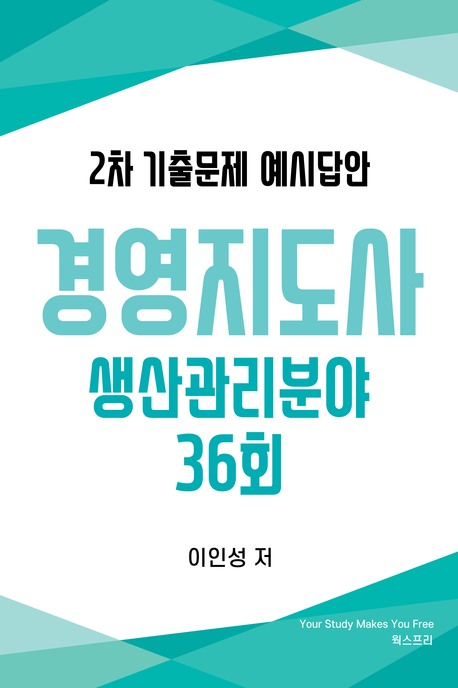
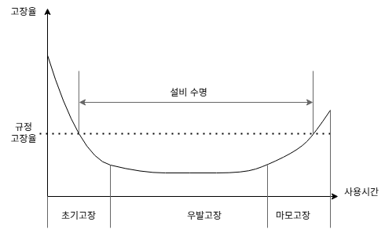
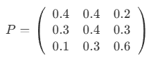
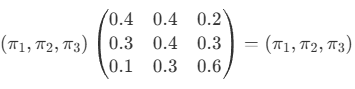
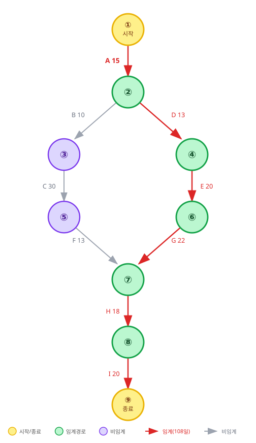



# 저자 소개
<ul>
    <li>경영지도사 생산관리분야</li>
    <li>자동화 장비 제조업 프로세스 개선 내부 컨설팅 경력</li>
    <li>제조업 설계 및 MCT 단순 반복 업무 자동화(RPA) 프로그램 개발
        <a href="https://www.worksfree.com">
        <figure style="float: right"><figcaption style="text-align: center;">RPA Site</figcaption></figure>
        </a>
        <ul>
            <li>어셈블리 BOM 엑셀 저장 자동화 프로그램</li>
            <li>8만 여개 구매품 속성 2주만에 정리하기</li>
            <li>이드로잉스 뷰어 대량 출력 자동화 프로그램</li>
            <li>구글 드라이브 기반 인터넷 정보 자동 업데이트</li>
            <li>자동화(RPA) 프로그램은 우측 QR 또는 아래 URL 참고 <a href="https://www.worksfree.com">https://www.worksfree.com</a></li>
        </ul>
    </li>
    <li>소프트웨어 분야 개발 및 PM 경력</li>
    <li>프로젝트 관리 전문가(PMP from PMI)</li>
    <li>IITP 평가위원, NIPA 평가위원</li>
    <li>KOIIA DX/AX 진단 컨설팅 위원</li>
    <li>2025년 예비창업패키지 사업자 선정 및 1단계, 2단계 수행</li>
</ul>

# 교재 소개
- 본 교재는 필자가 경영지도사 2차 수험 생활을 하며 기출문제를 풀고 아래 명시된 수험 교재 학습 및 인터넷 정보를 참조하여 정리한 내용입니다.
  * 생산관리 : 생산운영관리 [법문사]
  * 품질경영 : 품질경영론 [KSAM]
  * 경영과학 : 4차 산업혁명 시대의 EXCEL 경영과학 [박영사]
- 목차는 3 페이지에 제공되며 본문 내의 파랑색으로 보이는 모든 문구는 문서 내부 링크로서 클릭하면 문제, 예시답안, 목차로 이동합니다.
- 예시답안은 설명을 위해 단계별로 내용이 작성되어 불필요하게 긴 예시답안이 있는데 실제 답안 작성시에는 꼭 필요한 경우만 풀이 과정을 단계별로 작성해도 됩니다.
- 예시답안의 내용에 대한 개정 의견이나 시험 관련된 문의 사항은 아래 이메일로 보내주시기 바라며 수험생들의 고득점을 기원합니다.
- 자격시험 합격 후 동차 예시답안 출판에 관심 있는 분은 이메일로 연락 바랍니다.
- <a href="mailto:insung.lee@worksfree.kr">이메일 : insung.lee@worksfree.kr</a>

# 
 36회 목차 

## [36회 생산관리 목차](#36회-생산관리)
- [[문제1] 수요예측 - 단순지수평활법과 계절지수](#36회-생산관리-문제-1)
- [[문제2] 프로세스 관리 - 자원이용률과 산출물](#36회-생산관리-문제-2)
- [[문제3] 아웃소싱의 장점](#36회-생산관리-문제-3)
- [[문제4] 경제적 주문량(EOQ) 모형](#36회-생산관리-문제-4)
- [[문제5] 생산능력 확장](#36회-생산관리-문제-5)
- [[문제6] 생산공급전략과 상쇄관계](#36회-생산관리-문제-6)

## [36회 품질경영 목차](#36회-품질경영)
- [[문제1] 관리도](#36회-품질경영-문제-1)
- [[문제2] 실험계획법](#36회-품질경영-문제-2)
- [[문제3] 측정시스템(MSA, measurement system analysis)](#36회-품질경영-문제-3)
- [[문제4] 품질코스트(Q-cost)의 종류](#36회-품질경영-문제-4)
- [[문제5] 신뢰성 관리 - 신뢰도함수, 고장률함수](#36회-품질경영-문제-5)
- [[문제6] 통계적 품질관리](#36회-품질경영-문제-6)

## [36회 경영과학 목차](#36회-경영과학)
- [[문제1] 마코프 체인](#36회-경영과학-문제-1)
- [[문제2] 수송문제](#36회-경영과학-문제-2)
- [[문제3] 대기행렬이론](#36회-경영과학-문제-3)
- [[문제4] 네트워크/CPM](#36회-경영과학-문제-4)
- [[문제5] 손익분기점 분석(Break-Even Analysis)](#36회-경영과학-문제-5)
- [[문제6] 선형계획법의 전제조건](#36회-경영과학-문제-6)

# 36회 생산관리 문제

## 36회 생산관리 문제 1
<!-- SRC:생산관리/문제1.md -->
### 【문제 1】A 회사에서 최근 6년 동안 어떤 제품의 실제수요(단위: 개)를 조사한 결과는 다음과 같다. 물음에 답하시오. (30점)

<table>
    <tr><th>년(t)</th><th>1년</th><th>2년</th><th>3년</th><th>4년</th><th>5년</th><th>6년</th></tr>
    <tr><td>실제수요(At)</td><td>1,028</td><td>1,002</td><td>1,063</td><td>1,037</td><td>1,041</td><td>1,040</td></tr>
</table>

(1) 단순지수평활법을 이용하여 1~4년의 수요를 아래와 같이 예측하였다. 나머지 5~7년의 수요를 예측해 보시오. (단, α=0.7로 하고 계산결과는 소수점 이하는 반올림하여 정수로 구한다.) (10점)

<table>
    <tr><th>년(t)</th><th>1년</th><th>2년</th><th>3년</th><th>4년</th><th>5년</th><th>6년</th><th>7년</th></tr>
    <tr><td>실제수요(At)</td><td>1,028</td><td>1,002</td><td>1,063</td><td>1,037</td><td>1,041</td><td>1,040</td><td></td></tr>
    <tr><td>예측수요(Ft)</td><td>1,018</td><td>1,025</td><td>1,009</td><td>1,047</td><td>( )</td><td>( )</td><td>( )</td></tr>
</table>

(2) 6년의 실제수요를 분기별로 조사한 결과는 다음과 같다. 승법계절 변동을 가정할 때 분기별 계절지수를 구하시오. (단, 계산결과는 소수점 넷째자리에서 반올림하여 소수점 셋째자리까지 구한다.) (10점)

<table>
    <tr><th>분기</th><th>1분기</th><th>2분기</th><th>3분기</th><th>4분기</th><th>합계</th></tr>
    <tr><td>6년의 실제수요(A6)</td><td>182</td><td>340</td><td>280</td><td>238</td><td>1,040</td></tr>
</table>

(3) 문제 (1)에서 구한 7년의 예측수요와 문제 (2)에서 구한 계절지수를 활용하여, 7년의 분기별 예측수요를 구하시오. (단, 계산결과는 소수점 이하는 반올림하여 정수로 구한다.) (10점)
<!-- /SRC:생산관리/문제1.md -->

<a href="#36회-생산관리-문제-1-예시답안-30점">예시답안 바로가기</a><a href="#36회-생산관리-목차">목차 바로가기</a>

## 36회 생산관리 문제 2
<!-- SRC:생산관리/문제2.md -->
### 【문제 2】A 레스토랑은 종업원이 고객 주문을 받아 음식 주문서를 주방에 전달하면 주방 셰프가 이를 바탕으로 조리한 후 음식을 고객에게 제공하는 <주문 충족 프로세스>를 사용하고 있다. A 레스토랑 지배인은 현 프로세스 디자인에 대한 경영지도를 통해 수익을 증대하고 비용을 감축하고자 한다. 수집한 자료를 보고 다음 물음에 답하시오. (30점)

<table>
    <tr><th>작업활동</th><th>업무</th><th>주문 도착률</th><th>평균소요 시간(분)</th><th>자원의 수</th></tr>
    <tr><td>1</td><td>셰프가 주문이 올바른지를 확인함</td><td>20/시간</td><td>1</td><td>1 셰프</td></tr>
    <tr><td>2</td><td>식자재 선택 및 주 요리작업</td><td>20/시간</td><td>6</td><td>1 셰프</td></tr>
    <tr><td>3</td><td>다양한 사이드 요리 (곁찬 요리) 작업</td><td>20/시간</td><td>12</td><td>1 셰프</td></tr>
    <tr><td>4</td><td>오븐 작업</td><td>20/시간</td><td>10</td><td>2 오븐</td></tr>
    <tr><td>5</td><td>셰프가 주문을 완성하기 위한 세팅작업</td><td>20/시간</td><td>3</td><td>1 셰프</td></tr>
</table>

(1) 각각의 작업활동별 자원이용률(resource utilization)을 구하시오. (단, 소수점 셋째자리에서 반올림하여 소수점 둘째자리까지 구한다.) (10점)

(2) 작업활동 3의 이용률을 100% 이하로 낮추기 위해 필요한 최소한의 셰프의 수를 구하시오. (5점)

(3) 만일 작업활동 3에서 3명의 셰프가 작업을 하고 작업활동 4에서 4대의 오븐을 가동하도록 한다면, 현 프로세스 산출물(throughput rate)과 비교하여 산출물이 얼마나 증가하는지를 구하시오. (10점)

(4) 만일 <주문 충족 프로세스>의 평균 산출물(throughput)이 12주문/시간이고 주문을 처리하는 평균 프로세스 처리시간(flow time)이 10분이라면 이 프로세스 상의 평균 재공품재고(work in process)는 얼마가 되는지 구하시오. (5점)
<!-- /SRC:생산관리/문제2.md -->

<a href="#36회-생산관리-문제-2-예시답안-30점">예시답안 바로가기</a><a href="#36회-생산관리-목차">목차 바로가기</a>

## 36회 생산관리 문제 3
<!-- SRC:생산관리/문제3.md -->
### 【문제 3】아웃소싱은 회사의 내부활동과 의사결정 책임의 일부를 외부 공급자에게 이전하는 행위이다. 아웃소싱의 장점에 관하여 다음 물음에 답하시오. (10점)

(1) 재무원가 측면에서의 아웃소싱의 장점을 2가지만 기술하시오. (3점)

(2) 개선 측면에서의 아웃소싱의 장점을 2가지만 기술하시오. (3점)

(3) 조직 측면에서의 아웃소싱의 장점을 2가지만 기술하시오. (4점)
<!-- /SRC:생산관리/문제3.md -->

<a href="#36회-생산관리-문제-3-예시답안-10점">예시답안 바로가기</a><a href="#36회-생산관리-목차">목차 바로가기</a>

## 36회 생산관리 문제 4
<!-- SRC:생산관리/문제4.md -->
### 【문제 4】경제적 주문량(Economic Order Quantity, EOQ) 모형에 관하여 다음 질문에 답하시오. (10점)

(1)  A 업체에서 생산하는 제품에 대한 연간 수요량(D)은 3,000개이다. 1회 주문비용(S)이 1,000,000원, 단위당 연간재고유지비용(H)이 6,000원이라면 경제적 주문량(EOQ)은 얼마인지 계산하시오. 그리고 이 때의 주문간격(단위: 개월)을 구하시오. (단, 1년은 12개월로 한다.) (7점)

(2) EOQ 모형에서 파라미터가 변화할 때 EOQ에 미치는 영향을 파악하는 것, 즉 민감도 분석이 중요하다. 모형 파라미터들이 각각 아래와 같이 변화할 때 EOQ는 어떻게 변화하는지 답하시오. (단, 해당 파라미터가 변화할 때 다른 파라미터들은 고정되어 있는 것으로 가정한다.) (3점)

<table>
    <tr><th>파라미터</th><th>파라미터의 변화</th><th>EOQ의 변화</th></tr>
    <tr><td>연간 수요량(D)</td><td>감소</td><td>( )</td></tr>
    <tr><td>1회 주문비용(S)</td><td>감소</td><td>( )</td></tr>
    <tr><td>단위당 연간재고유지비용(H)</td><td>증가</td><td>( )</td></tr>
</table>
<!-- /SRC:생산관리/문제4.md -->

<a href="#36회-생산관리-문제-4-예시답안-10점">예시답안 바로가기</a><a href="#36회-생산관리-목차">목차 바로가기</a>

## 36회 생산관리 문제 5
<!-- SRC:생산관리/문제5.md -->
### 【문제 5】기업들은 미래의 수요변화에 대응하여 생산능력을 변경하는 의사결정을 하게 된다. 특히, 장기적인 수요예측에 바탕을 둔 장기적인 생산능력 계획은 막대한 자본의 투자가 요구된다. 생산능력의 확장 시 유의하여야 할 사항을 세 가지만 기술하시오. (10점)
<!-- /SRC:생산관리/문제5.md -->

<a href="#36회-생산관리-문제-5-예시답안-10점">예시답안 바로가기</a><a href="#36회-생산관리-목차">목차 바로가기</a>

## 36회 생산관리 문제 6
<!-- SRC:생산관리/문제6.md -->
### 【문제 6】생산공급전략은 기업의 장기적인 경쟁전략이 잘 수행되도록 기업의 자원을 이용하기 위한 광범위한 정책과 계획을 수립하는 것이라고 할 수 있다. 다음 물음에 답하시오. (10점)

(1) 생산공급전략의 핵심 개념으로 집중화와 상쇄관계(trade-off)를 들 수 있는데 이에 대한 기본 논리를 설명하시오. (4점)

(2) 상쇄관계에 있는 경쟁차원을 세 가지만 설명하시오. (6점)
<!-- /SRC:생산관리/문제6.md -->

<a href="#36회-생산관리-문제-6-예시답안-10점">예시답안 바로가기</a><a href="#36회-생산관리-목차">목차 바로가기</a>

# 36회 생산관리 예시답안

## 36회 생산관리 문제 1 예시답안 (30점)

<!-- SRC:생산관리/예시답안1.md -->
### 【문제 1 - (1)】 단순지수평활법 (5~7년 예측) (10점)

**공식:** $F_{t+1} = \alpha A_t + (1-\alpha) F_t$ (α=0.7)

**계산:**
- $F_5 = 0.7 \times 1,037 + 0.3 \times 1,047 = 1,040$ (개)
- $F_6 = 0.7 \times 1,041 + 0.3 \times 1,040 = 1,040.7 → 1,041$ (개)
- $F_7 = 0.7 \times 1,040 + 0.3 \times 1,041 = 1,040.3 → 1,040$ (개)

**답안:** 5년=1,040개, 6년=1,041개, 7년=1,040개

### 【문제 1 - (2)】 계절지수 계산 (승법 모형) (10점)

**평균 분기 수요:** $\cfrac{1,040}{4} = 260$ (개)

**계절지수:**
$SI = \cfrac{\text{각 분기 실제수요}}{\text{평균 분기 수요}}$
<table>
    <tr><th>분기</th><th>1분기</th><th>2분기</th><th>3분기</th><th>4분기</th></tr>
    <tr><td>실제수요</td><td>182</td><td>340</td><td>280</td><td>238</td></tr>
    <tr><td>계절지수</td><td>0.700</td><td>1.308</td><td>1.077</td><td>0.915</td></tr>
</table>

**답안:** 1분기 0.700, 2분기 1.308, 3분기 1.077, 4분기 0.915

### 【문제 1 - (3)】 7년 분기별 예측수요 (10점)

**계산:** 분기별 예측 = (연간 예측수요 ÷ 4) × 계절지수

**분기별 기본 예측:** $\cfrac{1,040}{4} = 260$ (개)

| 분기 | 계절지수 | 계산 | 예측수요 |
|------|---------|------|---------|
| 1분기 | 0.700 | 260 × 0.700 | 182 |
| 2분기 | 1.308 | 260 × 1.308 | 340 |
| 3분기 | 1.077 | 260 × 1.077 | 280 |
| 4분기 | 0.915 | 260 × 0.915 | 238 |

**검증:** 182 + 340 + 280 + 238 = 1,040개 (연간 예측과 일치 ✓)

**답안:** 1분기 182개, 2분기 340개, 3분기 280개, 4분기 238개
<!-- /SRC:생산관리/예시답안1.md -->

<a href="#36회-생산관리-문제-1">문제 바로가기</a><a href="#36회-생산관리-목차">목차 바로가기</a>

## 36회 생산관리 문제 2 예시답안 (30점)

<!-- SRC:생산관리/예시답안2.md -->
### 【문제 2 - (1)】 자원이용률 계산 (10점)

**공식:** $U = \cfrac{\text{처리시간} \times \text{도착률}}{\text{자원수} \times 60\text{(분/시)}}$
<table>
    <tr><th>작업</th><th>도착률</th><th>소요시간(분)</th><th>자원수</th><th>이용률</th></tr>
    <tr><td>1</td><td>20/시간</td><td>1</td><td>1</td><td>33.33%</td></tr>
    <tr><td>2</td><td>20/시간</td><td>6</td><td>1</td><td>200.00%</td></tr>
    <tr><td>3</td><td>20/시간</td><td>12</td><td>1</td><td>400.00%</td></tr>
    <tr><td>4</td><td>20/시간</td><td>10</td><td>2</td><td>166.67%</td></tr>
    <tr><td>5</td><td>20/시간</td><td>3</td><td>1</td><td>100.00%</td></tr>
</table>

**답안:**
- 작업1: 33.33%, 작업2: 200.00%, 작업3: 400.00%
- 작업4: 166.67%, 작업5: 100.00%

### 【문제 2 - (2)】 작업활동 3의 필요 셰프 수 (5점)

**현재:** 1명 셰프, 이용률 400%

**필요:** $\cfrac{20 \times 12}{n \times 60} \leq 1.00$ → $n \geq 4$

**답안:** 4명

### 【문제 2 - (3)】 개선 후 산출물 증가 (10점)

**현재 병목:** 작업 3 (이용률 400%) → 산출물 5주문/시간

**개선 시나리오:**
- 작업 3: 3명 셰프 → 처리능력 15주문/시간
- 작업 4: 4대 오븐 → 처리능력 24주문/시간

**새로운 병목:** 작업 2 (이용률 200%) → 산출물 10주문/시간

**산출물 증가:** 10 - 5 = **5주문/시간 증가**

### 【문제 2 - (4)】 평균 재공품 재고(WIP) (5점)

**리틀의 법칙:** $L = \lambda \times W$

**계산:**
- 평균 산출물: 12주문/시간
- 평균 처리 시간: 10분 = 1/6시간
- $L = 12 \times \cfrac{10}{60} = 2$ (주문)

**답안:** 2주문
<!-- /SRC:생산관리/예시답안2.md -->

<a href="#36회-생산관리-문제-2">문제 바로가기</a><a href="#36회-생산관리-목차">목차 바로가기</a>

## 36회 생산관리 문제 3 예시답안 (10점)

<!-- SRC:생산관리/예시답안3.md -->
### 【문제 3 - (1)】 재무원가측면 (2가지) (3점)

① **고정비용의 가변비용화**
- 내부 운영의 고정비(인력, 시설, 장비)를 아웃소싱 가변비로 전환
- 손익분기점 감소, 손실 최소화

② **규모의 경제 활용**
- 전문 아웃소싱 기업의 다수 고객 기반으로 비용 분산
- 특화와 기술 축적으로 원가 절감

### 【문제 3 - (2)】 개선측면 (2가지) (3점)

① **최신 기술 및 Best Practice 접근**
- 전문 기업의 최고 수준 프로세스와 표준 적용
- 최신 기술 도입으로 경쟁력 강화

② **지속적 혁신 및 품질 개선**
- 아웃소싱 기업의 경쟁 압박으로 지속적 개선
- 클라이언트가 자동 수혜

### 【문제 3 - (3)】 조직측면 (2가지 이상) (4점)

① **핵심역량 집중**
- 비핵심 활동 외부 위임, 핵심 사업에 자원 집중
- 전략적 경쟁우위 확보

② **조직의 유연성 증대**
- 계약 기반으로 신속한 확대/축소 가능
- 시장 변화에 빠른 대응

③ **조직 규모 효율화**
- 지원 기능 축소로 슬림화
- 의사결정 신속화
<!-- /SRC:생산관리/예시답안3.md -->

<a href="#36회-생산관리-문제-3">문제 바로가기</a><a href="#36회-생산관리-목차">목차 바로가기</a>

## 36회 생산관리 문제 4 예시답안 (10점)

<!-- SRC:생산관리/예시답안4.md -->
### 【문제 4 - (1)】 EOQ 계산 및 주문간격 (7점)

**공식:** $EOQ = \sqrt{\cfrac{2DS}{H}}$

**계산:**
$EOQ = \sqrt{\cfrac{2 \times 3,000 \times 1,000,000}{6,000}} = \sqrt{1,000,000} = 1,000 \text{ (개)}$

**주문간격:**
$\text{주문간격} = \cfrac{12}{\cfrac{D}{EOQ}} = \cfrac{12 \times EOQ}{D} = \cfrac{12 \times 1,000}{3,000} = 4 \text{ (개월)}$

**답안:** EOQ = 1,000개, 주문간격 = 4개월

### 【문제 4 - (2)】 민감도 분석 (3점)

<table>
    <tr><th>파라미터</th><th>변화</th><th>EOQ 변화</th></tr>
    <tr><td>연간수요량(D)</td><td>감소</td><td><b>감소</b> ↓</td></tr>
    <tr><td>주문비용(S)</td><td>감소</td><td><b>감소</b> ↓</td></tr>
    <tr><td>유지비용(H)</td><td>증가</td><td><b>감소</b> ↓</td></tr>
</table>

**답안:** 모두 감소
<!-- /SRC:생산관리/예시답안4.md -->

<a href="#36회-생산관리-문제-4">문제 바로가기</a><a href="#36회-생산관리-목차">목차 바로가기</a>

## 36회 생산관리 문제 5 예시답안 (10점)

<!-- SRC:생산관리/예시답안5.md -->
### 【문제 5】 생산능력 확장시 유의사항 (3가지) (10점)

① **수요의 예측 정확성 및 지속성 검토**
- 수요 예측의 신뢰도 검증
- 중장기(3~5년) 수요 안정성 확인
- 경쟁사 동향, 시장 포화도 분석

② **자금 조달 방법 및 투자 수익성 검토**
- 총 소요자금 계산 (설비, 운영비, 인력)
- 자체자금 vs 차입금 vs 증자 검토
- ROI, BEP, 투자회수기간 분석

③ **조직의 준비 상태 및 리스크 관리**
- 경영진 리더십 및 변화 관리 능력
- 기술 인력 확보 및 교육 계획
- 기술 도입 위험 요소 분석, 대안 계획 수립
<!-- /SRC:생산관리/예시답안5.md -->

<a href="#36회-생산관리-문제-5">문제 바로가기</a><a href="#36회-생산관리-목차">목차 바로가기</a>

## 36회 생산관리 문제 6 예시답안 (10점)

<!-- SRC:생산관리/예시답안6.md -->
### 【문제 6 - (1)】 집중화와 상쇄관계의 기본 논리 (4점)

기업은 제한된 자원을 가지고 모든 경쟁차원에서 동시에 우수성을 달성할 수 없다. 따라서 경쟁우위를 확보하기 위해서는 **집중화(Focus)** 전략이 필요하다. 이는 자원을 특정 경쟁차원에 선택적으로 투입하여 그 영역에서 탁월한 성과를 창출하려는 접근이다.

그러나 한 경쟁차원에 자원을 집중화하면 다른 경쟁차원의 성과가 상대적으로 상쇄(Trade-off)되는 결과가 나타날 수 있다. 즉, 어떤 영역을 강화하려는 시도가 다른 영역의 약화를 초래하는 상호 배타적 관계, 즉 **상쇄관계**가 존재한다.

### 【문제 6 - (2)】 상쇄관계 있는 경쟁차원 3가지 (6점)

① **비용(Cost) vs 품질(Quality)**
비용 경쟁력을 강화하기 위해 원가 절감과 생산 표준화를 추진하면 생산 효율은 높아질 수 있으나 품질 저하의 위험이 따른다. 반대로 품질을 중시하여 우수한 소재를 사용하고 엄격한 품질검사를 시행하면 제품 신뢰도는 향상되지만 원가는 상승할 수밖에 없다. 따라서 기업은 비용 절감과 품질 확보 사이에서 적절한 균형점을 찾아야 한다.

② **비용(Cost) vs 유연성(Flexibility)**
비용을 최소화하기 위해 규모의 경제를 활용하고 생산 공정을 자동화하면 단가를 낮출 수 있다. 그러나 이러한 방식은 제품 다양성을 제한하고 생산 유연성을 떨어뜨린다. 반대로 고객 요구에 맞춰 유연성을 높이기 위해 다목적 설비나 숙련된 인력을 운용하면 운영비용이 상승하게 된다. 결국 비용 절감과 유연성 확보는 서로 충돌하는 목표이다.

③ **품질(Quality) vs 납기(Delivery)**
높은 품질을 달성하기 위해 엄격한 품질검사와 충분한 개발 기간을 확보하면 생산 과정이 길어져 납기 지연이 발생할 수 있다. 반대로 납기를 단축하려면 생산 기간을 줄이고 검수 과정을 최소화해야 하는데, 이 경우 품질 관리의 철저함이 감소할 위험이 있다. 따라서 기업은 품질 유지와 신속한 납품 간의 상쇄관계를 고려해 적정 수준의 납기 목표를 설정해야 한다.
<!-- /SRC:생산관리/예시답안6.md -->

<a href="#36회-생산관리-문제-6">문제 바로가기</a><a href="#36회-생산관리-목차">목차 바로가기</a>

# 36회 품질경영 문제

## 36회 품질경영 문제 1
<!-- SRC:품질경영/문제1.md -->
### 【문제 1】관리도에 관하여 다음 물음에 답하시오. (30점)

(1) 계수형 관리도인 c관리도와 u관리도의 공통점과 차이점에 관하여 설명하시오. (10점)

(2) 다음 데이터를 이용하여, x̄ 관리도의 관리상한선(UCL, upper control limit)과 관리하한선(LCL, lower control limit)을 구하시오. (단, 소수점 셋째자리에서 반올림하여 소수점 둘째자리까지 구한다.) (10점)

<table>
    <tr><th rowspan="2">샘플군 번호</th><th colspan="5">측정 데이터</th></tr>
    <tr><th>x₁</th><th>x₂</th><th>x₃</th><th>x₄</th><th>x₅</th></tr>
    <tr><td>1</td><td>7</td><td>14</td><td>3</td><td>4</td><td>7</td></tr>
    <tr><td>2</td><td>10</td><td>19</td><td>9</td><td>13</td><td>14</td></tr>
    <tr><td>3</td><td>7</td><td>17</td><td>2</td><td>5</td><td>14</td></tr>
    <tr><td>4</td><td>15</td><td>18</td><td>16</td><td>9</td><td>17</td></tr>
    <tr><td>5</td><td>5</td><td>9</td><td>4</td><td>5</td><td>7</td></tr>
</table>

단, x̄ - R 관리도의 계수표는 다음과 같다.

<table>
    <tr><th>n</th><th>A₂</th><th>D₄</th><th>D₃</th></tr>
    <tr><td>5</td><td>0.58</td><td>2.12</td><td>-</td></tr>
    <tr><td>6</td><td>0.48</td><td>2.00</td><td>-</td></tr>
</table>

(3) 다음 데이터를 이용하여, R 관리도의 관리상한선(UCL)과 관리하한선(LCL)을 구하시오. (단, 소수점 셋째자리에서 반올림하여 소수점 둘째자리까지 구한다.) (10점)
<!-- /SRC:품질경영/문제1.md -->

<a href="#36회-품질경영-문제-1-예시답안-30점">예시답안 바로가기</a><a href="#36회-품질경영-목차">목차 바로가기</a>

## 36회 품질경영 문제 2
<!-- SRC:품질경영/문제2.md -->
### 【문제 2】A산업은 전사적인 품질경영활동을 추진하고 있으며, 현재 운영 중인 제품 혼합 공정에서 생산량 증대를 위하여 실험을 계획하고 분산분석을 실시하여 공정의 최적작업 조건을 선정하고자 한다. 다음 물음에 답하시오. (30점)

(1) 실험의 목적을 달성하기 위하여 실험과 관련된 인자는 모두 선택하여 주는 것이 원칙이며, 인자는 모수인자(Fixed factor)와 변량인자(Random factor)로 분류할 수 있다. 두 인자에 관하여 설명하시오. (4점)

(2) 실험을 계획하는 단계에서 실험자는 기본원리를 염두에 두고 실험계획을 작성하면 실험의 정도가 좋고 분석이 용이한 실험계획을 구상할 수 있다. 실험계획의 5가지 기본원리를 제시하고 설명하시오. (10점)

(3) A산업에서 온도와 습도를 인자로 반복이 없는 이원배치법을 실시하다가 실험이 잘못되어 하나의 결측치 y가 생겼다. 아래 표를 활용하여 결측치 y를 추정하고, 추정된 결측치 y를 대입하여 수정항(CT, correction term)을 계산하시오. (단, 소수점 셋째자리에서 반올림하여 소수점 둘째자리까지 구한다.) (8점)

<!-- Original content commented out:
<table>
    <tr><th class="backslash" width="100">
온도

습도
</th><th>A₁</th><th>A₂</th><th>A₃</th><th>A₄</th></tr>
    <tr><td>B₁</td><td>21</td><td>28</td><td>27</td><td>29</td></tr>
    <tr><td>B₂</td><td>26</td><td>25</td><td>y</td><td>31</td></tr>
    <tr><td>B₃</td><td>27</td><td>30</td><td>29</td><td>35</td></tr>
</table>

(4) 모수모형 실험에서 얻어진 N개의 데이터들은 평균치 μᵢⱼ, 분산 σₑ²인 정규모집단으로부터의 확률표본으로 볼 수 있어, 이를 데이터 식 xᵢⱼ = μ + aᵢ + bⱼ + eᵢⱼ (i = 1,2,⋯,l), (j = 1,2,⋯,m)로 표현할 수 있다. 여기서, 오차항(eᵢⱼ)은 정규분포 N(0, σₑ²)로부터 확률추출된 것이라고 가정한다. 이 가정에 대한 4가지 특징을 제시하고 설명하시오. (8점)
-->

<table>
    <tr><th class="backslash" width="100">
온도

습도
</th><th>$A_1$</th><th>$A_2$</th><th>$A_3$</th><th>$A_4$</th></tr>
    <tr><td>$B_1$</td><td>21</td><td>28</td><td>27</td><td>29</td></tr>
    <tr><td>$B_2$</td><td>26</td><td>25</td><td>$y$</td><td>31</td></tr>
    <tr><td>$B_3$</td><td>27</td><td>30</td><td>29</td><td>35</td></tr>
</table>

(4) 모수모형 실험에서 얻어진 N개의 데이터들은 평균치 $\mu_{ij}$, 분산 $\sigma_e^2$인 정규모집단으로부터의 확률표본으로 볼 수 있어, 이를 데이터 식 $x_{ij} = \mu + a_i + b_j + e_{ij}$ ($i = 1,2,\cdots,l$), ($j = 1,2,\cdots,m$)로 표현할 수 있다. 여기서, 오차항($e_{ij}$)은 정규분포 $N(0, \sigma_e^2)$로부터 확률추출된 것이라고 가정한다. 이 가정에 대한 4가지 특징을 제시하고 설명하시오. (8점)
<!-- /SRC:품질경영/문제2.md -->

<a href="#36회-품질경영-문제-2-예시답안-30점">예시답안 바로가기</a><a href="#36회-품질경영-목차">목차 바로가기</a>

## 36회 품질경영 문제 3
<!-- SRC:품질경영/문제3.md -->
### 【문제 3】측정시스템(MSA, measurement system analysis)에 관하여 다음 물음에 답하시오. (10점)

(1) 측정시스템의 정확도(accuracy)와 정밀도(precision)에 관하여 설명하시오. (6점)

(2) 게이지(Gage) R&R의 반복성(repeatability)과 재현성(reproducibility)에 관하여 설명하시오. (4점)
<!-- /SRC:품질경영/문제3.md -->

<a href="#36회-품질경영-문제-3-예시답안-10점">예시답안 바로가기</a><a href="#36회-품질경영-목차">목차 바로가기</a>

## 36회 품질경영 문제 4
<!-- SRC:품질경영/문제4.md -->
### 【문제 4】품질코스트(Q-cost)의 종류에 관하여 다음 물음에 답하시오. (10점)

(1) 사내실패코스트(internal failure cost)와 사외실패코스트(external failure cost)에 관하여 설명하시오. (4점)

(2) 평가코스트(appraisal cost)에 관하여 설명하시오. (3점)

(3) 예방코스트(prevention cost)에 관하여 설명하시오. (3점)
<!-- /SRC:품질경영/문제4.md -->

<a href="#36회-품질경영-문제-4-예시답안-10점">예시답안 바로가기</a><a href="#36회-품질경영-목차">목차 바로가기</a>

## 36회 품질경영 문제 5
<!-- SRC:품질경영/문제5.md -->
### 【문제 5】신뢰성 관리에 관하여 다음 물음에 답하시오. (10점)

(1) 신뢰도함수$(R(t))$와 고장률함수$(h(t))$에 관하여 설명하시오. (6점)

(2) 고장밀도함수$(f(t))$가 $f(t) = λe^{-λt}$일 때, 신뢰도함수$(R(t))$와 고장률함수$(h(t))$를 구하시오. (4점)
<!-- /SRC:품질경영/문제5.md -->

<a href="#36회-품질경영-문제-5-예시답안-10점">예시답안 바로가기</a><a href="#36회-품질경영-목차">목차 바로가기</a>

## 36회 품질경영 문제 6
<!-- SRC:품질경영/문제6.md -->
### 【문제 6】B공장에서 생산되는 제품의 15%가 부적합품이라고 한다. 이 공장의 제품 10개를 임의로 추출하여 검사했을 때 다음 물음에 답하시오. (단, 소수점 셋째자리에서 반올림하여 소수점 둘째자리까지 구한다.) (10점)

(1) 제품 10개 중에서 3개의 부적합품이 포함되었을 확률을 구하시오. (4점)

(2) 부적합품 수에 대한 기댓값을 구하시오. (3점)

(3) 부적합품 수에 대한 분산을 구하시오. (3점)
<!-- /SRC:품질경영/문제6.md -->

<a href="#36회-품질경영-문제-6-예시답안-10점">예시답안 바로가기</a><a href="#36회-품질경영-목차">목차 바로가기</a>

# 36회 품질경영 예시답안

## 36회 품질경영 문제 1 예시답안 (30점)

<!-- SRC:품질경영/예시답안1.md -->
### 【문제 1 - (1)】 c관리도와 u관리도의 공통점과 차이점 (10점)

**공통점:**
- 모두 계수형 관리도 (부적합수(결점수) 데이터)
- 정규분포 근사로 관리한계선 설정
- 공정 통계적 관리에 사용

**차이점:**

<table>
    <tr><th>항목</th><th>c관리도</th><th>u관리도</th></tr>
    <tr><td>적용 대상</td><td>고정 크기 표본</td><td>가변 크기 표본</td></tr>
    <tr><td>측정</td><td>부적합수(개)</td><td>단위당 부적합수</td></tr>
    <tr><td>공식</td><td>$c = \bar{c}$</td><td>$u = \bar{u}$</td></tr>
    <tr><td>사용 시기</td><td>표본 크기 일정</td><td>표본 크기 변동</td></tr>
</table>

### 【문제 1 - (2)】 ${\bar{X}}$ 관리도 (표본크기 5) (10점)
<table>
    <tr><th>샘플</th><th>데이터</th><th>${\bar{X}}$</th><th>$R$</th></tr>
    <tr><td>1</td><td>7, 14, 3, 4, 7</td><td>7</td><td>11</td></tr>
    <tr><td>2</td><td>10, 19, 9, 13, 14</td><td>13</td><td>10</td></tr>
    <tr><td>3</td><td>7, 17, 2, 5, 14</td><td>9</td><td>15</td></tr>
    <tr><td>4</td><td>15, 18, 16, 9, 17</td><td>15</td><td>9</td></tr>
    <tr><td>5</td><td>5, 9, 4, 5, 7</td><td>6</td><td>5</td></tr>
</table>

**평균:**

- $\bar{\bar{X}} = 10$

- $\bar{R} = 10$

**계수표(n=5):**

- $A_2=0.58$

- $D_4=2.12$, $D_3=0 (무시)$

**X̄ 관리도:**

- $UCL_{\bar{X}} = \bar{\bar{X}} + A_2\bar{R} = 10 + 0.58 \times 10 = 15.80$

- $LCL_{\bar{X}} = \bar{\bar{X}} - A_2\bar{R} = 10 - 5.80 = 4.20$

**답안:**

- ${\bar{X}} 관리도:  UCL=15.80,  LCL=4.20$

### 【문제 1 - (3)】 R 관리도 (10점)

**R 관리도:**

- $UCL_R = D_4\bar{R} = 2.12 \times 10 = 21.20$

- $LCL_R = D_3\bar{R} = 0$

**답안:**

- $R 관리도:  UCL=21.20, LCL=0$
<!-- /SRC:품질경영/예시답안1.md -->

<a href="#36회-품질경영-문제-1">문제 바로가기</a><a href="#36회-품질경영-목차">목차 바로가기</a>

## 36회 품질경영 문제 2 예시답안 (30점)

<!-- SRC:품질경영/예시답안2.md -->
### 【문제 2 - (1)】 모수인자와 변량인자 (4점)

**모수인자(Fixed Factor):**
실험자가 특정 의도를 가지고 수준을 미리 정의하여 그 수준 내에서만 실험을 설계하고 관측하는 인자입니다. 실험을 반복해도 동일한 수준으로 재현이 가능합니다. 예를 들면 온도 수준을 20도, 30도, 40도 에서의 반응을 비교하는 경우 온도를 모수인자라고 할 수 있습니다.

**변량인자(Random Factor):**
모집단 내에서 일부 수준을 무작위(Random)로 추출하여 실험에 반영하는 인자입니다. 특정 수준 하나하나보다 전체 집단의 변동을 보게 됩니다. 예를 들면 100명의 작업자 중에 3명을 무작위로 뽑아 관찰하는 경우 작업자를 변량인자라고 할 수 있습니다. 작업자, 설비, 원자재 Lot등이 변량인자이며 작업자 A, B, C, 설비 1호기, 2호기, 3호기, Lot1, Lot2, Lot3 등은 각 변량인자의 특정 수준입니다.

### 【문제 2 - (2)】 실험계획의 5가지 기본원리 (10점)

① **재현(Replication)**
동일한 조건에서 실험을 반복 수행함으로써 오차를 추정하고, 결과의 신뢰성을 확보할 수 있다. 재현을 통해 실험결과의 통계적 안정성을 검증할 수 있다.

② **무작위화(Randomization)**
실험 처리의 할당을 무작위로 수행하여 계통적인 편향을 제거한다. 이를 통해 외부 요인의 영향을 최소화하고, 실험결과의 객관성을 높일 수 있다.

③ **블록화(Blocking)**
실험결과에 영향을 줄 수 있는 알려진 변동 요인을 구분하여 동일한 블록 내에서 비교함으로써 오차 분산을 줄이는 방법이다. 즉, 비슷한 조건끼리 비교해 주요 인자의 효과를 명확히 파악할 수 있다.

④ **직교성(Orthogonality)**
인자 간의 관계가 독립적으로 유지되도록 설계함으로써 각 인자의 효과를 분리하여 평가할 수 있게 한다. 직교성은 실험결과 해석을 명확히 하고 분석 효율을 높이는 데 중요하다.

⑤ **효율성(Efficiency)**
최소한의 실험으로 최대의 정보를 얻는 것을 의미한다. 효율적인 설계를 통해 실험비용을 절감하고 분석 시간을 단축할 수 있다.

### 【문제 2 - (3)】 결측치 추정 (8점)

<table>
    <tr><th class="backslash" width="100">
온도

습도
</th><th>A₁</th><th>A₂</th><th>A₃</th><th>A₄</th><th>행합(R')</th></tr>
    <tr><td>B₁</td><td>21</td><td>28</td><td>27</td><td>29</td><td>105</td></tr>
    <tr><td>B₂</td><td>26</td><td>25</td><td><b>y</b></td><td>31</td><td>82 (y 제외)</td></tr>
    <tr><td>B₃</td><td>27</td><td>30</td><td>29</td><td>35</td><td>121</td></tr>
    <tr><th>열합(C')</th><th>74</th><th>83</th><th>56 (y 제외)</th><th>95</th><th>T' = 308</th></tr>
</table>

**결측치 추정 공식:** (반복 없는 이원배치법)

$\hat{y} = \cfrac{r \cdot R_i' + c \cdot C_j' - T'}{(r-1)(c-1)}$

여기서 r=3(행수), c=4(열수), $R_i'$는 결측행의 y 제외 행합, $C_j'$는 결측열의 y 제외 열합, $T'$는 y 제외 전체합

**① 각 합계 산출 (y 제외):**

- $R_2' = 26 + 25 + 31 = 82$
- $C_3' = 27 + 29 = 56$
- $T' = 105 + 82 + 121 = 308$

**② 결측치 추정:**

$\hat{y} = \cfrac{3 \times 82 + 4 \times 56 - 308}{(3-1)(4-1)} = \cfrac{246 + 224 - 308}{6} = \cfrac{162}{6} = \mathbf{27}$

**③ 수정항(CT) 계산:**

추정치 $\hat{y} = 27$을 대입하면 전체합계 $T = 308 + 27 = 335$, 총 표본수 $N = r \times c = 3 \times 4 = 12$

$CT = \cfrac{T^2}{N} = \cfrac{335^2}{12} = \cfrac{112{,}225}{12} = \mathbf{9{,}352.08}$

### 【문제 2 - (4)】 오차항의 4가지 특징 (8점)

- **0 평균**

오차항의 평균(기댓값)은 0이다. 이는 오차항이 체계적인 방향성(양수나 음수)을 가지지 않고 0을 중심으로 대칭적임을 의미하며, 관측값이 이론적인 평균치를 중심으로 무작위로 변동한다고 가정하는 것입니다. 

- **등분산성**

모든 오차항은 데이터 내에서 인자 수준에 관계없이 일정하고 동일한 분산을 가진다. 즉, 데이터가 수집된 어떤 상황에서도 오차의 퍼짐 정도가 일정하다는 가정입니다. 

- **오차의 정규성**

오차항은 정규분포(Normal Distribution)를 따른다. 이는 오차들이 대칭적인 종 모양 분포를 가지며, 극단적인 오차가 발생할 확률이 매우 낮음을 가정한다. 통계적 추론(F-검정 등)을 위해 필수적인 가정이 됩니다. 

- **독립성**

서로 다른 오차항들은 상호 독립적이다. 즉, 한 데이터에서 발생한 오차항은 다른 데이터의 오차항에 영향을 미치지 않으며, 데이터 간의 상호 관련성이 없음을 의미합니다. 
<!-- /SRC:품질경영/예시답안2.md -->

<a href="#36회-품질경영-문제-2">문제 바로가기</a><a href="#36회-품질경영-목차">목차 바로가기</a>

## 36회 품질경영 문제 3 예시답안 (10점)

<!-- SRC:품질경영/예시답안3.md -->
### 【문제 3 - (1)】 정확도와 정밀도 (6점)

**정확도(Accuracy):**
측정값이 실제 값(참값)에 얼마나 가까운지를 나타내는 것으로, 측정 시스템의 편향(bias) 정도를 의미한다. 즉, 평균적으로 실제값과 일치하는 정도를 평가한다. 정확도가 높아도 정밀도가 낮으면 측정값이 불규칙하게 퍼진다.

**정밀도(Precision):**
같은 조건에서 반복 측정했을 때의 일관성을 나타내며, 측정값들의 분산(산포도)이 얼마나 작은지를 의미한다. 정밀도가 높아도 정확도가 낮으면 측정값이 실제값에서 체계적으로 벗어나게 된다.

### 【문제 3 - (2)】 게이지 R&R의 반복성과 재현성 (4점)

**반복성(Repeatability):**
같은 측정자가 동일한 부품을 동일한 조건에서 여러 번 측정했을 때의 일관성을 의미한다. 측정 시스템 자체의 변동을 평가한다. 반복성에 문제가 있을 때는 기기의 유지보수를 받거나 교정을 받아야 한다.

**재현성(Reproducibility):**
서로 다른 측정자들이 동일한 부품을 측정했을 때의 일관성을 의미한다. 측정자 간 차이를 평가한다. 재현성에 문제가 있을 때는 업무를 표준화하거나 측정자 교육을 실시해야 한다.

<!-- /SRC:품질경영/예시답안3.md -->

<a href="#36회-품질경영-문제-3">문제 바로가기</a><a href="#36회-품질경영-목차">목차 바로가기</a>

## 36회 품질경영 문제 4 예시답안 (10점)

<!-- SRC:품질경영/예시답안4.md -->
### 【문제 4 - (1)】 실패코스트 (4점)

**사내실패코스트(Internal Failure Cost):**
출하 전 발견된 불량으로 발생하는 비용으로, 재작업, 폐기, 재검사 등의 비용이 포함된다.

**사외실패코스트(External Failure Cost):**
출하 후 고객에게 발견된 불량으로 발생하는 비용으로, 보증비용, 교환비용, 평판 손실 비용 등이 포함된다.

### 【문제 4 - (2)】 평가코스트(Appraisal Cost) (3점)

제품의 적합성을 확인하기 위한 검사, 테스트, 품질 감사 등의 비용이다. 불량품을 사후에 걸러내기 위해 발생하는 비용이다.

### 【문제 4 - (3)】 예방코스트(Prevention Cost) (3점)

불량 발생을 사전에 방지하기 위한 설계 검토, 공정 계획, 교육 훈련 등의 비용이다. 품질을 근본적으로 향상시키기 위한 선행 투자 비용이다.
<!-- /SRC:품질경영/예시답안4.md -->

<a href="#36회-품질경영-문제-4">문제 바로가기</a><a href="#36회-품질경영-목차">목차 바로가기</a>

## 36회 품질경영 문제 5 예시답안 (10점)

<!-- SRC:품질경영/예시답안5.md -->
### 【문제 5 - (1)】 신뢰도함수와 고장률함수 (6점)

**신뢰도함수 R(t):**
시간 t까지 고장이 나지 않을 확률을 의미한다. 즉, t시간 동안 정상 작동할 확률이다.

**고장률함수 λ(t):**
시간 t에 단위시간 동안 고장날 조건부 확률 밀도로, 특정 시점에서의 고장 발생 가능성을 나타낸다. 일반적으로 욕조 곡선(Bathtub Curve: 초기 → 우발 → 마모 단계) 형태를 따른다.

<!-- <svg viewBox="0 0 650 210" xmlns="http://www.w3.org/2000/svg" style="width:100%;max-width:540px;display:block;margin:0.5em auto;font-family:sans-serif;">
  <defs>
    <marker id="mR" markerWidth="8" markerHeight="6" refX="7" refY="3" orient="auto">
      <polygon points="0 0,8 3,0 6" fill="#333"/>
    </marker>
    <marker id="mL" markerWidth="8" markerHeight="6" refX="1" refY="3" orient="auto">
      <polygon points="8 0,0 3,8 6" fill="#333"/>
    </marker>
  </defs>
  <line x1="100" y1="163" x2="548" y2="163" stroke="#333" stroke-width="1.5" marker-end="url(#mR)"/>
  <line x1="100" y1="163" x2="100" y2="16" stroke="#333" stroke-width="1.5" marker-end="url(#mR)"/>
  <text x="553" y="167" font-size="16" fill="#333" dominant-baseline="middle">사용시간</text>
  <text x="94" y="13" font-size="16" fill="#333" text-anchor="end">고장률</text>
  <line x1="100" y1="135" x2="530" y2="135" stroke="#555" stroke-width="1" stroke-dasharray="6,4"/>
  <text x="93" y="131" font-size="16" fill="#333" text-anchor="end">규정</text>
  <text x="93" y="150" font-size="16" fill="#333" text-anchor="end">고장률</text>
  <line x1="200" y1="21" x2="200" y2="163" stroke="#aaa" stroke-width="1" stroke-dasharray="4,3"/>
  <line x1="445" y1="21" x2="445" y2="163" stroke="#aaa" stroke-width="1" stroke-dasharray="4,3"/>
  <line x1="143" y1="129" x2="477" y2="129" stroke="#444" stroke-width="1.2" marker-start="url(#mL)" marker-end="url(#mR)"/>
  <text x="310" y="122" text-anchor="middle" font-size="16" fill="#333">설비 내용 수명</text>
  <path d="M 102,24 C 102,81 112,152 200,152 C 238,152 375,152 445,152 C 488,152 512,79 518,27"
        stroke="#1565c0" stroke-width="2.5" fill="none"/>
  <line x1="102" y1="176" x2="198" y2="176" stroke="#444" stroke-width="1" marker-end="url(#mR)"/>
  <line x1="202" y1="176" x2="443" y2="176" stroke="#444" stroke-width="1" marker-start="url(#mL)" marker-end="url(#mR)"/>
  <line x1="447" y1="176" x2="516" y2="176" stroke="#444" stroke-width="1" marker-start="url(#mL)" marker-end="url(#mR)"/>
  <text x="151" y="195" text-anchor="middle" font-size="16" fill="#333">초기고장</text>
  <text x="322" y="195" text-anchor="middle" font-size="16" fill="#333">우발고장</text>
  <text x="482" y="195" text-anchor="middle" font-size="16" fill="#333">마모고장</text>
</svg> -->

### 【문제 5 - (2)】 신뢰도함수와 고장률함수 계산 (4점)

**주어진:** $f(t) = \lambda e^{-\lambda t}$ (지수분포)

**신뢰도함수:**
$R(t) = 1 - F(t) = \int_t^{\infty} f(x)dx = e^{-\lambda t}$

**고장률함수:**
$h(t) = \cfrac{f(t)}{R(t)} = \cfrac{\lambda e^{-\lambda t}}{e^{-\lambda t}} = \lambda \text{ (상수)}$

**답안:** $R(t) = e^{-\lambda t}, h(t) = \lambda (상수)$

<!-- /SRC:품질경영/예시답안5.md -->

<a href="#36회-품질경영-문제-5">문제 바로가기</a><a href="#36회-품질경영-목차">목차 바로가기</a>

## 36회 품질경영 문제 6 예시답안 (10점)

<!-- SRC:품질경영/예시답안6.md -->
### 【문제 6 - (1)】 3개 부적합품 확률 (4점)

**주어진:** $n=10, p=0.15, x=3$

**이항분포 공식:**
$P(X=k) = {\Large \binom{n}{k}}p^k(1-p)^{n-k}$

**계산:**
$P(X=3) = {\Large \binom{10}{3}}(0.15)^3(0.85)^7$ $= \cfrac{10!}{3!(10-3)!} (0.15)^3(0.85)^7$

$= \cfrac{10 \times 9 \times 8 \times 7!}{3!\times7!} \times (0.15)^3 \times (0.85)^7$

$= \cfrac{10 \times 9 \times 8}{3 \times 2 \times 1} \times (0.15)^3  \times (0.85)^7$

$= 120 \times 0.003375 \times 0.3206 = 0.13$

**답안:** $0.13 (\text{또는 }13 \text{\%} )$

<!-- > 팩토리얼 계산 참고: 
>$\Large \binom{10}{3} = \frac{10!}{3!(10-3)!} = \frac{10 \times 9 \times 8 \times 7!}{3!\times7!} = \frac{10 \cdot 9 \cdot 8}{3 \cdot 2 \cdot 1} = \normalsize 120$ -->

### 【문제 6 - (2)】 기댓값 (3점)

$E(X) = np = 10 \times 0.15 = 1.5 \text{ (개)}$

**답안:** $1.5개$

### 【문제 6 - (3)】 분산 (3점)

$Var(X) = np(1-p) = 10 \times 0.15 \times 0.85 = 1.275 \approx 1.28$

**답안:** $1.28$
<!-- /SRC:품질경영/예시답안6.md -->

<a href="#36회-품질경영-문제-6">문제 바로가기</a><a href="#36회-품질경영-목차">목차 바로가기</a>

# 36회 경영과학 문제

## 36회 경영과학 문제 1
<!-- SRC:경영과학/문제1.md -->
### 【문제 1】여름 날씨가 매우 변덕스럽게 변하고 있다. 날씨의 변화는 오로지 한 시간 전의 기상 상황에 의해서만 결정된다고 가정한다. 비가 오고 한 시간 후에 비가 올 확률, 흐릴 확률, 맑을 확률은 각각 0.4, 0.4, 0.2이다. 흐릴 경우 한 시간 후에 비가 올 확률, 흐릴 확률, 맑을 확률은 각각 0.3, 0.4, 0.3이며 맑은 날씨였다가 한 시간 후에 비가 올 확률, 흐릴 확률, 맑을 확률은 각각 0.1, 0.3, 0.6이다. 다음 질문에 답하시오. (30점)

(1) 날씨에 대한 전이행렬을 쓰시오. (10점)

(2) 2시간 후에 외출을 해야 한다. 현재 날씨가 맑을 경우 외출할 때 비가 올 확률은 얼마인가? (10점)

(3) 몇 주가 지난 후 아침에 일어났을 때 비가 올 확률은 얼마인가? (단, 계산결과는 분수로 쓰거나 소수점 다섯째자리에서 반올림하여 소수점 넷째자리로 쓰시오.) (10점)
<!-- /SRC:경영과학/문제1.md -->

<a href="#36회-경영과학-문제-1-예시답안-30점">예시답안 바로가기</a><a href="#36회-경영과학-목차">목차 바로가기</a>

## 36회 경영과학 문제 2
<!-- SRC:경영과학/문제2.md -->
### 【문제 2】KK기업은 국내 주요 도시의 소비자에게 필요물품을 원활하게 공급하기 위한 물류창고를 운영하고 있다. 물류창고 세 곳(A, B, C)과 수요지역 세 곳(가, 나, 다) 간의 상품 1개 당 물류수송비용이 아래 표와 같다고 할 때, 물음에 답하시오. (30점)

**물류창고와 수요지역 간 상품 1개 당 물류수송비용**

<table>
    <tr><th class="backslash" width="150">
수요지역

물류창고
</th><th>가 지역</th><th>나 지역</th><th>다 지역</th></tr>
    <tr><td>A 창고</td><td>500원/개</td><td>1,200원/개</td><td>1,200원/개</td></tr>
    <tr><td>B 창고</td><td>1,000원/개</td><td>250원/개</td><td>800원/개</td></tr>
    <tr><td>C 창고</td><td>1,200원/개</td><td>1,000원/개</td><td>250원/개</td></tr>
</table>

**각 물류창고의 공급량**

- A 물류창고: 1,200개
- B 물류창고: 750개
- C 물류창고: 540개

**각 수요지역의 수요량**

- 가 수요지역: 1,500개
- 나 수요지역: 690개
- 다 수요지역: 300개

(1) 북서코너법을 활용하여, 각 수요지역의 수요량을 만족시키면서 각 물류창고에서 각 수요지역까지의 수송비용을 최소화하기 위한 초기해의 총비용을 구하시오. (표를 작성한 후 총비용을 계산하시오) (15점)

(2) 최소비용법을 활용하여, 각 수요지역의 수요량을 만족시키면서 각 물류창고에서 각 수요지역까지의 수송비용을 최소화하기 위한 초기해의 총비용을 구하시오. (표를 작성한 후 총비용을 계산하시오) (15점)
<!-- /SRC:경영과학/문제2.md -->

<a href="#36회-경영과학-문제-2-예시답안-30점">예시답안 바로가기</a><a href="#36회-경영과학-목차">목차 바로가기</a>

## 36회 경영과학 문제 3
<!-- SRC:경영과학/문제3.md -->
### 【문제 3】한국면허시험장에서 면허증을 발급받으려고 한다. 면허증을 발급하는 담당자는 1명이며 면허증을 발급받기 위해 시간당 평균 8명이 방문하고 있다. 기다리는 시간을 제외하고 면허증을 발급받기 위해 걸리는 시간은 6분이다. 다음 물음에 답하시오. (단, 소수점 둘째자리에서 반올림하여 소수점 첫째자리까지 구하시오.) (10점)

(1) 면허증을 발급받기 위해 면허시험장에 도착했을 때 기다리지 않고 바로 발급을 신청할 수 있는 확률을 구하시오. (4점)

(2) 면허증을 발급받으러 왔을 때 번호표를 뽑고 기다리고 있는 평균 대기 인원을 구하시오. (3점)

(3) 면허증을 발급받으러 와서 번호표를 뽑은 후 기다리는 평균 대기 시간을 구하시오. (3점)
<!-- /SRC:경영과학/문제3.md -->

<a href="#36회-경영과학-문제-3-예시답안-10점">예시답안 바로가기</a><a href="#36회-경영과학-목차">목차 바로가기</a>

## 36회 경영과학 문제 4
<!-- SRC:경영과학/문제4.md -->
### 【문제 4】한국 자동차는 주문받은 스포츠카를 생산한다. 다음과 같이 작업 시간이 소요될 것으로 예상될 때 물음에 답하시오. (10점)

<table>
    <tr><th>활동</th><th>직전선행활동</th><th>소요시간(일)</th></tr>
    <tr><td>A</td><td>-</td><td>15</td></tr>
    <tr><td>B</td><td>A</td><td>10</td></tr>
    <tr><td>C</td><td>B</td><td>30</td></tr>
    <tr><td>D</td><td>A</td><td>13</td></tr>
    <tr><td>E</td><td>D</td><td>20</td></tr>
    <tr><td>F</td><td>C</td><td>13</td></tr>
    <tr><td>G</td><td>E</td><td>22</td></tr>
    <tr><td>H</td><td>F, G</td><td>18</td></tr>
    <tr><td>I</td><td>H</td><td>20</td></tr>
</table>

(1) 주문한 자동차를 받기 위해 예상되는 최소 소요시간(일)은 얼마인가? (5점)

(2) 일부 활동의 소요 시간이 예상보다 길어지고 있을 때 자동차 완성 시간을 늦추지 않는 범위에서 길어질 수 있는 활동별 여유 시간은 얼마인가? 길어질 수 있는 활동과 여유 시간을 모두 쓰시오. (5점)
<!-- /SRC:경영과학/문제4.md -->

<a href="#36회-경영과학-문제-4-예시답안-10점">예시답안 바로가기</a><a href="#36회-경영과학-목차">목차 바로가기</a>

## 36회 경영과학 문제 5
<!-- SRC:경영과학/문제5.md -->
### 【문제 5】다음은 경영과학 모형 중 하나인 손익분기점 분석에 대한 설명이다. 서울의 한 의류브랜드 매장에서 넥타이를 판매하는데, 고정비용이 1,000만원 발생하고, 변동비용은 넥타이 1개 당 5,000원, 넥타이 1개 당 판매가격은 2만 5,000원이라고 한다. 다음 물음에 답하시오. (10점)

(1) 이 때 손익분기점이 되는 넥타이 판매수량은 몇 개인가? (5점)

(2) 만약 본문 내용에서 고정비용이 500만원 증가하고, 변동비용이 넥타이 1개 당 25% 증가하고, 마케팅 활동을 강화하여 넥타이를 600개 판매한다고 가정했을 때, 의류브랜드 매장이 적어도 손해를 보지 않는 최소 판매가격은 얼마인가? (5점)
<!-- /SRC:경영과학/문제5.md -->

<a href="#36회-경영과학-문제-5-예시답안-10점">예시답안 바로가기</a><a href="#36회-경영과학-목차">목차 바로가기</a>

## 36회 경영과학 문제 6
<!-- SRC:경영과학/문제6.md -->
### 【문제 6】경영과학에서 사용되는 여러 가지 수리모형 중에서 가장 널리 사용되는 것은 선형계획(Linear Programming) 모형이라고 할 수 있다. 선형계획 모형은 여러 가지 가정들을 전제조건으로 해서 만들어진 모형인데, 이 가정들 중 어느 것 하나라도 만족하지 못하는 경우에는 모형 자체가 타당성을 잃게 된다. 따라서 선형계획모형을 적용할 때는 사전에 반드시 이 가정들을 전부 검토하여야 하며, 이들 중 한 개라도 충족되지 못하는 경우에는 다른 모형을 사용하여야 한다. 선형계획모형 사용의 전제조건이 되는 가정 중 4가지만 설명하시오. (10점)
<!-- /SRC:경영과학/문제6.md -->

<a href="#36회-경영과학-문제-6-예시답안-10점">예시답안 바로가기</a><a href="#36회-경영과학-목차">목차 바로가기</a>

# 36회 경영과학 예시답안

## 36회 경영과학 문제 1 예시답안 (30점)

<!-- SRC:경영과학/예시답안1.md -->
### 【문제 1 - (1)】 전이행렬 (10점)

<table>
    <tr><th>현재날씨</th><th>비 (다음 시간)</th><th>흐림</th><th>맑음</th></tr>
    <tr><td>비</td><td>0.4</td><td>0.4</td><td>0.2</td></tr>
    <tr><td>흐림</td><td>0.3</td><td>0.4</td><td>0.3</td></tr>
    <tr><td>맑음</td><td>0.1</td><td>0.3</td><td>0.6</td></tr>
</table>

**답안:**
<!-- $P = \begin{pmatrix} 0.4 & 0.4 & 0.2 \\ 0.3 & 0.4 & 0.3 \\ 0.1 & 0.3 & 0.6 \end{pmatrix}$

$P = \left(\begin{array}{ccc} 0.4 & 0.4 & 0.2 \\ 0.3 & 0.4 & 0.3 \\ 0.1 & 0.3 & 0.6 \end{array}\right)$

  &#40;
  <table style="border:none;border-collapse:collapse;margin:0;">
    <tr><td style="border:none;padding:2px 12px;text-align:right;">0.4</td><td style="border:none;padding:2px 12px;text-align:right;">0.4</td><td style="border:none;padding:2px 12px;text-align:right;">0.2</td></tr>
    <tr><td style="border:none;padding:2px 12px;text-align:right;">0.3</td><td style="border:none;padding:2px 12px;text-align:right;">0.4</td><td style="border:none;padding:2px 12px;text-align:right;">0.3</td></tr>
    <tr><td style="border:none;padding:2px 12px;text-align:right;">0.1</td><td style="border:none;padding:2px 12px;text-align:right;">0.3</td><td style="border:none;padding:2px 12px;text-align:right;">0.6</td></tr>
  </table>
  &#41;

 -->

### 【문제 1 - (2)】 2시간 후 비 올 확률 (초기: 맑음) (10점)

$\text{2시간 후 상태: }\pi^{(2)} = \pi^{(0)} \times P^2$

$\text{초기: }\pi^{(0)} = (0, 0, 1)\text{ (맑음)}$

$P^2\text{ 계산: }P^2 = P \times P$

주요 원소만:
- (3,1) 원소 (맑음→비): $0.1 \times 0.4 + 0.3 \times 0.3 + 0.6 \times 0.1 = 0.04 + 0.09 + 0.06 = 0.19$

**답안:** 0.19 (또는 19%)

### 【문제 1 - (3)】 정상상태 확률 (시간 충분 후 비 올 확률) (10점)

<!-- **정상상태 방정식:** $\pi P = \pi$ (단, $\pi_1 + \pi_2 + \pi_3 = 1$) -->
**정상상태 방정식:** $\pi P = \pi (단, \pi_1 + \pi_2 + \pi_3 = 1)$

<!-- $(\pi_1,\ \pi_2,\ \pi_3) \left(\begin{array}{ccc} 0.4 & 0.4 & 0.2 \\ 0.3 & 0.4 & 0.3 \\ 0.1 & 0.3 & 0.6 \end{array}\right) = (\pi_1,\ \pi_2,\ \pi_3)$ -->

**① 각 성분 전개:** 우변을 좌변으로 옮기고 계산 편의를 위해 10을 곱해서 정리

$0.4\pi_1 + 0.3\pi_2 + 0.1\pi_3 = \pi_1 \quad \Rightarrow \quad -6\pi_1 + 3\pi_2 + \pi_3 = 0 \cdots (1)$

$0.4\pi_1 + 0.4\pi_2 + 0.3\pi_3 = \pi_2 \quad \Rightarrow \quad 4\pi_1 - 6\pi_2 + 3\pi_3 = 0 \cdots (2)$

$0.2\pi_1 + 0.3\pi_2 + 0.6\pi_3 = \pi_3 \quad \Rightarrow \quad 2\pi_1 + 3\pi_2 - 4\pi_3 = 0 \cdots (3)$

**② 연립방정식 풀이:**

식 (1)에서 $\pi_3$을 정리: $\pi_3 = 6\pi_1 - 3\pi_2 \cdots (1')$

(1')을 식 (3)에 대입:

$2\pi_1 + 3\pi_2 - 4(6\pi_1 - 3\pi_2) = 0$

$\Rightarrow\ -22\pi_1 + 15\pi_2 = 0$

$\Rightarrow\ \pi_2 = \cfrac{22}{15}\pi_1 \cdots (5)$

(5)를 (1')에 대입:

$\pi_3 = 6\pi_1 - 3 \cdot \cfrac{22}{15}\pi_1 = \cfrac{30 - 22}{5}\pi_1 = \cfrac{8}{5}\pi_1 \cdots (6)$

**③ 정규화 조건 적용:**

$\pi_1 + \cfrac{22}{15}\pi_1 + \cfrac{8}{5}\pi_1 = 1$

$\Rightarrow\ \pi_1 \cdot \cfrac{15 + 22 + 24}{15} = 1$

$\Rightarrow\ \pi_1 \cdot \cfrac{61}{15} = 1$

$\therefore\ \pi_1 = \cfrac{15}{61},\quad \pi_2 = \cfrac{22}{61},\quad \pi_3 = \cfrac{24}{61}$

**검증:** $\cfrac{15 + 22 + 24}{61} = \cfrac{61}{61} = 1$

**답안:** $\pi_1(\text{비}) = \dfrac{15}{61} \approx \mathbf{0.2459}$
<!-- /SRC:경영과학/예시답안1.md -->

<a href="#36회-경영과학-문제-1">문제 바로가기</a><a href="#36회-경영과학-목차">목차 바로가기</a>

## 36회 경영과학 문제 2 예시답안 (30점)

<!-- SRC:경영과학/예시답안2.md -->
### 【문제 2 - (1)】 북서코너법(NWC) (15점)

<table>
    <tr><th class="backslash" width="150">
수요지역

물류창고
</th><th>가지역</th><th>나지역</th><th>다지역</th><th>공급량</th></tr>
    <tr><td>A 창고</td><td>① 1,200</td><td>-</td><td>-</td><td>1,200</td></tr>
    <tr><td>B 창고</td><td>② 300</td><td>③ 450</td><td>-</td><td>750</td></tr>
    <tr><td>C 창고</td><td>-</td><td>④ 240</td><td>⑤ 300</td><td>540</td></tr>
    <tr><td>수요량</td><td>1,500</td><td>690</td><td>300</td><td>2,490</td></tr>
</table>

**할당 순서:**

① A→가: min(1,500, 1,200) = 1,200

② B→가: min(300, 750) = 300

③ B→나: min(690, 450) = 450

④ C→나: min(240, 540) = 240

⑤ C→다: min(300, 300) = 300

**총 비용:**
$TC = 1,200(500) + 300(1,000) + 450(250) + 240(1,000) + 300(250)$
$= 600,000 + 300,000 + 112,500 + 240,000 + 75,000 = 1,327,500 \text{원}$

**답안:** $1,327,500$원

### 【문제 2 - (2)】 최소비용법(MCM) (15점)

**할당 순서 (단위비용 오름차순):**

① B→나(250원): min(750, 690) = **690** → B 잔여: 60, 나 충족

② C→다(250원): min(540, 300) = **300** → C 잔여: 240, 다 충족

③ A→가(500원): min(1,200, 1,500) = **1,200** → A 충족, 가 잔여: 300

④ B→가(1,000원): min(60, 300) = **60** → B 충족, 가 잔여: 240

⑤ C→가(1,200원): min(240, 240) = **240** → 모두 충족

<table>
    <tr><th class="backslash" width="150">
수요지역

물류창고
</th><th>가지역</th><th>나지역</th><th>다지역</th><th>공급량</th></tr>
    <tr><td>A 창고</td><td>③ 1,200</td><td>-</td><td>-</td><td>1,200</td></tr>
    <tr><td>B 창고</td><td>④ 60</td><td>① 690</td><td>-</td><td>750</td></tr>
    <tr><td>C 창고</td><td>⑤ 240</td><td>-</td><td>② 300</td><td>540</td></tr>
    <tr><td>수요량</td><td>1,500</td><td>690</td><td>300</td><td>2,490</td></tr>
</table>

**총 비용:**
$$TC = 1{,}200 \times 500 + 690 \times 250 + 300 \times 250 + 60 \times 1{,}000 + 240 \times 1{,}200$$
$$= 600{,}000 + 172{,}500 + 75{,}000 + 60{,}000 + 288{,}000 = 1{,}195{,}500 \text{원}$$

**답안:** $1,195,500$원
<!-- /SRC:경영과학/예시답안2.md -->

<a href="#36회-경영과학-문제-2">문제 바로가기</a><a href="#36회-경영과학-목차">목차 바로가기</a>

## 36회 경영과학 문제 3 예시답안 (10점)

<!-- SRC:경영과학/예시답안3.md -->
### 【문제 3 - (1)】 대기 없이 바로 서비스 확률 (4점)

**주어진:** λ = 8명/시간, μ = 10명/시간 (6분⁻¹ = 10명/시간)

**이용률:** $\rho = \cfrac{\lambda}{\mu} = \cfrac{8}{10} = 0.8$

**대기 없을 확률:** $P_0 = 1 - \rho = 1 - 0.8 = 0.2$

**답안:** 0.2 (또는 20%)

### 【문제 3 - (2)】 평균 대기 인원(Lq) (3점)

$L_q = \cfrac{\rho^2}{1-\rho} = \cfrac{0.8^2}{0.2} = \cfrac{0.64}{0.2} = 3.2 \text{ (명)}$

**답안:** 3.2명

### 【문제 3 - (3)】 평균 대기 시간(Wq) (3점)

$W_q = \cfrac{\rho}{\mu(1-\rho)} = \cfrac{0.8}{10 \times 0.2} = \cfrac{0.8}{2} = 0.4 \text{ (시간)} = 24 \text{ (분)}$

**답안:** 24분 (또는 0.4시간)
<!-- /SRC:경영과학/예시답안3.md -->

<a href="#36회-경영과학-문제-3">문제 바로가기</a><a href="#36회-경영과학-목차">목차 바로가기</a>

## 36회 경영과학 문제 4 예시답안 (10점)

<!-- SRC:경영과학/예시답안4.md -->
### 【문제 4 - (1)】 최소 소요 시간 (5점)

**네트워크 다이어그램:**

**경로 식별 및 소요 시간 계산:**
- A → B → C → F → H → I: 15+10+30+13+18+20 = 106일
- A → D → E → G → H → I: 15+13+20+22+18+20 = 108일

**임계경로(Critical Path):** A → D → E → G → H → I

**최소 소요 시간:** **108일**

### 【문제 4 - (2)】 여유시간(Slack) 계산 (5점)

**각 활동의 여유시간 = LS - ES (또는 LF - EF)**

<table>
    <tr><th>활동</th><th>ES</th><th>EF</th><th>LS</th><th>LF</th><th>여유</th><th>임계</th></tr>
    <tr><td>A</td><td>0</td><td>15</td><td>0</td><td>15</td><td>0</td><td>●</td></tr>
    <tr bgcolor="gray"><td>B</td><td>15</td><td>25</td><td>17</td><td>27</td><td>2</td><td>-</td></tr>
    <tr bgcolor="gray"><td>C</td><td>25</td><td>55</td><td>27</td><td>57</td><td>2</td><td>-</td></tr>
    <tr><td>D</td><td>15</td><td>28</td><td>15</td><td>28</td><td>0</td><td>●</td></tr>
    <tr><td>E</td><td>28</td><td>48</td><td>28</td><td>48</td><td>0</td><td>●</td></tr>
    <tr bgcolor="gray"><td>F</td><td>55</td><td>68</td><td>57</td><td>70</td><td>2</td><td>-</td></tr>
    <tr><td>G</td><td>48</td><td>70</td><td>48</td><td>70</td><td>0</td><td>●</td></tr>
    <tr><td>H</td><td>70</td><td>88</td><td>70</td><td>88</td><td>0</td><td>●</td></tr>
    <tr><td>I</td><td>88</td><td>108</td><td>88</td><td>108</td><td>0</td><td>●</td></tr>
</table>

**답안:**
- 길어질 수 있는 활동과 여유시간: B - 2일, C - 2일, F - 2일
<!-- /SRC:경영과학/예시답안4.md -->

<a href="#36회-경영과학-문제-4">문제 바로가기</a><a href="#36회-경영과학-목차">목차 바로가기</a>

## 36회 경영과학 문제 5 예시답안 (10점)

<!-- SRC:경영과학/예시답안5.md -->
### 【문제 5 - (1)】 손익분기점 판매 수량 (5점)

**주어진:**
- 고정비용(FC) = 1,000만원
- 변동비(VC) = 5,000원/개
- 판매가격(P) = 25,000원/개

**공식:** $BEP_Q = \cfrac{FC}{P - VC}$

**계산:**
$BEP_Q = \cfrac{10,000,000}{25,000 - 5,000} = \cfrac{10,000,000}{20,000} = 500 \text{ (개)}$

**답안:** 500개

### 【문제 5 - (2)】 새로운 조건에서 최소 판매가격 (5점)

**변경 조건:**
- FC' = 1,000 + 500 = 1,500만원
- VC' = 5,000 × 1.25 = 6,250원/개
- 판매량 = 600개
- 손해 없음(이익 ≥ 0)

**이익 = 총수익 - 총비용 ≥ 0**
$600P - (15,000,000 + 600 \times 6,250) \geq 0$
$600P - 15,000,000 - 3,750,000 \geq 0$
$600P \geq 18,750,000$
$P \geq 31,250 \text{ (원)}$

**답안:** 31,250원
<!-- /SRC:경영과학/예시답안5.md -->

<a href="#36회-경영과학-문제-5">문제 바로가기</a><a href="#36회-경영과학-목차">목차 바로가기</a>

## 36회 경영과학 문제 6 예시답안 (10점)

<!-- SRC:경영과학/예시답안6.md -->
### 【문제 6】 선형계획법의 가정 (4가지) (10점)

① **선형성(Linearity)**
- 목적함수와 제약조건이 모두 선형
- 수량과 효과의 관계가 비례

② **확정성(Certainty)**
- 모든 계수(원가, 수익, 자원량)가 확정적
- 불확실성 없음

③ **가분성(Divisibility)**
- 결과값이 분수로 표현 가능
- 정수제약 없음

④ **비음성(Non-negativity)**
- 모든 의사결정변수 ≥ 0
- 음수 수량 불가능
<!-- /SRC:경영과학/예시답안6.md -->

<a href="#36회-경영과학-문제-6">문제 바로가기</a><a href="#36회-경영과학-목차">목차 바로가기</a>

<table style="border:none">
  <tr> <td style="width:13%; border:none">저 &nbsp;&nbsp;자</td> <td style="width:5%; border:none">|</td> <td style="border:none; text-align: left">이인성</td> <td rowspan=6, style=" border-top:none; border-left:none; border-right:none; border-bottom:none;"></td></tr>
  <tr style="border:none"> <td style="border:none">펴낸이</td> <td style="border:none">|</td> <td style="border:none; text-align: left">웍스프리</td> </tr>
  <tr> <td style="border:none">펴낸곳</td> <td style="border:none">|</td> <td style="border:none; text-align: left">웍스프리</td> </tr>
  <tr> <td style="border:none">발행일</td> <td style="border:none">|</td> <td style="border:none; text-align: left">2026년 04월 10일</td> </tr>
  <tr> <td style="border:none">이메일</td> <td style="border:none">|</td> <td style="border:none; text-align: left"><a href="mailto:insung.lee@worksfree.kr">insung.lee@worksfree.kr</a></td> </tr>
  <tr> <td style="border:none">가 &nbsp;&nbsp;격</td> <td style="border:none">|</td> <td style="border:none; text-align: left">6,600원</td> </tr>
  <tr> <td style="border:none" colspan=4>본 책은 저작자의 지적 재산으로서 무단 전제와 복제를 금합니다.</td> </tr>
</table>

