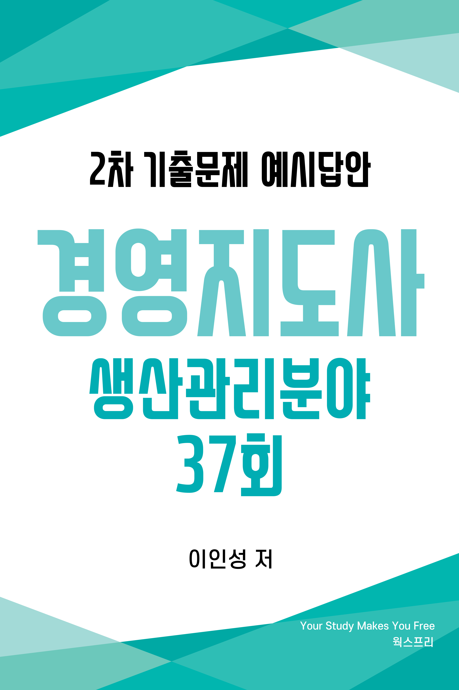
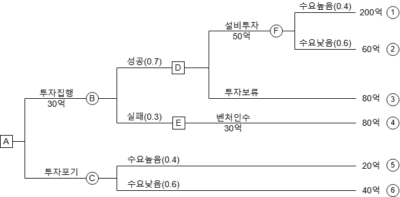
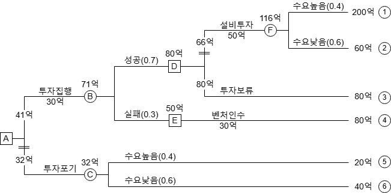
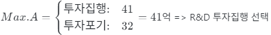
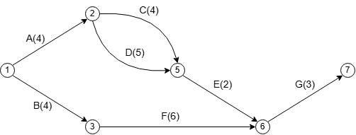
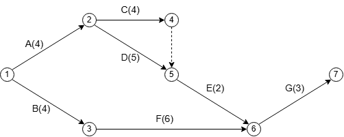
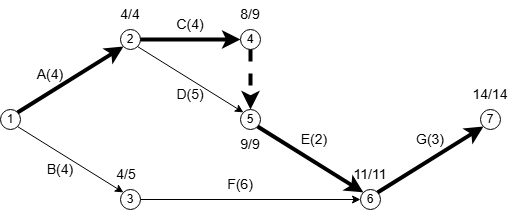
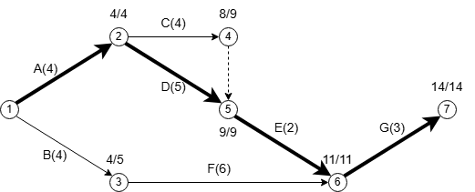
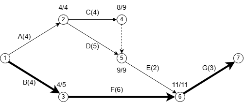
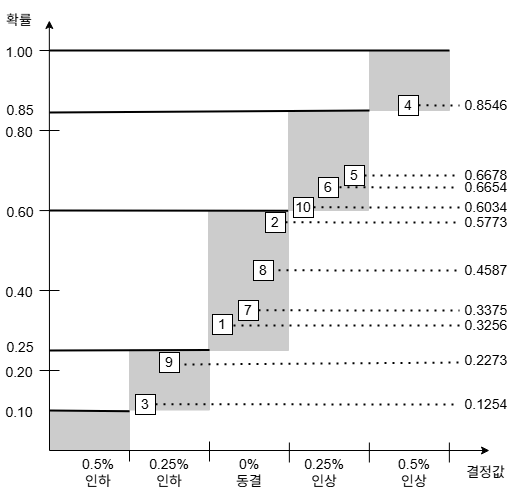

# 저자 소개
<ul>
    <li>경영지도사 생산관리분야</li>
    <li>자동화 장비 제조업 프로세스 개선 내부 컨설팅 경력</li>
    <li>제조업 설계 및 MCT 단순 반복 업무 자동화(RPA) 프로그램 개발
        <a href="https://www.worksfree.com">
        <figure style="float: right"><figcaption style="text-align: center;">RPA Site</figcaption></figure>
        </a>
        <ul>
            <li>어셈블리 BOM 엑셀 저장 자동화 프로그램</li>
            <li>8만 여개 구매품 속성 2주만에 정리하기</li>
            <li>이드로잉스 뷰어 대량 출력 자동화 프로그램</li>
            <li>구글 드라이브 기반 인터넷 정보 자동 업데이트</li>
            <li>자동화(RPA) 프로그램은 우측 QR 또는 아래 URL 참고 <a href="https://www.worksfree.com">https://www.worksfree.com</a></li>
        </ul>
    </li>
    <li>소프트웨어 분야 개발 및 PM 경력</li>
    <li>프로젝트 관리 전문가(PMP from PMI)</li>
    <li>IITP 평가위원, NIPA 평가위원</li>
    <li>OIIA DX/AX 진단 컨설팅 위원</li>
    <li>2025년 예비창업패키지 사업자 선정 및 1단계, 2단계 수행</li>
</ul>

# 교재 소개
- 본 교재는 필자가 경영지도사 2차 수험 생활을 하며 기출문제를 풀고 아래 명시된 수험 교재 학습 및 인터넷 정보를 참조하여 정리한 내용입니다.
  * 생산관리 : 생산운영관리 [법문사]
  * 품질경영 : 품질경영론 [KSAM]
  * 경영과학 : 4차 산업혁명 시대의 EXCEL 경영과학 [박영사]
- 목차는 3 페이지에 제공되며 본문 내의 파랑색으로 보이는 모든 문구는 문서 내부 링크로서 클릭하면 문제, 예시답안, 목차로 이동합니다.
- 예시답안은 설명을 위해 단계별로 내용이 작성되어 불필요하게 긴 예시답안이 있는데 실제 답안 작성시에는 꼭 필요한 경우만 풀이 과정을 단계별로 작성해도 됩니다.
- 예시답안의 내용에 대한 개정 의견이나 시험 관련된 문의 사항은 아래 이메일로 보내주시기 바라며 수험생들의 고득점을 기원합니다.
- 자격시험 합격 후 동차 예시답안 출판에 관심 있는 분은 이메일로 연락 바랍니다.
- <a href="mailto:insung.lee@worksfree.co.kr">이메일 : insung.lee@worksfree.co.kr</a>

# 
 37회 목차 

## [37회 생산관리 목차](#37회-생산관리)
- [[문제1] 입지선정 - 중심모형법, 요인평정법](#37회-생산관리-문제-1)
- [[문제2] 작업일정계획(우선순위규칙)](#37회-생산관리-문제-2)
- [[문제3] 공급사슬 전략](#37회-생산관리-문제-3)
- [[문제4] 생산전략(MTS/MTO)](#37회-생산관리-문제-4)
- [[문제5] 자재소요계획(MRP)](#37회-생산관리-문제-5)
- [[문제6] 재고관리](#37회-생산관리-문제-6)

## [37회 품질경영 목차](#37회-품질경영)
- [[문제1] 제조물책임법](#37회-품질경영-문제-1)
- [[문제2] 표준 및 표준화](#37회-품질경영-문제-2)
- [[문제3] 관리도의 우연원인과 이상원인](#37회-품질경영-문제-3)
- [[문제4] KS Q ISO 9000 : 2015](#37회-품질경영-문제-4)
- [[문제5] 신뢰성](#37회-품질경영-문제-5)
- [[문제6] 다구찌 품질손실함수](#37회-품질경영-문제-6)

## [37회 경영과학 목차](#37회-경영과학)
- [[문제1] 선형계획법](#37회-경영과학-문제-1)
- [[문제2] 의사결정나무(Decision Tree)](#37회-경영과학-문제-2)
- [[문제3] 확정적 모형과 확률적 모형](#37회-경영과학-문제-3)
- [[문제4] 혼합정수계획법](#37회-경영과학-문제-4)
- [[문제5] PERT/CPM](#37회-경영과학-문제-5)
- [[문제6] 몬테칼로 시뮬레이션](#37회-경영과학-문제-6)

# 37회 생산관리 문제

## 37회 생산관리 문제 1
<!-- SRC:생산관리/문제1.md -->
### 【문제 1】 AB전자(주)와 우주전자(주)는 입지선정을 위해 고민 중이다. 다음 물음에 답하시오. (단, 계산은 소수점 둘째자리에서 반올림하여 소수점 첫째자리까지 구한다.) (30점)

(1) AB전자(주)는 최근 자사 생산제품의 판매호조로 인해 공급이 부족한 상태이다. 이러한 공급부족 현상을 해결하기 위해 신규 자재창고를 건설하고자 계획 중이다. 현재 AB전자(주)는 경기도 지역에 네 군데의 공장(1공장, 2공장, 3공장, 4공장)을 운영 중이며, 각 공장의 위치(입지좌표)와 1일 운송량은 다음 표와 같다.
<table style="font-size:11pt; line-height:1.3;">
  <tr><th height=10 class="backslash"> 
공장

위치(입지좌표)
</th><th>1공장</th><th>2공장</th><th>3공장</th><th>4공장</th></tr>
  <!-- <tr><th height=10>위치(입지좌표)\공장</th><th>1공장</th><th>2공장</th><th>3공장</th><th>4공장</th></tr> -->
  <tr><td>X 좌표</td><td>3</td><td>6</td><td>8</td><td>10</td></tr>
  <tr><td>Y 좌표</td><td>5</td><td>4</td><td>10</td><td>4</td></tr>
  <tr><td>1일 운송량 (천개)</td><td>60</td><td>70</td><td>90</td><td>80</td></tr>
</table>
중심모형(center of gravity method)에 의해 신규 자재창고의 입지 좌표를 계산하시오. (20점) 
(2) 우주전자(주)는 제품생산을 위해 신규 공장 건설 부지를 찾고 있다. 해당 부서의 조사에 의하면 경기도 지역에서 세 군데의 후보입지(A, B, C)를 고려 중이다. 다만, 회사는 각 후보입지의 평가에 중요한 요인으로 작용하는 3가지 입지선정기준 목록을 작성하였으며, 각 입지선정기준의 상대적 중요도를 반영한 가중치를 다음 표와 같이 부여하였다.
<table style="font-size:11pt; line-height:1.3;">
  <tr> <th width=350>입지선정기준</th><th width=150>가중치</th> </tr>
  <!-- <tr> <th>입지선정기준</th><th>가중치</th> </tr> -->
  <tr> <td>인력확보의 용이성</td><td>0.3</td> </tr>
  <tr> <td>시장 근접성</td><td>0.5</td> </tr>
  <tr> <td>원자재 확보의 용이성</td><td>0.2</td> </tr>
</table>

입지선정기준에 따른 각 후보입지의 평점은 다음과 같다.
<table style="font-size:11pt; line-height:1.3;">
  <tr> <th class="backslash"> 
후보입지

입지선정기준
</th><th>A</th><th>B</th><th>C</th> </tr>
  <!-- <tr> <th>입지선정기준\후보입지
</th><th>A</th><th>B</th><th>C</th> </tr> -->
  <tr> <td>인력확보 용이성</td><td>85</td><td>70</td><td>65</td> </tr>
  <tr> <td>시장접근성</td><td>65</td><td>75</td><td>70</td> </tr>
  <tr> <td>원자재 확보 용이성</td><td>60</td><td>76</td><td>80</td> </tr>
</table>
요인평점법(factor rating method)에 의해 최적 입지를 결정하시오. (10점)
<!-- /SRC:생산관리/문제1.md -->

<a href="#37회-생산관리-문제-1-예시답안-30점">예시답안 바로가기</a><a href="#37회-생산관리-목차">목차 바로가기</a>

## 37회 생산관리 문제 2
<!-- SRC:생산관리/문제2.md -->
### 【문제 2】한국산업에서는 1대의 기계로 다음 작업을 수행해야 한다. 아래의 표와같이 작업이 주어졌을 경우 다음 물음에 답하시오. (단, 평균납기지연시간은 소수점 둘째자리에서 반올림하여 소수점 첫째자리까지 구한다.) (30점)

(단위: 시간)

<table width=600>
<tr><th width=100>작업</th><th width=35>A</th><th width=35>B</th><th width=35>C</th><th width=35>D</th><th width=35>E</th><th width=35>F</th><th width=35>G</th></tr>
<tr><td>작업소요시간</td><td>4</td><td>3</td><td>5</td><td>2</td><td>1</td><td>6</td><td>7</td></tr>
<tr><td>납기</td><td>10</td><td>8</td><td>7</td><td>12</td><td>4</td><td>14</td><td>11</td></tr>
</table>

(1) 최소납기일(EDD: Earliest Due Date) 규칙을 적용할 경우의 작업 순서를 구하고, 평균납기지연시간을 계산하시오. (10점) 

(2) 현재 시점에서의 긴급률(CR: Critical Ratio)을 계산하여 긴급률 규칙에 따라 작업 순서를 구하고, 이에 따라 작업을 진행할 경우 평균납기지연시간을 계산하시오. (10점) 

(3) 현재 시점에서의 작업당 여유시간(Slack)을 계산하여 최소여유시간 규칙에 따라 작업 순서를 구하고, 이에 따라 작업을 진행할 경우 평균납기지연시간을 계산하시오. (10점)
 
<!-- /SRC:생산관리/문제2.md -->

<a href="#37회-생산관리-문제-2-예시답안-30점">예시답안 바로가기</a><a href="#37회-생산관리-목차">목차 바로가기</a>

## 37회 생산관리 문제 3
<!-- SRC:생산관리/문제3.md -->
### 【문제 3】 공급사슬 전략에서 사용하는 제조업체와 유통업체의 협력 전략에 대하여 다음 물음에 답하시오. (10점)

(1) VMI(Vendor-Managed Inventory)의 개념을 설명하시오. (3점) 

(2) CMI(Co-Managed Inventory)의 개념을 설명하시오. (3점) 

(3) CPFR(Collaborative Planning, Forecasting and Replenishment)의 개념을 설명하시오. (4점) 
<!-- /SRC:생산관리/문제3.md -->

<a href="#37회-생산관리-문제-3-예시답안-10점">예시답안 바로가기</a><a href="#37회-생산관리-목차">목차 바로가기</a>

## 37회 생산관리 문제 4
<!-- SRC:생산관리/문제4.md -->
### 【문제 4】 다음 표는 예측(계획)생산(make-to-stock)과 주문생산(make-to-order)을 비교항목에 따라 작성한 것이다. 각 번호(① ∼ ⑩)에 적합한 내용을 ‘비고’ 항목에서 선택하여 쓰시오. (10점)

<table>
<tr><th width=40>비교항목</th><th width=100>예측(계획)생산 (Make-to-Stock)</th><th width=100>주문생산 (Make-to-Order)</th><th width=140>비고</th></tr>
<!-- <tr><td>제품 특성</td><td>①</td><td>②</td><td><small>생산자가 제품규격을 결정, 구매자가 제품규격을 결정</small></td></tr> -->
<tr><td>제품 특성</td><td>①</td><td>②</td><td>생산자가 제품규격을 결정, 구매자가 제품규격을 결정</td></tr>
<tr><td>제품 다양성</td><td>③</td><td>④</td><td>높음, 낮음</td></tr>
<tr><td>제품 흐름</td><td>⑤</td><td>⑥</td><td>순차적, 불규칙적</td></tr>
<tr><td>생산설비</td><td>⑦</td><td>⑧</td><td>범용설비, 전용설비</td></tr>
<tr><td>작업자의 기술수준</td><td>⑨</td><td>⑩</td><td>높음, 낮음</td></tr>
</table>
<!-- /SRC:생산관리/문제4.md -->

<a href="#37회-생산관리-문제-4-예시답안-10점">예시답안 바로가기</a><a href="#37회-생산관리-목차">목차 바로가기</a>

## 37회 생산관리 문제 5
<!-- SRC:생산관리/문제5.md -->
### 【문제 5】 자재소요계획(MRP: Material Requirements Planning)에서 독립수요와 종속수요의 의미를 설명하고, 자재소요계획의 수립에 필요한 3가지 입력정보를 쓰시오. (10점)
 
<!-- /SRC:생산관리/문제5.md -->

<a href="#37회-생산관리-문제-5-예시답안-10점">예시답안 바로가기</a><a href="#37회-생산관리-목차">목차 바로가기</a>

## 37회 생산관리 문제 6
<!-- SRC:생산관리/문제6.md -->
### 【문제 6】 재고의 목적(기능)에 따른 재고의 유형(종류)에는 불확실성에 대처하여 품절을 방지하기 위한 안전재고 등이 있다. 3가지 재고 유형을 나열하고 설명하시오. (단, 안전재고는 제외한다.) (10점)
 
<!-- /SRC:생산관리/문제6.md -->

<a href="#37회-생산관리-문제-6-예시답안-10점">예시답안 바로가기</a><a href="#37회-생산관리-목차">목차 바로가기</a>

# 37회 생산관리 예시답안

## 37회 생산관리 문제 1 예시답안 (30점)

<!-- SRC:생산관리/예시답안1.md -->
### 【문제 1 - (1)】 중심모형(Center of Gravity Method)에 의한 신규 자재창고 입지 좌표 계산 (20점)

<table>
  <tr><th class="backslash" width=300> 
공장

위치(입지좌표)
</th><th width=55>1공장</th><th width=55>2공장</th><th width=55>3공장</th><th width=55>4공장</th></tr>
  <tr><td>X 좌표</td><td>3</td><td>6</td><td>8</td><td>10</td></tr>
  <tr><td>Y 좌표</td><td>5</td><td>4</td><td>10</td><td>4</td></tr>
  <tr><td>1일 운송량 (천개)</td><td>60</td><td>70</td><td>90</td><td>80</td></tr>
</table>

<!--
\Large\frac 보다는 \cfrac 이 분수 크기를 조절하는 더 간단한 방법
-->

* 입력 데이터
  * $1$공장: $(X_1, Y_1) = (3, 5)$, 운송량 $60$천개
  * $2$공장: $(X_2, Y_2) = (6, 4)$, 운송량 $70$천개
  * $3$공장: $(X_3, Y_3) = (8, 10)$, 운송량 $90$천개
  * $4$공장: $(X_4, Y_4) = (10, 4)$, 운송량 $80$천개

* $X$ 좌표 계산 : $\cfrac{(3 \times 60) + (6 \times 70) + (8 \times 90) + (10 \times 80)}{60 + 70 + 90 + 80} =$
$\cfrac{180 + 420 + 720 + 800}{300} = \cfrac{2,120}{300} = 7.067 = 7.1$

  <!-- 
  수식 얼라인은 PDF에서 지원되지 않아서 사용하지 말것. 2024.12.18
  $$\begin{aligned}x^2+4x+5y&=1\\x&=2y+7\end{aligned}​$$ -->

* $Y$ 좌표 계산 : $\cfrac{(5 \times 60) + (4 \times 70) + (10 \times 90) + (4 \times 80)}{300} =$
$\cfrac{300 + 280 + 900 + 320}{300} = \cfrac{1,800}{300} = 6.0$

* **신규 자재창고 입지 좌표: (7.1, 6.0)**

<!-- 

학습 자료

<table><tr><td width="20%">중심모형</td><td class="custome-td">

* $X$ 좌표 $= \cfrac{\sum(X_i\times운송량)}{\sum운송량}$
* $Y$ 좌표 $= \cfrac{\sum(Y_i\times운송량)}{\sum운송량}$
* $1공장: (X_1, Y_1) = (3, 5)$
* $2공장: (X_2, Y_2) = (6, 4)$
* $3공장: (X_3, Y_3) = (8, 10)$
* $4공장: (X_4, Y_4) = (10, 4)$
* 운송량 합계: $60+70+90+80 = 300$
</td></tr>
<tr><td>요인평정법</td><td class="custome-td">

* ${\sum(평점\times가중치)}$
</td></tr>
</table>

 -->

### 【문제 1 - (2)】 요인평점법(Factor Rating Method)에 의한 최적입지 결정 (10점)

<table>
  <tr> <th width=350>입지선정기준</th><th width=150>가중치</th> </tr>
  <!-- <tr> <th>입지선정기준</th><th>가중치</th> </tr> -->
  <tr> <td>인력확보의 용이성</td><td>0.3</td> </tr>
  <tr> <td>시장 근접성</td><td>0.5</td> </tr>
  <tr> <td>원자재 확보의 용이성</td><td>0.2</td> </tr>
</table>

 

<table>
  <tr> <th class="backslash" width=270> 
후보입지

입지선정기준
</th><th width=150>입지별 가중치</th><th width=60>A</th><th width=60>B</th><th width=60>C</th> </tr>
  <tr> <td>인력확보 용이성</td><td>0.3</td><td>85</td><td>70</td><td>65</td> </tr>
  <tr> <td>시장접근성</td><td>0.5</td><td>65</td><td>75</td><td>70</td> </tr>
  <tr> <td>원자재 확보 용이성</td><td>0.2</td><td>60</td><td>76</td><td>80</td> </tr>
</table>

* 입지선정기준 및 가중치
* $A: (85\times0.3) + (65\times0.5) + (60\times0.2) = 25.5 + 32.5 + 12.0 = 70.0$
* $B: (70\times0.3) + (75\times0.5) + (76\times0.2) = 21.0 + 37.5 + 15.2 = 73.7$
* $C: (65\times0.3) + (70\times0.5) + (80\times0.2) = 19.5 + 35.0 + 16.0 = 70.5$

* **최적입지: B 후보지 (73.7점)**
<!-- /SRC:생산관리/예시답안1.md -->

<a href="#37회-생산관리-문제-1">문제 바로가기</a><a href="#37회-생산관리-목차">목차 바로가기</a>

## 37회 생산관리 문제 2 예시답안 (30점)

<!-- SRC:생산관리/예시답안2.md -->
### 【문제 2 - (1)】 최소납기일(EDD) 규칙 (10점)
* 납기일이 가장 빠른 작업부터 작업을 수행합니다.
<table>
<tr><th>순서</th><th>작업</th><th>작업소요시간</th><th>완료시간</th><th>납기</th><th>지연시간</th></tr>
<tr><td>1</td><td>E</td><td>1</td><td>1</td><td>4</td><td>0</td></tr>
<tr><td>2</td><td>C</td><td>5</td><td>6</td><td>7</td><td>0</td></tr>
<tr><td>3</td><td>B</td><td>3</td><td>9</td><td>8</td><td>1</td></tr>
<tr><td>4</td><td>A</td><td>4</td><td>13</td><td>10</td><td>3</td></tr>
<tr><td>5</td><td>G</td><td>7</td><td>20</td><td>11</td><td>9</td></tr>
<tr><td>6</td><td>D</td><td>2</td><td>22</td><td>12</td><td>10</td></tr>
<tr><td>7</td><td>F</td><td>6</td><td>28</td><td>14</td><td>14</td></tr>
</table>

* 최소납기일(EDD) 기준 작업순서: E → C → B → A → G → D → F

* 평균납기지연시간 $= \cfrac{총 지연시간}{작업 개수} = \cfrac{0+0+1+3+9+10+14}{7} = \cfrac{37}{7}= 5.28 = 5.3$

### 【문제 2 - (2)】 긴급률(CR) 규칙 (10점)
* $CR$ 계산 공식: 긴급률$(CR) = \cfrac{잔여 시간(납기 - 현재까지 작업 완료시간)}{작업 소요시간}$

<table>
<tr><th>작업</th><th>현재까지 완료시간</th><th>잔여시간 (납기 - 현재 완료시간)</th><th>작업소요시간</th><th>CR</th></tr>
<tr><td>A</td><td>0</td><td>10</td><td>4</td><td>2.5</td></tr>
<tr><td>B</td><td>0</td><td>8</td><td>3</td><td>2.7</td></tr>
<tr><td>C</td><td>0</td><td>7</td><td>5</td><td>1.4</td></tr>
<tr><td>D</td><td>0</td><td>12</td><td>2</td><td>6.0</td></tr>
<tr><td>E</td><td>0</td><td>4</td><td>1</td><td>4.0</td></tr>
<tr><td>F</td><td>0</td><td>14</td><td>6</td><td>2.3</td></tr>
<tr><td>G</td><td>0</td><td>11</td><td>7</td><td>1.6</td></tr>
</table>

* 긴급률이 작은 순서대로 재배치 후 지연시간

<table>
<tr><th>순서</th><th>긴급률(CR)<th>작업</th><th>작업소요시간</th><th>완료시간</th><th>납기</th><th>지연시간</th></tr>
<tr><td>1</td><td>1.4</td><td>C</td><td>5</td><td>5</td><td>7</td><td>0</td></tr>
<tr><td>2</td><td>1.6</td><td>G</td><td>7</td><td>12</td><td>11</td><td>1</td></tr>
<tr><td>3</td><td>2.3</td><td>F</td><td>6</td><td>18</td><td>14</td><td>4</td></tr>
<tr><td>4</td><td>2.5</td><td>A</td><td>4</td><td>22</td><td>10</td><td>12</td></tr>
<tr><td>5</td><td>2.5</td><td>B</td><td>3</td><td>25</td><td>8</td><td>17</td></tr>
<tr><td>6</td><td>4.0</td><td>E</td><td>1</td><td>26</td><td>4</td><td>22</td></tr>
<tr><td>7</td><td>4.0</td><td>D</td><td>2</td><td>28</td><td>12</td><td>16</td></tr>
</table>

* 긴급률(CR) 기준 작업순서: C → G → F → A → B → E → D

* 평균납기지연시간 $= \cfrac{0+1+4+12+17+22+16}{7} = \cfrac{72}{7} = 10.28 = 10.3$

### 【문제 2 - (3)】 최소여유시간(Slack) 규칙 (10점)

Slack이 작은 순서대로 작업을 수행합니다. Slack 계산 공식은 다음과 같습니다:

Slack$=잔여시간(납기 - 현재까지 작업 완료시간)−작업 소요시간$

<table>
<tr><th>작업</th><th>작업소요시간</th><th>납기</th><th>Slack</th></tr>
<tr><td>A</td><td>4</td><td>10</td><td>6</td></tr>
<tr><td>B</td><td>3</td><td>8</td><td>5</td></tr>
<tr><td>C</td><td>5</td><td>7</td><td>2</td></tr>
<tr><td>D</td><td>2</td><td>12</td><td>10</td></tr>
<tr><td>E</td><td>1</td><td>4</td><td>3</td></tr>
<tr><td>F</td><td>6</td><td>14</td><td>8</td></tr>
<tr><td>G</td><td>7</td><td>11</td><td>4</td></tr>
</table>

* Slack이 작은 순서대로 정렬
<table>
<tr><th>순서</th><th>Slack</th><th>작업</th><th>작업소요시간</th><th>완료시간</th><th>납기</th><th>지연시간</th></tr>
<tr><td>1</td><td>2</td><td>C</td><td>5</td><td>5</td><td>7</td><td>0</td></tr>
<tr><td>2</td><td>3</td><td>E</td><td>1</td><td>6</td><td>4</td><td>2</td></tr>
<tr><td>3</td><td>4</td><td>G</td><td>7</td><td>13</td><td>11</td><td>2</td></tr>
<tr><td>4</td><td>5</td><td>B</td><td>3</td><td>16</td><td>8</td><td>8</td></tr>
<tr><td>5</td><td>6</td><td>A</td><td>4</td><td>20</td><td>10</td><td>10</td></tr>
<tr><td>6</td><td>8</td><td>F</td><td>6</td><td>26</td><td>14</td><td>12</td></tr>
<tr><td>7</td><td>10</td><td>D</td><td>2</td><td>28</td><td>12</td><td>16</td></tr>
</table>

* 최소여유시간 기준 작업 순서: C → E → G → B → A → F → D
* 평균납기지연시간 $= \cfrac{총 지연시간}{작업 개수} = \cfrac{0+2+2+8+10+12+16}{7} = \cfrac{50}{7} = 7.14 = 7.1$
<!-- /SRC:생산관리/예시답안2.md -->

<a href="#37회-생산관리-문제-2">문제 바로가기</a><a href="#37회-생산관리-목차">목차 바로가기</a>

## 37회 생산관리 문제 3 예시답안 (10점)

<!-- SRC:생산관리/예시답안3.md -->
### 【문제 3 - (1)】 VMI 개념 (3점)
제조업체가 유통업체의 재고 수준을 직접 모니터링하고 관리하는 공급사슬 전략입니다.

### 【문제 3 - (2)】 CMI 개념 (3점)
제조업체와 유통업체가 공동으로 재고를 계획하고 관리하는 공급사슬 전략입니다.

### 【문제 3 - (3)】 CPFR 개념 (4점)
제조업체와 유통업체가 함께 수요 예측, 계획 수립, 재고 보충 과정을 공동으로 수행하는 공급사슬 전략입니다.
<!-- /SRC:생산관리/예시답안3.md -->

<a href="#37회-생산관리-문제-3">문제 바로가기</a><a href="#37회-생산관리-목차">목차 바로가기</a>

## 37회 생산관리 문제 4 예시답안 (10점)

<!-- SRC:생산관리/예시답안4.md -->
### 【문제 4】 예측생산과 주문생산 비교 (10점)

<table>
<tr><th>비교항목</th><th>예측(계획)생산 (Make-to-Stock)</th><th>주문생산 (Make-to-Order)</th></tr>
<tr><td>제품 특성</td><td class="custome-td">① 생산자가 제품규격을 결정</td><td class="custome-td">② 구매자가 제품규격을 결정</td></tr>
<tr><td>제품 다양성</td><td class="custome-td">③ 낮음</td><td class="custome-td">④ 높음</td></tr>
<tr><td>제품 흐름</td><td class="custome-td">⑤ 순차적</td><td class="custome-td">⑥ 불규칙적</td></tr>
<tr><td>생산설비</td><td class="custome-td">⑦ 전용설비</td><td class="custome-td">⑧ 범용설비</td></tr>
<tr><td>작업자의 기술수준</td><td class="custome-td">⑨ 낮음</td><td class="custome-td">⑩ 높음</td></tr>
</table>
<!-- /SRC:생산관리/예시답안4.md -->

<a href="#37회-생산관리-문제-4">문제 바로가기</a><a href="#37회-생산관리-목차">목차 바로가기</a>

## 37회 생산관리 문제 5 예시답안 (10점)

<!-- SRC:생산관리/예시답안5.md -->
### 【문제 5】 자재소요계획 (10점)

* 독립수요: 최종 완성품으로 다른 자재소요계획에 종속되지 않는 수요
* 종속수요: 최종 완성품의 부품 또는 부품의 하위 부품으로 독립수요 항목의 자재소요계획에 따라 결정되는 수요
* 자재소요계획의 수립에 필요한 3가지 입력 정보
  1. 주생산계획
  2. 자재명세서
  3. 재고기록파일
<!-- /SRC:생산관리/예시답안5.md -->

<a href="#37회-생산관리-문제-5">문제 바로가기</a><a href="#37회-생산관리-목차">목차 바로가기</a>

## 37회 생산관리 문제 6 예시답안 (10점)

<!-- SRC:생산관리/예시답안6.md -->
### 【문제 6】 재고의 3가지 유형 (10점)

1. 주기 재고 : 경제적 구매량(생산량)을 확보하려고 당장 필요한 것보다 많은 양을 보유하는 재고
2. 예비 재고 : 특정 계절이나 명절 특수에 수요가 집중되는 제품을 미리 생산하여 보유하는 재고
3. 수송 중 재고 : 대금을 지불하였으나 아직 창고에 도착하지 않은 수송 중에 있는 재고
<!-- /SRC:생산관리/예시답안6.md -->

<a href="#37회-생산관리-문제-6">문제 바로가기</a><a href="#37회-생산관리-목차">목차 바로가기</a>

# 37회 품질경영 문제

## 37회 품질경영 문제 1
<!-- SRC:품질경영/문제1.md -->
### 【문제 1】 우리나라 제조물책임법과 관련하여 다음 물음에 답하시오. (30점)

(1) 제조물책임법의 제정 목적에 대하여 설명하시오. (10점) 
(2) 결함의 종류 중에서 ‘표시상의 결함’에 대하여 설명하시오. (10점) 
(3) 손해배상책임을 지는 자의 면책사유 4가지를 기술하시오. (10점) 
<!-- /SRC:품질경영/문제1.md -->

<a href="#37회-품질경영-문제-1-예시답안-30점">예시답안 바로가기</a><a href="#37회-품질경영-목차">목차 바로가기</a>

## 37회 품질경영 문제 2
<!-- SRC:품질경영/문제2.md -->
### 【문제 2】 표준화와 관련하여 다음 물음에 답하시오. (30점)
(1) 표준과 표준화의 개념을 각각 설명하고, 표준의 특성 7가지를 쓰시오. (10점) 
(2) 표준의 역할(기능)을 5가지만 쓰시오. (10점) 
(3) 표준화의 목적과 원리를 각각 5가지만 쓰시오. (10점) 
<!-- /SRC:품질경영/문제2.md -->

<a href="#37회-품질경영-문제-2-예시답안-30점">예시답안 바로가기</a><a href="#37회-품질경영-목차">목차 바로가기</a>

## 37회 품질경영 문제 3
<!-- SRC:품질경영/문제3.md -->
### 【문제 3】 관리도(control chart)란 품질변동에 영향을 미치는 원인을 우연원인(chance cause)과 이상원인(assignable cause)으로 구분함으로써 생산공정이 관리상태(under control)에 있는지의 여부를 확인할 수 있도록 작성하는 그래프를 말한다. 다음 물음에 답하시오. (10점)  (10점)

(1) 우연원인(chance cause)에 대하여 설명하시오. (5점) 

(2) 이상원인(assignable cause)에 대하여 설명하시오. (5점) 
<!-- /SRC:품질경영/문제3.md -->

<a href="#37회-품질경영-문제-3-예시답안-10점">예시답안 바로가기</a><a href="#37회-품질경영-목차">목차 바로가기</a>

## 37회 품질경영 문제 4
<!-- SRC:품질경영/문제4.md -->
### 【문제 4】 KS Q ISO 9000 : 2015와 관련하여 다음 물음에 답하시오. (10점)

(1) 위 한국산업표준에서 제시된 품질경영 7대 원칙을 쓰시오. (7점)

(2) 다음 용어에 대한 정의를 기술하시오. (3점)

1. 효율성(efficiency)
2. 효과성(effectiveness)
3. 시정조치(corrective action)
<!-- /SRC:품질경영/문제4.md -->

<a href="#37회-품질경영-문제-4-예시답안-10점">예시답안 바로가기</a><a href="#37회-품질경영-목차">목차 바로가기</a>

## 37회 품질경영 문제 5
<!-- SRC:품질경영/문제5.md -->
### 【문제 5】 신뢰성의 설계기법에는 고장예방 설계기법과 신뢰성 특유의 설계기법이있다. 신뢰성 특유의 설계기법 5가지를 제시하고 각각 설명하시오. (10점)
<!-- /SRC:품질경영/문제5.md -->

<a href="#37회-품질경영-문제-5-예시답안-10점">예시답안 바로가기</a><a href="#37회-품질경영-목차">목차 바로가기</a>

## 37회 품질경영 문제 6
<!-- SRC:품질경영/문제6.md -->
### 【문제 6】 다구찌의 품질손실함수에 관련하여 다음 물음에 답하시오. (10점)

(1) 품질손실함수(QLF: Quality Loss Function)의 개념을 설명하시오. (4점)

(2) 품질손실함수의 유형 3가지를 제시하고 각각 설명하시오. (6점)
<!-- /SRC:품질경영/문제6.md -->

<a href="#37회-품질경영-문제-6-예시답안-10점">예시답안 바로가기</a><a href="#37회-품질경영-목차">목차 바로가기</a>

# 37회 품질경영 예시답안

## 37회 품질경영 문제 1 예시답안 (30점)

<!-- SRC:품질경영/예시답안1.md -->
### 【문제 1 - (1)】 제조물책임법의 제정 목적 (10점)

* 제품의 결함으로 인해 소비자 또는 제 3자의 신체나 재산에 손해가 발생한 경우, 그 제조물의 제조, 판매 등에 관여한 자가 부담하여야 하는 손해배상 책임을 규정함으로써 소비자 보호 강화, 제조업자의 안전 의식 고취, 제조물의 안전성 확보, 피해 구제의 공정성 확보 등이 목적입니다.

### 【문제 1 - (2)】 결함의 종류 중 ‘표시상의 결함’ (10점)
* 제조업자가 합리적인 설명ㆍ지시ㆍ경고 또는 그 밖의 표시를 하였더라면 해당 제조물에 의하여 발생할 수 있는 피해나 위험을 줄이거나 피할 수 있었음에도 이를 하지 아니한 경우를 말합니다.
* 사용설명서에 설명이 부족하거나 안전주의 사항을 표시하지 않았거나 설명에 오류가 있는 등의 경우가 해당됩니다.

  
### 【문제 1 - (3)】 손해배상책임을 지는 자의 면책사유 4가지 (10점)
* 제조업자가 해당 제조물을 공급하지 아니하였다는 사실
* 제조업자가 해당 제조물을 공급한 당시의 과학ㆍ기술 수준으로는 결함의 존재를 발견할 수 없었다는 사실
* 제조물의 결함이 제조업자가 해당 제조물을 공급한 당시의 법령에서 정하는 기준을 준수함으로써 발생하였다는 사실
* 원재료나 부품의 경우에는 그 원재료나 부품을 사용한 제조물 제조업자의 설계 또는 제작에 관한 지시로 인하여 결함이 발생하였다는 사실
<!-- /SRC:품질경영/예시답안1.md -->

<a href="#37회-품질경영-문제-1">문제 바로가기</a><a href="#37회-품질경영-목차">목차 바로가기</a>

## 37회 품질경영 문제 2 예시답안 (30점)

<!-- SRC:품질경영/예시답안2.md -->
<!-- 

학습 자료

<table><tr> <th>구분</th><th>설명</th> </tr>
<tr> <td><strong>표준의 특성</strong></td><td>표준 자체가 지녀야 하는 속성(공정성, 명확성, 일관성 등).</td> </tr>
<tr> <td><strong>표준의 역할</strong></td> <td>표준이 사회와 산업에 제공하는 기능(상호운용성, 품질보장 등).</td> </tr>
<tr> <td><strong>표준화의 목적</strong></td><td>표준화를 통해 이루고자 하는 목표(효율성 증대, 시장 경쟁력 강화 등).</td> </tr>
<tr> <td><strong>표준화의 원리</strong></td><td>표준화 과정에서 따라야 할 철학과 방법론(단순화, 합의성, 객관성 등).</td> </tr>
</table>

 -->

### 【문제 2 - (1)】 표준과 표준화의 개념, 표준의 특성 7가지 (10점)

* 표준(Standard)의 개념: 효율성, 편의성, 안정성을 높이기 위한 구조, 치수 등에 대한 공동체의 약속

* 표준화(Standardization)의 개념: 원재료, 제품, 설비 등에서 부터 경영의 방침, 절차에 이르기까지 각 용도와 목적에 맞게 바람직한 표준을 정하고, 이 표준에 따라 조직적인 통일을 도모하는 것

* 표준의 특성 7가지

1. 합의성, 2. 공개성, 3. 일관성/통일성, 4. 호환성, 5. 경제성, 6. 보편성/적용성, 7. 동태성

<!-- 

학습 자료

<table><tr><td class="custome-td">
1. 합의성(Consensus): 다양한 이해관계자들의 참여와 합의를 통해 제정되며, 모든 관련자의 의견을 반영합니다.
2. 공개성(Openness): 표준의 제정 과정과 내용이 투명하게 공개되어 누구나 접근 가능합니다.
3. 일관성/통일성(Coherence/Uniformity): 관련 표준들과 모순되지 않고 일관된 체계를 유지하며, 공통된 기준을 제공합니다.
4. 호환성(Compatibility): 서로 다른 시스템이나 제품 간의 상호 연결 및 운용이 가능하도록 합니다.
5. 경제성(Economic Efficiency): 중복 투자 방지와 비용 절감, 생산성 향상에 기여합니다.
6. 보편성/적용성(Universality): 특정 지역이나 집단에 국한되지 않고 광범위한 영역에서 적용 가능합니다.
7. 동태성(Dynamism): 기술 발전과 환경 변화에 따라 지속적으로 개정되고 발전합니다.
</td></tr></table>

 -->

### 【문제 2 - (2)】  표준의 역할(기능) 5가지 (10점)
1. 부품의 호환성 증가
2. 종업원의 교육, 훈련 용이
3. 생산 능률의 증진과 생산 원가 절감
4. 품질의 향상
5. 인력과 자재의 절약

<!-- 

학습 자료

<table><tr><td class="custome-td">
1. 부품의 호환성 증가: 표준화는 서로 다른 부품이나 시스템 간에 연결되고 함께 작동할 수 있도록 공통의 규격과 인터페이스를 설정하는 역할을 합니다. 이 기능 덕분에 다양한 제조사의 부품을 조합하여 사용하거나 교체하는 것이 가능해집니다.
2. 종업원의 교육, 훈련 용이: 표준화된 작업 지침, 매뉴얼, 절차 등을 제공함으로써 새로운 종업원이 업무를 배우고 숙달하는 과정을 체계적이고 효율적으로 만드는 기능을 수행합니다. 표준화된 내용을 바탕으로 교육하면 일관된 방식으로 지식을 전달할 수 있어 교육 및 훈련에 소요되는 시간과 비용을 줄일 수 있습니다.
3. 생산 능률의 증진과 생산 원가 절감: 표준화는 효율적인 생산 공정, 표준 부품 사용, 최적의 작업 방법 등을 정의하는 기능을 수행합니다. 이러한 기능은 생산 과정을 간소화하고 불필요한 요소를 제거하여 생산 능률을 높이며, 대량 생산을 용이하게 하고 불량률을 감소시켜 생산 원가를 절감하는 역할을 합니다.
4. 품질의 향상과 균일성의 유지: 표준화는 제품, 서비스, 또는 공정에 대한 명확한 사양과 기준을 설정하는 역할을 합니다. 이러한 역할 덕분에 제품 간 편차가 줄어들고 일관된 품질을 유지할 수 있게 되며, 이는 자연스럽게 전체적인 품질 향상으로 이어집니다.
5. 인력과 자재의 절약: 표준화된 절차와 자재 목록을 사용함으로써 작업의 복잡성을 줄이고 필요한 자원을 정확하게 파악하게 하는 기능을 합니다. 이는 작업 오류를 줄이고 자재 낭비를 막으며, 필요한 인력 규모를 효율적으로 관리하게 하여 결과적으로 인력과 자재를 절약하는 역할을 합니다.
6. 작업 능률의 향상: 표준화는 각 작업 단계와 방법을 명확하게 정의하여 작업자가 무엇을 어떻게 해야 하는지 혼란 없이 알 수 있도록 하는 역할을 합니다. 이는 작업 흐름을 원활하게 하고 불필요한 움직임이나 판단 과정을 줄여 개별 작업자의 능률은 물론 전체적인 작업 효율성을 향상시키는 기능을 합니다. 
</td></tr></table>

 -->

### 【문제 2 - (3)】 표준화의 목적 5가지와 원리 5가지 (10점)
* 표준화의 목적
1. 상호 이해 증진
2. 안전성 확보 및 생명의 보호
3. 소비자 편익 증진
4. 원가 절감 및 경제성 향상
5. 무역 장벽의 제거

<!-- 

학습 자료

<table>
<tr><td class="custome-td">
1. 상호 이해 증진: 표준화는 용어, 기호, 단위, 절차 등에 대한 공통의 약속을 만듦으로써 사람들 간의 의사소통 오류를 줄이고 오해 없이 정보를 주고받을 수 있도록 돕습니다. 이는 기술, 산업, 행정 등 모든 분야에서 효율적인 협력과 소통을 가능하게 합니다.
2. 안전성 확보 및 생명의 보호: 제품이나 서비스가 갖추어야 할 최소한의 안전 기준을 정함으로써 사용자의 위험을 줄이고 생명과 건강을 보호합니다. 예를 들어, 전기 제품의 안전 규격이나 식품의 위생 기준 등이 이에 해당됩니다.
3. 소비자 편익 증진: 표준화된 제품은 품질이 균일하고 호환성이 높아 소비자가 안심하고 제품을 선택하고 사용할 수 있게 합니다. 또한, 제품 정보나 사용 방법 등이 표준화되어 있으면 소비자가 더욱 쉽게 이해하고 활용할 수 있어 편의성이 높아집니다.
4. 원가 절감 및 경제성 향상: 생산 과정이나 부품 등을 표준화하면 대량 생산이 용이해지고 재고 관리가 효율적이게 됩니다. 또한, 규격화된 부품을 사용하면 유지 보수 비용을 줄일 수 있는 등 기업의 생산 원가를 절감하고 전반적인 경제적 효율성을 높이는 효과가 있습니다.
5. 무역 장벽의 제거: 국가마다 다른 기술 규격이나 표준은 국제 무역의 장벽이 될 수 있습니다. 국제 표준을 따르거나 국가 표준 간 상호 인정을 통해 이러한 장벽을 없애면 국가 간의 상품과 서비스 이동이 자유로워져 무역이 활성화되고 세계 경제 발전에 기여하게 됩니다. 
</td></tr></table>

 -->

* 표준화의 원리 5가지
1. 단순화의 원리
2. 관련자 합의의 원리
3. 다수이익의 원리
4. 고정의 원리
5. 개정의 원리 (진보의 원리)

<!-- 

학습 자료

<table><tr><td class="custome-td">
1. 단순화: 복잡성을 줄이고 단순하게 유지함 
1. 단순화의 원리 - 불필요한 다양성을 줄여 종료, 형태, 치수 등을 단순화합니다.
2. 관련자 합의의 원리 - 생산자, 소비자, 전문가 등 관련 이해관계자들의 폭넓은 합의를 바탕으로 표준을 제정합니다.
3. 다수이익의 원리 - 특정 집단의 이익을 대표하는 표준이 아닌 다수가 이익을 얻을 수 있는 표준을 제정합니다.
4. 고정의 원리 - 표준화의 효과를 얻기 위해서는 일정기간 표준을 고정시킬 필요가 있습니다.
5. 개정의 원리 (진보의 원리) - 기술은 계속해서 발전하므로 변화하는 환경과 시장 요구에 유연하게 대응할 수 있어야 합니다. 단, 위 고정의 원리를 고려하여 표준화의 대상과 시기, 재검토, 개정에 신중하여야 합니다.
6. 객관성의 원리 - 제품의 성능이나 기타 특성을 규정할 때, 주어진 물품이 시방에 적합한가를 결정하기 위한 시험방법에 관한 사항이 규격안에 있어야 한다. - 표준은 객관적으로 계측(계량)한 값으로 표기하며, 시험방법이나 기구 등을 객관적으로 명기한다.
7. 보편성의 원리 - 국가 규격의 법적 강제의 필요성에 대해서는 그 규격의 성질, 그 사회의 산업화수준, 시행되고 있는 법률과 정세 등을 고려하여 신중히 결정되어야 한다. 통상 안전이나 환경오염방지, 계량표준, 교통규칙 등은 강제적용대상이 되고 있다.
 
</td></tr></table>

 -->
<!-- /SRC:품질경영/예시답안2.md -->

<a href="#37회-품질경영-문제-2">문제 바로가기</a><a href="#37회-품질경영-목차">목차 바로가기</a>

## 37회 품질경영 문제 3 예시답안 (10점)

<!-- SRC:품질경영/예시답안3.md -->

### 【문제 3 - (1)】 우연원인(Chance cause) (5점)

* 우연원인은 공정에서 자연적으로 발생하는 예측 불가능한 변동입니다. 공정의 정상적인 변동 범위 내에서 나타나며, 개별적인 원인을 특정하기 어렵습니다. 예를 들어, 식별하기 어려운 정도의 원/부자재나 생산설비의 특성 차이, 작업자의 숙련도 차이, 작업표준의 허용 범위 내에 있는 작업조건 및 작업환경의 변화 등이 해당됩니다. 우연원인으로 인한 변동은 통계적 관리 한계 내에서 나타나며, 공정 자체에는 문제가 없는 정상적인 현상입니다.

### 【문제 3 - (2)】 이상원인(Assignable cause) (5점)

* 이상원인은 공정에 영향을 미치는 특별한 원인입니다. 공정의 변동 범위를 벗어나 예측 불가능한 결과를 초래하며, 구체적인 원인 규명이 가능합니다. 예를 들어, 기계 고장, 작업자의 부주의, 불량 원자재 사용 등이 있습니다. 이상원인으로 인한 변동은 통계적 관리 한계를 벗어나며, 공정 개선이 필요한 비정상적인 현상입니다. 관리도는 이상원인을 식별하고 제거하는 데 사용됩니다.

<!-- /SRC:품질경영/예시답안3.md -->

<a href="#37회-품질경영-문제-3">문제 바로가기</a><a href="#37회-품질경영-목차">목차 바로가기</a>

## 37회 품질경영 문제 4 예시답안 (10점)

<!-- SRC:품질경영/예시답안4.md -->
### 【문제 4 - (1)】 KS Q ISO 9000: 2015 품질경영 7대 원칙 (7점)
1. 고객중심, 2. 리더십, 3. 구성원 참여, 4. 프로세스 접근
5. 개선, 6. 증거기반 의사결정, 7. 관계관리

<!-- 

학습 자료

<table><tr><td class="custome-td">
1. 고객중심: 고객 요구사항을 이해하고 충족시키기 위해 노력해야 합니다. 
2. 리더십: 조직의 목표와 방향을 제시하고, 직원들이 품질 목표 달성에 참여하도록 유도해야 합니다. 
3. 구성원 참여: 모든 직원이 품질 개선에 참여하고 기여하도록 해야 합니다. 
4. 프로세스 접근: 활동을 상호 연관된 프로세스로 관리하여 결과를 효율적으로 달성해야 합니다. 
5. 개선: 지속적인 개선을 통해 품질 시스템의 효과성을 높여야 합니다. 
6. 증거기반 의사결정: 객관적인 데이터와 정보에 기반하여 의사결정을 해야 합니다. 
7. 관계관리: 공급업체, 파트너 등 이해관계자와의 관계를 관리하여 상호 이익을 추구해야 합니다. 
</td></tr></table>

 -->

### 【문제 4 - (2)】 용어 정의 (3점)
* 효율성(efficiency): 투입된 자원(인력, 시간, 비용 등)에 대한 산출 결과의 비율입니다. 주어진 자원으로 얼마나 많은 결과를 얻을 수 있는가를 나타냅니다. 즉, 최소한의 자원으로 최대의 결과를 얻는 능력을 말합니다
* 효과성(effectiveness): 계획된 활동을 수행하고 계획된 결과를 달성하는 정도를 의미합니다. 즉, 원하는 결과를 얼마나 성공적으로 달성했는지를 나타내는 정도입니다.
* 시정조치(corrective action): 부적합 사항의 원인을 제거하기 위해 취하는 즉각적인 시정 활동을 말합니다. 문제의 근본 원인을 해결하여 재발을 방지하는 것을 목표로 합니다.
<!-- /SRC:품질경영/예시답안4.md -->

<a href="#37회-품질경영-문제-4">문제 바로가기</a><a href="#37회-품질경영-목차">목차 바로가기</a>

## 37회 품질경영 문제 5 예시답안 (10점)

<!-- SRC:품질경영/예시답안5.md -->
### 【문제 5】 신뢰성 특유의 설계 기법 5가지 (10점)
1. 여유(용장성) 설계 (Redundancy Design): 주요 구성 요소를 중복시켜 하나의 부품이 고장 나더라도 다른 부품이 대신 작동할 수 있도록 합니다.
2. 신뢰도 배분 (Reliability Allocation): 시스템의 신뢰도를 달성하기 위해 각 구성 요소에 신뢰도를 표현하고, 이를 통해 전체 시스템의 신뢰성을 평가하고 개선합니다.
3. 무오류 설계 (Fool Proof): 사용자가 잘못된 방법으로 시스템을 사용하지 못하도록 설계하여 사용 오류로 인한 문제 발생 가능성을 줄이고, 직관적인 사용성을 제공합니다.
4. 고장안전 설계 (Fail Safe): 시스템의 일부가 고장나더라도 전체 시스템이 위험 상태로 가지 않도록 설계합니다.
5. 결함 허용 설계 (Fault Tolerant Design): 시스템 내 일부 구성 요소가 고장 나더라도 전체 시스템이 정상적으로 작동할 수 있도록 설계합니다. 고장 감지 및 자동 복구 기능을 포함합니다.

<!-- 

학습 자료

<table><tr><td class="custome-td">

* 고장예방 설계기법과 신뢰성 특유의 설계기법은 모두 시스템의 신뢰성을 높이기 위한 방법이지만, 그 접근 방식과 초점이 다릅니다.

* 고장예방 설계기법 (Failure Prevention Design): 시스템이 고장나지 않도록 미리 예방하는 데 중점을 둡니다. 이는 고장이 발생할 가능성을 줄이기 위해 설계 단계에서부터 다양한 예방 조치를 포함하는 방법입니다. 아래와 같은 항목들이 해당됩니다.
  * 품질 관리 (Quality Control): 제조 과정에서 엄격한 품질 관리를 통해 결함이 있는 부품이 사용되지 않도록 합니다. 이를 위해 정밀 검사, 테스트, 인증 등을 수행합니다.
  * 정기 점검 (Regular Inspections): 시스템의 상태를 주기적으로 점검하여 잠재적인 문제를 미리 발견하고 해결합니다. 이는 고장이 발생하기 전에 예방 조치를 취할 수 있게 합니다.
  * 환경 제어 (Environmental Control): 시스템이 작동하는 환경을 최적화하여 외부 요인으로 인한 고장을 예방합니다. 예를 들어, 온도, 습도, 진동 등을 제어합니다.
  * 부품 신뢰성 평가 (Component Reliability Assessment): 사용되는 부품의 신뢰성을 평가하고, 신뢰성이 높은 부품만을 사용하여 고장을 예방합니다. 이는 부품의 수명과 성능을 고려한 선택을 포함합니다.
  * 설계 표준 준수 (Adherence to Design Standards): 국제적 또는 산업 표준을 준수하여 설계함으로써 고장을 예방합니다. 이는 검증된 설계 방법과 절차를 따르는 것을 의미합니다.
* 신뢰성 특유의 설계기법: 신뢰성 특유의 설계기법은 고장이 발생하더라도 시스템이 계속해서 정상적으로 작동할 수 있도록 하는 데 중점을 둡니다. 이는 고장 허용, 복구, 안전성 등을 고려한 설계 방법입니다. 상세 내용은 예시답안 참고 바랍니다.
</td></tr></table> 

 -->
<!-- /SRC:품질경영/예시답안5.md -->

<a href="#37회-품질경영-문제-5">문제 바로가기</a><a href="#37회-품질경영-목차">목차 바로가기</a>

## 37회 품질경영 문제 6 예시답안 (10점)

<!-- SRC:품질경영/예시답안6.md -->
### 【문제 6 - (1)】 품질손실함수(QLF: Quality Loss Function)의 개념 (4점)
다구찌는 품질로 인하여 발생하는 비용을 사회적 손실로 정의하였습니다. 과거의 골대 모형으로 규격 한계 밖과 내부 간에만 품질차이가 있다는 1차원적 개념에서 탈피하여 규격 내에서도 차이가 있다는 개념입니다. 즉, 다구찌는 목표치에서 벗어나는 편차는 항상 손실을 발생시킨다고 주장하며, 품질은 제품의 기능성뿐 아니라 목표치와의 일치성까지 포함한다고 강조합니다. 즉, 단순히 규격 내 제품을 생산하는 것보다, 목표치에 더욱 근접한 제품을 생산하는 것이 품질 향상에 중요하다는 개념입니다.

### 【문제 6 - (2)】 품질손실함수의 유형 3가지 (6점)
1. 망소 함수: 품질 특성의 목표치가 0에 가까울수록 좋은 경우입니다. 주로 제품의 불량률, 오염물질 배출량, 배기가스 배출량 등과 관련된 특성에서 사용됩니다.
2. 망목 함수: 품질 특성의 목표치가 정해진 특정 값에서 벗어날수록 손실이 커지는 경우입니다. 제품의 치수, 무게, 전압 등과 관련된 특성에 사용됩니다.
3. 망대 함수: 품질 특성의 목표치가 클수록 좋은 경우입니다. 제품의 강도, 내구성, 인장도 등과 관련된 특성에서 사용됩니다.
<!-- /SRC:품질경영/예시답안6.md -->

<a href="#37회-품질경영-문제-6">문제 바로가기</a><a href="#37회-품질경영-목차">목차 바로가기</a>

# 37회 경영과학 문제

## 37회 경영과학 문제 1
<!-- SRC:경영과학/문제1.md -->
### 【문제 1】우리기업은 2가지의 서로 다른 제품(A, B)을 제조하여 판매하는 기업이다. 이들 제품의 제조에는 3가지 공정(가, 나, 다)이 필요하다. 다음 한달 동안 각 공정의 총가용 시간은 가공정이 60시간, 나공정이 60시간, 다공정이 42시간이다. 제품 A의 개당 제조시간은 가공정이 2시간, 나공정이 5시간, 다공정이 3시간이다. 제품 B의 개당 제조시간은 가공정이 6시간, 나공정이 3시간, 다공정이 3시간이다. 제조된 제품은 모두 판매가 되며, 제품 판매로 얻는 개당 판매 이익은 제품 A가 3만원, 제품 B가 5만원이다. 다음 물음에 답하시오. (30점)

(1) 우리기업은 다음 한달 동안의 총판매이익을 최대화하기 위하여 선형계획모형을 이용하고자 한다. 최적 제조량을 구하기 위한 선형계획모형을 제시하시오.
(단, 제품의 제조량은 의사결정변수 $X_i(i=A, B)$로 표시할 것) (10점)

(2) 위 선형계획모형을 풀면 가공정에 대한 제약조건식의 쌍대값(잠재가격) 0.5만원을 얻을 수 있다. 이 값의 의미를 설명하시오. (10점)

(3) 선형계획모형에 도해법(그래프법) 적용 시 실행가능영역(feasible region)의 의미를 설명하시오. (10점)
<!-- /SRC:경영과학/문제1.md -->

<a href="#37회-경영과학-문제-1-예시답안-30점">예시답안 바로가기</a><a href="#37회-경영과학-목차">목차 바로가기</a>

## 37회 경영과학 문제 2
<!-- SRC:경영과학/문제2.md -->
### 【문제 2】자동차 부품을 생산하는 A공업은 전기자동차 부품시장 진출을 고민하고있다. 전기자동차 부품 개발을 위해서는 R&D 투자자금 30억원이 소요되고 R&D 투자 성공 확률은 70%, 실패 확률은 30%이다. R&D 투자에 성공할 경우, 전기자동차 수요의 변화에 대응하기 위한 추가적인 설비투자여부를 결정하여야 한다. 50억원 추가 비용으로 설비 투자를 진행할 경우 향후 전기자동차 수요가 높으면 200억원 이익을, 수요가 낮으면 60억원 이익을 예상한다. 설비 투자를 보류하는 경우는 전기자동차 수요와 무관하게 80억원 이익을 예상한다. R&D 투자에 실패할 경우는 핵심기술을 보유한 벤처기업을 인수하여 추진한다. 벤처기업 인수시, 추가 비용이 30억원 발생하고 설비 투자는 보류하며 향후 전기자동차 수요와 무관하게 80억원 이익을 예상한다. 한편, R&D 투자를 포기하고 현재의 자동차 부품만 생산하는 경우 향후 전기자동차 수요가 높으면 20억원 이익을, 수요가 낮으면 40억원 이익을 예상한다. 향후 전기자동차 수요가 높을 확률은 40%, 낮을 확률은 60%이다. 다음 물음에 답하시오. (30점)
 
(1) 의사결정마디(decision node)와 확률마디(probability node)를 이용한 의사결정나무(decision tree)를 그림으로 나타내시오. (단, 의사결정마디는 □, 확률마디는 ○기호를 사용하며 확률마디의 분지에는 해당 확률을 표시하고 마디 끝에는 성과를 함께 표시하시오.) (15점)
  
(2) 모든 확률마디에서 이익 기댓값을 계산하고 모든 의사결정마디의 선택 결과를 제시하시오. (15점)   
<!-- /SRC:경영과학/문제2.md -->

<a href="#37회-경영과학-문제-2-예시답안-30점">예시답안 바로가기</a><a href="#37회-경영과학-목차">목차 바로가기</a>

## 37회 경영과학 문제 3
<!-- SRC:경영과학/문제3.md -->
### 【문제 3】의사결정 환경을 확실한 상황으로 가정하는 경우의 경영과학적 의사결정모형을 확정적 모형이라고 한다. 다음 중 확정적 모형 5가지를 선택하여 쓰시오. (10점)
<table><tr><td class="custome-td">
① 선형계획모형 &emsp;&emsp;&emsp;&emsp;&emsp;② 정수계획모형 &emsp;&emsp;&emsp;&emsp;&emsp;③ 수송계획모형 
④ 베이지안분석모형 &emsp;&emsp;&emsp;⑤ 목표계획모형 &emsp;&emsp;&emsp;&emsp;&emsp;⑥ 네트워크모형 
⑦ 시뮬레이션모형 &emsp;&emsp;&emsp;&emsp;⑧ 대기행렬모형
</td></tr></table>
<!-- /SRC:경영과학/문제3.md -->

<a href="#37회-경영과학-문제-3-예시답안-10점">예시답안 바로가기</a><a href="#37회-경영과학-목차">목차 바로가기</a>

## 37회 경영과학 문제 4
<!-- SRC:경영과학/문제4.md -->
### 【문제 4】B회사는 3가지의 서로 다른 제품(1, 2, 3)을 생산 및 판매하며, 개당 변동비, 고정비, 최대 생산량은 다음 표와 같다. (10점)

<table>
<tr><th></th><th>개당 변동비(만원)</th><th>고정비(만원)</th><th>최대 생산량(개)</th></tr>
<tr><td>제품 1</td><td>5</td><td>100</td><td>1,000</td></tr>
<tr><td>제품 2</td><td>7</td><td>80</td><td>900</td></tr>
<tr><td>제품 3</td><td>8</td><td>90</td><td>950</td></tr>
</table>
각 제품(1, 2, 3)은 생산이 되는 경우에만 해당 고정비가 발생한다. 또한 3가지 제품의 총생산량은 1,500개 이상이 되어야 한다. B회사는 총비용을 최소화하는 생산량을 구하고자 한다. 최적생산량을 구하기 위한 혼합정수계획모형을 제시하시오. (단, 제품의 생산량은 의사결정변수 $x_i(i = 1, 2, 3)$로 표시할 것) (10점)
 
<!-- /SRC:경영과학/문제4.md -->

<a href="#37회-경영과학-문제-4-예시답안-10점">예시답안 바로가기</a><a href="#37회-경영과학-목차">목차 바로가기</a>

## 37회 경영과학 문제 5
<!-- SRC:경영과학/문제5.md -->
### 【문제 5】다음은 PERT에서 프로젝트의 활동, 선행활동, 소요시간을 나타낸 표이다. 다음 물음에 답하시오. (10점)

<table>
    <tr><th>활동</th><th>선행활동</th><th>가장 낙관적 (optimistic)</th><th>가장 현실적 (most likely)</th><th>가장 비관적 (pessimistic)</th><th>평균 (기댓값)</th><th>분산</th></tr>
    <tr> <td>A</td><td>-</td><td>3</td><td>3</td><td>9</td><td></td><td></td> </tr>
    <tr> <td>B</td><td>-</td><td>2</td><td>4</td><td>6</td><td></td><td></td> </tr>
    <tr> <td>C</td><td>A</td><td>3</td><td>3</td><td>9</td><td></td><td></td> </tr>
    <tr> <td>D</td><td>A</td><td>2</td><td>5</td><td>8</td><td></td><td></td> </tr>
    <tr> <td>E</td><td>C, D</td><td>2</td><td>2</td><td>2</td><td></td><td></td> </tr>
    <tr> <td>F</td><td>B</td><td>3</td><td>6.5</td><td>7</td><td></td><td></td> </tr>
    <tr> <td>G</td><td>E, F</td><td>2</td><td>3</td><td>4</td><td></td><td></td> </tr>
</table>

(1) 활동 A의 소요시간 평균(기댓값)과 분산을 구하시오. (5점)

(2) 표의 소요시간 평균(기댓값)을 이용하여 프로젝트의 주공정과 최단 예상 완료시간을 구하시오. (5점)
<!-- /SRC:경영과학/문제5.md -->

<a href="#37회-경영과학-문제-5-예시답안-10점">예시답안 바로가기</a><a href="#37회-경영과학-목차">목차 바로가기</a>

## 37회 경영과학 문제 6
<!-- SRC:경영과학/문제6.md -->
### 【문제 6】 다음은 A국가의 최근 5년간 월별 금리 변동을 조사한 자료이다. 다음 물음에 답하시오. (10점)

<table>
    <tr> <th>금리 변동</th><th>(ㄱ) 0.5% 인하</th><th>(ㄴ) 0.25% 인하</th><th>(ㄷ) 0%(동결)</th><th>(ㄹ) 0.25% 인상</th><th>(ㅁ) 0.5% 인상</th> </tr>
    <tr> <td>결정 비율</td><td>10%</td><td>15%</td><td>35%</td><td>25%</td><td>15%</td> </tr>
</table>

몬테칼로(Monte Carlo) 시뮬레이션 실험을 통해 다음 달 금리 변동을 예상하기 위해 (ㄱ) ∼ (ㅁ) 순서대로 누적도수분포표를 작성하고 다음표와 같이 10개의 난수를 발생하였다.

<table>
    <tr> <th>번호</th><th>1</th><th>2</th><th>3</th><th>4</th><th>5</th><th>6</th><th>7</th><th>8</th><th>9</th><th>10</th> </tr>
    <tr> <td>난수</td><td width="5">0.3265</td><td>0.5773</td><td>0.1254</td><td>0.8546</td><td>0.6678</td><td>0.6654</td><td>0.3375</td><td>0.4587</td><td>0.2273</td><td>0.6034</td> </tr>
    <tr> <td>금리 변동</td><td>&#9312</td><td>0% (동결)</td><td>0.25% 인하</td><td>&#9313</td><td>&#9314</td><td>0.25% 인상</td><td>0% (동결)</td><td>&#9315</td><td>0.25% 인하</td><td>&#9316</td> </tr>
</table>

1. 난수에 해당하는 금리 변동(① ∼ ⑤)을 쓰시오. (5점)

2. 시뮬레이션 결과를 통해 A국가의 다음 달 금리 변동의 기댓값을 구하시오. (5점)
<!-- /SRC:경영과학/문제6.md -->

<a href="#37회-경영과학-문제-6-예시답안-10점">예시답안 바로가기</a><a href="#37회-경영과학-목차">목차 바로가기</a>

# 37회 경영과학 예시답안

## 37회 경영과학 문제 1 예시답안 (30점)

<!-- SRC:경영과학/예시답안1.md -->
### 【문제 1 - (1)】 선형계획 모형 제시 (10점)

* 의사결정변수: 각 제품의 제조량
  * $X_i(i=A, B)$ 제품 $A$와 $B$의 제조량 (개)

* 목적함수: 총 판매이익 최대화
  * $Max. Z = 3X_A + 5X_B$

* 제약조건:
  * $2X_A + 6X_B ≤ 60$&emsp;&emsp;가공정 시간 제약
  * $5X_A + 3X_B ≤ 60$&emsp;&emsp;나공정 시간 제약
  * $3X_A + 3X_B ≤ 42$&emsp;&emsp;다공정 시간 제약
  * $X_A, X_B ≥ 0$ &emsp;&emsp;&emsp;&emsp;&nbsp; 비음 제약

### 【문제 1 - (2)】 가공정 제약조건식의 쌍대값 (잠재가격) 의미 (10점)

가공정 제약조건식의 쌍대값(잠재가격)이 0.5만원이라는 것은, 가공정의 가용 시간이 1시간 증가할 때 전체 판매이익이 0.5만원 증가한다는 의미입니다. 이는 가공정의 자원이 현재 생산량에 제약을 가하는 병목 자원임을 의미하며, 추가적으로 가공정 자원을 확보하면 총 판매이익을 증가시킬 수 있다는 정보를 제공합니다.

### 【문제 1 - (3)】 선형계획 모형의 실행가능영역(Feasible region) 의미 (10점)

선형계획 모형에서 실행가능영역은 모든 제약조건을 만족하는 의사결정변수 ($X_A, X_B$)의 조합을 나타내는 영역입니다. 도해법(그래프법)에서는 제약조건식을 만족하는 영역을 그래프 상에 표시하여 얻을 수 있습니다. 실행가능영역 내부의 모든 점은 제약조건을 위반하지 않으므로, 그 안에서 최적해를 탐색해야 합니다. 실행가능영역의 모서리점들 중 하나가 최적해가 됩니다.
<!-- /SRC:경영과학/예시답안1.md -->

<a href="#37회-경영과학-문제-1">문제 바로가기</a><a href="#37회-경영과학-목차">목차 바로가기</a>

## 37회 경영과학 문제 2 예시답안 (30점)

<!-- SRC:경영과학/예시답안2.md -->
### 【문제 2 - (1)】 의사결정나무 (Decision Tree) 그림 (15점)

  

* [A]: R&D 투자여부 (의사결정마디) : 투자집행 | 투자포기

* [B]: R&D 투자집행 (확률마디) : 성공(0.7) | 실패(0.3)

* [C]: R&D 투자포기 (확률마디) : 수요높음(0.4) | 수요낮음(0.6)

* [D]: 성공시 설비투자 여부 (의사결정마디) : 설비투자 | 투자보류

* [E]: 실패시 벤처인수 여부 (의사결정마디) : 벤처인수

* [F]: 설비투자 (확률마디) : 수요높음(0.4) | 수요낮음(0.6)

### 【문제 2 - (2)】 이익 기댓값 및 선택 결과 (15점)

  

* 설비투자 F 마디는 확률마디이므로 기댓값은 확률곱의 합계에서 설비투자를 제외한 값:

    $(0.4\times200)+(0.6\times60) - 50 = 116 - 50 = 66$억

* 투자집행 D 기댓값: 

  
<!-- $Max. D = \begin{cases} 설비투자: & 66\\ 투자보류: & 80\end{cases} = 80$억 => 설비 투자보류 선택 -->

* 투자집행 B의 기댓값: $(0.7\times80)+(0.3\times50)-30 = 56+15-30 = 41$억
* 투자포기 C의 기댓값: $(0.4\times20)+(0.6\times40) = 8+24 = 32$억
* 투자여부 A의 기댓값: 
  
  
<!-- $Max.A = \begin{cases} \text{투자집행:} & 41\\ \text{투자포기:} & 32 \end{cases} = 41$억 => R&D 투자집행 선택 -->
<!-- 최댓값 표현방법이 pdf 프리뷰에서는 제대로 보이지만 pdf 변환하면 1행으로 표시되어 이미지로 변환하여 사용함 -->

* **의사결정마디의 선택 결과: R&D 투자집행 후, R&D 성공시 설비투자는 보류하고, R&D 실패시 벤처인수를 진행한다.**
<!-- /SRC:경영과학/예시답안2.md -->

<a href="#37회-경영과학-문제-2">문제 바로가기</a><a href="#37회-경영과학-목차">목차 바로가기</a>

## 37회 경영과학 문제 3 예시답안 (10점)

<!-- SRC:경영과학/예시답안3.md -->
### 【문제 3】 확정적 모형 5가지 (10점)

<!-- <table><tr><td class="custome-td">
<b>&#9312; 선형계획모형</b> &emsp;&emsp;&emsp;&emsp;&emsp;<b>② 정수계획모형</b> &emsp;&emsp;&emsp;&emsp;&emsp;<b>③ 수송계획모형</b> 
④ 베이지안분석모형 &emsp;&emsp;&emsp; <b>⑤ 목표계획모형</b> &emsp;&emsp;&emsp;&emsp;&emsp;<b>⑥ 네트워크모형</b> 
⑦ 시뮬레이션모형 &emsp;&emsp;&emsp;&emsp;⑧ 대기행렬모형
</td></tr></table> -->

<!-- Roses are $\textcolor {green} {하하}$, violets are $\textcolor {blue}{hoho}$. -->

1. &#9312; 선형계획모형
2. &#9313; 정수계획모형
3. &#9314; 수송계획모형
4. &#9316; 목표계획모형
5. &#9317; 네트워크모형
<!-- /SRC:경영과학/예시답안3.md -->

<a href="#37회-경영과학-문제-3">문제 바로가기</a><a href="#37회-경영과학-목차">목차 바로가기</a>

## 37회 경영과학 문제 4 예시답안 (10점)

<!-- SRC:경영과학/예시답안4.md -->
### 【문제 4】 혼합정수계획 모형 제시 (10점)

* 의사결정변수:
  * $X_i$: 제품 $i$의 생산량 (개) ($i = 1, 2, 3$)
  * $Y_i$: 제품 $i$의 생산 여부 (0 또는 1) ($i = 1, 2, 3$)

* 목적함수: 총 비용 최소화
  * $Min. Z = 5X_1 + 7X_2 + 8X_3 + 100Y_1 + 80Y_2 + 90Y_3$

* 제약조건:
  * $X_1≤ 1000Y_1$&emsp;&emsp;&emsp;&emsp;&emsp;&emsp;&emsp;제품 1의 생산량 제약 조건
  * $X_2≤ 900Y_2$ &emsp;&emsp;&emsp;&emsp;&emsp;&emsp;&emsp; 제품 2의 생산량 제약 조건
  * $X_3≤ 950Y_3$ &emsp;&emsp;&emsp;&emsp;&emsp;&emsp;&emsp; 제품 3의 생산량 제약 조건
  * $X_1 + X_2 + X_3 ≥ 1500$ &emsp;&emsp;총 생산량 제약 조건
  * $X_1, X_2, X_3 ≥ 0$&emsp;&emsp;&emsp;&emsp;&emsp;&emsp;비음 조건
  * $Y_1, Y_2, Y_3 = 0$ 또는 $1$ &emsp;&emsp;&emsp;&nbsp; 이진 조건
<!-- * $Y_1, Y_2, Y_3 =\begin{cases} 0\\1\end{cases}$ &emsp;&emsp;&emsp;&emsp;&emsp; 이진 조건 -->
<!-- /SRC:경영과학/예시답안4.md -->

<a href="#37회-경영과학-문제-4">문제 바로가기</a><a href="#37회-경영과학-목차">목차 바로가기</a>

## 37회 경영과학 문제 5 예시답안 (10점)

<!-- SRC:경영과학/예시답안5.md -->
### 【문제 5 - (1)】 활동 A의 소요시간 평균(기댓값)과 분산 (5점)

* 평균(기댓값) 공식: $\cfrac{(a + 4m + b)}{6} = \cfrac{(3 + 4\times3 + 9)}{6} = 4$
  * 가장 낙관적 시간: $3$
  * 가장 현실적 시간: $3$
  * 가장 비관적 시간: $9$

* 분산 공식: $\bigg(\cfrac{(b-a)}{6}\bigg)^2 = \bigg(\cfrac{(9-3)}{6}\bigg)^2 = 1$

<!-- 

학습 자료

<table><tr><th>관련 공식</th><tr>
<tr> <td class="custome-td">

* a: 가장 낙관적 시간
* m: 가장 현실적 시간
* b: 가장 비관적 시간
* 평균(기댓값) 공식: $\cfrac{(a + 4m + b)}{6}$
* 분산 공식: $\bigg(\cfrac{(b-a)}{6}\bigg)^2$
</td></tr>
</table>

 -->

### 【문제 5 - (2)】 프로젝트 주공정 및 최단 예상 완료 시간 (5점)
* 각 활동의 평균 소요 시간 계산
  * $A: \cfrac{(3 + 4\times3 + 9)}{6} = 4$
  * $B: \cfrac{(2 + 4\times4 + 6)}{6} = 4$
  * $C: \cfrac{(3 + 4\times3 + 9)}{6} = 4$
  * $D: \cfrac{(2 + 4\times5 + 8)}{6} = 5$
  * $E: \cfrac{(2 + 4\times2 + 2)}{6} = 2$
  * $F: \cfrac{(3 + 4\times6.5 + 7)}{6} = 6$
  * $G: \cfrac{(2 + 4\times3 + 4)}{6} = 3$

<table>
    <tr><th>활동</th><th>선행활동</th><th>가장 낙관적 (optimistic)</th><th>가장 현실적 (most likely)</th><th>가장 비관적 (pessimistic)</th><th>평균 (기댓값)</th><th>분산</th></tr>
    <tr> <td>A</td><td>-</td><td>3</td><td>3</td><td>9</td><td>4</td><td>1</td> </tr>
    <tr> <td>B</td><td>-</td><td>2</td><td>4</td><td>6</td><td>4</td><td></td> </tr>
    <tr> <td>C</td><td>A</td><td>3</td><td>3</td><td>9</td><td>4</td><td></td> </tr>
    <tr> <td>D</td><td>A</td><td>2</td><td>5</td><td>8</td><td>5</td><td></td> </tr>
    <tr> <td>E</td><td>C, D</td><td>2</td><td>2</td><td>2</td><td>2</td><td></td> </tr>
    <tr> <td>F</td><td>B</td><td>3</td><td>6.5</td><td>7</td><td>6</td><td></td> </tr>
    <tr> <td>G</td><td>E, F</td><td>2</td><td>3</td><td>4</td><td>3</td><td></td> </tr>
</table>

* PERT 차트 예시

    <해설>
    C와 D의 선행활동은 A이며 후행활동은 E로 연결 구조가 겹치므로, AOA(활동-화살표) 방식으로 네트워크를 그릴 때에는 선후관계를 명확히 표현하기 위해 더미 활동(Dummy Activity)을 사용할 수 있습니다. 더미 활동은 시간과 자원을 전혀 소모하지 않는 가상 활동이며, 실제 활동 C 또는 D 자체를 더미 활동으로 보는 것은 적절하지 않습니다. 따라서 실제 활동은 그대로 표시하고, 필요한 경우에만 선후관계 표현용 더미 활동을 추가하는 것이 올바른 설명입니다. 또한 답안 작성시 모든 경우의 PERT 차트를 그릴 필요는 없을 것 같습니다.

* 가능한 모든 경로와 각 경로의 소요 시간 계산
  
  * $A-C-E-G: 4 + 4 + 2 + 3 = 13$ 
  
  * $A-D-E-G: 4 + 5 + 2 + 3 = 14$ 
  
  * $B-F-G: 4 + 6 + 3 = 13$ 

* 주공정 및 최단 예상 완료 시간
  * 가장 긴 경로인 **주공정은 A-D-E-G**이며, **최단 예상 완료 시간은 14일**입니다.
<!-- /SRC:경영과학/예시답안5.md -->

<a href="#37회-경영과학-문제-5">문제 바로가기</a><a href="#37회-경영과학-목차">목차 바로가기</a>

## 37회 경영과학 문제 6 예시답안 (10점)

<!-- SRC:경영과학/예시답안6.md -->
### 【문제 6 - (1)】 난수에 해당하는 금리 변동 (5점)
난수는 누적도수분포표를 이용해 금리 변동에 매핑합니다. 각 난수를 누적 비율 구간에 따라 금리 변동으로 변환합니다:

* 누적도수분포:
<table>
    <tr> <th>금리 변동</th><th>(ㄱ) 0.5% 인하</th><th>(ㄴ) 0.25% 인하</th><th>(ㄷ) 0%(동결)</th><th>(ㄹ) 0.25% 인상</th><th>(ㅁ) 0.5% 인상</th> </tr>
    <tr> <td>결정 비율</td><td>10%</td><td>15%</td><td>35%</td><td>25%</td><td>15%</td> </tr>
    <tr> <td>누적 도수</td><td>10%</td><td>25%</td><td>60%</td><td>85%</td><td>100%</td> </tr>
</table>

* 누적도수 분포차트

<!-- * 난수에 따른 금리변동 (&#9312; ~ &#9316;):
  * &#9312; 0.3265: 0% (동결)
  * &#9313; 0.8546: 0.5% 인상
  * &#9314; 0.6678: 0.25% 인상
  * &#9315; 0.4587: 0% (동결)
  * &#9316; 0.6034: 0.25% 인상 -->

<table>
    <tr> <th>번호</th><th>1</th><th>2</th><th>3</th><th>4</th><th>5</th><th>6</th><th>7</th><th>8</th><th>9</th><th>10</th> </tr>
    <tr> <td>난수</td><td>0.3265</td><td>0.5773</td><td>0.1254</td><td>0.8546</td><td>0.6678</td><td>0.6654</td><td>0.3375</td><td>0.4587</td><td>0.2273</td><td>0.6034</td> </tr>
    <tr> <td>금리 변동</td><td><b>&#9312 0% (동결)</b></td><td>0% (동결)</td><td>0.25% 인하</td><td><b>&#9313 0.5% 인상</b></td><td><b>&#9314 0.25% 인상</b></td><td>0.25% 인상</td><td>0% (동결)</td><td><b>&#9315 0% (동결)</b></td><td>0.25% 인하</td><td><b>&#9316 0.25% 인상</b></td> </tr>
</table>

### 【문제 6 - (2)】 다음 달 금리 변동의 기댓값 (5점)

* 다음 달 금리 변동의 기댓값은 (ㄱ)부터 (ㅁ)까지가 발생한 빈도수를 가중치값으로 하여 가중치곱의 합계입니다.
  * 기댓값 계산식: $E(X) = \sum (P_i \cdot X_i)$
  * $P_i$: 금리 변동 확률
  * $X_i$: 금리 변동 값

* 금리 변동 값의 가중치:
  * (ㄱ) 0.5% 인하 = $0.0$  
  * (ㄴ) 0.25% 인하 = $0.2$  
  * (ㄷ) 0% (동결) = $0.4$
  * (ㄹ) 0.25% 인상 = $0.3$  
  * (ㅁ) 0.5% 인상 = $0.1$  

- 확률과 가중치를 곱한 값:  
  - (ㄱ): $0.0 \times (-0.5) = 0.000$
  - (ㄴ): $0.2 \times (-0.25) = -0.050$
  - (ㄷ): $0.4 \times 0 = 0.000$
  - (ㄹ): $0.3 \times 0.25 = 0.075$
  - (ㅁ): $0.1 \times 0.5 = 0.050$

- 기댓값:  
  * $E(X) = 0.000 -0.050 + 0.000 + 0.075 + 0.050 = 0.075$
  * **0.075% 인상**
<!-- /SRC:경영과학/예시답안6.md -->

<a href="#37회-경영과학-문제-6">문제 바로가기</a><a href="#37회-경영과학-목차">목차 바로가기</a>

<table style="border:none">
  <tr> <td style="width:13%; border:none">저 &nbsp;&nbsp;자</td> <td style="width:5%; border:none">|</td> <td style="border:none; text-align: left">이인성</td> <td rowspan=6, style=" border-top:none; border-left:none; border-right:none; border-bottom:none;"></td></tr>
  <tr style="border:none"> <td style="border:none">펴낸이</td> <td style="border:none">|</td> <td style="border:none; text-align: left">웍스프리</td> </tr>
  <tr> <td style="border:none">펴낸곳</td> <td style="border:none">|</td> <td style="border:none; text-align: left">웍스프리</td> </tr>
  <tr> <td style="border:none">발행일</td> <td style="border:none">|</td> <td style="border:none; text-align: left">2026년 04월 10일</td> </tr>
  <tr> <td style="border:none">이메일</td> <td style="border:none">|</td> <td style="border:none; text-align: left"><a href="mailto:insung.lee@worksfree.co.kr">insung.lee@worksfree.co.kr</a></td> </tr>
  <tr> <td style="border:none">가 &nbsp;&nbsp;격</td> <td style="border:none">|</td> <td style="border:none; text-align: left">6,600원</td> </tr>
  <tr> <td style="border:none" colspan=4>본 책은 저작자의 지적 재산으로서 무단 전제와 복제를 금합니다.</td> </tr>
</table>

