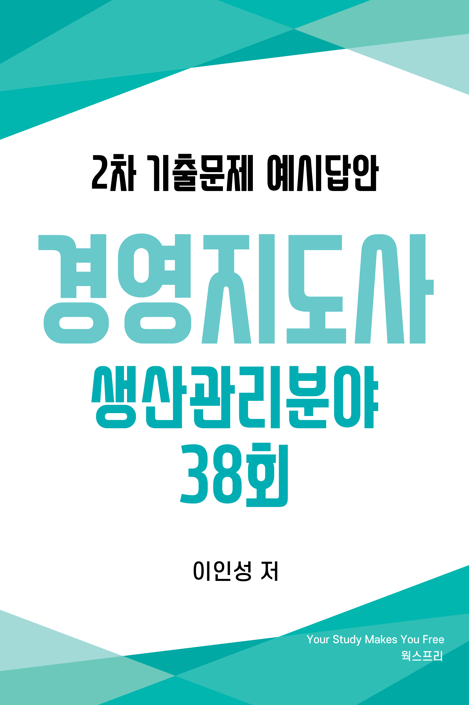



# 저자 소개
<ul>
    <li>경영지도사 생산관리분야</li>
    <li>자동화 장비 제조업 프로세스 개선 내부 컨설팅 경력</li>
    <li>제조업 설계 및 MCT 단순 반복 업무 자동화(RPA) 프로그램 개발
        <a href="https://www.worksfree.com">
        <figure style="float: right"><figcaption style="text-align: center;">RPA Site</figcaption></figure>
        </a>
        <ul>
            <li>어셈블리 BOM 엑셀 저장 자동화 프로그램</li>
            <li>8만 여개 구매품 속성 2주만에 정리하기</li>
            <li>이드로잉스 뷰어 대량 출력 자동화 프로그램</li>
            <li>구글 드라이브 기반 인터넷 정보 자동 업데이트</li>
            <li>자동화(RPA) 프로그램은 우측 QR 또는 아래 URL 참고 <a href="https://www.worksfree.com">https://www.worksfree.com</a></li>
        </ul>
    </li>
    <li>소프트웨어 분야 개발 및 PM 경력</li>
    <li>프로젝트 관리 전문가(PMP from PMI)</li>
    <li>IITP 평가위원, NIPA 평가위원</li>
    <li>KOIIA DX/AX 진단 컨설팅 위원</li>
    <li>2025년 예비창업패키지 사업자 선정 및 1단계, 2단계 수행</li>
</ul>

# 교재 소개
- 본 교재는 필자가 경영지도사 2차 수험 생활을 하며 기출문제를 풀고 아래 명시된 수험 교재 학습 및 인터넷 정보를 참조하여 정리한 내용입니다.
  * 생산관리 : 생산운영관리 [법문사]
  * 품질경영 : 품질경영론 [KSAM]
  * 경영과학 : 4차 산업혁명 시대의 EXCEL 경영과학 [박영사]
- 목차는 3 페이지에 제공되며 본문 내의 파랑색으로 보이는 모든 문구는 문서 내부 링크로서 클릭하면 문제, 예시답안, 목차로 이동합니다.
- 예시답안은 설명을 위해 단계별로 내용이 작성되어 불필요하게 긴 예시답안이 있는데 실제 답안 작성시에는 꼭 필요한 경우만 풀이 과정을 단계별로 작성해도 됩니다.
- 예시답안의 내용에 대한 개정 의견이나 시험 관련된 문의 사항은 아래 이메일로 보내주시기 바라며 수험생들의 고득점을 기원합니다.
- 자격시험 합격 후 동차 예시답안 출판에 관심 있는 분은 이메일로 연락 바랍니다.
- <a href="mailto:insung.lee@worksfree.kr">이메일 : insung.lee@worksfree.kr</a>

# 
 38회 목차 

## [38회 생산관리 목차](#38회-생산관리)
- [[문제1] 재고관리와 경제적 주문량](#38회-생산관리-문제-1)
- [[문제2] 부가가치생산성과 총요소생산성, 종합생산성](#38회-생산관리-문제-2)
- [[문제3] 제품별 배치와 공정별 배치의 비교](#38회-생산관리-문제-3)
- [[문제4] 골드랏의 OPT(최적생산 이론)와 TOC(제약조건 이론)](#38회-생산관리-문제-4)
- [[문제5] 도요타의 JIT(적시생산시스템) 생산방식에서 낭비형태와 5S 활동](#38회-생산관리-문제-5)
- [[문제6] 설비관리의 6대 로스와 고장률곡선](#38회-생산관리-문제-6)

## [38회 품질경영 목차](#38회-품질경영)
- [[문제1] 품질분임조, 신 QC도구 7가지, 6시그마(RTY, FPY, DPU)](#38회-품질경영-문제-1)
- [[문제2] 실험계획법 - 이원배치법 및 불편추정량, 결정계수](#38회-품질경영-문제-2)
- [[문제3] 샘플링 방법](#38회-품질경영-문제-3)
- [[문제4] 신뢰성 - 고장날 확률, 평균수명(MTTF)](#38회-품질경영-문제-4)
- [[문제5] 품질기능전개(QFD)](#38회-품질경영-문제-5)
- [[문제6] 말콤볼드리지 경영품질 모델 7가지 범주](#38회-품질경영-문제-6)

## [38회 경영과학 목차](#38회-경영과학)
- [[문제1] 수송모델 북서코너법 및 선형계획모형](#38회-경영과학-문제-1)
- [[문제2] 선형계획모형과 목표계획모형, 도해법](#38회-경영과학-문제-2)
- [[문제3] 할당문제 - 헝가리법](#38회-경영과학-문제-3)
- [[문제4] 네트워크모델의 최소걸침나무와 최단거리](#38회-경영과학-문제-4)
- [[문제5] 게임이론의 게임값](#38회-경영과학-문제-5)
- [[문제6] 의사결정론의 불확실성하의 의사결정](#38회-경영과학-문제-6)

# 38회 생산관리 문제

## 38회 생산관리 문제 1
<!-- SRC:생산관리/문제1.md -->
### 【문제 1】재고관리와 관련하여 다음 물음에 답하시오. (30점)
(1) 재고의 기능을 3가지만 설명하시오. (10점)

(2) 경제적 주문량(EOQ) 모형의 가정에 대하여 3가지만 설명하시오. (10점)

(3) A 제조업체에서 내년에 판매할 예정인 제품의 단위당 구매단가는 500원이다. 판매량은 일주일에 5개이며, 1회 주문비용은 300원이다. 연간 단위당 재고유지비용은 단위당 구매단가의 30 %이며, 1년에 52주 영업한다. 이 때 연간 총비용(연간 재고유지비용과 연간 주문비용의 합)을 최소화하는 경제적 주문량(EOQ)은 얼마인지 계산하시오. (단, EOQ 공식과 계산과정을 쓰고, 계산결과는 소수점 첫째자리에서 반올림하여 정수로 구한다.)(10점)
<!-- /SRC:생산관리/문제1.md -->

<a href="#38회-생산관리-문제-1-예시답안-30점">예시답안 바로가기</a><a href="#38회-생산관리-목차">목차 바로가기</a>

## 38회 생산관리 문제 2
<!-- SRC:생산관리/문제2.md -->
### 【문제 2】근거리용 배달을 목적으로 하는 소형 차량을 생산하는 제조업체인 A사의 금년도 상반기 생산에 투입된 자원과 생산실적 현황이다. 다음 물음에 답하시오. (30점)

<table border="1" cellpadding="5">
  <tr> <th>투입된 생산자원</th> <th>생산실적</th> </tr>
  <tr> <td class="custome-td"> ○ 자원 800백만원  ○ 노동 400백만원 (종업원수 200명)  ○ 자본 500백만원  ○ 에너지 150백만원  ○ 기타 50백만원 </td>
       <td class="custome-td"> ○ 차량생산 3,000대  ○ 출하가격 1백만원  ○ 생산액 = 3,000대 × 백만원 </td>
  </tr>
</table>

(1) 부가가치생산성의 의미를 설명하고, 계산과정과 값을 쓰시오. (10점)

(2) 총 요소생산성의 의미를 설명하고, 계산과정과 값을 쓰시오. (단, 소수점 셋째자리에서 반올림하여 소수점 둘째자리까지 구한다.) (10점)

(3) 종합생산성의 의미를 설명하고, 계산과정과 값을 쓰시오. (단, 소수점 셋째자리에서 반올림하여 소수점 둘째자리까지 구한다.) (10점)
<!-- /SRC:생산관리/문제2.md -->

<a href="#38회-생산관리-문제-2-예시답안-30점">예시답안 바로가기</a><a href="#38회-생산관리-목차">목차 바로가기</a>

## 38회 생산관리 문제 3
<!-- SRC:생산관리/문제3.md -->
### 【문제 3】다음 표는 제품별 배치와 공정별 배치를 비교한 것이다. ①～⑩에 타당한 내용을 ‘비고’ 항목에서 선택하여 쓰시오. (10점)

<table>
    <tr><th>비교 항목</th><th>제품별 배치</th><th>공정별 배치</th><th>비고</th></tr>
    <tr><td>자원 이용</td><td>①</td><td>②</td><td>범용 장비, 전용 장비</td></tr>
    <tr><td>품종/생산량</td><td>③</td><td>④</td><td>다품종 소량생산, 소품종 대량생산</td></tr>
    <tr><td>단위당 생산 원가</td><td>⑤</td><td>⑥</td><td>높음, 낮음</td></tr>
    <tr><td>장비 가동률</td><td>⑦</td><td>⑧</td><td>높음, 낮음</td></tr>
    <tr><td>유연성</td><td>⑨</td><td>⑩</td><td>높음, 낮음</td></tr>
</table>
<!-- /SRC:생산관리/문제3.md -->

<a href="#38회-생산관리-문제-3-예시답안-10점">예시답안 바로가기</a><a href="#38회-생산관리-목차">목차 바로가기</a>

## 38회 생산관리 문제 4
<!-- SRC:생산관리/문제4.md -->
### 【문제 4 】 이스라엘의 물리학자 골드랏(Goldratt)이 생산현장의 일정계획용으로 개발한 OPT(Optimized Production Technology)는 애로공정을 규명하여 생산의 흐름을 동시화하는 데 주안점을 둔 일정계획시스템이다. 다음 물음에 답하시오. (10점)

(1) OPT의 원칙을 중심으로 OPT의 전개과정을 3단계로 설명하시오. (5점)

(2) OPT와 TOC(제약조건 이론)의 장점을 3가지만 설명하시오. (5점)
<!-- /SRC:생산관리/문제4.md -->

<a href="#38회-생산관리-문제-4-예시답안-10점">예시답안 바로가기</a><a href="#38회-생산관리-목차">목차 바로가기</a>

## 38회 생산관리 문제 5
<!-- SRC:생산관리/문제5.md -->
### 【문제 5】 도요타 생산방식의 JIT(Just-in-time) 시스템은 낭비와 지연을 제거하여 부가가치를 극대화하는 시스템이다. 다음 물음에 답하시오. (10점)

(1) 낭비 형태를 5가지만 제시하고 설명하시오. (5점)

(2) JIT 시스템의 작업환경 개선활동인 5S를 제시하고 설명하시오. (5점)
<!-- /SRC:생산관리/문제5.md -->

<a href="#38회-생산관리-문제-5-예시답안-10점">예시답안 바로가기</a><a href="#38회-생산관리-목차">목차 바로가기</a>

## 38회 생산관리 문제 6
<!-- SRC:생산관리/문제6.md -->
### 【문제 6】 설비를 관리하는 데에는 항상 6대 로스가 발생한다. 설비관리는 결국 6대 로스를 미연에 방지하여 고장이 없고 생산성이 높은 설비를 유지ㆍ관리하는 일이다. 설비관리와 TPM(종합적인 생산보전)에 관한 다음 물음에 답하시오. (10점)

(1) 설비의 6대 로스를 5가지만 제시하고 설명하시오. (5점)

(2) 고장률곡선을 그리고, 각 단계별 고장원인을 설명하시오. (5점)
<!-- /SRC:생산관리/문제6.md -->

<a href="#38회-생산관리-문제-6-예시답안-10점">예시답안 바로가기</a><a href="#38회-생산관리-목차">목차 바로가기</a>

# 38회 생산관리 예시답안

## 38회 생산관리 문제 1 예시답안 (30점)

<!-- SRC:생산관리/예시답안1.md -->
### 【문제 1 - (1)】 재고의 기능 3가지 (10점)

* 불확실한 수요변화에 대처하는 안전재고 : 완충재고라고도 하는데 품절 및 미납주문을 예방하기 위해 유지하는 재고이다.
* 미래에 대비하는 예비재고 : 계절적 변동을 예상해서 제품이나 자재를 비축하는 재고를 말한다.
* 경제적 구매를 위한 주기재고 : 당장 필요한 것보다는 많지만 주문비용과 주문단가를 낮추기 위한 경제적 주문량으로 발생하는 재고를 말한다.

### 【문제 1 - (2)】 경제적 주문량(EOQ) 모형의 가정 3가지 (10점)

* 일정한 주문비용: 주문비용은 발주량의 크기와 관계없이 매주문마다 일정함
* 재고유지비의 비례성: 재고유지비는 발주량의 크기에 정비례함
* 일정한 구입단가: 구입단가는 발주량의 크기와 무관하게 일정함

### 【문제 1 - (3)】 경제적 주문량(EOQ) 계산 (10점)

주어진 정보:
- 단위당 구매단가$(P) = 500$원
- 판매량 $= 주당 5$개
- 연간 판매량$(D) = 5개/주 × 52주 = 260$개
- 1회 주문비용$(S) = 300$원
- 연간 단위당 재고유지비용$(H) =$ 단위당 구매단가의 $30$%$ = 500원 × 0.3 = 150$원

경제적 주문량($EOQ$) 공식: $EOQ = \sqrt{\bigg(\cfrac{2DS}{H}\bigg)}$

계산: $EOQ = \sqrt{\bigg(\cfrac{2 × 260 × 300}{150}\bigg)} = \sqrt{\bigg(\cfrac{156,000}{150}\bigg)} = \sqrt{1,040} = 32.25...$

소수점 첫째자리에서 반올림하면, **EOQ = 32개**
<!-- /SRC:생산관리/예시답안1.md -->

<a href="#38회-생산관리-문제-1">문제 바로가기</a><a href="#38회-생산관리-목차">목차 바로가기</a>

## 38회 생산관리 문제 2 예시답안 (30점)

<!-- SRC:생산관리/예시답안2.md -->
### 【문제 2 - (1)】 부가가치생산성의 의미와 계산 (10점)

* 의미: 기업이 창출한 부가가치를 투입요소로(종업원수)로 나눈 값으로 부가가치는 총생산액에서 중간투입물(원재료, 에너지 등)을 뺀 값임

* 계산: $\cfrac{부가가치}{노동투입량} = \cfrac{매출액-(자재+에너지+기타)}{종업원수}$ 
  $= \cfrac{3,000-(800+150+50)}{200}=\cfrac{2,000}{200}=10$ 백만원

### 【문제 2 - (2)】 총요소생산성의 의미와 계산 (10점)

* 의미: 부가가치를 투입요소 총계로 나눈 값

* 계산: $=\cfrac{순산출}{노동+자본} = \cfrac{부가가치}{노동+자본} = \cfrac{2,000}{400+500} = \cfrac{20}{9}=2.222...\approx2.22$

### 【문제 2 - (3)】 종합생산성의 의미와 계산 (10점)

* 의미: 총생산액을 모든 투입요소(노동, 자본, 원재료, 에너지, 기타)의 합으로 나눈 값

* 계산: $=\cfrac{총산출}{총투입} = \cfrac{매출액}{노동+자본+자재+에너지+서비스}$ 
  $= \cfrac{3,000}{1,900}=1.578...\approx= 1.58$
<!-- /SRC:생산관리/예시답안2.md -->

<a href="#38회-생산관리-문제-2">문제 바로가기</a><a href="#38회-생산관리-목차">목차 바로가기</a>

## 38회 생산관리 문제 3 예시답안 (10점)

<!-- SRC:생산관리/예시답안3.md -->
### 【문제 3】 제품별 배치와 공정별 배치의 비교 (10점)

<table>
    <tr><th>비교 항목</th><th>제품별 배치</th><th>공정별 배치</th></tr>
    <tr><td>자원 이용</td><td class="custome-td"> ① 전용 장비</td><td class="custome-td"> ② 범용 장비</td></tr>
    <tr><td>품종/생산량</td><td class="custome-td"> ③ 소품종 대량생산</td><td class="custome-td"> ④ 다품종 소량생산</td></tr>
    <tr><td>단위당 생산 원가</td><td class="custome-td"> ⑤ 낮음</td><td class="custome-td"> ⑥ 높음</td></tr>
    <tr><td>장비 가동률</td><td class="custome-td"> ⑦ 높음</td><td class="custome-td"> ⑧ 낮음</td></tr>
    <tr><td>유연성</td><td class="custome-td"> ⑨ 낮음</td><td class="custome-td"> ⑩ 높음</td></tr>
</table>
<!-- /SRC:생산관리/예시답안3.md -->

<a href="#38회-생산관리-문제-3">문제 바로가기</a><a href="#38회-생산관리-목차">목차 바로가기</a>

## 38회 생산관리 문제 4 예시답안 (10점)

<!-- SRC:생산관리/예시답안4.md -->
### 【문제 4 - (1)】 OPT(최적 생산 이론)의 전개과정 3단계 (5점)

1. 애로공정(Bottleneck) 식별한다. 애로공정은 전체 흐름의 리듬을 결정하기 때문에 가장 먼저 식별해야 한다.

2. 애로공정에서 애로자원이 충분히 활용되도록 계획을 수립한다.

3. 비애로공정의 자원은 애로공정을 중심으로 생산흐름을 동기화한다.

### 【문제 4 - (2)】 장점 3가지 (5점)

1. 시스템 전체 최적화 가능 : TOC와 OPT는 전체 시스템의 흐름 개선을 목표로 하므로, 개별 공정 개선보다 시스템 전반의 성과를 극대화할 수 있다.

2. 리드타임 단축 : 병목 공정을 중심으로 생산 흐름을 조정함으로써, 전체 리드타임이 짧아지고 납기 준수율이 향상된다.

3. 재고 감소 및 자원 활용 극대화 : 병목 공정을 기준으로 자원배분을 효율화함으로써 불필요한 재고가 줄고, 제한 자원의 활용률이 극대화된다.
<!-- /SRC:생산관리/예시답안4.md -->

<a href="#38회-생산관리-문제-4">문제 바로가기</a><a href="#38회-생산관리-목차">목차 바로가기</a>

## 38회 생산관리 문제 5 예시답안 (10점)

<!-- SRC:생산관리/예시답안5.md -->
### 【문제 5 - (1)】 낭비 형태 5가지 설명 (5점)

1. 과잉생산의 낭비(Over Production): 필요 이상으로 많이 생산하거나 필요 시점보다 빨리 생산하는 낭비
  예) 추가적인 재고비용, 저장공간, 관리비용 발생

2. 대기의 낭비(Waiting): 작업자가 기계가 작동하기를 기다리거나, 자재가 도착하기를 기다리는 시간적 낭비
  예) 생산성 저하와 리드타임 증가의 원인

3. 운반의 낭비(Transportation): 필요 이상의 물자 이동이나 비효율적인 레이아웃으로 인한 불필요한 운반 활동
  예) 시간 소모, 손상 위험, 추가 비용 발생

4. 재고의 낭비(Inventory): 필요 이상의 원자재, 재공품, 완제품을 보유하는 낭비
  예) 보관비용 증가 및 문제 은폐 효과 발생

5. 불량의 낭비(Defects): 품질 문제로 인한 재작업, 폐기, 검사의 낭비
  예) 재료, 노동력, 시간, 고객 신뢰도 손실 발생

### 【문제 5 - (2)】 5S를 제시하고 설명 (5점)

1. 정리(Seiri): 필요한 것과 불필요한 것을 구분하여 불필요한 것은 제거하는 것, 폐기, 반납 하는 것

2. 정돈(Seiton): 필요한 물건을 쉽게 찾고 사용할 수 있도록 적절한 위치에 배치, "Everything in its place, and a place for everything"의 원칙 적용

3. 청소(Seiso): 작업장을 깨끗하게 유지하고 정기적으로 청소, 설비의 이상 징후를 조기에 발견할 수 있는 환경 조성

4. 청결(Seiketsu): 앞의 3S(정리, 정돈, 청소)의 상태를 유지하여 언제나 눈으로 보기만 해도 정상인지 아닌지 알 수 있도록 하는 것

5. 습관화(Shitsuke): 위 모든 것을 표준화하고 지속적으로 실천하여 조직 문화로 정착하고 습관으로 만드는 것
<!-- /SRC:생산관리/예시답안5.md -->

<a href="#38회-생산관리-문제-5">문제 바로가기</a><a href="#38회-생산관리-목차">목차 바로가기</a>

## 38회 생산관리 문제 6 예시답안 (10점)

<!-- SRC:생산관리/예시답안6.md -->
### 【문제 6 - (1)】 설비의 6대 로스 5가지 제시하고 설명 (5점)

1. 고장 로스(Breakdown Loss): 설비의 갑작스러운 고장으로 인한 생산 중단, 수리 시간 동안의 생산 손실과 품질 문제 발생 가능

2. 준비 및 조정 로스(Setup and Adjustment Loss): 생산 품목 변경 시 발생하는 설비 조정 및 준비 시간으로 인한 손실, 생산성 저하 및 유연성 감소 초래

3. 공전 및 일시 정지 로스(Minor Stoppage Loss): 일시적인 트러블로 인한 단시간 정지 또는 공회전, 누적 시 상당한 생산성 저하 초래

4. 속도 저하 로스(Speed Loss): 설비 정격 속도보다 낮은 속도로 운영됨으로써 발생하는 손실, 설비 성능 저하나 운영 문제로 인한 비효율성

5. 불량 및 재작업 로스(Quality Defects and Rework Loss): 설비 불량으로 인한 제품 결함 및 재작업 비용, 재료, 시간, 노동력의 추가 소모

### 【문제 6 - (2)】 고장률 곡선을 그리고 단계별 고장원인 설명 (5점)

  

1. 초기고장기 원인: 조립 불량, 설계 미비, 초기 세팅 문제

2. 우발고장기 원인: 우연한 사고, 일시적 마모, 외부 충격, 예상 이상의 과부하

3. 마모고장기 원인: 부품 마모, 설비 열화, 수명 경과
<!-- /SRC:생산관리/예시답안6.md -->

<a href="#38회-생산관리-문제-6">문제 바로가기</a><a href="#38회-생산관리-목차">목차 바로가기</a>

# 38회 품질경영 문제

## 38회 품질경영 문제 1
<!-- SRC:품질경영/문제1.md -->
### 【문제 1】다음 물음에 답하시오. (30점)
(1) 품질분임조는 문제해결을 위해 고마츠 제작소의 QC스토리를 약간 수정하여 현재 10단계로 실행하고 있다. 품질분임조의 문제해결 10단계를 순서대로 쓰시오. (10점)

(2) 품질분임조 활동에 널리 사용되는 기법으로 기본 QC 7도구가 있다면 PDCA 사이클의 P(계획)단계에서 많이 활용되는 신 QC 7가지 도구가 있다. 아이디어 발상을 돕거나 확인 사항의 누락 방지 등을 위해 사용되는 신 QC 7가지 도구를 제시하고 각각 설명하시오. (14점)

(3) 6시그마에서 사용되는 다음의 용어(①～③)를 각각 설명하시오. (6점)

  ① RTY ② FPY ③ DPU
<!-- /SRC:품질경영/문제1.md -->

<a href="#38회-품질경영-문제-1-예시답안-30점">예시답안 바로가기</a><a href="#38회-품질경영-목차">목차 바로가기</a>

## 38회 품질경영 문제 2
<!-- SRC:품질경영/문제2.md -->
### 【문제 2】모수인자 A와 B를 고려한 이원배치법에 관한 문제이다. 인자 A는 3수준, 인자 B는 5수준이며 각 처리조합에서 반복 2회의 실험을 수행하였다. 실험 결과로 얻어진 품질특성치 $x_i$$_j$$_k$ 에 관한 데이터구조식 모형은 다음과 같다.  $x_i$$_j$$_k$ $ = \mu + a_i + b_j + (ab)_i$$_j +$ $e_i$$_j$$_k$ (단 $i = 1, 2, 3, 4, 5,$&nbsp;$j = 1, 2, 3,$&nbsp;$k = 1, 2$)   첨자 $i, j, k$는 각각 인자 A의 수준, 인자 B의 수준, 반복차수이다. 또한 $\mu$는 전체 평균, $a_i$는 인자 A의 주효과, $b_j$는 B의 주효과, $(ab)_i$$_j$는 A와 B의 교호작용을 각각 나타낸다. 오차 $e_i$$_j$$_k$는 서로 독립이고 $N(0, \sigma^2_E)$를 따른다고 가정 한다. 아래는 실험 결과에 관한 분산분석표이다.

<table>
    <tr><th>요인</th><th>제곱합</th><th>자유도</th><th>제곱평균</th><th>$F_0$</th><th>P값</th></tr>
    <tr><td>인자 A</td><td>420.000</td><td>2</td><td>210.000</td><td>76.829</td><td>0.000</td></tr>
    <tr><td>인자 B</td><td>①</td><td>4</td><td>④</td><td>59.390</td><td>0.000</td></tr>
    <tr><td>교호작용 A x B</td><td>79.667</td><td>②</td><td>⑤</td><td>⑥</td><td>0.015</td></tr>
    <tr><td>오차</td><td>41.000</td><td>15</td><td>2.733</td><td>-</td><td>-</td></tr>
    <tr><th>Total</th><th>1190.000</th><th>③</th><th>-</th><th>-</th><th>-</th></tr>
</table>

### 표에서 P값의 의미는 아래의 그림을 참고하고 다음 물음에 답하시오. (단, 소수점 넷째자리에서 반올림하여 소수점 셋째자리까지 구한다.) (30점)

(1) 표의 ①～⑥에 들어갈 값을 차례대로 구하시오. (12점)

(2) 교호작용의 유의성에 관한 가설검정을 위해 귀무가설, 대립가설, 검정통계량, 판정결과 및 근거를 각각 기술하시오. (단, 유의수준은 5%로 한다.) (9점)

(3) 오차분산 $\sigma^2_E$의 불편추정량을 구하시오. (3점)

(4) 상기 모형의 적합도를 나타내는 결정계수($R^2$)와 수정결정계수($adjusted$&nbsp;$R^2$)의 계산과정과 값을 각각 구하시오. (6점)
<!-- /SRC:품질경영/문제2.md -->

<a href="#38회-품질경영-문제-2-예시답안-30점">예시답안 바로가기</a><a href="#38회-품질경영-목차">목차 바로가기</a>

## 38회 품질경영 문제 3
<!-- SRC:품질경영/문제3.md -->
### 【문제 3】다음 설명에 해당하는 샘플링 방법(①～⑤)을 쓰시오. (10점)

<table>
    <tr><th width="20%">샘플링 방법</th><th>설명</th></tr>
    <tr><td>①</td><td class="custome-td">모집단을 몇 개의 층으로 나누어 각 층에서 시료를 랜덤하게 추출하는 방법</td></tr>
    <tr><td>②</td><td class="custome-td">모집단을 몇 개의 층으로 나눈 후 표본의 크기를 고려하여 몇 개의 층을 랜덤 샘플링하여 취한 층의 전체를 표본으로 하는 방법</td></tr>
    <tr><td>③</td><td class="custome-td">모집단이 $N_i$개씩 제품이 들어있는 $M$상자로 나누어져 있을 때, 랜덤하게 $m$상자를 취한 후 각 상자로부터 $n_i$개의 제품을 랜덤하게 추출하는 방법</td></tr>
    <tr><td>④</td><td class="custome-td">$N$개의 물품이 일련의 배열로 되어 있을 때, 처음의 $k$개의 샘플링 단위 중 1개를 랜덤하게 취한 후 그로부터 매 $k$번째를 선택하여 $n$개의 표본을 취하는 방법</td></tr>
    <tr><td>⑤</td><td class="custome-td">계통 샘플링에서 주기성에 의한 치우침이 발생할 위험을 방지하기 위해 주기와 상이한 간격으로 표본을 취하는 방법</td></tr>
</table>
  
<!-- /SRC:품질경영/문제3.md -->

<a href="#38회-품질경영-문제-3-예시답안-10점">예시답안 바로가기</a><a href="#38회-품질경영-목차">목차 바로가기</a>

## 38회 품질경영 문제 4
<!-- SRC:품질경영/문제4.md -->
### 【문제 4】트랜지스터의 고장률은 연간 0.5회로 일정한 값을 갖는다. 다음 물음에 답하시오. (단, 계산과정을 쓰고, 소수점 넷째자리에서 반올림하여 소수점 셋째자리까지 구한다.) (10점)

(1) 트랜지스터가 2년 이내에 고장날 확률을 구하시오. (3점)

(2) 트랜지스터의 평균수명(MTTF)을 구하시오. (3점)

(3) 지난 3년 동안 정상작동해온 트랜지스터가 앞으로 2년 더 정상작동할 확률을 구하시오. (4점)
<!-- /SRC:품질경영/문제4.md -->

<a href="#38회-품질경영-문제-4-예시답안-10점">예시답안 바로가기</a><a href="#38회-품질경영-목차">목차 바로가기</a>

## 38회 품질경영 문제 5
<!-- SRC:품질경영/문제5.md -->
### 【문제 5】다음 그림은 품질기능전개를 위한 House of Quality의 기본 구조를 보여주고 있다. ①～④에 들어갈 내용을 각각 기술하시오. (10점)

<!-- /SRC:품질경영/문제5.md -->

<a href="#38회-품질경영-문제-5-예시답안-10점">예시답안 바로가기</a><a href="#38회-품질경영-목차">목차 바로가기</a>

## 38회 품질경영 문제 6
<!-- SRC:품질경영/문제6.md -->
### 【문제 6】말콤볼드리지 경영품질 모델의 7가지 범주를 기술하시오. (10점)
<!-- /SRC:품질경영/문제6.md -->

<a href="#38회-품질경영-문제-6-예시답안-10점">예시답안 바로가기</a><a href="#38회-품질경영-목차">목차 바로가기</a>

# 38회 품질경영 예시답안

## 38회 품질경영 문제 1 예시답안 (30점)

<!-- SRC:품질경영/예시답안1.md -->
### 【문제 1 - (1)】 품질분임조 문제해결 10단계 (10점)

1. 주제 선정, 2. 현상 파악, 3. 원인 분석, 4. 목표 설정, 5. 대책 수립
6. 대책 실시, 7. 효과 파악, 8. 표준화, 9. 사후 관리, 10. 반성 및 향후 계획

### 【문제 1 - (2)】 신 QC 7가지 도구 제시 및 설명 (14점)

1. 친화도 (Affinity Diagram): 언어 데이터를 사실, 의견, 발상에 기초하여 그룹화하고 정리하는 기법입니다. 브레인스토밍 등으로 수집된 다양한 아이디어나 의견들을 유사한 성격끼리 묶어 문제의 본질이나 구조를 파악하는 데 도움이 됩니다.

2. 연관도 (Relations Diagram): 원인과 결과, 목적과 수단 등 복잡하게 얽힌 요인 간의 관계를 화살표를 사용하여 명확하게 나타내는 기법입니다. 문제의 근본 원인을 찾거나 인과관계를 파악하는 데 유용합니다.

3. 계통도 (Tree Diagram): 목표 달성을 위한 수단이나 방법을 계층적으로 전개하여 구체적인 실행 계획을 세우는 기법입니다. 'What-How' 또는 'Why-Why' 분석 등에 활용됩니다.

4. 매트릭스도 (Matrix Diagram): 행과 열에 요인을 배치하고 그 교점에 관련 정도를 표시하여 다수의 요인 간의 관계를 일목요연하게 파악하는 기법입니다. L형, T형, Y형, X형 등 다양한 형태가 있습니다.

5. 매트릭스 데이터 해석법 (Matrix Data Analysis): 매트릭스도에 표시된 요인 간의 관련 데이터를 통계적 기법(주성분 분석 등)을 이용하여 분석하고 해석하는 방법입니다. 복잡한 데이터 속에서 핵심 정보를 추출하는 데 사용됩니다.

6. 네트워크도(Network Diagram): 프로젝트나 작업의 각 단계를 화살표와 노드로 연결하여 작업 순서, 소요 시간, 병목 현상 등을 파악하고 일정을 관리하는 기법입니다. PERT/CPM이 주요 사용 사례이며 애로우 다이어그램(Arrow Diagram)이라고 불립니다.

7. PDPC법 (Process Decision Program Chart): 목표 달성 과정에서 발생할 수 있는 예기치 못한 문제나 장애 요인을 사전에 예측하고, 그에 대한 대응책을 미리 계획하여 최적의 경로를 찾아가는 기법입니다. 불확실한 상황에서의 의사결정에 도움을 줍니다.

<!-- ### 【문제 1 - 3 】 6 시그마 용어 설명 (6점)
1. RTY (Rolled Throughput Yield, 누적수율): 여러 공정으로 이루어진 전체 프로세스에서 첫 공정부터 마지막 공정까지 불량 없이 통과할 확률 또는 비율을 의미합니다. 각 공정의 수율(FPY)을 모두 곱하여 계산합니다.(RTY = FPY_1×FPY_2×...×FPY_n) 아래 공정 A의 FPY가 0.9, 공정 B의 FPY가 0.8라면 전체 공정 A-B의 RTY는 0.9 x 0.8 = 0.72가 됩니다.  **$RTY=0.9\times0.8 = 0.72$**

2. FPY (First Pass Yield, 공정수율): 특정 공정에 투입된 총 단위 수 중에서 재작업이나 수정 없이 한 번에 양품으로 판정된 단위 수의 비율을 의미합니다. 개별 공정의 효율성을 측정하는 지표입니다. 100개의 단위가 A 공정으로 유입되고 90개가 양품으로 배출된 경우 공정 A의 FPY는 90/100 = 0.9000이고 공정 B에 90개 단위가 유입되고 80개의 양품이 나온다면 공정 B의 FPY는 80/90 = 0.8889입니다.  **$FPY=\cfrac{80}{90}=0.8889\approx0.889$**

3. DPU (Defects Per Unit, 단위당 결함 수): 생산된 제품 한 단위당 포함된 평균 결함 수를 의미합니다. (DPU = 총 결함 수 / 총 생산 단위 수) 제품의 품질 수준을 나타내는 지표 중 하나입니다. -->

### 【문제 1 - (3)】 6 시그마 용어 설명 (6점)
1. RTY (Rolled Throughput Yield, 누적수율): 여러 공정으로 이루어진 전체 프로세스에서 첫 공정부터 마지막 공정까지 불량 없이 통과할 확률 또는 비율을 의미합니다. 각 공정의 수율(FPY)을 모두 곱하여 계산합니다.

2. FPY (First Pass Yield, 공정수율): 특정 공정에 투입된 총 단위 수 중에서 재작업이나 수정 없이 한 번에 양품으로 판정된 단위 수의 비율을 의미합니다. 개별 공정의 효율성을 측정하는 지표입니다.

3. DPU (Defects Per Unit, 단위당 결함 수): 생산된 제품 한 단위당 포함된 평균 결함 수를 의미합니다. (DPU = 총 결함 수 / 총 생산 단위 수) 제품의 품질 수준을 나타내는 지표 중 하나입니다.
<!-- /SRC:품질경영/예시답안1.md -->

<a href="#38회-품질경영-문제-1">문제 바로가기</a><a href="#38회-품질경영-목차">목차 바로가기</a>

## 38회 품질경영 문제 2 예시답안 (30점)

<!-- SRC:품질경영/예시답안2.md -->
<!-- 

학습 자료

<table><tr> <th>구분</th><th>설명</th> </tr>
<tr> <td><strong>표준의 특성</strong></td><td>표준 자체가 지녀야 하는 속성(공정성, 명확성, 일관성 등).</td> </tr>
<tr> <td><strong>표준의 역할</strong></td> <td>표준이 사회와 산업에 제공하는 기능(상호운용성, 품질보장 등).</td> </tr>
<tr> <td><strong>표준화의 목적</strong></td><td>표준화를 통해 이루고자 하는 목표(효율성 증대, 시장 경쟁력 강화 등).</td> </tr>
<tr> <td><strong>표준화의 원리</strong></td><td>표준화 과정에서 따라야 할 철학과 방법론(단순화, 합의성, 객관성 등).</td> </tr>
</table>

 -->

### 【문제 2 - (1)】 분산분석표 빈칸 (12점)
* 주어진 조건
  * 인자 $A$: 3수준
  * 인자 $B$: 5수준
  * 반복수: 2회

* 자유도 계산
  * 인자 $A$ 자유도 $= 3−1=2$
  * 인자 $B$ 자유도 $= 5−1=4$
  * 교호작용($A×B$) 자유도 $= (3−1)(5−1)=8$
  * 오차 자유도 $= 3×5×(2−1)=15$
  * 총 자유도 $= 30−1=29$

* 제곱합 및 제곱평균 계산
  * 오차의 제곱평균: $2.733$ (주어짐)
  * 교호작용의 제곱평균:
    * 교호작용 제곱평균 $=\cfrac{79.667}{8}=9.958$
    * 인자 $B$의 제곱합 $=1190−(420+79.667+41)=649.333$
    * 인자 $B$의 제곱평균 $=\cfrac{649.333}{4}=162.333$

* $교호작용의 F값: F_0=\cfrac{9.958}{2.733}=3.6436...\approx3.644$

**답안 ①	649.333 &emsp; ②	8 &emsp; ③	29 &emsp; ④	162.333 &emsp; ⑤	9.958 &emsp; ⑥	3.644**

### 【문제 2 - (2)】 교호작용 $A$$\times$$B$ 유의성 검증 (9점)
* 귀무가설 ($H_0$) : 인자 A와 인자 B 사이에 교호작용이 없다.
* 대립가설 ($H_1$) : 인자 A와 인자 B 사이에 교호작용이 있다.
* 검정통계량 : $F_0 = 3.644$
* 판정결과 : 교호작용이 통계적으로 유의하므로 귀무가설을 기각한다.
* 판정근거 : $P=0.015<0.05$, 즉 $P$값($0.015$)이 유의수준($0.05$)보다 작으므로 귀무가설을 기각합니다.

### 【문제 2 - (3)】 오차분산 $\sigma^2_E$의 불편추정량 (3점)
* 오차분산 $\sigma^2_E$의 불편추정량: 오차의 제곱평균 $2.733$

### 【문제 2 - (4)】 결정계수와 수정결정계수 (6점)
* $결정계수(R^2) 계산$

    $𝑅^2=1−\cfrac{오차 제곱합}{총 제곱합}=1−\cfrac{41}{1190}=1−0.0345=0.9655\approx0.965$

* $수정결정계수(Adjusted$ $R^2) 계산$

    $Adjusted$ $𝑅^2=1−(1−𝑅^2)×\cfrac{𝑛−1}{n-p−1}$

    $𝑛=30$(관측 수) &emsp;&emsp;&emsp;&emsp;&emsp; $𝑝=2+4+8=14$ (모형의 자유도: $A$, $B$, $AB$)

    $Adjusted$ $𝑅^2=1−(1−0.965)×\cfrac{29}{29-14}=1−0.035×\cfrac{29}{15}$
    &emsp;&emsp;&emsp;&emsp;&emsp;&emsp;&nbsp;&nbsp;&nbsp;$=1−0.035×1.9333=1−0.0677=0.9323\approx0.932$
<!-- /SRC:품질경영/예시답안2.md -->

<a href="#38회-품질경영-문제-2">문제 바로가기</a><a href="#38회-품질경영-목차">목차 바로가기</a>

## 38회 품질경영 문제 3 예시답안 (10점)

<!-- SRC:품질경영/예시답안3.md -->

### 【문제 3】 샘플링 방법 (10점)

1. 층화 샘플링 (Stratified Sampling)
2. 집락 샘플링 (Cluster Sampling)
3. 2단 샘플링 (Two-stage Sampling)
4. 계통 샘플링 (Systematic Sampling)
5. 준계통 샘플링 (Quasi-systematic Sampling) 또는 변형 계통 샘플링

<!-- /SRC:품질경영/예시답안3.md -->

<a href="#38회-품질경영-문제-3">문제 바로가기</a><a href="#38회-품질경영-목차">목차 바로가기</a>

## 38회 품질경영 문제 4 예시답안 (10점)

<!-- SRC:품질경영/예시답안4.md -->
### 【문제 4 - (1)】 신뢰성 2년 이내 고장날 확률 (3점)

조건: 
* $t=2$(년)
* $λ=0.5$(연간)

고장 시간 T가 지수분포 $Exp(λ)$를 따를 때, 시간 $t$까지 고장날 확률(누적분포함수, CDF)은 다음과 같다.

$P(T≤t)=1−e^{−λt}$

따라서,
$P(T≤2)=1−e^{−0.5×2}=1−e^{−1}≈1−0.3679=0.6321≈0.632$

참고: 지수 함수 값 : $e^{−1}\approx0.3679$

**답: 0.632**

### 【문제 4 - (2)】 신뢰성 평균 수명(MTTF) (3점)

지수분포의 평균수명은 고장률의 역수 $\cfrac{1}{λ}$ 입니다.

$MTTF=\cfrac{1}{λ}=\cfrac{1}{0.5}=2 (년)$

**답: 2년**

### 【문제 4 - (3)】 신뢰성 3년 정상 작동 후, 향후 2년 더 정상 작동할 확률 (4점)

지수분포는 무기억성(memoryless property)을 가집니다. 즉, 과거의 작동 시간이 미래의 잔여 수명에 영향을 주지 않습니다. 따라서, 3년 동안 정상 작동했다는 조건 하에 앞으로 2년 더 정상 작동할 확률은, 처음부터 2년 동안 정상 작동할 확률과 같습니다. 시간 t까지 고장나지 않을 확률은:

$P(T>t)=e^{-\lambda t}$

$P(T>2)=e^{−0.5×2}=e^{−1}=0.3679\approx0.368$

**답: 0.368**

<!-- 

학습 자료

<table><tr><td class="custome-td">
1. 고객중심: 고객 요구사항을 이해하고 충족시키기 위해 노력해야 합니다. 
2. 리더십: 조직의 목표와 방향을 제시하고, 직원들이 품질 목표 달성에 참여하도록 유도해야 합니다. 
3. 구성원 참여: 모든 직원이 품질 개선에 참여하고 기여하도록 해야 합니다. 
4. 프로세스 접근: 활동을 상호 연관된 프로세스로 관리하여 결과를 효율적으로 달성해야 합니다. 
5. 개선: 지속적인 개선을 통해 품질 시스템의 효과성을 높여야 합니다. 
6. 증거기반 의사결정: 객관적인 데이터와 정보에 기반하여 의사결정을 해야 합니다. 
7. 관계관리: 공급업체, 파트너 등 이해관계자와의 관계를 관리하여 상호 이익을 추구해야 합니다. 
</td></tr></table>

 -->
<!-- /SRC:품질경영/예시답안4.md -->

<a href="#38회-품질경영-문제-4">문제 바로가기</a><a href="#38회-품질경영-목차">목차 바로가기</a>

## 38회 품질경영 문제 5 예시답안 (10점)

<!-- SRC:품질경영/예시답안5.md -->
### 【문제 5】 품질의 집(House of Quality) 구조 (10점)

1. 고객 요구사항 (Customer Requirements, WHATs): 고객이 제품이나 서비스에 대해 원하는 특성이나 기능입니다. (예: '사용하기 편리함', '튼튼함')

2. 관계 매트릭스 (Relationship Matrix): 고객 요구사항과 기술적 특성 간의 관계 강도(강함, 중간, 약함 등)를 표시하는 부분입니다. 집의 본체(Body)에 해당합니다.

3. 기술적 특성 (Engineering Characteristics, HOWs): 고객 요구사항을 만족시키기 위해 기업이 관리하고 측정해야 하는 제품/서비스의 설계 또는 기술 사양입니다. (예: '버튼 크기', '낙하 충격 강도')

4. 상관관계 매트릭스 (Correlation Matrix): 기술적 특성들 간의 상호 관계(긍정적, 부정적, 무관계)를 나타내는 부분입니다. 지붕(Roof) 형태입니다.

<!-- 

학습 자료

<table><tr><td class="custome-td">

* 고장예방 설계기법과 신뢰성 특유의 설계기법은 모두 시스템의 신뢰성을 높이기 위한 방법이지만, 그 접근 방식과 초점이 다릅니다.

* 고장예방 설계기법 (Failure Prevention Design): 시스템이 고장나지 않도록 미리 예방하는 데 중점을 둡니다. 이는 고장이 발생할 가능성을 줄이기 위해 설계 단계에서부터 다양한 예방 조치를 포함하는 방법입니다. 아래와 같은 항목들이 해당됩니다.
  * 품질 관리 (Quality Control): 제조 과정에서 엄격한 품질 관리를 통해 결함이 있는 부품이 사용되지 않도록 합니다. 이를 위해 정밀 검사, 테스트, 인증 등을 수행합니다.
  * 정기 점검 (Regular Inspections): 시스템의 상태를 주기적으로 점검하여 잠재적인 문제를 미리 발견하고 해결합니다. 이는 고장이 발생하기 전에 예방 조치를 취할 수 있게 합니다.
  * 환경 제어 (Environmental Control): 시스템이 작동하는 환경을 최적화하여 외부 요인으로 인한 고장을 예방합니다. 예를 들어, 온도, 습도, 진동 등을 제어합니다.
  * 부품 신뢰성 평가 (Component Reliability Assessment): 사용되는 부품의 신뢰성을 평가하고, 신뢰성이 높은 부품만을 사용하여 고장을 예방합니다. 이는 부품의 수명과 성능을 고려한 선택을 포함합니다.
  * 설계 표준 준수 (Adherence to Design Standards): 국제적 또는 산업 표준을 준수하여 설계함으로써 고장을 예방합니다. 이는 검증된 설계 방법과 절차를 따르는 것을 의미합니다.
* 신뢰성 특유의 설계기법: 신뢰성 특유의 설계기법은 고장이 발생하더라도 시스템이 계속해서 정상적으로 작동할 수 있도록 하는 데 중점을 둡니다. 이는 고장 허용, 복구, 안전성 등을 고려한 설계 방법입니다. 상세 내용은 예시답안 참고 바랍니다.
</td></tr></table> 

 -->
<!-- /SRC:품질경영/예시답안5.md -->

<a href="#38회-품질경영-문제-5">문제 바로가기</a><a href="#38회-품질경영-목차">목차 바로가기</a>

## 38회 품질경영 문제 6 예시답안 (10점)

<!-- SRC:품질경영/예시답안6.md -->
### 【문제 6】 말콤 볼드리지 경영품질 모델 7가지 범주 (10점)

1. 리더십 (Leadership): 최고 경영진의 리더십, 조직 거버넌스, 사회적 책임 등

2. 전략 (Strategy): 전략 개발 및 실행 프로세스

3. 고객 (Customers): 고객 기대 파악, 고객 관계 구축, 고객 만족 측정 등

4. 측정, 분석 및 지식관리 (Measurement, Analysis, and Knowledge Management): 조직 성과 측정 및 분석, 정보 및 지식 관리

5. 인력 (Workforce): 인력 환경, 인력 참여 및 개발

6. 운영 (Operations): 작업 시스템 설계, 관리 및 개선, 운영 효과성

7. 결과 (Results): 제품 및 프로세스 성과, 고객 중심 성과, 인력 중심 성과, 리더십 및 거버넌스 성과, 재무 및 시장 성과 등 전반적인 조직 성과

<!-- --- -->
<!-- /SRC:품질경영/예시답안6.md -->

<a href="#38회-품질경영-문제-6">문제 바로가기</a><a href="#38회-품질경영-목차">목차 바로가기</a>

# 38회 경영과학 문제

## 38회 경영과학 문제 1
<!-- SRC:경영과학/문제1.md -->
### 【문제 1】 AA사는 광주, 부산, 강릉 지역에 생산공장을 운영 중이며, 여기서 생산된 제품은 서울, 인천, 대전 대리점으로 수송된 후 판매되고 있다. 세 곳의 생산공장에서 세 곳의 대리점으로 제품을 수송할 경우에 소요되는 개당 수송비용은 다음 표와 같다. (30점)

<table>
    <tr><th class="backslash" width="270">
대리점

생산공장
</th><th>서울</th><th>인천</th><th>대전</th><th>공급량</th></tr>
    <tr><td>광주</td><td>4천원</td><td>3천원</td><td>2천원</td><td>300개</td></tr>
    <tr><td>부산</td><td>7천원</td><td>6천원</td><td>4천원</td><td>500개</td></tr>
    <tr><td>강릉</td><td>3천원</td><td>5천원</td><td>8천원</td><td>400개</td></tr>
    <tr><td>수요량</td><td>450개</td><td>250개</td><td>500개</td><td>1200개</td></tr>
</table>

### 단, 현재 교통사정으로 인해 광주 생산공장에서 대전 대리점으로의 수송은 불가능하다. 이와 같은 상황에서 AA사는 세 곳의 생산공장에서 세 곳의 대리점으로 제품을 수송할 경우에 발생하는 총 수송비용을 최소로 하는 수송계획을 수립하고자 한다. 다음 물음에 답하시오. (30점)

(1) 북서코너법(north-west corner method)을 적용한 초기해(initial solution)를 구하고 총비용을 계산하시오. (15점)

(2) 선형계획모형으로 나타낼 경우에 사용되는 의사결정변수를 정하시오. (3점)

(3) 소문항 (2)에서 정해진 의사결정변수를 사용하여 선형계획모형을 작성하시오. (12점)
<!-- /SRC:경영과학/문제1.md -->

<a href="#38회-경영과학-문제-1-예시답안-30점">예시답안 바로가기</a><a href="#38회-경영과학-목차">목차 바로가기</a>

## 38회 경영과학 문제 2
<!-- SRC:경영과학/문제2.md -->
### 【문제 2】 BB사는 절단공정과 조립공정을 통해 책상과 의자를 생산하여 판매한다. 두 제품의 판매이익은 책상이 개당 3만원, 의자가 개당 2만원이다. 최근 책상의 수요가 증가하는 추세이므로 책상은 하루 25개 이상 생산하고자 한다. 책상은 2시간 절단작업과 1시간 조립작업을 통해 생산되고, 의자는 1시간 절단작업과 1시간 조립작업을 통해 생산된다. 최근 노동력이 부족하여 하루 작업시간이 절단은 60시간, 조립은 40시간으로 제한되어 있다. 다음 물음에 답하시오. (30점)

(1) BB사가 하루 판매이익을 최대화하기 위한 선형계획모형을 작성하시오. (10점)

(2) BB사가 아래의 3가지 목표를 달성하기 위한 목표계획모형을 작성하시오. (10점)

<table>
    <!-- <tr><td class="custome-td">목표 1. 책상의 수요가 증가하는 추세이므로 책상을 하루 25개 이상 생산하고자 한다.</td></tr>
    <tr><td class="custome-td">목표 2. 절단작업시간의 미사용을 피하고자 한다.</td></tr>
    <tr><td class="custome-td">목표 3. 조립작업은 초과조업을 피하고자 한다.</td></tr> -->
    <tr><td width="450" class="custome-td">목표 1. 책상의 수요가 증가하는 추세이므로 책상을 하루 25개 이상  &emsp;&emsp;&emsp;생산하고자 한다. 
    목표 2. 절단작업시간의 미사용을 피하고자 한다. 
    목표 3. 조립작업은 초과조업을 피하고자 한다. </td></tr>
</table>

(3) 소문항 (2)에서 작성한 목표계획모형에서 모든 목표의 중요성은 동일하다고 가정할 때, 그래프를 이용하여 모든 목표의 달성여부를 설명하시오. (10점)
<!-- /SRC:경영과학/문제2.md -->

<a href="#38회-경영과학-문제-2-예시답안-30점">예시답안 바로가기</a><a href="#38회-경영과학-목차">목차 바로가기</a>

## 38회 경영과학 문제 3
<!-- SRC:경영과학/문제3.md -->
### 【문제 3】 CC사는 최근 자사의 제품 판매 호조로 인해 제품의 공급이 부족한 실정이다. 이에 신규생산라인을 구축하여 공급 부족량을 보충할 계획이다. CC사 관리자는 신규 생산라인에 투입되는 작업자 네 명(A, B, C, D)을 채용하였으며, 이들에게 네 개의 작업(I, II, III, IV)을 할당할 예정이다. 각 작업자는 하나의 작업에만 할당되어야 하며, 각 작업 또한 한 명의 작업자에게만 할당되어야 한다. 네 명의 작업자를 네 개의 작업에 각각 할당했을 때 CC사가 부담하는 비용은 다음 표와 같다.

<table>
    <tr><th class="backslash" width="100">
작업

작업자
</th><th>
I</th><th>
II</th><th>
III</th><th>
IV</th></tr>
    <!-- <tr><td class="backslash" width="150">
작업

작업자
</td><td>I</td><td>II</td><td>III</td><td>IV</td></tr> -->
    <tr><td>A</td><td>3천원</td><td>6천원</td><td>1천원</td><td>2천원</td></tr>
    <tr><td>B</td><td>2천원</td><td>4천원</td><td>5천원</td><td>6천원</td></tr>
    <tr><td>C</td><td>7천원</td><td>3천원</td><td>2천원</td><td>4천원</td></tr>
    <tr><td>D</td><td>3천원</td><td>6천원</td><td>8천원</td><td>5천원</td></tr>
</table>

### 다만 위의 표에서 작업자 B는 개인적인 사정으로 인해 작업 II에 할당할 수 없다고 한다. 이와 같은 상황에서 CC사 관리자는 최소의 비용으로 각 작업자를 각 작업에 할당하고자 한다. 헝가리법(hungarian method)을 적용하여 최적해의 계산과정과 값을 쓰시오. (10점)
<!-- /SRC:경영과학/문제3.md -->

<a href="#38회-경영과학-문제-3-예시답안-10점">예시답안 바로가기</a><a href="#38회-경영과학-목차">목차 바로가기</a>

## 38회 경영과학 문제 4
<!-- SRC:경영과학/문제4.md -->
### 【문제 4】 DD사는 아래와 같은 네트워크의 모든 지역(a ~ h)을 인터넷 통신망으로 연결하고자 한다. 네트워크 가지 위의 숫자는 두 지역 간 거리(단위: km)를 나타내고, 두 지역 간 연결되어 있지 않은 경우에는 기술적 한계로 통신망 연결이 곤란함을 의미한다. 다음 물음에 답하시오. (10점)

(1) DD사가 a에서부터 시작하여 모든 지역을 연결하면서, 전체 연결거리를 최소화 할 수 있는 방안을 제시하시오. (7점) 
(2) 모든 지역을 연결할 수 있는 최단 거리를 산출하시오. (3점)
<!-- /SRC:경영과학/문제4.md -->

<a href="#38회-경영과학-문제-4-예시답안-10점">예시답안 바로가기</a><a href="#38회-경영과학-목차">목차 바로가기</a>

## 38회 경영과학 문제 5
<!-- SRC:경영과학/문제5.md -->
### 【문제 5】 국내 태양광 패널 시장을 A사와 B사가 양분하고 있다. 현재 A사와 B사의 시장점유율은 각각 60 %, 40 %이다. 각 회사는 시장점유율을 조금이라도 높이기 위해 새로운 판매전략 수립을 고민 중이다. A사는 두개의 판매전략(A1, A2)을 사용할 수 있으며, B사는 A사의 이러한 판매전략에 대응하여 두개의 판매전략(B1, B2)을 사용할 수 있다. 다음 표는 A사와 B사의 판매전략에 따른 성과를 나타내고 있다.

<table>
    <tr> <th class="backslash" width="150">
B사

A사
</th><th width="33%">
B1</th> <th width="33%">
B2</th> </tr>
    <tr> <th>A1</th> <td>4%</td> <td>-1%</td> </tr>
    <tr> <th>A2</th> <td>2%</td> <td>3%</td> </tr>
</table>

### A사의 입장에서 (혹은 A사를 위한) 게임값(Game Value)의 계산과정과 값을 쓰시오. (단, 소수점 셋째자리에서 반올림하여 소수점 둘째자리까지 구한다.) (10점)
<!-- /SRC:경영과학/문제5.md -->

<a href="#38회-경영과학-문제-5-예시답안-10점">예시답안 바로가기</a><a href="#38회-경영과학-목차">목차 바로가기</a>

## 38회 경영과학 문제 6
<!-- SRC:경영과학/문제6.md -->
### 【문제 6】 EE사는 향후 경제상황을 고려하여 3가지 투자안 중 하나를 선택하고자 한다. 향후 경제상황에 따른 투자안의 이익(손실)은 다음 표와 같다. 다음 물음에 답하시오. (단, 계산과정을 쓰고, 소수점 첫째자리에서 반올림하여 정수로 구한다.) (10점)

<table>
    <tr> <th rowspan="2">
투자안</th> <th colspan="3">
향후 경제상황</th> </tr>
    <tr> <th>
호황</th> <th>
보통</th> <th>
불황</th> </tr>
    <tr> <th>주식</th> <td>100</td> <td>30</td> <td>-50</td> </tr>
    <tr> <th>채권</th> <td>50</td> <td>40</td> <td>30</td> </tr>
    <tr> <th>선물</th> <td>200</td> <td>50</td> <td>-100</td> </tr>
</table>

(1) 맥시민(maximin) 기준에 따라 투자안을 선택하시오. (3점)

(2) 맥시맥스(maximax) 기준에 따라 투자안을 선택하시오. (3점)

(3) 후회의 미니맥스(minimax regret) 기준에 따라 투자안을 선택하시오. (4점)
<!-- /SRC:경영과학/문제6.md -->

<a href="#38회-경영과학-문제-6-예시답안-10점">예시답안 바로가기</a><a href="#38회-경영과학-목차">목차 바로가기</a>

# 38회 경영과학 예시답안

## 38회 경영과학 문제 1 예시답안 (30점)

<!-- SRC:경영과학/예시답안1.md -->
### 【문제 1 - (1)】 수송문제: 북서코너법 (15점)

* 주어진 수송비용 표 (단, 광주 → 대전 이동은 불가능)
<table>
    <tr><th class="backslash" width="150">
대리점

생산공장
</th><th>
서울</th><th>
인천</th><th>
대전</th><th>
공급량</th></tr>
    <tr><td>광주</td><td>4천원</td><td>3천원</td><td>불가능</td><td>300개</td></tr>
    <tr><td>부산</td><td>7천원</td><td>6천원</td><td>4천원</td><td>500개</td></tr>
    <tr><td>강릉</td><td>3천원</td><td>5천원</td><td>8천원</td><td>400개</td></tr>
    <tr><td>수요량</td><td>450개</td><td>250개</td><td>500개</td><td>1200개</td></tr>
</table>

* 초기해 결과
<table>
    <tr><th class="backslash" width="150">
대리점

생산공장
</th><th>
서울</th><th>
인천</th><th>
대전</th></tr>
    <tr><td>광주</td><td>300</td><td>0</td><td>불가능</td></tr>
    <tr><td>부산</td><td>150</td><td>250</td><td>100</td></tr>
    <tr><td>강릉</td><td>0</td><td>0</td><td>400</td></tr>
</table>

* 총 비용 계산

  $300×4,000+150×7,000+250×6,000+100×4,000+400×8,000$ 
  $=1,200,000+1,050,000+1,500,000+400,000+3,200,000$ 
  $=7,350,000원$
​
### 【문제 1 - (2)】 수송문제: 선형계획법 의사결정변수 (3점)

* 의사결정변수 정의:
  * $X_i$$_j$: 생산공장 $i$에서 대리점 $j$로 수송하는 제품 수량 (단위: 개수)
    * $i =$ 광주($G$), 부산($B$), 강릉($K$)
    * $j =$ 서울($S$), 인천($I$), 대전($D$)

### 【문제 1 - (3)】 수송문제: 선형계획모형 작성 (12점)

* 목적함수:
  * $Minimize$ $𝑍=4X$$_G$$_S$$+3X$$_G$$_I$$+7X$$_𝐵$$_𝑆$$+6X$$_𝐵$$_𝐼$$+4X$$_𝐵$$_𝐷$$+3X$$_𝐾$$_𝑆$$+5X$$_𝐾$$_𝐼$$+8X$$_𝐾$$_𝐷$

    (※ 광주 → 대전은 불가능하므로 모델에 포함하지 않음.)

* 제약조건
  * 공급량 제약
    
    $X_G$$_S​+X_G$$_I=300$ (광주 공급량)

    $X_B$$_S+X_B$$_I+X_B$$_D=500$ (부산 공급량)
    
    $X_𝐾$$_𝑆+X_𝐾$$_𝐼+X_𝐾$$_𝐷=400$ (강릉 공급량)

  * 수요량 제약
    
    $X_𝐺$$_𝑆$$+X_𝐵$$_𝑆+X_𝐾$$_𝑆=450$ (서울 수요량)
    
    $X_𝐺$$_𝐼+X_𝐵$$_𝐼+X_𝐾$$_𝐼=250$ (인천 수요량)
    
    $X_𝐵$$_𝐷+X_𝐾$$_𝐷=500$ (대전 수요량)

  * 비음 조건
    
    $X_i$$_j$$≥0$ 모든 $i, j$
<!-- /SRC:경영과학/예시답안1.md -->

<a href="#38회-경영과학-문제-1">문제 바로가기</a><a href="#38회-경영과학-목차">목차 바로가기</a>

## 38회 경영과학 문제 2 예시답안 (30점)

<!-- SRC:경영과학/예시답안2.md -->
### 【문제 2 - (1)】 선형계획모형 (이익 최대화) (10점)

* 의사결정변수:
  * $X_1$ : 하루에 생산하는 책상의 개수
  * $X_2$ : 하루에 생산하는 의자의 개수

* 목적함수 (총 판매이익 최대화):
  * $Maximize$ $Z=3X_1+2X_2$ (단위: 만원)

* 제약조건:
  * 절단공정 시간 제약: $2X_1+X_2≤60$
  * 조립공정 시간 제약: $X_1+X_2≤40$
  * 책상 최소 생산량 제약: $X_1≥25$
  * 비음 제약: $X_1, X_2≥0$

### 【문제 2 - (2)】 목표계획모형 (10점)

* 의사결정변수:
  * $X_1$ : 하루에 생산하는 책상의 개수
  * $X_2$ : 하루에 생산하는 의자의 개수

* 편차변수:
  * $d_1^−, d_1^+$ : 목표 1(책상 25개 이상 생산)의 미달, 초과 편차
  * $d_2^−, d_2^+$ : 목표 2(절단작업 시간 미사용 방지)의 미달(미사용), 초과 편차
  * $d_3^−, d_3^+$ : 목표 3(조립작업 초과조업 방지)의 미달, 초과(초과조업) 편차

* 목적함수 (총 편차 최소화):
  * 최소화 $d_1^−,d_2^−,d_3^+$ (각 목표의 원치 않는 편차 최소화)

* 목표 제약식:
  * $X_1+d_1^−−d_1^+=25$  (목표 1)
  * $2X_1+X2+d_2^−−d_2^+=60$ (목표 2)
  * $X_1+X_2+d_3^−−d_3^+=40$ (목표 3)
  * $X_1, X_2, d_1^+, d_1^-, d_2^+, d_2^-, d_3^+, d_3^- \geq 0$ (비음 제약)

### 【문제 2 - (3)】 그래프를 이용한 목표 달성여부 설명 (목표의 중요성 동일) (10점)

* 목표 제약식:
  * $X_1+d_1^−−d_1^+=25$  (목표 1)
  * $2X_1+X_2+d_2^−−d_2^+=60$ (목표 2)
  * $X_1+X_2+d_3^−−d_3^+=40$ (목표 3)

* 가능해 영역(Feasible Region) 도해:

* 선형계획모형에서의 최적해 후보 꼭지점은 3개로 (30, 0), (25, 10), (25, 0)임
* 각 꼭지점에서 목표 달성 여부 확인
  * $(X_1=25, X_2=10)$일 때
    * 목표 1: $X_1=25$ **목표 달성**
    * 목표 2: $2X_1+X_2=50+10=60$ **목표 달성**
    * 목표 3: $X_1+X_2=25+10=35$ **목표 달성**
  * $(X_1=30, X_2=0)$일 때
    * 목표 1: $X_1=30$ **목표 초과 달성**
    * 목표 2: $2X_1+X_2=2\times30+0=60$ **목표 달성**
    * 목표 3: $X_1+X_2=30+0=30$ **목표 달성**
  * $(X_1=25, X_2=0)$일 때
    * 목표 1: $X_1=25$ **목표 달성**
    * 목표 2: $2X_1+X_2=2\times25+0=50$ **절단작업 50시간으로 10시간 미사용으로 목표 미달성**
    * 목표 3: $X_1+X_2=25+0=25$ **목표 달성**
* (25, 0)은 절단작없시간을 10만큼 미달하므로 목표 2를 달성하지 못함
* (25, 10)과 (30, 0)에서 목표 1, 2, 3을 모두 만족함
* **결론: 두 최적해 후보 모두에서 세 가지 목표를 동시에 달성할 수 있습니다.**
<!-- /SRC:경영과학/예시답안2.md -->

<a href="#38회-경영과학-문제-2">문제 바로가기</a><a href="#38회-경영과학-목차">목차 바로가기</a>

## 38회 경영과학 문제 3 예시답안 (10점)

<!-- SRC:경영과학/예시답안3.md -->
### 【문제 3】 할당 문제 (헝가리법) (10점)
* 작업자 비는 작업 2에 할당할 수 없다는 조건이 있으므로 해당 셀에 매우 큰 값 $M$을 할당합니다.
<table>
    <tr><th class="backslash" width="100">
작업

작업자
</th><th>
Ⅰ</th><th>
Ⅱ</th><th>
Ⅲ</th><th>
Ⅳ</th></tr>
    <tr><td>A</td><td>3</td><td>6</td><td>1</td><td>2</td></tr>
    <tr><td>B</td><td>2</td><td>M</td><td>5</td><td>6</td></tr>
    <tr><td>C</td><td>7</td><td>3</td><td>2</td><td>4</td></tr>
    <tr><td>D</td><td>3</td><td>6</td><td>8</td><td>5</td></tr>
</table>

* 행 감소 (Row Reduction): 각 행의 최소값을 해당 행의 모든 원소에서 뺍니다.
<table>
    <tr><th class="backslash" width="100">
작업

작업자
</th><th>
Ⅰ</th><th>
Ⅱ</th><th>
Ⅲ</th><th>
Ⅳ</th></tr>
    <tr><td>A</td><td>2</td><td>5</td><td>0</td><td>1</td></tr>
    <tr><td>B</td><td>0</td><td>M</td><td>3</td><td>4</td></tr>
    <tr><td>C</td><td>5</td><td>1</td><td>0</td><td>2</td></tr>
    <tr><td>D</td><td>0</td><td>3</td><td>5</td><td>2</td></tr>
</table>

* 열 감소 (Column Reduction): 각 열의 최소값을 해당 열의 모든 원소에서 뺍니다.(II열은 M 때문에 최소값 1)

<table>
    <tr><th class="backslash" width="100">
작업

작업자
</th><th>
Ⅰ</th><th>
Ⅱ</th><th>
Ⅲ</th><th>
Ⅳ</th></tr>
    <tr><td>A</td><td>2</td><td>4</td><td>0</td><td>0</td></tr>
    <tr><td>B</td><td>0</td><td>M</td><td>3</td><td>3</td></tr>
    <tr><td>C</td><td>5</td><td>0</td><td>0</td><td>1</td></tr>
    <tr><td>D</td><td>0</td><td>2</td><td>5</td><td>1</td></tr>
</table>

* 최소 라인 커버링 (Minimum Line Covering): 0을 포함하는 최소 개수의 수평/수직선 긋기

* 할당하기
  * B는 I에 할당 (유일한 0)
  * D는 IV에 할당 (유일한 0은 I이지만 B에 할당되었으므로 가장 작은 값을 가진 열에 할당)
  * A는 III에 할당 (IV에도 할당 가능하지만 D에 이미 할당 되었으므로)
  * C는 II에 할당 (III열에도 가능하지만 A에 이미 할당 되었으므로)

* 최적 할당 결과: A → III, B → I, C → II, D → IV

* 최소 비용 계산: 원래 비용 행렬에서 해당 할당 비용 합산.
  * A-III: 1
  * B-I: 2
  * C-II: 3
  * D-IV: 5
  * 총 비용 = 1+2+3+5=11 (천원)

**답: 최적 할당 A-III, B-I, C-II, D-IV, 최소 비용 11천원**
<!-- /SRC:경영과학/예시답안3.md -->

<a href="#38회-경영과학-문제-3">문제 바로가기</a><a href="#38회-경영과학-목차">목차 바로가기</a>

## 38회 경영과학 문제 4 예시답안 (10점)

<!-- SRC:경영과학/예시답안4.md -->
### 【문제 4 - (1)】 최소 걸침 나무 (7점)

  

* 최소 연결 방안 (선택된 간선): (a, b), (b, e), (a, c), (b, f), (f, h), (f, d), (h, g)

### 【문제 4 - (2)】 최단 연결 거리: (3점)
총 거리 $=5+6+7+5+8+10+11=52 km$
<!-- /SRC:경영과학/예시답안4.md -->

<a href="#38회-경영과학-문제-4">문제 바로가기</a><a href="#38회-경영과학-목차">목차 바로가기</a>

## 38회 경영과학 문제 5 예시답안 (10점)

<!-- SRC:경영과학/예시답안5.md -->
### 【문제 5】 게임이론 (10점)

<table>
    <tr><th class="backslash" width="100">
B사

A사
</th><th>
B1</th><th>
B2</th></tr>
    <tr><td>A1</td><td>4%</td><td>-1%</td></tr>
    <tr><td>A2</td><td>2%</td><td>3%</td></tr>
</table>

<!-- A사 입장에서 게임값을 계산합니다. 이 게임은 안장점(Saddle Point)이 없는 혼합 전략 게임입니다.

* A사의 각 전략에 대한 최소 이득 (Row minima):

    $A1: min(4, -1) = -1$

    $A2: min(2, 3) = 2$

* B사의 각 전략에 대한 최대 손실 (Column maxima):

    $B1: max(4, 2) = 4$
  
    $B2: max(-1, 3) = 3$

Maximin = max(-1, 2) = 2

Minimax = min(4, 3) = 3

Maximin 

= Minimax 이므로 안장점이 없습니다. -->

* 혼합 전략 계산:

    B사가 전략 B1을 선택할 확률 $p$, B2를 선택할 확률 $(1−p)$

* A사 입장에서 A1 전략의 기대성과 $E_1$:

    $E_1=4p+(-1)(1-p)=5p-1$

* A사 입장에서 A2 전략의 기대성과 $E_2$:

    $E_2=2p+3(1-p)=-p+3$

* 게임값은 $E_1$, $E_2$가 같은 때의 P값:

    $5p-1=-p+3$

* 양변을 정리하면,

    $6p=4 => p={2}{3}$

* 게임값 계산:

    $p=\cfrac{2}{3}$을 $E_1$식에 대입 => $E_1 = 5\times\cfrac{2}{3}-1=\cfrac{10}{3}-1=\cfrac{7}{3}=2.333\approx2.33$
<!-- /SRC:경영과학/예시답안5.md -->

<a href="#38회-경영과학-문제-5">문제 바로가기</a><a href="#38회-경영과학-목차">목차 바로가기</a>

## 38회 경영과학 문제 6 예시답안 (10점)

<!-- SRC:경영과학/예시답안6.md -->
### 【문제 6 - (1)】 의사결정론 - 맥시민 (3점)

<table>
    <tr><th class="backslash" width="100">
경제상황

투자안
</th><th>
호황</th><th>
보통</th><th>
불황</th></tr>
    <tr><td>주식</td><td>100</td><td>30</td><td>-50</td></tr>
    <tr><td>채권</td><td>50</td><td>40</td><td>30</td></tr>
    <tr><td>선물</td><td>200</td><td>50</td><td>-100</td></tr>
</table>

* 맥시민 (Maximin) 기준: 비관적 기준. 각 대안별 최악의 결과 중 가장 좋은 것을 선택.
  * 주식: $min(100, 30, -50) = -50$
  * 채권: $min(50, 40, 30) = 30$
  * 선물: $min(200, 50, -100) = -100$
  * Maximin: $max(-50, 30, -100) = 30$ => 채권

**답: 채권 선택**

### 【문제 6 - (2)】 의사결정론 - 맥시맥스 (3점)

* 맥시맥스 (Maximax) 기준: 낙관적 기준. 각 대안별 최상의 결과 중 가장 좋은 것을 선택.
  * 주식: $max(100, 30, -50) = 100$
  * 채권: $max(50, 40, 30) = 50$
  * 선물: $max(200, 50, -100) = 200$
  * Maximax: $max(100, 50, 200) = 200$ => 선물

**답: 선물 선택**

### 【문제 6 - (3)】 의사결정론 - 후회의 미니맥스 (4점)

* 후회의 미니맥스 (Minimax Regret) 기준: 기회손실(후회값)을 최소화하는 기준

* 각 대안별 최대 후회값 계산 (Max Regret):
  * 주식: $max(100, 20, 80) = 100$
  * 채권: $max(150, 10, 0) = 150$
  * 선물: $max(0, 0, 130) = 130$
  * Minimax Regret: $min(100, 150, 130) = 100$ => 주식

**답: 주식 선택**
<!-- 
    해설
    1. 호황인 경우 최대 기댓값은 200(선물) 이므로 주식을 선택했을 때의 후회값은 100이고 채권을 선택했을 때 후회값은 150이며 선물은 최댓값이므로 후회값은 0이다.
    2. 보통의 경우 최대 기댓값은 50(선물)이므로 주식을 선택했을 때의 후회값은 20(50-30)이고 채권을 선택했을 때 후회값은 10(50-40)이며 선물은 최댓값이므로 후회값은 0이다.
    3. 불황의 경우 최대 기댓값은 30(채권)이므로 주식을 선택했을 때의 후회값은 80(30-(-50))이고 선물을 선택했을 때 후회값은 130(30-(-100))이며 채권은 최댓값이므로 후회값은 0이다.
    4. 이것을 테이블로 정리하면 아래와 같다. -->

<!-- <table>
    <tr><th class="backslash" width="100">
경제상황

투자안
</th><th>
호황</th><th>
보통</th><th>
불황</th></tr>
    <tr><td>주식</td><td>100</td><td>20</td><td>80</td></tr>
    <tr><td>채권</td><td>150</td><td>10</td><td>0</td></tr>
    <tr><td>선물</td><td>0</td><td>0</td><td>130</td></tr>
</table> -->
<!-- /SRC:경영과학/예시답안6.md -->

<a href="#38회-경영과학-문제-6">문제 바로가기</a><a href="#38회-경영과학-목차">목차 바로가기</a>

<table style="border:none">
  <tr> <td style="width:13%; border:none">저 &nbsp;&nbsp;자</td> <td style="width:5%; border:none">|</td> <td style="border:none; text-align: left">이인성</td> <td rowspan=6, style=" border-top:none; border-left:none; border-right:none; border-bottom:none;"></td></tr>
  <tr style="border:none"> <td style="border:none">펴낸이</td> <td style="border:none">|</td> <td style="border:none; text-align: left">웍스프리</td> </tr>
  <tr> <td style="border:none">펴낸곳</td> <td style="border:none">|</td> <td style="border:none; text-align: left">웍스프리</td> </tr>
  <tr> <td style="border:none">발행일</td> <td style="border:none">|</td> <td style="border:none; text-align: left">2026년 04월 10일</td> </tr>
  <tr> <td style="border:none">이메일</td> <td style="border:none">|</td> <td style="border:none; text-align: left"><a href="mailto:insung.lee@worksfree.kr">insung.lee@worksfree.kr</a></td> </tr>
  <tr> <td style="border:none">가 &nbsp;&nbsp;격</td> <td style="border:none">|</td> <td style="border:none; text-align: left">6,600원</td> </tr>
  <tr> <td style="border:none" colspan=4>본 책은 저작자의 지적 재산으로서 무단 전제와 복제를 금합니다.</td> </tr>
</table>

