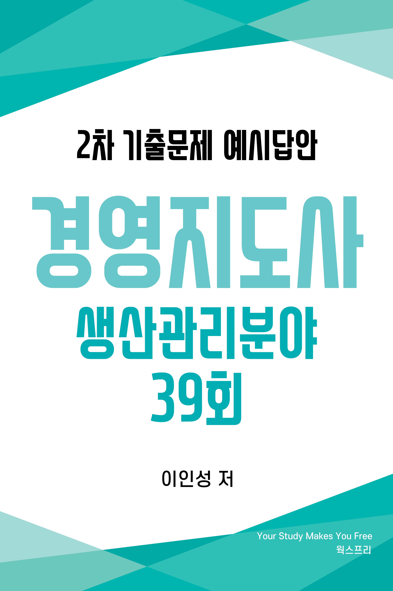
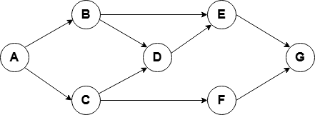
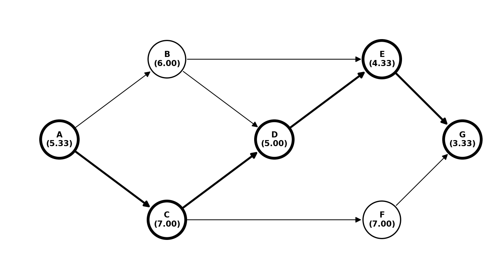
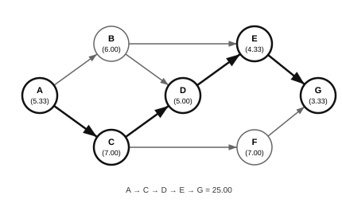
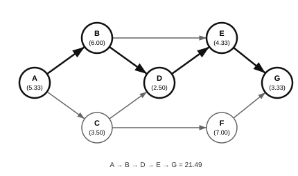
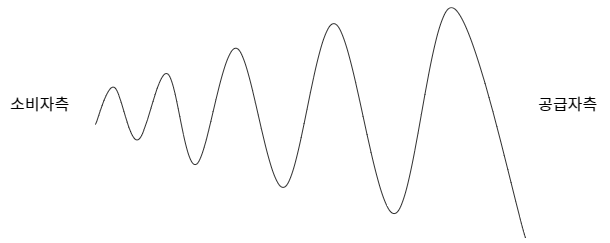
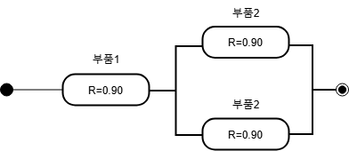
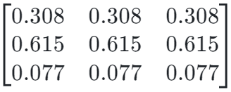
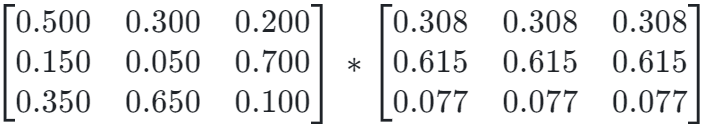



# 저자 소개
<ul>
    <li>경영지도사 생산관리분야</li>
    <li>자동화 장비 제조업 프로세스 개선 내부 컨설팅 경력</li>
    <li>제조업 설계 및 MCT 단순 반복 업무 자동화(RPA) 프로그램 개발
        <a href="https://www.worksfree.com">
        <figure style="float: right"><figcaption style="text-align: center;">RPA Site</figcaption></figure>
        </a>
        <ul>
            <li>어셈블리 BOM 엑셀 저장 자동화 프로그램</li>
            <li>8만 여개 구매품 속성 2주만에 정리하기</li>
            <li>이드로잉스 뷰어 대량 출력 자동화 프로그램</li>
            <li>구글 드라이브 기반 인터넷 정보 자동 업데이트</li>
            <li>자동화(RPA) 프로그램은 우측 QR 또는 아래 URL 참고 <a href="https://www.worksfree.com">https://www.worksfree.com</a></li>
        </ul>
    </li>
    <li>소프트웨어 분야 개발 및 PM 경력</li>
    <li>프로젝트 관리 전문가(PMP from PMI)</li>
    <li>IITP 평가위원, NIPA 평가위원</li>
    <li>OIIA DX/AX 진단 컨설팅 위원</li>
    <li>2025년 예비창업패키지 사업자 선정 및 1단계, 2단계 수행</li>
</ul>

# 교재 소개
- 본 교재는 필자가 경영지도사 2차 수험 생활을 하며 기출문제를 풀고 아래 명시된 수험 교재 학습 및 인터넷 정보를 참조하여 정리한 내용입니다.
  * 생산관리 : 생산운영관리 [법문사]
  * 품질경영 : 품질경영론 [KSAM]
  * 경영과학 : 4차 산업혁명 시대의 EXCEL 경영과학 [박영사]
- 목차는 3 페이지에 제공되며 본문 내의 파랑색으로 보이는 모든 문구는 문서 내부 링크로서 클릭하면 문제, 예시답안, 목차로 이동합니다.
- 예시답안은 설명을 위해 단계별로 내용이 작성되어 불필요하게 긴 예시답안이 있는데 실제 답안 작성시에는 꼭 필요한 경우만 풀이 과정을 단계별로 작성해도 됩니다.
- 예시답안의 내용에 대한 개정 의견이나 시험 관련된 문의 사항은 아래 이메일로 보내주시기 바라며 수험생들의 고득점을 기원합니다.
- 자격시험 합격 후 동차 예시답안 출판에 관심 있는 분은 이메일로 연락 바랍니다.
- <a href="mailto:insung.lee@worksfree.kr">이메일 : insung.lee@worksfree.kr</a>

# 
 39회 목차 

## [39회 생산관리 목차](#39회-생산관리)
- [[문제1] 구매 총비용](#39회-생산관리-문제-1)
- [[문제2] PERT/CPM](#39회-생산관리-문제-2)
- [[문제3] 서비스 설계](#39회-생산관리-문제-3)
- [[문제4] 생산 프로세스](#39회-생산관리-문제-4)
- [[문제5] JIT와 MRP 생산방식의 비교](#39회-생산관리-문제-5)
- [[문제6] 공급사슬의 채찍효과](#39회-생산관리-문제-6)

## [39회 품질경영 목차](#39회-품질경영)
- [[문제1] 서비스품질](#39회-품질경영-문제-1)
- [[문제2] 공정능력 지수와 실제 공정능력 지수](#39회-품질경영-문제-2)
- [[문제3] 품질경영 - 가빈, KS Q ISO 9000](#39회-품질경영-문제-3)
- [[문제4] 신뢰성](#39회-품질경영-문제-4)
- [[문제5] 품질비용(quality cost)](#39회-품질경영-문제-5)
- [[문제6] 샘플링 검사 - 생산자위험, 소비자위험](#39회-품질경영-문제-6)

## [39회 경영과학 목차](#39회-경영과학)
- [[문제1] 선형계획법](#39회-경영과학-문제-1)
- [[문제2] AHP 의사결정](#39회-경영과학-문제-2)
- [[문제3] 정수계획법](#39회-경영과학-문제-3)
- [[문제4] 대기행렬](#39회-경영과학-문제-4)
- [[문제5] 균형수송모델](#39회-경영과학-문제-5)
- [[문제6] 의사결정기준](#39회-경영과학-문제-6)

# 39회 생산관리 문제

## 39회 생산관리 문제 1
<!-- SRC:생산관리/문제1.md -->
### 【문제 1】 단독 공급자(제조업체)와 단독 구매자(소매상)로 구성된 2단계 공급사슬에 관한 설명이다. 다음 물음에 답하시오. (30점)

<table><tr><td class="custome-td">
제조업체는 전통적으로 제품을 1,000원/개에 판매하여 왔으나 다음과 같은 새로운 가격정책을 실시하려고 계획한다. 공급자와 구매자 사이에 거래되는 제품은 하나이고, 제품의 주당 평균 수요는 30개이다.
  
-가격정책 1: 구매자가 매주 주문을 하는 경우에는 제품을 950원/개에 판매하는 정책
 
-가격정책 2: 구매자가 매분기 주문을 하는 경우에는 기준가격 1,000원/개에서 9%를 &emsp;&emsp;&emsp;&emsp;&emsp;&emsp; 할인하여 주는 정책
  
구매자가 제품을 주문한 후 배달되는데 걸리는 시간은 1주일이며, 구매자가 가격정책에 따라 매주(혹은 분기) 끝나는 시점에 재고를 확인해보면 평균적으로 한 주 수요량의 재고가 있다고 가정한다. 주당 재고유지 비용은 재고가치의 0.4%이고 1년은 52주로 가정한다.
</td></tr></table>

(1) 구매자가 가격정책 1을 선택한다고 가정할 때, 구매자의 평균 주문량, 연간구매비용의 기댓값, 그리고 연간 재고 유지비용의 기댓값을 구하시오. (13점)

(2) 구매자가 가격정책 2를 선택하고 할인된 가격에만 구매를 한다고 가정할 때, 구매자의 평균 주문량, 연간 구매비용의 기댓값, 그리고 연간 재고 유지비용의 기댓값을 구하시오. (13점)

(3) 구매자의 총비용(연간 구매 및 재고 유지비의 합)이 적은 가격 정책을 기술하시오. (4점)
<!-- /SRC:생산관리/문제1.md -->

<a href="#39회-생산관리-문제-1-예시답안-30점">예시답안 바로가기</a><a href="#39회-생산관리-목차">목차 바로가기</a>

## 39회 생산관리 문제 2
<!-- SRC:생산관리/문제2.md -->
<!-- 
 -->
### 【문제 2】 다음 그림은 어떤 과업에 대한 PERT 네트워크를 작성한 것이다. 과업을 구성하는 7개의 세부 활동에 대한 사항은 아래의 표와 같을 때 각 물음에 답하시오. (단, 소수점 셋째자리에서 반올림하여 소수점 둘째자리까지 구한다.) (30점)

 
<table>
  <tr> <th rowspan="2">번호</th><th rowspan="2">활동</th><th rowspan="2">선행활동</th><th colspan="3">소요시간(단위: 일)</th> </tr>
  <tr> <th>낙관적 시간</th><th>최빈 시간</th><th>비관적 시간</th> </tr>
  <tr> <td>1</td> <td>A</td> <td>-</td> <td>4</td> <td>5</td> <td>8</td> </tr>
  <tr> <td>2</td> <td>B</td> <td>A</td> <td>3</td> <td>6</td> <td>9</td> </tr>
  <tr> <td>3</td> <td>C</td> <td>A</td> <td>4</td> <td>7</td> <td>10</td> </tr>
  <tr> <td>4</td> <td>D</td> <td>B, C</td> <td>2</td> <td>5</td> <td>8</td> </tr>
  <tr> <td>5</td> <td>E</td> <td>B, D</td> <td>2</td> <td>4</td> <td>8</td> </tr>
  <tr> <td>6</td> <td>F</td> <td>C</td> <td>4</td> <td>7</td> <td>10</td> </tr>
  <tr> <td>7</td> <td>G</td> <td>E, F</td> <td>2</td> <td>3</td> <td>6</td> </tr>
</table>

(*) 표준정규분포표, $\Phi(z) = P(Z<z)$ 
<table>
  <tr><th>z</th><th>0.0</th><th>0.5</th><th>1.0</th><th>1.5</th><th>2.0</th><th>2.5</th><th>3.0</th></tr>
  <tr><td> ϕ (z)</td><td>0.5000</td><td>0.6915</td><td>0.8413</td><td>0.9332</td><td>0.9772</td><td>0.9938</td><td>0.9987</td></tr>
</table>

(1) 주경로와 과업 소요시간의 기댓값 및 분산을 구하시오. (20점)

(2) 이 과업이 28일 이내에 완료될 확률을 정규분포를 가정하여 구하시오. (단, 위에 주어진 표준정규분포표를 참고하되 필요할 경우 근사치를 이용하시오.) (5점)

(3) 추가 비용을 투입하여 활동 C와 D의 소요시간을 절반씩 단축시킬 수 있다고 한다. 이 때 단축되는 과업 소요시간의 기댓값을 구하시오. (5점)
<!-- /SRC:생산관리/문제2.md -->

<a href="#39회-생산관리-문제-2-예시답안-30점">예시답안 바로가기</a><a href="#39회-생산관리-목차">목차 바로가기</a>

## 39회 생산관리 문제 3
<!-- SRC:생산관리/문제3.md -->
### 【문제 3】 현장 서비스 전달을 위한 서비스 설계와 관련하여 다음 물음에 답하시오. (10점)

(1) 서비스 설계의 유형을 2가지만 쓰고, 각각 설명하시오. (6점)

(2) 서비스 청사진과 가시선 경계에 대해 각각 설명하시오. (4점)
<!-- /SRC:생산관리/문제3.md -->

<a href="#39회-생산관리-문제-3-예시답안-10점">예시답안 바로가기</a><a href="#39회-생산관리-목차">목차 바로가기</a>

## 39회 생산관리 문제 4
<!-- SRC:생산관리/문제4.md -->
### 【문제 4】 4가지 단계(자원)로 구성된 생산 프로세스에 관하여 다음 물음에 답하시오. (단, 하루 8시간 작업한다고 가정한다.) (10점)

<table>
  <tr> <th>단계(자원)</th> <th>처리시간(분/단위)</th> </tr>
  <tr> <td>1</td> <td>1</td> </tr>
  <tr> <td>2</td> <td>3</td> </tr>
  <tr> <td>3</td> <td>4</td> </tr>
  <tr> <td>4</td> <td>2</td> </tr>
</table>

(1) 현 생산 프로세스의 일 최대 생산량을 구하시오. (4점)

(2) 현 생산 프로세스에서 1단계 처리시간을 1분에서 2분으로 늘리고, 2단계 처리시간을 3분에서 2분으로 줄였을 때, 생산 프로세스의 생산량 변화를 설명하시오. (3점)

(3) 현 생산 프로세스에서 4단계 처리시간을 2분에서 3분으로 늘리고, 3단계 처리시간을 4분에서 3분으로 줄였을 때, 생산 프로세스의 생산량 변화를 설명하시오. (3점)
<!-- /SRC:생산관리/문제4.md -->

<a href="#39회-생산관리-문제-4-예시답안-10점">예시답안 바로가기</a><a href="#39회-생산관리-목차">목차 바로가기</a>

## 39회 생산관리 문제 5
<!-- SRC:생산관리/문제5.md -->
<!-- html 방식 원문자 표기 방식 출처
https://madinthe90.tistory.com/69 -->
### 【문제 5】 아래 표는 JIT와 MRP 생산방식을 항목별로 비교한 것이다. ①∼⑩에타당한 내용을 ‘비고’에서 선택하여 쓰시오. (10점)

<table>
  <tr> <th>비교항목</th> <th>JIT</th> <th>MRP</th> <th>비고</th> </tr>
  <tr> <td>시스템</td> <td>&#9312</td> <td>&#9313</td> <td>Push, Pull</td> </tr>
  <tr> <td>관리목표</td> <td>&#9314</td> <td>&#9315</td> <td>계획 및 통제, 낭비제거</td> </tr>
  <tr> <td>공급자 관계</td> <td>&#9316</td> <td>&#9317</td> <td>장기적, 단기적</td> </tr>
  <tr> <td>로트크기(Lot Size)</td> <td>&#9318</td> <td>&#9319</td> <td>최소량, EOQ</td> </tr>
  <tr> <td>품질</td> <td>&#9320</td> <td>&#9321</td> <td>무결점 추구, 불량인정</td> </tr>
</table>
<!-- /SRC:생산관리/문제5.md -->

<a href="#39회-생산관리-문제-5-예시답안-10점">예시답안 바로가기</a><a href="#39회-생산관리-목차">목차 바로가기</a>

## 39회 생산관리 문제 6
<!-- SRC:생산관리/문제6.md -->
### 【문제 6】 공급사슬의 채찍효과에 관하여 다음 물음에 답하시오. (10점)

(1) 채찍효과를 설명하고 그림으로 묘사하시오. (4점)

(2) 채찍효과가 나타나는 원인을 3가지만 제시하시오. (3점)

(3) 채찍효과에 대처하는 방안을 3가지만 제시하시오. (3점)
<!-- /SRC:생산관리/문제6.md -->

<a href="#39회-생산관리-문제-6-예시답안-10점">예시답안 바로가기</a><a href="#39회-생산관리-목차">목차 바로가기</a>

# 39회 생산관리 예시답안

## 39회 생산관리 문제 1 예시답안 (30점)

<!-- SRC:생산관리/예시답안1.md -->
### 【문제 1 - (1)】 가격정책 1: 매주 주문 (13점)
1. 구매자의 평균 주문량 ($Q$)은 평균 수요량과 같음: $30$개
2. 연간 구매 비용 기댓값 ($C_1$​): 평균 주문량 $\times$ 제품가격 $\times 52$주 $= 30\times950 \times 52 = 1,482,000$ 원
3. 연간 재고 유지 비용 ($H_1$​):
  * 평균 재고: $30$개 **(문제에서 매주 말 평균 재고는 한 주 수요량이라고 주어짐)**
  * 주당 재고 유지 비용 = 평균 재고 $\times$ 제품가격 $\times$ 주당 재고유지 단위비용 $= 30 \times 950 \times 0.004 = 114$ 원
  * 연간 재고 유지 비용: 주당 재고 유지 비용 $\times 52$주 $= 114 × 52 = 5,928$ 원
    
### 【문제 1 - (2)】 가격정책 2: 매분기 주문 (13점)
1. 구매자의 평균 주문량 ($Q$): 분기($\cfrac{52}{4}$)는 $13$주이므로 $30 × 13 = 390$ 개
1. 연간 구매 비용 기댓값 ($C_2$​): 평균 주문량 $\times$ 제품가격 $\times$ 주문회수 $= 390 × 910 × 4 = 1,419,600$ 원
1. 연간 재고 유지 비용 ($H_2$​):
  * 평균 재고: $30$개 (문제에서 분기 말 평균 재고는 한 주 수요량이라고 주어짐)
  * 주당 재고 유지 비용 = 평균 재고 $\times$ 제품가격 $\times$ 주당 재고유지 단위비용 $= 30 \times 910 \times 0.004 = 109.2$ 원 **(문제에서 분기당 재고 유지비용은 제시하지 않았고 추정할 수 있는 근거 자료가 없으므로 주 단위로 계산)**
  * 연간 재고 유지 비용: 주당 재고 유지 비용 $\times 52$주 $= 109.2 × 52 = 5,678.4$ 원

### 【문제 1 - (3)】 총비용(연간 구매 및 재고 유지비의 합) 비교 (4점)
각 가격정책의 총비용을 계산합니다.
- 가격정책 1의 총비용:
총비용 $1 = C_1 + H_1 = 1,482,000 + 5,928 = 1,487,928$원
- 가격정책 2의 총비용:
총비용 $2 = C_2 + H_2 = 1,419,600 + 5,678.4 = 1,425,278.4$원
- 결론
  - 구매자의 총비용이 적은 가격정책은 가격정책 2입니다.
  - 따라서 구매자는 가격정책 2를 선택하는 것이 더 비용 효율적입니다.
  
<!-- <table><tr><th colspan=2>학습 및 해설 자료</th><tr>
<tr><td>재고모형</td><td>
총 비용 = 연간 재고유지비용 + 연간 주문비용 

$TC = \cfrac{Q}{2}$ $\times H +$ $\cfrac{D}{Q}$ $\times S$
</td></tr>
<tr><td>할인모형</td><td>
총 비용 = 연간 재고유지비용 + 연간 주문비용 + 연간 구매비용 

$TC = \cfrac{Q}{2}$ $\times H +$ $\cfrac{D}{Q}$ $\times S + P\times D$
</td></tr>
<tr><td colspan=2 class="custome-td">
본 문제에서는 가격 정책에 연간 구매비용이 달라지므로 할인모형을 적용하여 총 비용을 계산해야 합니다. 단, 어느 모형을 적용하여도 S에 해당하는 주문비용을 문제에서 제시하지 않았으므로 총 비용은 할인모형에서 연간 재고유지비용과 연간 구매비용의 합계로 산출하였습니다.
</td></tr>
</table> -->
<!-- /SRC:생산관리/예시답안1.md -->

<a href="#39회-생산관리-문제-1">문제 바로가기</a><a href="#39회-생산관리-목차">목차 바로가기</a>

## 39회 생산관리 문제 2 예시답안 (30점)

<!-- SRC:생산관리/예시답안2.md -->
### 【문제 2 - 1】 주경로와 과업 소요시간의 기댓값과 분산 (20점)

<table>
  <tr> <th>번호</th> <th>활동</th> <th>선행활동</th> <th>낙관적 시간 (a)</th> <th>최빈 시간 (m)</th> <th>비관적 시간 (b)</th> <th>기댓값 (TE)</th> <th>분산 (V)</th> </tr>
  <tr> <td>1</td> <td>A</td> <td>-</td> <td>4</td> <td>5</td> <td>8</td> <td>5.33</td> <td>0.44</td> </tr>
  <tr> <td>2</td> <td>B</td> <td>A</td> <td>3</td> <td>6</td> <td>9</td> <td>6.00</td> <td>1.00</td> </tr>
  <tr> <td>3</td> <td>C</td> <td>A</td> <td>4</td> <td>7</td> <td>10</td> <td>7.00</td> <td>1.00</td> </tr>
  <tr> <td>4</td> <td>D</td> <td>B, C</td> <td>2</td> <td>5</td> <td>8</td> <td>5.00</td> <td>1.00</td> </tr>
  <tr> <td>5</td> <td>E</td> <td>B, D</td> <td>2</td> <td>4</td> <td>8</td> <td>4.33</td> <td>1.00</td> </tr>
  <tr> <td>6</td> <td>F</td> <td>C</td> <td>4</td> <td>7</td> <td>10</td> <td>7.00</td> <td>1.00</td> </tr>
  <tr> <td>7</td> <td>G</td> <td>E, F</td> <td>2</td> <td>3</td> <td>6</td> <td>3.33</td> <td>0.44</td> </tr>
</table>

#### 주경로 기댓값과 분산 계산
* 주경로 $A -> C -> D -> E -> G$

* 과업소요시간의 기댓값과 분산
  * 기댓값 $= 5.33 + 7 + 5 + 4.33 + 3.33 \approx 25.00$
  * 분산 $= 0.44 + 1 + 1 + 1 + 0.44 \approx 3.89$

### 【문제 2 - 2】 이 과업이 28일 이내에 완료될 확률 (5점)
* 표준편차 $=  \sqrt{3.89}\approx 1.97$, 따라서 $Z = \cfrac{28-25}{1.97}$ $= 1.52$
* 주어진 정규분포표에서 $Z = 1.52$의 근사치 $1.5$의 값은 약 $0.9332$ 입니다. 따라서, 이 과업이 $28$일 이내에 완료될 확률은 약 **$93.32$%** 입니다.

### 【문제 2 - 3】 활동 C와 D의 소요시간을 절반씩 단축했을 때 (5점)
* $C$와 $D$의 소요시간을 절반씩 단축했을 때 기존의 주경로 $A->C-> D -> E -> G$의 기댓값은 $5.33+3.5+2.5+4.33+3.33=18.99$입니다. 하지만 이 때 경로 $A -> B -> D -> E -> G$의 기댓값은 $5.33+6.00+2.50+4.33+3.33=21.49$입니다. 따라서 주경로가 $A -> B -> D -> E -> G$로 변경되며 새로운 경로 기댓값은 $21.49$입니다.

* **단축되는 과업 소요시간의 기댓값은 $21.49$일** 입니다.
<!-- /SRC:생산관리/예시답안2.md -->

<a href="#39회-생산관리-문제-2">문제 바로가기</a><a href="#39회-생산관리-목차">목차 바로가기</a>

## 39회 생산관리 문제 3 예시답안 (10점)

<!-- SRC:생산관리/예시답안3.md -->
### 【문제 3 - (1)】 서비스 설계 유형 2가지 (6점)

* 생산라인 접근방식:
  * 제조업의 생산라인 개념을 서비스에 적용하는 방식
  * 표준화된 절차와 효율성을 중요시하며, 서비스 프로세스를 순차적이고 체계적으로 설계
  * 대량 고객을 대상으로 하는 서비스에 적합하며, 맥도날드나 은행의 창구 서비스 등에서 주로 활용
  * 일관성 있는 서비스 제공과 비용 절감을 목표로 함

* 고객참여 접근방식
  * 서비스 설계 과정에 고객을 직접 참여시키는 방법
  * 고객의 니즈와 선호도를 직접 반영하여 맞춤형 서비스를 개발
  * 고객의 적극적인 참여를 통해 서비스 품질과 만족도를 향상
  * 뷔페식당, 위키피디아 같은 개발의 고객참여 등에서 활용

### 【문제 3 - (2)】 서비스 청사진과 가시선 경계 (4점)

* 서비스 청사진 (Service Blueprint) : 서비스 청사진은 서비스 전달 과정을 시각적으로 나타낸 도구입니다. 서비스 청사진은 일반적으로 고객 행동, 프런트 스테이지와 백 스테이지 활동, 지원 프로세스 등을 포함합니다. 이를 통해 서비스 제공의 병목 지점, 문제 영역, 프로세스 효율화 등의 서비스 개선 기회를 쉽게 파악할 수 있습니다. 예를 들어, 레스토랑의 서비스 청사진은 예약, 주문, 식사, 결제 등 모든 과정을 도식화하여 서비스 흐름을 시각적으로 나타냅니다.

* 가시선 경계 (Line of Visibility) : 고객이 직접 볼 수 있는 서비스 영역과 보지 못하는 백오피스 영역을 구분하는 선입니다. 이 경계는 서비스 청사진 내에서 고객에게 보이는 부분(프런트 스테이지)과 보이지 않는 부분(백 스테이지)을 구별합니다.
<!-- /SRC:생산관리/예시답안3.md -->

<a href="#39회-생산관리-문제-3">문제 바로가기</a><a href="#39회-생산관리-목차">목차 바로가기</a>

## 39회 생산관리 문제 4 예시답안 (10점)

<!-- SRC:생산관리/예시답안4.md -->
### 【문제 4 - (1)】 일 최대 생산량: (4점)

가장 시간이 많이 걸리는 단계는 3단계(4분)입니다. 따라서 일 최대 생산량은 다음과 같이 계산됩니다.

$일 최대 생산량 = \cfrac{480분}{4분}$ $= 120 단위$

### 【문제 4 - (2)】 1단계를 2분으로 늘리고, 2단계를 2분으로 줄였을 때 생산량 변화 (3점)
여전히 가장 시간이 많이 걸리는 단계는 3단계(4분)입니다. 따라서 일 최대 생산량은 변경되지 않습니다.

$일 최대 생산량 = \cfrac{480분}{4분}$ $= 120 단위$

### 【문제 4 - (3)】 4단계를 2분에서 3분으로 늘리고 3단계를 4분에서 3분으로 줄였을 때 생산량 변화 (3점)
이 경우, 가장 시간이 많이 걸리는 단계는 2단계, 3단계, 4단계 (각각 3분)입니다. 따라서 새로운 일 최대 생산량은 3분을 기준으로 계산합니다.

$일 최대 생산량 = \cfrac{480분}{3분}$ $= 160 단위$
<!-- /SRC:생산관리/예시답안4.md -->

<a href="#39회-생산관리-문제-4">문제 바로가기</a><a href="#39회-생산관리-목차">목차 바로가기</a>

## 39회 생산관리 문제 5 예시답안 (10점)

<!-- SRC:생산관리/예시답안5.md -->
<table>
  <tr> <th>비교항목</th> <th>JIT</th> <th>MRP</th></tr>
  <tr> <td>시스템</td> <td>① Pull</td> <td>② Push</td></tr>
  <tr> <td>관리목표</td> <td>③ 낭비제거</td> <td>④ 계획 및 통제</td></tr>
  <tr> <td>공급자 관계</td> <td>⑤ 장기적</td> <td>⑥ 단기적</td></tr>
  <tr> <td>로트크기(Lot Size)</td> <td>⑦ 최소량</td> <td>⑧ EOQ</td></tr>
  <tr> <td>품질</td> <td>⑨ 무결점 추구</td> <td>⑩ 불량인정</td></tr>
</table>
<!-- /SRC:생산관리/예시답안5.md -->

<a href="#39회-생산관리-문제-5">문제 바로가기</a><a href="#39회-생산관리-목차">목차 바로가기</a>

## 39회 생산관리 문제 6 예시답안 (10점)

<!-- SRC:생산관리/예시답안6.md -->
### 【문제 6 - (1)】 채찍 효과 설명 및 그림 (4점)
채찍효과(Bullwhip Effect)는 공급망에서 작은 수요 변동이 공급사슬의 역방향(소비자측 → 공급자측)으로 갈수록 점점 더 큰 변동으로 증폭되는 현상을 말합니다.

### 【문제 6 - (2)】 채찍 효과가 나타나는 원인 3가지 (3점)
1. 수요 예측의 불확실성: 각 단계에서 수요를 정확히 예측하기 어렵기 때문에, 과잉 주문이나 부족 주문이 발생하고 이러한 오류가 누적되어 채찍효과를 발생시킵니다.
2. 배치 주문 (Batch Ordering): 대량 주문 시 할인 등의 인센티브가 제공되어 각 단계에서 실제 필요한 양보다 더 많은 양을 주문하게 되고, 이는 수요 변동을 더욱 증폭시킵니다.
3. 정보 부족 및 의사소통 오류 : 공급사슬 내 정보가 실시간으로 공유되지 않거나 잘못된 정보로 인해 상위 단계에서 잘못된 의사결정을 내리게 됩니다.

### 【문제 6 - (3)】 채찍 효과에 대처하는 방안 3가지 (3점)
1. 실시간 정보 공유 : 공급사슬 내 모든 구성원이 실시간으로 정확한 수요 정보를 공유하여 수요 변동을 최소화하고, 불필요한 재고를 줄입니다.
2. 공동 수요 예측 : 공급업체, 제조업체, 유통업체 간 긴밀한 협력 관계를 구축하여 공동으로 문제를 해결하고, 수요 변동에 유연하게 대응합니다.
3. Vendor Managed Inventory : 공급업체가 고객의 재고를 관리하고, 필요한 물량을 적시에 공급하는 시스템을 도입하여 재고 비용을 절감하고 수요 변동에 대한 대응력을 높입니다.
<!-- /SRC:생산관리/예시답안6.md -->

<a href="#39회-생산관리-문제-6">문제 바로가기</a><a href="#39회-생산관리-목차">목차 바로가기</a>

# 39회 품질경영 문제

## 39회 품질경영 문제 1
<!-- SRC:품질경영/문제1.md -->
### 【문제 1】 서비스품질에 관하여 다음 물음에 답하시오. (30점)

 (1) 서비스품질의 평가(결정)요소 10가지에 대해 설명하시오. (10점)

 (2) SERVQUAL의 5개 차원과 각 차원의 정의를 쓰시오. (10점)

 (3) 서비스품질의 평가요소 10가지를 SERVQUAL의 5개 차원으로 분류하여 쓰시오. (10점)
<!-- /SRC:품질경영/문제1.md -->

<a href="#39회-품질경영-문제-1-예시답안-30점">예시답안 바로가기</a><a href="#39회-품질경영-목차">목차 바로가기</a>

## 39회 품질경영 문제 2
<!-- SRC:품질경영/문제2.md -->
### 【문제 2】 A기업에서 생산하는 제품의 직경 규격은 3±0.12 cm이다. 직경평균은3.02 cm이고 직경 표준편차는 0.04 cm라고 할 때, 다음 물음에 답하시오. (단, 소수점 셋째자리에서 반올림하여 소수점 둘째자리까지 구한다.) (30점)

 (1) 공정상한(USL)과 공정하한(LSL)을 각각 구하시오. (6점)

 (2) 공정능력지수($C_p$)와 실제 공정능력지수($C_p$$_k$)를 각각 구하시오. (12점)

 (3) 직경 표준편차를 0.02 cm로 개선한 경우, 공정능력지수($C_p$)와 실제 공정능력지수($C_p$$_k$)를 각각 구하시오. (12점)
<!-- /SRC:품질경영/문제2.md -->

<a href="#39회-품질경영-문제-2-예시답안-30점">예시답안 바로가기</a><a href="#39회-품질경영-목차">목차 바로가기</a>

## 39회 품질경영 문제 3
<!-- SRC:품질경영/문제3.md -->
### 【문제 3】 품질경영에 관하여 다음 물음에 답하시오. (10점)

 (1) 가빈(D. Garvin)의 8가지 품질 차원(특성)에 대해 설명하시오. (5점)

 (2) KS Q ISO 9000 : 2015에서 제시하고 있는 품질경영 실현을 위한 7가지 원칙에 대해 설명하시오. (5점)
<!-- /SRC:품질경영/문제3.md -->

<a href="#39회-품질경영-문제-3-예시답안-10점">예시답안 바로가기</a><a href="#39회-품질경영-목차">목차 바로가기</a>

## 39회 품질경영 문제 4
<!-- SRC:품질경영/문제4.md -->
### 【문제 4】 신뢰성에 관하여 다음 물음에 답하시오. (단, 소수점 셋째자리에서 반올림하여 소수점 둘째자리까지 구한다.) (10점)

(1) A제품은 다음과 같이 2개 부품의 직렬배열로 구성된다. 각 부품의 신뢰성이 0.90일 때, A제품의 신뢰성을 구하시오. (5점)

(2) A제품의 신뢰성을 제고하기 위해 다음과 같이 부품2를 병렬 배치하였다. 각 부품의 신뢰성이 0.90일 때, A제품의 신뢰성을 구하시오. (5점)

<!-- /SRC:품질경영/문제4.md -->

<a href="#39회-품질경영-문제-4-예시답안-10점">예시답안 바로가기</a><a href="#39회-품질경영-목차">목차 바로가기</a>

## 39회 품질경영 문제 5
<!-- SRC:품질경영/문제5.md -->
### 【문제 5】품질비용(quality cost)에 관하여 다음 물음에 답하시오. (10점)

 (1) 품질비용의 정의를 기술하시오. (3점)

 (2) 1:10:100 원칙(법칙)에 대해 설명하시오. (3점)

 (3) 품질비용을 구성하는 4가지 비용에 대해 설명하시오. (4점)
<!-- /SRC:품질경영/문제5.md -->

<a href="#39회-품질경영-문제-5-예시답안-10점">예시답안 바로가기</a><a href="#39회-품질경영-목차">목차 바로가기</a>

## 39회 품질경영 문제 6
<!-- SRC:품질경영/문제6.md -->
### 【문제 6】 샘플링검사에 관하여 다음 물음에 답하시오. (10점)

 (1) 생산자위험에 대해 설명하시오. (5점)

 (2) 소비자위험에 대해 설명하시오. (5점)
<!-- /SRC:품질경영/문제6.md -->

<a href="#39회-품질경영-문제-6-예시답안-10점">예시답안 바로가기</a><a href="#39회-품질경영-목차">목차 바로가기</a>

# 39회 품질경영 예시답안

## 39회 품질경영 문제 1 예시답안 (30점)

<!-- SRC:품질경영/예시답안1.md -->
### 【문제 1 - (1)】 서비스품질의 평가(결정) 요소 10가지 (13점)
1. **유형성 (Tangibles)**: 서비스와 관련된 물리적 설비, 장비, 직원의 외모 등 눈에 보이는 부분.
2. **신뢰성 (Reliability)**: 서비스가 일관되고 정확하게 제공되는 능력.
3. **대응성 (Responsiveness)**: 고객의 요구에 신속하고 적극적으로 대응하는 능력.
4. **적임성 (Competence)**: 직원이 필요한 기술과 지식을 가지고 있는지, 이를 통해 서비스가 전문적으로 제공되는지.
5. **예절성 (Courtesy)**: 직원의 정중한 태도, 친근감, 호의적 배려.
6. **신용성 (Credibility)**: 서비스 제공자가 정직하고 신뢰할 수 있는지에 대한 인식.
7. **안전성 (Security)**: 서비스 이용 중에 위험이나 의심 없이 안전하다고 느끼는지.
8. **접근성 (Access)**: 서비스를 이용하기 쉽고 편리한 정도.
9. **소통성 (Communication)**:고객과 명확하고 이해할 수 있는 방식으로 소통하는 능력
10. **고객이해(Understanding the Customer)**: 고객의 특정한 요구사항을 이해하고 개별적으로 관심을 기울이는 정도.

### 【문제 1 - (2)】 SERVQUAL의 5개 차원과 각 차원의 정의 (13점)
1. **신뢰성 (Reliability)**: 약속된 서비스를 정확하고 일관되게 수행할 수 있는 능력.
2. **대응성 (Responsiveness)**: 고객의 요구에 대해 신속하고 기꺼이 응대하는 자세.
3. **확신성 (Assurance)**:직원의 지식, 능력, 예의 바른 태도를 통해 고객에게 신뢰와 안전감을 주는 능력.
4. **공감성 (Empathy)**:고객의 개별적 요구와 상황을 이해하고 맞춰주는 배려와 관심.
5. **유형성 (Tangibles)**: 서비스 제공자의 물리적 시설, 장비, 직원의 외모, 커뮤니케이션 도구 등의 외형적 요소.

### 【문제 1 - (3)】 서비스품질의 평가요소 10가지를 SERVQUAL의 5개 차원으로 분류 (4점)
<table>
  <tr><th>SERVQUAL 차원</th><th>서비스품질 평가요소</th></tr>
  <tr><td>신뢰성</td><td>신뢰성</td></tr>
  <tr><td>대응성</td><td>대응성</td></tr>
  <tr><td>확신성</td><td>적임성, 예절성, 신용성, 안정성</td></tr>
  <tr><td>공감성</td><td>접근성, 소통성, 고객이해</td></tr>
  <tr><td>유형성</td><td>유형성</td></tr>
</table>
<!-- /SRC:품질경영/예시답안1.md -->

<a href="#39회-품질경영-문제-1">문제 바로가기</a><a href="#39회-품질경영-목차">목차 바로가기</a>

## 39회 품질경영 문제 2 예시답안 (30점)

<!-- SRC:품질경영/예시답안2.md -->
### 【문제 2 - (1)】 공정상한과 공정하한 (6점)
* 공정 상한 (Upper Specification Limit, USL) $= 3 + 0.12 = 3.12$
* 공정 하한 (Lower Specification Limit, LSL) $= 3 - 0.12 = 2.88$

### 【문제 2 - (2)】 $C_p$와 $C_p$$_k$ (12점)
* USL $= 3.12$, &emsp;&emsp;&emsp;&emsp;&emsp;&emsp;&emsp;&emsp; LSL $= 2.88$, &emsp;
* 평균 $= 3.02$, &emsp;&emsp;&emsp;&emsp;&emsp;&emsp;&emsp;&emsp;표준편차 $= 0.04$

* $C_p$ = $\cfrac{(USL-LSL)}{6σ} = \cfrac{(3.12-2.88)}{6 * 0.04} = \normalsize 1.00$

* $k = \cfrac{| (USL+LSL)/2 - \mu |}{(USL-LSL)/2} = \cfrac{|(3.12+2.88)/2 - 3.02|}{(3.12-2.88)/2}  = \normalsize 0.167$

* $C_p$$_k = (1-k)C_p = (1-0.167) * 1 = 0.833 \approx 0.83$

* $C_p$는 $1.00$, $C_p$$_k$는 $0.83$ 입니다.

### 【문제 2 - (3)】 직경의 표준편차를 0.02로 개선한 경우 $C_p$와 $C_p$$_k$ 값 (12점)
* USL $= 3.12$, &emsp;&emsp;&emsp;&emsp;&emsp;&emsp;&emsp;&emsp; LSL $= 2.88$

* 평균 $= 3.02$, &emsp;&emsp;&emsp;&emsp;&emsp;&emsp;&emsp;&emsp;새로운 표준편차 $= 0.02$

직경의 표준편차를 $0.02$로 개선한 경우 계산된 $C_p$와 $C_p$$_k$ 값은 다음과 같습니다:

$C_p$ = $\cfrac{(USL-LSL)}{6σ} = \cfrac{(3.12-2.88)}{6 * 0.02} = \normalsize2.00$

$C_p$$_k = (1-0.167) * 2 = 1.666 \approx 1.67$

* $C_p = 2.00$
  * 이는 공정의 변동성이 크게 줄어들어 잠재적으로 규격 한계 내에서 매우 일관되게 생산할 수 있음을 나타냅니다.
* $C_p$$_k = 1.67$
  * 이는 공정 평균이 규격 중심에 더욱 가까워져 공정 성능이 크게 개선되었음을 나타냅니다. 공정이 규격 한계 내에서 일관되게 유지되고 있음을 의미합니다. 따라서 표준편차를 개선함으로써 공정 능력이 크게 향상되었습니다.
<!-- /SRC:품질경영/예시답안2.md -->

<a href="#39회-품질경영-문제-2">문제 바로가기</a><a href="#39회-품질경영-목차">목차 바로가기</a>

## 39회 품질경영 문제 3 예시답안 (10점)

<!-- SRC:품질경영/예시답안3.md -->
<!-- 
 -->
### 【문제 3 - (1)】 가빈(D. Garvin)의 8가지 품질 차원(특성) (6점)
1. 성능: 제품의 주요 기능과 작동 특성을 평가하는 핵심적인 품질 차원으로 자동차의 가속력, 속도, 연비 등이 해당합니다.
2. 특성: 기본 기능 외 추가로 제공되는 부가적이고 차별화된 속성으로 스마트폰의 카메라 화소수, 추가 애플리케이션 등이 해당합니다.
3. 신뢰성: 제품이 일정 기간 동안 고장 없이 의도된 기능을 수행하는 능력으로 고장률 등이 해당됩니다.
4. 적합성: 제품이 설계 또는 표준 규격을 충족하는 수준으로 제조 공정에서의 공차 준수, 규격 부품 사용 등이 해당합니다.
5. 내구성: 제품이 오래 사용될 수 있는 능력으로 가구의 수명, 타이어의 마모 저항 등이 해당합니다.
6. 서비스 가능성: 제품 고장 시 수리와 유지보수의 신속성과 용이성으로 자동차의 수리 용이성, 애프터 서비스의 질 등이 해당합니다.
7. 심미성: 제품의 외관, 느낌, 감각적 측면에 대한 주관적 평가로 가전제품의 디자인, 색상 등이 해당합니다.
8. 인지된 품질: 소비자가 주관적으로 인식하는 브랜드와 제품의 전반적 품질로 브랜드 이미지, 사용자 리뷰 등이 해당합니다.

### 【문제 3 - (2)】 KS Q ISO 9000:2015 품질경영 실현 7가지 원칙 (4점)
1. 고객 중심: 모든 조직 활동은 고객 요구와 기대를 충족시키는 데 초점을 맞추어야 합니다. 고객 만족은 품질경영의 최우선 목표입니다.
2. 리더십: 조직의 리더는 명확한 비전과 방향을 제시하고, 조직의 목표를 달성하기 위해 직원들이 함께 일할 수 있는 환경을 조성해야 합니다.
3. 전원 참여: 조직의 모든 계층에서 인원들의 능력을 최대한 발휘하도록 장려하고, 참여를 유도해야 합니다. 직원의 참여와 협력은 조직의 성공에 필수적입니다.
4. 프로세스 접근 방식: 조직 활동을 상호 연관된 프로세스로 인식하고 관리해야 합니다.
5. 개선: 조직은 개선 기회를 지속적으로 탐색하고, 이를 실행해야 합니다.
6. 증거 기반 의사결정: 데이터와 정보 분석을 기반으로 한 의사결정은 조직의 성과를 향상시키고, 효과적인 문제 해결을 가능하게 합니다.
7. 관계 관리: 조직은 공급자, 파트너 등의 이해관계자와의 상호 이익을 위한 협력적 관계 구축해야 합니다.

<!-- 
 -->
<!-- /SRC:품질경영/예시답안3.md -->

<a href="#39회-품질경영-문제-3">문제 바로가기</a><a href="#39회-품질경영-목차">목차 바로가기</a>

## 39회 품질경영 문제 4 예시답안 (10점)

<!-- SRC:품질경영/예시답안4.md -->
### 【문제 4 - (1)】 직렬 (5점)

전체 시스템 신뢰도 $= 0.90 \times 0.90 = 0.81$

### 【문제 4 - (2)】 병렬 (5점)

병렬 결합된 부품2 부분의 신뢰도 $= 1 - (1 - 0.90) \times (1 - 0.90) = 0.99$

전체 시스템 신뢰도 $= 0.90 \times 0.99 = 0.89$
<!-- /SRC:품질경영/예시답안4.md -->

<a href="#39회-품질경영-문제-4">문제 바로가기</a><a href="#39회-품질경영-목차">목차 바로가기</a>

## 39회 품질경영 문제 5 예시답안 (10점)

<!-- SRC:품질경영/예시답안5.md -->
### 【문제 5 - (1)】 품질비용의 정의 (3점)
* 품질비용은 제품이나 서비스의 품질을 유지하거나 보증하기 위해 발생하는 모든 비용을 의미합니다. 즉, 좋은 품질을 달성하고 유지하기 위해 기업에서 투입하는 직접적, 간접적인 비용을 포함합니다. 이는 품질과 관련된 예방, 평가, 내부실패, 외부실패에 소요되는 비용을 총칭합니다.

### 【문제 5 - (2)】 1:10:100 원칙(법칙) (3점)
* 제품 개발 초기에 품질 문제를 예방하는 데 들어가는 비용이 1단위라면 초기에 제대로 하지 않아서 생산 중 품질 문제를 발견하고 해결하는 데 드는 비용은 10단위이고 고객에게 제품이 전달된 후 발생된 품질 문제를 해결하는데 드는 비용은 100단위가 발생한다는 원칙입니다. 이 원칙은 문제가 발견되는 단계가 늦어질수록 비용이 기하급수적으로 증가하므로 초기 예방이 가장 경제적이고 효율적인 품질관리 방법임을 시사합니다.

### 【문제 5 - (3)】 품질비용을 구성하는 4가지 비용 (4점)
1. 예방비용 (Prevention Cost): 품질 문제를 사전에 방지하기 위해 투입되는 비용으로 품질 계획, 품질 교육, 품질 설계, 예방적 유지보수 등에 소요되는 비용이 해당됩니다.
2. 평가비용 (Appraisal Cost): 제품이 요구사항을 충족하는지 확인하기 위해 수행되는 검사와 테스트 관련 비용으로 제품 검사, 성능 테스트, 품질 감사, 측정 및 검증 활동 등에 드는 비용이 해당됩니다.
3. 내부실패비용 (Internal Failure Cost): 제품이 고객에게 전달되기 전 발견된 품질 결함으로 인해 발생하는 비용으로 불량품 폐기, 재작업, 수정, 재검사 등에 소요되는 비용이 해당됩니다.
4. 외부실패비용 (External Failure Cost): 제품이 고객에게 전달된 후 발견된 품질 결함으로 인해 발생하는 비용으로 제품 보증, 클레임 처리, 반품, 고객 보상, 평판 손실 등에 드는 비용이 해당됩니다.
<!-- /SRC:품질경영/예시답안5.md -->

<a href="#39회-품질경영-문제-5">문제 바로가기</a><a href="#39회-품질경영-목차">목차 바로가기</a>

## 39회 품질경영 문제 6 예시답안 (10점)

<!-- SRC:품질경영/예시답안6.md -->
### 【문제 6 - (1)】 생산자위험 (5점)
합격 처리 되었어야 하는 로트가 불합격 처리되는 경우를 의미합니다.
실제로 양품인 로트(생산물)를 샘플링 검사에서 불량품으로 잘못 판정하여 생산자가 손해를 입는 위험을 말합니다. 이를 통계적으로는 제1종 오류(Type I Error)라고 하며, 보통 α(alpha)로 표시됩니다. 생산자위험은 생산자가 실제로 좋은 품질의 제품을 생산했음에도 불구하고 검사에서 이를 통과하지 못해 불필요한 재작업이나 폐기를 해야 하는 상황을 의미합니다.

### 【문제 6 - (2)】 소비자위험 (5점)
불합격 처리가 되었어야 하는 로트가 합격 처리되는 경우를 의미합니다.
실제로 불량인 로트를 샘플링 검사에서 양품으로 잘못 판정하여 소비자가 손해를 입는 위험을 말합니다. 이를 통계적으로는 제2종 오류(Type II Error)라고 하며, 보통 β(beta)로 표시됩니다. 소비자위험은 불량품이 시장에 출하되어 소비자가 이를 구매하게 되는 상황을 의미하며, 이는 소비자의 불만과 신뢰 손실을 초래할 수 있습니다.
<!-- /SRC:품질경영/예시답안6.md -->

<a href="#39회-품질경영-문제-6">문제 바로가기</a><a href="#39회-품질경영-목차">목차 바로가기</a>

# 39회 경영과학 문제

## 39회 경영과학 문제 1
<!-- SRC:경영과학/문제1.md -->
### 【문제 1】 최근 여유자금 10억 원이 생긴 A씨는 다음 4 가지 투자 대안을 고민하다가 두 명의 전문가에게 투자자문을 받았다 투자 전문가 B는 유동성 확보를 위해 저축에 대한 투자는 전체 투자금의 30% 이상으로 하고 주식과 선물에 투자금 합은 전체 투자금의 50%를 넘지 않아야 한다고 자문하였으며 투자 전문가 C는 전문가 B의 전문 내용과 동일한 조건을 자문하는 동시에 추가적으로 채권과 선물에 투자금 합은 전체 투자금의 60%를 넘지 않아야 한다고 자문하였다. A씨의 가용한 투자금 제약 조건이 10억 원인 상황에서 수익을 최대화하기 위한 투자계획 문제에 대해 다음 물음에 답하시오. (30점)

<table>
  <tr> <th width=100>투자 대안</th> <th width=100>수익률</th> </tr>
  <tr> <td>주식</td> <td align:center>10%</td> </tr>
  <tr> <td>채권</td> <td align:center>12%</td> </tr>
  <tr> <td>선물</td> <td>25%</td> </tr>
  <tr> <td>저축</td> <td>5%</td> </tr>
</table>

 (1) 전문가 B의 자문 내용을 준수하는 투자계획 문제를 선형계획법 모형으로 제시하시오.(단, 의사결정 변수는 $X_i (i=1, 2, 3, 4)$로 표시하고 목적함수값은 $Z_B$로 표시할 것) (10점)

 (2) 전문가 C의 자문 내용을 준수하는 투자계획 문제를 선형계획법 모형으로 제시하시오. (단, 의사결정 변수는 $X_i (i=1, 2, 3, 4)$로 표시하고 목적함수값은 $Z_C$로 표시할 것) (6점)

 (3) (1)과 (2)의 $Z_B$와 $Z_C$ 크기를 비교하여 부등식으로 표현하고 그 이유를 설명하시오. (8점)

 (4) (1)의 선형계획법 모형에서 ‘가용한 투자금 제약조건’에 우변 상수 10억 원에 대한 민감도 분석 결과, 쌍대값(잠재가격)이 1,640만원으로 나타났다. 이 값의 의미를 설명하시오. (6점)
<!-- /SRC:경영과학/문제1.md -->

<a href="#39회-경영과학-문제-1-예시답안-30점">예시답안 바로가기</a><a href="#39회-경영과학-목차">목차 바로가기</a>

## 39회 경영과학 문제 2
<!-- SRC:경영과학/문제2.md -->
### 【문제 2】 자동차 부품을 생산하는 K 제조업체는 추가적으로 공장을 집계로 결정하고 여러 장소를 물색하여 세 군데에 공장 입지 후보(A, B, C)를 도출하였다. 입지 선택을 위하여 AHP 방법론을 적용하고자 하는데 세 가지 기준(투자 비용, 물류 효율성, 고객 접근성)을 고려하고 있다. 다음 물음에 답하시오. (단, 계산 과정을 쓰고 모든 계산은 소수점 넷째 자리에서 반올림하여 소수점 셋째자리까지 구한다.) (30점)

 (1) 업체는 세 가지 기준에 대하여 다음과 같은 쌍대비교 행렬표(pairwise comparison matrix)를 도출하였다. 3가지 기준에 대한 상대적 중요도를 구하시오.(15점)

<table>
  <tr> <th>기준</th> <th>투자 비용</th> <th>물류 효율성</th> <th>고객 접근성</th> </tr>
  <tr> <td>투자 비용</td> <td>1</td> <td>1/2</td> <td>4</td> </tr>
  <tr> <td>물류 효율성</td> <td>2</td> <td>1</td> <td>8</td> </tr>
  <tr> <td>고객 접근성</td> <td>1/4</td> <td>1/8</td> <td>1</td> </tr>
</table>

 (2) 위 쌍대비교 행렬표의 일관성을 평가하기 위해 일관성비율(consistency ratio, CR) 값을 계산한 결과 0이 나왔다. 이 수치의 의미를 설명하시오.(5점)

 (3) 업체는 각각의 기준에 대하여 공장 입지 후보에 대한 상대적 선호들을 다음과 같이 도출하였다. 3개 후보의 종합적인 선호도와 순위를 구하시오.(10점)
<table>
  <tr> <th rowspan="2">공장입지 후보</th> <th colspan="3">기준</th> </tr>
  <tr> <th>투자비용</th> <th>물류효율성</th> <th>고객접근성</th> </tr>
  <tr> <td>A</td> <td>0.500</td> <td>0.300</td> <td>0.200</td> </tr>
  <tr> <td>B</td> <td>0.150</td> <td>0.050</td> <td>0.700</td> </tr>
  <tr> <td>C</td> <td>0.350</td> <td>0.650</td> <td>0.100</td> </tr>
</table>
<!-- /SRC:경영과학/문제2.md -->

<a href="#39회-경영과학-문제-2-예시답안-30점">예시답안 바로가기</a><a href="#39회-경영과학-목차">목차 바로가기</a>

## 39회 경영과학 문제 3
<!-- SRC:경영과학/문제3.md -->
### 【문제 3】 A 물류센터는 하루(24시간) 동안 각 시간대별로 다음과 같이 최소 아르바이트 인력을 확보할 필요가 있다. 규정상 아르바이트 인력이 근무를 시작하는 시간은 자정, 새벽 4시, 오전 8시, 정오, 오후 4시, 저녁 8시이며 근무를 시작한 이후 8시간 동안 연속 근무를 한다. 예를 들어, 자정에 일을 시작한 아르바이트 인력은 오전 8시까지 근무한다. 이 물류센터에서 각 근무 시간대 아르바이트 인력 확보 조건을 충족하기 위해 고용해야 하는 아르바이트 인력을 최소화하는 문제를 정수 계획법 모형으로 제시하시오. (단, 의사결정 변수는 $X_i$ ($i$ = 1, 2, 3, 4, 5, 6)으로 표시할 것) (10점)
<table>
  <tr><th>근무시간대</th> <th>최소 확보 인력</th></tr>
  <tr> <td>자정 ~ 새벽 4시</td> <td>4명</td> </tr>
  <tr> <td>새벽 4시 ~ 오전 8시</td> <td>8명</td> </tr>
  <tr> <td>오전 8시 ~ 정오</td> <td>6명</td> </tr>
  <tr> <td>정오 ~ 오후 4시</td> <td>6명</td> </tr>
  <tr> <td>오후 4시 ~ 저녁 8시</td> <td>7명</td> </tr>
  <tr> <td>저녁 8시 ~ 자정</td> <td>5명</td> </tr>
</table>
<!-- /SRC:경영과학/문제3.md -->

<a href="#39회-경영과학-문제-3-예시답안-10점">예시답안 바로가기</a><a href="#39회-경영과학-목차">목차 바로가기</a>

## 39회 경영과학 문제 4
<!-- SRC:경영과학/문제4.md -->
### 【문제 4】 S 슈퍼마켓에는 1대의 계산기가 있다. 이 계산대에는 시간당 평균 48명의 손님이 온다. 계산대에 손님 1명을 계산하는데 걸리는 시간은 평균 1분이다. 다음 물음에 답하시오. (10점)

 (1) 손님이 계산대에 왔을 때 기다리지 않고 바로 계산할 수 있는 확률을 구하시오. (3점)

 (2) 계산을 위해 대기하고 있는 손님의 평균 수를 구하시오. (3점)

 (3) 손님의 평균 대기시간을 구하시오. (4점)
<!-- /SRC:경영과학/문제4.md -->

<a href="#39회-경영과학-문제-4-예시답안-10점">예시답안 바로가기</a><a href="#39회-경영과학-목차">목차 바로가기</a>

## 39회 경영과학 문제 5
<!-- SRC:경영과학/문제5.md -->
### 【문제 5】 아래 수송표에 나타난 수송문제에 관하여 다음 물음에 답하시오. (10점)
<table>
  <tr> <th></th> <th>1</th> <th>2</th> <th>3</th> <th>공급량</th> </tr>
  <tr> <td>1</td> <td>3만원</td> <td>5만원</td> <td>7만원</td> <td>150</td> </tr>
  <tr> <td>2</td> <td>8만원</td> <td>4만원</td> <td>6만원</td> <td>130</td> </tr>
  <tr> <td>수요량</td> <td>70</td> <td>80</td> <td>90</td> <td></td> </tr>
</table>

 (1) 균형된 수송문제로 변환한 후 수송표를 그려서 제시하시오. (단, 가상수요지 또는 가상공급지는 ‘V’기호로 표시함) (5점)

 (2) 북서코너법(북서모서리법)을 활용하여 구한 초기해의 총 수송비용을 구하시오. (5점)
<!-- /SRC:경영과학/문제5.md -->

<a href="#39회-경영과학-문제-5-예시답안-10점">예시답안 바로가기</a><a href="#39회-경영과학-목차">목차 바로가기</a>

## 39회 경영과학 문제 6
<!-- SRC:경영과학/문제6.md -->
### 【문제 6】 의사결정에서는 미래에 가능한 상황(낙관적 상황, 중도적 상황, 비관적 상황 등)에 따라 대안별 성과표를 만들고 성과표가 완성되면 의사결정을 내리기 위한 몇 가지 기준을 고려할 수 있다 의사결정 기준에 관한 다음 물음에 답하시오. (10점)

 (1) 맥시맥스(maximax) 기준과 맥시민(maxmin) 기준에 관하여 설명하시오. (4점)

 (2) 후르비츠(Hurwicz) 기준에 관하여 설명하시오. (3점)

 (3) 후르비츠(Hurwicz) 기준과 맥시맥스(maximax) 기준 그리고 후르비츠(Hurwicz) 기준과 맥시민(maxmin) 기준의 관계를 각각 설명하시오. (3점)
<!-- /SRC:경영과학/문제6.md -->

<a href="#39회-경영과학-문제-6-예시답안-10점">예시답안 바로가기</a><a href="#39회-경영과학-목차">목차 바로가기</a>

# 39회 경영과학 예시답안

## 39회 경영과학 문제 1 예시답안 (30점)

<!-- SRC:경영과학/예시답안1.md -->
### 【문제 1 -(1)】 전문가 B의 자문 내용을 준수하는 투자계획 문제(10점)
* 의사결정 변수: 각 대안에 투자하는 금액
    * $X_1$​: 주식 투자금 (억원)
    * $X_2$​: 채권 투자금 (억원)
    * $X_3$​: 선물 투자금 (억원)
    * $X_4$​: 저축 투자금 (억원)
* 목적 함수: 수익률을 최대화하는 것이 목표입니다.
    * $Max.$ $Z_B=0.10X_1+0.12X_2+0.25X_3+0.05X_4$
* 제약 조건:
    * $X_4 ≥ 3(억원)$&emsp;&emsp;&emsp;&emsp;&emsp;&emsp;&emsp;&emsp;&emsp;&emsp;&emsp;저축 투자 하한
    * $X_1+X_3 ≤ 5(억원)$&emsp;&emsp;&emsp;&emsp;&emsp;&emsp;&emsp;&emsp;주식 및 선물 투자 상한
    * $X_1+X_2+X_3+X_4=10(억원)$ &emsp; 전체 투자금 제약
    * $X_1, X_2, X_3, X_4 \geq 0$ &emsp;&emsp;&emsp;&emsp;&emsp;&emsp;&emsp;비음 조건

### 【문제 1 -(2)】 전문가 C의 자문 내용을 준수하는 투자계획 문제(6점)
* 의사결정 변수: 각 대안에 투자하는 금액
    * $X_1$​: 주식 투자금 (억원)
    * $X_2$​: 채권 투자금 (억원)
    * $X_3$​: 선물 투자금 (억원)
    * $X_4$​: 저축 투자금 (억원)

* 목적 함수: 수익률을 최대화하는 것이 목표입니다.
    * $Max.$ $Z_C=0.10X_1+0.12X_2+0.25X_3+0.05X_4$

* 제약 조건: 전문가 C가 제시한 채권 및 선물 투자 상한 조건을 추가합니다: 
    * $X_4 ≥ 3$(억원)&emsp;&emsp;&emsp;&emsp;&emsp;&emsp;&emsp;&emsp;&emsp;&emsp;&emsp;저축 투자 하한
    * $X_1+X_3 ≤ 5$(억원)&emsp;&emsp;&emsp;&emsp;&emsp;&emsp;&emsp;&emsp;주식 및 선물 투자 상한
    * $X_2+X_3 ≤ 6$(억원)&emsp;&emsp;&emsp;&emsp;&emsp;&emsp;&emsp;&emsp;채권 및 선물 투자 상한
    * $X_1+X_2+X_3+X_4=10$(억원)&emsp; 전체 투자금 제약
    * $X_1, X_2, X_3, X_4 \geq 0$ &emsp;&emsp;&emsp;&emsp;&emsp;&emsp;&emsp;비음 조건

### 【문제 1 -(3)】 $Z_B$​와 $Z_C$​ 크기를 비교 및 설명(8점)
* 크기 비교 : $Z_B ≥ Z_C$
* 설명 : 전문가 C의 제안에는 전문가 B의 조건들이 동일하게 들어가 있고 추가적인 제약 조건이 있습니다. 따라서, 추가적인 제약 조건으로 인해 가능한 해의 범위가 더 좁아지며, 이는 최적해의 수익률을 줄일 수 있습니다. 하지만 동일한 목적 함수이므로 최적해의 값이 같을 수도 있습니다. 따라서, 전문가 B의 제약 조건을 따를 때의 최대 수익률 $Z_B$​는 전문가 C의 제약 조건을 따를 때의 최대 수익률 $Z_C$​보다 크거나 같을 수밖에 없습니다.

### 【문제 1 -(4)】 민감도 분석 결과 및 쌍대값(잠재가격) 설명(6점)
쌍대값(잠재가격) 또는 그림자 가격은 제약 조건의 우변이 1 단위 증가할 때 목적 함수의 값이 얼마나 증가하는지를 나타냅니다. 여기서 가용한 투자금 제약조건의 쌍대값이 1,640만원(즉, 0.164억원)이라는 것은 현재 10억원인 가용한 투자금이 1억원 증가하여 11억원이 되면, 최대 수익 $Z_B$​는 0.164억원 (1640만원) 증가한다는 의미입니다.
<!-- /SRC:경영과학/예시답안1.md -->

<a href="#39회-경영과학-문제-1">문제 바로가기</a><a href="#39회-경영과학-목차">목차 바로가기</a>

## 39회 경영과학 문제 2 예시답안 (30점)

<!-- SRC:경영과학/예시답안2.md -->
### 【문제 2 - (1)】 AHP 방법론을 적용하여 세 가지 기준에 대한 상대적 중요도 구하기 (15점)
* 각 열의 합 계산:
  * 1열: $1 + 2 + \cfrac14 = 3.25$
  * 2열: $\cfrac12 + 1 + \cfrac18 = 1.625$
  * 3열: $4 + 8 + 1 = 13$

* 각 요소의 정규화 값
  * 1행 : $\cfrac{1}{3.25}, \cfrac{\cfrac12}{1.625}, \cfrac{4}{13}$   
  * 2행 : $\cfrac{2}{3.25}, \cfrac{1}{1.625}, \cfrac{8}{13}$   
  * 3행 : $\cfrac{\cfrac14}{3.25}, \cfrac{\cfrac18}{1.625}, \cfrac{1}{13}$   

* 분수를 소수로 변환한 정규화된 행렬값:

<!-- $$\begin{align*}
\begin{bmatrix}
0.308 & 0.308 & 0.308 \\
0.615 & 0.615 & 0.615 \\
0.077 & 0.077 & 0.077 \\
\end{bmatrix}
\end{align*}$$ -->

* 각 행의 평균을 구하여 기준의 중요도를 계산 :
  * 투자 비용 : $\cfrac{0.3077 + 0.3077 + 0.3077}{3}$ $= 0.3077 =$ 약 $0.308$
  * 물류 효율성 : $\cfrac{0.6154 + 0.6154 + 0.6154}{3}$ $= 0.6154 =$ 약 $0.615$
  * 고객 접근성 : $\cfrac{0.0769 + 0.0769 + 0.0769}{3}$ $= 0.0769 =$ 약 $0.077$

* 따라서, 세 가지 기준에 대한 상대적 중요도는 중요한 순서대로 다음과 같습니다:
  1. 물류 효율성: $0.615$
  2. 투자 비용: $0.308$
  3. 고객 접근성: $0.077$

### 【문제 2 - (2)】 일관성 비율(CR) 0 의 의미 (5점)
일관성 비율(CR)이 0이라는 것은 쌍대비교 행렬의 완벽한 일관성을 의미합니다. 이는 평가자의 판단이 일관적이라는 것을 나타내며, AHP 방법론에서 쌍대비교 행렬이 논리적으로 일관되고 모순이 없어 신뢰할 수 있다는 것을 의미합니다. 일반적으로 CR이 작을수록 일관성이 높으며 0.1 이하인 경우 일관성이 있다고 간주합니다.

### 【문제 2 - (3)】 종합적인 선호도와 순위 계산 (10점)
* 각 기준에 대한 공장 입지 후보의 상대적 선호도

<!-- $\begin{bmatrix}
    0.500,  0.300, 0.200 \\
    0.150, 0.050, 0.700 \\
    0.350, 0.650, 0.100 \end{bmatrix}
​\times
\begin{bmatrix}
    0.308, 0.308, 0.308 \\
    0.615, 0.615, 0.615 \\
    0.077, 0.077, 0.077 \\
\end{bmatrix}$ -->

* 각 후보의 종합 점수는 다음과 같이 계산됩니다:
    * A 후보: $0.500×0.308 + 0.300×0.615 + 0.200×0.077$ &emsp;&emsp;$= 0.154 + 0.185 + 0.015 = 0.354$
    * B 후보: $0.150×0.308 + 0.050×0.615 + 0.700×0.077$ &emsp;&emsp;$= 0.046 + 0.031 + 0.054 = 0.131$
    * C 후보: $0.350×0.308 + 0.650×0.615 + 0.100×0.077$ &emsp;&emsp;$= 0.108 + 0.400 + 0.008 = 0.516$

* 종합 선호도와 순위:
1. C 후보: $0.516$ 또는 $0.515$(4자리 계산 후 최종 합계에서 반올림 한 값)
2. A 후보: $0.354$
3. B 후보: $0.131$
<!-- /SRC:경영과학/예시답안2.md -->

<a href="#39회-경영과학-문제-2">문제 바로가기</a><a href="#39회-경영과학-목차">목차 바로가기</a>

## 39회 경영과학 문제 3 예시답안 (10점)

<!-- SRC:경영과학/예시답안3.md -->
* 의사결정 변수:

  $X_i$ = $i$번째 근무시간대에 고용되는 아르바이트 인력 수
  * $i = 1$ : &emsp;자정 시작
  * $i = 2$ : &emsp;새벽 4시 시작
  * $i = 3$ : &emsp;오전 8시 시작
  * $i = 4$ : &emsp;정오 시작
  * $i = 5$ : &emsp;오후 4시 시작
  * $i = 6$ : &emsp;저녁 8시 시작

* 목적함수:

  $Min.$ $Z = \sum\limits_{i=1}^6 (X_i)$&emsp;or&emsp;$Min.$ $Z = X_1 + X_2 + X_3 + X_4 + X_5 + X_6$
  
* 제약조건:

  * $X_1 + X_6 ≥ 4$ &emsp; 자정 ~ 새벽 4시 시간대 최소 인력 조건
  * $X_1 + X_2 ≥ 8$ &emsp; 새벽 4시 ~ 오전 8시 시간대 최소 인력 조건
  * $X_2 + X_3 ≥ 6$ &emsp; 오전 8시 ~ 정오 시간대 최소 인력 조건
  * $X_3 + X_4 ≥ 6$ &emsp; 정오 ~ 오후 4시 시간대 최소 인력 조건
  * $X_4 + X_5 ≥ 7$ &emsp; 오후 4시 ~ 저녁 8시 시간대 최소 인력 조건
  * $X_5 + X_6 ≥ 5$ &emsp; 저녁 8시 ~ 자정 시간대 최소 인력 조건
  * $X_i ≥ 0$ 그리고 정수 ($i = 1, 2, 3, 4, 5, 6$)
<!-- /SRC:경영과학/예시답안3.md -->

<a href="#39회-경영과학-문제-3">문제 바로가기</a><a href="#39회-경영과학-목차">목차 바로가기</a>

## 39회 경영과학 문제 4 예시답안 (10점)

<!-- SRC:경영과학/예시답안4.md -->
* 기본 조건:
- 손님 도착률 \($\lambda$): 시간당 48명
- 서비스율 ($\mu$): 시간당 60명 (계산 시간 1분이므로 시간당 60명을 서비스함)

### 【문제 4 - (1)】 손님이 기다리지 않고 바로 계산할 수 있는 확률 (3점)
M/M/1 대기 시스템에서 손님이 기다리지 않고 바로 계산할 수 있는 확률은 계산대가 비어 있을 확률 $P_0$로 표현됩니다.

$P_0 = 1 - \cfrac{\lambda}{\mu} = 1 - \cfrac{48}{60} = 1 - 0.8 = 0.2$

즉, **손님이 기다리지 않고 계산할 확률은 $0.2$ 또는** $20$%**입니다.**

### 【문제 4 - (2)】 계산을 기다리고 있는 손님의 평균 수 (3점)
M/M/1 시스템에서 대기 중인 손님의 평균 수 $L_q$는 다음과 같은 공식으로 계산됩니다.

$L_q = \cfrac{\lambda^2}{\mu(\mu - \lambda)} = \cfrac{48^2}{60(60 - 48)} = \cfrac{2,304}{720} = 3.2$

따라서 **대기 중인 손님의 평균 수는 $3.2$명**입니다.

### 【문제 4 - (3)】 손님의 평균 대기시간 (4점)
손님의 평균 대기시간 $W_q$는 다음 공식으로 구할 수 있습니다.

$W_q = \cfrac{\lambda}{\mu(\mu - \lambda)} = \cfrac{48}{60(60 - 48)} = \cfrac{48}{720} = 0.0666...$ 시간

이를 분 단위로 환산하면:

$W_q = 0.067 \times 60=4.02\approx$ 약 $4$분

따라서 **손님의 평균 대기시간은 약 $4$분**입니다.
<!-- /SRC:경영과학/예시답안4.md -->

<a href="#39회-경영과학-문제-4">문제 바로가기</a><a href="#39회-경영과학-목차">목차 바로가기</a>

## 39회 경영과학 문제 5 예시답안 (10점)

<!-- SRC:경영과학/예시답안5.md -->
### 【문제 5 - (1)】 균형된 수송문제로 변환(5점)

현재 상황은 다음과 같습니다:

* 공급량: $150 + 130 = 280$
* 수요량: $70 + 80 + 90 = 240$

주어진 수송문제를 균형된 수송문제로 변환하기 위해서는 공급량과 수요량의 합이 일치해야 합니다. 공급량이 수요량보다 많기 때문에 가상 수요지 V를 추가하여 수요량을 맞춥니다. 가상 수요지 V의 수요량은 $280 − 240 = 40$입니다. 가상 수요지의 수송비용은 0원으로 설정합니다.

* 균형된 수송표
<table>
  <tr> <th></th> <th>1</th> <th>2</th> <th>3</th> <th>V</th> <th>공급량</th> </tr>
  <tr> <td>1</td> <td>3만원</td> <td>5만원</td> <td>7만원</td> <td>0원</td> <td>150</td> </tr>
  <tr> <td>2</td> <td>8만원</td> <td>4만원</td> <td>6만원</td> <td>0원</td> <td>130</td> </tr>
  <tr> <td>수요량</td> <td>70</td> <td>80</td> <td>90</td> <td>40</td> <td></td> </tr>
</table>

### 【문제 5 - (2)】 북서코너법(북서모서리법) 초기 해 구하기 (5점)
북서코너법에 따라 초기 해를 구하는 과정을 보여줍니다.

<!-- <table style="float: right"> -->
<table class="custome-table" style="float: right; ">
  <tr> <th></th> <th>1</th> <th>2</th> <th>3</th> <th>V</th> <th>공급량</th> </tr>
  <tr> <td>1</td> <td>70</td> <td></td> <td></td> <td></td> <td>80</td> </tr>
  <tr> <td>2</td> <td></td> <td></td> <td></td> <td></td> <td>130</td> </tr>
  <tr> <td>수요량</td> <td>0</td> <td>80</td> <td>90</td> <td>40</td> <td></td> </tr>
</table>

1. (1, 1)에서 시작하여 70을 배정하면 남은 공급량: 150−70=80 이고 남은 수요량: 0 입니다. 따라서 수요지 1의 공급은 충족합니다.    

<table class="custome-table" style="float: right; ">
  <tr> <th></th> <th>1</th> <th>2</th> <th>3</th> <th>V</th> <th>공급량</th> </tr>
  <tr> <td>1</td> <td>70</td> <td>80</td> <td></td> <td></td> <td>0</td> </tr>
  <tr> <td>2</td> <td></td> <td></td> <td></td> <td></td> <td>130</td> </tr>
  <tr> <td>수요량</td> <td>0</td> <td>0</td> <td>90</td> <td>40</td> <td></td> </tr>
</table>

2. (1, 2)로 이동, 수요지 2에 80을 배정하면 남은 공급량: 80 - 80 = 0, 남은 수요량: 0 입니다. 따라서 수요지 2의 공급도 충족합니다.    

<table class="custome-table" style="float: right; ">
  <tr> <th></th> <th>1</th> <th>2</th> <th>3</th> <th>V</th> <th>공급량</th> </tr>
  <tr> <td>1</td> <td>70</td> <td>80</td> <td></td> <td></td> <td>0</td> </tr>
  <tr> <td>2</td> <td></td> <td></td> <td>90</td> <td></td> <td>40</td> </tr>
  <tr> <td>수요량</td> <td>0</td> <td>0</td> <td>0</td> <td>40</td> <td></td> </tr>
</table>

3. (2, 3)로 이동, 90을 배정하면 남은 공급량: 130 − 90 = 40, 남은 수요량: 0 입니다. 따라서 수요지 3의 공급도 충족합니다.    

<table class="custome-table" style="float: right; ">
  <tr> <th></th> <th>1</th> <th>2</th> <th>3</th> <th>V</th> <th>공급량</th> </tr>
  <tr> <td>1</td> <td>70</td> <td>80</td> <td></td> <td></td> <td>0</td> </tr>
  <tr> <td>2</td> <td></td> <td></td> <td>90</td> <td>40</td> <td>0</td> </tr>
  <tr> <td>수요량</td> <td>0</td> <td>0</td> <td>0</td> <td>0</td> <td></td> </tr>
</table>

4. (2, V)로 이동, 40을 배정하면 남은 공급량: 40 - 40 = 0, 남은 수요량: 0 입니다. V는 가상공급지로 불균형 수송 문제를 균형 수송문제로 바꾸는 역할만 할 뿐 실제 비용이 발생하지 않습니다.  

* 초기해의 총 수송비용 계산
    * 비용 $= 70×3 + 80×5 + 90×6 + 40×0$   $= 210 + 400 + 540 + 0 = 1150$(만원)​
<!-- /SRC:경영과학/예시답안5.md -->

<a href="#39회-경영과학-문제-5">문제 바로가기</a><a href="#39회-경영과학-목차">목차 바로가기</a>

## 39회 경영과학 문제 6 예시답안 (10점)

<!-- SRC:경영과학/예시답안6.md -->
### 【문제 6 - (1)】 맥시맥스 (maximax) 기준과 맥시민 (maximin) 기준 (4점)
* 맥시맥스 기준: 낙관주의 관점으로 각 대안들의 결과가 모두 최대값을 얻을 것으로 미래 상황을 기대하는 관점으로 각 대안들의 최대 이익 중에서 최대값을 선택하는 기준

* 맥시민 (maxmin) 기준: 비관주의 관점으로 각 대안들의 결과가 모두 최소값을 얻을 것으로 미래 상황을 기대하는 관점으로 각 대안들의 최소 이익 중에서 최대값을 선택하는 기준

### 【문제 6 - (2)】 후르비츠 (Hurwicz) 기준 (3점)
* 후르비츠 기준: 의사결정권자의 위험 선호도에 따라 낙관 계수 $\alpha$를 정의하여 각 대안들의 최대 이익에 $\alpha$를 곱하고 최소 이익에 1-$\alpha$를 곱하여 합한 값을 기준으로 최대값을 선택하는 기준

### 【문제 6 - (3)】 후르비츠(Hurwicz) 기준과 맥시맥스(maximax) 기준 그리고 후르비츠(Hurwicz) 기준과 맥시민(maxmin) 기준의 관계를 각각 설명 (3점)
* 후르비츠 기준과 맥시맥스 기준의 관계: 후르비츠 기준에서 낙관 계수 $\alpha$가 1에 가까워 질 수록 맥시맥스 기준과 유사해집니다. 즉, $\alpha$가 1이면 맥시맥스 기준과 동일한 값을 가지고 $\alpha$가 1보다 작으면 맥시맥스 기준보다 작은 값을 가지게 됩니다.

* 후르비츠 기준과 맥시민 기준의 관계: 후르비츠 기준에서 낙관 계수가 0에 가까워 질 수록 맥시민 기준과 유사해집니다. 즉, $\alpha$가 0이면 맥스민 기준과 동일한 값을 가지고 $\alpha$가 0보다 크면 맥스민 기준보다 큰 값을 가지게 됩니다.
<!-- /SRC:경영과학/예시답안6.md -->

<a href="#39회-경영과학-문제-6">문제 바로가기</a><a href="#39회-경영과학-목차">목차 바로가기</a>

<table style="border:none">
  <tr> <td style="width:13%; border:none">저 &nbsp;&nbsp;자</td> <td style="width:5%; border:none">|</td> <td style="border:none; text-align: left">이인성</td> <td rowspan=6, style=" border-top:none; border-left:none; border-right:none; border-bottom:none;"></td></tr>
  <tr style="border:none"> <td style="border:none">펴낸이</td> <td style="border:none">|</td> <td style="border:none; text-align: left">웍스프리</td> </tr>
  <tr> <td style="border:none">펴낸곳</td> <td style="border:none">|</td> <td style="border:none; text-align: left">웍스프리</td> </tr>
  <tr> <td style="border:none">발행일</td> <td style="border:none">|</td> <td style="border:none; text-align: left">2026년 04월 10일</td> </tr>
  <tr> <td style="border:none">이메일</td> <td style="border:none">|</td> <td style="border:none; text-align: left"><a href="mailto:insung.lee@worksfree.kr">insung.lee@worksfree.kr</a></td> </tr>
  <tr> <td style="border:none">가 &nbsp;&nbsp;격</td> <td style="border:none">|</td> <td style="border:none; text-align: left">6,600원</td> </tr>
  <tr> <td style="border:none" colspan=4>본 책은 저작자의 지적 재산으로서 무단 전제와 복제를 금합니다.</td> </tr>
</table>

