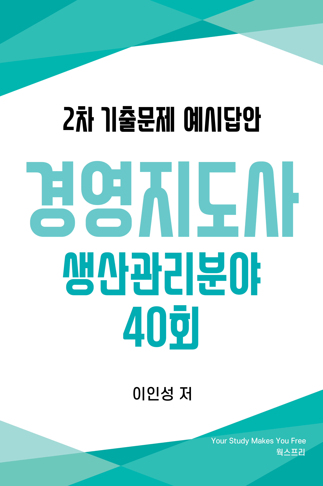
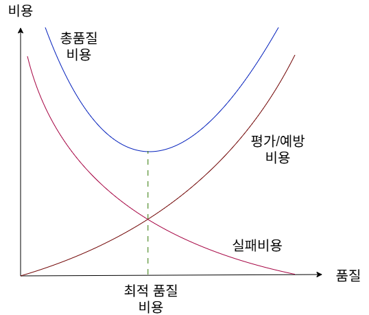
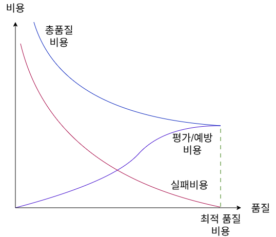
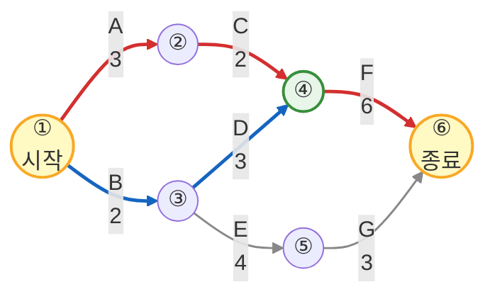

# 저자 소개
<ul>
    <li>경영지도사 생산관리분야</li>
    <li>자동화 장비 제조업 프로세스 개선 내부 컨설팅 경력</li>
    <li>제조업 설계 및 MCT 단순 반복 업무 자동화(RPA) 프로그램 개발
        <a href="https://www.worksfree.com">
        <figure style="float: right"><figcaption style="text-align: center;">RPA Site</figcaption></figure>
        </a>
        <ul>
            <li>어셈블리 BOM 엑셀 저장 자동화 프로그램</li>
            <li>8만 여개 구매품 속성 2주만에 정리하기</li>
            <li>이드로잉스 뷰어 대량 출력 자동화 프로그램</li>
            <li>구글 드라이브 기반 인터넷 정보 자동 업데이트</li>
            <li>자동화(RPA) 프로그램은 우측 QR 또는 아래 URL 참고 <a href="https://www.worksfree.com">https://www.worksfree.com</a></li>
        </ul>
    </li>
    <li>소프트웨어 분야 개발 및 PM 경력</li>
    <li>프로젝트 관리 전문가(PMP from PMI)</li>
    <li>IITP 평가위원, NIPA 평가위원</li>
    <li>KOIIA DX/AX 진단 컨설팅 위원</li>
    <li>2025년 예비창업패키지 사업자 선정 및 1단계, 2단계 수행</li>
</ul>

# 교재 소개
- 본 교재는 필자가 경영지도사 2차 수험 생활을 하며 기출문제를 풀고 아래 명시된 수험 교재 학습 및 인터넷 정보를 참조하여 정리한 내용입니다.
  * 생산관리 : 생산운영관리 [법문사]
  * 품질경영 : 품질경영론 [KSAM]
  * 경영과학 : 4차 산업혁명 시대의 EXCEL 경영과학 [박영사]
- 목차는 3 페이지에 제공되며 본문 내의 파랑색으로 보이는 모든 문구는 문서 내부 링크로서 클릭하면 문제, 예시답안, 목차로 이동합니다.
- 예시답안은 설명을 위해 단계별로 내용이 작성되어 불필요하게 긴 예시답안이 있는데 실제 답안 작성시에는 꼭 필요한 경우만 풀이 과정을 단계별로 작성해도 됩니다.
- 예시답안의 내용에 대한 개정 의견이나 시험 관련된 문의 사항은 아래 이메일로 보내주시기 바라며 수험생들의 고득점을 기원합니다.
- 자격시험 합격 후 동차 예시답안 출판에 관심 있는 분은 이메일로 연락 바랍니다.
- <a href="mailto:insung.lee@worksfree.co.kr">이메일 : insung.lee@worksfree.co.kr</a>

# 
 40회 목차 

## [40회 생산관리 목차](#40회-생산관리)
- [[문제1] 생산성 - 물적생산성과 가치생산성](#40회-생산관리-문제-1)
- [[문제2] 경제적 생산량(EPQ)](#40회-생산관리-문제-2)
- [[문제3] 공급사슬 유형](#40회-생산관리-문제-3)
- [[문제4] 전략적 입지선정 - 중심기법](#40회-생산관리-문제-4)
- [[문제5] 생산 의사결정 - 자체 생산과 외주 생산의 경제성 평가](#40회-생산관리-문제-5)
- [[문제6] 제약이론(TOC)](#40회-생산관리-문제-6)

## [40회 품질경영 목차](#40회-품질경영)
- [[문제1] 품질비용 - 예방, 평가, 실패비용](#40회-품질경영-문제-1)
- [[문제2] 품질경영 - 파이겐바움, 쥬란, 가빈](#40회-품질경영-문제-2)
- [[문제3] 프로세스 혁신 - 계통도법, 매트릭스도, DMAIC](#40회-품질경영-문제-3)
- [[문제4] 실험계획법 - 이원배치](#40회-품질경영-문제-4)
- [[문제5] 통계적 품질관리](#40회-품질경영-문제-5)
- [[문제6] 신뢰성 관리](#40회-품질경영-문제-6)

## [40회 경영과학 목차](#40회-경영과학)
- [[문제1] 불확실성하의 의사결정론](#40회-경영과학-문제-1)
- [[문제2] 선형계획법 - 재료배합문제](#40회-경영과학-문제-2)
- [[문제3] AHP - 쌍대비교 및 가중치 산정](#40회-경영과학-문제-3)
- [[문제4] 일정관리 - PERT/CPM](#40회-경영과학-문제-4)
- [[문제5] 수송문제 - 보겔추정법](#40회-경영과학-문제-5)
- [[문제6] 할당문제 - 헝가리법](#40회-경영과학-문제-6)

# 40회 생산관리 문제

## 40회 생산관리 문제 1
<!-- SRC:생산관리/문제1.md -->
### 【문제 1】(주)한국산업은 TV를 생산하고 있다. 매월 5명이 인당 150시간씩 투입되어 다음 표와 같이 생산을 했을 경우, 노동생산성에 관한 다음 질문에 답하시오. (단, 계산은 소수점 둘째자리에서 반올림하여 소수점 첫째 자리까지 구하며, 노동생산성의 투입자원은 인시(man-hour)단위로 측정한다.) (30점)

<table>
  <tr><th>구분</th><th>5월 생산량(개)</th><th>6월 생산량(개)</th><th>판매단가(천원)</th></tr>
  <tr><td>TV1</td><td>1,000</td><td>1,700</td><td>80</td></tr>
  <tr><td>TV2</td><td>800</td><td>400</td><td>150</td></tr>
</table>

(1) 물적 생산성과 가치 생산성에 대해 각각 설명하시오. (10점)

(2) 5월과 6월의 물적 생산성을 각각 구하고 5월 대비 6월의 물적 생산성 변화율을 구하시오. (10점)

(3) 5월과 6월의 가치 생산성을 각각 구하고 5월 대비 6월의 가치 생산성 변화율을 구하시오. (10점)
<!-- /SRC:생산관리/문제1.md -->

<a href="#40회-생산관리-문제-1-예시답안-30점">예시답안 바로가기</a><a href="#40회-생산관리-목차">목차 바로가기</a>

## 40회 생산관리 문제 2
<!-- SRC:생산관리/문제2.md -->
### 【문제 2】(주)한국자동차는 경제적 생산량(Economic Production Quantity, EPQ) 모형을 적용해서 여러 가지 자동차 부품을 순차적으로 로트 생산한다. 부품 B의 1일 수요가 d=200개/일, 1일 생산능력 p=400개/일, 연간 재고 유지비용 Ch=20원/개·년, 생산준비비용 Cs=400원/회이고, 연간 영업일수는 250일/년이다. 다음 물음에 답하시오. (단, 계산 문제는 계산 과정을 명시하고, 소수점 이하는 반올림하여 정수로 구한다.) (30점)

(1) 품목의 보충 방식과 주문 후 창고에 입고되는 속도의 관점에서 EPQ 모형과 경제적 주문량(Economic Order Quantity, EOQ) 모형의 차이를 비교하여 설명하시오. (10점)

(2) 부품 B의 경제적 생산량(Q*)과 최대 재고량(Imax)을 구하시오. (단, 부품 B의 초기 재고는 0이고, 재고 부족은 허용하지 않음) (14점)

(3) 부품 B의 연간 생산준비비용(TCs), 연간 재고유지비용(TCh) 및 연간 총비용 (TC=TCs+TCh) 을 구하시오. (6점)
<!-- /SRC:생산관리/문제2.md -->

<a href="#40회-생산관리-문제-2-예시답안-30점">예시답안 바로가기</a><a href="#40회-생산관리-목차">목차 바로가기</a>

## 40회 생산관리 문제 3
<!-- SRC:생산관리/문제3.md -->
### 【문제 3】공급사슬(supply chain)의 유형을 ‘효율적 공급사슬(efficient supply chain)'과 '반응적 공급사슬(responsive supply chain)'로 구분할 때, ①~⑩에 타당한 내용을 '비고'에서 선택하여 쓰시오. (10점)

<table>
  <tr><th>요인</th><th>효율적 공급사슬</th><th>반응적 공급사슬</th><th>비고</th></tr>
  <tr><td>수요예측 오차</td><td>①</td><td>②</td><td>크다, 작다</td></tr>
  <tr><td>경쟁 우선순위</td><td>③</td><td>④</td><td>원가, 유연성</td></tr>
  <tr><td>재고 투자</td><td>⑤</td><td>⑥</td><td>재고 최소화, 완충재고 유지</td></tr>
  <tr><td>공헌이익</td><td>⑦</td><td>⑧</td><td>크다, 작다</td></tr>
  <tr><td>제품 다양성</td><td>⑨</td><td>⑩</td><td>크다, 작다</td></tr>
</table>
<!-- /SRC:생산관리/문제3.md -->

<a href="#40회-생산관리-문제-3-예시답안-10점">예시답안 바로가기</a><a href="#40회-생산관리-목차">목차 바로가기</a>

## 40회 생산관리 문제 4
<!-- SRC:생산관리/문제4.md -->
### 【문제 4】(주)한국산업은 서울에 소재한 5개 대리점을 지원하기 위한 물류창고 입지를 선정하려고 한다. 대리점의 위치가 다음 표와 같을 때, 물음에 답하시오. (단, 계산은 소수점 둘째자리에서 반올림하여 소수점 첫째 자리 까지 구한다.) (10점)

<table>
  <tr><th>구분</th><th>A대리점</th><th>B대리점</th><th>C대리점</th><th>D대리점</th><th>E대리점</th></tr>
  <tr><td>X좌표</td><td>2</td><td>12</td><td>8</td><td>10</td><td>3</td></tr>
  <tr><td>Y좌표</td><td>10</td><td>11</td><td>3</td><td>4</td><td>2</td></tr>
</table>

(1) 물류창고에서 각 대리점으로의 운송량이 동일하다고 가정할 때, 중심기법(center of gravity method)을 활용하여 물류창고의 위치(좌표)를 구하시오. (4점)

(2) 물류창고에서 각 대리점으로의 운송량이 다음 표와 같이 변동되었을 때, 중심 기법을 활용하여 물류창고의 위치(좌표)를 구하시오. (6점)

<table>
  <tr><th>구분</th><th>A대리점</th><th>B대리점</th><th>C대리점</th><th>D대리점</th><th>E대리점</th></tr>
  <tr><td>운송량</td><td>2,000</td><td>3,000</td><td>1,600</td><td>2,400</td><td>1,000</td></tr>
</table>
<!-- /SRC:생산관리/문제4.md -->

<a href="#40회-생산관리-문제-4-예시답안-10점">예시답안 바로가기</a><a href="#40회-생산관리-목차">목차 바로가기</a>

## 40회 생산관리 문제 5
<!-- SRC:생산관리/문제5.md -->
### 【문제 5】(주)한국전자는 신제품 P를 생산하기 위한 두 가지 대안을 검토하고 있다. P를 자체 생산하는 경우 연간 50,000,000원의 고정비와 단위당 5,000원의 변동비가 발생하고, 외주 생산의 경우에는 고정비는 0이고 단위당 6,250원의 변동비가 발생하는 것으로 추정된다. 다음 물음에 답하시오. (단, 계산과정과 정답을 모두 기재한다.) (10점)

(1) P를 자체 생산하는 것이 외주 생산하는 것보다 경제적으로 불리하지 않기 위한 최소 생산량(Q)을 구하시오. (5점)

(2) 최소 생산량 Q=20,000개가 되기 위해서는 자체 생산의 단위당 변동비(VC)를 얼마 이하로 낮춰야 하는지 쓰시오. (단, 자체 생산의 고정비와 외주 생산의 변동비는 불변한다.) (5점)
<!-- /SRC:생산관리/문제5.md -->

<a href="#40회-생산관리-문제-5-예시답안-10점">예시답안 바로가기</a><a href="#40회-생산관리-목차">목차 바로가기</a>

## 40회 생산관리 문제 6
<!-- SRC:생산관리/문제6.md -->
### 【문제 6】아래 표에 제시된 내용은 제약이론(Theory of Constraints, TOC)의 문제 해결을 위한 집중 개선 프로세스를 구성하는 단계들을 임의로 나열한 것이다. 다음 물음에 답하시오. (10점)

<table>
  <tr><td colspan="2"><집중 개선 프로세스></td></tr>
  <tr><td>ㄱ.</td><td>(①)을(를) 최대로 가동하는 방법 개발</td></tr>
  <tr><td>ㄴ.</td><td>제약자원의 속도에 (②)의 일정을 맞춤</td></tr>
  <tr><td>ㄷ.</td><td>시스템의 (③)을(를) 결정하는 자원을 찾음</td></tr>
  <tr><td>ㄹ.</td><td>다른 제약자원을 찾아서 개선 프로세스를 반복함</td></tr>
  <tr><td>ㅁ.</td><td>시스템의 제약자원을 개선함</td></tr>
</table>

(1) <집중 개선 프로세스>의 ①~③에 적합한 용어를 <보기>에서 골라 쓰시오. (6점)
<보기>: 쓰루풋(Throughput), 비제약자원, 재고, 버퍼(Buffer), 제약자원

(2) <집중 개선 프로세스> 5단계를 바르게 나열하여 기호를 순서대로 쓰시오. (4점)
<!-- /SRC:생산관리/문제6.md -->

<a href="#40회-생산관리-문제-6-예시답안-10점">예시답안 바로가기</a><a href="#40회-생산관리-목차">목차 바로가기</a>

# 40회 생산관리 예시답안

## 40회 생산관리 문제 1 예시답안 (30점)

<!-- SRC:생산관리/예시답안1.md -->
### 【문제 1 - (1)】 물적생산성과 가치생산성 (10점)

<table>
    <tr><th>구분</th><th>5월 생산량(개)</th><th>6월 생산량(개)</th><th>판매단가(천원)</th></tr>
    <tr><td>TV1</td><td>1,000</td><td>1,700</td><td>80</td></tr>
    <tr><td>TV2</td><td>800</td><td>400</td><td>150</td></tr>
</table>

*   **물적 생산성 (Physical Productivity)**: 투입된 자원량 대비 산출된 물리적 양(수량, 중량 등)의 비율입니다. 공정의 기술적 효율성을 측정하는 지표로 활용됩니다.
*   **가치 생산성 (Value Productivity)**: 투입된 자원량 대비 산출된 가치(매출액, 부가가치 등)의 비율입니다. 가격 요인을 반영하여 생산 활동의 경제적 성과와 수익성을 측정합니다.

### 【문제 1 - (2)】 5월·6월 물적생산성과 변화율 (10점)

- 작업자 수: 5명
- 1인당 월 투입시간: 150시간
- 월간 총 노동투입: $5 * 150 = 750$ 인시
- 5월 총 생산량: $1,800개 (TV1 1,000개 + TV2 800개)$
- 6월 총 생산량: $2,100개 (TV1 1,700개 + TV2 400개)$

- $물적생산성(5월) = \cfrac{1,800}{750} ≈ 2.4 개/인시$
- $물적생산성(6월) = \cfrac{2,100}{750} ≈ 2.8 개/인시$
- $변화율 = \cfrac{(2.8 - 2.4)}{2.4} \times 100 ≈ 16.7%$

따라서 5월 대비 6월의 **물적생산성의 변화율은 약 16.7% 증가**입니다.

### 【문제 1 - (3)】 5월·6월 가치생산성과 변화율 (10점)

- 작업자 수: 5명
- 단가: TV1 80천원/개, TV2 150천원/개

5월 매출액:
- TV1: 80,000천원
- TV2: 120,000천원
- 합계: 200,000천원

6월 매출액:
- TV1: 136,000천원
- TV2: 60,000천원
- 합계: 196,000천원

- $가치생산성(5월) = \cfrac{200,000}{750} ≈ 266.7 천원/인시$
- $가치생산성(6월) = \cfrac{196,000}{750} ≈ 261.3 천원/인시$
- $변화율 = \cfrac{(261.3 - 266.7)}{266.7} \times 100 ≈ -2.0$

따라서 5월 대비 6월의 **가치생산성의 변화율은 약 2.0% 감소**입니다.
<!-- /SRC:생산관리/예시답안1.md -->

<a href="#40회-생산관리-문제-1">문제 바로가기</a><a href="#40회-생산관리-목차">목차 바로가기</a>

## 40회 생산관리 문제 2 예시답안 (30점)

<!-- SRC:생산관리/예시답안2.md -->
### 【문제 2 - (1)】 EPQ 모형과 EOQ 모형의 차이 (10점)

1. **보충(보충 방식) 관점의 차이**  
   - EOQ 모형은 외부 공급자로부터 일정량을 주문하면, 주문량 전부가 **한 번에 일괄 입고** 되는 것을 가정하는 모형이다. 재고는 주문 시점에 순간적으로 최대치까지 증가한 후, 수요에 의해 점차 감소한다.  
   - EPQ 모형은 자가 생산을 전제로 하며, 생산 기간 동안 **생산과 수요가 동시에 진행** 되면서 재고가 점진적으로 보충되는 모형이다. 생산 설비를 가동하는 동안 재고가 서서히 증가하고, 생산이 중단된 후에는 수요만 발생하여 재고가 감소한다.

2. **입고(보충 속도) 관점의 차이**  
   - EOQ 모형에서는 주문량이 한 번에 입고되므로, 이론적으로 **입고 속도가 무한대(순간 보충)** 인 것으로 간주된다. 이 때문에 재고 수준은 입고 시점에 수직으로 상승하는 형태를 보인다.  
   - EPQ 모형에서는 1일 생산능력 $p$와 1일 수요량 $d$가 모두 유한하므로, 재고는 **생산속도와 수요속도의 차이 $(p-d)$** 만큼의 순증가 속도를 가진다. 따라서 재고는 일정 기울기를 가진 선형 증가 후, 생산 중단 이후에는 수요에 의해 선형적으로 감소한다.

### 【문제 2 - (2)】 경제적 생산량 $Q^*$ 및 최대 재고량 $I_{\max}$ (14점)

#### 1) 기본 자료 정리

- 1일 수요량: $ d = 200 개/일$  
- 1일 생산능력: $ p = 400 개/일$  
- 연간 영업일수: $250일/년$  
- 연간 수요량:  
  $$ D = d \times 250 = 200 \times 250 = 50{,}000 \ \text{개/년} $$  
- 연간 재고 유지비용: $ C_h = 20 \ \text{원/개/년} $  
- 생산준비비용: $ C_s = 400 \ \text{원/회} $

EPQ 모형의 경제적 생산량 공식:
$$ Q^* = \sqrt{\cfrac{2 D C_s}{C_h \left(1 - \cfrac{d}{p}\right)}} $$

#### 2) 경제적 생산량 $Q^*$ 계산

먼저, 생산능력 대비 수요비율:

$$ 1 - \cfrac{d}{p} = 1 - \cfrac{200}{400} = 1 - 0.5 = 0.5 $$

분자:

$$ 2 D C_s = 2 \times 50{,}000 \times 400 = 40{,}000{,}000 $$

분모:

$$ C_h \left(1 - \cfrac{d}{p}\right) = 20 \times 0.5 = 10 $$

따라서:

$$ Q^* = \sqrt{\cfrac{40{,}000{,}000}{10}} = \sqrt{4{,}000{,}000} = 2{,}000 \ \text{개} $$

**→ 경제적 생산량 $Q^*$ = 2,000개**

#### 3) 최대 재고량 $I_{\max}$ 계산

EPQ 모형에서 최대 재고량은 다음과 같다.

$$ I_{\max} = Q^* \left(1 - \cfrac{d}{p}\right) $$

$$ I_{\max} = 2{,}000 \times \left(1 - \cfrac{200}{400}\right) = 2{,}000 \times 0.5 = 1{,}000 \ \text{개} $$

**→ 최대 재고량 $I_{\max}$ = 1,000개**

### 【문제 2 - (3)】 연간 비용 $TC_s, TC_h, TC$ (6점)

#### 1) 연간 생산준비비용 $TC_s$

연간 생산횟수(생산주기 수):

$$ N = \cfrac{D}{Q^*} = \cfrac{50{,}000}{2{,}000} = 25 \ \text{회/년} $$

따라서 연간 생산준비비용:

$$ TC_s = N \times C_s = 25 \times 400 = 10{,}000 \ \text{원/년} $$

#### 2) 연간 재고 유지비용 $TC_h$

EPQ 모형에서 평균 재고는 최대 재고의 절반이다.

$$ \text{평균 재고} = \cfrac{I_{\max}}{2} = \cfrac{1{,}000}{2} = 500 \ \text{개} $$

따라서 연간 재고 유지비용:

$$ TC_h = \text{평균 재고} \times C_h = 500 \times 20 = 10{,}000 \ \text{원/년} $$

#### 3) 연간 총비용 $TC$

$$ TC = TC_s + TC_h = 10{,}000 + 10{,}000 = 20{,}000 \ \text{원/년} $$
<!-- /SRC:생산관리/예시답안2.md -->

<a href="#40회-생산관리-문제-2">문제 바로가기</a><a href="#40회-생산관리-목차">목차 바로가기</a>

## 40회 생산관리 문제 3 예시답안 (10점)

<!-- SRC:생산관리/예시답안3.md -->
### 【문제 3】 공급사슬 유형 비교 (10점)

<table>
    <tr><th style="width:22%">요인</th><th style="width:25%">효율적 공급사슬</th><th style="width:25%">반응적 공급사슬</th><th>비고</th></tr>
    <tr><td>수요예측 오차</td><td>① 작다</td><td>② 크다</td><td>크다, 작다</td></tr>
    <tr><td>경쟁 우선순위</td><td>③ 원가</td><td>④ 유연성</td><td>원가, 유연성</td></tr>
    <tr><td>재고 투자</td><td>⑤ 재고 최소화</td><td>⑥ 완충재고 유지</td><td>재고 최소화, 완충재고 유지</td></tr>
    <tr><td>공헌이익</td><td>⑦ 작다</td><td>⑧ 크다</td><td>크다, 작다</td></tr>
    <tr><td>제품 다양성</td><td>⑨ 작다</td><td>⑩ 크다</td><td>크다, 작다</td></tr>
</table>

* **효율적 공급사슬**: 안정적 수요 하에 원가 절감과 효율성을 극대화하는 전략을 사용합니다.
* **반응적 공급사슬**: 불확실한 수요에 신속히 대응하기 위해 유연성과 서비스 수준을 중시합니다.
<!-- /SRC:생산관리/예시답안3.md -->

<a href="#40회-생산관리-문제-3">문제 바로가기</a><a href="#40회-생산관리-목차">목차 바로가기</a>

## 40회 생산관리 문제 4 예시답안 (10점)

<!-- SRC:생산관리/예시답안4.md -->
### 【문제 4 - (1)】 동일 운송량 가정 시 중심좌표 (4점)

<table>
    <tr><th>구분</th><th>A대리점</th><th>B대리점</th><th>C대리점</th><th>D대리점</th><th>E대리점</th></tr>
    <tr><td>X좌표</td><td>2</td><td>12</td><td>8</td><td>10</td><td>3</td></tr>
    <tr><td>Y좌표</td><td>10</td><td>11</td><td>3</td><td>4</td><td>2</td></tr>
</table>

$X_c = \cfrac{(2 + 12 + 8 + 10 + 3)}{5} = 7.0$

$Y_c = \cfrac{(10 + 11 + 3 + 4 + 2)}{5} = 6.0$

따라서 물류창고의 위치는 **(7.0, 6.0)** 입니다.

### 【문제 4 - (2)】 운송량 변동 시 가중 중심좌표 (6점)

<table>
    <tr><th>구분</th><th>A대리점</th><th>B대리점</th><th>C대리점</th><th>D대리점</th><th>E대리점</th></tr>
    <tr><td>운송량</td><td>2,000</td><td>3,000</td><td>1,600</td><td>2,400</td><td>1,000</td></tr>
</table>

$총 운송량(W) = 2,000 + 3,000 + 1,600 + 2,400 + 1,000 = 10,000$

$X_c = \cfrac{(2 \times 2{,}000 + 12 \times 3{,}000 + 8 \times 1{,}600 + 10 \times 2{,}400 + 3 \times 1{,}000)}{10{,}000}$
$= \cfrac{(4{,}000 + 36{,}000 + 12{,}800 + 24{,}000 + 3{,}000)}{10{,}000}$
$= \cfrac{79{,}800}{10{,}000} = 7.98 \approx 8.0$

$Y_c = \cfrac{(10 \times 2{,}000 + 11 \times 3{,}000 + 3 \times 1{,}600 + 4 \times 2{,}400 + 2 \times 1{,}000)}{10{,}000}$
$= \cfrac{(20{,}000 + 33{,}000 + 4{,}800 + 9{,}600 + 2{,}000)}{10{,}000}$
$= \cfrac{69{,}400}{10{,}000} = 6.94 \approx 6.9$

따라서 가중치를 반영한 물류창고의 위치는 **(8.0, 6.9)** 입니다.
<!-- /SRC:생산관리/예시답안4.md -->

<a href="#40회-생산관리-문제-4">문제 바로가기</a><a href="#40회-생산관리-목차">목차 바로가기</a>

## 40회 생산관리 문제 5 예시답안 (10점)

<!-- SRC:생산관리/예시답안5.md -->
### 【문제 5 - (1)】 자체 생산과 외주 생산의 손익분기 생산량 (5점)

$\text{자체 생산 총비용} = 50{,}000{,}000 + 5{,}000Q$

$\text{외주 생산 총비용} = 6{,}250Q$

$50{,}000{,}000 + 5{,}000Q = 6{,}250Q$

$50{,}000{,}000 = 1{,}250Q$

$Q = \cfrac{50{,}000{,}000}{1{,}250} = 40{,}000$

**따라서 최소 생산량은 40,000개입니다.**

### 【문제 5 - (2)】 Q=20,000일 때의 목표 변동비(VC) (5점)

$50{,}000{,}000 + 20{,}000 \times VC = 6{,}250 \times 20{,}000$

$50{,}000{,}000 + 20{,}000 \times VC = 125{,}000{,}000$

$20{,}000 \times VC = 125{,}000{,}000 - 50{,}000{,}000$

$20{,}000 \times VC = 75{,}000{,}000$

$VC = \cfrac{75{,}000{,}000}{20{,}000} = 3{,}750$

**따라서 자체 생산의 단위당 변동비는 3,750원 이하가 되어야 합니다.**
<!-- /SRC:생산관리/예시답안5.md -->

<a href="#40회-생산관리-문제-5">문제 바로가기</a><a href="#40회-생산관리-목차">목차 바로가기</a>

## 40회 생산관리 문제 6 예시답안 (10점)

<!-- SRC:생산관리/예시답안6.md -->
### 【문제 6 - (1)】 집중 개선 프로세스 용어 (6점)

**① 제약자원**

**② 비제약자원**

**③ 쓰루풋(Throughput)**

### 【문제 6 - (2)】 5단계의 올바른 순서 (4점)

제약이론(TOC)의 집중 개선 5단계 순서는 다음과 같습니다.

1단계: 시스템의 쓰루풋을 결정하는 자원을 찾음 (ㄷ)

2단계: 제약자원을 최대로 가동하는 방법 개발 (ㄱ)

3단계: 제약자원의 속도에 비제약자원의 일정을 맞춤 (ㄴ)

4단계: 시스템의 제약자원을 개선함 (ㅁ)

5단계: 다른 제약자원을 찾아서 개선 프로세스를 반복함 (ㄹ)

**정답: ㄷ -> ㄱ -> ㄴ -> ㅁ -> ㄹ**
<!-- /SRC:생산관리/예시답안6.md -->

<a href="#40회-생산관리-문제-6">문제 바로가기</a><a href="#40회-생산관리-목차">목차 바로가기</a>

# 40회 품질경영 문제

## 40회 품질경영 문제 1
<!-- SRC:품질경영/문제1.md -->
### 【문제 1】품질비용(quality cost)에 관하여 다음 물음에 답하시오. (30점)

(1) 품질비용의 정의를 기술하시오. (5점)

(2) 품질비용 중 예방비용, 평가비용, 실패비용(사내실패비용+사외실패비용)의 내용을 3개씩만 나열하시오. (9점)

(3) 품질비용 모델을 ‘전통적 품질비용 모델’과 ‘현대적 품질비용 모델’로 구분하여 그림(그래프)으로 각각 표현하시오. (단, x축, y축의 척도, 각 비용의 그래프가 정확히 표시되어야 하며, 설명은 하지 않아도 됨) (16점)
<!-- /SRC:품질경영/문제1.md -->

<a href="#40회-품질경영-문제-1-예시답안-30점">예시답안 바로가기</a><a href="#40회-품질경영-목차">목차 바로가기</a>

## 40회 품질경영 문제 2
<!-- SRC:품질경영/문제2.md -->
### 【문제 2】품질경영에 관하여 다음 물음에 답하시오. (30점)

(1) 파이겐바움(A.V. Feigenbaum)의 품질관리 발전단계를 4단계로 나누어서 순차적으로 설명하시오. (8점)

(2) 쥬란(J.M. Juran)의 품질 트릴러지(Trilogy) 3단계를 제시하고 각각 설명하시오. (12점)

(3) 가빈(D.A. Garvin)의 5가지 품질 개념을 제시하고 각각 설명하시오. (10점)
<!-- /SRC:품질경영/문제2.md -->

<a href="#40회-품질경영-문제-2-예시답안-30점">예시답안 바로가기</a><a href="#40회-품질경영-목차">목차 바로가기</a>

## 40회 품질경영 문제 3
<!-- SRC:품질경영/문제3.md -->
### 【문제 3】다음의 용어를 간략히 설명하시오. (10점)

(1) 계통도법 (3점)

(2) 매트릭스도 (3점)

(3) DMAIC (4점)
<!-- /SRC:품질경영/문제3.md -->

<a href="#40회-품질경영-문제-3-예시답안-10점">예시답안 바로가기</a><a href="#40회-품질경영-목차">목차 바로가기</a>

## 40회 품질경영 문제 4
<!-- SRC:품질경영/문제4.md -->
### 【문제 4】어느 화학공장에서 제품의 수율(%)에 영향을 미칠 것으로 생각되는 반응 온도(4수준)와 원료(3수준)를 인자로 취하여 반복이 없는 이원배치 실험을 하여 아래와 같은 데이터가 얻어졌다. 다음 물음에 답하시오. (10점)

<table>
  <tr><th>구분</th><th>A₁</th><th>A₂</th><th>A₃</th><th>A₄</th><th>계</th></tr>
  <tr><td>B₁</td><td>97.6</td><td>98.6</td><td>99.0</td><td>98.0</td><td>393.2</td></tr>
  <tr><td>B₂</td><td>97.3</td><td>98.2</td><td>98.0</td><td>97.7</td><td>391.2</td></tr>
  <tr><td>B₃</td><td>96.7</td><td>96.9</td><td>97.9</td><td>96.5</td><td>388.0</td></tr>
  <tr><td>계</td><td>291.6</td><td>293.7</td><td>294.9</td><td>292.2</td><td>1,172.4</td></tr>
</table>

(1) 아래 분산분석표의 ① ∼ ④에 들어갈 값을 구하시오. (5점)

<table>
  <tr><th>요인</th><th>SS</th><th>DF</th><th>MS</th><th>F₀</th><th>F(0.95)</th><th>F(0.99)</th></tr>
  <tr><td>A</td><td>2.22</td><td>3</td><td>0.74</td><td>7.96*</td><td>4.76</td><td>9.78</td></tr>
  <tr><td>B</td><td>①</td><td>②</td><td>③</td><td>④</td><td>5.14</td><td>10.90</td></tr>
  <tr><td>E</td><td>0.56</td><td>6</td><td>0.093</td><td>-</td><td>-</td><td>-</td></tr>
  <tr><td>T</td><td>6.22</td><td>11</td><td>-</td><td>-</td><td>-</td><td>-</td></tr>
</table>

(2) 최적수준의 모평균 점추정값 μ̂(AᵢBⱼ) 을 구하시오. (5점)
<!-- /SRC:품질경영/문제4.md -->

<a href="#40회-품질경영-문제-4-예시답안-10점">예시답안 바로가기</a><a href="#40회-품질경영-목차">목차 바로가기</a>

## 40회 품질경영 문제 5
<!-- SRC:품질경영/문제5.md -->
### 【문제 5】통계적 품질관리에 관하여 다음 물음에 답하시오. (10점)

(1) 통계적 품질관리의 개념을 설명하시오. (3점)

(2) QC 7가지 도구를 쓰시오. (7점)
<!-- /SRC:품질경영/문제5.md -->

<a href="#40회-품질경영-문제-5-예시답안-10점">예시답안 바로가기</a><a href="#40회-품질경영-목차">목차 바로가기</a>

## 40회 품질경영 문제 6
<!-- SRC:품질경영/문제6.md -->
### 【문제 6】신뢰성 관리에 관하여 다음 물음에 답하시오. (10점)

(1) 고장나무 분석(FTA: fault tree analysis)에 관하여 설명하시오. (5점)

(2) 고장증상과 영향분석(FMEA: failure mode and effect analysis)에 관하여 설명하시오. (5점)
<!-- /SRC:품질경영/문제6.md -->

<a href="#40회-품질경영-문제-6-예시답안-10점">예시답안 바로가기</a><a href="#40회-품질경영-목차">목차 바로가기</a>

# 40회 품질경영 예시답안

## 40회 품질경영 문제 1 예시답안 (30점)

<!-- SRC:품질경영/예시답안1.md -->
### 【문제 1 - (1)】 품질비용의 정의 (5점)
품질비용(Cost of Quality, COQ)은 제품이나 서비스의 품질을 요구되는 수준으로 달성·유지하기 위해 발생하는 모든 비용과, 품질 규격 미달로 인해 발생하는 손실 비용을 합산한 경제적 지표입니다.

### 【문제 1 - (2)】 품질비용의 세부 항목 (9점)
* **예방비용(Prevention Cost)**: 품질 교육훈련비, 품질계획 및 시스템 설계비, 공정 개선 활동비
* **평가비용(Appraisal Cost)**: 수입·공정·완제품 검사비, 시험 장비 유지·교정비, 품질 감사비
* **실패비용(Failure Cost)**: 재작업비(사내), 폐기비(사내), 고객 클레임 및 보증수리비(사외)

### 【문제 1 - (3)】 품질비용 모델 비교 (16점)

<table style="width:100%;border-collapse:collapse;">
  <tr><th style="text-align:center;font-size:10pt;color:#555;padding:2px 4px;">전통적 품질비용 모델</th><th style="text-align:center;font-size:10pt;color:#555;padding:2px 4px;">현대적 품질비용 모델</th></tr>
  <tr><td style="text-align:center;font-weight:normal;padding:4px;"></td><td style="text-align:center;font-weight:normal;padding:4px;"></td></tr>
</table>
<!-- /SRC:품질경영/예시답안1.md -->

<a href="#40회-품질경영-문제-1">문제 바로가기</a><a href="#40회-품질경영-목차">목차 바로가기</a>

## 40회 품질경영 문제 2 예시답안 (30점)

<!-- SRC:품질경영/예시답안2.md -->
### 【문제 2 - (1)】 파이겐바움의 품질관리 발전 4단계 (8점)
1. **품질검사 단계(Inspection)**: 사후 검사를 통해 불량품을 선별하는 단계
2. **공정품질관리 단계(Quality Control)**: 통계적 기법을 도입하여 공정 변동을 제어하는 단계
3. **회사 전반의 품질관리 단계(CWQC)**: 전 부서가 품질 활동에 참여하는 단계
4. **전사적 품질경영 단계(TQM)**: 전략적 경영 요소로 품질을 관리하는 최고 수준의 단계

### 【문제 2 - (2)】 쥬란의 품질 트릴러지(Trilogy) 3단계 (12점)
1. **품질계획(Quality Planning)**: 고객 니즈를 파악하여 적합한 제품과 프로세스를 설계하는 과정
2. **품질관리(Quality Control)**: 설정된 목표 대비 성과를 모니터링하고 이상 발생 시 교정하는 일상 활동
3. **품질개선(Quality Improvement)**: 프로젝트를 통해 만성적 문제를 해결하고 품질을 획기적으로 향상시키는 과정

### 【문제 2 - (3)】 가빈의 5가지 품질 개념 (10점)
* **초월적 관점**: 직관적으로 인식되는 절대적 우수성
* **제품 중심 관점**: 제품이 보유한 속성이나 성능의 양적 지표
* **사용자 중심 관점**: 사용자의 요구와 목적에 대한 만족도
* **제조 중심 관점**: 설계 규격과 표준에 대한 적합성(Conformance)
* **가치 중심 관점**: 가격 대비 성능의 균형과 경제적 효용
<!-- /SRC:품질경영/예시답안2.md -->

<a href="#40회-품질경영-문제-2">문제 바로가기</a><a href="#40회-품질경영-목차">목차 바로가기</a>

## 40회 품질경영 문제 3 예시답안 (10점)

<!-- SRC:품질경영/예시답안3.md -->
### 【문제 3 - (1)】 계통도법 (3점)
최종 목적을 달성하기 위한 수단과 그 수단의 하위 수단을 단계적으로 전개하여, 전체적인 논리적 관계를 나무(Tree) 모양으로 도식화하여 최적의 실행 방안을 찾는 기법입니다.

### 【문제 3 - (2)】 매트릭스도 (3점)
두 가지 이상의 요소 군(Group)을 행과 열로 배열하고, 이들 요소 간의 상관관계 유무나 강도를 표 형식으로 시각화하여 문제 해결의 핵심 포인트를 찾는 기법입니다.

### 【문제 3 - (3)】 DMAIC (4점)
6시그마 혁신을 위한 데이터 기반의 문제 해결 절차입니다.
* **Define(정의)**: 고객 요구사항과 프로젝트 범위 설정
* **Measure(측정)**: 현재 프로세스의 성과 데이터 수집
* **Analyze(분석)**: 결함의 근본 원인 규명
* **Improve(개선)**: 해결책 도출 및 실행
* **Control(관리)**: 개선된 성과의 유지 및 관리
<!-- /SRC:품질경영/예시답안3.md -->

<a href="#40회-품질경영-문제-3">문제 바로가기</a><a href="#40회-품질경영-목차">목차 바로가기</a>

## 40회 품질경영 문제 4 예시답안 (10점)

<!-- SRC:품질경영/예시답안4.md -->
### 【문제 4 - (1)】 분산분석표(ANOVA Table) 완성 (5점)

<table>
    <tr><th>요인</th><th>SS</th><th>DF</th><th>MS</th><th>F₀</th><th>F(0.95)</th><th>F(0.99)</th></tr>
    <tr><td>A</td><td>2.22</td><td>3</td><td>0.74</td><td>7.96*</td><td>4.76</td><td>9.78</td></tr>
    <tr><td>B</td><td>①3.44</td><td>②2</td><td>③1.72</td><td>④18.49</td><td>5.14</td><td>10.90</td></tr>
    <tr><td>E</td><td>0.56</td><td>6</td><td>0.093</td><td>-</td><td>-</td><td>-</td></tr>
    <tr><td>T</td><td>6.22</td><td>11</td><td>-</td><td>-</td><td>-</td><td>-</td></tr>
</table>

* **① SSB(요인 B의 제곱합) 계산**:

$SST = SSA + SSB + SSE$ 이므로,
$SSB = 6.22 - 2.22 - 0.56 = 3.44$

* **② DFB(요인 B의 자유도) 계산**: 인자 B의 수준이 3이므로, $DFB = 3 - 1 = 2$

* **③ MSB(요인 B의 평균제곱) 계산**: $MSB = \cfrac{SSB}{DFB} = \cfrac{3.44}{2} = 1.72$

* **④ F₀(검정 통계량) 계산**: $F_0 = \cfrac{MSB}{MSE} = \cfrac{1.72}{0.093} = 18.49$

### 【문제 4 - (2)】 최적수준의 모평균 점추정값 (5점)
반복 없는 이원배치 실험에서 최적 수준 조합이 $A_3$(반응온도 3수준), $B_1$(원료 1수준)일 때의 점추정값입니다.

* **수준별 평균 및 전체 평균 산출**:

전체 평균($\bar{x}$) $= \cfrac{1{,}172.4}{12} = 97.70$

$A_3$ 평균($\bar{x}_{3\cdot}$) $= \cfrac{294.9}{3} = 98.30$

$B_1$ 평균($\bar{x}_{\cdot 1}$) $= \cfrac{393.2}{4} = 98.30$

* **점추정값 계산**:

$\hat{\mu}(A_3B_1) = 98.3 + 98.3 - 97.7 = \mathbf{98.9\%}$
<!-- /SRC:품질경영/예시답안4.md -->

<a href="#40회-품질경영-문제-4">문제 바로가기</a><a href="#40회-품질경영-목차">목차 바로가기</a>

## 40회 품질경영 문제 5 예시답안 (10점)

<!-- SRC:품질경영/예시답안5.md -->
### 【문제 5 - (1)】 통계적 품질관리(SQC)의 개념 (3점)
품질 특성을 데이터로 측정하고 통계적 기법(샘플링, 관리도 등)을 적용하여 공정의 변동을 분석하고 관리함으로써, 불량을 예방하고 공정을 안정된 상태로 유지·개선하는 체계적 관리 활동입니다.

### 【문제 5 - (2)】 QC 7가지 도구 (7점)
1. **체크시트(Check Sheet)**: 데이터 수집 및 점검용 서식
2. **파레토도(Pareto Diagram)**: 문제의 핵심 요인을 파악하기 위한 빈도 분석
3. **히스토그램(Histogram)**: 데이터의 분포 형상 파악
4. **특성요인도(Fishbone Diagram)**: 결과와 원인 간의 인과관계 분석
5. **산점도(Scatter Diagram)**: 두 변수 간의 상관관계 분석
6. **관리도(Control Chart)**: 공정의 시간적 안정 상태 감시
7. **층별(Stratification)**: 특정 기준에 따라 데이터를 그룹화하여 분석
<!-- /SRC:품질경영/예시답안5.md -->

<a href="#40회-품질경영-문제-5">문제 바로가기</a><a href="#40회-품질경영-목차">목차 바로가기</a>

## 40회 품질경영 문제 6 예시답안 (10점)

<!-- SRC:품질경영/예시답안6.md -->
### 【문제 6 - (1)】 고장나무 분석(FTA) (5점)
시스템의 치명적인 사고(Top Event)를 정점으로 하여, 발생 가능한 모든 하위 고장 원인들을 논리 게이트(AND, OR)를 사용하여 연역적으로 분석하는 상향식(Deductive) 신뢰성 분석 기법입니다.

### 【문제 6 - (2)】 고장증상과 영향분석(FMEA) (5점)
제품 설계나 공정 단계에서 잠재적인 고장 모드를 사전에 식별하고, 각 고장이 시스템이나 고객에 미치는 영향을 평가하여 위험우선순위(RPN)에 따라 개선 대책을 수립하는 귀납적(Inductive) 분석 기법입니다.
<!-- /SRC:품질경영/예시답안6.md -->

<a href="#40회-품질경영-문제-6">문제 바로가기</a><a href="#40회-품질경영-목차">목차 바로가기</a>

# 40회 경영과학 문제

## 40회 경영과학 문제 1
<!-- SRC:경영과학/문제1.md -->
### 【문제 1】(주)한국투자는 100억원의 투자전략을 수립하기 위해 과거자료 분석과 시장조사 결과를 토대로 3가지 투자안에 대한 정보를 아래 표와 같이 확보하였다. 다음 물음에 답하시오. (30점)

[표: 투자안에 대한 성과표(1년 후 잔존가치, 단위: 억원)]
<table>
  <tr><th class="backslash" width="200">
경제상황

투자안
</th><th>호황</th><th>보통</th><th>불황</th></tr>
  <tr><td>주식</td><td>200</td><td>130</td><td>50</td></tr>
  <tr><td>부동산</td><td>150</td><td>100</td><td>80</td></tr>
  <tr><td>금</td><td>100</td><td>120</td><td>150</td></tr>
</table>

(1) 후회의 미니맥스(minimax regret) 기준에 따라 후회표를 작성하고, 최적 대안을 선택하시오. (10점)

(2) 경제상황이 호황일 확률 30%, 보통일 확률 50%, 불황일 확률 20%일 때, 3가지 투자안에 대한 기대화폐가치를 계산하시오. (10점)

(3) (2)의 확률을 활용하여 완전정보의 기대가치를 계산하시오. (10점)
<!-- /SRC:경영과학/문제1.md -->

<a href="#40회-경영과학-문제-1-예시답안-30점">예시답안 바로가기</a><a href="#40회-경영과학-목차">목차 바로가기</a>

## 40회 경영과학 문제 2
<!-- SRC:경영과학/문제2.md -->
### 【문제 2】(주)한국농장에서는 옥수수와 보리를 배합하여 가축사료로 사용하고 있다. 최소비용으로 3가지 영양소인 탄수화물, 단백질, 지방의 일일 필수 섭취량을 충족할 수 있는 사료 배합량을 결정하고자 한다. 옥수수 1kg당 탄수화물, 단백질, 지방 함유량이 각각 3g, 1g, 1g이며, 보리 1kg당 탄수화물, 단백질, 지방 함유량이 각각 1g, 2g, 1g이다. 그리고 각 영양소의 일일 최소 섭취량은 탄수화물 14g, 단백질 12g, 지방 10g이며, 사료의 비용은 kg당 옥수수 30원, 보리 20원이다. 다음 물음에 답하시오. (30점)

(1) 총비용을 최소화 하는 선형계획(LP) 모형을 작성하시오. (단, 의사결정변수는 x₁ = 옥수수의 양(kg), x₂ = 보리의 양(kg)으로 정의하고, 목적함수는 z 로 표기 할 것) (10점)

(2) 도해법(graphical method)으로 최적해를 구하시오. (10점)

(3) (1) 에서 작성한 원문제(primal problem)에 대한 쌍대문제(dual problem)를 작성 하시오. (단, 쌍대변수는 yᵢ(i = 1,2,3)로, 목적함수는 z′ 로 표기할 것) (10점)
<!-- /SRC:경영과학/문제2.md -->

<a href="#40회-경영과학-문제-2-예시답안-30점">예시답안 바로가기</a><a href="#40회-경영과학-목차">목차 바로가기</a>

## 40회 경영과학 문제 3
<!-- SRC:경영과학/문제3.md -->
### 【문제 3】대학교 4학년인 홍길동은 졸업 후 진로에 대한 고민이 많다. 홍길동은 다양한 정보를 수집 및 분석하여 3가지 대안(공무원, 공기업, 대기업)을 선택하였고, 3가지 기준을 고려하여 최적대안을 결정하고자 한다. 다음 물음에 답하시오. (10점)

(1) 홍길동은 3가지 기준에 대해 쌍대비교를 하였다. 아래 표에서 ①∼③에 해당하는 숫자를 쓰시오. (3점)
<table>
  <tr><th>구 분</th><th>경제적 보상</th><th>성장 가능성</th><th>적성 적합도</th></tr>
  <tr><td>경제적 보상</td><td>$1$</td><td>$\cfrac{1}{5}$</td><td>①</td></tr>
  <tr><td>성장 가능성</td><td>②</td><td>③</td><td>$3$</td></tr>
  <tr><td>적성 적합도</td><td>$3$</td><td>$\cfrac{1}{3}$</td><td>$1$</td></tr>
</table>

(2) 쌍대비교행렬을 이용하여 3가지 기준에 대한 상대적 중요도를 구하는 절차를 설명하시오. (7점)
<!-- /SRC:경영과학/문제3.md -->

<a href="#40회-경영과학-문제-3-예시답안-10점">예시답안 바로가기</a><a href="#40회-경영과학-목차">목차 바로가기</a>

## 40회 경영과학 문제 4
<!-- SRC:경영과학/문제4.md -->
### 【문제 4】7개 활동으로 구성된 프로젝트에 대한 다음 정보를 활용하여 물음에 답하시오. (10점)

<table>
  <tr><th>활동</th><th>직전선행활동</th><th>소요시간</th></tr>
  <tr><td>A</td><td>-</td><td>3</td></tr>
  <tr><td>B</td><td>-</td><td>2</td></tr>
  <tr><td>C</td><td>A</td><td>2</td></tr>
  <tr><td>D</td><td>B</td><td>3</td></tr>
  <tr><td>E</td><td>B</td><td>4</td></tr>
  <tr><td>F</td><td>C, D</td><td>6</td></tr>
  <tr><td>G</td><td>E</td><td>3</td></tr>
</table>

(1) 프로젝트 활동에 대한 네트워크(다이어그램)를 그리시오. (단, 화살표 위에 활동, 아래에 소요시간 표기할 것) (5점)

(2) 모든 경로의 소요시간을 계산하고, 주경로와 전체 프로젝트 완료 시간을 제시하시오. (5점)
<!-- /SRC:경영과학/문제4.md -->

<a href="#40회-경영과학-문제-4-예시답안-10점">예시답안 바로가기</a><a href="#40회-경영과학-목차">목차 바로가기</a>

## 40회 경영과학 문제 5
<!-- SRC:경영과학/문제5.md -->
### 【문제 5】(주)한국석유화학은 서로 다른 지역에 있는 공장 A, B, C에서 동일한 제품을 매일 생산하여 전국의 창고 가, 나, 다, 라에 수송하고 있다. 각 공장의 일 공급량(단위: 톤), 각 창고의 일 수요량(단위: 톤), 각 공장에서 창고까지의 톤당 수송비용(단위: 만원)은 아래 표와 같다. 보겔추정법 (Vogel's Approximation Method)을 이용하여 초기해를 구하고, 이때 총 수송비용을 구하시오. (10점)

<table>
  <tr><th class="backslash" width="100">
창고

공장
</th><th>가</th><th>나</th><th>다</th><th>라</th><th>일 공급량</th></tr>
  <tr><td>A</td><td>4</td><td>9</td><td>7</td><td>12</td><td>60</td></tr>
  <tr><td>B</td><td>6</td><td>5</td><td>1</td><td>5</td><td>50</td></tr>
  <tr><td>C</td><td>7</td><td>3</td><td>10</td><td>2</td><td>40</td></tr>
  <tr><td>일 수요량</td><td>30</td><td>20</td><td>70</td><td>30</td><td>-</td></tr>
</table>
<!-- /SRC:경영과학/문제5.md -->

<a href="#40회-경영과학-문제-5-예시답안-10점">예시답안 바로가기</a><a href="#40회-경영과학-목차">목차 바로가기</a>

## 40회 경영과학 문제 6
<!-- SRC:경영과학/문제6.md -->
### 【문제 6】(주)한국기계는 3대의 기계로 4종류의 작업을 담당하고 있으며, 각 기계가 작업을 처리하기 위한 비용(단위: 만원)은 아래 표와 같다. 헝가리법(Hungarian Method)을 사용하여 최소비용으로 작업을 담당할 수 있는 기계를 할당 하시오. (단, 가상의 행은 D로 표기하고, 풀이과정을 적을 것) (10점)

<table>
  <tr><th class="backslash" width="150">
작업

기계
</th><th>가</th><th>나</th><th>다</th><th>라</th></tr>
  <tr><td>A</td><td>6</td><td>9</td><td>4</td><td>5</td></tr>
  <tr><td>B</td><td>4</td><td>7</td><td>5</td><td>3</td></tr>
  <tr><td>C</td><td>6</td><td>2</td><td>4</td><td>6</td></tr>
</table>
<!-- /SRC:경영과학/문제6.md -->

<a href="#40회-경영과학-문제-6-예시답안-10점">예시답안 바로가기</a><a href="#40회-경영과학-목차">목차 바로가기</a>

# 40회 경영과학 예시답안

## 40회 경영과학 문제 1 예시답안 (30점)

<!-- SRC:경영과학/예시답안1.md -->
### 【문제 1 - (1)】 후회의 미니맥스(minimax regret) 기준 (10점)

각 경제상황별 최대 성과: 호황 200(주식), 보통 130(주식), 불황 150(금)

후회 = 상황별 최대 성과 - 대안 성과

[후회표]
<table>
    <tr><th>투자안</th><th>호황</th><th>보통</th><th>불황</th><th>최대 후회</th></tr>
    <tr><td>주식</td><td>200-200=0</td><td>130-130=0</td><td>150-50=100</td><td>100</td></tr>
    <tr><td>부동산</td><td>200-150=50</td><td>130-100=30</td><td>150-80=70</td><td>70</td></tr>
    <tr><td>금</td><td>200-100=100</td><td>130-120=10</td><td>150-150=0</td><td>100</td></tr>
</table>

* **최적 대안**: 최대 후회값 중 최소값인 70억원을 가진 **부동산** 선택

### 【문제 1 - (2)】 기대화폐가치(EMV) 계산 (10점)

* **EMV(주식)** $= (200 \times 0.3) + (130 \times 0.5) + (50 \times 0.2) = 60 + 65 + 10 = 135$ 억원
* **EMV(부동산)** $= (150 \times 0.3) + (100 \times 0.5) + (80 \times 0.2) = 45 + 50 + 16 = 111$ 억원
* **EMV(금)** $= (100 \times 0.3) + (120 \times 0.5) + (150 \times 0.2) = 30 + 60 + 30 = 120$ 억원

### 【문제 1 - (3)】 완전정보의 기대가치(EVPI) 계산 (10점)

* **완전정보 하의 기대가치(EVwPI)** $= (200 \times 0.3) + (130 \times 0.5) + (150 \times 0.2) = 60 + 65 + 30 = 155$ 억원
* **기존 최선 대안의 EMV** = 135 억원 (주식)
* **EVPI** $= \text{EVwPI} - \text{Max(EMV)} = 155 - 135 = 20$ 억원
<!-- /SRC:경영과학/예시답안1.md -->

<a href="#40회-경영과학-문제-1">문제 바로가기</a><a href="#40회-경영과학-목차">목차 바로가기</a>

## 40회 경영과학 문제 2 예시답안 (30점)

<!-- SRC:경영과학/예시답안2.md -->
### 【문제 2 - (1)】 선형계획(LP) 모형 작성 (10점)

* **의사결정변수**: $x_1$ = 옥수수의 양(kg), $x_2$ = 보리의 양(kg)
* **목적함수**: $\min z = 30x_1 + 20x_2$
* **제약조건**:
  1) $3x_1 + x_2 \geq 14$ (탄수화물)
  2) $x_1 + 2x_2 \geq 12$ (단백질)
  3) $x_1 + x_2 \geq 10$ (지방)
  4) $x_1, x_2 \geq 0$ (비음제약)

### 【문제 2 - (2)】 도해법에 의한 최적해 (10점)

각 제약식의 경계선을 좌표평면에 그려 실행가능영역을 도출하고, 목적함수선을 원점 방향으로 평행이동하여 실행가능영역에 접하는 최소 비용점을 구한다.

<svg viewBox="0 0 420 340" xmlns="http://www.w3.org/2000/svg" style="display:block;margin:10px auto;font-family:sans-serif;max-width:100%;height:auto">
  <!-- 배경 -->
  <rect width="420" height="340" fill="#fafafa" stroke="#ccc" stroke-width="1"/>
  <!-- 실행가능영역 음영 (하단 경계 꼭짓점들: (0,14),(2,8),(8,2),(12,0),(14,0),(14,14)) -->
  <polygon points="50,26 86,134 194,242 266,278 302,278 302,26"
           fill="#e3f2fd" fill-opacity="0.6" stroke="none"/>
  <!-- x축, y축 -->
  <line x1="50" y1="278" x2="370" y2="278" stroke="#333" stroke-width="2"/>
  <line x1="50" y1="290" x2="50" y2="14"  stroke="#333" stroke-width="2"/>
  <polygon points="365,273 375,278 365,283" fill="#333"/>
  <polygon points="45,18 50,8 55,18" fill="#333"/>
  <text x="376" y="282" font-size="12" fill="#333">x₁</text>
  <text x="36"  y="12"  font-size="12" fill="#333">x₂</text>
  <!-- 눈금 레이블 -->
  <text x="44" y="292" font-size="10" fill="#555">0</text>
  <text x="82" y="292" font-size="10" fill="#555">2</text>
  <text x="118" y="292" font-size="10" fill="#555">4</text>
  <text x="154" y="292" font-size="10" fill="#555">6</text>
  <text x="190" y="292" font-size="10" fill="#555">8</text>
  <text x="224" y="292" font-size="10" fill="#555">10</text>
  <text x="260" y="292" font-size="10" fill="#555">12</text>
  <text x="296" y="292" font-size="10" fill="#555">14</text>
  <text x="36" y="242" font-size="10" fill="#555">2</text>
  <text x="36" y="206" font-size="10" fill="#555">4</text>
  <text x="36" y="170" font-size="10" fill="#555">6</text>
  <text x="36" y="134" font-size="10" fill="#555">8</text>
  <text x="32" y="98"  font-size="10" fill="#555">10</text>
  <text x="32" y="62"  font-size="10" fill="#555">12</text>
  <text x="32" y="26"  font-size="10" fill="#555">14</text>
  <!-- 눈금 틱 -->
  <line x1="86"  y1="275" x2="86"  y2="281" stroke="#777" stroke-width="1"/>
  <line x1="122" y1="275" x2="122" y2="281" stroke="#777" stroke-width="1"/>
  <line x1="158" y1="275" x2="158" y2="281" stroke="#777" stroke-width="1"/>
  <line x1="194" y1="275" x2="194" y2="281" stroke="#777" stroke-width="1"/>
  <line x1="230" y1="275" x2="230" y2="281" stroke="#777" stroke-width="1"/>
  <line x1="266" y1="275" x2="266" y2="281" stroke="#777" stroke-width="1"/>
  <line x1="302" y1="275" x2="302" y2="281" stroke="#777" stroke-width="1"/>
  <line x1="47"  y1="242" x2="53"  y2="242" stroke="#777" stroke-width="1"/>
  <line x1="47"  y1="206" x2="53"  y2="206" stroke="#777" stroke-width="1"/>
  <line x1="47"  y1="170" x2="53"  y2="170" stroke="#777" stroke-width="1"/>
  <line x1="47"  y1="134" x2="53"  y2="134" stroke="#777" stroke-width="1"/>
  <line x1="47"  y1="98"  x2="53"  y2="98"  stroke="#777" stroke-width="1"/>
  <line x1="47"  y1="62"  x2="53"  y2="62"  stroke="#777" stroke-width="1"/>
  <line x1="47"  y1="26"  x2="53"  y2="26"  stroke="#777" stroke-width="1"/>
  <!-- 제약선 1: 3x1+x2=14 (x1=0→x2=14, x2=0→x1=4.67) SVG:(50,26)→(134,278) -->
  <line x1="50" y1="26" x2="140" y2="278" stroke="#e53935" stroke-width="2"/>
  <text x="60" y="42" font-size="11" fill="#e53935">① 3x₁+x₂=14</text>
  <!-- 제약선 2: x1+2x2=12 (x1=0→x2=6, x2=0→x1=12) SVG:(50,170)→(266,278) -->
  <line x1="50" y1="170" x2="266" y2="278" stroke="#1565c0" stroke-width="2"/>
  <text x="240" y="260" font-size="11" fill="#1565c0">② x₁+2x₂=12</text>
  <!-- 제약선 3: x1+x2=10 (x1=0→x2=10, x2=0→x1=10) SVG:(50,98)→(230,278) -->
  <line x1="50" y1="98" x2="230" y2="278" stroke="#2e7d32" stroke-width="2"/>
  <text x="150" y="190" font-size="11" fill="#2e7d32">③ x₁+x₂=10</text>
  <!-- 목적함수 z=220: 30x1+20x2=220 → x1=0→x2=11, x2=0→x1=7.33 SVG:(50,80)→(182,278) -->
  <line x1="50" y1="80" x2="182" y2="278" stroke="#ff6f00" stroke-width="1.5" stroke-dasharray="7,4"/>
  <text x="53" y="76" font-size="11" fill="#ff6f00">z=220 (목적함수)</text>
  <!-- 꼭짓점 표시 -->
  <circle cx="86"  cy="134" r="6" fill="#d32f2f"/>
  <text x="90" y="128" font-size="11" fill="#d32f2f" font-weight="bold">최적해(2,8) z=220</text>
  <circle cx="194" cy="242" r="5" fill="#555"/>
  <text x="198" y="239" font-size="10" fill="#555">(8,2) z=280</text>
</svg>

주요 꼭짓점 비용 비교:

<table>
    <tr><th>꼭짓점</th><th>$x_1$</th><th>$x_2$</th><th>$z = 30x_1 + 20x_2$</th></tr>
    <tr><td>①∩③</td><td>2</td><td>8</td><td><b>220 ← 최소</b></td></tr>
    <tr><td>②∩③</td><td>8</td><td>2</td><td>280</td></tr>
</table>

* **최적해**: $x_1 = 2\text{(kg)}, \; x_2 = 8\text{(kg)}$, 최소비용 $z = 220$ 원

### 【문제 2 - (3)】 쌍대문제(Dual Problem) 작성 (10점)

* **쌍대변수**: $y_1, y_2, y_3$ (각 영양소 제약에 대응)
* **목적함수**: $\max z' = 14y_1 + 12y_2 + 10y_3$
* **제약조건**:
  1) $3y_1 + y_2 + y_3 \leq 30$ (옥수수 비용 제약)
  2) $y_1 + 2y_2 + y_3 \leq 20$ (보리 비용 제약)
  3) $y_1, y_2, y_3 \geq 0$
<!-- /SRC:경영과학/예시답안2.md -->

<a href="#40회-경영과학-문제-2">문제 바로가기</a><a href="#40회-경영과학-목차">목차 바로가기</a>

## 40회 경영과학 문제 3 예시답안 (10점)

<!-- SRC:경영과학/예시답안3.md -->
### 【문제 3 - (1)】 쌍대비교행렬 숫자 기입 (3점)

쌍대비교행렬 A에서 $a_{ij} = \cfrac{1}{a_{ji}}$ 성립함.
* **①**: 적성에 대한 적합도 대비 경제적 보상의 역수 $= \cfrac{1}{3}$
  

* **②**: 경제적 보상 대비 성장 가능성의 역수 $= \cfrac{1}{\cfrac{1}{5}} = 5$
  

* **③**: 자기 자신과의 비교이므로 대각원소 = $1$

### 【문제 3 - (2)】 상대적 중요도(가중치) 산출 절차 (7점)

1. **열 합계 계산**: 행렬의 각 열(Column)에 포함된 수치들의 합을 구함.
2. **정규화(Normalization)**: 각 원소를 해당 열의 합계로 나누어 열의 합이 1이 되도록 조정함.
3. **행 평균 계산**: 정규화된 행렬에서 각 행(Row)의 산술평균을 구함. 이 값이 해당 기준의 상대적 중요도(가중치)가 됨.
4. **일관성 검정**: 최대 고유치($\lambda_{\max}$)를 활용하여 일관성 지수(CI)와 일관성 비율(CR)을 산출하고, $CR \leq 0.1$ 이내인지 확인하여 응답의 논리적 일관성을 확보함.
<!-- /SRC:경영과학/예시답안3.md -->

<a href="#40회-경영과학-문제-3">문제 바로가기</a><a href="#40회-경영과학-목차">목차 바로가기</a>

## 40회 경영과학 문제 4 예시답안 (10점)

<!-- SRC:경영과학/예시답안4.md -->
### 【문제 4 - (1)】 프로젝트 네트워크 다이어그램 (5점)

화살표 위: 활동명, 아래: 소요시간 (AOA 표기법)

> **범례**: 빨간 선 = 주경로(Critical Path), 파란 선 = 비주경로

### 【문제 4 - (2)】 경로 소요시간 및 주경로 (5점)

1. **Path 1**: A-C-F $= 3 + 2 + 6 = 11$
2. **Path 2**: B-D-F $= 2 + 3 + 6 = 11$
3. **Path 3**: B-E-G $= 2 + 4 + 3 = 9$

* **주경로(Critical Path)**: 가장 긴 시간이 소요되는 **A-C-F** 및 **B-D-F**
* **전체 완료 시간**: **11 시간**
<!-- /SRC:경영과학/예시답안4.md -->

<a href="#40회-경영과학-문제-4">문제 바로가기</a><a href="#40회-경영과학-목차">목차 바로가기</a>

## 40회 경영과학 문제 5 예시답안 (10점)

<!-- SRC:경영과학/예시답안5.md -->
### 【문제 5】 보겔추정법(VAM)에 의한 초기해 및 수송비용 (10점)

<!-- **1. 패널티(최저비용과 차상위비용의 차) 계산**:
* 행 패널티: A(3), B(4), C(1)
* 열 패널티: 가(2), 나(2), 다(6), 라(3)

**2. 최대 패널티 열 '다'(6)에 할당**:
* B-다 셀에 min(B공급 50, 다수요 70)=50 할당 (B공장 종료, '다'창고 잔여 수요 20)

**3. 잔여 패널티 재계산 (B행 제거 후)**:

<table>
  <tr><th class="backslash" width="100">
창고

공장
</th></th><th>가(2→3)</th><th>나(2→6)</th><th>다(3)</th><th>라(3→10)</th><th>공급</th></tr>
  <tr><td>A</td><td>4</td><td>9</td><td>7</td><td>12</td><td>60</td></tr>
  <tr><td>C</td><td>7</td><td>3</td><td>10</td><td>2</td><td>40</td></tr>
  <tr><td>수요</td><td>30</td><td>20</td><td>20</td><td>30</td><td></td></tr>
</table>

* 열 '라' 패널티 최대(10) → C-라 셀에 min(C공급 40, 라수요 30)=**30** 할당 (라 종료, C공장 잔여 10)
* 열 '나' 패널티 최대(6) → C-나 셀에 min(C잔여 10, 나수요 20)=**10** 할당 (C공장 종료, 나 잔여 10)
* A공장만 남아 순차 배정: A-가 **30**, A-나 **10**, A-다 **20** (A공장 종료)

**4. 총 수송비용 계산**:
* $(30 \times 4) + (10 \times 9) + (20 \times 7) + (50 \times 1) + (10 \times 3) + (30 \times 2)$
* $= 120 + 90 + 140 + 50 + 30 + 60 =$ **490 만원** -->

**1. 보겔추정법(VAM) 적용 과정**: 보겔추정법은 각 행과 열에서 가장 낮은 두 개의 비용 차이(**기회비용**)를 계산하여, 그 차이가 가장 큰 곳에 자원을 우선 배정하는 방식입니다.

*   **[&#9312; 단계] 기회비용 계산 및 첫 번째 배정**
    *  행 차이: A(3), B(4), C(1) / 열 차이: 가(2), 나(2), **다(6)**, 라(3)
    *  가장 큰 차이인 **다 열(6)** 의 최소 비용 칸인 **B공장-다 창고(1)** 에 50톤 배정 (B공장 소진).
*   **[&#9313; 단계] 두 번째 배정 (B행 제외)**
    *  행 차이: A(3), C(1) / 열 차이: 가(3), 나(6), 다(3), **라(10)**
    *  가장 큰 차이인 **라 열(10)** 의 최소 비용 칸인 **C공장-라 창고(2)** 에 30톤 배정 ('라' 창고 충족).
*   **[&#9314; 단계] 세 번째 배정 (라열 제외)**
    *  행 차이: A(3), C(4) / 열 차이: 가(3), **나(6)**, 다(3)
    *  가장 큰 차이인 **나 열(6)** 의 최소 비용 칸인 **C공장-나 창고(3)** 에 C의 잔여량 10톤 배정 (C공장 소진).
*   **[&#9315; 단계] 남은 물량 배정**
    *  A공장의 공급량 60톤을 남은 수요처인 **가(30), 나(10), 다(20)** 에 각각 배정하여 마무리합니다.

**2. 초기해 배정 결과 (단위: 톤)**

<table>
    <tr><th class="backslash" width="100">
창고

공장
</th><th>가</th><th>나</th><th>다</th><th>라</th><th>일 공급량</th></tr>
    <tr><td>A</td><td><b>&#9315; 30</b></td><td><b>&#9315; 10</b></td><td><b>&#9315; 20</b></td><td>-</td><td>60</td></tr>
    <tr><td>B</td><td>-</td><td>-</td><td><b>&#9312; 50</b></td><td>-</td><td>50</td></tr>
    <tr><td>C</td><td>-</td><td><b>&#9314; 10</b></td><td>-</td><td><b>&#9313; 30</b></td><td>40</td></tr>
    <tr><td><b>일 수요량</b></td><td><b>30</b></td><td><b>20</b></td><td><b>70</b></td><td><b>30</b></td><td><b>150</b></td></tr>
</table>

**3. 총 수송비용 계산**: 각 배정 물량에 단위당 수송비용을 곱하여 합계액을 산출합니다.

1.  **A공장:** $(30 \times 4) + (10 \times 9) + (20 \times 7) = 120 + 90 + 140 = 350$
2.  **B공장:** $50 \times 1 = 50$
3.  **C공장:** $(10 \times 3) + (30 \times 2) = 30 + 60 = 90$

**정답**: 총 수송비용은 $350 + 50 + 90 = 490$만 원입니다.
<!-- /SRC:경영과학/예시답안5.md -->

<a href="#40회-경영과학-문제-5">문제 바로가기</a><a href="#40회-경영과학-목차">목차 바로가기</a>

## 40회 경영과학 문제 6 예시답안 (10점)

<!-- SRC:경영과학/예시답안6.md -->
### 【문제 6】 헝가리법을 이용한 최소비용 할당 (10점)

**1. 정방행렬 변환**: 가상의 기계 D 행을 추가하고 비용을 모두 0으로 설정함.

<table>
    <tr><th class="backslash" width="150">
작업

기계
</th><th>가</th><th>나</th><th>다</th><th>라</th><th>행 최소값</th></tr>
    <tr><td>A</td><td>6</td><td>9</td><td style="background-color: gray;">4</td><td>5</td><td>4</td></tr>
    <tr><td>B</td><td>4</td><td>7</td><td>5</td><td style="background-color: gray;">3</td><td>3</td></tr>
    <tr><td>C</td><td>6</td><td style="background-color: gray;">2</td><td>4</td><td>6</td><td>2</td></tr>
    <tr><td>D(가상)</td><td>0</td><td>0</td><td>0</td><td>0</td><td>0</td></tr>
</table>

**2. 행/열 감소 (최소값 빼기)**:
* A행(-4): (2, 5, 0, 1), B행(-3): (1, 4, 2, 0), C행(-2): (4, 0, 2, 4), D행: (0, 0, 0, 0)
* 열 최소값은 모두 0이므로 변화 없음.

<table>
    <tr><th class="backslash" width="150">
작업

기계
</th><th>가</th><th>나</th><th>다</th><th>라</th><th>소요비용 </th></tr>
    <tr><td>A</td><td>2</td><td>5</td><td style="background-color: gray;">0</td><td>1</td><td>4</td></tr>
    <tr><td>B</td><td>1</td><td>4</td><td>2</td><td style="background-color: gray;">0</td><td>3</td></tr>
    <tr><td>C</td><td>4</td><td style="background-color: gray;">0</td><td>2</td><td>4</td><td>2</td></tr>
    <tr><td>D(가상)</td><td style="background-color: gray;">0</td><td>0</td><td>0</td><td>0</td><td>0</td></tr>
</table>

**3. 최적 할당 도출**:
* 기계 A -> 작업 다 (비용 4)
* 기계 B -> 작업 라 (비용 3)
* 기계 C -> 작업 나 (비용 2)
* 기계 D -> 작업 가 (가상)

**4. 총 비용 계산**:
* $4 + 3 + 2 =$ **9 만원** (작업 '가"는 실제 할당에서는 제외됨)
<!-- /SRC:경영과학/예시답안6.md -->

<a href="#40회-경영과학-문제-6">문제 바로가기</a><a href="#40회-경영과학-목차">목차 바로가기</a>

<table style="border:none">
  <tr> <td style="width:13%; border:none">저 &nbsp;&nbsp;자</td> <td style="width:5%; border:none">|</td> <td style="border:none; text-align: left">이인성</td> <td rowspan=6, style=" border-top:none; border-left:none; border-right:none; border-bottom:none;"></td></tr>
  <tr style="border:none"> <td style="border:none">펴낸이</td> <td style="border:none">|</td> <td style="border:none; text-align: left">웍스프리</td> </tr>
  <tr> <td style="border:none">펴낸곳</td> <td style="border:none">|</td> <td style="border:none; text-align: left">웍스프리</td> </tr>
  <tr> <td style="border:none">발행일</td> <td style="border:none">|</td> <td style="border:none; text-align: left">2026년 04월 10일</td> </tr>
  <tr> <td style="border:none">이메일</td> <td style="border:none">|</td> <td style="border:none; text-align: left"><a href="mailto:insung.lee@worksfree.co.kr">insung.lee@worksfree.co.kr</a></td> </tr>
  <tr> <td style="border:none">가 &nbsp;&nbsp;격</td> <td style="border:none">|</td> <td style="border:none; text-align: left">6,600원</td> </tr>
  <tr> <td style="border:none" colspan=4>본 책은 저작자의 지적 재산으로서 무단 전제와 복제를 금합니다.</td> </tr>
</table>

