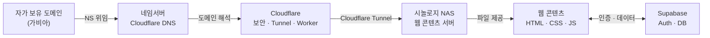

# Synology NAS 웹서비스 구축 완전 가이드

*Gabia · Cloudflare Tunnel/Worker · Supabase 인증·DB · 역할 기반 접근 제어 · 온라인 결제까지 원스톱*

> **대상 독자**: 자체 도메인과 Synology NAS를 보유한 개인·소기업 운영자  
> **전제 조건**: DSM 7.x, Cloudflare Free 플랜, Supabase Free 플랜  
> **예시 도메인**: `example.co.kr` (실제 작업 시 자신의 도메인으로 교체)  
> **실제 구현 사례**: WorksFree Hub (`www.worksfree.kr`) — 이 가이드의 실례는 이 프로젝트를 기준으로 합니다.

---

<div class="toc-summary">
<h2>목차</h2>
<table class="toc-table">
<tr><td class="toc-num">도입</td><td class="toc-title">이 가이드를 읽기 전에</td><td class="toc-page">2</td></tr>
<tr><td class="toc-num"></td><td class="toc-title">전체 구성도</td><td class="toc-page">5</td></tr>
<tr><td class="toc-num"></td><td class="toc-title">사전 준비물</td><td class="toc-page">5</td></tr>
<tr class="toc-part"><td class="toc-num">1장</td><td class="toc-title">가비아 — 도메인 구입 및 네임서버 변경</td><td class="toc-page">6</td></tr>
<tr><td class="toc-num">2장</td><td class="toc-title">Cloudflare — 계정 설정 및 도메인 등록</td><td class="toc-page">7</td></tr>
<tr><td class="toc-num">3장</td><td class="toc-title">Synology NAS — DSM 7.x 웹 서비스 설정</td><td class="toc-page">8</td></tr>
<tr><td class="toc-num">4장</td><td class="toc-title">Cloudflare Tunnel — 공유기 설정 없이 NAS 연결</td><td class="toc-page">11</td></tr>
<tr><td class="toc-num">5장</td><td class="toc-title">서브도메인 DNS 설정</td><td class="toc-page">16</td></tr>
<tr><td class="toc-num">6장</td><td class="toc-title">Cloudflare Worker — 외부 API 호출</td><td class="toc-page">17</td></tr>
<tr><td class="toc-num">7장</td><td class="toc-title">Supabase — 회원 로그인 시스템 구축</td><td class="toc-page">21</td></tr>
<tr><td class="toc-num">8장</td><td class="toc-title">Supabase 데이터베이스 — 회원 정보·결제·크레딧 저장</td><td class="toc-page">30</td></tr>
<tr><td class="toc-num">9장</td><td class="toc-title">온라인 결제 연동 — 토스페이먼츠 (국내)</td><td class="toc-page">46</td></tr>
<tr><td class="toc-num">10장</td><td class="toc-title">웹사이트 코드와 Supabase 연결</td><td class="toc-page">55</td></tr>
<tr><td class="toc-num">11장</td><td class="toc-title">배포 자동화 스크립트 (Windows PowerShell)</td><td class="toc-page">56</td></tr>
<tr><td class="toc-num">12장</td><td class="toc-title">역할 기반 접근 제어 (RBAC)</td><td class="toc-page">59</td></tr>
<tr><td class="toc-num">13장</td><td class="toc-title">테스트 환경 구축 — Playwright + Supabase 분리</td><td class="toc-page">61</td></tr>
<tr class="toc-appendix"><td class="toc-num">부록 A</td><td class="toc-title">전체 설정 순서 요약</td><td class="toc-page">64</td></tr>
<tr class="toc-appendix"><td class="toc-num">부록 B</td><td class="toc-title">트러블슈팅</td><td class="toc-page">66</td></tr>
<tr class="toc-appendix"><td class="toc-num">부록 C</td><td class="toc-title">포트 구성 참고표</td><td class="toc-page">70</td></tr>
<tr class="toc-appendix"><td class="toc-num">부록 D</td><td class="toc-title">파일 위치 참고 (WorksFree Hub 기준)</td><td class="toc-page">70</td></tr>
</table>
</div>

## 이 가이드를 읽기 전에 — 전체 그림 먼저 이해하기

### 도메인 + NAS만으로도 웹사이트는 열 수 있다

많은 사람들이 웹사이트를 만들려면 별도의 서버를 빌려야 한다고 생각합니다.  
하지만 집이나 사무실에 **Synology NAS**가 있고 **도메인**을 하나 구입했다면,  
그것만으로 이미 웹사이트를 인터넷에 공개할 수 있습니다.

> NAS는 파일 저장 장치이지만, 동시에 작은 웹 서버이기도 합니다.  
> 도메인은 인터넷 주소입니다. 이 두 가지만 있으면 기본 웹 호스팅이 가능합니다.

### 그런데 왜 다른 서비스들이 필요한가?

기본 웹사이트(정적 페이지)를 넘어서, 아래와 같은 기능이 필요해지면  
각각의 서비스가 추가됩니다.

<table>
<colgroup>
<col style="width:33%">
<col style="width:33%">
<col style="width:34%">
</colgroup>
<thead><tr>
<th>필요한 기능</th>
<th>사용하는 서비스</th>
<th>이 가이드의 챕터</th>
</tr></thead>
<tbody>
<tr>
<td>보안·성능 강화, 도메인 관리</td>
<td>Cloudflare</td>
<td>2장</td>
</tr>
<tr>
<td>공유기 설정 없이 NAS 외부 공개</td>
<td>Cloudflare Tunnel</td>
<td>4장</td>
</tr>
<tr>
<td>외부 API 데이터 가져오기 (예: DART 기업정보)</td>
<td>Cloudflare Worker</td>
<td>6장</td>
</tr>
<tr>
<td>회원 가입·로그인 (Google, 카카오 등)</td>
<td>Supabase 인증</td>
<td>7장</td>
</tr>
<tr>
<td>회원 정보·결제 이력·크레딧 저장</td>
<td>Supabase 데이터베이스</td>
<td>8장</td>
</tr>
<tr>
<td>온라인 결제 (카드·계좌이체)</td>
<td>PG사 연동 (토스페이먼츠 등)</td>
<td>9장</td>
</tr>
<tr>
<td>이메일 발송 (단건·대량, 발송 현황 추적)</td>
<td>Resend + Cloudflare Worker KV</td>
<td>14장</td>
</tr>
</tbody>
</table>

### 이 가이드를 따라가면 만들 수 있는 것

- 내 도메인 주소(`www.example.co.kr`)로 접속하는 웹사이트
- Google 계정 또는 카카오 계정으로 로그인하는 회원 시스템
- 사용자별 크레딧·결제 이력을 관리하는 데이터베이스
- 온라인 결제 후 크레딧이 자동으로 충전되는 결제 시스템
- 개발용·테스트용·실 서비스용 환경을 분리한 배포 구조

### DS925+ 성능 안내 — 동시 접속자 수 기준

이 가이드의 구현 사례는 **시놀로지 DS923+/DS925+** (기본 RAM **4GB**)를 기준으로 합니다.
서비스를 구축하기 전에 이 하드웨어의 실제 수용 능력을 먼저 파악해두면, 적합한 서비스 규모를 설계하는 데 도움이 됩니다.

#### 동시 접속자(Concurrent User)란?

처음 서버를 다루는 분들은 "동시 접속자"를 *"지금 내 사이트를 열어놓은 사람 수"*로 생각하기 쉽습니다. 하지만 서버 입장에서 실제로 중요한 것은 다릅니다.

> **동시 접속자 = 1초 안에 서버에 데이터 요청을 보내는 사람 수**
>
> 페이지를 열어두고 글을 읽고 있는 동안에는, 서버는 그 사용자를 전혀 인식하지 않습니다.  
> 버튼 클릭, 로그인, 데이터 조회처럼 **무언가를 요청하는 순간**에만 서버 부하가 발생합니다.

예를 들어 100명이 사이트에 접속해 있어도, 동시에 요청을 보내는 사람은 보통 1~5명입니다. 이것이 서버가 실제로 상대하는 동시 접속자입니다.

#### DS925+ RAM 4GB 기준 수용 능력

<table>
<colgroup><col style="width:30%"><col style="width:40%"><col style="width:30%"></colgroup>
<thead><tr><th>서비스 유형</th><th>예시</th><th>권장 동시 접속자</th></tr></thead>
<tbody>
<tr><td>경량형 (텍스트·API 위주)</td><td>메모장 앱, 텍스트 API</td><td>약 70명</td></tr>
<tr><td>표준형 (DB 연동 포함)</td><td>로그인·회원가입, 게시판</td><td>약 30명</td></tr>
<tr><td>중량형 (복잡한 로직·이미지)</td><td>대용량 파일 처리, 복잡한 비즈니스 로직</td><td>10명 이하</td></tr>
</tbody>
</table>

위 수치는 다음 세 가지 전제를 기반으로 합니다.

**① 시스템 기본 소모:** DSM OS 약 1.5~1.75GB + cloudflared 등 데몬 약 150MB = **총 약 1.9GB 고정 소모.**  
RAM 4GB 중 서비스가 실제로 쓸 수 있는 여유 메모리는 **약 2.1GB**입니다.

**② 요청당 메모리:** 경량형은 요청 1건당 약 30MB, 표준형(DB 연동)은 약 70MB 기준.  
2,100MB ÷ 30MB ≒ 70명, 2,100MB ÷ 70MB ≒ 30명으로 계산됩니다.

**③ Cloudflare 캐싱:** 이미지·CSS·JS 같은 정적 파일은 Cloudflare가 전부 캐싱합니다.  
NAS는 JSON API 등 순수 데이터만 응답하므로 실제 부하가 크게 줄어듭니다.  
Cloudflare 없이 NAS 단독으로 정적 파일까지 제공한다면 **20명도 버거울 수 있습니다.**

RAM 4GB를 초과하는 트래픽이 예상된다면, DS925+는 최대 32GB까지 RAM을 추가 장착할 수 있으며, 용량에 비례해 수용 가능 사용자 수도 늘어납니다.

---

<div style="page-break-before:always;height:0;margin:0;padding:0;"></div>

## 전체 구성도 — 각 서비스가 하는 역할



> **요약**: 가비아에서 구입한 도메인의 네임서버를 Cloudflare로 위임합니다.  
> Cloudflare가 DNS·보안·터널을 처리하고, Cloudflare Tunnel로 NAS에 연결합니다.  
> NAS의 웹 콘텐츠는 Supabase(인증·DB)와 연동하여 회원 서비스를 제공합니다.

---

## 사전 준비물

<table>
<colgroup>
<col style="width:28%">
<col style="width:72%">
</colgroup>
<thead><tr>
<th>항목</th>
<th>설명</th>
</tr></thead>
<tbody>
<tr>
<td>가비아 계정</td>
<td>도메인 등록용</td>
</tr>
<tr>
<td>Cloudflare 계정</td>
<td>cloudflare.com 무료 가입</td>
</tr>
<tr>
<td>Synology NAS</td>
<td>DSM 7.x 이상, 유선 LAN 연결, 공유기 내 고정 IP 설정 권장</td>
</tr>
<tr>
<td>Supabase 계정</td>
<td>supabase.com GitHub 로그인</td>
</tr>
<tr>
<td>Google Cloud Console 계정</td>
<td>OAuth 자격증명 발급용</td>
</tr>
<tr>
<td>카카오 개발자 계정</td>
<td>Kakao OAuth 사용 시</td>
</tr>
</tbody>
</table>

---

## 1장. 가비아 — 도메인 구입 및 네임서버 변경

> **이 장에서 하는 이유**  
> 도메인은 웹사이트의 "주소"입니다.  
> 아무리 좋은 웹사이트를 만들어도 주소가 없으면 아무도 찾아올 수 없습니다.  
> `192.168.1.5` 같은 숫자 주소 대신 `www.example.co.kr` 같은 기억하기 쉬운 주소를 갖기 위해 도메인을 구입합니다.  
>  
> 구입 후 **네임서버를 Cloudflare로 변경**하는 이유는, 가비아보다 Cloudflare의 DNS가 더 많은 기능(터널, 워커, 보안 등)을 제공하기 때문입니다. 도메인 자체는 가비아에 그대로 있고, 주소 안내 역할만 Cloudflare로 넘기는 것입니다.

### 1.1 도메인 구입

1. [gabia.com](https://www.gabia.com) 로그인
2. 상단 검색창에 원하는 도메인 입력 → **[검색]**
3. 원하는 도메인 선택 → 장바구니 → 결제

### 1.2 네임서버를 Cloudflare로 변경

> 가비아의 DNS 대신 Cloudflare DNS를 사용하도록 설정합니다.  
> 이 작업은 Cloudflare에서 네임서버 주소를 확인한 뒤 진행합니다 (2장 참조).

**메뉴 경로**:  
`로그인 → 우측 상단 [My가비아] → 왼쪽 메뉴 [도메인] → 도메인 목록에서 해당 도메인의 [관리] 버튼`

1. **[네임서버]** 탭 클릭
2. **[설정]** 버튼 클릭
3. 네임서버 1, 2에 Cloudflare에서 받은 네임서버 주소 입력  
   (예: `aria.ns.cloudflare.com`, `ben.ns.cloudflare.com`)
4. **[적용]** 클릭

> ⏱ 네임서버 변경은 전파에 최대 48시간이 걸립니다.  
> 실제로는 보통 30분~2시간 내에 완료됩니다.

---

## 2장. Cloudflare — 계정 설정 및 도메인 등록

> **이 장에서 하는 이유**  
> Cloudflare는 전 세계 300개 이상의 도시에 서버를 두고 있는 인터넷 인프라 회사입니다.  
> 이 가이드에서 Cloudflare를 사용하는 이유는 세 가지입니다.  
> ① **보안**: 악성 봇이나 공격 트래픽을 NAS에 도달하기 전에 차단  
> ② **무료 HTTPS**: 모든 서브도메인에 자동으로 자물쇠(보안 인증서)를 달아줌  
> ③ **터널·워커**: 공유기 포트포워딩 없이 NAS를 공개하고, 외부 API를 안전하게 중계  
>  
> 이 모든 기능이 **무료 플랜**으로 제공됩니다.

### 2.1 Cloudflare 계정 생성

1. [cloudflare.com](https://www.cloudflare.com) → 우측 상단 **[Sign Up]**
2. 이메일 · 비밀번호 입력 → **[Create Account]**
3. 이메일 인증 완료

### 2.2 도메인 추가 (Add a Site)

**메뉴 경로**:  
`대시보드 홈 → 상단 또는 우측의 [Add a site] 버튼`

1. 도메인 입력 (예: `example.co.kr`) → **[Add site]**
2. 플랜 선택 → **Free** → **[Continue]**
3. 기존 DNS 레코드 검색 결과 화면 → 내용 확인 후 **[Continue]**
4. **Cloudflare 네임서버 2개 주소** 화면 표시 → 복사해둠
5. **[Done, check nameservers]** 클릭

> 이 네임서버 주소를 가비아 1.2 단계에서 입력합니다.

### 2.3 SSL/TLS 모드 설정

**메뉴 경로**:  
`대시보드 → 해당 도메인 선택 → 왼쪽 사이드바 [SSL/TLS] → Overview`

- 암호화 모드: **Full (strict)** 선택

> NAS에 자체 서명 인증서가 있거나 Let's Encrypt를 사용한다면 **Full (strict)**을 권장합니다.  
> NAS에 별도 인증서가 없으면 임시로 **Full**을 사용합니다.

### 2.4 HTTPS 자동 리디렉션 설정

**메뉴 경로**:  
`SSL/TLS → Edge Certificates`

- **Always Use HTTPS**: 토글 **ON**
- **Automatic HTTPS Rewrites**: 토글 **ON**

---

## 3장. Synology NAS — DSM 7.x 웹 서비스 설정

### 3.1 SSH 활성화

**메뉴 경로**:  
`DSM 로그인 → 제어판 → 터미널 및 SNMP → [터미널] 탭`

1. **SSH 서비스 활성화** 체크박스 ON
2. 포트: **22** (기본값, 변경 권장)
3. **[적용]** 클릭

### 3.2 사용자 홈 폴더 활성화

> SSH 키 인증에 필요한 `~/.ssh` 경로가 생성되려면 홈 폴더 서비스가 활성화되어야 합니다.

**메뉴 경로**:  
`제어판 → 사용자 및 그룹 → [고급] 탭`

- **사용자 홈 서비스 활성화** 체크박스 ON → **[적용]**

### 3.3 Web Station 설치

**메뉴 경로**:  
`DSM 메인 화면 → 패키지 센터 → 검색창에 "Web Station" 입력`

1. **Web Station** → **[설치]**
2. 의존성 패키지 설치 안내 팝업 → **[예]**  
   (Nginx, PHP 등 자동 선택됨)
3. 설치 완료 후 **[열기]**

### 3.4 웹 서비스 포털 생성 (가상 호스트)

> 서브도메인별로 다른 폴더를 서빙하기 위해 가상 호스트를 설정합니다.

**메뉴 경로**:  
`Web Station → 상단 탭 [웹 서비스 포털] → [생성] 버튼`

1. 포털 유형: **가상 호스트 기반의 웹 서비스** → **[다음]**
2. 설정 입력:

<table>
<colgroup>
<col style="width:28%">
<col style="width:72%">
</colgroup>
<thead><tr>
<th>항목</th>
<th>입력값</th>
</tr></thead>
<tbody>
<tr>
<td>포털 이름</td>
<td>`www`</td>
</tr>
<tr>
<td>호스트 이름</td>
<td>`www.example.co.kr`</td>
</tr>
<tr>
<td>HTTP 포트</td>
<td>`8080`</td>
</tr>
<tr>
<td>HTTPS 포트</td>
<td>`비워두기` (Cloudflare Tunnel이 처리)</td>
</tr>
<tr>
<td>백엔드 서버</td>
<td>Nginx</td>
</tr>
<tr>
<td>PHP</td>
<td>필요 없으면 없음</td>
</tr>
<tr>
<td>문서 루트</td>
<td>`/volume1/web/www`</td>
</tr>
</tbody>
</table>

3. **[완료]**

> 서브도메인별로 이 과정을 반복합니다.  
> 예: `test` → 포트 `8081` → 문서 루트 `/volume1/web/test`

**문서 루트 폴더 생성** (SSH 또는 File Station에서):
```bash
mkdir -p /volume1/web/www
mkdir -p /volume1/web/staging
mkdir -p /volume1/web/test
```

### 3.5 SSH 무비번 로그인 설정 (배포 자동화용)

> 배포 스크립트가 비밀번호 없이 NAS에 접속할 수 있도록 설정합니다.

**로컬 PC(Windows)에서**:

```bash
# Git Bash에서 실행 — passphrase 없이 키 생성
ssh-keygen -t ed25519 -f ~/.ssh/id_ed25519 -N '' -C 'deploy-key'
```

```bash
# 공개키를 NAS에 등록 (비밀번호 마지막 1회)
cat ~/.ssh/id_ed25519.pub | ssh admin@192.168.x.x "cat > ~/.ssh/authorized_keys"
```

**NAS에 SSH로 접속하여** (비밀번호 입력 후):

```bash
# sshd_config 수정 — StrictModes는 NAS 홈 폴더 권한 문제로 off 필요
sudo sed -i 's/#StrictModes yes/StrictModes no/' /etc/ssh/sshd_config
sudo sed -i 's/#PubkeyAuthentication yes/PubkeyAuthentication yes/' /etc/ssh/sshd_config
sudo /usr/syno/bin/synosystemctl restart sshd
```

확인:
```bash
ssh admin@192.168.x.x "echo SSH key OK"
# → SSH key OK (비밀번호 없이 출력되면 성공)
```

> ▲ DSM 업데이트 후 sshd_config가 초기화될 수 있습니다.  
> 그럴 경우 위 `sed` 명령어를 다시 실행하세요.

---

## 4장. Cloudflare Tunnel — 공유기 설정 없이 NAS를 외부에 연결하기

### 터널이 왜 필요한가?

집이나 사무실에 있는 NAS는 기본적으로 외부 인터넷에서 접근할 수 없습니다.  
일반적인 해결책은 공유기에서 **포트포워딩**이라는 설정을 해야 하는데,  
이 방법은 복잡한 데다 보안에도 취약합니다.

**Cloudflare Tunnel은 이 문제를 완전히 다른 방식으로 해결합니다.**

> 비유: 일반 포트포워딩은 "우리 집 주소와 현관 번호를 인터넷에 공개"하는 것과 같습니다.  
> 반면 Cloudflare Tunnel은 **NAS가 먼저 Cloudflare에 전화를 걸어 항상 연결 대기 상태를 유지**하는 방식입니다.  
> 외부에서 접속 요청이 오면, 이미 열려있는 이 통화 채널을 통해 안전하게 전달됩니다.  
> 우리 집 주소는 전혀 공개되지 않습니다.

**결과적으로**:
- 공유기 설정 불필요
- NAS IP 주소 외부 노출 없음
- Cloudflare의 보안 필터링 자동 적용
- 무료

---

### 터널 연결 흐름

```
방문자 브라우저
      │  "www.example.co.kr 보여줘"
      ▼
Cloudflare 서버 (전 세계 중계 서버)
      │
      │  NAS가 미리 연결해 놓은 통로
      ▼
cloudflared 프로그램 (NAS 안에서 실행 중)
      │
      ▼
Synology NAS — 웹 파일 전달
```

---

### 4.1 터널 관리 메뉴(Zero Trust) 접속

> "Zero Trust"라는 이름이 생소하게 느껴질 수 있습니다.  
> 이것은 Cloudflare가 터널과 접근 제어 기능을 모아놓은 메뉴의 이름입니다.  
> 여기서는 터널을 만들고 관리하는 용도로만 사용합니다.

**메뉴 경로**:  
`Cloudflare 대시보드 로그인 → 왼쪽 사이드바 맨 아래 [Zero Trust] 클릭`  
또는 브라우저 주소창에 `one.dash.cloudflare.com` 직접 입력

- 처음 접속 시 팀 이름 입력 팝업 → 아무 이름이나 입력 → **[Next]**
- 요금제 선택 → **Free** → **[Proceed]**

### 4.2 터널 만들기

**메뉴 경로**:  
`왼쪽 메뉴 [Networks] → [Tunnels] → 오른쪽 상단 [Create a tunnel] 버튼`

1. 연결 방식 선택: **Cloudflared** 선택 → **[Next]**
2. 터널 이름 입력 (예: `my-nas-tunnel`, 아무 이름이나 가능) → **[Save Tunnel]**
3. 다음 화면에서 **NAS에 설치할 명령어**가 표시됩니다 → 다음 단계에서 사용

### 4.3 NAS에 연결 프로그램(cloudflared) 설치

> `cloudflared`는 NAS 안에서 항상 실행되면서 Cloudflare와 연결을 유지하는 작은 프로그램입니다.  
> 이 프로그램이 설치되어야 터널이 실제로 작동합니다.

**화면에서 선택**:

1. 운영체제 항목 → **Linux** 선택
2. 배포판 항목 → **Debian** 선택 (Synology NAS는 내부적으로 Debian Linux를 사용)
3. 아키텍처(CPU 종류) 항목 → 아래 기준으로 선택:
   - **amd64**: 인텔 또는 AMD CPU NAS (대부분의 최신 NAS)
   - **arm64**: ARM CPU NAS (구형 저가형 NAS)
   
   > NAS 모델명을 Synology 공식 사이트에서 검색하면 CPU 종류를 확인할 수 있습니다.

4. 화면에 표시된 명령어 블록 오른쪽 **복사 아이콘** 클릭

**PC에서 NAS에 SSH 접속 후**, 복사한 명령어를 붙여넣고 Enter:

```bash
# 화면에서 복사한 명령어를 그대로 붙여넣기 — 아래는 형식 예시
curl -L --output cloudflared.deb \
  https://github.com/cloudflare/cloudflared/releases/latest/download/cloudflared-linux-amd64.deb
sudo dpkg -i cloudflared.deb
sudo cloudflared service install eyJhIjoiXXX...토큰값...
```

> 명령어 맨 뒤의 긴 문자열(토큰)이 이 터널의 고유 인증값입니다. 절대 다른 사람과 공유하지 마세요.

5. 설치 완료 후 Cloudflare 대시보드로 돌아오면 커넥터 상태가 **Connected** (초록 점)로 바뀝니다
6. **[Next]** 클릭

### 4.4 서브도메인과 NAS 연결하기

> 이 단계에서 "어떤 주소로 접속하면 NAS의 어느 폴더로 연결할지"를 지정합니다.  
> `www.example.co.kr` → NAS 포트 8080 → `/volume1/web/www` 폴더 순서로 연결됩니다.

**메뉴 경로**:  
`Cloudflare 대시보드 (one.dash.cloudflare.com) → Protect & Connect → Networking → Tunnels → [tunnel 이름] 클릭 → Configure → Public Hostnames 탭 → [Add a public hostname] 버튼`

> **기존 서브도메인 수정**: 목록에서 해당 행의 **Edit route** 클릭

서브도메인마다 아래 항목을 입력하고 **[Save]**:

<table>
<colgroup>
<col style="width:22%">
<col style="width:33%">
<col style="width:45%">
</colgroup>
<thead><tr>
<th>항목</th>
<th>설명</th>
<th>입력 예시 (www)</th>
</tr></thead>
<tbody>
<tr>
<td>Subdomain</td>
<td>서브도메인 이름</td>
<td>`www`</td>
</tr>
<tr>
<td>Domain</td>
<td>보유한 도메인</td>
<td>`example.co.kr`</td>
</tr>
<tr>
<td>Type</td>
<td>연결 방식</td>
<td>`HTTP` 선택</td>
</tr>
<tr>
<td>URL</td>
<td>NAS 내부 주소:포트</td>
<td>`localhost:8080`</td>
</tr>
</tbody>
</table>

운영할 서브도메인 수만큼 반복:

<table>
<colgroup>
<col style="width:22%">
<col style="width:28%">
<col style="width:50%">
</colgroup>
<thead><tr>
<th>용도</th>
<th>Subdomain</th>
<th>URL</th>
</tr></thead>
<tbody>
<tr>
<td>실 서비스</td>
<td>`www`</td>
<td>`localhost:8080`</td>
</tr>
<tr>
<td>최종 점검용</td>
<td>`staging`</td>
<td>`localhost:8082`</td>
</tr>
<tr>
<td>개발 테스트용</td>
<td>`test`</td>
<td>`localhost:8081`</td>
</tr>
</tbody>
</table>

**[Save tunnel]** 클릭

### 4.5 연결 확인

브라우저 주소창에 `https://www.example.co.kr` 입력 →  
NAS에 업로드해 둔 `index.html` 내용이 화면에 보이면 터널 연결 완료

### Cloudflare 무료 플랜 제약사항

터널을 운영하기 전에 반드시 숙지해야 할 무료 플랜의 제한 사항입니다.

**1. 단일 파일 업로드 100MB 제한**

사용자가 내 웹·앱에 이미지, 영상, 대용량 첨부파일을 올릴 때 한 번에 최대 100MB까지만 전송할 수 있습니다.
대용량 파일 업로드가 필요한 서비스라면, 터널을 거치지 않고 AWS S3 같은 스토리지로 직접 업로드(Presigned URL 방식 등)하도록 구현해야 합니다.

**2. 미디어 스트리밍 및 다운로드 서비스 제한 (ToS 약관)**

Cloudflare 무료 플랜은 순수 웹 트래픽(HTML, CSS, JSON API 등)을 위한 것입니다.
넷플릭스 같은 대용량 비디오 스트리밍, 대규모 파일 다운로드 서버, 백업 데이터 전송 용도로 터널을 과도하게 사용하면 약관 위반으로 터널이 일시 차단될 수 있습니다.

**3. 연결 타임아웃 제한 (100초)**

Cloudflare 터널은 HTTP 요청 후 서버 응답이 100초 동안 없으면 자동으로 연결을 끊습니다(524 Gateway Timeout 오류).
엑셀 대용량 다운로드, 무거운 AI 연산 등 시간이 오래 걸리는 작업은 비동기(Background) 방식으로 처리하도록 설계해야 합니다.

**4. 고정 IP 미제공 및 Proxy 활성화 필수**

Cloudflare 터널을 사용하면 내 서버의 실제 IP는 숨겨지고 Cloudflare 보호 IP만 노출됩니다.
외부 결제 모듈(PG사) 연동 시 "고정 IP 등록"을 요구하는 경우, 터널의 유동적 IP 구조 때문에 별도 우회 세팅(Proxy 서버 구축 등)이 필요할 수 있습니다.

---

## 5장. 서브도메인 DNS 설정

> Cloudflare Tunnel을 사용하면 DNS 레코드는 자동으로 생성됩니다.  
> 아래는 수동으로 확인하거나 추가하는 방법입니다.

**메뉴 경로**:  
`Cloudflare 대시보드 → 해당 도메인 선택 → 왼쪽 메뉴 [DNS] → [Records]`

Tunnel 설정 후 자동 생성된 CNAME 레코드 확인:

<table>
<colgroup>
<col style="width:25%">
<col style="width:18%">
<col style="width:57%">
</colgroup>
<thead><tr>
<th>이름</th>
<th>유형</th>
<th>내용</th>
</tr></thead>
<tbody>
<tr>
<td>`www`</td>
<td>CNAME</td>
<td>`tunnel-id.cfargotunnel.com`</td>
</tr>
<tr>
<td>`staging`</td>
<td>CNAME</td>
<td>`tunnel-id.cfargotunnel.com`</td>
</tr>
<tr>
<td>`test`</td>
<td>CNAME</td>
<td>`tunnel-id.cfargotunnel.com`</td>
</tr>
</tbody>
</table>

> 프록시 상태(주황색 구름 아이콘): **프록시됨** 상태여야 합니다.

<div style="page-break-inside:avoid;break-inside:avoid;">

**수동으로 추가하는 경우**:

1. **[Add record]** 클릭
2. Type: **CNAME**
3. Name: `www` (서브도메인명)
4. Target: Tunnel URL (`tunnel-id.cfargotunnel.com`)
5. Proxy status: **Proxied** (주황색)
6. **[Save]**

</div>

---

## 6장. Cloudflare Worker — 외부 API를 대신 불러오는 심부름꾼

### Worker가 왜 필요한가?

웹 서비스를 만들다 보면 외부 데이터를 가져와야 할 때가 있습니다.  
예를 들어 **DART(금융감독원 전자공시시스템)** 에서 기업 공시 정보를 조회하는 기능을 만든다고 할 때,  
브라우저에서 DART API에 직접 요청을 보내면 **거절**당합니다.

> **왜 거절당할까?**  
> 보안 정책 때문입니다. DART API를 운영하는 쪽에서 "우리 API는 허가된 서버에서만 호출할 수 있고,  
> 일반 웹 브라우저에서 직접 호출하는 것은 허용하지 않겠다"고 설정해 놓았기 때문입니다.  
> 이것을 **CORS 차단**이라고 하는데, 기술 용어는 몰라도 됩니다.  
> "브라우저에서 직접 부르면 막힌다"는 사실만 기억하면 됩니다.

**Cloudflare Worker가 이 문제를 해결합니다.**

> 비유: 식당에서 손님이 주방에 직접 들어가 음식을 가져오는 것은 금지되어 있습니다.  
> 하지만 웨이터(Worker)는 주방(DART API)에 들어가 음식을 받아서 손님(브라우저)에게 전달할 수 있습니다.  
> Worker는 브라우저 대신 DART에 요청하고, 받아온 데이터를 브라우저에 전달하는 **웨이터 역할**을 합니다.

**추가 이점**: DART API 키(인증 코드)를 Worker 안에 보관하므로,  
웹 페이지 코드에 API 키가 노출되지 않아 보안도 강화됩니다.

---

### Worker 연결 흐름 (DART 기업 조회 예시)

```
사용자가 기업명 검색
      │
      ▼
브라우저 → "DART에서 삼성전자 정보 가져와줘"
      │
      │  ← 브라우저가 DART에 직접 접근 불가
      ▼
Cloudflare Worker (웨이터)
      │  ← Worker가 DART API에 대신 요청
      ▼
DART API (금융감독원 서버)
      │  ← 결과 반환
      ▼
Cloudflare Worker
      │  ← 브라우저에 결과 전달
      ▼
브라우저 화면에 기업 정보 표시
```

---

### 6.1 Worker 만들기

**메뉴 경로**:  
`Cloudflare 대시보드 → 왼쪽 메뉴 [Workers & Pages] → [Create application] → [Create Worker]`

1. Worker 이름 입력 (예: `dart-proxy`)  
   이름은 나중에 Worker 주소가 됩니다: `dart-proxy.계정명.workers.dev`
2. 기본 코드가 편집창에 표시됩니다 → 아래 단계에서 실제 코드로 교체
3. **[Deploy]** 클릭 (일단 저장)

### 6.2 DART 전용 Worker 코드 입력

> 아래 코드는 브라우저 대신 DART API에 접속해서 데이터를 받아오는 전체 코드입니다.  
> 코드 내용을 이해하지 못해도 됩니다. 그대로 복사해서 붙여넣으면 됩니다.

**코드 편집 메뉴 경로**:  
`Workers & Pages → dart-proxy 클릭 → [Edit Code] 버튼`

기존 코드를 전부 지우고 아래 코드를 붙여넣은 후 **[Deploy]**:

```javascript
// DART API 대리 요청 Worker
// 브라우저 대신 DART API에 접속하고 결과를 브라우저에 전달합니다.

const DART_API_KEY = '여기에_DART_API_키_입력';  // ← DART 개발자센터에서 발급받은 키

addEventListener('fetch', event => {
  event.respondWith(handleRequest(event.request));
});

async function handleRequest(request) {
  // 브라우저의 사전 확인 요청 처리 (기술적 필수 절차)
  if (request.method === 'OPTIONS') {
    return new Response(null, { status: 204, headers: corsHeaders() });
  }

  const url    = new URL(request.url);
  const ep     = url.searchParams.get('ep');  // 어떤 DART 기능을 쓸지 지정
  const params = new URLSearchParams(url.search);
  params.delete('ep');
  params.set('crtfc_key', DART_API_KEY);      // API 키를 DART 요청에 추가

  // DART API에 대신 요청
  const dartUrl = `https://opendart.fss.or.kr/api/${ep}?${params}`;
  const resp    = await fetch(dartUrl, { headers: { 'User-Agent': 'Mozilla/5.0' } });

  // 결과를 브라우저에 전달
  return new Response(await resp.text(), {
    status: resp.status,
    headers: {
      'Content-Type': 'application/json;charset=utf-8',
      ...corsHeaders()
    }
  });
}

// 브라우저 직접 호출을 허용하는 설정
function corsHeaders() {
  return {
    'Access-Control-Allow-Origin':  '*',
    'Access-Control-Allow-Methods': 'GET, OPTIONS',
    'Access-Control-Allow-Headers': 'Content-Type',
  };
}
```

> **DART API 키 발급 방법**:  
> [opendart.fss.or.kr](https://opendart.fss.or.kr) → 로그인 → [개발자센터] → [인증키 신청/관리] → 신청 후 발급된 키를 위 코드에 입력

### 6.3 Worker 주소를 내 도메인에 연결하기

> 이 단계를 하면 `dart-proxy.계정명.workers.dev` 대신  
> `https://api.example.co.kr` 같은 내 도메인 주소로 Worker를 사용할 수 있습니다.

**메뉴 경로**:  
`Workers & Pages → dart-proxy → [Settings] 탭 → [Triggers] → [Add Custom Domain]`

<table>
<colgroup>
<col style="width:35%">
<col style="width:65%">
</colgroup>
<thead><tr>
<th>항목</th>
<th>입력 예시</th>
</tr></thead>
<tbody>
<tr>
<td>Custom Domain</td>
<td>`api.example.co.kr`</td>
</tr>
</tbody>
</table>

**[Add Custom Domain]** 클릭

또는 특정 경로에만 Worker를 연결하고 싶을 때 **[Add Route]**:

<table>
<colgroup>
<col style="width:35%">
<col style="width:65%">
</colgroup>
<thead><tr>
<th>항목</th>
<th>입력 예시</th>
</tr></thead>
<tbody>
<tr>
<td>Route</td>
<td>`www.example.co.kr/dart/*`</td>
</tr>
<tr>
<td>Zone</td>
<td>`example.co.kr`</td>
</tr>
</tbody>
</table>

**[Add route]** 클릭

### 6.4 웹 페이지에서 Worker 호출

> 이제 브라우저에서 DART 데이터를 조회할 때 DART API 주소 대신 Worker 주소를 사용합니다.

```javascript
// 기업명으로 DART 공시 조회 예시
const response = await fetch(
  'https://api.example.co.kr/?ep=company.json&corp_name=삼성전자'
);
const data = await response.json();
console.log(data);
```

---

## 7장. Supabase — 회원 로그인 시스템 구축

### 왜 Supabase인가? — SNS 계정 연동 로그인을 가장 쉽게 구현하는 방법

우리가 만들려는 웹사이트는 "카카오 계정으로 로그인" 또는 "Google 계정으로 로그인" 버튼을 제공합니다.  
이 방식을 **소셜 로그인(SNS 로그인)** 이라고 부릅니다.

사용자 입장에서는 새 비밀번호를 만들 필요 없이 평소에 쓰던 카카오나 Google 계정으로 바로 가입·로그인할 수 있어 편리합니다.  
서비스 운영자 입장에서도 비밀번호를 직접 관리하지 않아도 되므로 보안 부담이 줄어듭니다.

그런데 이 소셜 로그인을 **직접 구현**하려면 이야기가 달라집니다.  
Google, 카카오 각각이 요구하는 **OAuth 2.0 프로토콜**을 구현해야 하는데,  
이것은 보안 토큰 발급·갱신·세션 관리까지 포함한 상당히 복잡한 작업입니다.  
전문 개발자도 실수하기 쉬운 영역이고, 한 번 잘못 구현하면 사용자 계정이 탈취될 수 있습니다.

**Supabase는 이 복잡한 OAuth 구현을 대신 처리해주는 서비스입니다.**  
각 SNS 플랫폼에서 발급받은 앱 키를 Supabase에 등록하면,  
이후 코드 몇 줄만으로 소셜 로그인 버튼을 만들 수 있습니다.

---

### 검토했던 SNS 플랫폼들 — 그리고 최종 선택

처음에는 더 많은 SNS를 지원하는 방향을 검토했습니다.

<table>
<colgroup>
<col style="width:22%">
<col style="width:28%">
<col style="width:32%">
<col style="width:18%">
</colgroup>
<thead><tr>
<th>검토한 플랫폼</th>
<th>국내·해외 커버리지</th>
<th>Supabase 기본 지원</th>
<th>최종 결정</th>
</tr></thead>
<tbody>
<tr>
<td>**카카오**</td>
<td>국내 (스마트폰 사용자의 97%+)</td>
<td>☑ 기본 지원</td>
<td>☑ **채택**</td>
</tr>
<tr>
<td>**Google**</td>
<td>해외 + 국내 (기업·대학 이메일)</td>
<td>☑ 기본 지원</td>
<td>☑ **채택**</td>
</tr>
<tr>
<td>네이버</td>
<td>국내 한정</td>
<td>✗ 기본 지원 없음</td>
<td>✗ 포기</td>
</tr>
<tr>
<td>페이스북</td>
<td>해외 (Meta 계열)</td>
<td>▲ 지원하지만 Meta 앱 심사 필요</td>
<td>✗ 포기</td>
</tr>
<tr>
<td>인스타그램</td>
<td>해외 (Meta 계열)</td>
<td>✗ Instagram 직접 지원 없음 (페이스북 경유)</td>
<td>✗ 포기</td>
</tr>
</tbody>
</table>

#### 네이버를 포기한 이유

네이버 로그인은 Supabase가 **기본 제공하는 OAuth Provider 목록에 없습니다.**  
지원하려면 Supabase의 Custom OAuth 기능을 사용하거나, 별도 서버에서 직접 네이버 OAuth를 구현해야 합니다.  
구현 난이도가 올라가는 반면, 국내 커버리지에서는 카카오(97% 이상)가 이미 네이버를 대체할 수 있습니다.  
두 가지를 동시에 지원해도 사용자 경험이 복잡해질 뿐이라 카카오 하나로 국내를 커버하기로 했습니다.

#### 페이스북·인스타그램을 포기한 이유

페이스북 OAuth는 Supabase가 지원하지만, Meta 개발자 플랫폼에서  
**비즈니스 인증과 앱 심사**를 별도로 받아야 합니다. (심사 기간 최대 수 주)  
인스타그램은 독립적인 OAuth를 제공하지 않고 Facebook Login을 경유하는 구조여서  
결국 Facebook과 동일한 심사 절차가 필요합니다.  
심사를 통과해도 제공하는 추가 커버리지가 Google로 이미 충당되는 해외 사용자층과 크게 겹쳐  
투자 대비 효과가 낮다고 판단했습니다.

#### 결론 — 카카오 + Google 두 가지로 충분한 이유

> **카카오** → 국내 사용자 사실상 전원 커버  
> **Google** → 해외 사용자 + 기업·대학 이메일 계정 보유자 커버  
> 이 두 가지를 Supabase가 **무료로, 설정만으로** 제공합니다.

---

### Supabase Free 플랜이 제공하는 것

<table>
<colgroup>
<col style="width:30%">
<col style="width:70%">
</colgroup>
<thead><tr>
<th>기능</th>
<th>설명</th>
</tr></thead>
<tbody>
<tr>
<td>소셜 로그인</td>
<td>Google, 카카오 등 OAuth Provider를 대시보드에서 설정만으로 연동</td>
</tr>
<tr>
<td>이메일 로그인</td>
<td>이메일 인증 링크 발송, 비밀번호 설정</td>
</tr>
<tr>
<td>사용자 관리</td>
<td>회원 목록, 가입일, 마지막 로그인 등 자동 기록</td>
</tr>
<tr>
<td>데이터베이스</td>
<td>회원별 데이터를 안전하게 저장하는 PostgreSQL DB (8장에서 다룸)</td>
</tr>
<tr>
<td>보안</td>
<td>토큰 기반 인증, 자동 만료, 세션 관리</td>
</tr>
</tbody>
</table>

> **무료 한도**: 월 활성 사용자 **50,000명**까지 무료.  
> 소규모 서비스를 시작할 때는 비용 없이 운영할 수 있습니다.

---

### 7.1 Supabase 프로젝트 생성

1. [supabase.com](https://supabase.com) → 우측 상단 **[Start your project]**
2. GitHub 계정으로 로그인 (권장)
3. 대시보드 → **[New project]** 버튼
4. 입력:

<table>
<colgroup>
<col style="width:30%">
<col style="width:70%">
</colgroup>
<thead><tr>
<th>항목</th>
<th>입력</th>
</tr></thead>
<tbody>
<tr>
<td>조직(Organization)</td>
<td>기본값 또는 새 조직 생성</td>
</tr>
<tr>
<td>Project name</td>
<td>`myproject`</td>
</tr>
<tr>
<td>Database password</td>
<td>강력한 비밀번호 입력 (저장 필수)</td>
</tr>
<tr>
<td>Region</td>
<td>**Northeast Asia (Tokyo)** 권장</td>
</tr>
</tbody>
</table>

5. **[Create new project]** → 2~3분 대기 (프로비저닝)

### 7.2 API 키 확인

**메뉴 경로**:  
`프로젝트 대시보드 → 왼쪽 메뉴 [Settings] → [API Keys] → **Legacy anon, service_role API keys** 탭`

> Supabase UI 업데이트로 메뉴 명칭이 변경됨.  
> 탭이 두 개(Publishable and secret / **Legacy anon, service_role**)이므로 반드시 **Legacy** 탭을 선택.

<table>
<colgroup>
<col style="width:25%">
<col style="width:45%">
<col style="width:30%">
</colgroup>
<thead><tr>
<th>키 이름</th>
<th>용도</th>
<th>노출 범위</th>
</tr></thead>
<tbody>
<tr>
<td>`anon public`</td>
<td>프런트엔드 코드 (`SUPABASE_ANON` 상수)</td>
<td>브라우저 공개 가능</td>
</tr>
<tr>
<td>`service_role` **secret**</td>
<td>Admin API, Playwright 실DB 테스트 (`.env.test`)</td>
<td>서버·환경변수 전용 — **절대 프런트엔드·커밋 금지**</td>
</tr>
</tbody>
</table>

> `service_role` 키는 RLS(Row Level Security)를 **완전히 우회**합니다.  
> 유출 시 즉시 Supabase 대시보드에서 **Revoke** 후 재발급하세요.

**Project URL**과 **anon public** 키를 복사해 `index.html` 상단의 `SUPABASE_URL` / `SUPABASE_ANON` 상수에 입력합니다.  
**service_role** 키는 `.env.test`(Playwright 실DB 테스트용)에만 사용합니다.

<div style="page-break-before:always;break-before:page;"></div>

### 7.3 Google OAuth 설정

#### ① Google Cloud Console에서 OAuth 자격증명 발급

1. [console.cloud.google.com](https://console.cloud.google.com)
2. 상단 프로젝트 선택 → **[새 프로젝트]** 또는 기존 프로젝트 선택
3. 왼쪽 메뉴 **[APIs & Services]** → **[Credentials]**
4. **[+ CREATE CREDENTIALS]** → **OAuth client ID**
5. 처음 생성 시 **Configure Consent Screen** 안내 팝업:
   - User Type: **External** → **[Create]**
   - 앱 이름, 사용자 지원 이메일, 개발자 연락처 이메일 입력 → **[Save and Continue]**
   - Scopes: **[Save and Continue]** (기본값)
   - Test users: **[Save and Continue]**
   - **[Back to Dashboard]**
6. 다시 **Credentials → [+ CREATE CREDENTIALS] → OAuth client ID**
7. Application type: **Web application**
8. 이름: `Supabase Auth` (임의)
9. **Authorized redirect URIs** → **[+ ADD URI]**:
   ```
   https://[프로젝트ID].supabase.co/auth/v1/callback
   ```
10. **[CREATE]** → 팝업에서 **Client ID**, **Client Secret** 복사

#### ② Supabase에 Google 정보 입력

**메뉴 경로**:  
`Supabase 프로젝트 → 왼쪽 메뉴 [Authentication] → [Providers] → [Google]`

1. **Enable Sign in with Google** 토글 **ON**
2. Client ID 붙여넣기
3. Client Secret 붙여넣기
4. **[Save]**

### 7.4 Kakao OAuth 설정

#### ① 카카오 개발자 콘솔에서 앱 생성

1. [developers.kakao.com](https://developers.kakao.com) → 로그인
2. 상단 **[내 애플리케이션]** → **[애플리케이션 추가하기]**
3. 앱 이름, 회사명, 카테고리 입력 → **[저장]**
4. 생성된 앱 클릭 → **앱 키** 섹션에서 **REST API 키** 복사

#### ② 카카오 로그인 활성화 및 리디렉션 URI 등록

**메뉴 경로**:  
`앱 → 왼쪽 메뉴 [제품 설정] → [카카오 로그인]`

1. 활성화 설정: **ON**
2. **[Redirect URI]** → **[Redirect URI 등록]**:
   ```
   https://[프로젝트ID].supabase.co/auth/v1/callback
   ```
3. **[저장]**

**메뉴 경로**:  
`[플랫폼] → [Web 플랫폼 등록]`

- 사이트 도메인: `https://www.example.co.kr` → **[저장]**

#### ③ 동의항목 설정 (KOE205 오류 방지)

**메뉴 경로**:  
`앱 → [제품 설정] → [카카오 로그인] → [동의항목]`

Supabase가 요청하는 scope에 해당하는 항목을 **필수 동의** 또는 **선택 동의**로 활성화합니다:

<table>
<colgroup>
<col style="width:58%">
<col style="width:42%">
</colgroup>
<thead><tr>
<th>동의항목</th>
<th>설정</th>
</tr></thead>
<tbody>
<tr>
<td>닉네임 (profile_nickname)</td>
<td>필수 동의</td>
</tr>
<tr>
<td>프로필 사진 (profile_image)</td>
<td>선택 동의</td>
</tr>
<tr>
<td>카카오계정(이메일) (account_email)</td>
<td>필수 동의</td>
</tr>
</tbody>
</table>

> **주의**: 이 항목을 설정하지 않으면 로그인 시 **KOE205 오류**("요청하신 기능을 사용할 수 없습니다")가 발생합니다.  
> 신규 앱은 기본적으로 모든 동의항목이 비활성 상태입니다.

#### ④ Supabase에 Kakao 정보 입력

**메뉴 경로**:  
`Supabase 프로젝트 → [Authentication] → [Providers] → [Kakao]`

1. **Enable Sign in with Kakao** 토글 **ON**
2. Kakao App Key: REST API 키 붙여넣기
3. **[Save]**

### 7.5 Redirect URL 허용 목록 설정

> 로그인 후 리디렉션할 URL을 명시적으로 허용해야 합니다.  
> 미등록 URL로 리디렉션을 시도하면 Supabase가 거부합니다.

**메뉴 경로**:  
`Supabase 대시보드 → [Authentication] → [URL Configuration]`

#### Site URL

**Site URL은 이메일 확인·비밀번호 재설정 링크의 실제 리디렉션 목적지**입니다.  
Redirect URLs 허용 목록과는 별개로, 이메일 본문의 링크가 이 URL을 기준으로 생성됩니다.

<table>
<colgroup>
<col style="width:25%">
<col style="width:38%">
<col style="width:37%">
</colgroup>
<thead><tr>
<th>항목</th>
<th>올바른 값</th>
<th>✗ 잘못된 예</th>
</tr></thead>
<tbody>
<tr>
<td>Site URL</td>
<td>`https://www.worksfree.co.kr`</td>
<td>`http://localhost:3000`</td>
</tr>
</tbody>
</table>

> **주의**: Site URL을 `localhost`로 두면 사용자가 이메일 링크를 클릭했을 때  
> `localhost:3000/#access_token=...` 으로 리디렉션되어 인증이 완료되지 않습니다.  
> **반드시 실제 서비스 도메인**으로 설정하세요.

#### Redirect URLs

이메일 링크에서 허용할 목적지 URL 허용 목록입니다. **Add URL** 버튼으로 하나씩 추가:

```
https://www.worksfree.co.kr/**
https://staging.worksfree.co.kr/**
https://test.worksfree.co.kr/**
http://127.0.0.1:5500/**
```

**[Save]** 클릭

> `http://127.0.0.1:5500/**` 는 로컬 개발 환경(VS Code Live Server)에서 테스트할 때 필요합니다.  
> 와일드카드 `/**`를 반드시 포함해야 OAuth 콜백 및 매직 링크 리디렉션이 정상 동작합니다.

---

### 7.6 사용자 비밀번호 재설정 (관리자 처리)

사용자가 비밀번호를 잊은 경우, Supabase 대시보드에서 직접 재설정 이메일을 발송할 수 있습니다.

**메뉴 경로**:  
`Supabase 대시보드 → [Authentication] → [Users] → 해당 사용자 클릭 → [Send Password Recovery]`

1. Users 탭에서 이메일로 사용자 검색
2. 해당 사용자 행 클릭
3. 우측 패널 또는 상세 화면에서 **[Send Password Recovery]** 버튼 클릭
4. 사용자의 이메일로 비밀번호 재설정 링크가 발송됨

> **주의**: 비밀번호 재설정 링크는 Supabase Site URL 설정에 따라 생성됩니다.  
> Site URL이 실서비스 도메인(`www.example.co.kr`)으로 설정되어 있어야 링크가 올바르게 동작합니다.

---

## 8장. Supabase 데이터베이스 — 회원 정보·결제·크레딧 저장

> **이 장에서 하는 이유**  
> 로그인(7장)으로 "이 사람이 누구인지"는 알았습니다.  
> 이제 그 사람의 **데이터를 저장**해야 합니다.  
> Supabase는 인증 기능 외에 **PostgreSQL 데이터베이스**도 함께 제공합니다.

> **▲ SQL 스크립트 활용 안내**  
> 이 장의 SQL 스크립트는 WorksFree Hub 실제 구현을 기반으로 한 **참조용 예시**입니다.  
> 데이터베이스 스키마는 서비스 요구사항·규모·팀 컨벤션에 따라 설계가 달라지므로,  
> 스크립트를 그대로 복사하기보다는 **본인의 DB 설계에 맞게 수정**하여 활용하시기 바랍니다.

### 8.1 DB 설계 원칙

실제로 운영하다 보면 DB 스크립트를 **여러 번 실행**해야 하는 상황이 생깁니다.  
(설정 변경, 컬럼 추가, 정책 수정 등) 이때 **멱등성(Idempotency)** 을 보장해야 합니다.

> **멱등성**: 같은 스크립트를 몇 번 실행해도 항상 동일한 결과가 나오는 성질.  
> `CREATE TABLE IF NOT EXISTS`, `ALTER TABLE ADD COLUMN IF NOT EXISTS`,  
> `CREATE OR REPLACE FUNCTION`, `DROP POLICY IF EXISTS` 패턴으로 구현합니다.

**권장 파일 구조** (2026-06-03 기준):

```text
supabase/
├── complete_db_setup.sql         # ☑ Step 1 — 허브 코어 DB 전체 (v3.0, 필수)
├── bizdb_setup.sql               # ☑ Step 2 — B2B 이메일 수집/발송 DB (필수)
├── jobkorea_setup.sql            # ☑ Step 3 — 잡코리아 자동화 DB (선택)
├── phase1_check_before_run.sql   # 사전 진단용 (선택 사항)
│
└── tmp_*.sql                     # 구버전·일회용 파일 — 참고용만, 재실행 불필요
    ├── tmp_master_db_setup.sql           (v2.0 구버전)
    ├── tmp_phase1_db_setup.sql           (구버전)
    ├── tmp_phase2_email_management.sql   (구버전)
    ├── tmp_phase3_*.sql                  (구버전 + 일회용 핫픽스)
    ├── tmp_email_log.sql                 (complete_db_setup에 포함)
    ├── tmp_tracking_tables.sql           (complete_db_setup에 포함)
    ├── tmp_admin_functions.sql           (complete_db_setup에 포함)
    └── tmp_fix_*.sql                     (일회용 핫픽스, 이미 적용됨)
```

> `tmp_` 접두사 파일은 이미 `complete_db_setup.sql`에 통합됐거나 일회성으로 적용된 파일입니다.  
> 신규 구축 시 `tmp_` 파일은 실행하지 않습니다. 자세한 내용은 `supabase/README.md` 참고.

---

### 8.2 Supabase SQL Editor 사용법

> DB 스크립트를 실행하는 곳입니다. 이 섹션을 먼저 읽어두면 이후 과정이 훨씬 쉬워집니다.

#### 전체 파일 실행 (가장 일반적인 방법)

1. **접속**: [supabase.com](https://supabase.com) → 프로젝트 선택
2. **SQL Editor 열기**: 왼쪽 사이드바에서 `</>  SQL Editor` 클릭
3. **새 쿼리**: 오른쪽 상단 **"New query"** 버튼 클릭
4. **붙여넣기**: 실행할 `.sql` 파일 전체 내용 → `Ctrl+A` → `Ctrl+C` → 편집기에 `Ctrl+V`
5. **실행**: **"Run"** 버튼 클릭 또는 `Ctrl+Enter`
6. **결과 확인**: 하단 Results 패널에서 섹션별 결과 확인

> 오류가 발생하면 빨간 에러 메시지가 표시됩니다. 오류 내용을 복사해서 공유하면 해결책을 찾을 수 있습니다.

#### 일부 블록만 선택해서 실행

파일 전체가 아닌 특정 함수나 테이블만 추가하고 싶을 때:

**방법 A — 해당 블록만 복사해 새 쿼리에 붙여넣기 (권장)**

1. SQL Editor → **New query** 클릭
2. 실행할 구간(예: 함수 1개)의 SQL을 복사
3. 붙여넣기 → **Run**

**방법 B — 편집기 내에서 드래그 선택 후 실행**

1. 실행할 블록의 시작 줄부터 끝 줄까지 마우스로 드래그
2. `Ctrl+Enter` → **선택 영역만** 실행됨

> ▲ **주의**: 방법 B는 선택 범위를 잘못 잡으면 절반만 실행되어 오류가 납니다.  
> 불확실하면 방법 A를 사용하세요.

#### 예시: admin_set_user_name 함수 하나만 추가

New query에 아래 내용만 붙여넣고 Run:

```sql
DROP FUNCTION IF EXISTS public.admin_set_user_name(UUID, TEXT);
CREATE OR REPLACE FUNCTION public.admin_set_user_name(
  target_id UUID, new_name TEXT
)
RETURNS TEXT LANGUAGE plpgsql SECURITY DEFINER SET search_path = public AS $$
DECLARE _caller_role TEXT;
BEGIN
  SELECT role INTO _caller_role FROM public.profiles WHERE id = auth.uid();
  IF _caller_role IS DISTINCT FROM 'admin' THEN RETURN 'error: not_admin'; END IF;
  IF new_name IS NULL OR trim(new_name) = '' THEN RETURN 'error: empty_name'; END IF;
  UPDATE public.profiles SET name = trim(new_name) WHERE id = target_id;
  RETURN 'ok';
END;
$$;
REVOKE ALL ON FUNCTION public.admin_set_user_name(UUID, TEXT) FROM PUBLIC;
GRANT EXECUTE ON FUNCTION public.admin_set_user_name(UUID, TEXT) TO anon, authenticated;
```

---

### 8.2-A 실행 전 현재 상태 진단 (선택 사항)

처음 설정하는 경우나 기존 DB 상태가 불확실한 경우, 먼저 진단 쿼리를 실행합니다.  
Supabase SQL Editor는 마지막 SELECT만 표시하므로 UNION ALL로 하나의 결과로 통합합니다.

```sql
-- phase1_check_before_run.sql
SELECT category, item, detail FROM (
  SELECT '1_tables'  AS category, table_name AS item, table_type AS detail
  FROM information_schema.tables
  WHERE table_schema = 'public'
    AND table_name IN ('profiles','credits','payments','credit_balance')
  UNION ALL
  SELECT '2_profiles_cols', column_name,
    data_type || ' | default=' || COALESCE(column_default,'NULL') || ' | nullable=' || is_nullable
  FROM information_schema.columns
  WHERE table_schema = 'public' AND table_name = 'profiles'
  UNION ALL
  SELECT '3_policies', tablename || '.' || policyname, cmd
  FROM pg_policies WHERE tablename IN ('profiles','credits','payments')
  UNION ALL
  SELECT '4_triggers', trigger_name, event_object_table
  FROM information_schema.triggers WHERE trigger_name = 'on_auth_user_created'
  UNION ALL
  SELECT '5_functions', routine_name, routine_type
  FROM information_schema.routines
  WHERE routine_schema = 'public'
    AND routine_name IN ('handle_new_user','get_user_credit_balance','deduct_credits','admin_grant_credits')
) q ORDER BY category, item;
```

**확인 포인트**: 이미 존재하는 테이블/컬럼/정책이 무엇인지 파악한 후 스크립트를 조정합니다.

> **WorksFree Hub 사례**: 기존 `profiles` 테이블에 `role_set_at` 컬럼이 이미 있었음.  
> 미지의 컬럼은 건드리지 않고, 우리가 필요한 컬럼만 `ADD COLUMN IF NOT EXISTS`로 추가.  
> 기존 RLS 정책 이름이 달라 (`본인만 조회`, `본인만 수정` 등) 동적 루프로 전부 삭제 후 통일.

### 8.3 크레딧 설계 — 잔액 vs 원장

크레딧을 저장하는 방법에는 두 가지가 있습니다:

<table>
<colgroup>
<col style="width:15%">
<col style="width:40%">
<col style="width:25%">
<col style="width:20%">
</colgroup>
<thead><tr>
<th>방식</th>
<th>설명</th>
<th>장점</th>
<th>단점</th>
</tr></thead>
<tbody>
<tr>
<td>**잔액 방식**</td>
<td>`balance` 컬럼에 현재 잔액을 덮어씀</td>
<td>조회 간단</td>
<td>이력 없음, 조작 가능</td>
</tr>
<tr>
<td>**원장(Ledger) 방식**</td>
<td>모든 변동을 `delta` 행으로 기록, 잔액은 SUM</td>
<td>완전한 이력, 감사 가능</td>
<td>조회 시 집계 필요</td>
</tr>
</tbody>
</table>

**권장: 원장 방식** (`delta` 기반). 충전·사용·환불의 모든 내역이 남아 분쟁 대응이 가능합니다.

```text
credits 테이블 예시:
user_id  | delta | reason        | note
---------|-------|---------------|------------------
user-001 | +500  | purchase      | 토스 결제 #order-123
user-001 | -50   | use_app       | QR 생성기 사용
user-001 | +100  | admin_grant   | 이벤트 지급
-----    잔액 = SUM(delta) = 550  -----
```

---

### 8.4 DB 구축 스크립트 — complete_db_setup.sql ☑ 현재 권장 (v3.0)

> **신규 구축 또는 기존 DB 보완 모두 이 파일 하나로 처리합니다.**  
> 멱등성 보장: 이미 구축된 DB에 실행해도 안전합니다.

#### 포함 내용

<table>
<colgroup>
<col style="width:12%">
<col style="width:88%">
</colgroup>
<thead><tr>
<th>섹션</th>
<th>내용</th>
</tr></thead>
<tbody>
<tr>
<td>1</td>
<td>확장: `pgcrypto`</td>
</tr>
<tr>
<td>2</td>
<td>테이블 6개: `profiles` · `credits` · `payments` · `email_log` · `email_unsubscribes` · `page_views`</td>
</tr>
<tr>
<td>3</td>
<td>`is_admin()` 헬퍼 함수 (RLS 정책에서 참조)</td>
</tr>
<tr>
<td>4</td>
<td>RLS 정책 전체 (기존 정책 정리 후 통일된 이름으로 재생성)</td>
</tr>
<tr>
<td>5</td>
<td>트리거: `on_auth_user_created` · `on_auth_user_updated`</td>
</tr>
<tr>
<td>6</td>
<td>관리자 함수 6개: `admin_set_user_role` · `admin_grant_credits` · `admin_set_user_name` · `admin_get_all_profiles` · `admin_get_user_logins` · `admin_page_view_stats`</td>
</tr>
<tr>
<td>7</td>
<td>일반 함수 3개: `get_user_credit_balance` · `deduct_credits` · `get_email_history`</td>
</tr>
<tr>
<td>8</td>
<td>뷰 2개: `credit_balance` · `page_view_stats`</td>
</tr>
<tr>
<td>9</td>
<td>기존 사용자 소급 동기화 (name/email 백필)</td>
</tr>
<tr>
<td>10</td>
<td>개발 테스트 사용자 4명 (auth.identities + instance_id 포함)</td>
</tr>
<tr>
<td>11</td>
<td>최종 검증 SELECT 쿼리 7개</td>
</tr>
</tbody>
</table>

#### 실행 방법

**메뉴 경로**:  
`Supabase → SQL Editor → New query → complete_db_setup.sql 전체 내용 붙여넣기 → Run`

파일 위치: `supabase/complete_db_setup.sql`

실행 후 하단 결과 패널에서 아래 사항을 확인합니다:

```text
=== 1. 테이블 목록 ===        → 6개 테이블 모두 표시
=== 2. email_log 컬럼 ===     → sender_user_id 포함 전체 컬럼 목록
=== 3. RLS 정책 ===           → 각 테이블의 정책 목록 확인
=== 4. 함수 목록 ===          → 12개 함수 모두 표시
=== 5. 트리거 ===             → on_auth_user_created, on_auth_user_updated 2개
=== 6. 개발 테스트 사용자 === → 4명 (general/consultant/gfc/admin) roles 확인
=== 7. 뷰 목록 ===            → credit_balance, page_view_stats 2개
```

#### 테이블 스키마 요약

```text
profiles       → id, name, email, role, agreed_at, marketing_agreed, created_at
credits        → id, user_id, delta, reason, app_id, ref_order_id, note, env, created_at
payments       → id, user_id, order_id, pg, amount_krw, amount_usd, credits, status, env, created_at
email_log      → id, sent_at, recipient_email, sender_email, sender_name,
                  sender_user_id (FK→profiles), flyer_src, flyer_name,
                  subject, env, status, extra
email_unsubscribes → id, email, source, note, unsubscribed_at
page_views     → id, user_id, page, duration_s, env, viewed_at
```

#### RLS 정책 요약

<table>
<colgroup>
<col style="width:20%">
<col style="width:50%">
<col style="width:30%">
</colgroup>
<thead><tr>
<th>테이블</th>
<th>정책</th>
<th>대상</th>
</tr></thead>
<tbody>
<tr>
<td>profiles</td>
<td>profiles_self (ALL)</td>
<td>본인 행</td>
</tr>
<tr>
<td>profiles</td>
<td>profiles_admin_select_all (SELECT)</td>
<td>관리자 전체 조회</td>
</tr>
<tr>
<td>credits</td>
<td>credits_select_own (SELECT)</td>
<td>본인 행</td>
</tr>
<tr>
<td>credits</td>
<td>credits_insert_purchase (INSERT)</td>
<td>본인 충전만 허용</td>
</tr>
<tr>
<td>payments</td>
<td>payments_select_own, payments_insert_own</td>
<td>본인 행</td>
</tr>
<tr>
<td>email_log</td>
<td>email_log_admin_select (SELECT)</td>
<td>관리자만, INSERT는 Worker service_role</td>
</tr>
<tr>
<td>email_unsubscribes</td>
<td>email_unsubscribes_admin (ALL)</td>
<td>관리자만, Worker service_role</td>
</tr>
<tr>
<td>page_views</td>
<td>pv_insert_own · pv_select_own · pv_update_own</td>
<td>본인 행</td>
</tr>
<tr>
<td>page_views</td>
<td>pv_admin_select (SELECT)</td>
<td>관리자 전체 조회</td>
</tr>
</tbody>
</table>

> **credits·payments env 컬럼**: test/staging/www 환경이 동일 DB를 공유할 때  
> 결제·크레딧 데이터를 환경별로 분리하는 컬럼. 상세는 8.7절 참고.

---

### 8.4-A (Deprecated) 구 스크립트 목록

> ▲ 아래 파일들은 `tmp_` 접두사로 이름이 변경됐습니다. **재실행 불필요.**  
> 모두 `complete_db_setup.sql`에 통합됐거나 일회성으로 이미 적용된 파일입니다.  
> 자세한 분류는 `supabase/README.md` 참고.

<table>
<colgroup>
<col style="width:42%">
<col style="width:15%">
<col style="width:43%">
</colgroup>
<thead><tr>
<th>파일 (현재 이름)</th>
<th>분류</th>
<th>내용</th>
</tr></thead>
<tbody>
<tr>
<td>`tmp_master_db_setup.sql`</td>
<td>구버전</td>
<td>v2.0 통합본 → complete v3.0으로 대체</td>
</tr>
<tr>
<td>`tmp_phase1_db_setup.sql`</td>
<td>구버전</td>
<td>profiles·credits·payments 초기 생성</td>
</tr>
<tr>
<td>`tmp_phase2_email_management.sql`</td>
<td>구버전</td>
<td>email_log (status 컬럼 없음 — 버그 버전)</td>
</tr>
<tr>
<td>`tmp_phase3_dev_users_and_email_mgmt.sql`</td>
<td>구버전</td>
<td>dev 사용자 + email status 추가</td>
</tr>
<tr>
<td>`tmp_phase2_and_3_combined.sql`</td>
<td>구버전</td>
<td>phase2+3 중간 합본</td>
</tr>
<tr>
<td>`tmp_email_log.sql`</td>
<td>중복</td>
<td>email_log 단독 생성</td>
</tr>
<tr>
<td>`tmp_tracking_tables.sql`</td>
<td>중복</td>
<td>page_views 테이블 단독 생성</td>
</tr>
<tr>
<td>`tmp_fix_profiles_name_sync.sql`</td>
<td>중복</td>
<td>profiles name 동기화 트리거</td>
</tr>
<tr>
<td>`tmp_admin_functions.sql`</td>
<td>중복</td>
<td>관리자 함수 3개 단독</td>
</tr>
<tr>
<td>`tmp_setup_page_views_complete.sql`</td>
<td>중복</td>
<td>page_views RLS 재설정 중간본</td>
</tr>
<tr>
<td>`tmp_quick_fix_stats.sql`</td>
<td>일회용</td>
<td>admin_get_* 함수 긴급 추가 패치</td>
</tr>
<tr>
<td>`tmp_update_env_filter.sql`</td>
<td>일회용</td>
<td>admin_page_view_stats 파라미터 변경</td>
</tr>
<tr>
<td>`tmp_fix_pageviews_rls.sql`</td>
<td>일회용</td>
<td>pv_select_own 정책 누락 패치</td>
</tr>
<tr>
<td>`tmp_add_sender_user_id.sql`</td>
<td>일회용</td>
<td>email_log에 sender_user_id 추가</td>
</tr>
<tr>
<td>`tmp_fix_pageview_stats_env.sql`</td>
<td>일회용</td>
<td>env_filter 기본값 변경</td>
</tr>
<tr>
<td>`tmp_phase3_fix_identities.sql`</td>
<td>일회용</td>
<td>dev 사용자 identities 보정</td>
</tr>
<tr>
<td>`tmp_phase3_fix_instance_id.sql`</td>
<td>일회용</td>
<td>dev 사용자 instance_id 보정</td>
</tr>
<tr>
<td>`tmp_fix_dev_account_names.sql`</td>
<td>일회용</td>
<td>dev 계정 이름 보정</td>
</tr>
<tr>
<td>`tmp_fix_dev_profiles_roles.sql`</td>
<td>일회용</td>
<td>dev 계정 역할·동의 UPSERT 보정</td>
</tr>
</tbody>
</table>

---

### 8.4-B (Deprecated) 테이블·뷰·함수 생성 인라인 스크립트

> ▲ 이 섹션의 SQL은 현재 `master_db_setup.sql`로 대체되었습니다.  
> 참고용으로만 보관하며, 직접 실행하지 마세요.

**메뉴 경로 (구버전)**:  
`Supabase → SQL Editor → New query → 아래 내용 붙여넣기 → [Run]`

```sql
-- ─────────────────────────────────────────────────────────
-- 0. profiles 보완 (기존 테이블에 필요 컬럼 추가)
-- ─────────────────────────────────────────────────────────
CREATE TABLE IF NOT EXISTS profiles (
  id               uuid REFERENCES auth.users PRIMARY KEY,
  agreed_at        timestamptz,
  marketing_agreed boolean     DEFAULT false,
  role             text        DEFAULT 'general',
  created_at       timestamptz DEFAULT now()
);
ALTER TABLE profiles
  ADD COLUMN IF NOT EXISTS role             text        DEFAULT 'general',
  ADD COLUMN IF NOT EXISTS marketing_agreed boolean     DEFAULT false,
  ADD COLUMN IF NOT EXISTS agreed_at        timestamptz,
  ADD COLUMN IF NOT EXISTS created_at       timestamptz DEFAULT now();

ALTER TABLE profiles ENABLE ROW LEVEL SECURITY;

-- 기존 정책명이 무엇이든 전부 정리 후 하나로 통일
DO $$ DECLARE r record;
BEGIN
  FOR r IN SELECT policyname FROM pg_policies WHERE tablename = 'profiles' LOOP
    EXECUTE format('DROP POLICY IF EXISTS %I ON profiles', r.policyname);
  END LOOP;
END $$;
CREATE POLICY "profiles_self"
  ON profiles FOR ALL
  USING (auth.uid() = id) WITH CHECK (auth.uid() = id);

-- 신규 가입 시 profiles 행 자동 생성 트리거
CREATE OR REPLACE FUNCTION handle_new_user()
RETURNS trigger LANGUAGE plpgsql SECURITY DEFINER SET search_path = public AS $$
BEGIN
  INSERT INTO public.profiles (id) VALUES (NEW.id) ON CONFLICT (id) DO NOTHING;
  RETURN NEW;
END; $$;
DROP TRIGGER IF EXISTS on_auth_user_created ON auth.users;
CREATE TRIGGER on_auth_user_created
  AFTER INSERT ON auth.users FOR EACH ROW EXECUTE FUNCTION handle_new_user();

-- 기존 가입자 소급 처리
INSERT INTO public.profiles (id) SELECT id FROM auth.users ON CONFLICT (id) DO NOTHING;

-- ─────────────────────────────────────────────────────────
-- 1. credits 테이블 (원장 방식)
-- ─────────────────────────────────────────────────────────
CREATE TABLE IF NOT EXISTS credits (
  id           bigint       GENERATED ALWAYS AS IDENTITY PRIMARY KEY,
  user_id      uuid         NOT NULL REFERENCES auth.users ON DELETE CASCADE,
  delta        integer      NOT NULL,
  reason       text         NOT NULL
               CHECK (reason IN ('purchase', 'use_app', 'admin_grant', 'refund')),
  app_id       text,
  ref_order_id text,
  note         text,
  created_at   timestamptz  NOT NULL DEFAULT now()
);
CREATE INDEX IF NOT EXISTS credits_user_created ON credits (user_id, created_at DESC);
ALTER TABLE credits ENABLE ROW LEVEL SECURITY;
DROP POLICY IF EXISTS "credits_select_own"      ON credits;
DROP POLICY IF EXISTS "credits_insert_purchase" ON credits;
CREATE POLICY "credits_select_own"
  ON credits FOR SELECT USING (auth.uid() = user_id);
-- 프런트에서 충전(purchase, delta>0)만 직접 INSERT 허용
-- 차감(use_app)은 서버 함수(service_role)에서만
CREATE POLICY "credits_insert_purchase"
  ON credits FOR INSERT
  WITH CHECK (auth.uid() = user_id AND delta > 0 AND reason = 'purchase');

-- ─────────────────────────────────────────────────────────
-- 2. payments 테이블
-- ─────────────────────────────────────────────────────────
CREATE TABLE IF NOT EXISTS payments (
  id           bigint        GENERATED ALWAYS AS IDENTITY PRIMARY KEY,
  user_id      uuid          NOT NULL REFERENCES auth.users ON DELETE CASCADE,
  order_id     text          NOT NULL UNIQUE,
  pg           text          NOT NULL CHECK (pg IN ('toss', 'stripe')),
  amount_krw   integer       NOT NULL DEFAULT 0,
  amount_usd   numeric(10,2) NOT NULL DEFAULT 0,
  credits      integer       NOT NULL,
  status       text          NOT NULL DEFAULT 'paid'
               CHECK (status IN ('paid', 'cancelled', 'refunded')),
  created_at   timestamptz   NOT NULL DEFAULT now()
);
CREATE INDEX IF NOT EXISTS payments_user_created ON payments (user_id, created_at DESC);
ALTER TABLE payments ENABLE ROW LEVEL SECURITY;
DROP POLICY IF EXISTS "payments_select_own" ON payments;
DROP POLICY IF EXISTS "payments_insert_own" ON payments;
CREATE POLICY "payments_select_own" ON payments FOR SELECT USING (auth.uid() = user_id);
CREATE POLICY "payments_insert_own" ON payments FOR INSERT WITH CHECK (auth.uid() = user_id);

-- ─────────────────────────────────────────────────────────
-- 3. credit_balance 뷰 (잔액 실시간 집계)
-- ─────────────────────────────────────────────────────────
CREATE OR REPLACE VIEW credit_balance
  WITH (security_invoker = true) AS   -- ← RLS가 뷰를 통해서도 적용됨
SELECT
  user_id,
  COALESCE(SUM(delta), 0)::int                           AS balance,
  COALESCE(SUM(delta)  FILTER (WHERE delta > 0), 0)::int AS total_charged,
  COALESCE(SUM(-delta) FILTER (WHERE delta < 0), 0)::int AS total_used
FROM credits GROUP BY user_id;

-- ─────────────────────────────────────────────────────────
-- 4. 서버 측 헬퍼 함수 (SECURITY DEFINER — RLS 우회)
-- ─────────────────────────────────────────────────────────
CREATE OR REPLACE FUNCTION get_user_credit_balance(p_user_id uuid)
RETURNS integer LANGUAGE sql STABLE SECURITY DEFINER SET search_path = public AS $$
  SELECT COALESCE(SUM(delta), 0)::int FROM credits WHERE user_id = p_user_id;
$$;

-- 크레딧 차감 (잔액 부족 시 예외 발생)
CREATE OR REPLACE FUNCTION deduct_credits(
  p_user_id uuid, p_amount integer, p_app_id text, p_note text DEFAULT NULL
) RETURNS integer LANGUAGE plpgsql SECURITY DEFINER SET search_path = public AS $$
DECLARE v_balance integer;
BEGIN
  SELECT get_user_credit_balance(p_user_id) INTO v_balance;
  IF v_balance < p_amount THEN
    RAISE EXCEPTION 'insufficient_credits: balance=%, required=%', v_balance, p_amount;
  END IF;
  INSERT INTO credits (user_id, delta, reason, app_id, note)
  VALUES (p_user_id, -p_amount, 'use_app', p_app_id, p_note);
  RETURN v_balance - p_amount;
END; $$;

-- 관리자 크레딧 지급
CREATE OR REPLACE FUNCTION admin_grant_credits(
  p_user_id uuid, p_amount integer, p_note text DEFAULT '관리자 지급'
) RETURNS void LANGUAGE plpgsql SECURITY DEFINER SET search_path = public AS $$
BEGIN
  INSERT INTO credits (user_id, delta, reason, note)
  VALUES (p_user_id, p_amount, 'admin_grant', p_note);
END; $$;
```

---

### 8.5 사용자 역할(role) 지정

서비스에 따라 사용자 등급이 다릅니다. `profiles.role` 컬럼으로 관리합니다.

> **WorksFree Hub 역할 체계**:
>
> | role 값 | 의미 | 접근 범위 |
> |---------|------|-----------|
> | `general` | 기본 회원 (RPA 앱 사용자) | 공개 + 회원 전용 도구 |
> | `consultant` | 경영지도사 | general + 컨설팅 메뉴 |
> | `gfc` | GFC 파트너 | consultant + 보험 관련 전용 메뉴 |
> | `ceo`, `staff` | 향후 확장용 | — |

**관리자 계정 role 지정** (Supabase SQL Editor):

```sql
-- 1. 대상 계정의 UUID 확인
--    Supabase → Authentication → Users 탭에서 이메일로 검색

-- 2. role 업데이트 (profiles 행이 없는 경우도 안전하게 처리)
INSERT INTO profiles (id, agreed_at, role)
SELECT id, now(), 'gfc' FROM auth.users WHERE email = '관리자이메일@example.co.kr'
ON CONFLICT (id) DO UPDATE SET role = 'gfc', agreed_at = COALESCE(profiles.agreed_at, now());

-- 3. 초기 크레딧 지급도 함께
SELECT admin_grant_credits('<UUID>', 9999, '파트너 계정 초기 지급');
```

> **주의**: `UPDATE profiles SET role = 'gfc' WHERE id = '<UUID>'` 방식은 해당 사용자의 profiles 행이 이미 존재하는 경우에만 동작합니다.  
> 소셜 로그인(Google/Kakao)으로 첫 로그인한 직후 바로 역할을 지정할 때는 트리거가 행을 아직 생성하지 않았을 수 있으므로 위의 `INSERT ... ON CONFLICT DO UPDATE` 방식을 사용합니다.

### 8.6 프런트엔드에서 잔액 조회

```javascript
// credit_balance 뷰에서 잔액 조회 (RLS가 자동으로 본인 데이터만 반환)
async function loadCreditBalance() {
  const { data } = await _sb
    .from('credit_balance')
    .select('balance')
    .eq('user_id', authUser.id)
    .maybeSingle();
  return data?.balance ? 0;
}
```

### 8.7 결제 데이터 환경 격리 — env 컬럼

test / staging / www 세 환경이 **동일한 Supabase 프로젝트를 공유**할 때,  
결제 관련 테이블에 `env` 텍스트 컬럼을 추가하여 환경별 데이터를 분리합니다.

#### ① env 컬럼 추가 (최초 1회, SQL Editor에서 실행)

```sql
ALTER TABLE payments      ADD COLUMN IF NOT EXISTS env text NOT NULL DEFAULT 'www';
ALTER TABLE credits       ADD COLUMN IF NOT EXISTS env text NOT NULL DEFAULT 'www';
ALTER TABLE subscriptions ADD COLUMN IF NOT EXISTS env text NOT NULL DEFAULT 'www';
```

> `subscriptions` 테이블이 없다면 해당 줄은 건너뜁니다.

#### ② RLS INSERT 정책 추가

기존 INSERT 정책만으로는 프런트엔드에서 직접 INSERT할 때 `new row violates row-level security policy` 오류가 납니다.  
아래 정책을 추가합니다:

```sql
-- payments: 본인 결제 기록 INSERT 허용
DROP POLICY IF EXISTS "payments_insert_own" ON payments;
CREATE POLICY "payments_insert_own"
  ON payments FOR INSERT
  WITH CHECK (auth.uid() = user_id);

-- credits: 본인 충전(delta > 0, reason = 'purchase') INSERT 허용
DROP POLICY IF EXISTS "credits_insert_purchase" ON credits;
CREATE POLICY "credits_insert_purchase"
  ON credits FOR INSERT
  WITH CHECK (auth.uid() = user_id AND delta > 0 AND reason = 'purchase');

-- profiles: 본인 동의 정보 upsert 허용
DROP POLICY IF EXISTS "profiles_insert_own" ON profiles;
CREATE POLICY "profiles_insert_own"
  ON profiles FOR INSERT
  WITH CHECK (auth.uid() = id);
```

#### ③ 프런트엔드 env 감지 함수

```javascript
function getPaymentEnv() {
  if (IS_DEV) return 'dev';          // ?dev=1 또는 localStorage.wf_dev='1'
  const h = location.hostname;
  if (h.startsWith('test.'))    return 'test';
  if (h.startsWith('staging.')) return 'staging';
  return 'www';
}
```

모든 결제 관련 INSERT/SELECT에 이 값을 적용합니다:

```javascript
// INSERT 시
const env = getPaymentEnv();
await _sb.from('payments').insert({ ..., env });
await _sb.from('credits').insert({ ..., env });

// SELECT 시 (잔액 조회, 이력 조회)
.eq('env', getPaymentEnv())
```

#### ④ 출시 전 테스트 데이터 정리 SQL

```sql
-- 개발 모드 데이터 삭제
DELETE FROM credits  WHERE env = 'dev';
DELETE FROM payments WHERE env = 'dev';

-- test 서버 데이터 삭제
DELETE FROM credits  WHERE env = 'test';
DELETE FROM payments WHERE env = 'test';

-- staging 데이터 삭제
DELETE FROM credits  WHERE env = 'staging';
DELETE FROM payments WHERE env = 'staging';

-- www 시험 구매 데이터 삭제 (출시 직전)
DELETE FROM credits  WHERE env = 'www';
DELETE FROM payments WHERE env = 'www';
```

> **출시 체크리스트**: 정식 서비스 오픈 직전에 www 데이터를 삭제하고 시작합니다.  
> 그 이후의 www 데이터는 실제 고객 데이터이므로 절대 삭제하지 않습니다.

---

## 9장. 온라인 결제 연동 — 토스페이먼츠 (국내)

> **이 장에서 하는 이유**  
> 크레딧을 충전하거나 서비스를 구매할 때 실제 돈을 받아야 합니다.  
> 카드 결제·계좌이체 처리는 금융 보안 규정이 엄격해서 직접 구현하면 불법이 될 수 있습니다.  
> **결제대행사(PG사)**에 등록하면 이 모든 것을 합법적으로 처리할 수 있습니다.  
>  
> 국내 결제는 **토스페이먼츠** (카드·계좌이체·카카오페이·네이버페이 등 포함)를 사용합니다.  
>  
> **해외 결제(Stripe) 연동은 별도 가이드로 제공 예정입니다.**  
> 현재 시점에서 Stripe 구현이 완료되지 않아 이 가이드에서는 다루지 않습니다.

### 결제 흐름 이해하기

```text
사용자: [크레딧 충전 버튼 클릭]
      │
      ▼
웹사이트 프런트엔드
      │ PG사 결제창 호출
      ▼
토스페이먼츠 / Stripe 결제창 팝업
      │ 사용자가 카드 정보 입력 후 결제
      ▼
PG사가 결제 처리 (성공 / 실패)
      │ 결제 결과를 웹사이트에 통보 (Webhook)
      ▼
웹사이트 서버 (또는 Cloudflare Worker)
      │ 결제 결과 검증 후 DB에 기록
      ▼
Supabase DB: payments 테이블에 이력 저장
             credits 테이블에 크레딧 추가
```

### 배포 전 사전 준비 — 토스페이먼츠에서 받아야 하는 것

결제 기능은 PG사(결제대행사) 계정이 있어야 합니다.  
코드 개발과 동시에 계정 신청을 시작하면 됩니다.  
**테스트 모드는 계정만 만들면 즉시 사용 가능**합니다. 사업자 심사는 실서비스 전환 시에만 필요합니다.

---

#### 토스페이먼츠에서 받아야 하는 것

<table>
<colgroup>
<col style="width:32%">
<col style="width:42%">
<col style="width:26%">
</colgroup>
<thead><tr>
<th>단계</th>
<th>받는 것</th>
<th>시점</th>
</tr></thead>
<tbody>
<tr>
<td>회원가입 직후</td>
<td>테스트 클라이언트 키 (`test_ck_...`)</td>
<td>즉시</td>
</tr>
<tr>
<td>회원가입 직후</td>
<td>테스트 시크릿 키 (`test_sk_...`)</td>
<td>즉시</td>
</tr>
<tr>
<td>사업자 인증 완료 후</td>
<td>실서비스 클라이언트 키 (`live_ck_...`)</td>
<td>심사 후 1~3 영업일</td>
</tr>
<tr>
<td>사업자 인증 완료 후</td>
<td>실서비스 시크릿 키 (`live_sk_...`)</td>
<td>심사 후 1~3 영업일</td>
</tr>
</tbody>
</table>

**가입 절차:**

1. [www.tosspayments.com](https://www.tosspayments.com) → **[시작하기]**
2. 이메일·비밀번호로 가입 → 대시보드 진입
3. `대시보드 → [개발] → [API 키]` → **테스트 키** 복사 (즉시 사용 가능)
4. 실서비스 전환 시: `대시보드 → [사업자 인증]` → 사업자등록증 제출 → 심사 대기

> **사업자가 없는 경우**: 개인 자격으로는 실서비스(실제 돈 수납) 전환이 불가능합니다.  
> 개인사업자 또는 법인 등록 후 신청해야 합니다.  
> 개발·테스트는 사업자 없이도 무제한 가능합니다.

---

### 9.1 토스페이먼츠 가입 및 설정 (국내 결제)

#### ① API 키 확인

**메뉴 경로**:  
`토스페이먼츠 대시보드 → 왼쪽 메뉴 [개발] → [API 키]`

<table>
<colgroup>
<col style="width:28%">
<col style="width:72%">
</colgroup>
<thead><tr>
<th>키 이름</th>
<th>용도</th>
</tr></thead>
<tbody>
<tr>
<td>클라이언트 키</td>
<td>결제창 호출 (웹페이지에 삽입)</td>
</tr>
<tr>
<td>시크릿 키</td>
<td>결제 검증 (서버/Worker에서만 사용, 절대 노출 금지)</td>
</tr>
</tbody>
</table>

> 테스트용 키와 실서비스용 키가 별도로 존재합니다. 개발 중에는 반드시 **테스트 키** 사용.

#### ② 허용 도메인 등록 (중요)

토스페이먼츠 결제창은 **등록되지 않은 도메인에서 호출하면 "인증되지 않은 클라이언트 키" 오류**가 발생합니다.  
`localhost`는 기본적으로 차단됩니다.

**메뉴 경로**:  
`토스페이먼츠 대시보드 → [개발] → [웹훅/도메인]` (또는 앱 설정 내 허용 도메인)

```
https://test.example.co.kr
https://staging.example.co.kr
https://www.example.co.kr
```

> **핵심**: 결제 기능 테스트는 반드시 등록된 도메인(예: `test.example.co.kr`)에서 진행합니다.  
> `localhost`나 `127.0.0.1`에서 결제창을 열면 클라이언트 키 오류가 발생합니다.

#### ③ 프런트엔드 결제창 호출 코드

```html
<!-- index.html: 토스페이먼츠 SDK 로드 -->
<script src="https://js.tosspayments.com/v1/payment"></script>
```

```javascript
const TOSS_CLIENT_KEY = 'test_ck_여기에_클라이언트키_입력';

async function openTossPayment(amount, credits) {
  const toss = TossPayments(TOSS_CLIENT_KEY);
  const orderId = 'order_' + Date.now();  // 고유 주문 번호

  try {
    await toss.requestPayment('카드', {
      amount: amount,                          // 결제 금액 (원)
      orderId: orderId,
      orderName: `크레딧 ${credits}개 충전`,
      successUrl: 'https://www.example.co.kr/payment/success',
      failUrl:    'https://www.example.co.kr/payment/fail',
    });
  } catch (error) {
    console.error('결제 오류:', error);
  }
}
```

#### ④ 결제 완료 후 검증 (Cloudflare Worker)

> 결제가 완료되면 토스페이먼츠가 `successUrl`로 주문 정보를 전달합니다.  
> 이 정보를 토스 서버에 한 번 더 확인(검증)해야 위변조를 방지할 수 있습니다.  
> 이 검증 작업은 시크릿 키가 필요하므로 반드시 Worker(서버)에서 처리해야 합니다.

```javascript
// Cloudflare Worker: payment-verify
const TOSS_SECRET_KEY = '시크릿키를_여기에_입력';  // 절대 프런트엔드에 노출 금지

addEventListener('fetch', event => {
  event.respondWith(handlePayment(event.request));
});

async function handlePayment(request) {
  const { paymentKey, orderId, amount } = await request.json();

  // 토스 서버에 결제 확인 요청
  const response = await fetch('https://api.tosspayments.com/v1/payments/confirm', {
    method: 'POST',
    headers: {
      'Authorization': 'Basic ' + btoa(TOSS_SECRET_KEY + ':'),
      'Content-Type': 'application/json'
    },
    body: JSON.stringify({ paymentKey, orderId, amount })
  });

  const result = await response.json();

  if (result.status === 'DONE') {
    // 결제 성공 → DB에 기록 (Supabase service role key 필요)
    return new Response(JSON.stringify({ success: true }), { status: 200 });
  } else {
    return new Response(JSON.stringify({ success: false }), { status: 400 });
  }
}
```

### 9.2 결제 후 크레딧 자동 충전

> 결제가 성공하면 Supabase DB에 결제 이력을 기록하고 크레딧을 추가해야 합니다.  
> 이 작업은 Worker에서 Supabase API를 호출하여 처리합니다.

```javascript
// Worker에서 결제 확인 후 DB 업데이트
async function updateCreditsAfterPayment(userId, amount, credits, orderId, provider) {
  const SUPABASE_URL      = 'https://xxxx.supabase.co';
  const SUPABASE_SERVICE  = 'service_role_키_입력';  // 서버 전용 키

  const headers = {
    'apikey': SUPABASE_SERVICE,
    'Authorization': `Bearer ${SUPABASE_SERVICE}`,
    'Content-Type': 'application/json'
  };

  // ① payments 테이블에 결제 이력 기록
  await fetch(`${SUPABASE_URL}/rest/v1/payments`, {
    method: 'POST',
    headers,
    body: JSON.stringify({
      user_id: userId, amount, credits,
      status: 'paid', pg_provider: provider,
      pg_order_id: orderId, paid_at: new Date().toISOString()
    })
  });

  // ② credits 테이블에 잔액 추가
  // (현재 잔액을 먼저 조회한 후 합산)
  const balRes = await fetch(
    `${SUPABASE_URL}/rest/v1/credits?user_id=eq.${userId}&order=created_at.desc&limit=1`,
    { headers }
  );
  const [lastRow] = await balRes.json();
  const newBalance = (lastRow?.balance ? 0) + credits;

  await fetch(`${SUPABASE_URL}/rest/v1/credits`, {
    method: 'POST',
    headers,
    body: JSON.stringify({
      user_id: userId, delta: credits,
      reason: 'purchase', balance: newBalance
    })
  });
}
```

---

### 9.3 개발 중 반복 테스트 — 가결제로 기능 검증하기

PG사 테스트 모드에서는 **실제 돈이 전혀 오가지 않습니다.**  
아래 테스트 카드 번호를 입력하면 결제 성공·실패를 원하는 만큼 시뮬레이션할 수 있습니다.

---

#### 토스페이먼츠 테스트 카드

`test_ck_...` 키를 사용하는 상태에서 아래 정보를 입력합니다.

<table>
<colgroup>
<col style="width:28%">
<col style="width:72%">
</colgroup>
<thead><tr>
<th>항목</th>
<th>입력값</th>
</tr></thead>
<tbody>
<tr>
<td>카드 번호</td>
<td>`4242 4242 4242 4242`</td>
</tr>
<tr>
<td>유효기간</td>
<td>아무 미래 날짜 (예: `12/26`)</td>
</tr>
<tr>
<td>CVC</td>
<td>아무 3자리 (예: `123`)</td>
</tr>
<tr>
<td>카드 비밀번호</td>
<td>아무 2자리 (예: `00`)</td>
</tr>
<tr>
<td>생년월일</td>
<td>아무 6자리 (예: `900101`)</td>
</tr>
</tbody>
</table>

**의도적 실패 테스트** (실패 케이스도 반드시 확인해야 합니다):

<table>
<colgroup>
<col style="width:48%">
<col style="width:52%">
</colgroup>
<thead><tr>
<th>카드 번호</th>
<th>결과</th>
</tr></thead>
<tbody>
<tr>
<td>`4000 0000 0000 0002`</td>
<td>카드 거절</td>
</tr>
<tr>
<td>`4100 0000 0000 0019`</td>
<td>한도 초과</td>
</tr>
</tbody>
</table>

> 토스 테스트 카드 전체 목록: [docs.tosspayments.com → 테스트 카드 번호](https://docs.tosspayments.com/reference/testing)

---

#### 테스트 시 확인해야 할 체크리스트

결제 기능을 충분히 검증하려면 아래 시나리오를 모두 통과해야 합니다.

**정상 흐름 (Happy Path):**

- [ ] 크레딧 구매 모달이 열린다
- [ ] 패키지를 선택하면 결제 버튼이 활성화된다
- [ ] Toss 결제창이 정상적으로 열린다
- [ ] 테스트 카드 입력 후 결제 성공
- [ ] 페이지가 서비스로 돌아온다 (리다이렉트)
- [ ] Worker가 결제 검증을 완료한다 (Worker 로그 확인)
- [ ] Supabase `payments` 테이블에 결제 기록이 삽입됐다
- [ ] Supabase `credits` 테이블에 크레딧 delta가 삽입됐다
- [ ] 화면에 "크레딧이 충전됐습니다" 토스트 메시지가 나타난다

**오류 흐름 (Error Path):**

- [ ] 결제창에서 [취소] 클릭 → "결제가 취소됐습니다" 메시지 표시
- [ ] 거절 카드 번호 입력 → 오류 메시지 표시, 크레딧 충전되지 않음
- [ ] Worker URL이 잘못된 경우 → 오류 메시지 표시 (DB에 미기록 확인)
- [ ] 비로그인 상태에서 구매 버튼 클릭 → 로그인 모달로 유도

**토스페이먼츠 대시보드에서 확인:**

`대시보드 → [거래] → [결제 내역]` → 테스트 결제 내역이 표시되는지 확인

---

#### 반복 테스트 팁

- 토스 테스트 모드에서는 같은 `orderId`로 2번 이상 결제하면 오류가 납니다.  
  매번 새 주문번호가 생성되는지 코드에서 확인하세요. (`Date.now()` 기반이면 자동으로 달라집니다.)
- Supabase `payments`·`credits` 테이블에 테스트 데이터가 쌓입니다.  
  실서비스 전환 전에 `DELETE FROM payments WHERE pg = 'toss';` 등으로 테스트 데이터를 정리하세요.

---

### 9.4 실서비스 전환 전 최종 점검 — 실제 결제로 검증하기

> 개발 완료 후, 서비스 오픈 직전에 실키(live key)로 전환하고  
> **자기 카드로 실제 소액 결제**를 해봐야 합니다.  
> 이것이 마지막 안전망입니다.

---

#### 전환 절차

**Step 1. 토스페이먼츠 실서비스 키로 교체**

1. 토스 대시보드 → `[개발] → [API 키]` → **실서비스** 탭
2. 실서비스 클라이언트 키 (`live_ck_...`) 복사
3. `index.html`의 `TOSS_CLIENT_KEY` 값 교체
4. Cloudflare Worker → `toss-verify` → `Settings → Variables`  
   → `TOSS_SECRET_KEY` 값을 실서비스 시크릿 키 (`live_sk_...`)로 교체

**Step 2. 배포**

키 교체 후 `deploy.ps1`을 실행해서 index.html과 Worker를 반영합니다.

---

#### 실결제 점검 시나리오

아래 항목을 순서대로 실행합니다. **자신의 카드로 실제 결제**합니다.

<table>
<colgroup>
<col style="width:7%">
<col style="width:58%">
<col style="width:35%">
</colgroup>
<thead><tr>
<th>#</th>
<th>점검 항목</th>
<th>확인 방법</th>
</tr></thead>
<tbody>
<tr>
<td>1</td>
<td>가장 저렴한 패키지(베이직 ₩5,500)로 토스 결제</td>
<td>실제 결제문자 수신 확인</td>
</tr>
<tr>
<td>2</td>
<td>토스 대시보드 → 거래 내역에 ₩5,500 결제 기록</td>
<td>상태: 완료</td>
</tr>
<tr>
<td>3</td>
<td>Supabase `payments` 테이블 → 레코드 삽입 확인</td>
<td>`status = 'paid'`</td>
</tr>
<tr>
<td>4</td>
<td>Supabase `credits` 테이블 → delta = 50 삽입 확인</td>
<td>크레딧 충전</td>
</tr>
<tr>
<td>5</td>
<td>서비스 내 크레딧 잔액 UI 갱신 확인 (있는 경우)</td>
<td>50 크레딧 표시</td>
</tr>
<tr>
<td>6</td>
<td>토스 대시보드에서 해당 결제 **환불** 처리</td>
<td>테스트 비용 회수</td>
</tr>
</tbody>
</table>

> 환불은 토스 대시보드에서 수동으로 처리할 수 있습니다.  
> `거래 → 결제 상세 → [취소/환불]`

---

#### 실서비스 전환 후 주의사항

- 테스트 카드 번호(`4242 4242 ...`)는 **실서비스 키에서는 작동하지 않습니다.**  
  실제 카드만 사용 가능합니다.
- Worker 환경 변수에 실서비스 시크릿 키를 저장할 때 반드시 **Encrypt** 옵션을 켜세요.  
  키가 외부에 노출되면 타인이 내 계정으로 결제 조작을 할 수 있습니다.
- 실서비스 중 결제 오류가 발생하면, 토스 대시보드의 **로그(Logs)** 탭에서  
  어떤 에러가 반환됐는지 먼저 확인하세요.
- 정산일·정산 주기를 토스 대시보드에서 미리 확인해두세요.  
  (토스는 기본 D+1 정산)

---

## 10장. 웹사이트 코드와 Supabase 연결

### 10.1 HTML 파일에 Supabase 클라이언트 추가

```html
<!-- index.html <head> 안에 추가 -->
<script src="https://cdn.jsdelivr.net/npm/@supabase/supabase-js@2"></script>
<script>
  const SUPABASE_URL  = 'https://xxxxxxxxxxxx.supabase.co';  // Project URL
  const SUPABASE_ANON = 'eyJhbGciOiJIUzI1NiIsInR5cCI6IkpXVCJ9...'; // anon public key
  const _sb = supabase.createClient(SUPABASE_URL, SUPABASE_ANON);
</script>
```

### 10.2 Google 로그인 버튼

```javascript
async function signInWithGoogle() {
  const { error } = await _sb.auth.signInWithOAuth({
    provider: 'google',
    options: {
      redirectTo: 'https://www.example.co.kr'
    }
  });
  if (error) console.error(error);
}
```

### 10.3 Kakao 로그인 버튼

```javascript
async function signInWithKakao() {
  const { error } = await _sb.auth.signInWithOAuth({
    provider: 'kakao',
    options: {
      redirectTo: 'https://www.example.co.kr'
    }
  });
  if (error) console.error(error);
}
```

### 10.4 로그인 상태 감지

```javascript
_sb.auth.onAuthStateChange((event, session) => {
  if (session) {
    console.log('로그인됨:', session.user.email);
    // 로그인 후 UI 처리
  } else {
    console.log('로그아웃 상태');
  }
});
```

---

## 11장. 배포 자동화 스크립트 (Windows PowerShell)

> 로컬에서 작업한 파일을 NAS에 자동으로 업로드하는 스크립트입니다.  
> Git Bash의 `tar`를 사용하여 Google Drive 클라우드 파일도 포함 전송하며,  
> 배포 후 Cloudflare Edge 캐시까지 자동으로 초기화합니다.

### 11.1 3단계 배포 흐름

```text
로컬 편집
   ↓  deploy.ps1 실행
버전 자동 증가 (환경별)
   ↓
index.html HUB_VERSION 동기화
   ↓
tar + SSH → NAS 전송
   ↓
Cloudflare purge_everything (Edge 캐시 초기화)
   ↓
NAS에서 index.html 존재 확인 (배포 검증)
```

### 11.2 3-레이어 캐시 구조와 버스팅 전략

정적 웹사이트 배포 시 캐시는 세 단계에 걸쳐 동작한다.

```text
[사용자 브라우저 캐시]  ← URL이 같으면 네트워크 요청 자체를 건너뜀
        ↓
[Cloudflare Edge 캐시] ← purge_everything으로 초기화 가능
        ↓
[NAS 원본 파일]         ← 배포 시 tar+SSH로 교체
```

**문제**: Cloudflare 퍼지는 Edge 캐시만 지운다. 브라우저가 이전 버전을 로컬에 캐싱했다면 사용자는 여전히 낡은 화면을 본다.

**해결책 (현재 적용 방식)**:

<table>
<colgroup>
<col style="width:28%">
<col style="width:72%">
</colgroup>
<thead><tr>
<th>레이어</th>
<th>해결 방법</th>
</tr></thead>
<tbody>
<tr>
<td>Cloudflare Edge</td>
<td>배포 직후 `purge_everything` API 호출</td>
</tr>
<tr>
<td>브라우저 (iframe)</td>
<td>`?v=HUB_VERSION` — 배포마다 URL이 달라져 브라우저가 새 리소스로 인식</td>
</tr>
</tbody>
</table>

```javascript
// index.html 내부 — 컨설팅 페이지 iframe 로드 시
iframe.src = src + '?v=' + HUB_VERSION;
// HUB_VERSION은 배포마다 자동 갱신되므로 강제 새로고침 없이도 최신 파일 수신
```

### 11.3 배포 환경별 버전 증가 규칙

버전 형식: `MAJOR.MINOR.PATCH.BUILD` (예: `0.7.4.12`)

<table>
<colgroup>
<col style="width:12%">
<col style="width:12%">
<col style="width:16%">
<col style="width:38%">
<col style="width:22%">
</colgroup>
<thead><tr>
<th>환경</th>
<th>메뉴 번호</th>
<th>증가 자리</th>
<th>동작</th>
<th>예시</th>
</tr></thead>
<tbody>
<tr>
<td>test</td>
<td>1</td>
<td>BUILD (4번째)</td>
<td>자연 증가, 상한 없음</td>
<td>`0.7.4.9` → `0.7.4.10`</td>
</tr>
<tr>
<td>staging</td>
<td>2</td>
<td>PATCH (3번째)</td>
<td>BUILD를 0으로 리셋</td>
<td>`0.7.4.15` → `0.7.5.0`</td>
</tr>
<tr>
<td>www</td>
<td>3</td>
<td>MINOR (2번째)</td>
<td>PATCH·BUILD를 0으로 리셋</td>
<td>`0.7.5.3` → `0.8.0.0`</td>
</tr>
<tr>
<td>g1consulting</td>
<td>4</td>
<td>BUILD (4번째)</td>
<td>test와 동일</td>
<td>`0.7.4.9` → `0.7.4.10`</td>
</tr>
</tbody>
</table>

- BUILD 자리는 test 반복 횟수 — 10을 넘어도 캐스케이드 없이 그대로 증가 (`0.7.4.10`, `0.7.4.11` …)
- PATCH·MINOR는 9를 넘으면 상위 자리 올림 (`0.7.9.x` staging → `0.8.0.0`)
- Q(취소)·R(롤백) 선택 시 버전 변경 없음

**권장 배포 순서**: test → staging → www (각 환경에서 검증 후 다음 단계)

### 11.4 deploy.bat (더블클릭 실행기)

```batch
@echo off
powershell -ExecutionPolicy Bypass -File "%~dp0deploy.ps1"
pause
```

### 11.5 deploy.ps1 핵심 로직 (참고용)

```powershell
# ── 변수 ──
$VERSION    = "0.7.4.12"   # 배포 시 자동 갱신
$NAS_USER   = "wfadmin"
$NAS_IP     = "192.168.100.38"
$GIT_BASH   = "C:\Program Files\Git\bin\bash.exe"
$CF_ZONE_ID = "<Cloudflare Zone ID>"
$CF_API_TOKEN = "<Cloudflare API Token>"

# ── 배포 환경 메뉴 ──
# [1] test  [2] staging  [3] www  [4] g1consulting  [Q] 취소  [R] 롤백

# ── 버전 증가 (환경 선택 직후 실행) ──
switch ($choice) {
    "2" { $p[2]++; $p[3] = 0 }           # staging: PATCH↑, BUILD 리셋
    "3" { $p[1]++; $p[2] = 0; $p[3] = 0 } # www: MINOR↑, PATCH·BUILD 리셋
    default { $p[3]++ }                    # test·g1: BUILD 자연 증가
}
# deploy.ps1 자신의 $VERSION 라인과 index.html의 HUB_VERSION 동기화

# ── tar+SSH 전송 (Google Drive 클라우드 파일 포함) ──
$cmd = "cd '$posix' && tar -czf - --exclude='.git' --exclude='*.log' . " +
       "| ssh user@${NAS_IP} 'tar -xzf - -C ${REMOTE_PATH}/ --no-same-permissions --no-same-owner 2>/dev/null; exit 0'"
& $GIT_BASH -c $cmd

# ── Cloudflare Edge 캐시 퍼지 ──
Invoke-RestMethod -Uri "https://api.cloudflare.com/client/v4/zones/$CF_ZONE_ID/purge_cache" `
    -Method POST `
    -Headers @{ Authorization = "Bearer $CF_API_TOKEN"; "Content-Type" = "application/json" } `
    -Body '{"purge_everything":true}'
```

> ▲ `--no-same-permissions --no-same-owner 2>/dev/null; exit 0` 없으면  
> NAS의 BusyBox tar가 디렉토리 권한 변경 실패 오류를 내며 배포 실패로 잘못 판정됩니다.

---

## 12장. 역할 기반 접근 제어 (RBAC)

> 같은 웹사이트라도 사용자의 역할에 따라 다른 메뉴를 보여줘야 하는 경우가 많습니다.  
> DB의 `profiles.role` 값과 프런트엔드 로직을 연결하여 구현합니다.

### 12.1 설계 원칙

- **DB**: `profiles.role` 컬럼에 역할 문자열 저장 (`general`, `consultant`, `gfc` 등)
- **프런트엔드**: 로그인 후 profiles를 조회해 `userRole` 변수에 저장, UI 렌더링 시 참조
- **숨기기 vs 잠그기**: 완전히 숨기는 항목(`roleOnly`)과 보이지만 클릭 차단(`consultantOnly`)을 구분

```text
사용자 유형    role 값       볼 수 있는 것
─────────────────────────────────────────────────────
비로그인        —            공개 + 미리보기(preview) 모드
일반 회원      general       공개 + 회원 전용 + 컨설팅 테이저(잠김)
경영지도사     consultant    general + 컨설팅 메뉴 실사용
GFC 파트너     gfc           consultant + 보험/전문 메뉴
```

### 12.2 로그인 후 역할 로드

```javascript
let userRole = 'general';  // 기본값

async function loadUserRole(userId) {
  const { data } = await _sb
    .from('profiles')
    .select('agreed_at, role')
    .eq('id', userId)
    .maybeSingle();
  if (data?.role) userRole = data.role;
  return !!(data?.agreed_at);  // 동의 완료 여부 반환
}
```

### 12.3 메뉴 데이터 플래그 체계

```javascript
const MENU = [
  // ① 공개: 누구나 볼 수 있음 (플래그 없음)
  { label:'도구', children:[...] },

  // ② 회원 전용: 비로그인 → preview, 로그인 → 정상 이용
  { label:'앱 스토어', memberOnly: true, iframe:'...' },

  // ③ 컨설팅 전용: 모든 로그인 사용자에게 보이되,
  //    consultant/gfc만 실 사용 — general은 "전용 서비스" 안내
  { label:'컨설팅', consultantOnly: true, iframe:'...' },

  // ④ GFC 전용: consultant/general에게 완전히 숨김
  { label:'경영종합진단', roleOnly: 'gfc', iframe:'...' },
];
```

### 12.4 렌더링 로직

```javascript
const canConsult = () => userRole === 'consultant' || userRole === 'gfc';

function renderMenu(node) {
  // GFC 전용 → 해당 role 아니면 아예 렌더 안 함
  if (node.roleOnly && userRole !== node.roleOnly) return;

  // 클릭 핸들러
  el.onclick = () => {
    if (node.consultantOnly) {
      if (!authUser)     { showPreview(node.iframe); return; }
      if (!canConsult()) { showDenied('consultant'); return; }  // "컨설팅 서비스 전용" 안내
    }
    if (node.memberOnly && !authUser) { showPreview(node.iframe); return; }
    loadPage(node.iframe);
  };
}
```

> **WorksFree Hub 사례**:  
> 컨설팅 노드 6개 항목 → `consultantOnly:true` (모든 로그인 사용자에게 초록 "컨설팅 전용" 칩으로 표시)  
> 경영종합진단·CEO 플랜 → `roleOnly:'gfc'` (GFC 아니면 메뉴 자체가 없음)

---

## 13장. 테스트 환경 구축 — Playwright + Supabase 분리

### 13.1 DB 환경 분리 전략

<table>
<colgroup>
<col style="width:20%">
<col style="width:48%">
<col style="width:32%">
</colgroup>
<thead><tr>
<th>환경</th>
<th>Supabase 프로젝트</th>
<th>용도</th>
</tr></thead>
<tbody>
<tr>
<td>**Project A**</td>
<td>운영</td>
<td>실 사용자 데이터, 실 결제</td>
</tr>
<tr>
<td>**Project B**</td>
<td>테스트/스테이징</td>
<td>Playwright 자동 테스트, 테스트 계정</td>
</tr>
</tbody>
</table>

> Supabase Free 플랜은 프로젝트 2개까지 무료.  
> 테스트에서 `service_role` 키를 사용해도 운영 DB에 영향 없음.

### 13.2 테스트 계층 구조

```text
tests/
├── fixtures.js            # 공통 픽스처 — 외부 API 모킹, 로그인 헬퍼
├── global-setup.js        # realdb 전용 — 테스트 계정 생성
├── global-teardown.js     # realdb 전용 — 테스트 계정 삭제
├── smoke.spec.js          # 빠른 스모크 테스트 (mock 모드)
├── auth.spec.js           # 인증 흐름 (mock 모드)
├── credit.realdb.spec.js  # 크레딧 RLS 검증 (real DB)
└── fixtures/
    ├── dart_valid_test.csv   # DART 조회 테스트 데이터 (UTF-8 BOM)
    └── dart_error_test.csv   # 오류 케이스 테스트 데이터
```

**두 가지 테스트 모드**:

<table>
<colgroup>
<col style="width:15%">
<col style="width:50%">
<col style="width:35%">
</colgroup>
<thead><tr>
<th>모드</th>
<th>특징</th>
<th>언제 사용</th>
</tr></thead>
<tbody>
<tr>
<td>`mock`</td>
<td>외부 API 전부 인터셉트, 인터넷 불필요</td>
<td>매 커밋, CI</td>
</tr>
<tr>
<td>`realdb`</td>
<td>실제 Supabase Project B 사용</td>
<td>DB 스키마/RLS 검증</td>
</tr>
</tbody>
</table>

### 13.3 환경 변수 설정

`.env.test.example`을 복사해 `.env.test` 생성 (`.gitignore`에 추가 필수):

```bash
# .env.test — Project B 키 입력 (절대 커밋 금지)
TEST_SUPABASE_URL=https://YOUR_TEST_PROJECT_ID.supabase.co
TEST_SUPABASE_ANON=eyJ...anon_key...
TEST_SUPABASE_SERVICE_KEY=eyJ...service_role_key...   # Admin API 용

TEST_USER_PASSWORD=TestPassword123!
TEST_ADMIN_PASSWORD=AdminPassword123!
```

> `TEST_SUPABASE_SERVICE_KEY`는 테스트 계정 생성(Admin API)에만 사용.  
> **절대 프런트엔드 코드나 git에 포함시키지 않습니다.**

### 13.4 글로벌 Setup / Teardown

```javascript
// tests/global-setup.js
module.exports = async function globalSetup() {
  const admin = createClient(TEST_SUPABASE_URL, TEST_SUPABASE_SERVICE_KEY, {
    auth: { autoRefreshToken: false, persistSession: false }
  });

  // 테스트 계정 3종 생성
  const [userId, adminId, freeId] = await Promise.all([
    createTestUser(admin, 'test-paid@worksfree-test.local',  'general', 500),
    createTestUser(admin, 'test-admin@worksfree-test.local', 'gfc',     9999),
    createTestUser(admin, 'test-free@worksfree-test.local',  'general', 0),
  ]);

  // 다음 테스트 파일에서 참조 가능
  process.env.TEST_USER_ID  = userId;
  process.env.TEST_ADMIN_ID = adminId;
};

// tests/global-teardown.js — CASCADE로 credits/payments도 자동 삭제
module.exports = async function globalTeardown() {
  for (const id of [TEST_USER_ID, TEST_ADMIN_ID, TEST_FREE_ID]) {
    await admin.auth.admin.deleteUser(id);
  }
};
```

### 13.5 RLS 검증 테스트 패턴

```javascript
// credit.realdb.spec.js — 실제 DB에서 RLS 정책 검증
test('일반 사용자는 다른 사용자의 credits를 SELECT할 수 없다', async () => {
  const { data } = await userClient   // anon key + user JWT
    .from('credits')
    .select('*')
    .eq('user_id', adminId);          // 다른 사람 ID
  expect(data).toHaveLength(0);       // RLS가 빈 배열 반환
});

test('use_app reason으로는 INSERT 불가 (RLS 차단)', async () => {
  const { error } = await userClient
    .from('credits')
    .insert({ user_id: userId, delta: -50, reason: 'use_app' });
  expect(error).not.toBeNull();       // 정책 위반 → 오류
});
```

### 13.6 실행 방법

```powershell
# mock 테스트 (인터넷 불필요, 빠름)
npm test

# real DB 테스트 (Project B 연결 필요)
npm run test:realdb

# 전체
npm run test:all
```

---

<!--  14장·15장 PDF 발행 제외 (작업 중 — 출판 시 주석 해제)

## 14장. 이메일 발송 연동 — Resend + Cloudflare Worker

### 14.1 개요 및 서비스 선택 이유

웹 서비스에서 이메일을 발송하는 방법은 여러 가지이나, **Cloudflare Worker 환경**에서는 아래 이유로 **Resend**가 가장 적합합니다.

<table>
<colgroup>
<col style="width:22%">
<col style="width:26%">
<col style="width:26%">
<col style="width:26%">
</colgroup>
<thead><tr>
<th></th>
<th>Resend</th>
<th>Gmail SMTP</th>
<th>Gmail API</th>
</tr></thead>
<tbody>
<tr>
<td>월 무료 한도</td>
<td>**3,000건**</td>
<td>~15,000건 (500/일)</td>
<td>~3,000건 환산</td>
</tr>
<tr>
<td>커스텀 도메인 발신</td>
<td>✓ (`consulting@yourdomain.kr`)</td>
<td>✗</td>
<td>✗</td>
</tr>
<tr>
<td>Worker API 키 연동</td>
<td>**쉬움** (Bearer 토큰 1개)</td>
<td>어려움 (SMTP)</td>
<td>매우 어려움 (OAuth2)</td>
</tr>
<tr>
<td>DKIM/SPF 자동 설정</td>
<td>✓</td>
<td>✗</td>
<td>✗</td>
</tr>
<tr>
<td>스팸 분류 위험</td>
<td>낮음</td>
<td>높음</td>
<td>중간</td>
</tr>
<tr>
<td>발송 현황 API</td>
<td>✓ (KV 직접 추적)</td>
<td>✗</td>
<td>✗</td>
</tr>
</tbody>
</table>

> **Gmail 주의사항**: Gmail은 한도가 더 많아 보이지만 커스텀 도메인 발신이 불가능하고 Worker 연동이 복잡합니다. 수신자에게 `@gmail.com` 주소로 표시되어 전문성이 떨어지며 스팸 분류 확률도 높습니다.

**구현 아키텍처:**
```text
브라우저 (마케팅 자료 페이지)
  │  POST {to, subject, html}
  ▼
Cloudflare Worker — send-mail
  │  GET /   → KV에서 이번 달 발송 수 조회
  │  POST /  → Resend API 호출 + KV 카운터 증가
  ├─ Resend API (이메일 전송)
  └─ Cloudflare KV (월별 발송 카운터 저장)
```

---

### 14.2 Resend 가입 및 API 키 발급

#### 14.2.1 가입

1. [resend.com](https://resend.com) 접속 → **Get Started for Free** 클릭
2. GitHub/Google 계정 또는 이메일로 가입

#### 14.2.2 API 키 발급 (온보딩 화면)

가입 직후 온보딩 화면이 표시됩니다:

```text
① Add an API key
   [Add API Key] 버튼 클릭 → 키 이름 입력 → 생성 → re_xxxxx... 값 복사

② Send an email (테스트)
   Node.js 예시:
     from: 'onboarding@resend.dev'   ← 도메인 인증 없이 즉시 사용 가능
     to:   'your@email.com'
   [Send email] 버튼으로 본인 이메일로 테스트 발송 가능
```

> **핵심**: `onboarding@resend.dev`는 Resend가 제공하는 테스트 발신 주소입니다.  
> 도메인 인증 없이 **즉시 사용 가능**하며 실제 수신자에게도 발송됩니다.  
> 단, 발신자 주소가 `onboarding@resend.dev`로 표시되므로 운영 시에는 커스텀 도메인으로 교체합니다.

---

### 14.3 Cloudflare Worker 파일 구조

```
synology-web/
└── service/payment/
    ├── send-mail.js          # Worker 소스
    └── wrangler-mail.toml    # 배포 설정 (KV 바인딩 포함)
```

#### `wrangler-mail.toml` 내용

```toml
name               = "send-mail"
main               = "send-mail.js"
compatibility_date = "2025-01-01"

[[kv_namespaces]]
binding = "MAIL_USAGE"
id      = "실제_KV_네임스페이스_ID"   # STEP 3에서 생성
```

#### `send-mail.js` Worker API

<table>
<colgroup>
<col style="width:13%">
<col style="width:18%">
<col style="width:69%">
</colgroup>
<thead><tr>
<th>메서드</th>
<th>경로</th>
<th>역할</th>
</tr></thead>
<tbody>
<tr>
<td>`GET`</td>
<td>`/`</td>
<td>이번 달 발송 현황 반환 `{ sent, limit, remaining, period }`</td>
</tr>
<tr>
<td>`POST`</td>
<td>`/`</td>
<td>단건 발송 `{ to, subject, html }`</td>
</tr>
<tr>
<td>`POST`</td>
<td>`/`</td>
<td>대량 발송 `{ emails: [{to, subject, html}, ...] }` (최대 100건)</td>
</tr>
</tbody>
</table>

Worker 내부 동작:
- 발송 전 월 한도(3,000건) 초과 여부 확인 → 초과 시 `429` 반환
- 발송 성공 시 Cloudflare KV에 월별 카운터(`sent_YYYY_MM`) 증가
- `MAIL_FROM` 미설정 시 `onboarding@resend.dev` 자동 사용

---

### 14.4 구축 단계별 명령어

아래 명령은 모두 `synology-web/` 폴더에서 실행합니다.

#### STEP 1. Resend API 키 발급

Resend 대시보드 → [Add API Key] → `re_...` 값 복사

#### STEP 2. API 키를 Worker 시크릿으로 등록

```powershell
# synology-web/ 폴더에서 실행
wrangler secret put RESEND_API_KEY --config service/payment/wrangler-mail.toml
# 프롬프트에 re_... 값 붙여넣기
```

#### STEP 3. KV 네임스페이스 생성 (발송량 추적용)

```powershell
wrangler kv namespace create MAIL_USAGE --config service/payment/wrangler-mail.toml
# 출력 예시:
#   id = "7998ad690cae40478465a16912369aee"
# → 출력된 id 값을 wrangler-mail.toml의 id = "..." 에 입력
```

#### STEP 4. Worker 배포

```powershell
wrangler deploy --config service/payment/wrangler-mail.toml
# 성공 시: https://send-mail.yourname.workers.dev
```

#### STEP 5. 동작 확인 (GET 요청으로 현황 조회)

```powershell
Invoke-RestMethod -Uri "https://send-mail.yourname.workers.dev" -Method GET
# 정상 응답 예시:
# { "sent": 0, "limit": 3000, "remaining": 3000, "period": "2026-05" }
```

---

### 14.5 발신자 주소 전환 — 커스텀 도메인

`onboarding@resend.dev`에서 `consulting@worksfree.co.kr`으로 전환하는 절차입니다.

#### 14.5.1 Resend 도메인 인증

1. [resend.com](https://resend.com) → 왼쪽 메뉴 **Domains** → **Add Domain** 클릭
2. `worksfree.co.kr` 입력 후 추가
3. Resend가 안내하는 DNS 레코드를 가비아 DNS 관리에 추가:

**Domain Verification (필수)**

<table>
<colgroup>
<col style="width:13%">
<col style="width:28%">
<col style="width:59%">
</colgroup>
<thead><tr>
<th>타입</th>
<th>호스트</th>
<th>값</th>
</tr></thead>
<tbody>
<tr>
<td>TXT</td>
<td>`resend._domainkey`</td>
<td>`p=MIGfMA0...` (Resend 화면에 표시된 DKIM 전체 값)</td>
</tr>
</tbody>
</table>

**Enable Sending — SPF (필수)**

<table>
<colgroup>
<col style="width:12%">
<col style="width:22%">
<col style="width:48%">
<col style="width:18%">
</colgroup>
<thead><tr>
<th>타입</th>
<th>호스트</th>
<th>값</th>
<th>우선순위</th>
</tr></thead>
<tbody>
<tr>
<td>MX</td>
<td>`send`</td>
<td>`feedback-smtp.us-east-1.amazonses.com`</td>
<td>10</td>
</tr>
<tr>
<td>TXT</td>
<td>`send`</td>
<td>`v=spf1 include:amazonses.com ~all`</td>
<td>—</td>
</tr>
</tbody>
</table>

> **참고**: SPF 레코드 호스트가 `@`(루트)가 아니라 `send` 서브도메인입니다.  
> 기존 Google SPF(`@`)와 충돌하지 않으므로 별도로 추가하면 됩니다.

**DMARC (선택)**

<table>
<colgroup>
<col style="width:13%">
<col style="width:28%">
<col style="width:59%">
</colgroup>
<thead><tr>
<th>타입</th>
<th>호스트</th>
<th>값</th>
</tr></thead>
<tbody>
<tr>
<td>TXT</td>
<td>`_dmarc`</td>
<td>`v=DMARC1; p=none;`</td>
</tr>
</tbody>
</table>

4. DNS 레코드 추가 후 Resend 화면의 **확인 버튼** 클릭  
   (버튼 라벨 예: "I've added these records" 또는 유사한 문구)

5. Resend가 DNS를 자동 검증합니다.  
   가비아 TTL이 600초(10분)이므로 보통 **10~30분** 후 인증 완료됩니다.  
   상태가 **Verified** ✓ 로 바뀌면 완료.

#### 14.5.2 Google Workspace 별칭 추가 (답장 수신용)

발신 주소를 `consulting@worksfree.co.kr`로 설정하면, 수신자가 답장 시 해당 주소로 옵니다.  
`consulting@`로 온 메일을 받으려면 Google Workspace에 별칭을 추가합니다.

1. [admin.google.com](https://admin.google.com) → **사용자** → `insung.lee` 선택
2. **사용자 정보** → **별칭** → `consulting@worksfree.co.kr` 추가

이후 `consulting@`로 온 메일이 `insung.lee@worksfree.co.kr` 받은편지함에 도착합니다.

#### 14.5.3 발신자 주소를 Worker에 등록

```powershell
wrangler secret put MAIL_FROM --config service/payment/wrangler-mail.toml
# 값: WorksFree 컨설팅 <consulting@worksfree.co.kr>
```

> Worker는 `MAIL_FROM` 시크릿이 없으면 자동으로 `onboarding@resend.dev`를 사용합니다.  
> 이 설정 이후에는 커스텀 도메인 주소로 발신됩니다.

---

### 14.6 프런트엔드 연동 (마케팅 자료 페이지)

`consulting/marketing/index.html`에는 다음 기능이 내장되어 있습니다:

#### 발송 현황 바 (자동 조회)

페이지 로드 시 Worker `GET /`를 호출하여 이번 달 발송 현황을 표시합니다.

```text
이번 달 발송 현황  (Resend 무료 월 3,000건)       ↻ 새로고침
████████░░░░░░░░░░░░░░  (프로그레스 바)
2026-05 · 234 / 3,000건 발송            2,766건 남음
```

- 0~69%: 녹색 / 70~89%: 황색 / 90%↑: 적색
- 발송 성공 시 자동 갱신

#### 단건 발송

```text
전단지 선택 → 제목 → 본문 메시지 → 받는 분 이름(선택) → 이메일 주소 → [발송 →]
```

#### 대량 발송 (CSV)

```text
전단지 선택 → 제목 → 본문 메시지 → CSV 파일 업로드 → [대량 발송 →]
```

CSV 형식: 헤더 없음, `이름,이메일` 또는 `이메일` 1열 (UTF-8, 최대 100행)

```csv
홍길동,hong@company.com
이대표,lee@factory.kr
김사장,kim@business.co.kr
```

---

### 14.7 요금 및 업그레이드

<table>
<colgroup>
<col style="width:18%">
<col style="width:20%">
<col style="width:35%">
<col style="width:27%">
</colgroup>
<thead><tr>
<th>플랜</th>
<th>월 비용</th>
<th>월 발송 한도</th>
<th>도메인 수</th>
</tr></thead>
<tbody>
<tr>
<td>Free</td>
<td>무료</td>
<td>3,000건</td>
<td>1개</td>
</tr>
<tr>
<td>Pro</td>
<td>$20</td>
<td>50,000건</td>
<td>무제한</td>
</tr>
<tr>
<td>Business</td>
<td>문의</td>
<td>무제한</td>
<td>무제한</td>
</tr>
</tbody>
</table>

> **업그레이드 시점 기준**: 마케팅 메일을 월 3,000건 이상 발송해야 하는 시점.  
> Worker 코드 변경 없이 Resend 플랜만 업그레이드하면 자동으로 한도가 증가합니다.

---

### 14.8 체크리스트

```text
[ Resend 설정 ]
□ resend.com 가입
□ API 키 발급 (re_...)
□ (선택) 커스텀 도메인 인증 완료 (DKIM/SPF/DMARC)

[ Cloudflare Worker ]
□ wrangler secret put RESEND_API_KEY
□ wrangler kv namespace create MAIL_USAGE → id를 toml에 입력
□ wrangler deploy --config service/payment/wrangler-mail.toml
□ GET https://send-mail.*.workers.dev → { remaining: 3000 } 확인
□ (선택) wrangler secret put MAIL_FROM (커스텀 도메인 전환 시)

[ 동작 확인 ]
□ 마케팅 자료 페이지 → 현황 바 표시 확인
□ 단건 발송 테스트 → 실제 수신 확인
□ 대량 발송 CSV 테스트 → 발송 수 카운터 증가 확인
```

---

## 15장. Claude Vision API — 스캔 문서 OCR (회원 전용 유료 서비스)

### 15.1 언제 필요한가

<table>
<colgroup>
<col style="width:38%">
<col style="width:62%">
</colgroup>
<thead><tr>
<th>상황</th>
<th>권장 방법</th>
</tr></thead>
<tbody>
<tr>
<td>크레탑·DART 등 **디지털 생성 PDF**</td>
<td>PDF.js 텍스트 추출 (무료, 브라우저 처리)</td>
</tr>
<tr>
<td>**스캔 PDF·사진 파일**</td>
<td>Claude Vision API (유료)</td>
</tr>
<tr>
<td>오픈소스 OCR (Tesseract 등)</td>
<td>테이블 구조 인식률 ~82% → 재무 데이터에 부적합</td>
</tr>
</tbody>
</table>

> **재무 데이터 한 자리 오류는 치명적**입니다. 스캔 문서에는 99%+ 정확도의 Claude Vision을 권장합니다.

### 15.2 비용 구조

<table>
<colgroup>
<col style="width:30%">
<col style="width:70%">
</colgroup>
<thead><tr>
<th>단위</th>
<th>비용</th>
</tr></thead>
<tbody>
<tr>
<td>페이지당</td>
<td>**$0.003** (claude-sonnet-4-6 기준)</td>
</tr>
<tr>
<td>재무제표 3년치 (약 6페이지)</td>
<td>약 $0.018</td>
</tr>
<tr>
<td>월 100건 처리 시</td>
<td>약 $1.8</td>
</tr>
</tbody>
</table>

> 비용은 Anthropic API 요금 정책에 따라 변동될 수 있습니다.  
> 이 서비스는 WorksFree 크레딧을 소모합니다 (회원 전용).

### 15.3 구현 아키텍처

```text
사용자 (브라우저)
  └─ PDF/이미지 업로드
        ↓ multipart/form-data
  Cloudflare Worker (claude-vision.worksfree.workers.dev)
        ↓ Anthropic Files API
  Claude Vision 모델
        ↓ 구조화 JSON 반환 (당기순이익 3년치, 자산·부채 총계 등)
  브라우저 계산기 자동 채우기
```

### 15.4 Cloudflare Worker 설정 (활성화 시)

```toml
# wrangler-vision.toml
name = "claude-vision"
main = "vision-worker.js"
compatibility_date = "2024-01-01"

[vars]
ALLOWED_ORIGIN = "https://www.worksfree.kr"
```

```bash
wrangler secret put ANTHROPIC_API_KEY   # Anthropic Console에서 발급
wrangler deploy --config wrangler-vision.toml
```

### 15.5 Worker 코드 골격

```javascript
// vision-worker.js (활성화 시 구현)
export default {
  async fetch(request, env) {
    // 1. 크레딧 차감 확인 (Supabase service_role)
    // 2. PDF/이미지 → Anthropic Files API 업로드
    // 3. Claude에게 "재무제표에서 당기순이익 3년치, 자산·부채 총계를 JSON으로 추출" 지시
    // 4. 구조화 JSON 반환
    // 5. 크레딧 차감 기록 (deduct_credits 함수 호출)
  }
};
```

### 15.6 현재 상태

> **현재 비활성화** — UI에서 `disabled` 버튼으로 표시됩니다.  
> 활성화 조건: Cloudflare Worker 배포 + 크레딧 차감 로직 연동 완료.

체크리스트:
```text
[ Claude Vision 활성화 준비 ]
□ Anthropic API 키 발급 (console.anthropic.com)
□ wrangler secret put ANTHROPIC_API_KEY
□ vision-worker.js 구현 및 wrangler deploy
□ 크레딧 차감 로직 연동 (deduct_credits)
□ stockval/index.html 의 claude-btn disabled 제거
□ 단건 테스트 (3페이지 PDF, 예상 비용 $0.009)
```

-->

---

## 부록 A. 전체 설정 순서 요약

```text
[ 기초: 도메인·서버·인터넷 연결 ]
 1. 가비아에서 도메인 구매
 2. Cloudflare 계정 생성 → 도메인 추가 → 네임서버 주소 확인
 3. 가비아에서 네임서버를 Cloudflare로 변경 (전파 최대 48시간)
 4. DSM → 제어판 → SSH 활성화 / 홈 폴더 활성화
 5. DSM → 패키지 센터 → Web Station 설치
 6. Web Station → 가상 호스트 생성 (서브도메인별)
 7. Cloudflare Zero Trust → Tunnel 생성
 8. NAS SSH 접속 → cloudflared 설치 및 실행
 9. Tunnel → Public Hostname 설정 (서브도메인 ↔ NAS 포트)
10. 브라우저에서 https://www.example.co.kr 접속 확인

[ 외부 API 연동 — 필요한 경우 ]
11. Cloudflare Worker 생성 (예: DART API 프록시)
12. Worker에 API 키 입력 후 Deploy
13. Worker Route 설정 (도메인 경로에 연결)

[ 회원 로그인 ]
14. Supabase → 프로젝트 생성 → API 키 복사
15. Google Cloud Console → OAuth 자격증명 발급 → Supabase에 입력
16. 카카오 개발자 콘솔 → 앱 생성 → Supabase에 입력
17. Supabase → URL Configuration → 허용 URL 등록
18. index.html에 Supabase 클라이언트 코드 추가 → 로그인 테스트

[ 데이터베이스 ]
19. (선택) supabase/phase1_check_before_run.sql 실행 → 현재 DB 상태 사전 진단
20. supabase/master_db_setup.sql 실행 → 전체 DB 한 번에 구축
    (profiles/credits/payments/email_log/page_views + 함수/트리거/RLS + 개발 테스트 사용자)
21. 결과 패널에서 6개 테이블·10개 함수·2개 트리거 모두 표시되는지 확인
22. Authentication → Users에서 실제 관리자 UUID 확인 → role='admin' 지정
    → SQL Editor: UPDATE public.profiles SET role='admin' WHERE id='<UUID>';
23. 프런트엔드에서 credit_balance 뷰 조회 → 잔액 표시 확인

[ 결제 연동 ]
24. 토스페이먼츠 가입 → 테스트 API 키 확인 (즉시 가능)
25. 결제 검증 Cloudflare Worker 생성 및 배포 (toss-verify)
26. Worker 환경 변수에 시크릿 키 등록 (Encrypt 체크)
27. 결제 후 크레딧 DB 업데이트 로직 연결
28. 테스트 카드로 전체 흐름 반복 검증 (9.3 체크리스트)
29. 사업자 인증 완료 → 실서비스 키로 교체 → 실결제 점검 (9.4 체크리스트)

[ 역할 기반 접근 제어 ]
31. profiles.role 컬럼에 역할 값 정의 (general / consultant / gfc 등)
32. 프런트엔드 메뉴에 roleOnly / consultantOnly / memberOnly 플래그 설정
33. 로그인 후 profiles 조회 → userRole 변수에 저장 → 렌더링 시 참조

[ 테스트 환경 ]
34. Supabase Project B 생성 (테스트 전용)
35. .env.test.example → .env.test 복사 후 Project B 키 입력
36. npm test (mock) 및 npm run test:realdb 실행 확인

[ 배포 ]
37. 배포 스크립트(deploy.ps1) 작성
38. NAS에 SSH 무비번 로그인 설정
39. 배포 실행 → https://www.example.co.kr 최종 확인
```

---

## 부록 B. 트러블슈팅

### Tunnel이 Disconnected 상태일 때

```bash
# NAS에서 cloudflared 상태 확인
sudo systemctl status cloudflared

# 재시작
sudo systemctl restart cloudflared
```

### SSH 접속 시 비밀번호를 계속 묻는 경우

```bash
# NAS 홈 폴더 권한 문제 → StrictModes off 확인
grep StrictModes /etc/ssh/sshd_config
# → StrictModes no 가 출력되어야 함

# 출력 없거나 yes이면 다시 설정
sudo sed -i 's/#StrictModes yes/StrictModes no/' /etc/ssh/sshd_config
sudo /usr/syno/bin/synosystemctl restart sshd
```

### Supabase 로그인 후 URL이 이상한 경우

- Supabase → Authentication → URL Configuration
- **Site URL**과 **Redirect URLs**에 서비스 도메인이 정확히 등록되어 있는지 확인
- 와일드카드 `/**` 포함 여부 확인

### `authorized_keys` 등록 후 키 인증이 안 될 때

Windows에서 `type` 명령으로 파일을 파이프하면 BOM이 붙어 키가 무효화됩니다.  
반드시 **Git Bash의 `cat`** 을 사용하세요:

```bash
# Git Bash에서 실행
cat ~/.ssh/id_ed25519.pub | ssh admin@192.168.x.x 'cat > ~/.ssh/authorized_keys'
```

### Web Station 포트 충돌

- DSM 기본 포트(80, 443)와 Web Station 포트가 겹치는 경우 발생
- Web Station은 8080~8090 대역 사용 권장
- DSM → 제어판 → 네트워크 → DSM 설정에서 DSM 포트 변경 가능

### Cloudflare SSL 에러 (526 오류)

- SSL/TLS 모드를 **Full**로 변경 (Full strict → Full)
- NAS에 유효한 인증서가 없을 때 발생

---

### 카카오 로그인 오류 — KOE205 (요청 권한 없음)

**증상**: 카카오 로그인 시 "요청하신 기능을 사용할 수 없습니다 (KOE205)" 오류 발생

**원인**: 앱이 요청하는 동의 항목(scope)이 카카오 개발자 콘솔에서 활성화되지 않았음

**해결**:  
`카카오 개발자 콘솔 (developers.kakao.com) → [내 애플리케이션] → 앱 선택 → [제품 설정] → [카카오 로그인] → [동의항목]`

필요한 항목을 **필수 동의** 또는 **선택 동의**로 설정:

<table>
<colgroup>
<col style="width:55%">
<col style="width:45%">
</colgroup>
<thead><tr>
<th>항목</th>
<th>권장 설정</th>
</tr></thead>
<tbody>
<tr>
<td>닉네임 (profile_nickname)</td>
<td>필수 동의</td>
</tr>
<tr>
<td>프로필 사진 (profile_image)</td>
<td>선택 동의</td>
</tr>
<tr>
<td>카카오계정(이메일) (account_email)</td>
<td>필수 동의</td>
</tr>
</tbody>
</table>

> **검토 상태 주의**: 항목을 처음 추가하면 "검토 중" 상태일 수 있습니다.  
> 테스트 환경에서는 앱 팀원으로 등록된 계정만 로그인 가능합니다.  
> 운영 전환 시 카카오 검토 완료 후 전체 사용자에게 공개됩니다.

---

### 토스페이먼츠 — "인증되지 않은 클라이언트 키" 오류

**증상**: 결제창 버튼 클릭 시 Toss 결제창이 열리지 않고 "인증되지 않은 클라이언트 키" 또는 "인증되지 않은 시크릿 키" 오류

**원인 1**: `localhost`에서 결제창 호출 시도  
**해결**: 8.7절 참고 — 등록된 도메인(예: `test.example.co.kr`)에서 테스트

**원인 2**: 도메인이 토스 대시보드에 미등록  
**해결**: `토스 대시보드 → [개발] → 허용 도메인`에 서비스 도메인 등록

**원인 3**: 테스트 키(`test_ck_`)와 실서비스 키(`live_ck_`) 혼용  
**해결**: `index.html`의 `TOSS_CLIENT_KEY` 값과 Worker의 `TOSS_SECRET_KEY` 값이 같은 환경(테스트/실서비스)인지 확인

---

### 결제 성공 후 "Not authenticated" 토스트 메시지

**증상**: 토스 결제 완료 후 서비스 페이지로 돌아왔을 때 "인증되지 않은 사용자" 오류 토스트가 표시되고 크레딧이 충전되지 않음

**원인**: 결제 완료 페이지 리다이렉트 후 Supabase가 인증 세션을 복원하기 전에 결제 처리 함수(`initPaymentResult`)가 실행되는 타이밍 문제 (race condition)

**해결**: `initPaymentResult()` 함수 최상단에 인증 상태 확인 가드를 추가합니다:

```javascript
async function initPaymentResult() {
  if (!authUser) return;  // 세션 복원 전 실행 방지
  const p = new URLSearchParams(location.search);
  if (!p.get('payment')) return;
  // ... 결제 처리 로직
}
```

그리고 `onAuthStateChange` 콜백 내에서 인증 완료 후 `initPaymentResult()`를 다시 호출하도록 합니다.

---

### 서비스 이용 동의 팝업이 매번 반복됨

**증상**: 로그인·새로고침할 때마다 "서비스 이용 동의" 팝업이 다시 표시됨

**원인 A**: `saveConsent()`에서 Supabase profiles 테이블 upsert가 실패(RLS INSERT 정책 없음)하여 동의 사실이 저장되지 않음  
**해결**: 8.7절의 RLS INSERT 정책 추가 후 재시도; `saveConsent()`는 localStorage에 먼저 저장 후 Supabase에 시도하는 방식으로 구현

**원인 B**: 내부 관리자 역할(gfc/ceo/staff/consultant)임에도 동의 팝업이 표시됨  
**해결**: 인증 완료 콜백에서 사용자 역할 확인 후 내부 역할은 팝업 건너뜀:

```javascript
const isInternal = ['gfc', 'ceo', 'staff', 'consultant'].includes(userRole);
if (!agreed && !isInternal) {
  showConsentModal();
} else {
  if (!agreed) saveConsent(user.id, true).catch(() => {});
  onAuthComplete();
}
```

---

### 새로고침 후 로그인 상태가 사라짐 (Dev 모드)

**증상**: 개발 모드(`?dev=1`)에서 로그인 후 페이지를 새로고침하면 로그인 전 상태로 돌아감

**원인**: `setTimeout(() => { /* 세션 복원 */ }, 0)`과 `onAuthStateChange(null)` 이벤트 간의 경쟁 조건.  
실행 순서가 비결정적이어서 세션 복원이 때로는 성공하고 때로는 실패함.

**해결**: Dev 세션 복원 로직을 `setTimeout` 대신 `onAuthStateChange` 콜백 내부로 이동:

```javascript
_sb.auth.onAuthStateChange(async (_event, session) => {
  const user = session?.user || null;
  if (!user && IS_DEV) {
    const savedRole = localStorage.getItem('wf_dev_session');
    if (savedRole) {
      // 저장된 dev 역할로 세션 복원
      await handleAuthStateChange(devUser);
      return;
    }
  }
  await handleAuthStateChange(user);
});
```

---

## 부록 C. 포트 구성 참고표

<table>
<colgroup>
<col style="width:15%">
<col style="width:32%">
<col style="width:14%">
<col style="width:39%">
</colgroup>
<thead><tr>
<th>환경</th>
<th>서브도메인</th>
<th>NAS 포트</th>
<th>문서 루트</th>
</tr></thead>
<tbody>
<tr>
<td>운영(prod)</td>
<td>`www.example.co.kr`</td>
<td>8080</td>
<td>`/volume1/web/www`</td>
</tr>
<tr>
<td>스테이징</td>
<td>`staging.example.co.kr`</td>
<td>8082</td>
<td>`/volume1/web/staging`</td>
</tr>
<tr>
<td>테스트</td>
<td>`test.example.co.kr`</td>
<td>8081</td>
<td>`/volume1/web/test`</td>
</tr>
</tbody>
</table>

---

*이 가이드는 2025~2026년 WorksFree Hub 구축 경험을 바탕으로 작성되었습니다. 각 서비스의 UI는 업데이트될 수 있으므로 공식 문서를 병행하여 확인하세요.*

---

## 부록 D. 파일 위치 참고 (WorksFree Hub 기준)

<table>
<colgroup>
<col style="width:25%">
<col style="width:52%">
<col style="width:23%">
</colgroup>
<thead><tr>
<th>항목</th>
<th>경로</th>
<th>비고</th>
</tr></thead>
<tbody>
<tr>
<td>메인 SPA</td>
<td>`synology-web/index.html`</td>
<td></td>
</tr>
<tr>
<td>**DB 구축 스크립트 (현재 권장)**</td>
<td>`synology-web/supabase/master_db_setup.sql`</td>
<td>☑ 신규 구축 시 이것만 실행</td>
</tr>
<tr>
<td>DB 상태 진단</td>
<td>`synology-web/supabase/phase1_check_before_run.sql`</td>
<td>선택 사항</td>
</tr>
<tr>
<td>DB 스크립트 이력 (Deprecated)</td>
<td>`synology-web/supabase/phase1_db_setup.sql`</td>
<td>▲ master에 통합됨</td>
</tr>
<tr>
<td>DB 스크립트 이력 (Deprecated)</td>
<td>`synology-web/supabase/phase2_email_management.sql`</td>
<td>▲ status 컬럼 없는 구버전</td>
</tr>
<tr>
<td>DB 스크립트 이력 (Deprecated)</td>
<td>`synology-web/supabase/phase2_and_3_combined.sql`</td>
<td>▲ master에 통합됨</td>
</tr>
<tr>
<td>DB 스크립트 이력 (Deprecated)</td>
<td>`synology-web/supabase/email_log.sql`</td>
<td>▲ master에 통합됨</td>
</tr>
<tr>
<td>DB 스크립트 이력 (Deprecated)</td>
<td>`synology-web/supabase/tracking_tables.sql`</td>
<td>▲ master에 통합됨</td>
</tr>
<tr>
<td>DB 스크립트 이력 (Deprecated)</td>
<td>`synology-web/supabase/admin_functions.sql`</td>
<td>▲ master에 통합됨</td>
</tr>
<tr>
<td>DB 스크립트 이력 (Deprecated)</td>
<td>`synology-web/supabase/fix_profiles_name_sync.sql`</td>
<td>▲ master에 통합됨</td>
</tr>
<tr>
<td>테스트 픽스처</td>
<td>`synology-web/tests/fixtures/`</td>
<td></td>
</tr>
<tr>
<td>테스트 환경변수 템플릿</td>
<td>`synology-web/.env.test.example`</td>
<td></td>
</tr>
<tr>
<td>Playwright 설정</td>
<td>`synology-web/playwright.config.js`</td>
<td></td>
</tr>
<tr>
<td>배포 스크립트</td>
<td>`synology-web/deploy.ps1`</td>
<td></td>
</tr>
<tr>
<td>DART Worker</td>
<td>`synology-web/consulting/dart/worker.js`</td>
<td></td>
</tr>
<tr>
<td>메일 발송 Worker</td>
<td>`synology-web/service/payment/send-mail.js`</td>
<td></td>
</tr>
<tr>
<td>메일 Worker 배포 설정</td>
<td>`synology-web/service/payment/wrangler-mail.toml`</td>
<td></td>
</tr>
<tr>
<td>결제 검증 Worker</td>
<td>`synology-web/service/payment/toss-verify.js`</td>
<td></td>
</tr>
<tr>
<td>결제 Worker 배포 설정</td>
<td>`synology-web/service/payment/wrangler-toss.toml`</td>
<td></td>
</tr>
<tr>
<td>마케팅 자료 페이지</td>
<td>`synology-web/consulting/marketing/index.html`</td>
<td></td>
</tr>
<tr>
<td>이 가이드</td>
<td>`synology-web/NAS웹서비스_구축가이드.md`</td>
<td></td>
</tr>
</tbody>
</table>
