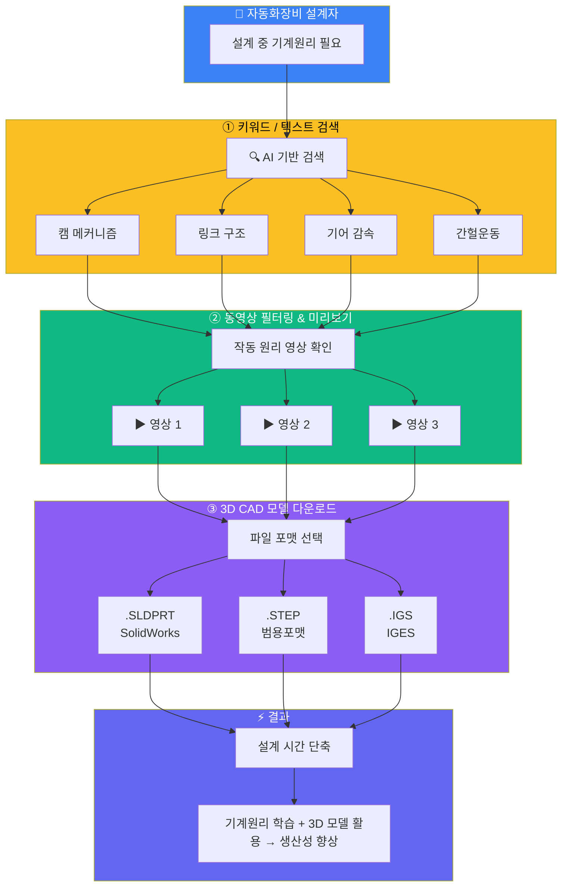
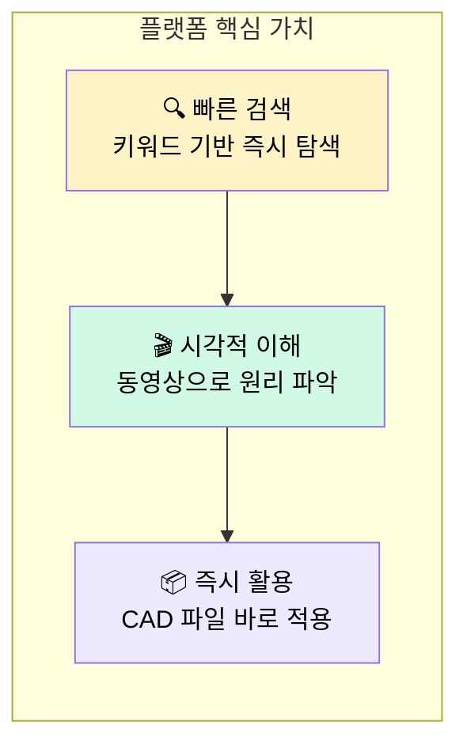
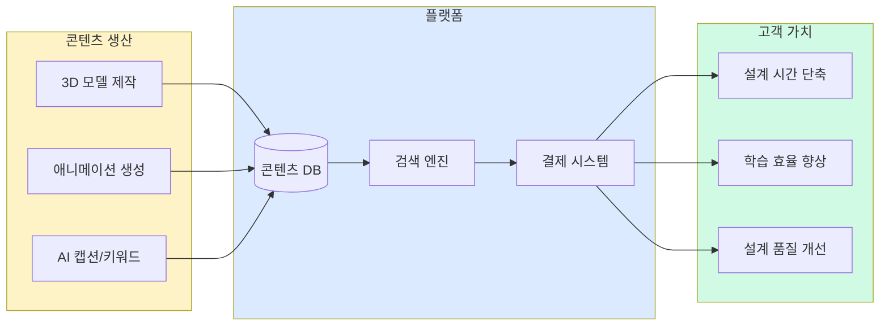

# 기계원리 콘텐츠 검색 플랫폼 - 서비스 흐름도

## Mermaid 다이어그램

```mermaid
flowchart TD
    subgraph USER["🔧 자동화장비 설계자"]
        A[설계 중 기계원리 필요]
    end

    subgraph STEP1["① 키워드 / 텍스트 검색"]
        B[🔍 AI 기반 검색]
        B1["캠 메커니즘"]
        B2["링크 구조"]
        B3["기어 감속"]
        B4["간헐운동"]
    end

    subgraph STEP2["② 동영상 필터링 & 미리보기"]
        C[작동 원리 영상 확인]
        C1["▶ 영상 1"]
        C2["▶ 영상 2"]
        C3["▶ 영상 3"]
    end

    subgraph STEP3["③ 3D CAD 모델 다운로드"]
        D[파일 포맷 선택]
        D1[".SLDPRT<br/>SolidWorks"]
        D2[".STEP<br/>범용포맷"]
        D3[".IGS<br/>IGES"]
    end

    subgraph RESULT["⚡ 결과"]
        E[설계 시간 단축]
        E1["기계원리 학습 + 3D 모델 활용 → 생산성 향상"]
    end

    A --> B
    B --> B1 & B2 & B3 & B4
    B1 & B2 & B3 & B4 --> C
    C --> C1 & C2 & C3
    C1 & C2 & C3 --> D
    D --> D1 & D2 & D3
    D1 & D2 & D3 --> E
    E --> E1

    style USER fill:#3b82f6,color:#fff
    style STEP1 fill:#fbbf24,color:#000
    style STEP2 fill:#10b981,color:#fff
    style STEP3 fill:#8b5cf6,color:#fff
    style RESULT fill:#6366f1,color:#fff
```

---

## 핵심 가치

```mermaid
flowchart LR
    subgraph VALUE["플랫폼 핵심 가치"]
        V1["🔍 빠른 검색<br/>키워드 기반 즉시 탐색"]
        V2["🎬 시각적 이해<br/>동영상으로 원리 파악"]
        V3["📦 즉시 활용<br/>CAD 파일 바로 적용"]
    end

    V1 --> V2 --> V3

    style V1 fill:#fef3c7,color:#000
    style V2 fill:#d1fae5,color:#000
    style V3 fill:#ede9fe,color:#000
```

---

## 비즈니스 흐름

```mermaid
flowchart LR
    subgraph INPUT["콘텐츠 생산"]
        I1[3D 모델 제작]
        I2[애니메이션 생성]
        I3[AI 캡션/키워드]
    end

    subgraph PLATFORM["플랫폼"]
        P1[(콘텐츠 DB)]
        P2[검색 엔진]
        P3[결제 시스템]
    end

    subgraph OUTPUT["고객 가치"]
        O1[설계 시간 단축]
        O2[학습 효율 향상]
        O3[설계 품질 개선]
    end

    I1 & I2 & I3 --> P1
    P1 --> P2 --> P3
    P3 --> O1 & O2 & O3

    style INPUT fill:#fef3c7
    style PLATFORM fill:#dbeafe
    style OUTPUT fill:#d1fae5
```

---

## 간단한 선형 흐름도

```mermaid
graph LR
    A[👤 설계자] -->|키워드 입력| B[🔍 검색]
    B -->|결과 필터링| C[🎬 동영상]
    C -->|선택| D[📦 다운로드]
    D -->|적용| E[⚡ 설계 완료]

    style A fill:#3b82f6,color:#fff
    style B fill:#fbbf24,color:#000
    style C fill:#10b981,color:#fff
    style D fill:#8b5cf6,color:#fff
    style E fill:#ef4444,color:#fff
```
